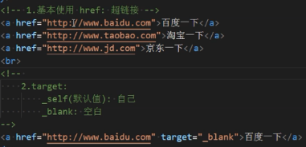
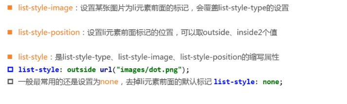
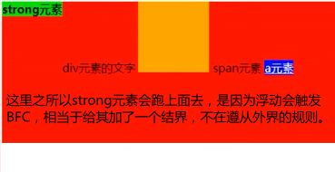

#                                        知识总结

## 一.行业常识

### 1.1.完善的软件系统（客户端/服务器）


​        目前软件开发体系经典结构：  B/S（浏览器/服务器）      C/S（客户端/服务器）

### 1.2.前端发展历程

​	世界上第一个网页诞生于上世纪90年代，方便时实浏览共享文件


​	网页显示过程：


​	网页的组成：


### 	1.3.浏览器内核

​	 浏览器内核又可以分成两部分：渲染引擎(layout engineer 或者 Rendering Engine)和 JS 引擎。渲染引擎 它负责取得网页的内容（HTML、XML、图像等等）、整理讯息（例如加入 CSS 等），以及计算网页的显示方式，然后会输出至显示器或打印机。浏览器的内核的不同对于网页的语法解释会有不同，所以渲染的效果也不相同。JS 引擎 则是解析 Javascript 语言，执行 javascript语言来实现网页的动态效果。最开始渲染引擎和 JS 引擎并没有区分的很明确，后来 JS 引擎越来越独立，内核就倾向于只指渲染引擎。有一个网页标准计划小组制作了一个 ACID 来测试引擎的兼容性和性能。内核的种类很多，如加上没什么人使用的非商业的免费内核，可能会有10多种，但是常见的浏览器内核可以分这四种：Trident、Gecko、Blink、Webkit，常见的浏览器内核：


​	有的APP中之所以能直接打开网页是因为内置了webview（大多数用的是webkit内核）。webkit是谷歌和苹果共同开发的，但是现在谷歌重新开发了blink。移动端的浏览器内核主要说的是系统内置浏览器的内核。Android手机而言，使用率最高的就是Webkit内核，大部分国产浏览器宣称的自己的内核，基本上也是属于webkit二次开发。iOS以及WP7平台上，由于系统原因，系统大部分自带浏览器内核，一般是Safari或者IE内核Trident的

​	通过以上浏览器的内核不同，我们知道他们工作原理、解析肯定不同，显示就会有差别。	

## 二.html基础

### 2.1.认识html

- HTML 指的是超文本标记语言 (**H**yper **T**ext **M**arkup **L**anguage)

- HTML 不是一种编程语言，而是一种标记语言 (markup language)

- 标记语言是一套标记标签 (markup tag)

  所谓超文本，因为它可以加入图片、声音、动画、多媒体等内容，不仅如此，它还可以从一个文件跳转到另一个文件，与世界各地主机的文件连接。


~~~html
<!DOCTYPE html>
标签这句话就是告诉我们使用哪个html版本，位于文档的最前面，用于向浏览器说明当前文档使用哪种
HTML 或 XHTML 标准规范，必需在开头处使用<!DOCTYPE>标签为所有的XHTML文档指定XHTML版本和类型，
只有这样浏览器才能按指定的文档类型进行解析。

HTML标签：根标签
作用所有HTML中标签的一个根节点。 最大的标签   

head标签： 文档的头部
文档的头部描述了文档的各种属性和信息，包括文档的标题、在 Web 中的位置以及和其他文档的关系等。
绝大多数文档头部包含的数据都不会真正作为内容显示给读者。

注意在head标签中我们必须要设置的标签是title

title标签： 文档的标题
作用：让页面拥有一个属于自己的标题。

<meta charset="UTF-8" /> 字符集
utf-8是目前最常用的字符集编码方式，常用的字符集编码方式还有gbk和gb2312。
gb2312 简单中文  包括6763个汉字
BIG5   繁体中文 港澳台等用
GBK包含全部中文字符    是GB2312的扩展，加入对繁体字的支持，兼容GB2312
UTF-8则包含全世界所有国家需要用到的字符

body标签：文档的主体  以后我们的页面内容 基本都是放到body里面的
body 元素包含文档的所有内容（比如文本、超链接、图像、表格和列表等等。）
~~~

### 2.2.标签分类

​	在HTML页面中，带有“< >”符号的元素被称为HTML标签，如上面提到的 &lt;HTML&gt;、&lt;head&gt;、&lt;body&gt;都是HTML骨架结构标签。所谓标签就是放在“< >” 标签符中表示某个功能的编码命令，也称为HTML标签或 HTML元素

1.双标签

```html
<标签名> 内容 </标签名>
```

该语法中“<标签名>”表示该标签的作用开始，一般称为“开始标签（start tag）”，“</标签名>” 表示该标签的作用结束，一般称为“结束标签（end tag）”。和开始标签相比，结束标签只是在前面加了一个关闭符“/”。

> ```html
> 比如 <body>我是文字  </body>
> ```

2.单标签

```html
<标签名 />
```

  单标签也称空标签，是指用一个标签符号即可完整地描述某个功能的标签。

> ```html
> 比如  <br />
> ```

标签的相互关系就分为两种：

1.嵌套关系

```html
<head>  <title> </title>  </head>
```

2.并列关系

```html
<head></head>
<body></body>
```

### 2.3.HTML标签的语义化

白话： 所谓标签语义化，就是指标签的含义。


为什么要有语义化标签

1. 方便代码的阅读和维护
2. 同时让浏览器或是网络爬虫可以很好地解析，从而更好分析其中的内容 
3. 使用语义化标签会具有更好地搜索引擎优化 

核心：合适的地方给一个最为合理的标签。

语义是否良好： 当我们去掉CSS之后，网页结构依然组织有序，并且有良好的可读性。

白话，一眼看去，就知道那个是重点，结构是什么，知道每块的内容是干啥的。

遵循的原则：先确定语义的HTML ，再选合适的CSS。

### 2.4.常用标签

#### 1.html的lang属性

~~~html
<html lang="en">   and  <html lang="zh-Ch">
~~~

html标签是html文档的根元素，一个文档只能有一个根元素，其它所有元素都是它的后代元素。w3c(万维网)建议为html添加一个lang属性，用于指定当前页面所使用的语言，当我们打开一个网页的时候，浏览器会检测html的lang属性，当浏览器发现网页使用的语言与浏览器设置的语言不一致的时候就会询问要不要翻译此网页。


#### 2.head标签及元数据

head标签里面存放的是元数据（metadata对网页存放数据的描述的数据），用于描述网页的各种信息比如字符编码、网页图标、网页标题、设置标签样式，引入网页的文件（js    css）。

~~~html
<meta charset="utf-8">
<title>网页标题</title>
<style> </style>
<link rel="stylesheet" href="style.css">
<link rel="shortcut icon" href="favicon.ico" type="image/x-icon">
<base href="">
<script src=""></script>
~~~


#### 3.排版标签

排版标签主要和css搭配使用，显示网页结构的标签，是网页布局最常用的标签。

##### 标题标签

为了使网页更具有语义化，我们经常会在页面中用到标题标签，HTML提供了6个等级的标题，即h1-h6.


注意：  h1 标签因为重要，尽量少用，不要动不动就向你扔了一个h1。 一般h1 都是给logo使用，或者页面中最重要标题信息

##### 段落标签( 熟记)

单词缩写：  paragraph  段落  [ˈpærəgræf]  

 在网页中要把文字有条理地显示出来，离不开段落标签，就如同我们平常写文章一样，整个网页也可以分为若干个段落，而段落的标签就是

```html
<p>  文本内容  </p>
```

是HTML文档中最常见的标签，默认情况下，文本在一个段落中会根据浏览器窗口的大小自动换行。

##### 水平线标签(认识)

单词缩写：  horizontal  横线    [ˌhɔrəˈzɑntl]    同上

在网页中常常看到一些水平线将段落与段落之间隔开，使得文档结构清晰，层次分明。这些水平线可以通过插入图片实现，也可以简单地通过标签来完成，<hr />就是创建横跨网页水平线的标签。其基本语法格式如下：

```html
<hr />是单标签
```

 在网页中显示默认样式的水平线。在实际项目中很少使用 ，几乎也不用  一般用div或者边框。

##### 换行标签(熟记)

单词缩写：  break   打断 ,换行

在HTML中，一个段落中的文字会从左到右依次排列，直到浏览器窗口的右端，然后自动换行。如果希望某段文本强制换行显示，就需要使用换行标签

```html
<br />
```

这时如果还像在word中直接敲回车键换行就不起作用了。

##### 文本格式化标签(熟记)

在网页中，有时需要为文字设置粗体、斜体或下划线效果，这时就需要用到HTML中的文本格式化标签，使文字以特殊的方式显示。


 b  i  s  u   只有使用 没有 强调的意思       strong   em  del   ins  语义更强烈。

##### 字符实体----特殊字符标签 （理解）


##### 注释标签

在HTML中还有一种特殊的标签——注释标签。如果需要在HTML文档中添加一些便于阅读和理解但又不需要显示在页面中的注释文字，就需要使用注释标签。其基本语法格式如下：

```html
    <!-- 注释语句 -->   ctrl + / 
```

注释内容不会显示在浏览器窗口中，但是作为HTML文档内容的一部分，也会被下载到用户的计算机上，查看源代码时就可以看到。

##### 标签属性

属性就是特性 比如 手机的颜色 手机的尺寸 

使用HTML制作网页时，如果想让HTML标签提供更多的信息，可以使用HTML标签的属性加以设置。其基本语法格式如下：

```html
<标签名 属性1="属性值1" 属性2="属性值2" …> 内容 </标签名>
```

在上面的语法中，

1.标签可以拥有多个属性，必须写在开始标签中，位于标签名后面。

2.属性之间不分先后顺序，标签名与属性、属性与属性之间均以空格分开。

3.任何标签的属性都有默认值，省略该属性则取默认值。

采取  键值对 的格式   key="value"  的格式  

比如:  

```html
<hr width="400" />
```

属性  是 宽度           值    是 400 

*`几乎所有的元素都有 id title 属性`

#### 4.SEO和h元素的关系


#### 5.div span标签(重点)

div  span    是没有语义的     是我们网页布局主要的2个盒子     css+div

div 就是  division  的缩写   分割， 分区的意思  其实有很多div 来组合网页。

span, 跨度，跨距；范围     用于对普通的文本进行归类，便于修改样式。

语法格式：

```html
<div> 这是头部 </div>    <span>今日价格</span>
```

span元素常用的场景：

#### 6.img标签&路径问题（相对/绝对路径）


网页中组成图像的最小独立单位是像素px（pixel）


#### 7.a标签（超链接）的使用



##### 锚点定位：

```html
<a href="#跳转1">跳转1</a>
<a href="#跳转2">跳转2</a>
<h3 id="跳转1">跳转1</h3>
<h3 id="跳转2">跳转2</h3>
```

当需要跳转到页面某一个位置时，就可以利用锚点定位，利用元素的ID属性 通过超链接跳转。

##### a元素的伪链接：


#### 8.iframe的使用

网页里面嵌套网页：


iframe嵌入a标签 &iframe嵌入iframe的使用：


#### 9.base元素的使用

~~~html
<base href="https://www.baidu.com" target="_blank">
</head>
<body>
          
          <a href="https://www.baidu.com">百度一下</a>
          <a href="">百度一下</a>
          <a href="">百度一下</a>

</body>
</html>
~~~

当base元素和a配合使用的时候，如果输入的链接相同，则可以抽取相同内容在base标签中输入；如果页面中所有的链接都需要在新的标签页中打开的时候 可以设置target属性。

#### 10.URL详解


常见的URL协议：


## 三.CSS基础

### 1.CSS初识

CSS(Cascading Style Sheets)  层叠样式表（级联样式表），主要用于设置HTML页面中的文本内容（字体、大小、对齐方式等）、图片的外形（宽高、边框样式、边距等）以及版面的布局等外观显示样式。

css发展：


### 2.引入CSS的方式


~~~html
 <link rel="stylesheet" href="../css/1.引入css.css">
    <style>
        .ele-style {
           width: 300px;
           height: 300px;
           background-color: chocolate;
        }
    </style>
</head>
<body>
        <!-- 行内样式表 -->
        <div style="text-align: center;background-color: burlywood;width: 300px;height: 300px;">测试1</div>
        <!-- 文档样式表 -->
        <div class="ele-style">测试2</div>
        <!-- 外部样式表  -->
        <div class="outlin-style">测试3</div>
~~~

css文件编码：

~~~css
@charset "utf-8";
~~~

其它引入css的方式（在框架中用得比较多，但在其它场景不建议用 因为效率比 link 引入低）

~~~html
@import url(文件路径)

用法一：在文档样式表在引入
<style>
    	@import url(文件路径);
</style>
用法二：在css文件引入
@import url(路径);
~~~

###3.CSS选择器（selector）


#### 1.通配符选择器

~~~css
    应用到所有元素  但是一般不建议用 因为效率很低
* {
     color:red;
     background:pink;
}
~~~

#### 2.标签（元素）选择器

~~~html
<style>
        h1 {
           background-color: chocolate;
        }
</style>
<body>
        <h1>fgdcyy</h1>
</body>
~~~

#### 3.类名选择器

~~~html
<style>
  .box1 {
           width: 300px;
           height: 300px;
           line-height: 300px;
           text-align: center;
           background-color: chocolate;
        }
    </style>
</head>
<body>
        <div class="box1">fgdcyy</div>
</body>
~~~

  我们可以给标签指定多个类名，从而达到更多的选择目的。

1. 样式显示效果跟HTML元素中的类名先后顺序没有关系,受CSS样式书写的上下顺序有关。

2. 各个类名中间用空格隔开。

3. id选择器和类选择器区别：

   W3C标准规定，在同一个页面内，不允许有相同名字的id对象出现，但是允许相同名字的class。

   类选择器（class） 好比人的名字，  是可以多次重复使用的， 比如  张伟  王伟  李伟  李娜

   id选择器     好比人的身份证号码，  全中国是唯一的， 不得重复。 只能使用一次。

#### 4.id选择器

~~~html
<style>
        #newprice {
           background-color: chocolate;
        }
    </style>
</head>
<body>
        <span id="newprice">fgdcyy</span>
</body>
~~~

#### 5.属性选择器


#### 6.后代（组合）选择器


#### 7.子代选择器


#### 8.交集选择器


#### 9.并集选择器


#### 10.相邻兄弟选择器


#### 11.全体兄弟选择器


#### 12.伪类链接选择器（重要）


#### 13.结构伪类选择器（重要）

~~~html
   <style>
        /* nth-child 用于选择子代元素 n 代表自然数 也可以是负数*/
        :nth-child(3) {      /*当取值为3的时候 代表选择子代第三个元素 这里包含body元素 */
          background-color: rgb(218, 208, 208);
        }
        p:nth-child(2) {      /* 这里表示交集选择器 必须同时满足两个条件*/
          background-color: rgb(182, 141, 100);
        }
        :nth-child(2n) {      /*选择子代元素的第偶数个元素 也可以用e ven 表示*/
          color: darkgray;
        }
        :nth-child(2n-1) {  /*选择子代元素中的第奇数个元素 也可以用 odd 表示*/
          color:red;   
        }
         :nth-child(-n+5) {  /*选择子代元素的前5个元素  经常应用在项目中*/
				 color:pink;
         }
         /*如果加上 last 则代表从后面往前面查找 其它属性不变 只是方向改变*/
         :nth-last-chlid(-n+2) { /*选择子代元素的倒数2个元素*/
           background-color:pink; 
         }
    </style>
</head>
<body>  
      <div>
        <p>测试1</p>
        <p>测试2</p>
        <p>测试3</p>
        <p>测试4</p>
        <p>测试5</p>
        <p>测试6</p>
      </div>
      <p>
        <span>测试1</span>
        <span>测试2</span>
        <span>测试3</span>
        <span>测试4</span>
      </p>
      <ul>
        <li>测试1</li>
        <li>测试2</li>
      </ul> 
~~~


~~~html
<style>
 
        :nth-of-type(2) {   /*用于选择同种类型的元素*/
            color: royalblue;
        }
        p:nth-of-type(3) { /*所有p标签中选择第三个P标签*/
            background-color: pink;
        }
        span:nth-of-type(2) { /*所有span标签中选择第二个span标签*/
            color: plum;   
            font-size: 30px;
        }
        p:nth-last-of-type(3) {    /*在所有p标签中选择倒数第三个P标签*/
            background-color: purple;
        }
    </style>
</head>
<body>
    <div>
        <p>p标签1</p>
        <p>p标签2</p>
        <p>p标签3</p>
        <p>p标签4</p>
        <p>p标签5</p>
        <p>p标签6</p>
        <span>span标签1</span>
        <span>span标签2</span>
        <span>span标签3</span>
        <span>span标签4</span>
        <span>span标签5</span>
    </div>
~~~


#### 14.伪元素选择器


### 4.CSS文本属性

#### 1.text-decoration 


#### 2.text-transform 


#### 3.text-indent 


#### 4.text-align 


#### 5.letter-spacing&word-spacing


### 5.字体属性

#### 1.font-size


#### 2.font-family


#### 3.font-weight


#### 4.font-style


#### 5.font-varient


#### 6.font的缩写属性


### 6.line-height

ine-height属性用于设置行间距，就是行与行之间的距离，即字符的垂直间距，一般称为行高。line-height常用的属性值单位有三种，分别为像素px，相对值em和百分比%，实际工作中使用最多的是像素px，一般情况下，行距比字号大7.8像素左右就可以了。


 行高 = 文字的高度 + 行距


### 7.CSS特性

#### 1.继承

​         


#### 2.层叠

所谓层叠性是指多种CSS样式的叠加。是浏览器处理冲突的一个能力,如果一个属性通过两个相同选择器设置到同一个元素上，那么这个时候一个属性就会将另一个属性层叠掉，比如先给某个标签指定了内部文字颜色为红色，接着又指定了颜色为蓝色，此时出现一个标签指定了相同样式不同值的情况，这就是样式冲突。  样式冲突，遵循的原则是就近原则。 那个样式离着结构近，就执行那个样式。样式不冲突，不会层叠。

#### 3.权重（优先级）

定义CSS样式时，经常出现两个或更多规则应用在同一元素上，这时就会出现优先级的问题。

~~~html
继承样式的权重为0。即在嵌套结构中，不管父元素样式的权重多大，被子元素继承时，他的权重都为0，
也就是说子元素定义的样式会覆盖继承来的样式。

行内样式优先。应用style属性的元素，其行内样式的权重非常高，可以理解为远大于100。
总之，他拥有比上面提高的选择器都大的优先级。

权重相同时，CSS遵循就近原则。也就是说靠近元素的样式具有最大的优先级，或者说排在最后的样式优先级最大。

CSS定义了一个!important命令，该命令被赋予最大的优先级。也就是说不管权重如何以及样式位置的远近，
!important都具有最大优先级。
~~~

关于CSS权重，我们需要一套计算公式来去计算，这个就是CSS特殊性（CSS Specificity），它是一个衡量CSS值优先级的一个标准 具体规范入如下：


权重是可以叠加的 比如：

~~~html
div ul  li   ------>      0,0,0,3
.nav ul li   ------>      0,0,1,2
a:hover      -----—>      0,0,1,1
.nav a       ------>      0,0,1,1   
#nav p       ----->       0,1,0,1
~~~

总结优先级：

~~~html
权重数位之间没有进制 比如说： 0,0,0,5 + 0,0,0,5 =0,0,0,10 而不是 0,0, 1, 0， 
所以不会存在10个div能赶上一个类选择器的情况。
~~~

### 8.列表   list-style

  


#### list-style

~~~html
<style>
           /* list-sytle-type 用于设置li标签前面的样式 */
          ul {
              /* list-style-type: decimal;   设置li前面样式为数字*/ 
              /* list-style-type: disc;      默认状态  设置li前面样式为实心圆点*/
              /* list-style-type: decimal-leading-zero; 设置li前面样式为带0的数字 */
              /* list-style-type:none; 去掉li前面的样式*/
              /* list-style: none;           去掉li前面的样式*/
              /* list-style-type: square;    设置li前面样式为实心矩形 */
              还有很多其他样式。。。
          }
    </style>
</head>
<body>
    <ul>
        <li>北京</li>
        <li>上海</li>
        <li>广州</li>
    </ul>
~~~



### 9.表格元素


#### 1.表格的基本使用

~~~html
<style>
         table {
             border: 1px solid red ; /*设置表格的边框*/
             text-align: center;        /*将表格中的内容居中*/
             border-collapse: collapse; /* 重点 ：将单元格边框进行合并*/
             margin: 0 auto;          /*将表格居中显示*/
         }
         td ,th {
            border: 1px solid pink ;  /*设置单元格的边框*/
            padding: 5px 20px;
         }
         caption {
             font-weight: bold;
             font-size: 20px;
             margin-bottom: 10px;
         }
         tbody>:nth-child(2n) {
             background-color: bisque;
         }
    </style>
</head>
<body>
   <table> 
       <caption>用户信息</caption>  <!-- 和表格一起使用 用来设置表格标题  -->
       <thead>                      <!-- 和表格一起使用 用来设置表格头部  -->
            <tr>        
                <th>姓名</th>       <!-- 和表格一起使用 用来设置表格的第一行 表头  -->
                <th>年龄</th>
                <th>性别</th>
            </tr>
       </thead>
       <tbody> <!-- 通常我们会在表格内容外面加上一个tbody 表示表格主体内容 -->
        <tr>
            <td>小明</td>
            <td>20</td>
            <td>男</td>
        </tr>
        <tr>
            <td>小码</td>
            <td>25</td>
            <td>男</td>
      </tr>    
       </tbody>
   </table>
~~~


#### 2.表格单元格的合并

  row ：行       ；          column ：列

~~~html
table {      margin: 0 auto;
             border: 1px solid #ca4b4b;
             border-collapse: collapse;
             text-align: center;
         }
         caption {    border: 1px 1px 1px 0px solid #ca4b4b;
         }
         td,th {   border: 1px solid #ca4b4b;
         }
    </style>
----------------------------------------------------------------------
    <table>
        <caption>课程表</caption>
        <thead>
            <th></th>
            <th>星期1</th>
            <th>星期2</th>
            <th>星期3</th>
            <th>星期4</th>
            <th>星期5</th>
        </thead>
        <tbody>
           <tr>
               <td colspan="2">单元格1</td>     <!--colspan 用于跨列合并单元格 合并以后删掉相邻的单元格 -->
               <!-- <td>单元格2</td> -->
               <td>单元格3</td>
               <td>单元格4</td>
               <td>单元格5</td>
               <td>单元格6</td>
           </tr>
           <tr>
            <td>单元格1</td>
            <td>单元格2</td>
            <td rowspan="2">单元格3</td>        <!--rowspan 用于跨行合并单元格 合并以后删掉相邻的单元格 -->
            <td>单元格4</td>
            <td>单元格5</td>
            <td>单元格6</td>
            </tr>
            <tr>
                <td>单元格1</td>
                <td>单元格2</td>
                <!-- <td>单元格3</td> -->
                <td>单元格4</td>
                <td>单元格5</td>
                <td>单元格6</td>
            </tr>
~~~


#### 3.border-spacing(了解)


### 10.表单元素（重点）

#### 1.表单元素的基本使用


#### 2.fieldset和legend的使用


#### 3.输入框type的其它属性值

~~~html
 <style>
       fieldset {
           width: 350px;
       }
    </style>
</head>
<body>
     <form action="">
        <fieldset>
            <legend>选填信息</legend>
            <div>
               <span>照片：</span>
               <input type="file">    <!--文件选择  -->
           </div>
          <div>
               <span>性别：</span>
               <input type="radio" name="sex">男   <!-- 单选框 -->
               <input type="radio" name="sex">女   <!-- 单选框 将两个单选框的name值设置相同，代表互斥，
                                                        一个选中了另一个就不能选中-->
          </div>
          <div>
              <span>爱好：</span>
              <input type="checkbox"> 吃      <!-- 复选框 -->    
              <input type="checkbox"> 喝
              <input type="checkbox"> 玩 
              <input type="checkbox"> 乐 
             </div>
           <div>
               <span>学历：</span> 
               <select name="" id="">     <!-- 下拉选择  option 代表具体选择的值 -->  
                   <option value="">小学</option>
                   <option value="">中学</option>
                   <option value="">高中</option>
                   <option value="">大学</option>
               </select>
           </div>
           <div>
               <span>简介：</span>
               <textarea name="" id="" cols="30" rows="10"></textarea>
           </div>
        </fieldset>
        <input type="reset" value="重置">  <!-- 重置按钮要生效 type属性值必须是reset 而且必须是在同一个表单下 -->
        <input type="submit">

     </form>
</body>
~~~


#### 4.input的其它属性


#### 5.布尔属性


#### 6.按钮的两种实现方式


#### 7.input标签和label标签的关系

~~~html
<div>
        <label for="male">男</label>
        <!-- label标签用于自动获取焦点 点击外部的文字即可跳转到输入框内 
            for属性用于指定获取谁的焦点，通过指定标签的id属性 -->
        <input type="radio" id="male" name="sex" checked>
        <label for="female">女</label>
        <input type="radio" id="female" name="sex">
    </div>
    <div>
        <span>爱好：</span>
        <label for="eat">eat</label>
        <input type="checkbox" id="eat">
        <label for="drink">drink</label>
        <input type="checkbox" id="drink">
    </div>
~~~


#### 8.input的外边框——outline


#### 9.textarea文本域的属性


#### 10.select和option的属性


### 11.表单提交

#### 1.传统表单提交和前后端分离


#### 2.input的name和value属性


~~~HTML
<div>
      <span>性别：</span>
      <label for="">男</label>
      <input type="radio" id="man" checked name="sex" value="man">
      <label for="woman">女</label>
      <input type="radio" id="woman" name="sex" value="woman">
</div>
~~~


事实上我们在input输入框中填写的数据就是具体的value值，传到服务器的也是value值。

#### 3.form提交的请求方式GET——POST


#### 4.form的target属性和accept-charset


案例:

~~~html
<style>
        .outline {
            margin: auto;
            width: 400px;
            height: 500px;
            text-align: left;
        }
        fieldset {
            margin: 20px auto;
            width: auto;
        }
        textarea {
            width: 150px;
            height: 100px;
            resize: none;
        }
    </style>
</head>
<body>
    <div class="outline">
        <form action="http://www.baidu.com/s" method="POST" enctype="multipart/form-data">
            <fieldset>
                <legend>基本信息</legend>
                <div>
                    <label for="phone">手机：</label>
                    <input type="text" id="phone">
                </div>
                <div>
                    <label for="pwd">密码：</label>
                    <input type="password" id="pwd" name="pwd">
                </div>
                <div>
                    <label for="yzm">验证码：</label>
                    <input type="text" id="yzm" name="code">
                    <button> 获取验证码 </button>
                </div>
            </fieldset>
            <fieldset>
                <legend>兴趣爱好</legend>
                <div>
                    <span>照片：</span>
                    <input type="file" name="photo">
                </div>
                <div>
                    <span>性别：</span>
                    <label for="">男</label>
                    <input type="radio" id="man" checked name="sex" value="man">
                    <label for="woman">女</label>
                    <input type="radio" id="woman" name="sex" value="woman">
                </div>
                <div>
                    <span>爱好：</span>
                    <label for="eat">吃</label>
                    <input type="checkbox" id="eat" name="like">
                    <label for="drink">喝</label>
                    <input type="checkbox" id="drink" name="like">
                    <label for="play">玩</label>
                    <input type="checkbox" id="play" name="like">
                </div>
                <div>
                    <label for="education">学历：</label>
                    <select name="education" id="education">
                        <option value="0">小学</option>
                        <option value="1">初中</option>
                        <option value="2">高中</option>
                        <option value="3" selected>大学</option>
                        <option value="4">硕士</option>
                        <option value="5">博士</option>
                    </select>
                </div>
               <div>
                   <label for="info">补充:</label>
                   <textarea name="info" id="info" ></textarea>
               </div>
            </fieldset>
                 <input type="reset" name="重置">
                 <input type="submit" name="提交">  
        </form>
    </div>
~~~


### 12.元素类型的划分方式

#### 1.块级元素、行内级元素


#### 2.替换、非替换元素


### 13.display（行内块转换）属性

#### 1.display属性的四个取值


#### 2.案例


~~~html
<style>
           .email {
               margin: auto;
               width: 150px;
               text-align: center;
               border-radius: 5%;
           }
           .header {
               background-color: rgb(161, 147, 147);
               border-radius: 5px;
           }
           ul {
               list-style: none;
               margin: 0;
               padding: 0;
           }
           a {
               text-decoration: none;
               color: #000;
           }
          .email ul {
              display: none; /*默认情况下隐藏元素*/
          }
          .email:hover ul {
              display: block;       /*当鼠标进入email的范围的时候,ul 里面的元素显示*/
          }
           .email ul li:hover {
               background-color: rgb(182, 144, 95);
           }
          .email ul li a {
              display: block;  /*当鼠标进入li 里面的时候需要在进入到a里面 鼠标才会显示成小手  没有用户体验
                                        所以这里将 a标签转化成块级元素 独占整个一行*/
          } 
        </style>
</head>
<body>
        <div class="email">
            <div class="header">邮箱</div>
            <ul class="email-list">
                <li><a href="#">QQ邮箱</a></li>
                <li><a href="#">126邮箱</a></li>
                <li><a href="#">139邮箱</a></li>
            </ul>
        </div>
</body>
~~~


~~~html
<style>
            ul {
                list-style: none;
                margin: 0;
                padding: 0;
            }
            a {
                text-decoration: none;
                color: #000;
            }
            .page-list ul li {
                display: inline-block;
            }
            .page-list ul li a {
                display: inline-block;
                background:rgba(61, 54, 54, 0.2);
                width: 34px;
                height: 34px;
                border: #ccc solid 2px;
                border-radius: 6px;
                line-height: 34px;
                text-align: center;
                font-size: 14px;
                margin-right: 5px;
            }
            .page-list ul li a:hover {  /*鼠标经过a的时候的状态*/
                border-color: rgb(211, 138, 50);
                background-color: rgb(216, 207, 195);
            }
            .page-list .prev a ,.page-list .next a{  /*单独给下一页 、上一页设置宽度 实际开发中也有可能是
                                                       设置左右的内边距把外面的盒子撑开的*/
                width: 80px;
            }
            .page-list .active {       /*给选中（当前页）的页码添加样式 实际开发中会单独设计一个点击后的样式
                                        然后利用js 动态的把这个样式添加到选中页*/
                background-color: #fff;
                border: 0;
                font-size: 16px;
                font-weight: bold;
                cursor: initial;        /*设置鼠标经过时的样式但是这种做法不好，因为这时候里面的 a 依然可以点击
                                          应该在利用js给当前页添加class的时候 同时把href删掉*/
            }
            .page-list .active:hover {
                background-color: transparent;  /*设置背景透明*/
            }
        </style>
</head>
<body>
      <div class="page-list">
          <ul>
              <li class="prev"><a href="#">&lt; 下一页</a></li>
              <li><a href="#">1</a></li>
              <li><a href="#">2</a></li>
              <li><a class="active" >3</a></li>
              <li><a href="#">4</a></li>
              <li><a href="#">5</a></li>
              <li><a href="#">6</a></li>
              <li><a href="#">7</a></li>
              <li><a href="#">8</a></li>
              <li><a href="#">9</a></li>
              <li><a href="#">10</a></li>
              <li class="next"><a href="#">上一页 &gt;</a></li>
          </ul>
      </div>
</body>
~~~

### 14.visibility（可见性）属性


### 15.overflow（溢出）属性


### 16.行内级元素之间的空格


### 17.元素之间的包含关系


### 18.Box盒子模型（重点）


#### 1.content相关属性


#### 2.padding相关属性


#### 3.word-break（单词打断）属性


#### 4.box-sizing（盒子大小）


### 19.margin值传递的相关属性


#### 1.上下margin的传递-父子关系

margin传递的产生的原因是父级的高度没有被自动撑开 


~~~html
<style>
            .box {
                width: 200px;
                height: 200px;
                background-color: rgb(39, 34, 28);
            }
            .box1 {
                width: 300px;
                /* 解决margin传递问题的方法1,给父盒子的顶部加一个边框*/
                /* border-top: 1px solid rgb(2, 2, 2); */
                /* 解决margin传递问题的方法2,给父盒子设置一个padding-top*/
                /* padding-top: 2px; */
                /* 解决margin传递问题的方法3,触发BFC*/
                overflow: hidden;
                background-color: bisque;
            }
            .inline {
                width: 100px;
                height: 100px;
                background-color: rgb(146, 45, 45);
                /*当给子盒子设置一个margin-top的时候，发现值被传递到了父盒子的身上,这是css内部的设计问题 因为父盒子的高度没有被自动撑开*/
                margin-top: 10px;
            }
        </style>
</head>
<body>
      <div class="box"></div>
      <div class="box1">
          <div class="inline"></div>
      </div>
~~~

#### 2.上下margin的折叠-兄弟关系

浏览器为了保证列表的整齐，上下margin产生了叠加 


### 20.border属性


#### 1.border边框的各种形状

设置边框为矩形：


~~~html
<style>
           div {
               width: 100px;
               height: 100px;
               margin: auto;
               background-color: rgb(207, 176, 176);
               border-left:20px solid rgb(202, 67, 67);
               border-top: 20px solid #000;
           }
        </style>
</head>
<body>
      <div></div>
~~~

边框是三角形：


~~~html
<style>
           div {
               width: 0;
               height: 0;
               margin: auto;
               border-left:100px solid rgb(202, 67, 67);
               border-top: 100px solid #000;
           }
        </style>
~~~


~~~html
<style>
           div {
               width: 0;
               height: 0;
               margin: auto;
               border-left:100px solid rgb(202, 67, 67);
               border-top: 100px solid rgb(212, 194, 194);
               border-right: 100px solid rgb(77, 37, 37);
               border-bottom: 100px solid rgb(27, 196, 117);
           }
        </style>
~~~


~~~html
<style>
           div {
               width: 0px;
               height: 0px;
               margin: auto;
               border-width: 100px;
               border-style: solid;
               border-top-color: rgb(168, 51, 51);
               border-right-color: transparent;
               border-left-color: transparent;
               border-bottom-color: transparent;
           }
        </style>
~~~


~~~html
<style>
           div {
               width: 0px;
               height: 0px;
               margin: auto;
               border-width: 100px;
               border-style: solid;
               border-top-color: rgb(168, 51, 51);
               border-right-color: rgb(168, 51, 51);
               border-left-color: transparent;
               border-bottom-color: transparent;
           }
        </style>
~~~

#### 2.行内元素的margin-padding-border的注意点


#### 3.圆角效果border-radius


### 21.元素的外部效果（轮廓、阴影）

#### 1.outline属性


#### 2.box-shadow（阴影）


~~~html
 <style>
            .outline {
                width: 250px;
                margin: 100px auto 0;
                border: 1px solid rgb(67, 21, 233);
                border-radius: 5px;
            }
           .top {
               height: 100px;
               text-align: center;
           }
           .center {
               height: 250px;
           }
           .top span {
               color: black;
               font-weight: bold;
               line-height: 100px;
               display: block;
           }
           .outline:hover {
               box-shadow: 0 2px 2px 2px rgb(193, 193, 230);
           }
           .outline:hover span{
               background-color: rgba(0, 176, 227, 0.788);
               color: aliceblue;
           }
        </style>
</head>
<body>
      <div class="outline">
          <div class="top">
              <span>更多配置</span>
          </div>
          <div class="center"></div>
      </div>
~~~

#### 3.text-shadow


### 22.元素居中的实现（重点）

#### 1.水平居中


#### 2.margin水平居中的原理


### 23.background背景属性


#### 1.CSS-Sprite（精灵图）的认识和作用


案例：


~~~html
<style>
            div {
                margin: 0 auto;
                background-color: antiquewhite;
                width: 1000px;
            }

            ul {
                list-style: none;
                height: 42px;
            }
            h5,ul,li,p {
                padding: 0;
                margin: 0;
            }
            li,h5,p {
                display: inline-block;  /*此时会出现背景图的顶部向下靠的问题
                                   因为它是基线对齐，如果用浮动布局就不会出现这种情况*
                /* float: left; */
                vertical-align: middle; /*解决基线对齐的问题*/
            }
            div ul li {
                /* width: 180px; */
                padding-left: 46px;
            }
            div ul li p {
                font-size: 16px;
                height: 42px;
                color: #444;
                line-height: 42px;
                font-weight: bold;
                margin-left: 5px;
            }
            div ul li h5 {
                width: 36px;
                height: 42px;
                background-repeat: no-repeat;
                background-image: url("../images/23f3ddf914b1b527d0429a3d713cfe3a.png");
                background-position: 0 -192px;
                text-indent: -999px; /*通过设置文本的缩进值来实现隐藏的效果*/
            }
            div ul .kuai h5 {
                background-position: -41px -192px;
            }
            div ul .hao h5 {
                background-position: -82px -192px;
            }
            div ul .sheng h5 {
                background-position: -123px -192px;
            }
        </style>
</head>
<body>
      <div>
          <ul>
              <li>
                  <h5>多</h5> 
                  <p>品类齐全，轻松购物</p>
              </li>
              <li class="kuai">
                <h5>多</h5>
                <p>品类齐全，轻松购物</p>
              </li>
              <li class="hao">
                <h5>多</h5>
                <p>品类齐全，轻松购物</p>
              </li>
              <li class="sheng">
                <h5>多</h5>
                <p>品类齐全，轻松购物</p>
              </li>
          </ul>
      </div>
~~~

注意点：


#### 2.背景居中


案列：


#### 3.background-attachment的使用


#### 4.background的缩写属性


#### 5.img和background-image的选择


### 24.光标的展示样式-cursor


### 25.position------定位


#### 1.标准流（normal flow）


#### 2.static——静态定位


#### 3.relative——相对定位


案列：


案列：


~~~HTML
<style>
            body {
                padding: 0;
                margin: 0;
            }
            div {
                height: 200px;
                width:  480px;
                margin: 100px auto;
                border: 1px solid red;
                background-color: aliceblue;
                overflow: hidden; /*溢出隐藏*/
            }
            div img {
                position: relative;
                /*图片居中的步骤1：先向左移动图片自己的一半*/
                /*这里有一个缺点，就是left的距离是写死的，不适合实际的需求，而元素需要移动的位置
                  是相对于元素自己之前的位置，
                   正好可以利用这一点*/
                /* left:-495px;  */
                transform: translate(-50%);
                /*图片居中的步骤2：在向右移动父元素的一半*/
                margin-left:50%;  /*这里的百分比是相对于它的包含块儿的*/
            }
        </style>
</head>
<body>
      <div>
          
      </div>
</body>
~~~

#### 4.absolute——绝对定位、子绝父相


案例：


~~~html
 <style>
            /* reset css */
            a {
                text-decoration: none;
                color: rgb(36, 31, 31);            
            }
            ul {
                margin: 0;
                padding: 0;
                list-style: none;
            }
            .outline {
                width: 800px;
                margin: auto;
            }
            img {
                vertical-align: middle;
            }
            /* 样式重置 */
            .inline {
               position: relative;
               display: inline-block;
               background-color: aliceblue;
               
           }
           .inline ul {
               position:absolute;
               bottom: 30px;       /*此时发现底部多出来一部分区域 需要设置img 的vertical*/
               width: 300px;
               text-align: justify; /*让里面的文字均分剩下的空余的部分，不过这个属性对
                                      最后一行文字无效，因此最后一行需要单独设置*/
               text-align-last: justify;
               /* 居中显示 在这有一个前提，需要给left 和right 设置一个值 因为默认是auto
                  所以浏览器无法知道具体向何处移动 */
                  left: 0;
                  right: 0;
                  margin: 0 auto;
           }
           .inline ul li {
               display: inline-block;
               margin-bottom: 15px;
             
           }
           .inline ul li a {
                display: inline-block;  /*为了让a能设置大小，所以需要装化成块级元素 
                                          撑起li标签 使其能够换行*/
                width: 80px;
                height: 40px;
                font-size: 12px;
                border: 1px solid #333;
                border-radius: 40px;
                text-align: center;
                text-align-last: center;  /*因为从父元素那里继承过来了justify属性，因此需要重叠掉它*/
                line-height: 40px;  /*垂直方向居中*/
                background-color: #fff;
                box-shadow: 0 0 0 1 rgba(63, 60, 59,.1);
           }
           .inline ul li a:hover {
                background-color: rgba(15, 14, 14, 0.2);
                color: red;
           }
        </style>
</head>
<body>
      <div class="outline">
          <div class="inline">
           <a href="#">
            
           </a>
                <ul>
                    <li><a href="#">精致护肤</a></li>
                    <li><a href="#">人气面膜</a></li>
                    <li><a href="#">大牌彩妆</a></li>
                    <li><a href="#">防晒修护</a></li>
                    <li><a href="#">迷人香氛</a></li>
                    <li><a href="#">面部精华</a></li>
                </ul>
          </div>
      </div>
~~~

案例：


~~~html
<style>
           body{
               margin: 0;
               padding: 0;
           }
           img {
               margin: 0;
               padding: 0;
               vertical-align: middle;
           }
           .outline {
                margin: auto;
                width: 500px;
            }
           a {
               padding: 0;
               margin: 0;
               text-decoration: none;
               color: black;
           }
           .phone {
               position: relative;
           }
           .phone > span {
               font-size: 16px;
           }
           .phone .app {
               /* 默认隐藏 */
               display: none;
               position: absolute;
               top:30px;
               border: 1px solid rgb(216, 192, 192);
               /* padding: 2px 2px 0 2px; */
               /*使元素居中*/
               transform: translate(-50%);
               margin-left: -50%;
           }
           .app span {
               display: block;
               text-align: center;
               font-size: 14px;
               margin-bottom: 4px;
           }
           /* 添加箭头效果 利用边框 再进行翻转 */
           .arow {
                position: absolute;
                top:-7px;
                /*使元素自动居中*/
                left: 0;
                right: 0;
                margin:0 auto;
                width: 10px;
                height: 10px;
                border-left: 1px solid rgb(216, 192, 192);
                border-top: 1px solid  rgb(216, 192, 192);
                transform: rotate(45deg);
                background-color: #fff;
           }
           .phone span:hover+.app{
               display: inline;
           }
        </style>
</head>
<body>
      <div class="outline" >
            <a class="phone" href="#">
               <span>手机考拉</span>
               <span class="app ">
                   <span class="arow"></span>
                   
                   <span>下载APP</span>
                   <span>领取1000元新人礼包</span>
               </span>
            </a>
      </div>
      <div class="arow">
      </div>
~~~

#### 5.fixed——固定定位


案例：


~~~html
     <style>
            body {
                margin: 0;
                padding: 0;
            }
            .outline {
                position: fixed;
                top: 200px;
                right: 100px;
                border: 1px solid #ececec;
            }
            .outline a {
                display: block;
                text-decoration: none;
                width: 64px;
                height: 56px;
                border-bottom: 1px solid #ececec;
                text-align: center;
                padding-top: 12px;
            }
            .outline a i {
                display: block;
                width: 20px;
                height: 20px;
                background-color: aquamarine;
                margin: 0 auto 3px;
            }
            .outlin a.bottom {
                border-bottom: none;
            }
            .outline a:hover {
                color: brown;
                background-color: rgb(230, 222, 222);
            }
            .outline a:hover i {    /*当鼠标进入a标签的时候 i 的背景变化*/
                background-color: red;
            }
        </style>
</head>
<body>
      <div class="outline">
          <a href="">
             <i></i>
             <span>签到</span>
          </a>
          <a href="">
            <i></i>
            <span>购物车</span>
         </a>
         <a href="">
            <i></i>
            <span>APP</span>
         </a>
         <a class="bottom" href="">
            <i></i>
            <span>TOP</span>
         </a>
      </div>
~~~

#### 6.脱离标准流元素的特点


#### 7.绝对定位的公式应用


#### 8.定位元素的层叠关系z-index


### 26.float属性

浮动最开始出来的时候是用来做图文环绕的。

#### 1.float的应用场景


#### 2.浮动的规则

​            1 .

​          2....

​        3......

​        4.

​         5. 

​       6. 

​      7.

​     8.

#### 3.布局中多出margin的处理方式（重点）


~~~html
<style>
           .outline {
               width: 390px;
               height: 300px;
               margin: 100px auto;
               background-color: rgb(238, 232, 232);
           }
           .inline {
               width: 70px;
               height: 70px;
               background-color: rgb(148, 138, 140);
               float: left;
               margin-right: 10px;
               margin-top: 10px;
           }
            /*去除第五个元素的margin*/

           .inline5,.linline10 {  /*方法一：这种方法需要手动找出需要设置的元素 
                                     当元素较多的时候不利于操作*/
               /* margin-right: 0; */
           }
            div .inline:nth-child(5n) {  /*方法二：利用伪类选择器，但是可能
                                         会有兼容性问题 低版本的浏览器不支持*/
               /* margin-right: 0; */
           }
           .clearmargin {   /*方法三：最优解，在元素外面在包裹一个div with 设置为自动因为
           外面的盒子的总宽度=with centennial+margin+padding+border，而此时我们将margin-right设置为
             -10px
            390=auto-10+0+0 相当于外面盒子被撑开了，但是因为是margin，所以这部分空间从表面是看不到的*/
               margin-right: -10px;
           }
        </style> 
</head>
<body>
      <div class="outline">
          <div class="clearmargin">
            <div class="inline"></div>
            <div class="inline"></div>
            <div class="inline"></div>
            <div class="inline"></div>
            <div class="inline inline5"></div>
            <div class="inline"></div>
            <div class="inline"></div>
            <div class="inline"></div>
            <div class="inline"></div>
            <div class="inline linline10"></div>
          </div>
      </div>
~~~


案列：

​	1.

~~~html
 <style>
           .outline {
               width: 390px;
               height: 210px;
               margin: 100px auto;
               background-color: rgb(238, 232, 232);
           }
           .style {
               width: 90px;
               float: left;
               margin-right: 10px;
           }
           .inline {
               margin-right: -10px;
           }
           .stylea {
               height: 210px;
               background-color: rgb(80, 82, 82);
           }
           .styleb {
               height: 100px;
               background-color: rgb(226, 177, 117);
           }
           .marginl {
               margin-top: 10px;
           }
        </style> 
</head>
<body>
      <div class="outline">
           <div class="inline">
            <div class="style stylea"></div>
            <div class="style stylea"></div>
            <div class="style styleb"></div>
            <div class="style styleb"></div>
            <div class="style styleb marginl"></div>
            <div class="style styleb marginl"></div>
           </div>
      </div>
~~~

​	2.

~~~html
<style>
            ul,h2 {
               padding: 0;
               margin: 0;
           }
           li {
               list-style: none;
           }
           a {
               text-decoration: none;
               color: rgb(37, 30, 30);
           }
           .outline {
               width: 1000px;
               height: 200px;
               margin: 100px auto;
               /* background-color: rgb(238, 232, 232); */
           }
           .top {
               height: 70px;
               background-color: rgb(243, 239, 239);
               border-radius: 5px;
           }
           .f-left {
               float: left;
           }
           .f-right {
               float: right;
           }
           .top-left {
               float: left;
           }
           .hot {
               color: rgb(161, 36, 36);
           }
           .top-left>h2 {
               float: left;
               font-size: 22px;
               font-weight: bold;
               margin-right: 20px;
               height: 70px;
               line-height: 70px;
           }
           .top-left ul {
               /* height: 70px; */
               line-height: 70px;
           }
           .top-right>span {
               height: 70px;
               line-height: 70px;
           }
           .top-left ul li{
               display: inline-block;
               margin-right: 20px;
           }
           .top-left ul li:hover {
               text-decoration: underline;
           }
           /* 手动调节对齐的位置 */
           .move-down {
               padding-top: 4px;
           }
        </style> 
</head>
<body>
      <div class="outline">
           <div class="top">
               <div class="top-left">
                   <h2>美妆专区</h2>
                   <ul class=" f-left move-down">
                        <li>
                            <a href="#" >热搜词：</a>
                        </li>
                        <li >
                            <a href="#" class="hot">面膜</a>
                        </li>
                        <li>
                            <a href="#" class="hot">口红</a>
                        </li>
                        <li>
                            <a href="#">眼霜</a>
                        </li>
                        <li>
                            <a href="#">精华</a>
                        </li>
                        <li>
                            <a href="#">卸妆</a>
                        </li>
                   </ul>
               </div>
               <div class="top-right">
                   <span class="f-right move-down">更多好货 ></span>
               </div>
           </div>
      </div>
~~~

#### 4.布局中的边框合并问题


~~~html
<style>
        ul {
            margin: 0;
            padding: 0;
            list-style: none;
        }
        a {
            text-decoration: none;
            display: block;
        }
        .outline {
            width: 400px;
            height: 160px;
            background-color: pink;
            margin: auto;
        }
        .outline ul li {
            background-color: rgb(58, 155, 123);
            float: left;
            /* width: 80px;                 */
            width: 79px;       /*3.这个时候因为每个元素都增加了左右的边框，所以手动给
            每个元素减小一个像素*/  
            height: 148px;
            border: 1px solid #eaeaea; /*1.当我们给元素添加边框之后，因为盒子宽度不够
                                          所以元素会跑到下面的位置*/
            margin-right: -1px;        /*4.但是这个时候我们发现，两个元素都有边框，所以
              挨着的地方边框是2个像素的宽度，此时我们应该想办法让边框重叠起来，这样看起来挨着的地方
              也只有一个像素的边框了，办法是设置元素的margin为负值，这样就相当于元素是向里面凹陷的，
              其它元素可以占据这部分凹陷的空间*/                      
        }
        .outline ul {
            margin-right: -10px;        /*2.让父元素的margin增加-10 相当于外面盒子被撑开了，
                                        但是因为是margin，所以这部分空间从表面是看不到的*/
        }
    </style>
</head>
<body>
    <div class="outline">
        <ul>
            <li>
                <a href="#">
                    
                </a>
            </li>
            <li>
                <a href="#">
                    
                </a>
            </li>
            <li>
                <a href="#">
                    
                </a>
            </li>
            <li>
                <a href="#">
                    
                </a>
            </li>
            <li>
                <a href="#">
                    
                </a>
            </li>
        </ul>
    </div>
~~~

#### 5.浮动高度坍塌（清除浮动）


案例：


~~~html
<style>
        ul {
            margin: 0;
            padding: 0;
            list-style: none;
        }
        a {
            text-decoration: none;
            display: block;
        }
        .outline {
            width: 400px;
            background-color: pink;
            margin: auto;
        }
        .outline ul li {
            background-color: rgb(58, 155, 123);
            float: left;
            width: 79px;
            height: 148px;
            border: 1px solid #eaeaea;
            margin-right: -1px;                 
        }
        .outline ul {
            margin-right: -10px;
        }
        .clear-fix::after {
            content: "";
            clear: both;
            display: block;
        }
    </style>
</head>
<body>
    <div class="outline clear-fix">
        <ul>
            <li>
                <a href="#">
                    
                </a>
            </li>
            <li>
                <a href="#">
                    
                </a>
            </li>
            <li>
                <a href="#">
                    
                </a>
            </li>
            <li>
                <a href="#">
                    
                </a>
            </li>
            <li>
                <a href="#">
                    
                </a>
            </li>
        </ul>
    </div>
    <div>
        <p>掌上春城讯据云南省人民检察院官方微信公众号5月7日消息，云南省保山市人民政府原副市长、
            隆阳区委原书记耿梅（副厅级）涉嫌滥用职权、受贿一案，由云南省监察委员会调查终结，
            移送检察机关审查起诉。日前，云南省人民检察院依法以涉嫌滥用职权罪、受贿罪对耿梅作
            出逮捕决定。案件正在进一步办理中。
        </p>
    </div>
~~~

#### 6.定位和浮动的应用场景


### 27.动画

#### 1.transform——形变


​	1.

​	2.

​	3.

​	4.

​	5.

#### 2.transition——过渡动画


### 28.vertical-align属性

#### 1.行盒的理解

​	1.

​	2.

​	3.

​	4.

​	5.

## 四.html5和css3

### 1.HTML5和CSS3的概念


### 2.HTML5新增语义化元素


### 3.HTML5多媒体元素-video


### 4.HTML5多媒体元素-audio


### 5.HTML5对表单元素扩展


### 6.flex布局（重点）

#### 1.flex布局基础

float布局虽然能解决兼容性问题，但是却会导致父元素高度坍塌的问题，而flex布局会有兼容性的问题

参考网站（<https://caniuse.com/> ）


#### 2.flex布局模型

​	

#### 3.flex—container属性

##### 	1.flex-direction 主轴的方向


##### 	2.justify-content主轴上元素对齐方式


##### 3.align-items元素在交叉轴上的对齐方式


##### 4.flex-wrap设置行数


##### 5.align-content多行元素在交叉轴上的对齐方式


#### 4.flex—items属性

##### 1.flex-items属性-order（排序）


##### 2.flex-items属性-align-self（自己）


##### 3.flex-items属性-flex-grow（成长）


##### 4.flex-items属性-flex-shrink（缩小）


##### 5.flex-items属性-flex-basis


##### 6.flex-items属性-flex


~~~html
 <style>
      .auto {
        width: 500px;
        height: 500px;
        background-color: rgb(177, 163, 163);
        margin: auto;
        display: flex;
      }
      .item {
        width: 100px;
        height: 100px;
        flex: 1;
      }
      .item1 {
        background-color: antiquewhite;
      }
      .item2 {
        background-color: rgb(133, 104, 67);
      }
      .item3 {
        background-color: rgb(27, 24, 20);
      }

  </style>
</head>
<body>
   <div class="auto">
     <div class="item item1">item1</div>
     <div class="item item2">item2</div>
     <div class="item item3">item3</div>
   </div>
</body>
~~~


### 7.网络字体and字体图标

#### 1.网络字体的使用


#### 2.字体图标

第一种用法（手动添加）：


第二种用法（通过自带的css样式添加）：


直接用里面提供的类添加样式：


### 8.动画使用的总结


9.动画的补充—关键帧动画（重点）

#### 1.关键帧动画的使用


~~~html
 div {
           width: 100px;
           height: 100px;
       }
       .demo1 {
            background-color: antiquewhite;
       }
       .demo2 {
            background-color: rgb(209, 158, 92);
            transition: transform 2s ease;
       }
       .demo1:hover {
           /* animation: name duration timing-function delay iteration-count direction fill-mode; */
           animation: text 2s ease;
       }
       @keyframes text {
           0% {
            transform: translate(0,0);
           }
           20% {
            transform: translate(200px,0);
           }
           40% {
            transform: translate(200px,200px);   
           }
           60% {
            transform: translate(0,200px);
           }
           80% {
            transform: translate(0,0); 
           }
       }
       .demo2:hover {
           transform: translate(200px);
       }
    </style>
</head>
<body>
    <div class="demo1">
        <p>帧动画</p>   
    </div>
    <div class="demo2">
        <p>过渡动画</p>
    </div>
</body>
~~~


#### 2.页面动画实现方案（3D动画）


~~~html
<style>
        body {
           perspective: 1000px;  /* 设置视距 */
        }
        .containar {
           width: 100px;
           height: 100px;
           top:100px;
           margin: auto;
           /* background-color: rgb(228, 219, 213); */
           position: relative;
           transform-style: preserve-3d;
           transform: rotateY(60deg);
           color: rgb(204, 15, 15);
       }
       .item {
           width: 100px;
           height: 100px;
           top: 0;
           left: 0;
           position: absolute;
       }
       .item1 {
           background-color: black;
           transform: translateZ(-60px);
       }
       .item2 {
           background-color: antiquewhite;
           transform: translateZ(-120px);
       }
       .item3 {
           background-color: rgb(175, 122, 53);
           transform: translateZ(-180px);
       }
       .item4 {
           background-color: rgb(16, 172, 76);
           transform: translateZ(-240px);
       }
    </style>
</head>
<body>
    <div class="containar">
        <div class="item item1">1</div>
        <div class="item item2">2</div>
        <div class="item item3">3</div>
        <div class="item item4">4</div>
    </div>
</body>
~~~

### 9.浏览器前缀


### 10.text-overflow文字省略号的显示


~~~html
<style>
        p {
            width: 100px;
            height: 20px;
            background-color: rgb(206, 192, 192);
            margin: auto;
            /*1.先设置溢出隐藏*/
            overflow: hidden;
            /*2.设置文字溢出是显示省略号*/
            text-overflow: ellipsis;
            /*3.不允许自动换行*/
            white-space: nowrap;
        }
    </style>
</head>
<body>
    <p>让一个有固定宽高的元素只显示一行文字，并且溢出部分结尾显示省略号</p>
</body>
~~~

案例：显示两行并且结尾显示省略号


~~~html
<style>
        p {
            width: 100px;
            /* height: 20px; */
            background-color: rgb(206, 192, 192);
            margin: auto;
            display: -webkit-box; 
            -webkit-line-clamp: 2; /*这是一个不规范的css属性，用来限制一个块元素显示文本的行数，
                                      此时不需要设置行高，通过内容撑起行高*/
            -webkit-box-orient: vertical;/*这是浏览器的私有属性，目前主流浏览器都不支持，用于设置
                                        一个box子元素是否按水平或者垂直排列*/
            overflow: hidden;
            text-overflow: ellipsis;
            /* white-space: nowrap; */
        }
    </style>
</head>
<body>
    <p>让一个有固定宽高的元素只显示一行文字，并且溢出部分结尾显示省略号</p>
</body>
~~~

### 11.移动端（M站）适配

#### 1.视口

浏览器所能展示的内容的大小。

~~~html
<meta name="viewport" content="width=device-width, initial-scale=1.0"> /*针对视口的设置*/
                  设置视口的大小 width=设备的宽度    初始化  缩放比例 默认不缩放
~~~

做移动端的时候必须要设置视口。

#### 2.不同单位的对比

~~~html
/*设置字体的大小 继承关系*/
1.px：像素
2.em：相对于父元素字体的大小  /* 父元素=16 ， 子元素2em=2*16  */
3.%百分比：  在不同场景有所不同 /*在字体中相对于父元素字体*/
~~~

~~~html
/*设置宽度的大小*/
1.px：像素
2.em：em也可以用于设置元素的宽度，但是em在设置宽度的时候先相对于自己的字体大小，
      如果自己没有设置字体大小，就相对于父元素的宽度。
~~~

#### 3.rem单位的使用（重点）


~~~html
rem 相对于根元素（HTML）的字体大小。
~~~

#### 4.rem移动端适配


~~~html
不同型号的手机的屏幕尺寸会不同，如果我们固定设置元素的宽高，会导致在不同屏幕上显示效果不同，而我们希望
通过一定比例的缩放来使得在不同屏幕上的展示效果相同。
  1.针对不同的屏幕设置不同的HTML的font-size的大小，需要动态计算。 
  2.通过rem适配。 
~~~

#### 5.动态设置HTML的font-size

​	1.@media媒体查询


~~~html
<style>
        @media screen and (min-width: 320px) { /*根据不同尺寸屏幕设置HTML的font-size*/
            html {
                font-size: 9px;
            }
        }
        @media screen and (min-width: 375px) {
            html {
                font-size: 10px;
            }
        }
        @media screen and (min-width: 414px) {
            html {
                font-size: 11px;
            }
        }
        body {
            margin: 0;
            padding: 0;
        }
        div {
            width: 10rem;
            height: 10rem;
            background-color: rgb(192, 150, 96);
            font-size: 2rem;
        }
    </style>
</head>
<body>
    <div>
         移动端
    </div>
</body>
~~~

2.通过js动态获取屏幕的尺寸。

#### 6.动态计算rem

~~~html
使用rem虽然能很好的适配移动端，但是要动态计算rem的值，比如font-size是18px时，要设置100px的宽度 
就要设置5.55个rem，所以在实际开发中我们会利用一系列的工具帮我们计算。
~~~


### 12.css预处理器

1.less的基本使用

~~~HTML
less是对css的一个扩展，可以定义变量，函数，可以进行简单的计算，可以嵌套，但是最后都需要转化成css文件
可以用node的命令，以及vscode的插件 easy less。
~~~


## 五.项目实战

### 项目一：考拉海购

#### 1.目录结构划分

抽取公共样式、重置样式

#### 2.css的reset和引入


#### 3.页面结构和样式划分


#### 4.顶部广告居中实现


#### 5.导航左侧的内容


这里设置了两个div 为了便于区分而且可以同时设置浮动，后面的手机考拉部分也方便操作。


在登录和免费注册中间设置了一个竖线，且默认隐藏但是占据位置（visibility ），用来设置中间的间距。


因为之前给所有a元素设置了鼠标经过时的样式，所以这里要单独对span进行设置。


隐藏和定位问题。


注意这里面箭头的居中问题，一定要先设置left和right为0，在设置margin：auto。

#### 6.导航右侧的内容


注意里面公共的样式可以抽取出来。比如下边框，三角形，外面包裹的盒子，相对定位，绝对定位。

还有鼠标经过时字体的颜色问题，因为之前对整体的a元素设置了color属性，所以这里要注意对之前的颜色进行覆盖。


三角形的绘制问题，通过边框，顶部可见，其它部分隐藏。当鼠标经过时三角形的旋转，要设置整个动画的过度时间，

还有旋转的角度，以及旋转的中心点的设置transform-origin。

#### 7.logo的内容和居中


## 六.CSS特效合集

### 1.


