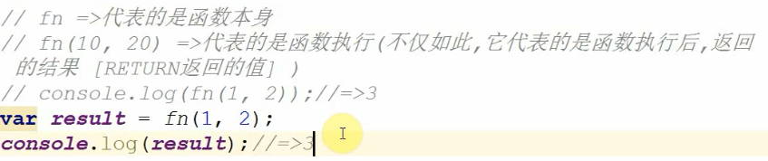
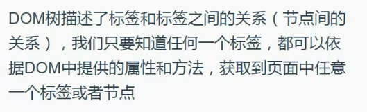
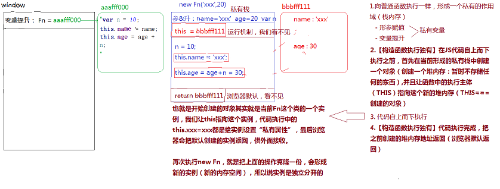
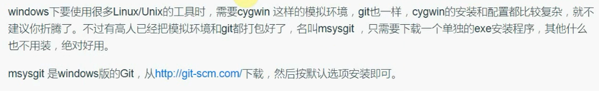
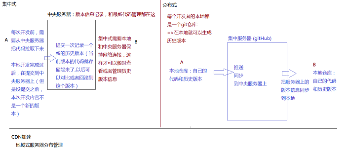

# 知识总结

## 一.基础知识

### 1.常识

#### 1.前端发展

~~~html'
第一阶段：C/S（client server） -> B/S（browser server） 网页制作
  技术栈：PhotoShop、HTML、CSS
第二阶段：从静态到动态，从后端到前端   前端开发工程师
  前后端分离
    后台：完成数据的分析和业务逻辑编写（包含API接口编写）
    前端：网页制作、JS交互效果、数据的交互和绑定
  技术栈：JavaScript、AJAX（跨域技巧）、jQuery...
第三阶段：从前端到全端（从PC端到移动端）
  技术栈：H5、CSS3、响应式布局开发、Zepto、Hybrid（混合APP开发）、微信小程序...
第四阶段（当前）：从全端到全栈
  全栈开发：前后端都可以开发（严格意义讲，一种语言完成前后端开发）
  技术栈：NODE(基于JS编程语言开发服务器端程序)、Express/Koa...
为了迎合日益发展的前端开发，JS中诞生很多有助于开发、维护、提高性能的框架：Vue、React、Angular、webpack...
展望WEB4.0时代，VR/AR元年，前端需要Canvas/webGL...
~~~


#### 2.浏览器内核

~~~HTML
 webkit（v8引擎）：大部分浏览器
 gecko：火狐
 trident：IE
 ...
 W3C：万维网联盟，制定编程语言的规范与标准
   开发者按照规范编写代码，浏览器开发商也会开发一套按照规范把代码渲染成页面的东西（这个东西就是内核或者引擎）
   浏览器内核作用：
       按照一定的规范，把代码基于GPU(显卡)绘制出对应的图形和页面等
   为啥会出现浏览器兼容：
     1.部分浏览器会提前开发一些更好的功能，后期这些功能会被收录到W3C规范中，但是在收录之前，会存在一定的兼
容性。可能是根据w3c的草稿提前开发的，后来w3c在推出规范的时候又做了一些修改，就导致了兼容性的问题，但是为了
解决兼容性的问题所以提出了浏览器前缀的办法。
     2.各个浏览器厂商，为了突出自己的独特性，用其它方法实现了W3C规范中的功能
~~~


### 2.JS组成以及ES的发展史

~~~html
1. 轻量级的客户端脚本编程语言
1. 目前的JS已经不仅仅是客户端语言了，基于NODE可以做服务器端程序，所以JS是全栈编程语言
2. 学习JS，我们学习它的几部分组成：
- ECMAScript（ES）：JS的核心语法规划，JS中的变量、数据类型、语法规范、操作语句、设计模式等等都是
									ES规定的
- DOM：document object model 文档对象模型，提供各种API（属性和方法）让JS可以获取或者操作页面中的
       HTML元素(DOM和元素)
- BOM：browser object model 浏览器对象模型，提供各种API让JS可以操作浏览器。
~~~


### 3.创建变量（variable）的六种方式（重点）

~~~html
 变量的本质是一段内存空间的别名。
 它不是具体的值，只是一个用来存储具体值的容器或者代名词，因为它存储的值可以改变，所以称为变量
  基于ES语法规范，在JS中创建变量有以下方式：
- var (ES3)
- function (ES3) 创建函数(函数名也是变量，只不过存储的值是函数类型的而已)
- let (ES6)
- const (ES6) 创建的是常量，不能给一个常量重新的赋值，常量存储的值不能被修改。
- import (ES6) 基于ES6的模块规范导出需要的信息
- class (ES6) 基于ES6创建类
~~~

~~~JavaScript
/*
 * 语法：
 *   var [变量名]=值
 *   let [变量名]=值
 *   const [常量名]=值  
 *   function 函数名(){
 *
 *   }
 *   ...
 */
var n = 13;
n = 15;
alert(n+10);//=>弹出来25 此时的N代表15

const m = 100;
m = 200;/*=>Uncaught TypeError: Assignment to constant variable.
不能给一个常量重新的赋值（常量存储的值不能被修改，能够修改就是变量了）*/
~~~

### 4.JavaScript的命名规范

~~~JavaScript
创建变量，命名的时候要遵循一些规范：
- 严格区分大小写
- 遵循驼峰命名法：按照数字、字母、下划线或者$来命名（数字不能做为名字的开头）
命名的时候基于英文单词拼接成一个完整的名字（第一个单词字母小写，其余每一个有意义单词的首字母都大写）
- 不能使用关键字和保留字：在JS中有特殊含义的叫做关键词，未来可能会成为关键字的叫做保留字

  var n=12;
  var N=13; //=>两个n不是同一个变量
  var studentInfo / student_info / _studentInfo（下划线在前的，都是公共变量） 
                  / $studentInfo（一般存储的是JQuery元素）...
                  
-语义化强一些
  add / create / insert
  del（delete）/ update / remove（rm）
  info / detail
  log
  ...
~~~

### 5.JavaScript中的数据类型

数据值是一门编程语言进行生产的材料，JS中包含的值有以下这些类型：

- 基本数据类型（值类型）
  - 数字number
  - 字符串string
  - 布尔boolean
  - null
  - undefined
- 引用数据类型
  - 对象object（对象里面还可以细分为）
    - 普通对象
    - 数组对象
    - 正则对象
    - 日期对象
    - ...
  - 函数function
- ES6中新增加的一个特殊的类型：Symbol，唯一的值

~~~html
[基本数据类型]
var n = 13; //=>0 -13 13.2 数字类型中有一个特殊的值NaN（not a number代表不是一个有效的数字,
但是属于number类型的）
var s = '';//=>"" '13' "{}" JS中所有用单引号或者双引号包裹起来的都是字符串，里面的内容是当前
字符串中的字符（一个字符串由零到多个字符组成）
var b = true;//=>布尔类型只有两个值 true真 false假

[引用数据类型]
var o = {name:'珠峰培训',age:9};//=>普通的对象：由大括号包裹起来，里面包含多组属性名和属性值
（包含多组键值对） {}空对象
var ary = [12,23,34,45]; //=>中括号包裹起来，包含零到多项内容，这种是数组对象  []空数组
var reg = /-?(\d|([1-9]\d+))(\.\d+)?/g; //=>由元字符组成一个完整的正则  //不是空正则是单行注释
function fn(){
}

[Symbol]
创建出来的是一个唯一的值
var a = Symbol('珠峰');
var b = Symbol('珠峰');
a==b =>false 假
~~~

### 6.JS代码如何被运行以及如何输出（重点）

[如何被运行]

- 把代码运行在浏览器中(浏览器内核来渲染解析)
- 基于NODE来运行(NODE也是一个基于V8引擎渲染和解析JS的工具，***node不是语言，而是一个平台、工具***)

[如何输出结果]

- alert：在浏览器中通过弹框的方式输出(浏览器提示框)，***基于alert输出的结果都会转换为字符串*。**

```
var num=12;
alert(num); //=>window.alert
var str='珠峰';
alert(str);
基于alert输出的结果都会转换为字符串：把值(如果是表达式先计算出结果)通过toString这个方法转换为字符串，
然后再输出
alert(1+1); =>'2'
alert(true); =>'true'
alert([12,23]); =>'12,23'
alert({name:'xxx'}); =>'[object Object]' 对象toString后的结果就是object object，为啥？
```

- confirm：和alert的用法一致，只不过提示的框中有确定和取消两个按钮，所以它是确认提示框

  

```
var flag = confirm('确定要退出吗?');
if(flag){
   //=>flag:true 用户点击的是确定按钮
}else{
   //=>flag:false 用户点击的是取消按钮
}
```

- prompt：在confirm的基础上增加输入框，一般不怎么用。

  

- console.log：在浏览器控制台输出日志（按F12(FN+F12)打开浏览器的控制台）

  - Elements：当前页面中的元素和样式在这里都可以看到，还可以调节样式修改结构等

  - Console：控制台，可以在JS代码中通过.log输出到这里，也可以在这里直接的编写JS代码

  - Sources：当前网站的源文件都在这里

    

- console.dir：比log输出的更加详细一些（尤其是输出对象数据值的时候）

- console.table：把一个JSON数据按照表格的方式输出。

### 7.数据类型详解（重点）

#### 1.number-数字类型

NaN：  not a number（不是一个数字）  但是NaN本身是数字（number）类型的
isNaN：检测当前值是否不是有效数字，返回true代表不是有效数字，返回false是有效数字

~~~html
var num=12;
isNaN(num); //->检测num变量存储的值是否为非有效数字 false
isNaN('13') =>false
isNaN('珠峰') =>true
isNaN(true) =>false
isNaN(false) =>false
isNaN(null) =>false
isNaN(undefined) =>true
isNaN({age:9}) =>true
isNaN([12,23]) =>true
isNaN([12]) =>false
isNaN(/^$/) =>true
isNaN(function(){}) =>true
重要：isNaN检测的机制
1、首先验证当前要检测的值是否为数字类型的，如果不是，浏览器会默认的把值转换为数字类型
2、当前检测的值已经是数字类型，是有效数字返回false，不是返回true（数字类型中只有NaN不是有效数字，其余都是
有效数字）
3、把非数字类型的值转换为数字
  - 其它基本类型转换为数字：直接使用Number这个方法转换的
  [字符串转数字]
    Number('13') ->13
    Number('13px') ->NaN 如果当前字符串中出现任意一个非有效数字字符，结果则为NaN
    Number('13.5') ->13.5 可以识别小数
  [布尔转数字]
    Number(true) ->1
    Number(false) ->0
  [其它]
    Number(null) ->0
    Number(undefined) ->NaN

  - 把引用数据类型值转换为数字：先把引用值调取toString转换为字符串，然后再把字符串调取Number转换为数字
 [对象]
     ({}).toString() ->'[object Object]' ->NaN 所有对象调用tostring,转成的结果都是'[object Object]
   [数组]
     [12,23].toString() ->'12,23' ->NaN
     [12].toString() ->'12' ->12
   [正则]
     /^$/.toString() ->'/^$/' ->NaN

  Number('') ->0  空字符串的结果是0
  [].toString() ->''  空数组转化成字符串的结果是空
  => isNaN([])：false
~~~

#### 2.parseInt / parseFloat数字类型转换

等同于Number，也是为了把其它类型的值转换为数字类型，和Number的区别在于字符串转换分析上

Number：出现任意非有效数字字符，结果就是NaN

parseInt：把一个字符串中的整数部分解析出来，

parseFloat是把一个字符串中小数(浮点数)部分解析出来

```
parseInt('13.5px') =>13
parseFloat('13.5px') =>13.5
parseInt('width:13.5px') =>NaN 从字符串最左边字符开始查找有效数字字符，并且转换为数字，
                         但是一但遇到一个非有效数字字符，查找结束
parseFloat('width:13.5px') =>NaN
```

NaN的比较

```
NaN==NaN：false NaN和谁都不相等，包括自己
思考题：有一个变量num，存储的值不知道，我想检测它是否为一个有效数字，下面方案是否可以
if(Number(num)==NaN){
    alert('num不是有效数字!');
}
NaN和谁都不相等，条件永远不成立（即使num确实不是有效数字，转换的结果确实是NaN，但是NaN!=NaN的）
if(isNaN(num)){
    //=>检测是否为有效数字，只有这一种方案
    alert('num不是有效数字!')
}
 var num="123acdw";
      if (isNaN(num)) {
        alert("num不是一个有效数字");
}
```

#### 3.布尔类型

> 只有两个值：true / false 

如何把其它数据类型转换为布尔类型?

- Boolean
- ! 取反
- !! 取两次反，相当于把其它数据类型转化为布尔类型。

```javascript
Boolean(1) =>true

!'珠峰培训' =>先把其它数据类型转换为布尔类型，然后取反

!!null =>去两次反，等价于没取反，也就剩下转换为布尔类型了
```

​	***规律：`在JS中只有“0/NaN/空字符串/null/undefined”这五个值转换为布尔类型的false，其余都转换为true`***

#### 4.null && undefined

> 都代表空或者没有
>
> - null：空对象指针
> - undefined：未定义，js当中独有数据类型

null一般都是意料之中的没有（通俗理解：一般都是人为手动的先赋值为null，后面的程序中我们会再次给他赋值）

```javascript
var num = null; //=>null是手动赋值，预示着后面我会把num变量的值进行修改
...
num = 12;
```

undefined代表的没有一般都不是人为手动控制的，大部分都是浏览器自主为空（后面可以赋值也可以不赋值）

```javascript
var num; //=>此时变量的值浏览器给分配的就是undefined
...
后面可以赋值也可以不赋值
```

#### 5.对象（object）数据类型

> 普通对象
>
> - 由大括号包裹起来的
> - 由零到多组**属性名和属性值**（键值对）组成

**属性是用来描述当前对象特征的，属性名是当前具备这个特征，属性值是对这个特征的描述（专业语法，属性名称为键[key]，属性值称为值[value]，一组属性名和属性值称为一组键值对）**

~~~js
var obj = {
	name:'珠峰培训',
	age:9
};
//=>对象的操作：对键值对的增删改查
语法：对象.属性 / 对象[属性]

[获取]
obj.name 
obj['name']  一般来说，对象的属性名都是字符串格式的（属性值不固定，任何格式都可以）

[增/改]
JS对象中属性名是不允许重复的，是唯一的
obj.name='周啸天'; //=>原有对象中存在NAME属性，此处属于修改属性值
obj.sex='男'; //=>原有对象中不存在SEX，此处相当于给当前对象新增加一个属性SEX
obj['age']=28;

[删]
彻底删除：对象中不存在这个属性了
delete obj['age'];

假删除：并没有移除这个属性，只是让当前属性的值为空
obj.sex=null;
----
在获取属性值的时候，如果当前对象有这个属性名，则可以正常获取到值（哪怕是null），但是如果没有这个属性名，
则获取的结果是undefined
obj['friends'] =>undefined
~~~

扩展（面试）：

~~~js
var obj = {
	name:'珠峰培训',
	age:9
};
var name = 'zhufeng';

obj.name  =>'珠峰培训'  获取的是NAME属性的值
obj['name'] =>'珠峰培训' 获取的是NAME属性的值
obj[name] =>此处的NAME是一个变量,我们要获取的属性名不叫做NAME，是NAME存储的值'zhufeng'
          =>obj['zhufeng'] =>没有这个属性,属性值是undefined

----
'name' 和 name 的区别?
  => 'name'是一个字符串值，它代表的是本身
  => name是一个变量，它代表的是本身存储的这个值
~~~

一个对象中的属性名不仅仅是字符串格式的，还有可能是数字格式的,否者浏览器会把这个值转化为字符串。

~~~js
var obj = {
	name:'珠峰培训',
	0:100
};
obj[0] =>100
obj['0'] =>100
obj.0 =>Uncaught SyntaxError: Unexpected number 语法错误,属性名是数字的时候不能通过“.”获取。

----
当我们存储的属性名不是字符串也不是数字的时候，浏览器会把这个值转换为字符串（toString），然后再进行存储

obj[{}]=300;  =>先把({}).toString()后的结果作为对象的属性名存储进来 obj['[object Object]']=300

obj[{}] =>获取的时候也是先把对象转换为字符串'[object Object]',然后获取之前存储的300

~~~

#### 6.数组（数组也是对象）

~~~js
数组对象（对象由键值对组成的）
var oo = {
	a:12
};
var ary = [12,23]; //=>12和23都是属性值，属性名呢？

通过观察结果，我们发现数组对象的属性名是数字（我们把数字属性名称为当前对象的索引）
ary[0]
ary['0']
ary.0  =>报错
~~~

### 8.了解JS的运行机制(堆栈内存)


**扩展：**


### 9.JS中的操作语句

#### 1.if、else判断

只要有一个条件成立，后面不管是否还有成立的条件，都不在判断执行了

~~~js
var num = 10;
if(num>5){
	num+=2;
}else if(num>8){
	num+=3;
}else{
	num+=4;
}
console.log(num); //=>12
~~~

关于条件可以怎么写？

~~~js
// >= / <= / == 常规比较
if(0){
	/*=>不管你在条件判断中写什么，最后总要把其计算出TRUE/FALSE来判断条件是否成立
  （把其它类型的值转换为布尔类型，只有 0/NaN/''/null/undefined 是false，其余都是true）*/
}

if('3px'+3){
	/*=>在JS中，+ - * / % 都是数学运算，除 + 以外，其余运算符在运算的时候，如果遇到了非数字类型的值，
  首先会转换为数字类型（Number），然后再进行运算*/
	
	//=>  + 在JS中除了数学相加，还有字符串拼接的作用（如果运算中遇到了字符串，则为字符串拼接，而不是数学相加）

	'3px'+3 =>'3px3'  =>true
}
if('3px'-3){
	'3px'-3 =>NaN
}
~~~

**面试题：**

~~~js
var num = parseInt('width:35.5px');   =>NaN
if(num==35.5){
	alert(0);
}else if(num==35){
	alert(1);
}else if(num==NaN){
	alert(2);
}else if(typeof num=='number'){
    //=>先算typeof num =>NaN,  NaN属于number类型，所以返回的结果是对应类型的字符串=>"number"
    //=>在做比较
	alert(3);//=>alert输出的都是字符串格式的 '3'
}else{
    alert(4);
}
~~~

#### 2.三元运算符

**语法：条件?成立做的事情:不成立做的事情;  <=>相当于简单的if/else判断**

~~~js
var num=12;
if(num>10){
    num++;
}else{
	num--;
}
//=>改写成三元运算符
num>10?num++:num--;
~~~

特殊情况：

~~~js
//=>如果三元运算符中的某一部分不需要做任何的处理，我们用 null/undeifned/void 0... 占位即可
var num = 12;
num>10?num++:null;
//=>如果需要执行多项操作，我们把其用小括号包裹起来，每条操作语句用逗号分隔
num=10;
num>=10?(num++,num*=10):null;
~~~

#### 3.switch case

**JS中的一种判断方式**，switch case 应用于变量（或者表达式等）在不同值情况下的不同操作，每一种case结束后都要加break（结束整个判断,否则不管后面的条件成不成立都会被执行，直到遇到break为止）。

~~~js
var num = 12;
if(num==10){
	num++;
}else if(num==5){
	num--;
}else{
	num=0;
}

//=>改成switch case
switch(num){
	case 10:
		num++;
		break;
	case 5:
		num--;
		break;
	default:
		num=0;	
}
~~~

**拓展：**

~~~js
var n="10";
n++;
n=n+1 
// 此时n++和n=n+1的效果一样吗？  
// 结果不一样，此时n++ =>10+1=11 而n+1 =>101这里是做了一个字符串的拼接，“+” 不仅仅代表数学运算，
// 在js中也有可能是字符串的拼接。
console.log(n);
~~~

**switch case和if的比较**

~~~js
var num = '10';
if (num==10) {
  console.log('相等');   //相等
} else {
  console.log('不相等');
}
//'10'==10 
//=>true 相等比较,如果等号左右两边的类型不一样，首先会转换为一样的数据类型，然后再进行比较
//  当前案例中，就是把字符串'10'转换为数字了，然后再比较的

switch(num){
  case 10:console.log('相等') ;break;
  default:console.log('不相等');  //不相等
}
//'10'===10 绝对比较，如果两边的数据类型不一样，则直接不相等，它要求类型和值都完全一样才会相等
//（真实项目中为了保证代码的严谨性，我们应该更多使用绝对比较）
~~~

#### 4.for循环

**循环：按照一定的规律去重复做某一件事情。**


**基本使用：**


**提升：**


**continue和break的区别：**


##### **案例：隔行变色**

~~~html
//用css实现
<style>
      ul {
        list-style: none;
        margin: 0;
        padding: 0;
      }
      ul li {
        margin: 0;
        padding: 0;
        display: block;
        height: 40px;
        margin: 5px 0;
        background-color: antiquewhite;
        border: 1px solid #ececec;
        line-height: 40px;
        text-align: center;
      }
      .contener {
        width: 300px;
        margin: auto;
        /* background-color: rgb(189, 176, 176); */
      }
      li:nth-child(2n) {
        background-color: rgb(155, 116, 116);
      }
  </style>
</head>
<body>
  <div class="contener">
     <ul>
       <li>1</li>
       <li>2</li>
       <li>3</li>
       <li>4</li>
       <li>5</li>
       <li>6</li>
     </ul>
  </div>
~~~


拓展：用一行代码实现隔行变色

1.

2.

3.

4.

5.

**获取页面中的DOM元素**

**document.getElementById**

 在整个文档中，**通过元素的ID属性值，获取到这个元素对象**，getElementById是获取元素的方法，而document限定了获取元素的范围，我们把这个范围称之为：“上下文 [context]”

~~~js
var oBox = document.getElementById('box');
1. 同过getElementById获取的元素是一个对象数据类型的值（里面包含很多内置的属性）
typeof oBox  =>"object"
2. 分析包含的属性
className：存储的是一个字符串，代表当前元素的样式类名
id：存储的是当前元素ID值（字符串）

innerHTML：存储当前元素中所有的内容（包含HTML标签）
innerText：存储当前元素中所有的文本内容（没有元素标签）

onclick：元素的一个事件属性，基于这个属性，可以给当前元素绑定点击事件
onmouseover：鼠标滑过事件
onmouseout：鼠标离开事件

style：存储当前元素所有的 "行内样式" 值（获取和操作的都只能是写在标签上的行内样式，写在样式表中的样式，
无法基于这个属性获取到）
~~~


**[context].getElementsByTagName** 

在指定的上下文中，**通过元素的标签名获取一组元素集合**，上下文是我们自己来指定的。


~~~js
var boxList = oBox.getElementsByTagName('li');

1. 获取的结果是一个元素集合（HTMLCollection）,首先它也是对象数据类型的，结构和数组非常相似
（数字作为索引，length代表长度），但是不是数组，我们把它叫做“类数组”

boxList[0] 获取当前集合中的第一个LI（通过索引获取到具体的某一个LI即可）
boxList.length 获取集合中LI的数量

2. 集合中的每一项存储的值又是一个元素对象（对象数据类型，包含很多的内置属性，例如：id/className...）

boxList[1].style.color='red';  修改集合中第二个LI的文字颜色
~~~


~~~js
//javascript实现隔行变色
<style>
      ul {
        list-style: none;
        margin: 0;
        padding: 0;
      }
      ul li {
        margin: 0;
        padding: 0;
        display: block;
        height: 40px;
        margin: 5px 0;
        background-color: antiquewhite;
        border: 1px solid #ececec;
        line-height: 40px;
        text-align: center;
      }
      .contener {
        width: 300px;
        margin: auto;
      }
  </style>
</head>
<body>
  <div class="contener">
     <ul id="box"> 
       <li>1</li>
       <li>2</li>
       <li>3</li>
       <li>4</li>
       <li>5</li>
       <li>6</li>
     </ul>
  </div>
  <script>
      var Box = document.getElementById('box');
      var boxlist = Box.getElementsByTagName('li');
          console.dir(boxlist);
        for (var i=0; i < boxlist.length; i+=2) {
           boxlist[i].style.backgroundColor='#ececec';
        }
  </script>
~~~

### 10.数据类型检测

#### 1.typeof

> 在JS中用来检测数据类型的方式之一，除了它以外，还有：
>
> - instanceof
> - constructor
> - Object.prototype.toString.call()

~~~js
语法：typeof [value] =>检测value的数据类型

返回值：使用typeof检测出来的结果是一个字符串，字符串中包含着对应的数据类型，
例如："number"/"string"/"boolen"/"undefined"/"object"/"function"
 
typeof null =>"object" 因为null代表空对象指针（没有指向任何的内存空间）

typeof检测数组/正则/对象，最后返回的都是"object"，也就是基于这种方式无法细分对象，只能检测基本数据类型。

面试题：
console.log(typeof []); 
//=>"object"

console.log(typeof typeof []); 
//=>typeof "object"
//=>"string"
~~~

### 11.function-函数

**在JS中，函数就是一个方法（一个功能体），基于函数一般都是为了实现某个功能。**

#### 1.函数的创建

**`函数诞生的目的就是为了实现封装`**：把实现一个功能的代码封装到一个函数中，后期想要实现这个功能，只需要把函数执行即可，不必要再次编写重复的代码，起到了**`低耦合高内聚（减少页面中的冗余代码，提高代码的重复使用率）`**的作用。

~~~js
function fn(){
	var total=10;
	total+=10;
	total/=2;
	total=total.toFixed(2);
	console.log(total);
}
fn();
fn();
...
想用多少次，我们就执行多少次函数即可
~~~

**es3中的函数与es6中的箭头函数**

~~~js
=====
ES3标准中：
//=>创建函数
function 函数名([参数]){
	函数体：实现功能的JS代码
}
函数名(); //=>函数执行

=====
ES6标准中创建箭头函数：
let 函数名(变量名)=([参数])=>{
	函数体
}；
函数名();  //函数执行
~~~

#### 2.函数数据类型的运行机制


~~~js
function fn(){
	var total=10;
	total+=10;
	total=total.toFixed(2);
	console.log(total);
}
fn();

【创建函数】
1. 函数也是引用类型，首先会开辟一个新的堆内存，把函数体中的代码当做“字符串”存储到内存中（对象向内存中存储的是键值对）
2. 把开辟的堆内存地址赋值给函数名(变量名)

此时我们输出fn（切记不是fn()）代表当前函数本身，返回的是代码字符串。
如果我们执行fn()，这是把函数执行，返回的是代码执行的结果。
所以是否加小括号是两种不同本质的操作

【函数执行】
目的：把之前存储到堆内存中的代码字符串变为真正的JS代码自上而下执行，从而实现应有的功能

1.函数执行，首先会形成一个私有的作用域（一个供代码执行的环境，也是一个栈内存）
2.把之前在堆内存中存储的字符串复制一份过来，变为真正的JS代码，在新开辟的作用域中自上而下执行 
~~~


#### 3.函数中的参数

**参数是函数的入口：当我们在函数中封装一个功能，发现一些原材料不确定，需要执行函数的时候用户传递进来才可以，此时我们就基于参数的机制，提供出入口即可**

~~~js
//=>此处的参数叫做形参：入口，形参是变量（n/m就是变量）
function sum(n,m){
	//=>n和m分别对应要求和的两个数字
	var total = 0;
	total = n + m;
	console.log(total);
}

//=>此处函数执行传递的值是实参：实参是具体的数据值
sum(10,20);  //=>n=10 m=20
sum(10); //=>n=10 m=undefined
sum(); //=>n和m都是undefined
sum(10,20,30); //=>n=10 m=20  30没有形参变量接收
~~~

#### 4案例：选项卡（堆栈内存释放，闭包作用域初见）


~~~html
//HTML基本结构
<style>
      ul {
        list-style: none;
        margin: 0;
        padding: 0;
      }
      li {
        margin: 0;
        padding: 0;
      }
      .box {
        width: 300px;
        margin: auto;
      }
      .box ul {
        position: relative;
        top:1px;
      }
      .box ul li{
        display: inline-block;
        margin-right: 10px;
        height: 30px;
        padding: 0 10px;
        line-height: 28px;
        border: 1px solid #ececec;
      }
      .box ul li.active {
        border-bottom-color: #fff;
      }
      .box div {
        display: none;
        height: 200px;
        /* background-color: antiquewhite; */
        text-align: center;
        line-height: 200px;
        border: 1px solid #ececec;
      }
      .box div.active {
        display:block;
      }
  </style>
</head>
<body>
        <div class="box" id="tablebox">
          <ul>
            <li class="active">新闻</li>
            <li>体育</li>
            <li>娱乐</li>
          </ul>
          <div class="active">新闻列表</div>
          <div>体育列表</div>
          <div>娱乐列表</div>
        </div>
</body>
</html>
~~~

~~~js
//js实现功能
  <script>
       var tableBox=document.getElementById("tablebox");
       var titlelist=tableBox.getElementsByTagName("li");
       var contanerlist=tableBox.getElementsByTagName("div");
        // console.dir(contanerlist);
        /*
       for (var i=0;i<titlelist.length;i++){
          titlelist[i].onclick= function(){ //事件绑定，给元素的onclick绑定一个方法，绑定的时候方法没有执行
                                           //属于创建方法，只有当点击的时候方法才会执行。
            //  console.log(i);
             //此时我们发现点击任何一个选项卡，打印出来的都是3，为什么会出现这种情况，原因是绑定的时候方法没有执行，
             //属于创建方法，只有当点击的时候方法才会执行，当我们去点击的时候，循环已经结束，此时的i=3，当方法执行
             //的时候传入的数字都是3.
             changeOn(i); 
          }
       }
       */

       //如何解决这种情况呢？
       //方法一：利用es6 的let创建变量
      //  for (let i=0;i<titlelist.length;i++){
      //     titlelist[i].onclick= function(){ 
      //        changeOn(i); 
      //    }
      //  }

      //方法二：给titlelist添加一个属性，用来保存titlelist的索引，当方法调用的时候传入每一次调用的具体的索引值
      //  for (let i=0;i<titlelist.length;i++){
      //     titlelist[i]['titindex']=i;  //添加属性
      //     titlelist[i].onclick= function(){ 
      //        changeOn(this.titindex); //此时存入的是每一个选项卡的具体的索引，而不是一个变量名i，谁调用就转入谁的索引
      //    }
      //  }

      //方法三：创建一个自执行函数，把创建和执行都完成了

      //  for (let i=0;i<titlelist.length;i++){
      //    ~function(i){
      //     titlelist[i].onclick= function(){ 
      //        changeOn(i); 
      //      }
      //    }(i);
      //  }
    
       //方法四：
       for (let i=0;i<titlelist.length;i++){
        
          titlelist[i].onclick= function(i){ 
            return function(){
              changeOn(i); 
            }
         }(i);
       }

       //封装一个选项卡切换的方法，传入需要修改的元素的索引
      function changeOn(index){
      for(var i=0;i<titlelist.length;i++){
         // 1.先将所有的标题和内容的默认样式类清空
          titlelist[i].className="";
          contanerlist[i].className="";
        }
      //2.将需要显示的标题和内容增加样式类
       titlelist[index].className="active";
      //   9demo.html:84 Uncaught TypeError: Cannot set property 'className' of undefined
      // at changeOn (demo.html:84)  无法设置未定义的属性。
      //此时会报错，报错原因来自于函数调用的时候，
        contanerlist[index].className="active";
      }
  </script>
</body>
</html>
~~~

**重点：**


#### **5.选项卡提升：真实项目中采用（重点）**


~~~js
 <style>
    ul {
      list-style: none;
      margin: 0;
      padding: 0;
    }
    li {
      margin: 0;
      padding: 0;
    }
    .box {
      width: 300px;
      margin: auto;
    }
    .box ul {
      position: relative;
      top:1px;
    }
    .box ul li{
      display: inline-block;
      margin-right: 10px;
      height: 30px;
      padding: 0 10px;
      line-height: 28px;
      border: 1px solid #ececec;
    }
    .box ul li.active {
      border-bottom-color: #fff;
    }
    .box div {
      display: none;
      height: 200px;
      /* background-color: antiquewhite; */
      text-align: center;
      line-height: 200px;
      border: 1px solid #ececec;
    }
    .box div.active {
      display:block;
    }
</style>
</head>
<body>
      <div class="box" id="tablebox">
        <ul>
          <li class="active">新闻</li>
          <li>体育</li>
          <li>娱乐</li>
        </ul>
        <div class="active">新闻列表</div>
        <div>体育列表</div>
        <div>娱乐列表</div>
      </div>
      <script>
        var tableBox=document.getElementById("tablebox");
        var lilist=tableBox.getElementsByTagName("li");
        var divlist=tableBox.getElementsByTagName("div");

        //方法一：自定义属性值
      //   for (var i=0;i<titlelist.length;i++){
      //     lilist[i]['titindex']=i;  
      //     lilist[i].onclick= function(){ 
      //        changeOn(this.titindex); 
      //    }
      //  }

      //  function changeOn(index){
      //  for(var i=0;i<titlelist.length;i++){
      //      lilist[i].className=divlist[i].className="";
           
      //    }
      //   lilist[index].className=divlist[index].className="active";
         
      //  }

      //方法二：上面的方法需要提前把所有未点击的元素的样式都清空，不灵活，所以如果能只针对我们当前点击的元素设置样式类；
      //      通过一个变量记录选择的元素的索引

      // var lastIndex=0; //当前选中的元素
      // for(var i=0;i<lilist.length;i++){
      //   lilist[i].myindex=i;//为选中的元素添加索引
      //   lilist[i].onclick=function(){
      //     if(this.myindex===lastIndex){
      //           return;  //如果当前点击的是上一次选中的元素则不进行任何处理
      //   }else{
      //     //如果当前点击的元素之前没有被选中，则将之前选中的元素样式清空，然后再设置当前元素的样式
      //      lilist[lastIndex].className=divlist[lastIndex].className="";

      //      this.className=divlist[this.myindex].className="active";
           
      //      lastIndex=this.myindex;   //将当前选中的元素的索引保存，传入到下一个要执行的对象中

      //   }
      //   }
      // }

      //方法三：之前我们传入的参数都是这个元素的索引值，如果我们直接传入要被点击的元素本身，
      //       则可以直接操作传入的元素对象
      for(var i=0;i<lilist.length;i++){
          lilist[i].onclick=function(){
            changOfTab(this);
          }
      }
      function changOfTab(elements){//此时传入的是一个元素
          for(var i=0;i<lilist.length;i++){
             //通过循环查找我们点击的元素的索引值
            if (elements===lilist[i]) {
              //如果当前传入的对象是我们需要点击的，则给其添加样式,就不再进行下面的操作
              lilist[i].className=divlist[i].className="active";
              continue;        //结束当前循环
            } else {
              //如果不相等，则取消选中的样式
              lilist[i].className=divlist[i].className="";
            }
          }
      }
   </script>
~~~

### 12.js中的数据类型转换

JS中的数据类型

【基本数据类型】
    数字 number
    字符串 string
    布尔 boolean
    空 null
    未定义 undefined
【引用数据类型】
    对象 object
       普通对象
       数组对象 (Array)
       正则对象 (RegExp)
       日期对象 (Date)
       数学函数 (Math)
       ...
    函数 function

真实项目中，根据需求，我们往往需要把数据类型之间进行转换

#### 1.把其它数据类型转换为number类型

`1.发生的情况`

- isNaN检测的时候：当检测的值不是数字类型,浏览器会自己调用Number方法把它先转换为数字，然后再检测是否为非有效数字

```javascript
isNaN('3') =>false
  Number('3')->3
  isNaN(3)->false

isNaN('3px') =>true
  Number('3px')->NaN
  isNaN(NaN)->true
```

- 基于parseInt/parseFloat/Number去手动转换为数字类型
- 数学运算：+ - * / %，但是“+”不仅仅是数学运算，还可能是字符串拼接

```javascript
'3'-1 =>2
  Number('3')->3
  3-1->2

'3px'-1 =>NaN

'3px'+1 =>'3px1' 字符串拼接

var i='3';
i=i+1; =>'31'
i+=1; =>'31'
i++; =>4  i++就是单纯的数学运算，已经摒弃掉字符串拼接的规则
```

- 在基于“==”比较的时候，有时候也会把其它值转换为数字类型

`2.转换规律`

```javascript
//=>转换的方法：Number（浏览器自行转换都是基于这个方法完成的）
【把字符串转换为数字】
只要遇到一个非有效数字字符，结果就是NaN
'' ->0
' ' ->0 空格(Space)
'\n' ->0 换行符(Enter)
'\t' ->0 制表符(Tab)

【把布尔转换为数字】
true ->1
false ->0

【把没有转换为数字】
null ->0
undefined ->NaN

【把引用类型值转换为数字】
首先都先转换为字符串（toString），然后再转换为数字（Number）
```

#### 2.把其它类型值转换为字符串

`1.发生的情况`

- 基于alert/confirm/prompt/document.write等方法输出内容的时候，会把输出的值转换为字符串，然后再输出

```javascript
alert(1) =>'1'
```

- 基于“+”进行字符串拼接的时候
- 把引用类型值转换为数字的时候，首先会转换为字符串，然后再转换为数字
- 给对象设置属性名，如果不是字符串，首先转换为字符串，然后再当做属性存储到对象中（对象的属性只能是数字或者字符串）
- 手动调用toString/toFixed/join/String等方法的时候，也是为了转换为字符串

```javascript
var n=Math.PI;//=>获取圆周率：
n.toFixed(2) =>'3.14'

var ary=[12,23,34];
ary.join('+') =>'12+23+34'
```

`2.转换规律`

```javascript
//=>调用的方法：toString

【除了对象，都是你理解的转换结果】
1 ->'1'
NaN ->'NaN'
null ->'null'
[] ->''
[13] ->'13'
[12,23] ->'12,23'
...

【对象】
{name:'xxx'} ->'[object Object]'
{} ->'[object Object]'
不管是啥样的普通对象，最后结果都一样
```

#### 3.把其它值转换为布尔类型

`1.发生的情况`

- 基于!/!!/Boolean等方法转换
- 条件判断中的条件最后都会转换为布尔类型
- ...

```javascript
if(n){
  //=>把n的值转换为布尔验证条件真假
}

if('3px'+3){
  //=>先计算表达式的结果'3px3'，把结果转换为布尔true，条件成立
}
```

`2.转换的规律`
只有“0/ NaN/  " " /null /undefined”五个值转换为布尔值的时候是false,其余都是转换为true

#### 4.特殊情况：

**数学运算和字符串拼接 “+”**

```javascript
//=>当表达式中出现字符串，就是字符串拼接，否则就是数学运算

1+true =>2 数学运算
'1'+true =>'1true' 字符串拼接

[12]+10 =>'1210' 虽然现在没看见字符串，但是引用类型转换为数字，首先会转换为字符串，所以变为了字符串拼接
({})+10 =>"[object Object]10"
[]+10 =>"10"

{}+10 =>10 这个和以上说的没有半毛钱关系，因为它根本就不是数学运算，也不是字符串拼接，它是两部分代码
  {} 代表一个代码块（块级作用域）
  +10 才是我们的操作
  严格写法：{}; +10;
```

思考题：

```javascript
12+true+false+null+undefined+[]+'珠峰'+null+undefined+[]+true
=>'NaN珠峰nullundefinedtrue'

12+true ->13
13+false ->13
13+null ->13
13+undefined ->NaN
NaN+[] ->'NaN'
'NaN'+'珠峰' ->'NaN珠峰'
...
'NaN珠峰trueundefined'
'NaN珠峰trueundefined'+[] ->'NaN珠峰trueundefined'
...
=>'NaN珠峰trueundefinedtrue'
```

**“==”在进行比较的时候，如果左右两边的数据类型不一样，则先转换为相同的类型，再进行比较**

对象==对象：不一定相等，因为对象操作的是引用地址，地址不相同则不相等

```javascript
{name:'xxx'}=={name:'xxx'} =>false
[]==[] =>false

var obj1={};
var obj2=obj1;
obj1==obj2 =>true
```

==========================>上面是重点强调的

对象==数字：把对象转换为数字
对象==布尔：把对象转换为数字，把布尔也转换为数字
对象==字符串：把对象转换为数字，把字符串也转换为数字
字符串==数字：字符串转换为数字
字符串==布尔：都转换为数字
布尔==数字：把布尔转换为数字
===========================>不同情况的比较，都是把其它值转换为数字，然后再进行比较的

null==undefined：true
null===undefined：false
null&&undefined和其它值都不相等

NaN==NaN：false
NaN和谁都不相等包括自己
===========================>以上需要特殊记忆

```javascript
1==true =>true
1==false =>false
2==true =>false  规律不要混淆，这里是把true变为数字1


[]==true：false  都转换为数字 0==1
![]==true：false

[]==false：true  都转换为数字 0==0
![]==false：true  先算![]，把数组转换为布尔取反=>false  =>false==false
```

### 13.数组

#### 1.数组常用方法

​	

##### 1.push—末尾追加新内容

​	

​	

##### 2.pop—删除最后一项

​	

​	

##### 3.shift—删除第一项（数组坍陷）

​	

​	

##### 4.unshift—开始位置追加新内容

​	

​	

##### 5.splice—删除指定内容

​	

​	

​	

​	

​	

**提升：**

​	

​	

##### 6.slice—查找指定内容

​	

​	

##### 7.concat-连接

​	

​	

##### 8.toString

​	

##### 9.join—数组转字符串

​	

​	

##### 10.reverse—数组反转

​	

​	

##### 11.sort—排序

​	

​	

​	

##### 12.**indexof / lastindexof**

​	

​	

​	

​	

​	

#### 2.数组去重

##### 1.双循环解决和数组塌陷问题

基于splice删除数组元素导致的数组塌陷问题引出

~~~js
/*==数组去重==*/
var ary = [1, 2, 3, 2, 2, 3, 4, 3, 4, 5];

/*--解决方案一--*/
/*
 * 1.依次拿出数组中的每一项（排除最后一项：最后一项后面没有需要比较的内容）
 * 2.和当前拿出项后面的每一项依次比较
 * 3.如果发现有重复的，我们把找到的这个重复项在原有数组中删除掉（splice）
 */
//=>i<ary.length-1：不用拿最后一项
for (var i = 0; i < ary.length - 1; i++) {
    var item = ary[i];
    //=>item：依次拿出的每一项
    //=>i：当前拿出项的索引
    //=>和当前项后面的每一项比较：起始索引应该是i+1  k < ary.length找到末尾依次比较
    for (var k = i + 1; k < ary.length; k++) {
        //ary[k]：后面需要拿出来和当前项比较的这个值
        if (item === ary[k]) {
            //=>相等：重复了,我们拿出来的K这个比较项在原有数组中删除
            // ary.splice(k, 1);
            /*
             * 这样做会导致数组塌陷问题：当我们把当前项删除后，后面每一项都要向前进一位，
			 也就是原有数组的索引发生了改变，此时我们k继续累加1，下一次在拿出来的结果就会跳过一位
             * 原数组 [1,2,3,4]
             * i=1 =>2 我们把这一项干掉，然后i++，i=2
             * 原数组 [1,3,4]
             * i=2这一项是4,3这一项就错过了
             * ...
             */
            ary.splice(k, 1);//=>删除后不能让k累加了
            k--;//=>删除后先减减，在加加的时候相当于没加没减
        }
    }
}
console.log(ary);
~~~

**分析：**


##### 2.基于对象键值对方式处理

~~~js
var ary = [1, 2, 3, 2, 2, 3, 4, 3, 4, 5];
/*
 * 基于对象的属性名不能重复,我们实现高性能的数组去重
 * 1.创建一个空对象
 * 2.依次遍历数组中的每一项,把每一项存储的值，当做对象的属性名和属性值存储起来
 *
 *  第一次循环 1  {1:1}
 *  第二次循环 2  {1:1,2:2}
 *  第三次循环 3  {1:1,2:2,3:3}
 *  第四次循环 2  我们在存储之前做一个判断，判断当前对象中是否已经存在这个属性名了，
     如果存在，说明之前有这一项存储的操作，进一步说明之前数组中出现过这个数值了
	 （也就是重复了，此时我们把当前项在数组中移除即可）
 *  ...
 *
 *  如何判断对象中是否存在这个属性：如果没有这个属性，获取的属性值是undefined
 */
var obj = {};
for (var i = 0; i < ary.length; i++) {
    var item = ary[i];//=>每一次循环从数组中拿出来的这一项

    //=>存储之前需要做判断：如果对象中已经存在这个属性了，说明当前item在之前出现过，
	  //也就是当前项重复了，我们把当前项删掉
    if (typeof obj[item] !== 'undefined') {
        
        /* 方法一：
          ary.splice(i, 1);
         * i--;//=>防止数组塌陷
         * 这种删除方式不好，如果数组很长，我们删除某一项，后面索引都需要重新计算，非常耗性能
        */

        /*  方法二
         * 1.我们把数组最后一项的结果获取到，替换当前项内容
         * 2.在把数组最后一项删除
         * [12,23,34,56] 想要删除23
         *    先让56替换23 [12,56,34,56]
         *    在把最后一项删除 [12,56,34]
         */
        ary[i] = ary[ary.length - 1];
        ary.length--;
        i--;
        continue;
    }
     //=>把这一项作为对象的属性名和属性值存储进去
     obj[item] = item;//=>obj[1]=1 =>{1:1}
}
console.log(ary);
~~~

### 14.string—字符串

​	

#### 1.字符串中常用的方法

​	

##### **1.charAt /charCodeAt**

​	

​	

​	

##### **2.indexOf / lastIndexOf**

​	

​	

##### 3.slice —查找

​	

​	

##### 4.substring—真实项目中常用

​	

##### 5.substr—字符串截取

​	

​	

##### 6.toUpperCase / toLowerCase

​	

##### 7.split

​	

​	

##### 8.replace—替换

​	

​	

#### 2.字符串常做的处理

##### **1.时间字符串格式化**

​	

**方法一：**

~~~js
/*
 * 1.基于SPLIT按照空格把字符串拆成两部分(数组中的两项)
 * 2.左边这一部分继续以SPLIT按照中杠来拆
 * 3.右边这一部分继续以SPLIT按照冒号来拆
 * 4.把需要的信息拼接在一起即可（拼接的时候不足十位的补零）
 */
function addZero(val) {
    return val < 10 ? '0' + val : val;
}
var str = '2018-4-4 16:32:8';
var ary = str.split(' '),//=>["2018-4-4", "16:32:8"]
    aryLeft = ary[0].split('-'),//=>["2018", "4", "4"]
    aryRight = ary[1].split(':');//=>["16", "32", "8"]
var month = addZero(aryLeft[1]),
    day = addZero(aryLeft[2]),
    hour = addZero(aryRight[0]),
    minute = addZero(aryRight[1]);
var result = month + '月' + day + '日 ' + hour + '时' + minute + '分';
console.log(result);
~~~

**方法二：格式化时间日期万能模板**

~~~js
//可以自定义字符串输出的格式
~function (pro) {
    pro.formatTime = function (template) {
        template = template || '{0}年{1}月{2}日 {3}时{4}分{5}秒';
        var ary = this.match(/\d+/g);
        template = template.replace(/\{(\d+)\}/g, function () {
            var n = arguments[1],
                val = ary[n] || '0';
            val < 10 ? val = '0' + val : null;
            return val;
        });
        return template;
    }
}(String.prototype);
~~~

​	

##### **2.URL地址栏问号参数截取**

常用于在一个页面中，详情页展示不同内容，其实只是开发了一个页面，结构相同，只是展示的数据不同。如何判断是不是一个页面，就要根据 "?" 后面的内容来判断——问号传参。

​	

**方法一：**

~~~js
/*
 * 1.先找到问号，把问号后面的信息截取下来即可
 *  A.首先我们需要验证是否存在#哈希值，存在我们从问号开始截取到#，不存在我们直接
 截取到字符串的末尾
 * 2.以&进行拆分(数组)
 * 3.遍历数组中的每一项，把每一项在按照=进行拆分，把拆分后的第一项作为对象的属性名，
 第二项作为属性值进行存储即可
 */
var str = 'http://www.zhufengpeixun.cn/stu/?lx=1&name=AA&sex=man#teacher';
//=>#后面的称为哈希(HASH)值,这个值可能有可能没有,我们需要处理,有的话我们截取的时候需要过滤掉

//=>获取问号和井号在字符串中索引位置
var indexASK = str.indexOf('?'),
    indexWell = str.indexOf('#');
//=>#可能有可能没有
if (indexWell > -1) {
    //=>存在井号,我们截取到井号的位置即可
    str = str.substring(indexASK + 1, indexWell);
} else {
    //=>没有井号,我们截取到末尾即可
    str = str.substr(indexASK + 1);
}
//=>str='lx=1&name=AA&sex=man'
var ary = str.split('&'),//=>["lx=1", "name=AA", "sex=man"]
    obj = {};
for (var i = 0; i < ary.length; i++) {
    var item = ary[i],
        itemAry = item.split('=');
    //console.log(itemAry);//=>["lx", "1"]  ["name", "AA"] ...
    var key = itemAry[0],
        value = itemAry[1];
    obj[key] = value;
}
console.log(obj);//=>{lx: "1", name: "AA", sex: "man"}
~~~

方法二：真实项目中常用正则的方式（通用模板）

~~~js
//阿里面试题
~function (pro) {
    pro.queryURLParameter = function () {
        var obj = {}, //要存的对象的值
            reg = /([^?=&#]+)(?:=([^?=&#]+)?)/g;
        this.replace(reg, function () {
            var key = arguments[1],
                value = arguments[2] || null;
            obj[key] = value;
        });
        return obj;
    }
}(String.prototype);


var str = 'http://www.zhufengpeixun.cn/stu/?lx=1&name=&sex=#teacher';
console.log(str.queryURLParameter());

~~~

### 15.math—数学函数（对象类型）

​	

#### 1.abs—取绝对值

​	

#### 2.ceil / floor —向上或向下取整

​	

#### 3.round—四舍五入

​	

#### 4.sqrt—开平方

​	

#### 5.pow—取幂

​	

#### 6.max / min —最大值和最小值

​	

#### 7.PI—圆周率

#### 8.random—0-1之间随机小数

​	

​	**规律：**

​	

### 16.函数类型（提升）

​	

​	

#### 1.函数中的返回值





#### 2.arguments实参集合及任意数求和


~~~javascript
/*
 * 任意数求和：不管函数执行的时候，传递多少实参值进来，我们都可以求和
 * 形参有局限性：我们需要具体的知道用户执行的时候传递实参数量、顺序等，才可以使用形参变量定义对应的入口
 * arguments：函数内置的实参集合（内置：函数天生就存在的机制，不管你是否设置了形参，也不管你是否传递了实参，
 ARGUMENTS都有，始终存在）
 */
/*
function sum(n, m) {
    console.log(arguments);
    /!*
     * ARG它是一个类数组(不是数组,不能直接使用数组中的方法)
     * 即使设置形参变量,形参该是什么值还是什么值,但是ARG使用存储的是“所有”传递进来的实参，所以它被称为“实参集合”
     *
     * {
     *   0:10,
     *   1:20,
     *   length:2,
     *   callee:存储的是当前函数本身  arguments.callee===sum:true
     * }
     *!/
}
sum(10, 20);

/*把ARG中存储的实参值依次遍历,每遍历一个都累加起来,最后实现任意数求和
//=>基础版
function sum() {
    var total = null;
    for (var i = 0; i < arguments.length; i++) {
        var item = arguments[i];//=>每一次遍历出来的实参值
        total += item;
    }
    return total;//=>把计算的结果返回
}
console.log(sum(10));
*/

//=>升级版：在累加的时候，把字符串转换为数字，对于一些非有效数字，不在相加
function sum() {
    var total = null;
    for (var i = 0; i < arguments.length; i++) {
        var item = arguments[i];//=>10 '20' 'AA'
        //1.不管ITEM获取的是传递的啥,都先转换为数字类型
        item = Number(item);
        //2.如果当前的值是有效数字我们才累加,非有效数字直接跳过即可
        isNaN(item) ? null : total += item;
    }
    return total;
}

console.log(sum(10, '20', 'AA')); //=>30
~~~

**提升：**

~~~JavaScript
//es6语法
let sum = (...arg) => eval(arg.filter(item => !isNaN(item)).join('+'));
console.log(sum(10, '20', 'AA', 50));
~~~

#### 3.匿名函数和实名函数

~~~JavaScript
/*
 * 实名函数：有函数名的
 * 匿名函数：没有函数名的
 *   - 函数表达式：把函数当做值赋值给变量或者元素的事件
 *   - 自执行函数：创建和执行一起完成的
 */

/*function fn() {
}*/

//=>函数表达式
/*var fn = function () {
};
oBox.onclick = function () {
};*/

//=>自执行函数
(function (i) {  //标准推荐的使用方法
})(10);

~function () {
}();

+function () {
}();

!function () {
}();
~~~

#### 4.综合案例—验证码（重点）

~~~html
 <style>
        #codeBox {
            display: inline-block;
            width: 80px;
            height: 35px;
            line-height: 35px;
            border: 1px solid #AAA;
            text-align: center;
            font-size: 18px;
            letter-spacing: 5px;
        }
        #link{
            display: inline-block;
        }
    </style>
</head>
<body>
<div id="codeBox">
</div>
<a href="javascript:;" id="link">看不清楚换一张</a>
~~~

~~~JavaScript
// 生成一个四位随机验证码
var codeBox = document.getElementById('codeBox'),
    link = document.getElementById('link');

//=>编写一个获取四位随机验证码的方法
function queryCode() {
    //1.准备验证码获取的范围（索引：0~61）
    var codeArea = 'qwertyuiopasdfghjklzxcvbnm' +
        'QWERTYUIOPASDFGHJKLZXCVBNM' +
        '1234567890';
    //2.我们只需要准备四个索引,即可在CODE-AREA中通过CHAR-AT方法获取到四个字符,
	 // 把四个字符串拼接成一个字符串就是我们的验证码
    var result = '';
    for (var i = 0; i < 4; i++) {
        var n = Math.round(Math.random() * 61),//=>*(61-0)+0
            char = codeArea.charAt(n);
        result += char;
    }
    return result;
}

//=>开始加载页面（和点击LINK）需要生成一个验证码
codeBox.innerHTML = queryCode();//=>执行方法,把RETURN返回的四位验证码插入到CODE-BOX盒子中
link.onclick = function () {
    codeBox.innerHTML = queryCode();
};
~~~

**提升：**上面的方法有重复的

~~~JavaScript
//生成不重复的验证码

var codeBox = document.getElementById('codeBox'),
var  link = document.getElementById('link');


/* 方法一：
function queryCode() {
    var codeArea = 'qwertyuiopasdfghjklzxcvbnm' +
        'QWERTYUIOPASDFGHJKLZXCVBNM' +
        '1234567890';
    var result = '';
    for (var i = 1; i <= 4; i++) {
        var n = Math.round(Math.random() * 61),
            char = codeArea.charAt(n);
        //=>生成四个不重复的
        //=>CHAR当前本次循环找到的字符,这个字符不一定是我们想要的,如果已经在RESULT中存在了,不要这个字符了重新找
        if (result.indexOf(char) > -1) {
            i--;
            continue;
        }
        result += char;
    }
    return result;
}*/

//方法二：
function queryCode() {
    var codeArea = 'qwertyuiopasdfghjklzxcvbnm' +
        'QWERTYUIOPASDFGHJKLZXCVBNM' +
        '1234567890';
    var result = '';
    while (result.length < 4) {  //判断生成验证码的长度，如果够了就不再查找
        var n = Math.round(Math.random() * 61),
            char = codeArea.charAt(n);
        if (result.indexOf(char) === -1) {
            result += char;
        }
    }
    return result;
}
codeBox.innerHTML = queryCode();
link.onclick = function () {
    codeBox.innerHTML = queryCode();
};
~~~

### 17.DOM操作

​	

​	

​	

#### 1.获取DOM元素的方法

##### 1.getElementById 

**通过元素的ID获取指定的元素对象，使用的时候都是  document.getElementById('')  此处的document是限定了获取元素的范围，我们把它称之为“上下文(context)”** 

1. **getElementById的上下文只能是document因为严格意义上，一个页面中的ID是不能重复的，浏览器规定在整个文档中只可以获取这个唯一的ID**
2. **如果页面中的ID重复了，我们基于这个方法只能获取到第一个元素，后面相同ID元素无法获取**
3. **在IE6~7浏览器中，会把表单元素(input…)的name属性值当做ID来使用（建议：以后使用表单元素的时候，不要让name和id的值有冲突）**

##### 2.getElementsByTagName

**[context].getElementsByTagName 在指定的上下文中，根据标签名获取到一组元素集合（HTMLCollection）**

1. **获取的元素集合是一个类数组（不能直接的使数组中的方法）**

  ​	

  **2.它会把当前上下文中，子子孙孙（后代）层级内的标签都获取到（获取的不仅仅是儿子级的）**

  **3.基于这个方法获取到的结果永远都是一个集合（不管里面是否有内容，也不管有几项，它是一个容器或者集合），如果想操作集合中具体的某一项，需要基于索引获取到才可以**

#####  3.getElementsByClassName

**[context].getElementsByClassName() 在指定的上下文中，基于元素的样式类名（class=’xxx’）获取到一组元素集合**

**真实项目中，我们经常是基于样式类来给元素设置样式，所以在JS中，我们也会经常基于样式类来获取元素，但是此方法在IE6~8下不兼容**

兼容处理方案参考：

~~~JavaScript
Node.prototype.queryElementsByClassName = function queryElementsByClassName() {
  if (arguments.length === 0) return [];
  var strClass = arguments[0],
        nodeList = utils.toArray(this.getElementsByTagName('*'));
        strClass = strClass.replace(/^ +| +$/g, '').split(/ +/);
  for (var i = 0; i < strClass.length; i++) {
        var reg = new RegExp('(^|+)' + strClass[i] + '( +|$)');
        for (var k = 0; k < nodeList.length; k++) {
            if (!reg.test(nodeList[k].className)) {
                 nodeList.splice(k, 1);
                 k--;
              }
         }
   }
  return nodeList;
};
~~~

##### 4.getElementsByName

**document.getElementsByName() 它的上下文也只能是document，在整个文档中，基于元素的name属性值获取一组节点集合（也是一个类数组）**

**在IE浏览器中（IE9及以下版本），只对表单元素的name属性起作用（正常来说：我们项目中只会给表单元素设置name，给非表单元素设置name，其实是一个不太符合规范的操作）**

##### 5.querySelector—通过选择器获取

**[context].querySelector()  在指定的上下文中基于选择器（类似于CSS选择器）获取到指定的元素对象（获取的是一个元素，哪怕选择器匹配了多个，我们只获取第一个）**

##### 6.querySelectorAll

**在querySelector的基础上，我们获取到选择器匹配到的所有元素，结果是一个节点集合（NodeList）**

**querySelector/querySelectorAll 都是不兼容IE6~8浏览器的（不考虑兼容的情况下，我们能用ById或者其它方式获取的，也尽量不要用这两个方法，这两个方法性能消耗较大）**

##### 7.document.head

​	获取HEAD元素对象

##### 8.document.body

​	获取BODY元素对象

##### 9.document.documentElement

​	获取HTML元素对象

​	

**面试题：**获取当前页面中所有ID为box的元素（兼容所有的浏览器）

~~~JavaScript
/*
 * 1.首先获取当前文档中所有的HTML标签
 * 2.依次遍历这些元素标签对象，谁的ID等于HAHA，我们就把谁存储起来即可
 */
function queryAllById(id) {
    //->基于通配符*获取到整个文档中所有的HTML标签
    var nodeList = document.getElementsByTagName('*');

    //->遍历集合中的每一项，把元素ID和传递ID相同的这一项存储起来
    var ary = [];
    for (var i = 0; i < nodeList.length; i++) {
        var item = nodeList[i];
        item.id === id ? ary.push(item) : null;
    }
    return ary;
}
console.log(queryAllById('box'));

//console.log(box);  这种方式会默认把传入的当做变量名，然后进行查找
/*在JS中，默认会把元素的ID设置为变量（不需要在即获取设置），而且ID重复，获取的
结果就是一个集合，包含所有ID项，不重复就是一个元素对象（类似于ById获取的结果）*/
~~~

#### 2.节点（node）

**在一个HTML文档中出现的所有东西都是节点**
	元素节点（HTML标签）
	文本节点（文字内容）
	注释节点（注释内容）
	文档节点（document）
	…

​	

​	

​	

​	

​	

#### 3.获取节点之间关系的属性

​	

​	

​	

​	

​	

​	

​	

#### 4.提升：节点查找（jQuery设计思路）


~~~JavaScript
function children(curEle) {
    //=>首先获取当前元素下所有的子节点,然后遍历这些节点,筛选出元素的(NODE-TYPE===1)
	//把筛选出来的结果单独存储起来即可
    var nodeList = curEle.childNodes,
        result = [];
    for (var i = 0; i < nodeList.length; i++) {
        var item = nodeList[i];
        if (item.nodeType === 1) {
            result.push(item);
        }
    }
    return result;
}
console.log(children(course));
~~~


~~~JavaScript
function prev(curEle) {
    //=>先找当前元素的哥哥节点,看是否为元素节点,不是的话,基于哥哥,找哥哥的上一个哥哥节点...
	  //一直到找到元素节点或者已经没有哥哥了(说明我就是老大)则结束查找
    var pre = curEle.previousSibling; //先获取当前元素的上一个哥哥节点，在判断有没有这个节点且是不是元素节点
    while (pre && pre.nodeType !== 1) {
        /*
         * pre && pre.nodeType !== 1
         *   pre是验证还有没有，这样写代表有，没有pre是null
         *   pre.nodeType是验证是否为元素
         */
        pre = pre.previousSibling;  //如果当前节点不是元素节点，则再继续向上查找
    }
    return pre;
}
~~~

#### 5.DOM的增删改查

##### 1.createElement

​	

##### 2.appendChild

​	

##### 3.insertBefore

​	

##### 4.cloneNode

​	

##### 5.removeChild

​	

6.set / get / removeAttribute

​	

~~~javascript
var oBox=document.getElementById('box');//=>把当前元素作为一个对象，在对象对应的堆内存中新增一个自定义的属性
    oBox.myIndex = 10;//=>设置
console.log(oBox['myIndex']);//=>获取
delete oBox.myIndex; //=>删除

//=>基于Attribute等DOM方法完成自定义属性的设置
oBox.setAttribute('myColor','red'); //=>设置
oBox.getAttribute('myColor');//=>获取
oBox.removeAttribute('myColor');//=>删除
/*
上下两种机制属于独立的运作体制，不能互相混淆使用
- 第一种是基于对象键值对操作方式，修改当前元素对象的堆内存空间来完成
- 第二种是直接修改页面中HTML标签的结构来完成（此种办法设置的自定义属性可以在结构上呈现出来）
基于setAttribute设置的自定义属性值都是字符串
*/
~~~

​	

**案例：**解析一个URL字符串问号传参和HASH值部分

~~~JavaScript
//之前我们获取URL里面的内容需要的步骤：
/*
 * 1.先找到问号，把问号后面的信息截取下来即可
 *   首先我们需要验证是否存在#哈希值，存在我们从问号开始截取到#，不存在我们直接截取到字符串的末尾
 * 2.以&进行拆分(数组)
 * 3.遍历数组中的每一项，把每一项在按照=进行拆分，把拆分后的第一项作为对象的属性名，第二项作为属性值进行存储即可
 */

/*而a标签里面自带的search属性里面就存储了问号后面的内容，不管带不带有哈希，里面都存储了参数值
我们只需要获取这个属性值就可以了 */
function queryURLParameter(str) {
    //1.创建一个A标签,把需要解析的地址当做A标签的HREF赋值
    var link = document.createElement('a');
    link.href = str;
    //=>页面中不需要展示A,我们只是想要利用它的属性而已,所以无需添加到页面中

    //2.A元素对象的HASH/SEARCH两个属性分别存储了哈希值和参数值
    var search = link.search.substr(1),
        hash = link.hash.substr(1);

    //3.分别解析出HASH和参数即可
    var obj = {};
    hash ? obj.HASH = hash : null; //如果有哈希值，就把哈希值存起来
    if (search) {
        //->先按照&进行拆分
        search = search.split('&');
        for (var i = 0; i < search.length; i++) {
            var itemAry = search[i].split('=');
            obj[itemAry[0]] = itemAry[1];
        }
    }
    return obj;
}
var str = "http://www.zhufengpeixun.cn/stu?lx=1&name=AA&age=20#teacher";
console.log(queryURLParameter(str));
~~~


## 二.基础提升

### 1.变量提升机制

#### 1.JS数据渲染机制及堆栈内存

**js的基本运行机制**：

​	

​	

#### 2.**完整的运行机制**：**变量提升**

~~~JavaScript
/*  变量提升：
 *   =>当栈内存(作用域)形成，JS代码自上而下执行之前，浏览器首先会把所有带 “VAR”/“FUNCTION”
      关键词的进行提前 “声明” 或者 “定义” ，这种预先处理机制称之为 “变量提升”
 *
 *   =>声明(declare)：var a  （默认值undefined）
 *   =>定义(defined)：a=12 （定义其实就是赋值操作）
 *
 *   [变量提升阶段]
 *   =>带“VAR”的只声明未定义
 *   =>带“FUNCTION”的声明和赋值都完成了
 *
 *   =>变量提升只发生在当前作用域（例如：开始加载页面的时候只对全局作用域下的进行提升，因为此时函数中存储的都是字符串而已）
 *   =>在全局作用域下声明的函数或者变量是“全局变量”，同理，在私有作用域下声明的变量是“私有变量” [带VAR/FUNCTION的才是声明]
 *
 *   =>浏览器很懒，做过的事情不会重复执行第二遍，也就是，当代码执行遇到创建函数这部分代码后，直接的跳过即可
      （因为在提升阶段就已经完成函数的赋值操作了）
 */
console.log(a);//=>undefined
var a = 12;

//=>案例一：
/*console.log(a, b, c);//=>undefined * 3
var a = 10,
    b = 10,
    c = 10;

function fn(a) {
    console.log(a, b, c);//=>10 undefined 10
    var b = a = c = 100;
    console.log(a, b, c);//=>100 * 3
}

fn(10, 20);
console.log(a, b, c);//=>10 10 100*/


/*
 var a = 10,
    b = 10,
    c = 10;

 =>var a=10;  var b=10;  var c=10;

 var a=b=c=100;
 =>var a=100;  b=100;  c=100; （只有A带VAR声明，其余的都没有）
*/

//=>所有的定义赋值操作都是先准备值，然后再赋值的
/*var n = m = [12, 23];
/!*
 * 1. var n;
 * 2. 准备值(AAAFFF222)
 * 3. n=AAAFFF222
 *    m=AAAFFF222
 *!/*/

/*var n=[12,23];
/!*
 * 1. 声明N
 * 2. 准备值（开辟一个堆内存，存储键值对，有一个16进制地址）
 * 3. 赋值（把16进制地址赋值给N：N=AAAFFF111）
 *!/*/


//=>案例二：
/*
 * 变量提升：
 *    var a;
 *    var b;
 *    fn = aaafff000;
 */
/*var a = 10,
    b = 10;
function fn(a) {
    /!*
     * 形参赋值：a=10
     * 变量提升：var b;
     *!/
    //console.log(a, b, c);//=>Uncaught ReferenceError: c is not defined
    a *= 2;//=>a=20
    var b = a;//=>b=20
    b++;//=>b=21
    c = b;//=>给全局作用域中设置一个C
    console.log(a, b, c);//=>20/21/21
}
a = fn(a);//=>把FN执行，把全局变量A的值作为实参传递给函数的形参，接收函数的返回结果，用结果替换原有全局变量A的值  a=fn(10)
//=> 想要知道函数的返回值，只需要看函数中是否有RETURN，有的话，RETURN是啥返回结果就是啥，没有默认返回UNDEFINED  a=undefined
console.log(a, b, c);//=>undefined/10/21*/
~~~

​	

#### 3.带var和不带的区别

**补充：**

​	

**带var的**：

~~~JavaScript
//=>在全局作用域下声明一个变量，也相当于给WINDOW全局对象设置了一个属性，变量的值就是属性值
//  （私有作用域中声明的私有变量和WINDOW没啥关系） js中恶心的地方之一。

console.log(a);//=>undefined
console.log(window.a);//=>undefined
console.log('a' in window); //=>TRUE 在变量提升阶段，在全局作用域中声明了一个变量A，
							//  此时就已经把A当做属性赋值给WINDOW了，只不过此时还没有给A赋值，
							//默认值UNDEFINED  in：检测某个属性是否隶属于这个对象
var a = 12;//=>全局变量值修改，WIN的属性值也跟着修改
console.log(a);//=>全局变量A  12
console.log(window.a);//=>WINDOW的一个属性名A  12

a = 13;
console.log(window.a);//=>13

window.a = 14;
console.log(a);//=>14
//=>全局变量和WIN中的属性存在 “映射机制”
~~~

**不带var的**：

~~~JavaScript
//=>不加VAR的本质是WIN的属性

// console.log(a);//=>Uncaught ReferenceError: a is not defined
   console.log(window.a);//=>undefined
// console.log('a' in window);//=>false
a = 12; //=> 在执行这行代码之前window.a是undefined，说明这行代码并不是声明一个变量，而是给window添加了一个属性并进行赋值
        //  是window.a=12 的简写
console.log(a);//=>12
console.log(window.a);//=>12
~~~

**提升**：作用域链

~~~JavaScript
/*var a = 12,
    b = 13;//=>这样写B是带VAR的*/
/*var a = b = 12;//=>这样写B是不带VAR的*/

console.log(a, b);//=>undefined undefined
var a = 12,
    b = 12;

function fn() {
    console.log(a, b);//=>undefined 12
    var a = b = 13;   // 相当于 var a=13;  b=13;
    console.log(a, b);//=>13 13
}

fn();
console.log(a, b);//=>12 13 
~~~

·	

#### 4.作用域链扩展

~~~JavaScript
function fn() {
    //变量提升：无
    // console.log(b);   //=>Uncaught ReferenceError: b is not defined
    b = 13;
    console.log('b' in window);//=>true  在作用域链查找的过程中，
	                             //如果找到WIN也没有这个变量，相当于给WIN设置了一个属性B (window.b=13)
    console.log(b);//=>13
}

fn();
console.log(b);//=>13
~~~

#### 5.变量提升的细节

~~~JavaScript
/*
 * 变量提升：
 *   var fn;   =>只对等号左边进行变量提升
 *   sum = AAAFFF111;
 */
sum();
fn();//=>Uncaught TypeError: fn is not a function

//=>匿名函数之函数表达式
var fn = function () {
    console.log(1);
};//=>代码执行到此处会把函数值赋值给FN

fn();
//=>普通的函数
function sum() {
    console.log(2);
}
~~~

#### 6.条件判断下的变量提升

~~~JavaScript
/*
 * 在当前作用域下，不管条件是否成立都要进行变量提升
 *   =>带VAR的还是只声明
 *   =>带FUNCTION的在老版本浏览器渲染机制下，声明和定义都处理，但是为了迎合ES6中的块级作用域，
   新版浏览器对于函数（在条件判断中的函数），不管条件是否成立，都只是先声明，没有定义，类似于VAR
 */

/*
 * 变量提升
 *   var a;  =>在全局作用域下声明的全局变量也相当于给WIN设置了一个属性 window.a=undefined
 */
console.log(a);//=>undefined
if ('a' in window) {
    var a = 100;
}
console.log(a);//=>100

/*
 * 变量提升：
 *   function fn;
 */
// console.log(fn);//=>undefined
if (1 === 1) {
    console.log(fn);//=>函数本身：当条件成立，进入到判断体中（在ES6中它是一个块级作用域）第一件事并不是代码执行
	                 // 而是类似于变量提升一样，先把FN声明和定义了，也就是判断体中代码执行之前，FN就已经赋值了
    function fn() {
        console.log('ok');
    }
}
// console.log(fn);//=>函数本身


/*
 * 变量提升：无
 */
f = function () {return true;};//=>window.f=...（TRUE）
g = function () {return false;};//=>window.g=...（FALSE）
~function () {
    /*
     * 变量提升：
     *   function g;  //=>g是私有变量
     */
    if (g() && [] == ![]) {//=>Uncaught TypeError: g is not a function （此时的g是undefined）
        //=>[]==![]：TRUE
        f = function () {return false;};//=>把全局中的f进行修改 window.f=...（FALSE）
        function g() {return true;}
    }
}();
console.log(f());
console.log(g());
~~~

#### 7.变量提升机制下重名的处理

~~~JavaScript
/*
 * 1.带VAR和FUNCTION关键字声明相同的名字，这种也算是重名了（其实是一个FN，只是存储值的类型不一样）
 */
/*
var fn = 12;
function fn() {

}
*/

/*
 * 2.关于重名的处理：如果名字重复了，不会重新的声明，但是会重新的定义（重新赋值）
 [不管是变量提升还是代码执行阶段皆是如此]
 */

/*
 * 变量提升：
 *   fn = ...（1）
 *      = ...（2）
 *      = ...（3）
 *      = ...（4）
 */
/*
fn();//=>4
function fn() {console.log(1);}
fn();//=>4
function fn() {console.log(2);}
fn();//=>4
var fn=100;//=>带VAR的在提升阶段只把声明处理了,赋值操作没有处理,所以在代码执行的时候需要完成赋值 FN=100
fn();//=>100() Uncaught TypeError: fn is not a function
function fn() {console.log(3);}
fn();
function fn() {console.log(4);}
fn();
*/
~~~

#### 8.ES6中的LET不存在变量提升

~~~JavaScript
//变量提升本身不严谨，因为在后面定义的变量，前面也能调用
/*
 * 在ES6中基于LET/CONST等方式创建变量或者函数,不存在变量提升机制
 *
 *  =>切断了全局变量和WINDOW属性的映射机制
 *
 *  =>在相同的作用域中，基于LET不能声明相同名字的变量（不管用什么方式在当前作用域下声明了变量，
 *    再次使用LET创建都会报错）
 *
 *   虽然没有变量提升机制，但是在当前作用域代码自上而下执行之前，浏览器会做一个重复性检测（语法检测）：
 *   自上而下查找当前作用域下所有变量，一旦发现有重复的，直接抛出异常，代码也不会在执行了
 *  （虽然没有把变量提前声明定义，但是浏览器已经记住了，当前作用域下有哪些变量）
 */

// console.log(a);//=>Uncaught ReferenceError: a is not defined
// let a = 12;
// console.log(window.a);//=>undefined
// console.log(a);//=>12

/*let a = 12;
console.log(a);
let a = 13;//=>Uncaught SyntaxError: Identifier 'a' has already been declared
console.log(a);*/

/*b = 12;
console.log(b);//=>12
a = 12;//=>Uncaught ReferenceError: a is not defined
console.log(a);
let a = 13;
console.log(a);*/

let a = 10,
    b = 10;
let fn = function () {
    console.log(a, b);//=>Uncaught ReferenceError: a is not defined
    let a = b = 20;
    /*
     * let a=20;
     * b=20; //=>把全局中的 b=20
     */
    console.log(a, b);
};
fn();
console.log(a, b);
~~~

#### 9.暂时性死区

~~~JavaScript
/*
var a = 12;
if (true) {
    console.log(a);//=>Uncaught ReferenceError: a is not defined
    let a = 13;//=>基于LET创建变量，会把大部分{}当做一个私有的块级作用域（类似于函数的私有作用域），
	//在这里也是重新检测语法规范，看一下是否是基于新语法创建的变量，如果是按照新语法规范来解析
}
*/

/*
// console.log(a);//=>Uncaught ReferenceError: a is not defined
  console.log(typeof a);//=>"undefined" 在原有浏览器渲染机制下,基于typeof等逻辑运算符检测一个
  未被声明过的变量，不会报错，返回UNDEFINED
*/

// console.log(a);//=>Uncaught ReferenceError: a is not defined
console.log(typeof a);//=>Uncaught ReferenceError: a is not defined
let a;//=>如果当前变量是基于ES6语法处理，在没有声明这个变量的时候，使用TYPEOF检测会直接报错，
      //不会是UNDEFINED，解决了原有的JS的死区
~~~

### 2.闭包

**[闭包]**

1. **函数执形成一个私有的作用域，保护里面的私有变量不受外界的干扰，这种保护机制称之为“闭包”**
2. **市面上的开发者认为的闭包是：形成一个不销毁的私有作用域（私有栈内存）才是闭包**

#### 1.区分私有变量和全局变量

~~~JavaScript
/*
 * 变量提升：
 *    var a;  var b;  var c;
 *    fn = xxx...
 */
var a = 12,
    b = 13,
    c = 14;

function fn(a) {
    /*
     * 形参赋值
     *   a = 12
     * 变量提升
     *   var b;
     * =>在私有作用域中，只有以下两种情况是私有变量
     *  A:声明过的变量(带VAR/FUNCTION)
     *  B:形参也是私有变量
     *  剩下的都不是自己私有的变量，都需要基于作用域链的机制向上查找
     */
    console.log(a, b, c);//=>12 undefined 14(C是全局的)
    var b = c = a = 20; //var b=20; c=20; =>把全局的C修改为20  a=20;
    console.log(a, b, c);//=>20*3
}
fn(a);//=>把FN执行(小括号中是实参:值) =>执行FN把全局变量A的值12当做实参传递给函数的形参 =>fn(12)
console.log(a, b, c);//=>12 13 20
~~~

**提升：**

~~~JavaScript
var ary = [12, 23];

function fn(ary) {
    console.log(ary);
    ary[0] = 100;  //将原来数组的第一项改为100  此时原来的数组变为100 23
    ary = [100];   //此时ary指向了另一个数组
    ary[0] = 0;
    console.log(ary); 
}

fn(ary);   //此时arr并没有返回值 所以arr的指向没有发生改变
console.log(ary);  //100 23  打印的还是原来数组的值
~~~


#### 2.上级作用域的查找

~~~JavaScript
/*
 * 当前函数执行，形成一个私有作用域A，A的上级作用域是谁，和他在哪执行的没有关系，
   和他在哪创建（定义）的有关系，在哪创建的，它的上级作用域就是谁
 */
var a = 12;
function fn() {
    //=>arguments:实参集合
    //=>arguments.callee:函数本身FN
    console.log(arguments.callee.caller);  //=>arguments.callee.caller:当前函数在哪执行的,
	                                       //CALLER就是谁(记录的是它执行的宿主环境),在全局下执行CALLER的结果是NULL
}
function sum() {
    var a = 120;
    fn();  //12  因为fn是在全局作用域中创建的，所以它的上级作用域都是window对象
}
sum();

function aa() {
    fn();  //unll
}
aa();
~~~

**提升：**

~~~JavaScript
//下面代码 输出几次 ，结果分别是什么
var n = 10;
function fn() {
    var n = 20;
    function f() {
        n++;
        console.log(n);  
    }
    f(); //21  //当前函数执行，形成一个私有作用域A，A的上级作用域是谁，和他在哪执行的没有关系，
               // 和他在哪创建（定义）的有关系，在哪创建的，它的上级作用域就是谁
    return f;
}
var x = fn(); //此时x的赋值是函数f
x(); //22
x(); //23
console.log(n); //10
~~~


#### 3.闭包及堆栈内存释放

~~~JavaScript
/*
 * JS中的内存分为堆内存和栈内存
 *   堆内存：存储引用数据类型值（对象：键值对  函数：代码字符串）
 *   栈内存：提供JS代码执行的环境和存储基本类型值
 *
 * [堆内存释放]
 *   让所有引用堆内存空间地址的变量赋值为null即可（没有变量占用这个堆内存了，
     浏览器会在空闲的时候把它释放掉）
 *
 * [栈内存释放]
 *   一般情况下，当函数执行完成，所形成的私有作用域（栈内存）都会自动释放掉（在栈内存
     中存储的值也都会释放掉），但是也有特殊不销毁的情况：
 *   1.函数执行完成，当前形成的栈内存中，某些内容被栈内存以外的变量占用了，此时栈内存
       不能释放（一旦释放外面找不到原有的内容了）
 *   2.全局栈内存只有在页面关闭的时候才会被释放掉
 *   ...
 *   如果当前栈内存没有被释放，那么之前在栈内存中存储的基本值也不会被释放，能够一直保存下来
 */

var i = 1;
function fn(i) {
    return function (n) {
        console.log(n + (++i));
    }
}
var f = fn(2);
f(3);
fn(5)(6);
fn(7)(8);
f(4);
//=>在和其它值进行运算的时候有一些区别
// i++:自身累加1 （先拿原有值进行运算，运算结束后，本身累加1）
// ++i:自身累加1 （先自身累加1，拿累加后的结果进行运算）
/*
var k = 1;
console.log(5 + (k++), k);//=>6 2
k = 1;
console.log(5 + (++k), k);//=>7 2
*/
//=>思考题:
// var k = 1;
// console.log(5 + (++k) + (k++) + 4 + (k--) + (++k) + 3 + (--k) + (k++), k);

/*
var i = 2;
function fn() {
    var i = 3;
    return function (n) {
        console.log(n + (++i));
    }
}
var f = fn(4);
f(2);
fn(5)(2);
fn(6)(3);
f(3);
*/

var i = 2;
console.log(5 + (i++) + (++i) + 4 + (--i) + (i--) + 3 + (i++) + (--i), i);
/*
 5+(2++) =>7  i=3
 7+(++3) =>11 i=4
 11+4 =>15
 15+(--4) =>18 i=3
 18+(3--) =>21 i=2
 21+3 =>24
 24+(2++) =>26 i=3
 26+(--3) =>28 i=2 
*/
~~~

提升：

~~~JavaScript
//案例1
var i = 2;
function fn() {
    i += 2;
    return function (n) {
        console.log(n + (--i));
    }
}
var f=fn();
f(2);
f(3);
fn()(2);
fn()(3);
f(4);

//案例2
let i = 1;
let fn = function (n) {
    i *= 2;
    return function (m) {
        i += n + m;
        console.log(i);
    }
};
let f = fn(2);
f(3);//=>7
fn(2)(3);//=>19
f(4);//=>25
f(5);//=>32
~~~

#### 4.闭包的作用—保护

~~~JavaScript
//=>闭包：柯理化函数
function fn() {
    return function () {

    }
}
var f = fn();

/*
//=>闭包：惰性函数
var utils = (function () {
    return {

    }
})();
*/


//=>闭包项目实战应用
//==>真实项目中为了保证JS的性能（堆栈内存的性能优化），
//应该尽可能的减少闭包的使用（不销毁的堆栈内存是耗性能的）
//1.闭包具有“保护”作用：保护私有变量不受外界的干扰
//> 在真实项目中，尤其是团队协作开发的时候，应当尽可能的减少全局变量的使用，
//以防止相互之前的冲突（“全局变量污染”），那么此时我们完全可以把自己这一部分内容
//封装到一个闭包中，让全局变量转换为私有变量

/*
(function () {
    var n = 12;
    function fn() {

    }

    //...
})();
*/

//> 不仅如此，我们封装类库插件的时候，也会把自己的程序都存放到闭包中保护起来，
//防止和用户的程序冲突，但是我们又需要暴露一些方法给客户使用，这样我们如何处理呢？


//1.JQ这种方式：把需要暴露的方法抛到全局
/*
(function () {
    function jQuery() {
        //...
    }
    window.jQuery = window.$ = jQuery;//=>把需要供外面使用的方法，通过给WIN设置属性的方式暴露出去
})();
// jQuery();
// $();
*/

//2.Zepto这种方式：基于RETURN把需要共外面使用的方法暴露出去
/*
var Zepto=(function () {
    //...
    return {
        xxx:function () {
        }
    };
})();
Zepto.xxx();
*/
//2.闭包具有“保存”作用：形成不销毁的栈内存，把一些值保存下来，方便后面的调取使用
~~~

#### 5.闭包的应用案例

~~~JavaScript
//选项卡本质
var oTab = document.getElementById('tab'),
    tabList = oTab.getElementsByTagName('li'),
    divList = oTab.getElementsByTagName('div');

function changeTab(curIndex) {
    for (var i = 0; i < tabList.length; i++) {
        tabList[i].className = divList[i].className = '';
    }
    //=>curIndex:记录的是当前点击LI的索引
    tabList[curIndex].className = 'active';
    divList[curIndex].className = 'active';
}

/*
for (var i = 0; i < tabList.length; i++) {
    tabList[i].onclick = function () {
        changeTab(i);
        //=>执行方法，形成一个私有的栈内存，遇到变量I，I不是私有变量，向上一级作用域查找（上级作用域WINDOW）

        //=>所有的事件绑定都是异步编程（同步编程：一件事一件事的做，当前这件事没完成，下一个任务不能处理 / 
		//异步编程：当前这件事件没有彻底完成，不在等待，继续执行下面的任务），绑定事件后，不需要等待执行，
		//继续执行下一个循环任务，所以当我们点击执行方法的时候，循环早已结束（让全局的I等于循环最后的结果3）
    }
}
*/

//=>解决方案1：自定义属性
/*for (var i = 0; i < tabList.length; i++) {
    tabList[i].myIndex = i;
    tabList[i].onclick = function () {
        changeTab(this.myIndex);
        //=>THIS:给当前元素的某个事件绑定方法,当事件触发,方法执行的时候,方法中的THIS是当前操作的元素对象
    }
}*/

//=>解决方案2：闭包 但是采用这种方式非常耗性能，因为每循环一次都会形成一个不释放的私有作用域，实际项目中不采用
/*for (var i = 0; i < tabList.length; i++) {
    tabList[i].onclick = (function (n) {
        //=>让自执行函数执行,把执行的返回值(RETURN)赋值给ON-CLICK（此处ON-CLICK绑定的是返回的小函数，
		    //  点击的时候执行的是小函数），自执行函数在给事件赋值的时候就已经执行了
        var i = n;
        return function () {
            changeTab(i);//=>上级作用域：自执行函数形成的作用域
        }
    })(i);
}*/
/*
 * i=0 第一次循环
 *   tabList[0].onclick = (function(n){
 *      //=>自执行函数执行形成一个私有作用域（不释放：返回的函数对应的堆地址被外面的事件占用了）
 *      //1.形参赋值 n=0
 *      //2.变量提升 var i;
 *      var i=n; //=>i=0
 *      return function(){//=>点击的时候执行的是小函数
 *         changeTab(i);
 *      }
 *   })(i);//=>把本次全局I(0)当做实参传递给形参n
 *
 * i=1 第二次循环
 *   tabList[1].onclick = (function(n){
 *      var i=n; //=>i=1
 *      return function(){
 *         changeTab(i);
 *      }
 *   })(1);
 *
 * ...
 *
 * 总结：循环三次，形成三个不销毁的私有作用域（自执行函数执行），而每一个不销毁的栈内存中都存储了一个私有变量I，
 * 而这个值分别是每一次执行传递进来的全局I的值（也就是：第一个不销毁的作用域存储的是0，第二个是1，第三个是2）；
 * 当点击的时候，执行返回的小函数，遇到变量I，向它自己的上级作用域查找，找到的I值分别是：0/1/2，达到了我们想要的效果；
 */

/*for (var i = 0; i < tabList.length; i++) {
    /!*原理都是形成三个不销毁的私有作用域,分别存储需要的索引值*!/
    (function (n) {
        tabList[n].onclick = function () {
            changeTab(n);
        }
    })(i);
}*/

//=>解决方案3：基于ES6解决
for (let i = 0; i < tabList.length; i++) {
    tabList[i].onclick = function () {
        changeTab(i);
    }
}

//=>基于ES6中的LET来创建变量,是存在块级作用域的(类似于私有作用域)
//作用域：（栈内存）
//1.全局作用域
//2.私有作用域（函数执行）
//3.块级作用域（一般用大括号包起来的都是块级作用域，前提是ES6语法规范）

/*
{
    let a = 12;
    console.log(a);//=>12
}
console.log(a);//=>Uncaught ReferenceError: a is not defined 
                // ES6中虽然没有变量提升，但是有语法解析，浏览器会记录声明的变量
*/

/*let a = 100;
{
    let a = 100;
    {
        {
            console.log(a);//=>100
        }
    }
}
*/

/*if (1 === 1) {
    //=>判断体也是块级作用域
    let a = 12;
}
console.log(a);//=>Uncaught ReferenceError: a is not defined*/

/*for (let i = 0; i < 5; i++) {
    //=>循环体也是块级作用域，初始值设置的变量是当前本次块级作用域中的变量(形成了五个块级作用域，
	//  每个块级作用域中都有一个私有变量I，变量值就是每一次循环I的值)
}
console.log(i);//=>Uncaught ReferenceError: i is not defined*/

// var obj={};//=>对象的大括号不是块级作用域
~~~

### 3.OOP

#### 1.单例设计模式（singleton pattern）

~~~JavaScript
/*
 * 单例设计模式（singleton pattern）
 *  1.表现形式
 *  var obj = {
 *      xxx:xxx,
 *      ...
 *  };
 *  在单例设计模型中,OBJ不仅仅是对象名,它被称为“命名空间[NameSpace]”，把描述事务的属性存放到命名空间中，多个命名空间是独立分开的，互不冲突
 *
 *  2.作用
 *  =>把描述同一件事务的属性和特征进行“分组、归类”(存储在同一个堆内存空间中)，因此避免了全局变量之间的冲突和污染
 *  var pattern1={name:'xxx'}
 *  var pattern2={name:'xxx'}
 *
 *  3.单例设计模式命名的由来
 *  =>每一个命名空间都是JS中Object这个内置基类的实例，而实例之间是相互独立互不干扰的，所以我们称它为“单例：单独的实例”
 */

/*
var name = "fgdcyy";
var age = 18;
var sex = "girl";

var name = "fgdcyy0";
var age = 81;
var sex = "boy";
*/

/*
var person1={
    name:"fgdcyy",
    age:18
};
var person2={
    name:"fgdcyy0",
    age:81
};*/


/*
 * 高级单例模式
 *   1.在给命名空间赋值的时候，不是直接赋值一个对象，而是先执行匿名函数，形成一个私有作用域AA
       （不销毁的栈内存），在AA中创建一个堆内存，把堆内存地址赋值给命名空间
 *
 *   2.这种模式的好处：我们完全可以在AA中创造很多内容（变量OR函数），哪些需要供外面调取使用的，
       我们暴露到返回的对象中（模块化实现的一种思想）
 */
/*var nameSpace = (function () {
    var n = 12;
    function fn() {
        //...
    }
    function sum() {

    }
    return {
        fn: fn,
        sum: sum
    }
})();*/

/*
 * THIS
 *   1.给当前元素的某个事件绑定方法, 当事件触发方法执行的时候，方法中的THIS是当前操作的元素对象
 *   oBox.onclick=function(){
 *      //=>this:oBox
 *   }
 *
 *   2.普通函数执行，函数中的THIS取决于执行的主体，谁执行的，THIS就是谁（执行主体：
       方法执行，看方法名前面是否有“点”，有的话，点前面是谁this就是谁，没有this是window）
 *   function fn(){//=>AAAFFF000
        console.log(1);
     }
     var obj={
        fn:fn //=>fn:AAAFFF000
     };

     //=>执行的是相同的方法（不同地方在于函数执行方法中的this是不一样的）
     obj.fn();//=>this:obj
     fn();//=>this:window

     //=>自执行函数执行，方法中的this是window
     ~function(){
         //=>this:window
     }();
 */

/*
var n = 2;
var obj={
    n:3,
    fn:(function (n) {
        n*=2;
        this.n+=2;
        var n=5;
        return function (m) {
            this.n*=2;
            console.log(m + (++n));
        }
    })(n)//=>obj.n会报错
};
var fn = obj.fn;
fn(3);  //9
obj.fn(3);  //10
console.log(n, obj.n);  //  8  6
*/
~~~


#### 2.实战项目中的模块化

~~~JavaScript
/*
 * 模块化开发
 *   1.团队协作开发的时候，会把产品按照功能板块进行划分，每一个功能板块有专人负责开发
 *   2.把各个版块之间公用的部门进行提取封装，后期在想实现这些功能，直接的调取引用即可（模块封装）
 */

var utils=(function () {
    return {
        aa:function () {

        }
    }
})();

//=>少帅
var skipRender = (function () {
    var fn = function () {
        //...
    };
    //...
    return {
        init: function () {

        },
        fn:fn
    }
})();
skipRender.init();

//=>敏洁
var weatherRender = (function () {
    var fn = function () {

    };
    return {
        init: function () {
            fn();//=>调取自己模块中的方法直接调取使用即可
            skipRender.fn();//=>调取别人模块中的方法
        }
    }
})();
weatherRender.init();
~~~

#### 3.工厂模式

~~~JavaScript
/*
 * 工厂模式（Factory Pattern）
 *   1.把实现相同功能的代码进行“封装”，以此来实现“批量生产”（后期想要实现这个功能，我们只需要执行函数即可）
 *
 *   2.“低耦合高内聚”：减少页面中的冗余代码，提高代码的重复使用率
 */

function createPerson(name, age) {
    var obj = {};
    obj.name = name;
    obj.age = age;
    return obj;
}

var p1 = createPerson('xxx', 25);
var p2 = createPerson('xxx', 25);
~~~

#### 4.JS基于面向对象

~~~JavaScript
/*面向对象编程，需要我们掌握：“对象、类、实例” 的概念
 *   对象：万物皆对象
 *   类  ：对象的具体细分（按照功能特点进行分类：大类、小类）
 *   实例：类中具体的一个事物（拿出类别中的具体一个实例进行研究，那么当前类别下的其它实例也具备这些特点和特征）
 *
 * 整个JS就是基于面向对象设计和开发出来的语言，我们学习和实战的时候也要按照面向对象的思想去体会和理解
 */
~~~

**js中的类：**


#### 5.基于构造函数创建自定义类（constructor）

 **JS中创建值有两种方式**

 *   **1.字面量表达式**
 *   **2.构造函数模式**

 ~~~JavaScript
var obj = {};//=>字面量方式
var obj = new Object();//=>构造函数模式
 ~~~

~~~JavaScript
/*
 * 基于构造函数创建自定义类（constructor）
 *   1.在普通函数执行的基础上“new xxx()”，这样就不是普通函数执行了，而是构造函数执行，当前的函数名称之为“类名”，
       接收的返回结果是当前类的一个实例
 *
 *   2.自己创建的类名，最好第一个单词首字母大写
 *
 *   3.这种构造函数设计模式执行，主要用于组件、类库、插件、框架等的封装，平时编写业务逻辑一般不这样处理
 */
/*function Fn() {

}

// Fn();//=>普通函数执行
var f = new Fn();//=>Fn是类 f是类的一个实例
var f2 = new Fn();//=>f2也是Fn的一个实例，f2和f是独立分开的，互不影响*/

/*
 * JS中创建值有两种方式
 *   1.字面量表达式
 *   2.构造函数模式
 */
// var obj = {};//=>字面量方式
// var obj = new Object();//=>构造函数模式
//=>不管是哪一种方式创造出来的都是Object类的实例，而实例之间是独立分开的，
 // 所以 var xxx={} 这种模式就是JS中的单例模式

//=>基本数据类型基于两种不同的模式创建出来的值是不一样的
//> 基于字面量方式创建出来的值是基本类型值
//> 基于构造函数创建出来的值是引用类型
//->NUM2是数字类的实例，NUM1也是数字类的实例，它只是JS表达数字的方式之一，都可以使用数字类提供的属性和方法
// var num1 = 12;
// var num2 = new Number(12);
// console.log(typeof num1);//=>"number"
// console.log(typeof num2);//=>"object"
~~~

#### 6.构造函数执行的机制

~~~JavaScript
/*function Fn(name, age) {
    var n = 10;
    this.name = name;
    this.age = age + n;
}

//=>普通函数执行
/!*
//1.形成一个私有的作用域
//2.形参赋值
//3.变量提升
//4.代码执行
//5.栈内存释放问题
Fn();
*!/

//=>构造函数执行
var f1 = new Fn('xxx', 20);
var f2 = new Fn('aaa', 30);

console.log(f1 === f2);//=>false：两个不同的实例（两个不同的堆内存地址）
console.log(f1.age);//=>30
console.log(f2.name);//=>'aaa'
console.log("name" in f1);//=>true name&age在两个不同的实例都有存储，但是都是每个实例自己私有的属性
console.log(f1.n);//=>undefined 只有this.xxx=xxx的才和实例有关系,n是私有作用域中的
                  //  一个私有变量而已（this是当前类的实例）*/
~~~

**分析：**



#### 7.构造函数中的一些细节

~~~JavaScript
/*
 * 构造函数执行，不写RETURN，浏览器会默认返回创建的实例，但是如果我们自己写了RETURN？
 *   1.return是的一个基本值，返回的结果依然是类的实例，没有受到影响
 *   2.如果返回的是引用值，则会把默认返回的实例覆盖，此时接收到的结果就不在是当前类的实例了
 *
 *   =>构造函数执行的时候，尽量减少RETURN的使用，防止覆盖实例
 */
function Fn() {
    var n = 10;
    this.m = n;
    // return;//=>这样RETURN是结束代码执行的作用，并且不会覆盖返回的实例
    // console.log(1);
}

var f = new Fn();//=>new Fn;  在构造函数执行的时候，如果Fn不需要传递实参，我们可以省略小括号，
                 //意思还是创建实例（和加小括号没有区别）
console.log(f);

//=>instanceof：检测某一个实例是否隶属于这个类
// console.log(f instanceof Fn);//=>TRUE
// console.log(f instanceof Array);//=>FALSE
// console.log(f instanceof Object);//=>TRUE （万物皆对象：所有的对象，包含创建的实例都是Object的实例）

//=>in:检测当前对象是否存在某个属性（不管当前这个属性是对象的私有属性还是公有属性，只要有结果就是TRUE）
// console.log('m' in f);//=>TRUE
// console.log('n' in f);//=>FALSE
// console.log('toString' in f);//=>TRUE toString是它的公有属性

//=>hasOwnProperty：检测当前属性是否为对象的私有属性（不仅要有这个属性，而且必须还是私有的才可以）
// console.log(f.hasOwnProperty('m'));//=>TRUE
// console.log(f.hasOwnProperty('n'));//=>FALSE 连这个属性都没有
// console.log(f.hasOwnProperty('toString'));//=>FALSE 虽然有这个属性但是不是私有的属性
~~~

**提升：**

~~~JavaScript
//=>思考题：编写一个方法hasPubProperty，检测当前属性是否为对象的公有属性，和hasOwnProperty对应
function hasPubProperty(obj, attr) {
    //=>OBJ:要检测的对象
    //=>ATTR:要检测的属性
    //...
}
hasPubProperty(f, 'm');//=>FALSE
hasPubProperty(f, 'n');//=>FALSE
hasPubProperty(f, 'toString');//=>TRUE
~~~

### 4.原型（prototype）和原型链（_proto_）

~~~JavaScript
/*
 * 原型（prototype）、原型链（__proto__）
 *
 *  [函数]
 *    普通函数、类（所有的类:内置类、自己创建的类）
 *
 *  [对象]
 *    普通对象、数组、正则、Math、arguments...
 *    实例是对象类型的(除了基本类型的字面量创建的值)
 *    prototype的值也是对象类型的
 *    函数也是对象类型的
 *    ...
 *
 *  1.所有的函数数据类型都天生自带一个属性：prototype（原型），这个属性的值是一个对象，
      浏览器会默认给它开辟一个堆内存
 *  2.在浏览器给prototype开辟的堆内存中有一个天生自带的属性：constructor，这个属性存储的值是当前函数本身
 *  3.每一个对象都有一个__proto__的属性，这个属性指向当前实例所属类的prototype（如果不能确定它是谁的实例，
      都是Object的实例）
 */
~~~


**提升：**

~~~JavaScript

function Fn() {
    var n = 100;
    this.AA = function () {
        console.log(`AA[私]`);
    };
    this.BB = function () {
        console.log(`BB[私]`);
    };
}
Fn.prototype.AA = function () {
    console.log(`AA[公]`);
};

var f1 = new Fn;
var f2 = new Fn;

console.log(f1.n);
~~~


### 5.基础强化

~~~JavaScript
//一、选择题
1、B
1.console.log(a); 
2.var a=12; 
3.function fn(){
4.    console.log(a); 
5.    var a=13;   
6.}
7.fn();   
8.console.log(a);
9.
10./*
11. A、undefined  12 13             
12. B、undefined undefined 12   
13. C、undefined undefined 13         
14. D、有程序报错
15.*/

2、A
1.console.log(a); 
2.var a=12;
3.function fn(){
4.    console.log(a); //此时a不是私有变量，而是全局作用域下的a，所以向上查找（作用域链）
5.    a=13;
6.}
7.fn();
8.console.log(a);
9.
10./*
11. A、undefined  12 13             
12. B、undefined undefined 12   
13. C、undefined undefined 13         
14. D、有程序报错
15.*/

3、D
1.console.log(a);  //a is not defined
2.a=12;
3.function fn(){
4.    console.log(a);
5.    a=13;   
6.}
7.fn();
8.console.log(a);
9.
10./*
11. A、undefined  12 13             
12. B、undefined undefined 12   
13. C、undefined undefined 13         
14. D、有程序报错
15.*/
4、 B

1.var foo=1; 
2.function bar(){
      //变量提升 var foo;(不管条件成不成立，都要进行变量提升，新浏览器对于判断体中的函数只是提前声明)
3.    if(!foo){  // ！undefined => true
4.        var foo=10; 
5.    }
6.    console.log(foo); 
7.}
8.bar();
9.
10./*
11. A、1     
12. B、10     
13. C、undefined    
14. D、报错
15.*/

6、D

1.var a=10,b=11,c=12;
2.function test(a){
3.     a=1;  //私有变量
4.     var b=2;
5.     c=3; //全局变量
6.}
7.test(10);
8.console.log(a);  
9.console.log(b);   
10.console.log(c);
11.
12./*
13. A、1 11 3   
14. B、10 11 12  
15. C、1 2 3   
16. D、10 11 3
17.*/
7、B
/*
 * 变量提升
 *   var a; 不管条件是否成立都要进行变量提升，在全局作用域下声明的变量，也相当于给window设置了一个对象的属性，而且两者之间建立了映射的机制 <=> window.a=undefined;
 */
/*
 * in：检测某一个属性是否隶属于这个对象（不管是私有属性还是公有属性，只要有这个属性结果就是TRUE）
 * hasOwnProperty：检测某一个属性是否为对象的私有属性（只有这个属性是私有的才可以）
 */
1.if(!("a" in window)){  //=>"a" in window =>TRUE
2.   var a=1;
3.}
4.console.log(a);
5.
6./*
7. A、1   
8. B、undefined   
9. C、报错   
10. D、以上答案都不对
11.*/

二、问答题（需要画图）
1、

/*
 * 变量提升
 *   var ary;
 *   fn = aaafff000;
 *   var res;
 */
var ary = [1, 2, 3, 4];//=>ary=bbbfff111 [ARY全局变量]  [0,2,3,4]
function fn(ary) {
    /*
     * 形参赋值：ary=bbbfff111 [ARY是私有变量]
     */
    ary[0] = 0;
    ary = [0];//=>ary=bbbfff222  [0(100)]
    ary[0] = 100;
    return ary; //=>return bbbfff222
}
var res = fn(ary);//=>res=fn(bbbfff111)=bbbfff222
console.log(ary);//=>[0,2,3,4]
console.log(res);//=>[100]
2、
/*
 * 变量提升
 *   fn = AAAFFF000
 *   var f;
 */
function fn(i) {
    /*
     * 第一次FN执行
     *   i = 10 (11) (12)
     *
     * return BBBFFF111 （返回的小函数）
     */

    /*
     * 第二次执行FN
     *   i=20 (21)
     * return BBBFFF222;
     */
    return function (n) {
        /*
         * 第一次执行F(20)
         *   n=20
         * 20+(i++)  不管是否加小括号都是先算20+i =>30
         */

        /*
         * 第二次执行小函数(40)
         *    n=40
         * 40+20++ =>60
         */

        /*
         * BBBFFF111的第二次执行(30)
         *    n=30
         * 30+i++   =>41
         */
        console.log(n + (i++));
    }
}
var f = fn(10);//=> f=fn(10)=BBBFFF111
f(20);//=>30
fn(20)(40);//=>60
fn(30)(50);//=>80
f(30);//=>41
3、

1.var i = 10;
2.function fn() {
3.    return function (n) {
4.        console.log(n + (++i));
5.    }
6.}
7.var f = fn();
8.f(20); //31
9.fn()(20); //32
10.fn()(30);//43
11.f(30);//44
~~~

~~~javascript
5、C
1.var n=0; 
2.function a(){
3.    var n=10; 
4.    function b(){
5.        n++; 
6.        console.log(n); 
7.    }
8.    b();
9.    return b; 
10.}
11.var c=a();
12.c(); 
13.console.log(n);
14.
15.
16./*
17. A、1 1 1   
18. B、11 11 0  
19. C、11 12 0  
20. D、11 12 12
21.*/
~~~


#### 1.JS中的严格模式和ARG的映射机制

~~~javascript
8、D
1.var a=4;
2.function b(x,y,a) {
     /*
     * 形参赋值：x=1 y=2 a=3
     * 变量提升
          //=>arguments：函数内置的实参集合，不管是否设置形参，传递的实参值在这个集合中都存在
     * arguments
     * {
     *   0:1
     *   1:2
     *   2:3
     *   length:3
     *   callee:函数本身
     *   ...
     * }
     *
     *
     *  在JS非严格模式下，函数中的形参变量和ARGUMENTS存在映射机制(映射：相互之间影响)
     *  第一个形参变量值修改为100，那么ARG[0]的值也跟着修改为100
     *  ARG[1]的值修改为200，那么第二个形参变量Y的值也会跟着变为200
     *  ...
     */
3.     console.log(a); 
4.     arguments[2]=10;//=>把传递的第三个实参值修改为10,此时第三个形参变量a也会受到影响       
5.     console.log(a); 
6.}
7.a=b(1,2,3); //=>a=b执行的结果  =>a=undefined [b函数中并没有编写return，所以默认函数的返回值是undefined] 
8.console.log(a); 
9.
10./*
11. A、3  3  4   
12. B、3  10  4   
13. C、3  10  10   
14. D、3  10  undefined
15.*/

/*
function fn(x, y) {
    /!*
     * 形参
     *   x=10
     *   y=undefined  y也是私有变量,不是没赋值,而是赋值为undefined
     *
     * ARG
     *   0:10
     *   length:1
     *
     * ARG和形参之间的映射是以ARG的索引为基础完成的，ARG中有这个索引，浏览器会完成和对应形参变量中的映射机制搭建，如果形参比ARG中个数多，那么多出来的形参是无法和ARG中对应的索引建立关联的
     *!/
    var arg = arguments;
    arg[0] = 100;
    console.log(x);//=>100
    y = 200;
    console.log(arg[1]);//=>undefined
}
fn(10);
/*
~~~

**提升：**

~~~JavaScript
/*
function fn(x, y) {
    var arg = arguments;
    /!*
     * x=10 y=undefined
     *
     * ARG
     *  0:10
     *  length:1
     *!/
    // y = 200;
    // console.log(arg[1]);//=>undefined

    arg[1] = 300;
    /!*
     * ARG
     *  0:10,
     *  1:300,
     *  length:2
     *!/
    console.log(y);
    y=400;
    console.log(arg[1]);

    //=>ARGUMENTS和形参的映射机制建立在函数执行后形参赋值的一瞬间，此时能建立映射机制的建立映射机制，不能建立起来的，以后不管怎么操作都无法再建立了
}
fn(10);
*/

//=>JS严格模式
//> 在当前作用域的“第一行”添加 "use strict" 即可，这样在当前作用域中就开启了JS的严格模式

/*--us [TAB]--*/
// "use strict";//=>整个JS都开启了严格模式（只对当前这个JS文件中的代码生效，下一个JS文件需要开启严格模式，第一行还需要再次编写），真实项目中，我们一般都会把所有JS文件合并压缩为一个导入到页面中

/*function fn() {
    // "use strict";//=>只在当前作用域中使用严格模式
}*/

~function () {
    "use strict";
    //...
}();

//=>1.在严格模式下不支持使用 “arguments.callee / arguments.callee.caller” 
//（Uncaught TypeError: 'caller', 'callee', and 'arguments' properties 
//may not be accessed on strict mode functions or the arguments objects for calls to them）

//=>2.在严格模式下ARGUMENTS和形参没有映射机制
//=>3.在严格模式下不允许给一个对象设置重复属性名的：“obj={n:10,n:20}”
//=>4.在严格模式下，函数执行，如果没有明确指定执行的主体（函数前面没有点），
//不再像非严格模式下一样，统一都交给window，而是让this指向undefined，代表没有执行主体：
//“严格模式下，有执行主体this就指向谁，没有执行主体，this就是undefined”

//=>高程三，最后有严格模式和非严格模式汇总

~function () {
    /*function fn(x) {
        arguments[0]=100;
        console.log(x);//=>100 存在映射机制
    }
    fn(10);*/

    /*var obj={
        n:10,
        n:20
    };
    console.log(obj.n);*/

    function fn() {
        console.log(this);//=>window
    }
    fn();
}();

~function () {
    "use strict";
    /*function fn(x) {
        arguments[0]=100;
        console.log(x);//=>10 不存在映射机制
    }
    fn(10);*/

    /*var obj={
        n:10,
        n:20
    };
    console.log(obj.n);*/

    function fn() {
        console.log(this);//=>undefined
    }
    fn();
}();
~~~

#### 2.逻辑或和逻辑与

~~~JavaScript
9、A
/*
 * 变量提升
 *   var foo;
 */
var foo = 'hello';
(function (foo) {
    /*
     * 形参赋值：foo='hello'
     * 变量提升：var foo; (这一步省略：因为在私有作用域中已经有foo这个变量了，浏览器不会重新声明重复的变量)
     */
    console.log(foo); //=>'hello'
    var foo = foo || 'world'; //=>'hello'||'world' =>foo='hello'
    console.log(foo); //=>'hello'
})(foo);//=>把全局下的FOO的值作为实参传递给函数的形参 =>"hello"
console.log(foo);//=>'hello'
/*
10. A、hello hello hello   
11. B、undefined world  hello   
12. C、hello world world   
13. D、以上答案都不正确
14.*/


//=>逻辑与&& 和 逻辑或||
//1.条件判断中使用它们
/*
if(1===1 && 2===2){
    //=>条件中的&&：两个条件都成立，整体判断条件才会成立
    //=>条件中的||：只要有一个条件成立，整体判断条件就成立
}
*/

//2.在赋值操作中,我们有时候也会用他们
/*
var a = 1 || 2;//=>首先验证1是真假，如果为真，把1赋值给a，如果为假，把2赋值给a =>"A||B":先验证A的真假,为真结果是A,为假结果是B
var b = 1 && 2;//=>"A&&B"：先验证A的真假,为真结果是B,为假结果是A
*/

/*
function fn(x) {
    //=>“给形参赋值默认值”：验证传递的参数值,如果没有传递实参,让其默认值为零

    // if(x===undefined){
    //     x=0;
    // }

    // if (typeof x === 'undefined') {
    //     x = 0;
    // }

    x = x || 0;//=>如果X没传递值,X=undefined =>x=undefined||0 =>这种赋值的方式没有上面IF判断严谨（IF这种是没传值才会赋值默认值，||这种是不传值或者传递的值是假，都让它等于零）
}

fn(false);
*/

/*  回调函数——>函数作参数
function fn(callback) {
    //=>如果传递的值是个函数,我们才让其执行
    // if(typeof callback==='function'){
    //     callback();
    // }

    callback && callback();//=>上面IF判断的简写版（不严谨）：默认callback要不然就传函数，要不然就不传
}
fn(function () {
});
*/

//3.逻辑与和逻辑或的混合应用模式
//优先级：逻辑与的优先级高于逻辑或
// console.log(0 || 1 && 2 || 0 || 3 && 2 || 1);

//4.逻辑或的实战应用：形参赋值默认值（初始化形参）
/*
//在ES6新语法规范中可以直接给形参设置默认值
function fn(x = 0) {
    //=>如果X没有传递值,默认值是零,一旦传递值,不管传递的是啥,都是按照传递的值处理的
    console.log(x);
}
fn();//=>0
fn(null);//=>null
fn(undefined);//=>0 传递undefined，浏览器也是按照没有传递值处理的
~~~

#### 3.有关堆栈内存释放

~~~javascript
10、D
1.var a=9; 
2.function fn(){ 
3.    a=0;       
4.    return function(b){ 
5.        return b+a++; 
6.    }    
7.}
8.var f=fn();
9.console.log(f(5)); //5
10.console.log(fn()(5)); //5  先执行Fn 把返回值再执行
11.console.log(f(5)); //6
12.console.log(a);  //2
14./*
15. A、6 6 7 2   
16. B、5 6 7 3   
17. C、5 5 6 3   
18. D、以上答案都不正确 
19.*/
~~~


#### 4.堆栈内存和this混合应用

~~~javascript
1.var num = 10;
2.var obj = {num: 20};
3.obj.fn = (function (num) {
4.    this.num = num * 3;
5.    num++;
6.    return function (n) {
7.        this.num += n;
8.        num++;
9.        console.log(num);
10.    }
11.})(obj.num);
12.var fn = obj.fn;
13.fn(5); //22
14.obj.fn(10); //23
15.console.log(num, obj.num); //65 30


拓展：
/*
 * 变量提升：
 *   var num;
 *   var obj;
 *   var fn;
 */
var num = 10,
    obj = {num: 20};//=>obj=aaafff000   =>{num:20,fn:bbbfff000}
obj.fn = (function (num) {
    /*
     * num=10
     * this->window
     */
    num = this.num + 10;//=>num=20 (21) (22)
    this.num = num + 10;//=>window.num=30

    return function () {//=>bbbfff000
        /*
         * fn()
         *   this->window
         *   window.num+= ++num; //=>window.num=51
         */
        /*
         * obj.fn()
         *   this->obj
         *   obj.num+= ++num; //=>obj.num=42
         */
        this.num += ++num;
    }
})(num);
var fn = obj.fn;//=>fn=bbbfff000
fn();
obj.fn();
console.log(num, obj.num);
~~~


#### 5.构造函数和原型链的运行机制

~~~JavaScript
/*
 * 1 和 new Number(1)
 * 区别:
 *   前面是一个基本数据类型值
 *   后面是一个引用数据类型值(对象)
 * 相同点：
 *   都是Number这个类的一个实例
 */

/*
 * 函数类型：
 *   1.普通函数
 *   2.构造函数（类：内置类和自己创建的类）
 * 对象类型：
 *   1.普通对象
 *   2.Math \ JSON ...
 *   3.类的实例（数组、正则、日期...）
 *   4.prototype 或者 __proto__
 *   5.arguments或者元素集合等类数组
 *   6.函数也是一种对象
 *   7....
 *   =>万物皆对象
 */
/*
 * 1.每一个函数(类)都有一个prototype(原型)属性,属性值是一个对象：这个对象中存储了当前类供实例调取使用的公有属性和方法
 * 2.在“浏览器默认”给原型开辟的堆内存中有一个属性constructor：存储的是当前类本身
 * 3.每一个对象(实例)都有一个__proto__(原型链)属性，这个属性指向当前实例所属类的原型（不确定所属的类，都指向Object.prototype）
 */
function Fn() {
    this.x = 100;
    this.y = 200;
    this.getX = function () {
        console.log(this.x);
    }
}
Fn.prototype.getX = function () {
    console.log(this.x);
};
Fn.prototype.getY = function () {
    console.log(this.y);
};
var f1 = new Fn;
var f2 = new Fn;
console.log(f1.getX === f2.getX);//=>false
console.log(f1.getY === f2.getY);//=>true
console.log(f1.__proto__.getY === Fn.prototype.getY);//=>true
console.log(f1.__proto__.getX === f2.getX);//=>false
console.log(f1.getX === Fn.prototype.getX);//=>false
console.log(f1.constructor);//=>Fn
console.log(Fn.prototype.__proto__.constructor);//=>Object
f1.getX();//=>this:f1  =>console.log(f1.x);  =>100
f1.__proto__.getX();//=>this:f1.__proto__  =>console.log(f1.__proto__.x); =>undefined
f2.getY();//=>this:f2  =>console.log(f2.y); =>200
Fn.prototype.getY();//=>this:Fn.prototype  =>console.log(Fn.prototype.y); =>undefined
~~~


#### 6.基于闭包解决循环绑定

~~~JavaScript
1、以下代码的功能是要实现为5个input按钮循环绑定click点击事件，绑定完成后点击1、2、3、4、5五个按钮分别会alert输出0、1、2、3、4五个字符。（腾讯）
请问如下代码是否能实现？
如果不能实现那么现在的效果是什么样的？
应该做怎样的修改才能达到我们想要的效果，并说明原理？
1.<div id="btnBox">
2.    <input type="button" value="button_1" />
3.    <input type="button" value="button_2" />
4.    <input type="button" value="button_3" />
5.    <input type="button" value="button_4" />
6.    <input type="button" value="button_5" />
7.</div>
9.<script type="text/javascript">
10.    var btnBox=document.getElementById('btnBox'),
11.        inputs=btnBox.getElementsByTagName('input');
13.    for(var i=0;i<inputs.length;i++){
14.        inputs[i].onclick=function(){
15.            alert(i);
16.        }
17.    }
18.</script>

/*
 * 1.为啥不行？
 *   事件绑定是“异步编程”，当触发点击行为，绑定的方法执行的时候，外层循环已经结束；方法执行产生私有作用域，用到变量i，不是私有的变量，按照“作用域链”的查找机制，找到的是全局下的i（此时全局的i已经成为循环最后一次的结果3）
 *
 * 2.如何解决?
 *  ->自定义属性
 *  ->闭包
 *  ->ES6
 */
/*

//=>利用闭包的机制，把后期需要的索引实现存储到自己的私有作用域中：“闭包有保存作用”
for (var i = 0; i < inputs.length; i++) {
    inputs[i].onclick = (function (i) {
        return function () {
            alert(i);
        }
    })(i);//=>把每一次循环时候i(全局的)的值传递给自执行函数
}
*/

//=>ES6和闭包的机制类似，ES6中使用LET创建变量，会形成块级作用域，当前案例中，每一轮循环都会有一个自己的块级作用域，把后续需要用到的索引i实现存储到自己的作用域中
for (let i = 0; i < inputs.length; i++) {
    inputs[i].onclick = function () {
        alert(i);
    }
}
/*{
    let i=0;
    inputs[0].onclick = function () {
        alert(i);
    }
}
{
    let i=1;
    inputs[0].onclick = function () {
        alert(i);
    }
}*/
~~~


#### 7.有关this的面试题

~~~JavaScript
/*
 * 1.元素绑定事件，方法中的this是当前操作的元素
 * 2.方法名前面是否有点，有点，点前面是谁this就是谁，没有this是window(严格模式下是undefined)
 * 3.构造函数执行,方法体中的this是当前类的一个实例
 *
 */
/*
var fullName = 'language';
var obj = {
    fullName: 'javascript',
    prop: {
        getFullName: function () {
            return this.fullName;
        }
    }
};
console.log(obj.prop.getFullName());//=>this:obj.prop =>obj.prop.fullName =>undefined
var test = obj.prop.getFullName;
console.log(test());//=>this:window =>window.fullName =>'language'*/


var name = 'window';
var Tom = {
    name: "Tom",
    show: function () {
        console.log(this.name);
    },
    wait: function () {
        var fun = this.show;//=>Tom.show
        fun();//=>this:window =>window.name =>'window'
    }
};
Tom.wait();//=>this:Tom
~~~

#### 8.原型重定向问题

~~~javascript
1.function fun(){
2.    this.a=0;
3.    this.b=function(){
4.        alert(this.a);
5.    }
6.}
7.fun.prototype={
8.    b:function(){
9.        this.a=20;
10.        alert(this.a);
11.    },
12.    c:function(){
13.        this.a=30;
14.        alert(this.a)
15.    }
16.}
17.var my_fun=new fun();
18.my_fun.b();
19.my_fun.c();
/*
 * 在实际项目基于面向对象开发的时候(构造原型设计模式),我们根据需要,很多时候会重定向类的原型(让类的原型指向自己开辟的堆内存)
 *  [存在的问题]
 *  1.自己开辟的堆内存中没有constructor属性,导致类的原型构造函数缺失（解决：自己手动在堆内存中增加constructor属性）
 *  2.当原型重定向后，浏览器默认开辟的那个原型堆内存会被释放掉，如果之前已经存储了一些方法或者属性，这些东西都会丢失（所以：内置类的原型不允许重定向到自己开辟的堆内存，因为内置类原型上自带很多属性方法，重定向后都没了，这样是不被允许的）
 */
/*function Fn() {

}
//=>当我们需要给类的原型批量设置属性和方法的时候,一般都是让原型重定向到自己创建的对象中
Fn.prototype = {
    constructor: Fn,
    aa: function () {

    }
};*/
~~~


**提升：**


#### 9.数组去重引发的基于内置类原型扩展方法实现链式调用

~~~JavaScript
//普通方法实现数组去重
function unique(ary) {
   // ary = AAAFFF000 
    var obj = {};
    for (var i = 0; i < ary.length; i++) {
        var item = ary[i];
        if (obj.hasOwnProperty(item)) {
            /*
             * 优化方案一:
             *   不使用SPLICE删除(删除当前项,后面索引移动位置,如果后面有很多项,导致性能消耗较大)
             *   解决：把最后一项替换当前项，在把最后一项删除即可（会改变原有数组的顺序）
             */
            ary[i] = ary[ary.length - 1];
            ary.pop();
            i--;
            continue;
        }
        obj[item] = item;
    }
    obj = null;//=>优化二：OBJ没用后我们手动释放一下，节约内存
    return ary;//=>AAAFFF000
}
var ary = [1, 2, 3, 2, 3, 2, 1, 2, 3, 2, 1, 2, 3, 2, 1, 1, 3];
var res = unique(ary);//=>AAAFFF000
~~~

~~~javascript
/*
 * 基于内置类的原型扩展方法，供它的实例调取使用
 *   1.我们增加的方法最好设置“my”前缀(前缀是啥自己定)，防止把内置方法重写
 */
/*
Array.prototype.myUnique = function myUnique() {
    //=>方法中的THIS一般都是当前类的实例(也就是我们要操作的数组)
    //=>操作THIS相当于操作ARY，方法执行完成会改变原有数组
    var obj = {};
    for (var i = 0; i < this.length; i++) {
        var item = this[i];
        obj.hasOwnProperty(item) ? (this[i] = this[this.length - 1], this.length--, i--) : obj[item] = item;
    }
    obj = null;
};
ary.myUnique();//=>this:ary 此时方法执行完成的返回值是undefined(原有数组改变)
console.log(ary);
// ary.__proto__.myUnique();//=>this:ary.__proto__ (IE浏览器中屏蔽了我们对__proto__的操作)
// Array.prototype.myUnique();//=>this:Array.prototype 这种方式也很少用*/

//=>执行SORT返回排序后的数组(也是ARRAY的一个实例)，执行REVERSE返回的也是一个数组，执行POP返回的是删除的那一项(不是数组)
//=>JS中的链式写法：保证每一个方法执行返回的结果依然是当前类的实例，这样就可以继续调取方法使用了
/*ary.sort(function(a,b){
    return a-b;
}).reverse().pop();*/
// ary.sort(function(a,b){
//     return a-b;
// }).reverse().slice(2,7).join('+').split('+').toString().substr(2).toUpperCase();


Array.prototype.myUnique = function myUnique() {
    var obj = {};
    for (var i = 0; i < this.length; i++) {
        var item = this[i];
        obj.hasOwnProperty(item) ? (this[i] = this[this.length - 1], this.length--, i--) : obj[item] = item;
    }
    obj = null;
    return this;
};
var max = ary.myUnique().sort(function (a, b) {
    return a - b;
}).pop();

//=>思考题：
~function (pro) {
    pro.plus = function plus(val) {
        return this + Number(val);
    };
    pro.minus = function minus(val) {
        return this - Number(val);
    };
}(Number.prototype);
var n = 5;
var res = n.plus(3).minus(2);//=>res=6
console.log(res);
~~~

#### 10.闭包和团队协作开发

.....

### 6.原型深入

#### 1.函数的三种角色

~~~JavaScript
/*
 * 函数有三种角色 >三种角色间没有什么必然关系
 *   1.普通函数
 *     ->堆栈内存释放
 *     ->作用域链
 *
 *   2.类
 *     ->prototype：原型
 *     ->__proto__：原型链
 *     ->实例
 *
 *   3.普通对象
 *     ->和普通的一个OBJ没啥区别,就是对键值对的增删改查 
 */
function Fn() {
    var n = 10;
    this.m = 100;
}
Fn.prototype.aa = function () {
    console.log('aa');
};
Fn.bb = function () {
    console.log('bb');
};
//=>作为普通函数执行
Fn();//=>this:window  有一个私有变量n  和原型以及属性bb没有关系

//=>构造函数执行
 var f = new Fn;//=>this:f
 console.log(f.n);//=>undefined：n是私有变量和实例没有关系
 console.log(f.m);//=>100 实例的私有属性
 f.aa();//=>实例通过__proto__找到Fn.prototype上的方法
 console.log(f.bb);//=>undefined：bb是把Fn当做一个普通的对象设置的属性而已，和实例等没有半毛钱关系
//=>普通对象
 Fn.bb();
~~~


提升：

~~~JavaScript
//=>JQ这个类库中提供了很多的方法,其中有一部分是写在原型上的,有一部分是把它当做普通对象来设置的
~function () {
    function jQuery() {
        //...
        return [JQ实例]
    }
    jQuery.prototype.animate=function(){}
    //...
    jQuery.ajax=function(){}
    //....
    window.jQuery = window.$ = jQuery;
}();
// $().ajax() //=>调不了 因为ajax在里面是普通对象的方法
// $().anaimte() //=>这样可以调取，anaimte是原型上的方法，供实例调用
// $.ajax() //=>直接的对象键值对操作
// $.animate() //=>对象上没有animate这个属性，这个属性在和实例相关的原型上
~~~

#### 2.基于阿里的面试题理解函数的三种角色

~~~JavaScript
function Foo() {
    getName = function () {
        console.log(1);
    };
    return this;
}
Foo.getName = function BBB() {
    console.log(2);
};
Foo.prototype.getName = function AAA() {
    console.log(3);
};
var getName = function () {
    console.log(4);
};
function getName() {
    console.log(5);
}

Foo.getName();//=>2 把Foo当做一个对象，找Foo的私有方法执行
getName();//=>4 执行全局下的GET-NAME
Foo().getName();//=>1 先把FOO当做普通函数执行,执行返回的结果在调取GET-NAME执行
getName();//=>1 执行的依然是全局下的GET-NAME

console.log(new Foo.getName());;//=>A:(Foo.getName) =>new A()  =>2
new Foo().getName();//=>B:new Foo() =>B.getName() =>3
console.log(new new Foo().getName());//=>C:new Foo() =>new C[Foo的实例].getName() 
                                    //=>D:C.getName =>new D(); =>3  (先计算new Foo()创建一个实例f，
									//然后new f.getName()，先找到f.getName，在把这个函数new一下，
									//最后其实相当于把f.getName当做一个类，返回这个类的一个实例)
~~~


#### 3.原型链机制最终版


#### 4.深入理解原型和CALL

~~~JavaScript
/*
 * 用来改变某一个函数中THIS关键字指向的方法
 *  call
 *  apply
 *  bind
 */
window.name = '珠峰';
let fn = function () {
    console.log(this.name);
};
let obj = {
    name: "OBJ",
    fn: fn
};
let oo = {name: "OO"};
fn();//=>this:window "珠峰"
obj.fn();//=>this:obj "OBJ"
/*
 * call
 *  1. [fn].call([this],[param]...)
 *   fn.call：当前实例(函数FN)通过原型链的查找机制，找到Function.prototype上的call方法  =>function call(){[native code]}
 *   fn.call()：把找到的call方法执行
 *
 *   当call方法执行的时候，内部处理了一些事情
 *    =>首先把要操作函数中的THIS关键字变为CALL方法第一个传递的实参值
 *    =>把CALL方法第二个及第二个以后的实参获取到
 *    =>把要操作的函数执行，并且把第二个以后的传递进来的实参传给函数
 */
fn.call(oo);//=>this:oo
fn.call(obj,10,20,30);//=>this:obj

/* call方法实现原理
Function.prototype.call = function () {
    let param1 = arguments[0],
        paramOther = [];//=>把ARG中除了第一个以外的实参获取到

    //=>this:fn 当前要操作的函数(函数类的一个实例)
    //把FN中的THIS关键字修改为PARAM1 =>把THIS(CALL中)中的this关键字修改为param1

    //=>把fn执行，把paramOther分别传递给fn
    // this(paramOther)  =>fn(paramOther)
};
fn.call({name:'xx'})
sum.call({..})
*/


let sum=function(a,b){
    console.log(this);//=>opt
};
let opt={n:20};

sum.call(opt,20,30);//=>call执行 call中的this是sum  把this(call中的)中的“this关键字”改为opt 
                    //把this(call中的)执行，把20,30分别传递给它 //=>sum中this:opt  a=20 b=30

sum.call.call(opt)
//1.sum.call 找到Function.prototype上的call方法(也是一个函数，也是函数类的一个实例，
//也可以继续调用call/apply等方法)  =>A（函数）

//2.A.call(opt)  继续找到原型上的call方法，把call方法执行：把A中的this关键字修改为opt，然后把A执行
~~~

提升：

~~~JavaScript
/* call方法实现原理
Function.prototype.call=function callAA(){
    //=>1.把THIS(FN)中的"THIS关键字"修改为第一个参数值(OBJ)
    //=>2.把THIS(FN)执行,把第二个及以后接受的参数值传递给函数(10,20)
    //this(10,20)
};
fn.call(obj,10,20)
*/
function fn1(){console.log(1);}
function fn2(){console.log(2);}
fn1.call(fn2);//=>找到CALL-AA把它执行,CALL-AA中的THIS是FN1,第一个参数传递的是FN2  =>在CALL-AA中执行的是FN1 =>1

fn1.call.call(fn2);//=>找到CALL-AA让它执行,CALL-AA中的THIS是FN1.CALL,第一个参数是FN2  
                   //(把FN1.CALL中的THIS变为FN2，再让FN1.CALL执行  =>先找到CALL-AA，把它执行，
				   //只不过此时它中的THIS是FN2 =>让FN2中的THIS变为UNDEFINED，因为执行FN1.CALL的时候没有传递参数值，
				   //然后让FN2执行)  =>2

Function.prototype.call(fn1);//=>先找到CALL-AA把它执行，它中的THIS是Function.prototype 
                             //=>让F.P中的THIS变为FN1,然后让F.P执行,F.P是一个匿名函数也是一个空函数，
							 //执行没有任何的输出

Function.prototype.call.call(fn1);//=>先找到CALL-AA把它执行，它中的THIS是F.P.CALL =>把F.P.CALL中的THIS修改为FN1,
                                  //让F.P.CALL执行  =>F.P.CALL(CALL-AA)第二次把它执行(此时它里面的THIS已经是FN1) 
								  //=>这一次其实在CALL-AA中是让FN1执行 =>1
//<==> fn1.call.call(fn2)
//<==> fn1.call===Function.prototype.call ：true

fn1.call.call.call.call.call(fn2);
//=>fn1.call.call.call.call===Function.prototype.call
~~~

#### 5.原型深入5-call、apply、bind三者的区别

~~~JavaScript
//"use strict"; JavaScript严格模式
let fn = function (a, b) {
    console.log(this);
};
let obj = {name: "OBJ"};
/*
 * CALL中的细节
 *   1.非严格模式下，如果参数不传，或者第一个传递的是null/undefined，THIS都指向WINDOW
 *   2.在严格模式下，第一个参数是谁，THIS就指向谁（包括null/undefined），不传THIS是undefined
 */
 fn.call(obj, 10, 20);//=>this:obj a=10 b=20
 fn.call(10, 20);//=>this:10 a=20 b=undefined
 fn.call();//=>this:window a=undefined b=undefined
 fn.call(null);//=>this:window
 fn.call(undefined);//=>this:window


 // apply：和call基本上一模一样，唯一区别在于传参方式
 /* fn.call(obj,10,20)
 *  fn.apply(obj,[10,20]) APPLY把需要传递给FN的参数放到一个数组（或者类数组）中传递进去，虽然写的是一个数组，但是也相当于给FN一个个的传递
 */

/*
 * bind：语法和call一模一样，唯一的区别在于立即执行还是等待执行
 *   fn.call(obj,10,20) 改变FN中的THIS,并且把FN立即执行
 *   fn.bind(obj,10,20) 改变FN中的THIS,此时的FN并没有执行（不兼容IE6~8）
 */
// document.onclick = fn;//=>把FN绑定给点击事件，点击的时候执行FN
// document.onclick = fn();//=>在绑定的时候,先把FN执行,把执行的返回值(UNDEFINED)绑定给事件,当点击的时候执行的是undefined

//=>需求：点击的时候执行FN，让FN中的THIS是OBJ
 document.onclick = fn;//=>this:document
 document.onclick = fn.call(obj);//=>虽然this确实改为obj了，但是绑定的时候就把fn执行了(call是立即执行函数)，点击的时候执行的是fn的返回值undefined
// document.onclick = fn.bind(obj);//=>bind属于把fn中的this预处理为obj，此时fn没有执行，当点击的时候才会把fn执行
/*
~~~

#### 6.基于APPLY获取数组中的最大值

~~~JavaScript
/*
 * 需求一：获取数组中的最大值(最小值)
 *   1.给数组先排序(由大到小排序),第一项就是最大值
 *   2.假设法:假设第一个值是最大值,依次遍历数组中后面的每一项,和假设的值进行比较,如果比假设的值要大,把当前项赋值给MAX...
 *   3.基于Math.max完成
 */
let ary = [12, 13, 14, 23, 24, 13, 15, 12];
//=>假设法
let max = ary[0];
for (let i = 1; i < ary.length; i++) {
    let item = ary[i];
    item > max ? max = item : null;
}
console.log(max);

//=>Math.max  
// console.log(Math.max(ary));//=>NaN =>Math.max是获取一堆数中的最大值,需要我们把比较的数,
                              //一个个的传递给这个方法 =>Math.max(12,13,14...) 
						   //=>Math.max([12,13,14...])这样只是传递一个值
/*
[12,13,14].toString() =>"12,13,14"
eval("12,13,14") =>14
   1.eval：把字符串转换为JS表达式
    eval("1+2") =>3

   2.括号表达式（小括号的应用）
    用小括号包起来，里面有很多项（每一项用逗号分隔），最后只获取最后一项的内容（但是会把其它的项也都过一遍）
    (function(){
        console.log(1);
    },function(){
        console.log(2);
    })();
    =>2
    let a=1===1?(12,23,14):null;
    =>a=14
   不建议过多使用括号表达式，因为会改变THIS
*/
//=>基于EVAL转换字符串为JS表达式
console.log(eval("Math.max(" + ary.toString() + ")")); //24

//=>利用了APPLY的一个特征：虽然放的是一个数组，但是执行方法的时候，也是把数组中的每一项一个个的传递给函数
console.log(Math.max.apply(null, ary));  //24

//=>基于ES6中的展开运算符完成
let max = Math.max(...ary);
console.log(max);
~~~

#### 7.es6中的数组和对象的解构赋值

~~~JavaScript
/*
 * 解构赋值：按照一个数据值的结构，快速解析获取到其中的内容
 *   1.真实项目中一般都是针对于数组或者对象进行结构赋值
 */

 //=====数组解构赋值=====
 let ary = [12, 23, 34];
 let [a, b, c] = ary;//=>让等号左边出现和右边相同的数据结构,左边可以创建一些变量快速获取到
                     //右侧对应位置的值(解构赋值)
 console.log(a, b, c); //12, 23, 34
let ary = [12];
let [a, b = 0] = ary;//=>在解构的时候可以给变量设置默认值：如果当前变量对应结构中的这一项没有值，
                     //变量用默认值
console.log(a, b);//=>12 0

let ary = [12, 23, 34, 45, 56];
let [a] = ary;
console.log(a);//=>12
let [a, , c] = ary;
console.log(a, c);//=>12 34
//=>需求：获取第一项，把剩下的项作为一个数组返回
let [a, ...b] = ary;
console.log(a, b);//=>12 [23,34,45,56]  “...”在此处称之为剩余运算符：除了前面以外的项，都放在一个数组中
let [a, ...b, c] = ary;//=>Uncaught SyntaxError: Rest element must be last element 
                       //剩余运算符处于解构中最后的位置
let a = 12,
   b = 13;
//=>a&b互换位置
let c=a;
a=b;
b=c;
console.log(a, b);

a=a+b;
b=a-b;
a=a-b;
console.log(a, b);

[a, b] = [b, a];//=>[13,12]
console.log(a, b);


//=====对象解构赋值=====
let obj = {name: 'xxx', age: 25, sex: 0};
let {name, age} = obj;//=>对象解构赋值默认情况下要求：左侧变量名和对象中的属性名一致才可以
console.log(name, age);

let {sex} = obj;
console.log(sex);//=>0

let {age: ageAA} = obj;// console.log(age);//=>Uncaught ReferenceError: age is not defined
console.log(ageAA);//=>25 给解构的属性名起别名作为我们使用的变量

let {friend = 0} = obj;
console.log(friend);//=>0 给不存在的属性设置默认值
let fn = function ({
    name = '珠峰',
    age = 0 } = {}) {//=>把传递的对象解构了(不传递值,默认赋值为空对象：现在传递对象或者不传递，形参接
                   //收到的都是对象)，解构的时候，可以把传递进来对象中，如果某个属性不存在，我们赋值默认值
    console.log(name, age);
};

let value = {name: 'xxx', age: 25, score: [12, 23, 34, 45]};
// a='xxx'
// b=12
// c=[23,34,45]
let {name: a, score: [b, ...c]} = value;
console.log(a, b, c);
~~~

#### 8.剩余和展开运算符

~~~JavaScript
/*
 * “...”在ES6的语法中，三个点有三种含义
 *   1.剩余运算符
 *   2.拓展运算符
 *   3.展开运算符：把数组(对象/类数组)中的每一项展开 xxx,xxx,xxx...
 */
 let ary = [12, 23, 34];
 let [...arg] = ary; //=>ary.slice(0) 类似于数组的克隆

// function fn(context, ...arg) {
//     //=>获取传递值中的第一个和剩下的
//     console.log(context, arg);
//     //=>ARG是一个数组 / ARGUMENTS是类数组
// }
// let obj = {};
// fn(obj, 10, 20, 30);

// function sum(...arg) {
//     //=>传递几个实参,ARG中就存储多少个,此时的ARG和ARGUMENTS一样的,区别是ARG是一个数组,ARGUMENTS是一个类数组
// }

// let ary = [12, 23, 34];
// let fn = function (a, b, c) {
//     console.log(a, b, c);
// };
// // Math.max(...ary);//=>Math.max(12,23,34)
// // fn(ary);//=>a:ary b/c:undefined
// fn(...ary);//=>fn(12, 23, 34) 把数组中的每一项分别传递给一个函数,此时我们使用展开运算符把数组展开即可

// let obj = {name: 'xxx', age: 20};
// let newObj = {...obj, sex: 0};//=>{name: 'xxx', age: 20,sex:0} 把原有对象展开(克隆)放到新对象中

// let ary = [12, 23];
// let newAry = [...ary, 100];//=>[12, 23, 100]
~~~

#### 9.把类数组转换为数组

~~~JavaScript
/*
 * 编写一个方法fn，实现任意数求平均数（去除数字中的最大和最小，然后再算平均数，保留小数点后面两位）
 */
 let fn = function () {
     //=>arguments:类数组(不能直接调取数组原型上的方法)
     //1.先给ARGUMENTS排序(不能直接使用SORT方法),把排序后的值去掉首位(干掉最大值和最小值)
     //2.把剩下的值求和,除以总长度,求出平均数即可

     //arguments.sort()//=>Uncaught TypeError: arguments.sort is not a function
     //=>把ARG类数组转换为数组ARY
    let ary = [];
    for (let i = 0; i < arguments.length; i++) {
         ary.push(arguments[i]);
     }

       //=>给ARY排序，去除首位
     ary.sort(function (a, b) {
         return a - b;
    });
     ary.pop();
     ary.shift();

     //=>然后再求和，最后求平均
    let total = 0;
     for (let i = 0; i < ary.length; i++) {
         total += ary[i];
    }
    return (total / ary.length).toFixed(2);
 };


//=>重写数组的SLICE方法,实现:ary.slice()相当于把ARY克隆一份新数组
Array.prototype.mySlice = function () {
    //=>把操作的数组ARY克隆一份
    //=>this:ary
    //=>内置的SLICE实现数组克隆的代码
    let newAry = [];
    for (let i = 0; i < this.length; i++) {
        newAry.push(this[i]);
    }
    //=>如果我们把内置的SLICE执行，并且让方法中的THIS指向ARGUMENTS，就相当于把ARG转换为数组
    /*
        let ary = [];
        for (let i = 0; i < arguments.length; i++) {
            ary.push(arguments[i]);
        }
        =>把ARG这个类数组转换为数组
     */
    return newAry;
};
let ary = [12, 23, 34];
console.log(ary.mySlice());//=>[12, 23, 34]

//提升：
let fn = function () {
    //=>把ARG类数组转换为数组ARY（把类数组克隆一份一模一样的，最后存储到数组中）  =>数组的SLICE可以实现克隆的
    //=>把内置的SLICE方法执行 Array.prototype.slice() / [].slice() ...
    let ary = [].slice.call(arguments, 0);//=>类数组借用数组原型上的方法执行,实现相关的操作(借用SLICE实现把类数组转换为数组)  
	     //前提：类数组和数组类似，都有length和索引（字符串也符合这个前提，所以也可以这样搞）
   /* [].sort.call(arguments, function (a, b) {
        return a - b;
    });//=>借用SORT给ARG排序，除此之外其它的很多数组的方法都可以被ARG借用*/

    ary.sort(function (a, b) {
        return a - b;
    }).pop();
    ary.shift();
    return (eval(ary.join('+')) / ary.length).toFixed(2);
};
console.log(fn(10, 9.8, 9.5, 8.7, 8.8, 8, 9.2, 8.9));
~~~

#### 10.基于ES6的方式把类数组转换为数组

~~~JavaScript
/*let fn = function () {
    // let ary = [...arguments];//=>把类数组转换为数组
    let ary = Array.from(arguments);//=>把类数组转换为数组
    ary.sort(function (a, b) {
        return a - b;
    }).pop();
    ary.shift();
    return (eval(ary.join('+')) / ary.length).toFixed(2);
};*/

let fn = function (...ary) {
    ary.sort(function (a, b) {
        return a - b;
    }).pop();
    ary.shift();
    return (eval(ary.join('+')) / ary.length).toFixed(2);
};
console.log(fn(10, 9.8, 9.5, 8.7, 8.8, 8, 9.2, 8.9));
~~~

### 7.less的基本使用

#### 1.基本认识

它是CSS预编译语言，和它类似的还有sass/stylus...

css是标记语言，不是编程语言，没有类、实例、函数、变量等东西；而less等预编译语言就是让css具备面向对象编程的思想；但是浏览器不能直接识别和渲染less代码，需要我们把less代码预先编译为正常的css后，再交给浏览器渲染解析。

#### 2.less的编译

- 在开发环境下编译(产品没有开发完，正在开发中，这个是开发环境)

  ~~~JavaScript
  //导入less.js即可
  //=>rel="stylesheet/less" 这块有修改
  <link rel="stylesheet/less" href="css/demo1.less">
  
  //=>导入JS文件即可
  <script src="js/less-2.5.3.min.js"></script>
  ~~~

- 在生产环境下编译(产品开发完成了，需要部署到服务器上)

  ~~~JavaScript
  //项目上线，不能把less部署，这样用户每一次打开页面都需要重新的编译，非常耗性能，我们部署到服务器上的是编译后的css
  1.在当前电脑的全局环境下安装less模块
    $ npm install less -g
    验证是否安装成功：$ lessc -v
  
  2.基于命令把我们的less编译成css
    $ lessc xxx/xxx.less xxx/xxx.min.css -x
    把指定目录中的less编译成为css(并且实现了代码的压缩)，把编译后的css存入到具体指定路径中的文件中；上线前在HTML中导入的是css文件；
  ~~~

- 目前基于webpack和框架实现工程化开发的时候，我们都是在webpack配置文件中，配置出less的编译（需要安装less/less-loader等模块），这样不管是开发环境下的预览，还是部署到生产环境下，都是基于webpack中的less模块编译的

#### 3.less语法

​	

用变量存储一个公共值，后期需要使用这个值，直接调取变量即可，以后如果值需要修改，只需要更改变量的值，那么所有用到这个变量的地方都跟着修改了。

~~~less
@link-color: #555; //less中定义变量的方式
@bg-src: "../img"; //设置公共路径，便于后期修改
@H: 200;
background: url("@{bg-src}/news_1.png") no-repeat; //less中拼接字符串

.pub {      //Lee中的嵌套 less中也隐含了作用域 ，作用域链，变量提升的概念
  @H: 100;
  .bg { /*.pub .bg*/
    a {   width: unit(@H, px); /*300*/ } //变量提升
    @H: 300;
  }
  & > .bg { /*.pub > .bg*/
  }
  &.bg { /*.pub.bg*/
  }
  &:hover { /*.pub:hover*/
  }
}
//less中的函数
.transition(@property:all,@duration:.5s,@timing-function:linear,@delay:0s) {
  -webkit-transition: @arguments; //把形参变量传递的值依次复制到末尾
  transition: @arguments;
}
.cc{ //函数调用
  .transition;/*默认值*/
  .transition(@duration: 1s); //只传一个参数
}
//引入其他less文件
@import (reference) "common";/*reference:只把内容导入过来使用,但是不会编译common中的内容*/
~~~

​	

~~~CSS
.centerPos(@w:100,@h:100) { //less可以定义函数抽取公共样式，可以设置默认参数，
  position: absolute;
  top: 50%;
  left: 50%;
  margin-top: unit(-(@h/2), px);
  margin-left: unit(-(@w/2), px);
}
.box {
  .centerPos(200,200); //如果不传参数，就使用默认参数
  width: 200px;
  height: 200px;
  background: url("@{bg-src}/news_1.png") no-repeat;

  a {
    color: @link-color;
  }
}
~~~

### 8.箭头函数

~~~JavaScript
//======================[箭头函数]
let fn = (x, y) => {
 };
 fn(10, 20);

 let fn = x => { //=>只有一个形参，我们可以省略小括号
 };
 fn(10);

 let fn = function (x, y) {
     return x + y;
 };
 let fn = (x = 0, y = 0) => x + y; //=>如果函数体中只有一句操作，并且是RETURN的，
                                   //我们可以省略大括号（给形参设置默认值）
 console.log(fn(10, 20));

 let fn = x => y => x + y;
 /*
 var fn = function fn(x) {
 return function (y) {
    return x + y;
  };
  }; */

//1.箭头函数中没有arguments
 let fn = (...arg) => {
    // console.log(arguments);//=>Uncaught ReferenceError: arguments is not defined
      console.log(arg);//=>可以使用剩余运算符代替，而且ARG是一个数组
};
 fn(10, 20, 30, 40);

//2.箭头函数中没有自己的执行主体(THIS)，它的THIS都是继承上下文中的THIS
let obj = {
    fn: (function () {
        //=>this:window
        let _this = this;//=>window
        return function () {
            // console.log(this);
            console.log(_this);//=>_this只是一个变量，不是私有的，找上级作用域中的
        }
    })()
};
obj.fn();//=>this:obj  如果我想让obj.fn执行,this也是window，该如何处理?
obj.fn.call(window);//=>this:window

 let obj = {
   fn: (function () {
     return () => {  //=>this:window
         console.log(this);
      }
  })()
 };
 obj.fn();//=>this:window 箭头函数执行和是否有点，点前面是谁都没关系了，因为它没有自己的执行主体，
            //在箭头函数中使用到的THIS都是直接找上下文中的THIS来使用
~~~

### 9.综合案例—商城排序

#### 1.基于AJAX获取数据

~~~JavaScript
let productData = null;
let xhr = new XMLHttpRequest();//=>创建AJAX实例
xhr.open('GET', 'json/product.json', false);//=>打开一个请求的地址(一般地址都是服务器提供好的,
                    //会给我们一个API接口文档),最后一个参数是设置同步还是异步(FALSE:同步 TRUE:异步),
			        //真实项目中最常使用的是异步,我们今天为了简单使用同步
xhr.onreadystatechange = () => {
    if (xhr.readyState === 4 && xhr.status === 200) {
        productData = xhr.responseText;
    }
};
xhr.send(null);
console.log(productData);
~~~

#### 2.把获取的JSON字符串转换为对象

~~~JavaScript
/*
 * 1.获取数据和实现数据绑定
 *  =>真实项目中，页面中大部分数据都不是写死的，而是动态绑定的
 *   A:从服务器端获取到数据（基于AJAX/JSONP等技术，通过服务器端提供的数据API接口地址，把数据请求回来）
 *   B:把获取的数据进行解析
 *   C:把数据绑定在HTML页面中(数据绑定)：ES6中的模板字符串
 */
let productData = null;
let xhr = new XMLHttpRequest();
xhr.open('GET', 'json/product.json', false);
xhr.onreadystatechange = () => {
    if (xhr.readyState === 4 && xhr.status === 200) {
        productData = xhr.responseText;
    }
};
xhr.send(null);

//=>获取的结果是一个字符串:"JSON格式的字符串"，我们此时需要把获取的字符串转换为对象
/*
 * JSON格式：JSON不是一种数据类型，而是一种数据格式，只要把对象的属性名用双引号括起来，此时的对象就不再称之为普通对象，而是叫做JSON格式的对象
 *
 * 从服务器端获取的数据格式一般都是JSON格式的(大部分都是JSON格式字符串)
 *   window.JSON
 *      1.parse：把JSON格式的字符串转换为对象
 *      2.stringify：把对象转换为JSON格式的字符串
 *
 *   window.JSON.parse()
 *   JSON.parse()
 */
// let obj = {"name": "xxx"};//=>OBJ是JSON格式对象（操作起来和普通对象没啥太大区别）
// let str = '{"name": "xxx"}';//=>JSON格式的字符串
productData = JSON.parse(productData);
~~~

#### 3.基于ES6模板字符串完成数据绑定

~~~javascript
/* =>数据绑定（DOM数据绑定）：依托获取的数据，把页面中需要展示的数据和结构都搞出来，
 *   然后把创建好的数据和结构放到页面指定容器中
 * 1.字符串拼接
 *   ->传统字符串拼接
 *   ->ES6模板字符串拼接
 *   ->模板引擎:原理也是字符串拼接
 *
 * 2.动态创建DOM
 *   ->createElement
 *   ->appendChild
 *   弊端：操作起来太麻烦，而且性能消耗更大（DOM回流）
 */
let list = document.getElementById('list');
let str = ``;//=>这是两个撇(TAB上边按键) ES6模板字符串
for (let i = 0; i < productData.length; i++) {
    let {
        title,
        img = 'img/1.jpg',//=>没有返回IMG,我们用默认图占位
        price
    } = productData[i];  //真实项目中采用 解构赋值

    str += `<li><a href="javascript:;">
            
            <p>${title}</p>
            <span>${price}</span>
        </a></li>`;
}
list.innerHTML = str;
~~~

#### 4.按照价格升序排序

~~~javascript
let listBox = document.getElementById('list'),
    headerBox = document.getElementById('header'),
    linkList = headerBox.getElementsByTagName('a'),
    productList = listBox.getElementsByTagName('li');

~function () {  
    //=>AJAX  通过自执行函数获取 绑定数据
    let productData = null,
        xhr = new XMLHttpRequest;
    xhr.open('GET', 'json/product.json', false);
    xhr.onreadystatechange = () => {
        xhr.readyState === 4 && xhr.status === 200 ? productData = xhr.responseText : null;

        //->FORMAT DATA
        productData ? productData = JSON.parse(productData) : null;
    };
    xhr.send(null);

    //=>BIND DATA
    let str = ``;
    for (let i = 0; i < productData.length; i++) {
        let {
            title,
            img,
            price,
            time,
            hot
        } = productData[i];

        str += `<li data-price="${price}" 
                    data-time="${time}" 
                    data-hot="${hot}">
        <a href="javascript:;">
            
            <p>${title}</p>
            <span>￥${price}</span>
        </a></li>`;
    }
    listBox.innerHTML = str;
}();

//=>HANDLE CLICK 实现点击根据价格排序
~function () {
    let sortList = () => {
        //=>按照价格升序排列
        //1.基于GET-ELEMENTS-BY-TAG-NAME获取的元素集合是一个类数组，不能直接使用数组中的SORT方法
        //(我们首先把它转换为数组,然后在排序)
    let productAry = [].slice.call(productList);//=>用这种借用SLICE方式操作元素集合或者节点集合，在IE6~8中不兼容

        //2.基于SORT给所有的LI按照其价格进行排序
    productAry.sort((a, b) => { //=>a:数组中的当前项 ，b:数组中的下一项
        // return a-b; 数组当前项减去下一项，如果返回的值大于零，则A/B交换位置，否则小于等于零什么都不做
        //=>A是当前LI,B下一个LI,我们应该获取出每个LI的价格,让价格相减从而实现排序（首先数据绑定的时候，
        //我们可以把后面需要用到的“价格/日期/销量”等信息存储到LI的自定义属性上[在结构中显示 后期只能基于
        //GET-ATTRIBUTE这种模式获取到]，后期需要用到这个值的时候，我们基于自定义属性获取到即可）
         let aP = a.getAttribute('data-price'),
             bP = b.getAttribute('data-price');
         return aP - bP;
     });

        //3.按照排好序的数组，我们把LI重新增加到页面中
     for (let i = 0; i < productAry.length; i++) {
           let curLi = productAry[i];
           listBox.appendChild(curLi); //appendChild 向容器末尾追加新元素 但此时页面中的元素不是20个
                   //还是10个， 这是因为dom的映射机制
        }
    };
    sortList();
}();
/*
 * DOM的映射机制
 *  页面中的HTML元素，和JS中通过相关方法获取到的元素集合或者元素对象存在映射关系(一个改另外一个会跟着自动
 *  修改)
 *  xxx.style.color='red' : 把xxx元素对象对应堆内存中的style属性下的color属性值修改为'red'（本质操作的是
 *  JS堆内存） ；但是由于DOM映射关系，页面中的标签和XXX元素对象是绑在一起的，我们修改元素对象空间的值，页面
 *  中的元素会按照最新的值进行渲染；
 *  在元素绑定前，我们获取容器中元素，得到一个空的元素集合，元素数据绑定后，我们不需要重新获取，DOM的映射机
 *  制会帮我们把新增加的元素映射到之前获取的空集合中，让其变为有元素的集合（querySelectorAll获取的集合是静
 *  态集合(staticNodeList)，不存在上述所谓的映射机制，所以基于这种办法，数据绑定完成后需要重新的获取一次才
 *  可以）
 *  appendChild在追加元素对象的时候，如果这个元素之前容器中已经存在，此时不是克隆一份新的追加到末尾，而是把
 *  原有的元素移动到末尾位置。
 */
~~~

#### 4.-按照价格升降序切换

~~~javascript
~function () {
    let sortList = function () {
        //=>this:当前操作的A
        let productAry = [].slice.call(productList);
        /*
         let _this=this;
         productAry.sort(function(a,b){
             //this:window
             _this.flag
         });*/
        productAry.sort((a, b) => {
            //=>this:当前操作的A
            let aP = a.getAttribute('data-price'),
                bP = b.getAttribute('data-price');
            return (aP - bP) * this.flag;
        });
        for (let i = 0; i < productAry.length; i++) {
            let curLi = productAry[i];
            listBox.appendChild(curLi);
        }
    };
    linkList[1].flag = -1;
    linkList[1].onclick = function () {
       //=>this:当前操作的A标签(价格A标签)
       this.flag *= -1;//=>每一次点击可以让FLAG的值从1~-1来回切换(第一次点击变为1,第二次变为-1...)
       sortList.call(this);//=>执行SORT-LIST，让方法中的THIS关键字改为操作的A标签  (箭头函数虽然很强大，
		            //但是不可以乱用，尤其是在需要改变函数中THIS的情况下，箭头函数中的THIS不受我们管控，
		            //都是默认继承上下文中的，我们基于call也改不了)
    };
}();
~~~

#### 5.实现多列升降序切换

~~~javascript
//方案一：
~function () {
    let sortList = function () {
        //=>this:点击的A标签
        let productAry = [].slice.call(productList);
        productAry.sort((a, b) => {
            //=>需要获取当前点击A的索引,通过索引不同,按照不同的方式进行排序
            let aInn,
                bInn;
            switch (this.index) {
                case 0:
                    //=>日期不能直接的相减，需要把字符串中的“-”去掉在相减
                    aInn = a.getAttribute('data-time').replace(/-/g, '');
                    bInn = b.getAttribute('data-time').replace(/-/g, '');
                    break;
                case 1:
                    aInn = a.getAttribute('data-price');
                    bInn = b.getAttribute('data-price');
                    break;
                case 2:
                    aInn = a.getAttribute('data-hot');
                    bInn = b.getAttribute('data-hot');
                    break;
            }
            return (aInn - bInn) * this.flag;
        });
        for (let i = 0; i < productAry.length; i++) {
            let curLi = productAry[i];
            listBox.appendChild(curLi);
        }
    };

    //=>给每一个LINK都绑定点击切换
    for (let i = 0; i < linkList.length; i++) {
        let curLink = linkList[i];
        curLink.index = i;//=>设置自定义属性存储A的索引
        curLink.flag = -1;//=>每一个A标签上都有一个FLAG，能够在点击的时候实现1~-1之间的切换,
		                  //点击都要执行SORT-LIST，同时方法中的THIS也都改为当前点击的A
        curLink.onclick = function () {
            this.flag *= -1;
            sortList.call(this);
        };
    }
}();

//方案二：优化代码
~function () {
    let sortList = function () {
        let {index: _index, flag: _flag} = this,
            productAry = [].slice.call(productList);
        productAry.sort((a, b) => {
            let ary = ['data-time', 'data-price', 'data-hot'];
            let aInn = a.getAttribute(ary[_index]),
                bInn = b.getAttribute(ary[_index]);
            if (_index === 0) {
                aInn = aInn.replace(/-/g, '');
                bInn = bInn.replace(/-/g, '');
            }
            return (aInn - bInn) * _flag;
        });
        for (let i = 0; i < productAry.length; i++) {
            let curLi = productAry[i];
            listBox.appendChild(curLi);
        }
    };

    for (let i = 0; i < linkList.length; i++) {
        let curLink = linkList[i];
        curLink.index = i;
        curLink.flag = -1;
        curLink.onclick = function () {
            //=>点击当前的A标签，我们需要让其余的A标签的FLAG回归原始值-1，这样下一次再点击某一个A标签，
            //还是从-1开始乘，变为1，也就是从升序开始的 如果不这样做就有bug。
            for (let j = 0; j < linkList.length; j++) {
                let item = linkList[j];
                if (item !== this) {
                    item.flag = -1;
                }
            }
            this.flag *= -1;
            sortList.call(this);
        };
    }
}();
~~~

### 10.正则表达式

#### 1.正则基础常识

~~~javascript
/*
 * 正则：是一个用来处理字符串的规则
 *   1.正则只能用来处理字符串
 *   2.处理一般包含两方面：
 *     A:验证当前字符串是否符合某个规则 “正则匹配”
 *     B:把一个字符串中符合规则的字符获取到 “正则捕获”
 *   学习正则其实就是在学习如何编写规则，每一个正则都是由修饰“元字符”、“符”两部分组成
 */
//=>1.创建正则的两种方式
let reg1 = /^\d+$/g;//=>字面量方式
let reg2 = new RegExp("^\\d+$", "g");//=>构造函数方式
//=>2.正则两个斜杠之间包起来的都是“元字符”，斜杠后面出现的都是“修饰符”
let reg = /^\d+$/g;

/*
 * 常用的修饰符
 *   i：ignoreCase 忽略大写小匹配
 *   m：multiline 多行匹配
 *   g：global 全局匹配
 *
 * 常用的元字符
 *   [特殊元字符]
 *     \d  0~9之间的一个数字
 *     \D  非0~9之间的任意字符
 *     \w  “数字、字母、下划线”中的任意一个 =>/[0-9a-zA-Z_]/等价于\w
 *     \s  匹配任意一个空白字符（包括\t制表符[TAB键四个空格]）
 *     \b  匹配边界符  'zhu'(z左边和u右边就是边界)  'zhu-feng'(z左边、u右边、f左边、g右边是边界)
 *     \n  匹配一个换行符
 *     \  转义字符(把一个普通字符转义为特殊的字符,例如:\d，把有特殊含义的转换为普通意思，例如：\. 
 *        此处的点就不是任意字符，而是一个小数点)
 *     . 不仅仅是小数点，代表除了\n以外的任意字符
 *     ^  以某个元字符开头
 *     $  以某个元字符结尾
 *     x|y  x或者y中的任意一个(a|z...)
 *     [xyz] x或者y或者z中的任意一个
 *     [^xyz] 除了x\y\z以外的任意字符
 *     [a-z] 获取a-z中的任意一个字符([0-9] 等价于\d ...)
 *     [^a-z] 除了a-z的任意字符
 *     ()  正则分组
 *     (?:) 当前分组只匹配不捕获
 *     (?=) 正向预查
 *     (?!) 负向预查
 *     ...
 *
 *   [量词元字符：让其左边的元字符出现多少次]
 *     * 出现零到多次
 *     ? 出现零到一次
 *     + 出现一到多次
 *     {n} 出现N次
 *     {n,} 出现N到多次
 *     {n,m} 出现N到M次
 *
 *   [普通元字符]
 *     只要在正则中出现的元字符（在基于字面方式创建），除了特殊和有量词意义的以外，其余的都是普通元字符
 */
~~~

#### 2.中括号的一点特殊细节

~~~javascript
/*
 * 中括号的一些细节
 *   [xyz]
 *   [^xyz]
 *   [a-z]
 *   [^a-z]
 *
 * 1.中括号中出现的元字符一般都是代表本身含义的
 * 2.中括号中出现的两位数，不是两位数，而是两个数字中的任意一个
 */
 let reg = /^.+$/;//=>一个正则设置了^和$，那么代表的含义其实就是只能是xxx
 console.log(reg.test('n'));//=>true
 console.log(reg.test('1'));//=>true
 console.log(reg.test('nn'));//=>true
 console.log(reg.test('\n'));//=>false

 let reg = /^[.]+$/;
 console.log(reg.test('n'));//=>false
 console.log(reg.test('1'));//=>false
 console.log(reg.test('nn'));//=>false
 console.log(reg.test('\n'));//=>false
 console.log(reg.test('...'));//=>true

 let reg = /^[\d]+$/; //=>\d在这里依然是0~9中的一个数字
 console.log(reg.test('0'));//=>true
 console.log(reg.test('d'));//=>false

 let reg = /^[18]$/;//=>不加^和$代表字符串中只要包含xxx即可
 console.log(reg.test('18'));//=>false
 console.log(reg.test('1'));//=>true
 console.log(reg.test('8'));//=>true

 let reg = /^[12-65]$/;
 console.log(reg.test('13'));//=>false 不是12~65
 console.log(reg.test('7'));//=>false  这个正则的意思是 1或者2~6或者5
 console.log(reg.test('3.5'));//=>false

//年龄：18~65之间
/*
 * 18~19  1[89]
 * 20~59  [2-5]\d
 * 60~65  6[0-5]
 */
 let reg = /^((1[89])|([2-5]\d)|(6[0-5]))$/;

//=>需求：编写一个规则，匹配 "[object AAA]"
 let reg = /^\[object .+\]$/;
 console.log(reg.test('[object AAA]'));//=>true
~~~

#### 3.分组的三个作用

~~~javascript
/*
 * 分组的作用
 *   1.改变的默认的优先级
 *   2.分组捕获
 *   3.分组引用
 */
// let reg = /^18|19$/;
// console.log(reg.test('18'));//=>true
// console.log(reg.test('19'));//=>true
// console.log(reg.test('1819'));//=>true
// console.log(reg.test('189'));//=>true
// console.log(reg.test('181'));//=>true
// console.log(reg.test('819'));//=>true
// console.log(reg.test('119'));//=>true

// reg = /^(18|19)$/;
// console.log(reg.test('18'));//=>true
// console.log(reg.test('19'));//=>true
// console.log(reg.test('1819'));//=>false
// console.log(reg.test('189'));//=>false
// console.log(reg.test('181'));//=>false
// console.log(reg.test('819'));//=>false
// console.log(reg.test('119'));//=>false

分组捕获
// let reg = /^([a-z])([a-z])\2\1$/;//=>正则中出现的\1代表和第一个分组出现一模一样的内容...
// console.log(reg.test('oppo'));
// console.log(reg.test('poop'));

分组引用
//=>编写一个正则匹配身份证号码
// let reg = /^\d{17}(\d|X)$/;//=>简单：只能匹配是否符合格式，不能提取出身份证中的一些信息
// '130828199012040617'
//=>130828 地域
//=>19901204 出生年月
//=>0617 倒数第二位：奇数=男  偶数=女

let reg = /^(\d{6})(\d{4})(\d{2})(\d{2})\d{2}(\d)(?:\d|X)$/;
console.log(reg.exec('130828199012040617'));
//=>EXEC实现的是正则捕获，获取的结果是一个数组，如果不匹配获取的结果是null，捕获的时候不仅把
//大正则匹配的信息捕获到，而且每一个小分组中的内容也捕获到了(分组捕获) :
//["130828199012040617", "130828", "1990", "12", "04", "1", index: 0, input: "130828199012040617"]
/*
 * 正则捕获使用的是正则中的EXEC方法
 *   1.如果可以匹配获取的结果是一个数组，如果不能匹配获取的结果是NULL
 *   2.如果我们只在匹配的时候，想要获取大正则中部分信息，我们可以把这部分使用小括号包起来，
       形成一个分组，这样在捕获的时候，不仅可以把大正匹配的信息捕获到，而且还单独的把
	   小分组匹配的部分信息也捕获到了(分组捕获)
 *   3.有时候写小分组不是为了捕获信息，只是为了改变优先级或者进行分组引用，此时我们可以在分组的前面
       加上“?:”，代表只去匹配，但是不把这个分组内容捕获
 */
~~~

#### 4.常用的正则表达式

~~~javascript
/*
 * 有效数字
 *   1.正数 负数 零
 *   2.小数 整数
 *   -12.4
 *   -12
 *   12
 *   12.4
 *   0
 *   +2
 *   -2
 *   +0
 *   -0
 *   0.5
 *   =====下面两种不行
 *   02.4
 *   2.
 *   .5
 *
 *  分析规则：
 *    1.可以出现+/-号：可以没有，也可以有一个
 *    2.整数 0 12 9 : 一位或者多位数字，一位0~9，多位数字不能以0开头
 *    3.小数部分：可能有可能没有，有小数点后面至少要跟一位数字
 */
 let reg = /^[+-]?(\d|([1-9]\d+))(\.\d+)?$/;

/*电话(手机)号码
 *   1. 11位数字
 *   2. 以1开头
 */
 let reg = /^1\d{10}$/;

/*中文姓名
 *   1. 中文汉字  [\u4E00-\u9FA5]  UNICODE编码
 *   2. 尼古拉斯·赵四
 */
 let reg = /^[\u4E00-\u9FA5]{2,}(·[\u4E00-\u9FA5]{2,})?$/;

/*邮箱
 *   xxxx@xxx.xx.xx
 *  第一部分：数字、字母、下划线、-、.，但是-和.不能作为开头，不能连续出现-或者.
 *  第二部分：xxx.xx.xx  xxx.xx  xxx.xx.xx.xx  xxx-xxx-xx.xx.xx
 */
 //=>/^\w+((-\w+)|(\.\w+))*@[A-Za-z0-9]+((\.|-)[A-Za-z0-9]+)*\.[A-Za-z0-9]+$/
 let reg = /^\w+([-.]\w+)*@[A-Za-z0-9]+([-.][A-Za-z0-9]+)*(\.[A-Za-z0-9]+)$/;
~~~

### 11.综合测试

~~~JavaScript
1.
/* 变量提升
var m;  =>基于VAR声明全局变量，也相当于给WINDOW设置了一个属性=>window.m=undefined 
(ES6中基于LET声明的全局变量和WINDOW没啥关系) */
if ('m' in window) {
    var m = m && 12;//=>m=undefined && 12; 左边条件成立返回右边的值，否则返回左边的值
}
console.log(m);//=>undefined

2.
//=>所有的JS代码执行之前，浏览器都会进行词法检测和分析，其中有一件事情就是查看当前变量是
//基于哪种规范声明的
let n = 10;//=>window.n =>window下没有n这个属性
if (!('n' in window)) {
     /*
     * 词法分析(不是提前声明)
     *   let n
     *     1)当前变量n是块级作用域的私有变量
     *     2)n是基于ES6规范创建的(不会提前进行变量提升)
    */
let n = n + 30; // 赋值操作是先准备值，然后再声明变量，再给变量赋值 （n是基于ES6规范创
     //建的，es6中没有变量提升，在当前操作中，先处理n+30，然后在声明n，然后再赋值，但是
                //n+30的时候，此时块级作用域中的n还没有声明，所以直接报错）
                //=>Uncaught ReferenceError: n is not defined
 }
 console.log(n);

3.
let n = 10,
    m = 20;
 ~function (n, m) {
    /*
    * 形参赋值
    *   n=20 m=undefined [私]  ARG:[0:20,length:1]
    *
    *   非严格模式下，形参和ARG存在映射机制
    *     n -> arg[0]
    *     m -> arg[1] 此时ARG中没有第二项,所以m无法个ARG建立映射
    */
    let arg = arguments;
    arg[0] = n || 100;
    arg[1] = m || 200;  //=>ARG:[0:20,1:200...] 即使加了一个索引,和M也没有关系，因为
                        //开始的时候并没有构建出映射机制
    console.log(n, m);//=>20/undefined
 }(m);//=>把全局下m的值赋值给私有变量n
console.log(n, m);//=>10/20

4.
let ary = [12, 23, 34, 45];//=>ary=aaafff000
/*
 {
   0:12
   1:23
   2:34
   3:45 （删除）
   length:4 （3）
   __proto__:Array.prototype
 }
 */
(function (ary) {
    /*
     * 形参赋值
     *   ary = aaafff000   [私]此处的ARY是私有变量,外面的是全局变量,本身没关系,但是我
     *    们把全局ARY对应的空间地址赋值给私有的了,此时两者都指向同一个空间
     */
    ary.pop();
    ary = ary.slice(0);//=>把原有的数组(堆内存)克隆一份一模一样新的
    //ary=bbbfff000 此时私有的ARY指向不同的堆内存，再次操作和全局ARY就毫无关系了
    /*
     0:12 （删）
     1:23
     2:34
     length:3 (2)
     */
    ary.shift();
    console.log(ary); //=>[23,34]
})(ary);//=>把全局ARY的值(空间地址)赋值给私有形参ARY
console.log(ary);//=>[12,23,34]
~~~

~~~javascript
5.
var n = 0,
     fn = function () {
         this.n *= 2;
        n++;
         return function (m) {
            n += ++m;
            console.log(n);
        }
     };
 var f = fn(2);
 f(3); //5
 fn(3)(4); //16
 f(4);  //21
 console.log(n);//21
~~~


~~~javascript
6.
let i = 2;
let fn = function (n) {
    i *= 2;
    return function (m) {
        i -= (n--) + (++m);
        console.log(i);
    }
};
let f = fn(1);
f(2); //0
fn(3)(4); //-8
f(5); //-14
console.log(i); //-14
~~~


~~~javascript
7
let n = 1;
let x = {
    n: 2,
    y: (function (n) {
        n = n || 3; //undfined||3 ==>3
        return function (m) {
            m = m || 4;
            this.n += m++;
            n += ++m;
            console.log(n);
        }
    })(window.n)//=>把window下n这个属性的值赋值给私有变量n （window中没有n这个属性，所以传递的是undefined）
};
let z = x.y;
x.y(5); //10
z(6);//18
console.log(n, x.n, window.n);
~~~


~~~javascript
8.
let a = {n: 4};
let b = a;
//=> b=AAAFFF000  =>{n:4,x:AAAFFF111}
b.x = a = {n: 10};
//=>AAAFFF111 =>{n:10}
//b.x=AAAFFF111
//a=AAAFFF111 =>{n:10}
console.log(a.x);//=>undefined
console.log(b.x);//=>{n:10}

9.
function C1(name) {//=>undefined
    if (name) this.name = name; //=>没有给实例THIS设置私有属性
}
function C2(name) {//=>undefined
    this.name = name;//=>给实例THIS设置私有属性NAME:UNDEFINED
}
function C3(name) {//=>undefined
    this.name = name || 'join';//=>给实例THIS设置私有属性NAME:JOIN
}
C1.prototype.name = 'Tom';
C2.prototype.name = 'Tom';
C3.prototype.name = 'Tom';
alert(new C1().name + new C2().name + new C3().name);//=>"Tom undefined join"*/

10.
function C1(name) {
    this.name = name || 'join';
}
function C2(name) {
    name ? this.name = name : null;
}
function C3(name) {
    this.name = name && 'join';
}
C1.prototype.name = 'tom';
C2.prototype.name = 'tom';
C3.prototype.name = 'tom';
alert(new C1().name + new C2().name + new C3().name);//join tom undfined

11.
let Fn = function (x = 0, y = 0) {
    this.x = x;
    this.y = y;
    this.getX = function () {
        console.log(this.x);
    }
};
Fn.prototype.getY = function () {
    console.log(this.y);
};
Fn.prototype = {
    // constructor:Fn,
    setX: function (val) {
        this.x = val;
    },
    getX: function () {
        console.log(this.x);
    }
};
let f1 = new Fn; //new 一个对象的时候指向所属类的原型
let f2 = new Fn(1, 2);
console.log(f1.constructor);//=>Object
f1.setX(3);//=>this:f1 =>f1.x = 3; (把f1的私有属性改为3) [设置无输出]
f1.getX();//=>this:f1 =>f1.x =>3
f1.__proto__.getX();//=>this:f1.__proto__ =>f1.__proto__.x =>undefined
f1.__proto__.setX(4);//=>this:f1.__proto__ =>f1.__proto__.x = 4 给f1对应类的原型上设置x属性值为4   [设置无输出]
f2.getX();//=>this:f2 =>f2.x =>1
f2.__proto__.getX();//=>this:f2.__proto__ =>f2.__proto__.x =>4
f2.getY();//=>undefined() 报错
~~~


~~~javascript
12.
/*
 * 变量提升
 *   var a;
 *   fun = xxxfff000;
 */
var a = 0;
function fun() {
     /*
      * 形参赋值
      * 变量提升
      * var a;
    */
  alert(a);//=>undefined
  var a = 10;
}
fun();
alert(a);//=>0

13.
let a = 0,
    b = 0;
function A(a) {
    A = function (b) {
        alert(a + b++);
    };
    alert(a++); //1--->2
}
A(1); //1  第一次函数执行结果将全局下的A的指向改变了
A(2); //4
~~~


### 12.商城排序提升

~~~HTML
<!DOCTYPE html>
<html>
<head>
    <meta charset="UTF-8">
    <title>珠峰培训-商品排序</title>
    <!--IMPORT LESS (development [DEV]);
    <link rel="stylesheet/less" href="css/index.less">
    <script src="js/less-2.5.3.min.js"></script>
     -->
    <!--IMPORT CSS [PRO]-->
    <link rel="stylesheet" href="css/index.min.css">
</head>
<body>
<div class="container">
    <header class="headerBox">
        <span>排序：</span>
        <a href="javascript:;">上架时间</a>
        <a href="javascript:;">价格</a>
        <a href="javascript:;">热销</a>
    </header>
    <ul class="productBox clearfix">
        <!--<li><a href="#">
            
            <p title="HUAWEI P10 Plus 6GB+128GB 全网通版（钻雕金）">
			HUAWEI P10 Plus 6GB+128GB 全网通版（钻雕金）</p>
            <span>￥4888</span>
            <span>时间：2014-01-01</span>
            <span>热度：9999</span>
        </a></li>-->
    </ul>
</div>
<!--
 真实项目中我们经常使用A标签做一些点击的按钮
   1.因为A标签的:hover伪类兼容所有的浏览器

 A标签的HREF属性存储的是点击需要跳转的页面，或者是#XXX，这个是HASH定位，如果只想让其
 作为一个普通的按钮，我们需要阻止A标签点击跳转的默认行为
    <a href="javascript:;">珠峰</a>
-->
<!--<a href="javascript:;">珠峰</a>-->

<!--IMPORT JS-->
<script src="js/index.js"></script>
<script src="js/数据绑定.js"></script>
</body>
</html>
~~~

#### 1.基于LESS实现样式

~~~less
//reset.less
body,h1,h2,h3,h4,h5,h6,hr,p,blockquote,dl,dt,dd,ul,ol,li,button,input,textarea,th,td{margin:0;padding:0}
body{font-size:12px;font-style:normal;font-family:"\5FAE\8F6F\96C5\9ED1",Helvetica,sans-serif}
small{font-size:12px}
h1{font-size:18px}
h2{font-size:16px}
h3{font-size:14px}
h4,h5,h6{font-size:100%}
ul,ol{list-style:none}
a{text-decoration:none;background-color:transparent}
a:hover,a:active{outline-width:0;text-decoration:none}
table{border-collapse:collapse;border-spacing:0}
hr{border:0;height:1px}
img{border-style:none}
img:not([src]){display:none}
svg:not(:root){overflow:hidden}
html{-webkit-touch-callout:none;-webkit-text-size-adjust:100%}
input,textarea,button,a{-webkit-tap-highlight-color:rgba(0,0,0,0)}
article,aside,details,figcaption,figure,footer,header,main,menu,nav,section,summary{display:block}
audio,canvas,progress,video{display:inline-block}
audio:not([controls]),video:not([controls]){display:none;height:0}
progress{vertical-align:baseline}mark{background-color:#ff0;color:#000}
sub,sup{position:relative;font-size:75%;line-height:0;vertical-align:baseline}
sub{bottom:-0.25em}sup{top:-0.5em}
button,input,select,textarea{font-size:100%;outline:0}
button,input{overflow:visible}button,select{text-transform:none}
textarea{overflow:auto}
button,html [type="button"],[type="reset"],[type="submit"]{-webkit-appearance:button}
button::-moz-focus-inner,[type="button"]::-moz-focus-inner,[type="reset"]::-moz-focus-inner,[type="submit"]::-moz-focus-inner{border-style:none;padding:0}
button:-moz-focusring,[type="button"]:-moz-focusring,[type="reset"]:-moz-focusring,[type="submit"]:-moz-focusring{outline:1px dotted ButtonText}
[type="checkbox"],[type="radio"]{box-sizing:border-box;padding:0}
[type="number"]::-webkit-inner-spin-button,[type="number"]::-webkit-outer-spin-button{height:auto}[type="search"]
{-webkit-appearance:textfield;outline-offset:-2px}[type="search"]
::-webkit-search-cancel-button,[type="search"]
::-webkit-search-decoration{-webkit-appearance:none}
::-webkit-input-placeholder{color:inherit;opacity:.54}
::-webkit-file-upload-button{-webkit-appearance:button;font:inherit}
.clearfix:after{display:block;height:0;content:"";clear:both}
~~~

~~~less
//common.less
@con-bg: #FFF;
@text-black: #555;
@text-gray: #999;
@text-active: #E01D20;

.transition(@property:all,@duration:1s,@timing-function:linear,@delay:0s) {
  -webkit-transition: @arguments;
  -moz-transition: @arguments;
  -ms-transition: @arguments;
  -o-transition: @arguments;
  transition: @arguments;
}
~~~

~~~LESS
//index.less
/*
 * RESET是清空默认样式的,不仅需要导入进来使用,最后需要和我们写的CSS一起编译，放到浏览器中渲染解析才可以
 *
 * COMMON中存放的一般都是公用的变量或者方法，只需要调取使用即可，编译的时候不需要编译这些内容，所以用 REFERENCE 修饰一下
 *
 * @import导入的时候最好都是导入less文件，这样可以在编译这个less的时候，把所有的less编译到一个css中，实现css的合并和压缩
 */
@import "reset";
@import (reference) "common";

html, body {
  background: #F4F4F4;
  overflow-x: hidden; //横向溢出隐藏
}

.container {
  margin: 20px auto;
  width: 1200px;
}

.headerBox {
  @H: 50px;
  @F: 14px;

  height: @H;
  line-height: @H;
  background: @con-bg;
  font-size: 0;

  span {
    display: inline-block; /*使用INLINE-BLOCK会把标签之间的空格和换行当做元素占位，导致元素之间有间隙。解决：让父元素的FONT-SIZE:0*/
    width: 90px;
    text-align: center;
    height: @H;
    line-height: @H;
    font-size: @F;
    color: @text-black;
  }
  a {
    display: inline-block;
    padding: 0 15px;
    height: @H;
    line-height: @H;
    font-size: @F;
    color: @text-gray;
    &:hover { /*a:hover*/
      color: @text-active;
    }
  }
}

.productBox {
  margin: 20px 0 0 0;
  overflow: hidden;
  li {
    float: left; /*子元素浮动，子元素的高度不能撑开父元素（脱离文档流）。解决：清除子元素浮动对父元素的影响 =>clear:both*/
    margin-right: 10px;
    margin-bottom: 10px;
    background: @con-bg;

    &:nth-child(5n) { /*五个为一组,一组中的第五个*/
      margin-right: 0;
    }

    a {
      display: block;
      box-sizing: border-box; /*CSS3新盒子模型：我们设置的WIDTH是盒子最后的宽度，包括（边框、PADDING、内容宽度）*/
      width: 232px;
      padding: 0 16px;
      border: 3px solid transparent;
      .transition(@duration: .2s);

      &:hover {
        border-color: @text-active;
      }

      img {
        display: block;
        width: 100%;
        height: 194px;
      }

      p {
        font-size: 14px;
        color: @text-gray;
        height: 40px;
        line-height: 20px;
        overflow: hidden;
      }

      span {
        display: block;
        line-height: 25px;
        font-size: 12px;
        color: @text-black;

        &:nth-of-type(1) {
          /*
          a span:nth-child(1) 不是所有SPAN中的第一个，它是A子元素中的第一个，并且是SPAN标签
          nth-of-type(1) 先按照SPAN标签分组，获取分组中的第一个
          */
          color: @text-active;
          font-weight: bold;
        }
      }
    }
  }
}
~~~

#### 2.高级单例模式框架结构

​	

#### 3.数据获取和绑定

~~~javascript
let productRender = (function () {
    let productData = null, //定义一个变量存储获取到的数据，那么在闭包里面其他方法也能使用
        productBox = document.querySelector('.productBox'),
        headerBox = document.querySelector('.headerBox'),
        linkList = headerBox.querySelectorAll('a'),
        productList = null;

    //=>GET-DATA:基于AJAX从服务器端获取数据
    let getData = function () {
        let xhr = new XMLHttpRequest;
        xhr.open('GET', 'json/product.json', false);
        xhr.onreadystatechange = function () {
            if (xhr.readyState === 4 && xhr.status === 200) {
                productData = JSON.parse(xhr.responseText);//=>把从服务器获取的JSON字符串转换为对象,方便后续操作
            }
        };
        xhr.send(null);
    };
    
  
    /*
    forEach：数组中的方法，用来遍历数组中每一项内容的
    let ary = [12, 23, 34];
       ary.forEach((item, index) => { item：当前遍历数组中这一项的值，index: 当前遍历这一项的索引
                      //数组中有多少项，我们这个函数就被执行多少次，保证数组中的每一项都可以得到遍历
       console.log(item, index);
    });*/
  //=>BIND-HTML：完成数据的绑定（基于ES6模板字符串）
  let bindHTML = function () {
        let str = ``;
        productData.forEach(({title, price, hot, time, img}, index) => {
            //=>ES6模板字符串中出现的${}里面存放的是JS代码(包含需要动态绑定数据的JS变量的值)
            str += `<li data-time="${time}" data-hot="${hot}" data-price="${price}"><a href="#">
                
                <p title="${title}">${title}</p>
                <span>￥${price}</span>
                <span>时间：${time}</span>
                <span>热度：${hot}</span>
            </a></li>`;
        });
        productBox.innerHTML = str;
        productList = productBox.querySelectorAll('li');
    };
    
    
    return {
        init: function () {
            getData();
            bindHTML();
            bindClick();
        }
    }
})();
productRender.init(); 
~~~

#### 4.绑定排序—学习DOM映射和告别DOM映射

~~~javascript
   let  productBox = document.querySelector('.productBox'),
        headerBox = document.querySelector('.headerBox'),
        linkList = headerBox.querySelectorAll('a'),
        productList = null; //这里之所以置为null，因为在创建方法的时候，并没有执行，在函数调用的
                            //时候才会执行，所以只需要在执行数据绑定的时候再获取li标签

//=>BIND-CLICK：给三个排序标签绑定点击事件,先获取到3个需要点击的按钮，以及所有需要排序的li标签
    let bindClick = function () {
        //linkList 是一个类数组，不是数组所以不能用数组方法，需要先转化成数组，或者直接借用
        //数组原型上的forEach方法。[].forEach.call
        [].forEach.call(linkList, (curLink, index) => {
            //=>循环三次，执行三次这个方法，每一次执行都会形成一个闭包，每一个闭包中保存了当前这个A对
            //应的索引INDEX
         curLink.flag = -1;
         curLink.onclick = function () {
                //1.给PRODUCT-LIST进行排序(依据点击列的不同进行排序)
                //=>点击的需要获取每一个LI的价格/热度等信息,此时我们可以在绑定的时候，把这些信息存储
                //到自定义属性上，点击的时候根据自定义属性获取即可
             
               this.flag *= -1;

                //A:根据点击LI的索引获取按照谁来排序
              let ary = ['data-time', 'data-price', 'data-hot'];
              productList = [].slice.call(productList);
              productList.sort((a, b) => {
                 let aInn = a.getAttribute(ary[index]),
                     bInn = b.getAttribute(ary[index]);
                 if (index === 0) {//=>对于日期来说,我们需要去除字符串之间的中杠，才能实现数学相减
                        aInn = aInn.replace(/-/g, '');
                        bInn = bInn.replace(/-/g, '');
                    }
                    return (aInn - bInn) * this.flag;
                });

                //2.按照最新顺序依次添加到容器中
                productList.forEach(curLi => {
                    productBox.appendChild(curLi);
                });
            }
        });
    };
~~~

#### 5.由数据绑定引发的DOM性能优化

~~~javascript
/*数据绑定
 * 1.字符串拼接
 *   ->普通字符串拼接
 *   ->ES6模板字符串
 *   ->模板引擎
 * 2.DOM操作
 */
1.
 let str = ``;
 data.forEach(item => {
    str += `<li><a href="#">
         
         <p title="HUAWEI P10 Plus 6GB+128GB 全网通版（钻雕金）">HUAWEI P10 Plus 6GB+128GB 全网               通版（钻雕金）</p>
         <span>￥4888</span>
         <span>时间：2014-01-01</span>
         <span>热度：9999</span>
       </a></li>`;
 });
 document.querySelector('.productBox').innerHTML = str;//=>只引发一次DOM回流  +=str 把原有容器
                                       //中的结构都以字符串的方式获取到，然后和新的STR字符串拼接，
                                 //最后统一在插入到原有的容器中  =str 用新的字符串替换原有的结构
2.
data.forEach((item, index) => {
    //=>动态创建DOM的方式(外层容器基于CREATE-ELEMENT完成，容器中的具体内容可以基于创建DOM完成，
    //也可以基于字符串拼接完成)
    //=>之所以不建议使用这种方式，因为循环十次，每一次都改变了原有的DOM结构，引发浏览器的回流
let curLi = document.createElement('li');
  curLi.innerHTML = `<a href="#">
           
            <p title="HUAWEI P10 Plus 6GB+128GB 全网通版（钻雕金）">HUAWEI P10 Plus 6GB+128GB               全网通版（钻雕金）</p>
            <span>￥4888</span>
            <span>时间：2014-01-01</span>
           <span>热度：9999</span>
       </a>`;
    document.querySelector('.productBox').appendChild(curLi);
 });

/*
 * DOM的回流(reflow)和重绘(repaint)
     浏览器渲染页面的过程
 *   1.计算DOM结构(DOM TREE)
 *   2.加载CSS
 *   3.生成渲染树(RENDER TREE)，渲染树是和样式相关的
 *   4.浏览器基于GPU(显卡)开始按照RENDER TREE画页面
 *
 * 重绘：当某一个DOM元素样式更改（位置没变只是样式更改，例如：颜色变为红色...）浏览器会重新渲染这个元素
 *   box.style.color='red'
 *   //...还有一些其它代码
 *   box.style.fontSize='16px'
 *
 *   上面的操作触发了两次重绘，性能上有所消耗，真实项目中为了优化这个性能，我们最好一次性把需要
 *   修改的样式搞定，例如：
 *   .xxx{
 *      color:'red',
 *      fontSize:'16px'
 *   }
 *   box.className='xxx'
 *
 * 回流：当DOM元素的结构或者位置发生改变（删除、增加、改变位置、改变大小...）都会引发回流，所谓回流，
 * 就是浏览器抛弃原有计算的结构和样式，从新进行DOM TREE或者RENDER TREE，非常非常非常...消耗性能
 */
/*
 * 分离读写
 */
//[引发两次回流]
 box.style.top = '100px';
 console.log(box.style.top);//=>'100px'
 box.style.left = '100px';

//[引发一次回流]
box.style.top = '100px';
box.style.left = '100px';
console.log(box.style.top);//=>'100px'

3.
//=>基于文档碎片(虚拟内存中开辟的一个容器)可以解决这个问题：每当创建一个LI，我们首先把它存放到
  //文档碎片中（千万不要放到页面中，避免回流），当我们把需要的元素都创建完成，并且都添加到文档碎片中，
  //在统一把文档碎片放到页面中（只会引发一次回流操作）
 let frg = document.createDocumentFragment();//=>创建文档碎片容器
 data.forEach((item, index) => {
    let curLi = document.createElement('li');
     curLi.innerHTML = `<a href="#">
            
            <p title="HUAWEI P10 Plus 6GB+128GB 全网通版（钻雕金）">HUAWEI P10 Plus 6GB+128GB 全网通              版（钻雕金）</p>
            <span>￥4888</span>
            <span>时间：2014-01-01</span>
            <span>热度：9999</span>
         </a>`;
     frg.appendChild(curLi);//=>每一次把创建的LI存放到文档碎片中
 });
 document.querySelector('.productBox').appendChild(frg);//=>把文档碎片中的内容，统一存放到页面中
 frg = null;
~~~

### 13.DOM盒子模型

#### 1.常用的DOM操作属性和方法

~~~JavaScript
1.
 /* 操作DOM的属性和方法
 *   [获取元素或者元素集合]
 *    getElementById
 
 *      ->上下文只能是document（只有document这个实例的原型链上才能找到这个方法，其它实例都找不到）
 *      ->ID重复了获取第一个
 *      ->IE6~7中会把表单元素的name当做id使用
 
 *    getElementsByTagName
 *      ->获取当前上下文中，所有子子孙孙中标签名叫做XXX的元素
 
 *    getElementsByClassName
 *      ->IE6~8中不兼容
 
 *    getElementsByName
 *      ->在IE浏览器中只对表单元素的name起作用
 *      ->上下文也只能是document
 
 *    querySelector
 
 *    querySelectorAll
 *      ->不兼容IE6~8
 *      ->没有DOM映射
 
 *    document.documentElement
 
 *    document.body
 
 *    document.head */
 
 2.
/*   [描述节点和节点之间关系的属性]
 *          nodeType nodeName  nodeValue
 *     元素节点  1  大写标签名  null
 *     文本节点  3  #text     文本内容
 *     注释节点  8  #comment  注释内容
 *     文档节点  9  #document null
 *
 *   childNodes：所有子节点
 *   children：所有元素子节点（IE6~8中会把注释当做元素节点）
 *   parentNode
 *   previousSibling / previousElementSibling
 *   nextSibling
 *   firstChild
 *   lastChild
 */

3.
 /*[动态操作DOM]
 *     createElement
 *     createDocumentFragment
 *     appendChild
 *     insertBefore
 *     cloneNode(true/false)
 *     removeChild
 *     set/get/removeAttribute
 */

4.
 /*   [其他]
 *     xxx.style.xxx=xxx  设置行内样式
 *     =>xxx.style.xxx  获取行内样式
 *
 *     xxx.className='xxx'
 *
 *     xxx.onclick=function... 事件绑定
 *
 *     ...
 */
~~~

#### 2.JS盒子模型属性第一部分

~~~JavaScript
1.
/*
 * JS盒子模型属性
 *   =>在JS中通过相关的属性可以获取(设置)元素的样式信息,这些属性就是盒子模型属性（基本上都是有关于样式的）
 *
 *   client
 *      top
 *      left
 *      width
 *      height
 *
 *   offset
 *      top
 *      left
 *      width
 *      height
 *      parent
 *
 *   scroll
 *      top
 *      left
 *      width
 *      height
 */
~~~

​	1.

​	2.

​	3.

​	4.

~~~javascript
// client Top/Left/Width/Height
    1.clientWidth & clientHeight：
     获取当前元素可视区域的宽高（内容的宽高+左右/上下PADDING）
          和内容是否有溢出无关（和是否设置了OVERFLOW:HIDDEN也无关），就是我们自己设定的内容的宽高+PADDING
     获取当前页面一屏幕(可视区域)的宽度和高度
     document.documentElement.clientWidth || document.body.clientWidth  //兼容性写法
     document.documentElement.clientHeight || document.body.clientHeight

    2.clientTop & clientLeft：获取(上/左)边框的宽度

// offset Width/Height：
    在client的基础上加上border（和内容是否溢出也没有关系）

//scroll Width/Height：
    真实内容的宽高（不一定是自己设定的值，因为可能会存在内容溢出，有内容溢出的情况下，需要把溢出的内容也算上）+ 左/上PADDING，而且是一个约等于的值 （没有内容溢出和CLIENT一样）在不同浏览器中，或者是否设置了OVERFLOW:HIDDEN都会对最后的结果产生影响，所以这个值仅仅做参考，属于约等于的值
    获取当前页面的‘真实’宽高（包含溢出的部分）
 document.documentElement.scrollWidth || document.body.scrollWidth
 document.documentElement.scrollHeight || document.body.scrollHeight
~~~

#### 3.获取元素的具体样式

​	1.

~~~JavaScript
//=>通过JS盒模型属性获取值的特点
1.获取的都是数字不带单位
2.获取的都是整数，不会出现小数（一般都会四舍五入，尤其是获取的 偏移量）
3.获取的结果都是复合样式值（好几个元素的样式组合在一起的值），如果只想获取单一样式值
（例如：只想获取PADDING），我们的盒子模型属性就操作不了了（这不能说没有用，真实项目中，
有时候我们就是需要获取组合的值来完成一些操作）

//[获取元素具体的某个样式值]
1.[元素].style.xxx 操作获取
只能获取所有写在元素行内上的样式(不写在行内上,不管你写没写都获取不到,真实项目中我们很少会把样式写在行内上)
 =>outer.style.width =>'' (width是写在样式表中的)

2.获取当前元素所有经过浏览器计算的样式
 经过计算的样式：只要当前元素可以在页面中呈现（或者浏览器渲染它了），那么它的样式都是被计算过的
 不管当前样式写在哪，不管你是否写了(浏览器会给元素设置一些默认样式)

 标准浏览器(IE9+)
   window.getComputedStyle([元素],[伪类,一般都写null]) 获取到当前元素所有被浏览器计算过的样式(对象)

 IE6~8
  [元素].currentStyle 获取经过计算的样式

/*  封装获取元素属性的方法
 * getCss：获取当前元素某一个样式属性值
 * @param
 *    curEle[object]：当前要操作的元素
 *    attr[string]：当前要获取的样式属性名
 * @return
 *    获取的样式属性值
 */
let getCss = function getCss(curEle, attr) {
    if ('getComputedStyle' in window) {
        let val = window.getComputedStyle(curEle, null)[attr];
        //=>把获取的结果去除单位（不是所有的值都能去单位的，例如：display\一些复合值都去不掉单位），只有符合 数字+单位 这种模式的结果才能基于PARSE-FLOAT去单位
        let reg = /^-?\d+(\.\d+)?(px|rem|em|pt)?$/i;
        reg.test(val) ? val = parseFloat(val) : null;
        return val;
    }
    //=>throw new SyntaxError：抛出一个错误(语法错误),让浏览器崩溃,不在继续执行JS
    throw new SyntaxError('您的浏览器版本过低，请升级到最新版本，谢谢配合！！');
};
console.log(getCss(outer, 'width'));
~~~

​	

#### 4.封装SET-CSS设置元素的样式

~~~JavaScript
//=>设置当前元素的某一个具体样式的属性值
//JS中给元素设置样式只有两种
//1.设置元素的样式类名（前提：样式类及对应的样式已经处理完成）
//2.通过行内样式设置 xxx.style.xxx=xxx
let setCss = function (curEle, attr, value) {
    /*
     * 细节处理
     *   1.如果需要考虑IE6~8兼容，透明度这个样式在低版本浏览器中不是使用opacity，而是filter（我们两套都要设置）
     *   2.如果传递进来的VALUE值没有带单位,我们根据情况设置PX单位
     *     ->某些样式属性才会加单位：WIDTH/HEIGHT/PADDING(LEFT...)/MARGIN(LEFT...)/FONT-SIZE/TOP/LEFT/BOTTOM/RIGHT...
     *     ->用户自己传递的VALUE值中是没有单位的
     */
    if (attr === 'opacity') {
        curEle.style.opacity = value;
        curEle.style.filter = `alpha(opacity=${value * 100})`;
        return;
    }
    if (!isNaN(value)) {
        //=>IS-NaN检测的结果是FALSE：说明VALUE是纯数字没单位
        let reg = /^(width|height|fontSize|((margin|padding)?(top|left|right|bottom)?))$/i;
        reg.test(attr) ? value += 'px' : null;
    }
    curEle['style'][attr] = value;
};
~~~


#### 5.封装SET-GROUP-CSS批量设置元素的样式


~~~JavaScript
//补充：FOR-IN循环，遍历一个对象中的键值对的，有多少组键值对，我们就遍历多少次

let obj = {name: 'xxx', age: 27, 0: 0, sex: 0, score: 100, 1: 1};
for (let key in obj) {
   console.log(key);//=>KEY存储的是每一次循环获取的属性名
   console.log(obj[key]);//=>每一次循环基于KEY获取属性值

   if(key==='age'){
     break;    //也支持BREAK和CONTINUE等关键词
   }
 console.log(key);
}
//=>FOR-IN遍历的时候有自己的顺序：先遍历数字属性名（按照小->大），再遍历字符串属性名（按照书写顺序）
for (let attr in obj) {
    console.log(attr);//=>0 1 name age sex score
}
//=>obj.__proto__===Object.prototype : obj是Object这个类的一个实例
//=>大括号中的是OBJ的私有属性，Object.prototype上的是OBJ公有属性
Object.prototype.bbbb = 1000;
for (let key in obj) {
    //=>FOR-IN循环只遍历当前对象可枚举（可遍历）的属性
    //1.对象的私有属性(自己写的)是可枚举的
    //2.浏览器内置的属性一般都是不可枚举的
    //3.自己在类的原型上设置的属性也是可枚举的,FOR-IN循环的时候也会被遍历出来
	//（一般情况下我们是不想遍历到原型上的公有属性的）
    if (obj.hasOwnProperty(key)) {
		//=>一般使用FOR-IN在遍历对象的时候，我们加一个私有属性的验证，只有是私有的属性，我们才做操作
        console.log(key);
    }
}


//=>给元素批量设置样式
let setGroupCss = function (curEle, options = {}) {
    //=>遍历传递的OPTIONS,有多少键值对,就循环多少次,每一次都调取SET-CSS方法逐一设置即可
    for (let attr in options) {
        if (!options.hasOwnProperty(attr)) break;
        //=>options:传递进来的需要修改的样式对象(集合)
        //=>attr:每一次遍历到的集合中的某一项(要操作的样式属性名)
        //=>options[attr]:传递的要操作的样式属性值
        setCss(curEle, attr, options[attr]);
    }
};

let setCss = function (curEle, attr, value) {
    if (attr === 'opacity') {
        curEle.style.opacity = value;
        curEle.style.filter = `alpha(opacity=${value * 100})`;
        return;
    }
    if (!isNaN(value)) {
        //=>IS-NaN检测的结果是FALSE：说明VALUE是纯数字没单位
        let reg = /^(width|height|fontSize|((margin|padding)?(top|left|right|bottom)?))$/i;
        reg.test(attr) ? value += 'px' : null;
    }
    curEle['style'][attr] = value;
};
~~~


#### 6.封装UTILS库实现CSS方法统一操作样式

~~~JavaScript

//=>CSS:集合GET/SET/SET-GROUP为一体的方法
let css = function (...arg) {  //项目中经常采用剩余运算符 
    //=>ARG:传递的实参集合
    let len = arg.length;
    if (len >= 3) {
        //=>单一设置:SET-CSS
        // arg=[outer, 'width', 500];
        // setCss(outer, 'width', 500);
        // setCss.apply(null,arg);
        setCss(...arg);
        return;
    }

    if (len === 2 && typeof arg[1] === 'object' && arg[1] !== null) {
        //=>传递两个参数，第二个参数是一个对象(不是NULL)，说明想要操作的是批量设置
        setGroupCss(...arg);
        return;
    }
    //=>剩下的代表获取样式
    return getCss(...arg);
};

//代码优化
let css = function (...arg) {
    let len = arg.length,
        fn = getCss;
    len >= 3 ? fn = setCss : null;
    len === 2 && (arg[1] instanceof Object) ? fn = setGroupCss : null;
    return fn(...arg);
};
~~~

实际项目中我们会基于闭包或者单例设计模式把这些公共的方法封装成一个公共库utils

~~~javascript
/=>公共方法库:项目中常用的一些方法,我们都封装到这里
let utils = (function () {
    //=>获取元素的样式
    let getCss = function (curEle, attr) {
        if (typeof window.getComputedStyle === 'undefined') {
            return;
        }
        let val = window.getComputedStyle(curEle, null)[attr],
            reg = /^-?\d+(\.\d+)?(px|rem|em|pt)?$/i;
        reg.test(val) ? val = parseFloat(val) : null;
        return val;
    };

    //=>设置元素样式
    let setCss = function (curEle, attr, value) {
        if (attr === 'opacity') {
            curEle.style.opacity = value;
            curEle.style.filter = `alpha(opacity=${value * 100})`;
            return;
        }
        if (!isNaN(value)) {
            let reg = /^(width|height|fontSize|((margin|padding)?(top|left|right|bottom)?))$/i;
            reg.test(attr) ? value += 'px' : null;
        }
        curEle['style'][attr] = value;
    };

    //=>批量设置元素样式
    let setGroupCss = function (curEle, options = {}) {
        for (let attr in options) {
            if (!options.hasOwnProperty(attr)) break;
            setCss(curEle, attr, options[attr]);
        }
    };

    //=>CSS操作汇总
    let css = function (...arg) {
        let len = arg.length,
            fn = getCss;
        len >= 3 ? fn = setCss : null;
        len === 2 && (arg[1] instanceof Object) ? fn = setGroupCss : null;
        return fn(...arg);
    };
    
    //=>offset：获取当前元素距离BODY的偏移(左偏移和上偏移)
    let offset = function (curEle) {
        //1.先获取当前元素本身的左/上偏移
        let curLeft = curEle.offsetLeft,
            curTop = curEle.offsetTop,
            p = curEle.offsetParent;

        //2.累加父参照物的边框和偏移(一直向上找,找到BODY为止,每当找到一个父参照物都把它的边框和偏移累加起来,
		//根据元素不一样,具体找几次也不知道)
        //TAG-NAME获取当前元素的标签名(大写的)
        while (p.tagName !== 'BODY') {//=>当找到的父参照物是BODY结束查找和累加操作
            //3.把找到的父参照物的边框和偏移值累加起来
            curLeft += p.clientLeft;
            curLeft += p.offsetLeft;
            curTop += p.clientTop;
            curTop += p.offsetTop;
            p = p.offsetParent;//=>基于当前找到的父参照物继续向上查找
        }

        return {
            top: curTop,
            left: curLeft
        };
    };

    //=>操作浏览器盒子模型属性的
    let winHandle = function (attr, value) {
        if (typeof value !== 'undefined') {
            //=>设置盒子模型属性值:SCROLL-TOP/LEFT
            document.documentElement[attr] = value;
            document.body[attr] = value;
            return;
        }
        return document.documentElement[attr] || document.body[attr];
    };

    return {
        css, //=>在ES6中直接这样写相当于 css:css
        offset,
        winHandle
    }
})();
~~~

#### 7.盒子偏移量和OFFET

~~~javascript
/*
 * offsetParent：当前盒子的父级参照物
 * offsetTop / offsetLeft：获取当前盒子距离其父级参照物的偏移量(上偏移/左偏移)  
   当前盒子的外边框开始~父级参照物的内边框
 */
//=>“参照物”：同一个平面中，元素的父级参照物和结构没有必然联系，默认他们的父级参照物都是BODY
//（当前平面最外层的盒子） BODY的父级参照物是NULL
 center.offsetParent  //=>BODY
 inner.offsetParent   //=>BODY
 outer.offsetParent   //=>BODY

//=>“参照物可以改变”：构建出不同的平面即可（使用zIndex，但是这个属性只对定位有作用），所以改变元素的定位(position:relative/absolute/fixed)可以改变其父级参照物
 utils.css(outer, {
   position: 'relative' //=>把OUTER脱离原有的平面，独立出一个新的平面，后代元素的父级参照物都会以它为参考
 });
 console.log(center.offsetParent);//=>OUTER
 console.log(inner.offsetParent);//=>OUTER
 console.log(outer.offsetParent);//=>BODY

 utils.css(inner, {
     position: 'absolute'
 });
 console.log(center.offsetParent);//=>INNER
 console.log(inner.offsetParent);//=>OUTER
 console.log(outer.offsetParent);//=>BODY
 console.log(document.body.offsetParent);//=>NULL

 //=>offset：获取当前元素距离BODY的偏移(左偏移和上偏移)
    let offset = function (curEle) {
        //1.先获取当前元素本身的左/上偏移
        let curLeft = curEle.offsetLeft,
            curTop = curEle.offsetTop,
            p = curEle.offsetParent;

      //2.累加父参照物的边框和偏移(一直向上找,找到BODY为止,每当找到一个父参照物都把它的边框和偏移累加起来,
	  //根据元素不一样,具体找几次也不知道)
       //TAG-NAME获取当前元素的标签名(大写的)
        while (p.tagName !== 'BODY') {//=>当找到的父参照物是BODY结束查找和累加操作
            //3.把找到的父参照物的边框和偏移值累加起来
            curLeft += p.clientLeft;
            curLeft += p.offsetLeft;
            curTop += p.clientTop;
            curTop += p.offsetTop;
            p = p.offsetParent;//=>基于当前找到的父参照物继续向上查找
        }

        return {
            top: curTop,
            left: curLeft
        };
    };

~~~

​	

#### 8.滚动条卷去的宽度和高度

~~~javascript
 //scrollTop / scrollLeft：滚动条卷去的宽度或者高度

  最小卷去值：0
  最大卷去值：真实页面的高度 - 一屏幕的高度   
   //document.documentElement.scrollHeight-document.documentElement.clientHeight

  在JS盒子模型13个属性中，只有scrollTop/scrollLeft是“可读写”属性，其余都是“只读”属性

  操作浏览器的盒子模型属性，我们一般都要写两套，用来兼容各种模式下的浏览器
  
     //=>操作浏览器盒子模型属性的
    let winHandle = function (attr) {
        return document.documentElement[attr] || document.body[attr];
    };
   console.log(winHandle('scrollTop'));
~~~

#### 9.跑马灯案例


~~~JavaScript
1.
//方法一 使用 <marquee>内容</marquee> 标签
    1.不好实现无缝衔接
    2.开始显示内容的时候后有空白
    3.性能消耗大
    4.目前MARQUEE标签基本上被舍弃了
    ...
  现如今跑马灯都是基于JS动画或者CSS3动画实现的
-->

2.
//方法二：JS实现
//html
    <style>
        .marqueeBox {
            position: relative;
            margin: 20px auto;
            width: 500px;
            height: 100px;
            border: 1px solid green;
            overflow: hidden;
        }
        .wrapper {
            position: absolute;
            top: 0;
            left: 0;
            width: 900px;
            height: 100px;
        }
        .wrapper li {
            float: left;
            width: 100px;
            height: 100px;
            line-height: 100px;
            text-align: center;
            font-size: 20px;
        }
        .wrapper li:nth-child(3n+1) {
            background: lightblue;
        }
        .wrapper li:nth-child(3n+2) {
            background: lightcyan;
        }
        .wrapper li:nth-child(3n+3) {
            background: lightpink;
        }
    </style>
<div class="marqueeBox">
    <ul class="wrapper">
        <li>1</li>
        <li>2</li>
        <li>3</li>
        <li>4</li>
        <li>5</li>
        <li>6</li>
        <li>7</li>
        <li>8</li>
        <li>9</li>
    </ul>
</div>
<script src="js/utils.js"></script>
<script src="js/跑马灯.js"></script>

//javascript
/*
 * 实现JS动画
 *   让WRAPPER每间隔一段时间（最优动画时间是13~17MS）在原有的LEFT值基础上减去步长
 *   （想让动画快一些，步长就大一点）
 	JS中的定时器:间隔1000MS执行一次这个方法,直到手动清除为止
        let n = 0;
         setInterval(() => {
            console.log(++n);
        }, 1000);
 */

//基于定时器实现动画

let wrapper = document.querySelector('.wrapper');
//把WRAPPER中原有的LI整体克隆一份放到容器的末尾（无缝滚动）
    /*一个一个克隆，根据节点克隆
    let wrapperList = wrapper.querySelectorAll('li');
    let frg = document.createDocumentFragment();  //添加一份文档碎片
    [].forEach.call(wrapperList, item => {
        frg.appendChild(item.cloneNode(true));
    });
    wrapper.appendChild(frg);
    frg = null; //清空文档碎片
    */
wrapper.innerHTML += wrapper.innerHTML;// 整体克隆
utils.css(wrapper, 'width', utils.css(wrapper, 'width') * 2);
//=>克隆完成后别忘记修改一下WRAPPER的宽度(内容变多了)

setInterval(() => {
    //=>获取当前WRAPPER的LEFT值，减去步长，把最新的LEFT赋值给元素即可
    let curL = utils.css(wrapper, 'left');
    curL -= 2;
    utils.css(wrapper, {
        left: curL
    });
    //=>实现无缝:当我们UL距离MARQUEE-BOX的左偏移已经是整个WRAPPER的一半宽度(第一组原始内容已经
	//运动完成了，现在看到的是克隆后的)，此时我们让WRAPPER立即运动到LEFT为零的位置即可
    if (Math.abs(wrapper.offsetLeft) >= utils.css(wrapper, 'width') / 2) {
        utils.css(wrapper, 'left', 0);//=>立即回到起始的位置
    }
}, 17);
~~~

### 14.jQuery使用

#### 1.jQuery基础知识

~~~JavaScript

 //类库、插件、UI组件、框架
 *   1.类库:JQ/ZEPTO...  提供一些真实项目中常用的方法，任何项目都可以把类库导入进来，调取里面的方法实现自己需要的业务逻辑

 *   2.插件:具备一定的业务功能，例如，我们可以封装轮播图插件、选项卡插件、模态框插件等（插件规定了当前这个功能的样式结构，
       把实现功能的JS进行封装，以后想实现这个功能直接导入插件即可） 
       swiper\iscroll\jquery-dialog\jquery-drag\jquery-datepicker\ECharts...
       
 *   3.UI组件:把结构、CSS、JS全部都封装好了,我们想实现一个功能直接导入进来即可（偶尔需要我们修改一下） bootstrap...
 
 *   4.框架:具备一定的编程思想，要求我们按照框架的思想开发，一般框架中提供了常用的类库方法，提供了强大的功能插件，有
       的也提供了强大的UI组件...  React(React native) / Vue / Angular / Backbone / Sea.js / Require.js ...
 *
 //jQuery(JQ)非常优秀的JS“类库”
 *    ->基于原生JS封装的一个类库，提供了很多的方法，而且这些方法是兼容所有浏览器的
 *    ->JQ版本
 *     V1 (常用) 1.8.3  1.9.3  1.11.3
 *     V2
 *     V3
~~~

#### 2.JQ的核心结构

~~~javascript
(function () {
    var version = "1.11.3",
        jQuery = function (selector, context) {
            return new jQuery.fn.init(selector, context);//=>创建了init这个类的实例，也相当于创建了jQuery这个类的
                                                  //实例（因为在后面的时候，让init.prototype=jQuery.prototype）
        };

    //=>JQUERY是一个类，在它的原型上提供了很多的属性和方法，供JQ的实例调取使用
    jQuery.fn = jQuery.prototype = {
        jquery: version,
        constructor: jQuery,//=>当前类的原型重定向后,自己开辟的堆内存中是没有CONSTRUCTOR的，需要手动增加保证它的完整性
        filter:function(){

        },
        ...
    };
 
    //=>给JQ原型上增加EXTEND方法，同时把JQ当做一个普通对象，给这个对象设置了一个私有的方法
     * JQ是一个类（也是一个普通对象）：函数的两种角色，JQ是一个类库提供了很多的方法，其中这些方法有两部分
     *   1.放到JQ原型上的(jQuery.fn/jQuery.prototype)，这里面的方法是供JQ实例调取使用的
     *   2.把JQ当做一个普通的对象，在对象上设置一些私有的属性和方法，这类方法以后用的时候直接的jQuery.xxx()执行即可
     
    jQuery.extend = jQuery.fn.extend = function () {
        //=>EXTEND是把一个对象中的属性和方法扩展到指定的对象上
    };  
    
    jQuery.extend({
        isFunction: function (obj) {

        },
        isArray: function () {

        },
        ...
    });
        
    //jQuery:{extend:...,isFunction:...,isArray:...}

    // jQuery.fn.extend({
    //     find:...
    // });
    // //jQuery.prototype:{...,find:...}

    var init = jQuery.fn.init = function (selector, context) {

    };
    init.prototype = jQuery.fn;//=>把init当做一个类，但是让这个类的原型指向了jQuery.prototype
	        //（init这个类的实例最后找到的也是jQuery这个类原型上的方法 =>init的实例其实也可以理解为jQuery的实例）

    window.jQuery = window.$ = jQuery;
})();

$().filter() //=>创建一个JQUERY类的实例，可以调取JQ.FN中的方法
$.isFunction() //=>把JQ当做一个普通对象，直接的使用对象上扩展的那些私有属性和方法（这些方法和实例没关系）


 let Fn = function () {
     return new init();//=>创建INIT的实例
 };

 let init = function () {
 };
 init.prototype = Fn.prototype;
 let f = Fn();//=>目的：不加NEW也能创建FN的实例
~~~

#### 3.JQ的选择器源码解读

~~~JavaScript
$();
//=>JQ选择器：基于各种选择器创建一个JQ实例(JQ对象)
1.selector 选择器的类型(一般都是字符串，但是支持函数或者元素对象)
2.context 基于选择器获取元素时候指定的上下文（默认document）
 JQ对象：一个类数组结构(JQ实例)，这个类数组集合中包含了获取到的元素
  jQuery = function (selector, context) {
            return new jQuery.fn.init(selector, context);
        };
 
// 通过jQuery获取元素
 console.log($('.tabBox'));
/*
 * JQ对象（类数组）=>JQ实例
 *   0: div.tabBox
 *   length: 1
 *   context: document
 *   selector: '.tabBox'
 *
 *   __proto__:jQuery.prototype
 *      add
 *      ...
 *      __proto__:Object.prototype
 *         hasOwnProperty
 *         ...
 */

 // 获取页面中的元素对象
 *   1.基于原生JS提供的属性和方法获取 =>"原生JS对象"
 *      可以调取使用内置的JS属性和方法
 *        className
 *        onclick
 *        ...
 *
 *   2.基于JQ选择器获取 =>"JQ对象"
 *      可以调取JQ原型上提供的属性和方法
 *        add
 *        find
 *        ...
 *
 *  把JQ对象和原生JS对象之间相互的转换
 *
 *   [把JQ->原生JS]
 *     JQ对象是一个类数组集合，集合中每个索引对应的都是原生JS对象，我们基于索引获取即可
 *     let $tabBox=$('.tabBox'); 变量名前面是以$开始的，一般代表基于JQ选择器获取的结果
 *     let tabBox=$tabBox[0];
 *         tabBox=$tabBox.get(0); //=>GET是JQ原型上提供的方法，供JQ实例基于索引获取到指定的JS对象
 *     $tabBox.eq(0):它也是基于索引获取集合中的某一项，只不过GET获取的是JS对象，EQ会把获取的结果包裹成一个新的JQ对象
                    (JQ实例返回)
 *
 *  [把原生JS->JQ]
 *     let tabBox=document.querySelector('.tabBox');
 *     $(tabBox) 直接使用选择器把原生JS对象包裹起来，就会把JS转换为JQ对象（因为$()就是创建JQ的一个实例）
 
 let $tabBox = $('.tabBox');
 let tabBox = document.querySelector('.tabBox');

/*
 * 分析选择器源码，我们发现SELECTOR传递的值支持三种类型
 *   1.STRING ：基于选择器获取元素
 *   2.元素对象 selector.nodeType：  把JS对象转换为JQ对象
 *   3.函数：把传递的函数执行，把JQ当做实参传递给函数
 *     selector(jQuery)
 */

 $(function ($) {
     //=>$:传递进来的jQuery

 });

 $ = '哈哈哈';
 $(); //=>Uncaught TypeError: $ is not a function
 jQuery(function ($) {
     //=>$:私有变量,而且特定就是JQ
    $();
 });

 jQuery(() => {
     //=>函数肯定会执行，但是会在当前页面中的HTML结构都加载完成后再执行
     //=>函数执行会形成一个闭包
 });

$(function () {
    //=>写自己的代码
});
~~~

#### 4.JQ中常用的方法

##### 1.appendTo—追加内容到页面中

~~~javascript

/*
 * JQ选择器的SELECTOR可以是字符串，字符串这种格式也有两种
 *   1.选择器
 *   2.HTML字符串拼接的结构：把拼接好的HTML字符串转换为JQ对象，然后可以基于APPEND-TO等方法追加到页面中
 */
 $('<div id="AA"></div>').appendTo(document.body);
~~~

##### 2.each—遍历

~~~javascript
//JQ中的EACH方法是用来进行遍历的（类似于数组的FOR-EACH）
 *   [可遍历内容]
 *     1.数组
 *     2.对象
 *     3.类数组(JQ对象)
 *     ...
 *   [三种EACH]
 *     1.给JQUERY设置的私有属性  $.each()
 *     2.给实例设置的公有属性 $([selector]).each()
 *     3.内置的EACH
 
 
 1.
 $.each([12, 23, 34], (index, item) => {
   //=>参数的顺序和内置FOR-EACH相反
   console.log(index, item);
 });

2.
 $.each({name: 'xxx', age: 25, 0: 100}, (key, value) => {
     //=>原理其实就是FOR-IN循环
     console.log(key, value);
 });

3.
 $('.tabBox li').each(function (index, item) {
     //=>非箭头函数：THIS===ITEM，当前遍历的这一项 （原生JS对象）
     //=>$(THIS)把当前遍历的这一项转换为JQ对象
     $(this).click(function () {
         //=>给每一个遍历的LI都绑定一个点击事件
         //THIS:当前点击的LI（原生JS对象）
         $(this).css({
             color: 'red'
         });
     });
 });
扩展:
 $('.tabBox li').click(function () {
     //=>获取的JQ集合中有三个，我们此处相当于给三个LI都绑定了点击事件（JQ在调取CLICK的时候，会默认的
     //把集合进行EACH遍历，把每一项都给CLICK了）
 });

 $('.tabBox li').css({  //设置CSS样式，
     color: 'green'
 });

~~~

​	1.

​	2.

​	3.

##### 3.ajax

~~~javascript
 $.ajax({
    url: 'json/product.json',
    method: 'GET',
    dataType: 'json',
    async: false,
    success: function (result) {
        console.log(result);
    }
 });
~~~

4.noConflict—转让JQ使用$的权利

~~~JavaScript
 jQuery.noConflict();//=>转让JQ使用$的权利
 console.log($);//=>UNDEFINED
 jQuery();

let zzz = jQuery.noConflict(true);//=>深度转让:把jQuery这个名字也让出去，返回结果赋值给一个变量，此时这个变量是新的JQ代言人
console.log(jQuery);//=>UNDEFINED
console.log(zzz);
~~~

5.find—筛选

~~~JavaScript
//=>常用的筛选方法：
 filter：同级筛选
 children：子集筛选
 find：后代筛选
~~~

#### 5.基于JQ完成选项卡（重点）

~~~JavaScript
<div class="tabBox">
    <ul class="header clearfix">
        <li class="active">新闻</li>
        <li>电影</li>
        <li>音乐</li>
    </ul>
    <div class="active">时事新闻</div>
    <div>最新电影</div>
    <div>欧美音乐</div>
</div>

//=>当HTML结构都加载完成执行函数
 jQuery(function ($) {
     let $tabBox = $('.tabBox'),
         $tabList = $tabBox.find('.header>li');
     
     // let $tabList = $('.tabBox>.header>li'),  效果跟上面一样
     //     $divList = $('.tabBox>div');

    //=>基于JQ内置EACH机制,给每个LI都绑定了点击事件
    $tabList.on('click', function () {
        let index = $(this).index();//=>获取当前点击LI的索引
         $(this).addClass('active')  //给当前元素添加样式
             .siblings().removeClass('active') //获取当前元素的兄弟节点，并移除样式
             .parent().nextAll() //通过li元素的父节点的弟弟节点，获取所有的div元素
            .eq(index).addClass('active') //获取到所有div元素后，通过当前li的索引给对应的div设置样式
             .siblings('div').removeClass('active');//将未选中的div样式移除
     });
 });

//项目中的简写
jQuery(function ($) {
    $('.tabBox>.header>li').on('click', function () {
        let index = $(this).index();
        $(this).addClass('active')
            .siblings().removeClass('active')
            .parent().nextAll()
            .eq(index).addClass('active')
            .siblings('div').removeClass('active');
    });
});
~~~

### 15.瀑布流案例

#### 1.原理分析和数据获取

瀑布流
  效果：多列的不规则排列，每一列中有很多内容，每一项内容的高度不定，最后我们按照规则排列，三列之间不能相差太多高度

  实现：首先获取需要展示的数据（假设有50条，共三列），把50条数据中的前三条依次插入到三列中（目前有的列高有的列低），
 接下来在拿出三条数据，但是本次插入不是依次插入，而是需要先把当前三列按照高矮进行排序，哪个最矮，先给哪个插入内容，
 以此类推，把50条数据都插入即可。


~~~html
//页面基本结构
<ul class="flowBox clearfix">
    <li>
      <!--
      <a href="#">
            <div></div>
            <span>泰勒·斯威夫特（Taylor Swift），1989年12月13日出生于美国宾州，美国歌手、演员。2006年出道...
      </a>
     -->
    </li>
    <li>  </li>
    <li>  </li>
</ul>
~~~


#### 2.数据获取

~~~javascript
    //1.获取需要的数据
    //真实项目中，我们第一页加载完成，当用户下拉到底部，开始获取第二页的内容。服务器端会给我们提供一个API获取数据的地址，
	//并要求客户端把获取的是第几页的内容传递给服务器，服务器依照这个原理把对应不同的数据返回 ————“分页技术”
    let page = 0,
        imgData = null;
    let queryData = () => {
        page++;
        $.ajax({
            url: `json/data.json?page=${page}`,
            method: 'get',
            async: false,//=>同步请求（真实项目中使用的是异步）
            dataType: 'json',//=>把从服务器端获取的JSON字符串转化为对象(我们这样设置后，JQ内部会帮我们转换)
            success: result => {
                //=>result:就是我们从服务器端获取的结果
                imgData = result;
            }
        });
    };
    queryData();

~~~

#### 3.数据绑定

~~~JavaScript
    //2.数据绑定
    //=>传递一个对象进来,返回对应的结构字符串
    let queryHTML = ({id, pic, link, title} = {}) => { // 解构赋值
        return `<a href="${link}">
            <div></div>
            <span>${title}</span>
        </a>`;
    };

    let $boxList = $('.flowBox > li'),
        boxList = [].slice.call($boxList); //将获取到的li（类数组）转化为数组
    // console.log($boxList.get());//=>把JQ类数组对象转换为数组(GET不能传参,传参数就是获取类数组中的某一项了)
    for (let i = 0; i < imgData.length; i += 3) {
        //=>分别获取每三个为一组,一组中的三个内容（存在的隐性风险：当前数据总长度不是3的倍数，那么最后一次循环的时候，
		//三个中的某一个会不存在，获取的ITEM值是UNDEFINED）
        let item1 = imgData[i],
            item2 = imgData[i + 1],
            item3 = imgData[i + 2];
        //=>我们接下来要把获取的ITEM依次插入到每一个LI中，但是绝对不是按照顺序插入，我们
		//需要先按照每一个LI的现有高度给LI进行排序（小->大），按照最新的顺序依次插入即可
        boxList.sort((a, b) => a.offsetHeight - b.offsetHeight);

        if (item1) {
            boxList[0].innerHTML += queryHTML(item1);
        }

        if (item2) {
            boxList[1].innerHTML += queryHTML(item2);
        }

        if (item3) {
            boxList[2].innerHTML += queryHTML(item3);
        }
    }

//代码优化
    let queryHTML = ({id, pic, link, title} = {}) => {
        if (typeof id === 'undefined') { //当item不存在的时候
            return '';
        }
        return `<a href="${link}">
            <div></div>
            <span>${title}</span>
        </a>`;
    };

    let $boxList = $('.flowBox > li'),
        boxList = [].slice.call($boxList);

    for (let i = 0; i < imgData.length; i += 3) {
        let item1 = imgData[i],
            item2 = imgData[i + 1],
            item3 = imgData[i + 2];
        boxList.sort((a, b) => {
            return a.offsetHeight - b.offsetHeight;
        }).forEach((curLi, index) => {
            curLi.innerHTML += queryHTML(eval('item' + (index + 1)));
        });
    }
~~~


#### 4.数据绑定(基于JQ的方法优化代码)

~~~JavaScript
$(function () {
    //1.获取数据
    let page = 0,
        imgData = null,
        isRun = false;
    let queryData = () => {
        page++;
        $.ajax({
            url: `json/data.json?page=${page}`,
            method: 'get',
            async: false,
            dataType: 'json',
            success: result => {
                imgData = result;
            }
        });
    };
    queryData();

    //2.数据绑定
    let bindHTML = () => {
        let $boxList = $('.flowBox > li');
        for (let i = 0; i < imgData.length; i += 3) {
            $boxList.sort((a, b) => {
                return $(a).outerHeight() - $(b).outerHeight();
            }).each((index, curLi) => {
                let item = imgData[i + index];
                if (!item) return;
                let {id, pic, link, title} = item;
                $(`<a href="${link}">
                    <div></div>
                    <span>${title}</span>
                </a>`).appendTo($(curLi));
            });
        }
        isRun = false;
    };
    bindHTML();
});
~~~

5.加载更多数据——上拉加载


## 五.其它工具使用

### 1.NODE基础知识

推荐使用LTS稳定版本，，直接一路下一步安装即可，https://nodejs.org/zh-cn/

高级系统设置 -> 环境变量 -> 系统变量 -> Path，把原有的变量值备份一份，在原有的基础上增加node的安装目录即可


验证安装是否成功：
WIN + R  => 打开运行窗口 => 输入cmd => 打开DOS窗口
在DOS窗口中，输入 node -v /  node --version  /  npm -v   能出现版本号，则代表安装成功，不能出现版本号，提示node不是内部或者外部命令的，遵循第一步配置环境变量即可。

#### 1.node基础

**node并不是一门语言，它是一个工具或者环境**

- 基于V8引擎（webkit）渲染和解析JS的
- 单线程
- 无阻塞I/O操作
- 事件驱动
- ...

之所以把node称之为服务器端语言，是因为node给予JS操作服务器的能力：我们在服务器端安装node，只用js完成服务器端需要处理的一些事情，最后把写好的js代码交给node环境运行即可

**在node环境中把JS代码执行**

- REPL命令（Read-Evaluate-Print-Loop：输入-求值-输出-循环）
- 基于 node xxx.js 命令执行
- 基于WB这类编辑工具直接执行

基于node命令执行，我们需要先找到当前文件所在的文件夹，然后再这个目录下打开DOS窗口，在窗口中执行 node xxx.js，这样就相当于在node环境下把JS文件中的代码执行了

> 如何在当前文件目录中打开DOS窗口
>
> - 基于DOS命令中的“cd”一层层进入
> - 在当前目录地址栏中输入cmd，快速在当前目录打开
> - shift+鼠标右键，在此处打开命令窗口

​	1.

​	2.

#### 2.常用的DOS命令

`ping www.baidu.com -t`：测试网速

​	

`Ctrl+c`：结束当前正在运行的操作

`exit`：退出当前窗口
`ipconfig -all`：查看当前电脑的 物理地址/IP地址/子网掩码/DNS等信息
`cls`：清屏
`cd`：进入到指定的文件目录（windows电脑需要先进入到对应的磁盘 `E:`）
`cd ../`：返回上级目录
`cd ./`：当前目录
`cd /`：根目录
`dir`：查看当前目录下所有的文件
`mkdir`：创建文件夹
`copy con xxx.xx`：创建文件并且给文件中输入内容，输入完成后，用Ctrl+c结束并保存
`del xxx.xx`：删除文件
`rmdir xxx`：删除文件夹
...

#### 3.NPM模块管理

安装完成node后，基本上自带npm模块管理器

我们需要一个第三方（别人写的）模块、插件、类库或者框架等，需要提前下载安装才可以使用

- 百度搜索，找到下载地址，然后基于浏览器下载即可（资源比较混乱，不好搜索）
- 也可以基于npm等第三方包管理器下载（yarn / bower ... 都是第三方模块管理器）

**1.npm下载的资源都是在https://www.npmjs.com/ 中下载的**
`npm install xxx`：把资源或者第三方模块下载到当前目录下
`npm install xxx -g (--global)`：把资源或者第三方模块安装到全局环境下（目的：以后可以基于命令来操作一些事情）
`npm uninstall xxx / npm uninstall xxx -g`：从本地或者全局卸载

> 基于npm安装的一些细节点：
>
> - 需要连网（基于npm是从国外服务器上下载资源，所以下载速度较慢）
> - 下载成功后，当前目录中多增加一个 node_modules文件夹，在这个文件夹中找到我们安装的模块
> - 一般来说，下载下来的内容包含源码和最后供开发者使用的压缩版本

**2.解决下载慢的问题**
  **`基于nrm切换到国内下载源（一般是淘宝镜像）`**
首先安装nrm，而且是把它安装到全局环境下（因为我们需要使用命令）

> npm install nrm -g
>
> 安装完成后，我们可以使用 nrm 命令
>
> - nrm ls 查看当前可用源
>
>   ​	
>
>   - nrm use xxx 使用某个源
>
> 切完源，还是基于npm安装操作

 **` 可以基于yarn来安装管理`**
首先还是需要先安装yarn，安装到全局，然后基于yarn安装我们需要的模块

> npm install yarn -g
>
> 基于yarn安装（只能安装在本地，不能安装到全局）
> yarn add xxx
> yarn remove xxx

 **基于cnpm淘宝镜像来处理**

**3.解决安装版本的问题**

> 首先查看当前模块的历史版本信息
> `npm view jquery > jquery.version.json` ：把当前模块的历史信息输出到具体的某个文件中（文件名自己随便起的）
>
> 安装指定的版本模块
> `yarn add jquery@1.11.3`：npm和yarn都是这样来指定安装具体版本模块的

------

### 2.gitHub

https://github.com/ 一个提供代码管理（托管）的公共平台，我们以及众多开发者，会把自己的生产的 组件/类库/插件/框架 等托管到这个平台中，供别人下载使用和研究在gitHub中，我们可以创建仓库来管理自己的项目文件，而gitHub支持开发者通过git操作，把本地的项目代码推送到指定的仓库中，它还提供静态web页面的发布等。

在国内有一个和gitHub类似的网站：coding，和gitHub类似，也是提供代码管理的平台。

#### 1.git的基础知识

git是一个分布式代码版本管理控制系统记录当前产品代码的所有版本信息（历史修改信息）,而且方便快速回退到某一个具体的版本方便团队协作开发，能够检测代码冲突，能够合并代码等。

Git下载地址：<https://git-scm.com/downloads> 



`svn`：在git诞生前就已经存在的版本控制系统，不过它是“集中式”管理
`git`：是分布式版本管理体统

​	

#### 2.git的工作管理和基础操作

**`在本地创建git仓库管理我们的代码`**

> 初次使用git，先在本地配置一些基础信息
> \$ git config -l
> \$ git config --global user.name  xxx
> \$ git config --global user.email  xxx
> 建议大家配置的用户名和邮箱和gitHub保持一致（这样以后在本地向gitHub推送内容的时候，能够展示出是谁推荐的）

1. `git init`

> 会在当前目录中创建一个空的仓库，文件目录中生成一个 “.git” 的隐藏文件，这个文件很重要，我们本地仓库的版本信息等都存储在这里

  2.`.gitignore`

> 在当前目录（git仓库根目录）创建一个 “.gitignore” 文件，这个文件中存储了当git提交的时候所忽略的文件
>
> 可以基于linux命令 `$ touch .gitignore` （mac终端、git bash、或者集成了linux的dos，可以使用linux命令）

```
//上传时忽略的文件
# dependencies
node_modules

# testing
/coverage

# production
/build

# misc
.DS_Store
.env.local
.env.development.local
.env.test.local
.env.production.local

# npm or yarn
npm-debug.log*
yarn-debug.log*
yarn-error.log*

# webStorm
.idea
```

#### 3.git的工作流程

当我们在本地创建一个git仓库后，我们可以基于这个仓库管理我们的代码。

每一个git仓库都划分为三个区域

- 工作区：编辑代码的地方
- 暂存区：临时存储要生成版本代码的地方
- 历史区：存储的是生成的每一个版本代码


##### **1.`工作区提交到暂存区`**

**git status**
查看代码或者文件的状态（当前处于哪个区域）: 

-  红色（当前处于工作区，还没有提交到暂存区）

  ​	

-  绿色（当前处于暂存区，还没有提交到历史区）如果没有文件，代表三个区域代码已经同步，历史版本也在历史区生成了

  ​	

**git add . /   git add -A**
把当前工作区中所有最新修改的文件，都提交到暂存区


##### 2.**暂存区到历史区**

**git commit**

​      这样执行后，会弹出一个提交文本输入界面，需要我们编写本次提交到历史区，给当前版本编写的备注信息

​      先按   i     进入编辑插入模式输入备注信息   按ESC   输入“ :wq ”     保存并退出

**git commit -m**

​      自己需要编写的备注信息'`

**git log**
      查看当前历史区提交的记录（查看版本信息）

**git diff**
      工作区 VS 暂存区

**git diff master**
      工作区 VS 历史区（master分支）

**git diff --cached**
       暂存区 VS 历史区

##### **3.创建中央仓库**

​	

​	

##### **4.git和gitHub同步**

 1).让本地的git仓库和远程仓库建立关联

~~~JavaScript
git remote -v                               //查看所有的关联信息
git remote add xxx [远程仓库git地址]         //建立关联
git remote remove xxx                       //移除关联
 我们远程仓库关联在一起的名字默认是：origin，当然自己可以随意修改
~~~

​	

  2).把本地的信息推送到远程仓库上，或者从远程仓库上拉取最新的信息到本地仓库

~~~javascript
我们本地推送和拉取的信息，既有代码也有版本信息，所以说与其说是推送和拉取，不如说是和远程仓库保持信息的同步在推送之前，
我们都应该先拉取

git pull origin（这个名字就是和远程仓库关联的这个名字，以自己设置的为主） master  //从远程仓库的master分支拉取最新的信息

git push origin master //把自己本地信息推送到远程仓库的master分支下
~~~

​	

#### 4.真实项目开发流程

1. LEADER会首先创建一个远程仓库（这个仓库可能是空的，也可能是包含了项目需要的基础的结构信息）
2. 作为开发者，我们需要在本地创建一个本地仓库，还需要让当前本地的仓库和远程仓库保持关联

~~~JavaScript
原始做法：
git init 
git remote add origin [GIT仓库地址]

简单做法：
git clone 远程仓库地址
~~~

 3.在本地开发产品，需要同步的时候，我们首先把工作区内容在本地仓库中放到历史区，生成版本信息（git add . / git commit -m''），在把   本地历史区的信息推送到远程仓库上（git pull / git push）

 4.在团队协作开发的时候，LEADER会在自己的gitHub账号下创建一个远程仓库，那么团队其他成员在向这个远程仓库推送信息的时候，使用自己的账号是没有推送权限的，我们需要把当前这个远程仓库，在github中创建工作群组，让更多人用自己的账号也有操作权限


​    成员在自己的邮箱中收到一封邀请邮件，需要确认同意

​	

###       其他


124, 109, 101