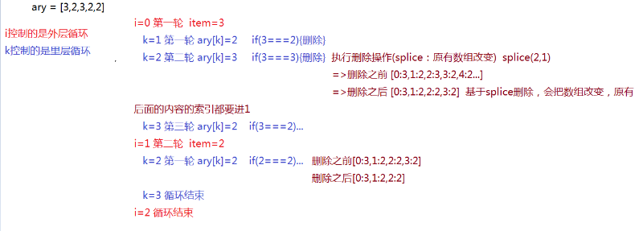

# 知识总结

## 一.基础知识

### 1.常识

#### 1.前端发展

~~~html'
第一阶段：C/S（client server） -> B/S（browser server） 网页制作
  技术栈：PhotoShop、HTML、CSS
第二阶段：从静态到动态，从后端到前端   前端开发工程师
  前后端分离
    后台：完成数据的分析和业务逻辑编写（包含API接口编写）
    前端：网页制作、JS交互效果、数据的交互和绑定
  技术栈：JavaScript、AJAX（跨域技巧）、jQuery...
第三阶段：从前端到全端（从PC端到移动端）
  技术栈：H5、CSS3、响应式布局开发、Zepto、Hybrid（混合APP开发）、微信小程序...
第四阶段（当前）：从全端到全栈
  全栈开发：前后端都可以开发（严格意义讲，一种语言完成前后端开发）
  技术栈：NODE(基于JS编程语言开发服务器端程序)、Express/Koa...
为了迎合日益发展的前端开发，JS中诞生很多有助于开发、维护、提高性能的框架：Vue、React、Angular、webpack...
展望WEB4.0时代，VR/AR元年，前端需要Canvas/webGL...
~~~


#### 2.浏览器内核

~~~HTML
 webkit（v8引擎）：大部分浏览器
 gecko：火狐
 trident：IE
 ...
 W3C：万维网联盟，制定编程语言的规范与标准
   开发者按照规范编写代码，浏览器开发商也会开发一套按照规范把代码渲染成页面的东西（这个东西就是内核或者引擎）
   浏览器内核作用：
       按照一定的规范，把代码基于GPU(显卡)绘制出对应的图形和页面等
   为啥会出现浏览器兼容：
     1.部分浏览器会提前开发一些更好的功能，后期这些功能会被收录到W3C规范中，但是在收录之前，会存在一定的兼
容性。可能是根据w3c的草稿提前开发的，后来w3c在推出规范的时候又做了一些修改，就导致了兼容性的问题，但是为了
解决兼容性的问题所以提出了浏览器前缀的办法。
     2.各个浏览器厂商，为了突出自己的独特性，用其它方法实现了W3C规范中的功能
~~~


### 2.JS组成以及ES的发展史

~~~html
1. 轻量级的客户端脚本编程语言
1. 目前的JS已经不仅仅是客户端语言了，基于NODE可以做服务器端程序，所以JS是全栈编程语言
2. 学习JS，我们学习它的几部分组成：
- ECMAScript（ES）：JS的核心语法规划，JS中的变量、数据类型、语法规范、操作语句、设计模式等等都是
									ES规定的
- DOM：document object model 文档对象模型，提供各种API（属性和方法）让JS可以获取或者操作页面中的
       HTML元素(DOM和元素)
- BOM：browser object model 浏览器对象模型，提供各种API让JS可以操作浏览器。
~~~


### 3.创建变量（variable）的六种方式（重点）

~~~html
 变量的本质是一段内存空间的别名。
 它不是具体的值，只是一个用来存储具体值的容器或者代名词，因为它存储的值可以改变，所以称为变量
  基于ES语法规范，在JS中创建变量有以下方式：
- var (ES3)
- function (ES3) 创建函数(函数名也是变量，只不过存储的值是函数类型的而已)
- let (ES6)
- const (ES6) 创建的是常量，不能给一个常量重新的赋值，常量存储的值不能被修改。
- import (ES6) 基于ES6的模块规范导出需要的信息
- class (ES6) 基于ES6创建类
~~~

~~~JavaScript
/*
 * 语法：
 *   var [变量名]=值
 *   let [变量名]=值
 *   const [常量名]=值  
 *   function 函数名(){
 *
 *   }
 *   ...
 */
var n = 13;
n = 15;
alert(n+10);//=>弹出来25 此时的N代表15

const m = 100;
m = 200;/*=>Uncaught TypeError: Assignment to constant variable.
不能给一个常量重新的赋值（常量存储的值不能被修改，能够修改就是变量了）*/
~~~

### 4.JavaScript的命名规范

~~~JavaScript
创建变量，命名的时候要遵循一些规范：
- 严格区分大小写
- 遵循驼峰命名法：按照数字、字母、下划线或者$来命名（数字不能做为名字的开头）
命名的时候基于英文单词拼接成一个完整的名字（第一个单词字母小写，其余每一个有意义单词的首字母都大写）
- 不能使用关键字和保留字：在JS中有特殊含义的叫做关键词，未来可能会成为关键字的叫做保留字

  var n=12;
  var N=13; //=>两个n不是同一个变量
  var studentInfo / student_info / _studentInfo（下划线在前的，都是公共变量） 
                  / $studentInfo（一般存储的是JQuery元素）...
                  
-语义化强一些
  add / create / insert
  del（delete）/ update / remove（rm）
  info / detail
  log
  ...
~~~

### 5.JavaScript中的数据类型

数据值是一门编程语言进行生产的材料，JS中包含的值有以下这些类型：

- 基本数据类型（值类型）
  - 数字number
  - 字符串string
  - 布尔boolean
  - null
  - undefined
- 引用数据类型
  - 对象object（对象里面还可以细分为）
    - 普通对象
    - 数组对象
    - 正则对象
    - 日期对象
    - ...
  - 函数function
- ES6中新增加的一个特殊的类型：Symbol，唯一的值

~~~html
[基本数据类型]
var n = 13; //=>0 -13 13.2 数字类型中有一个特殊的值NaN（not a number代表不是一个有效的数字,
但是属于number类型的）
var s = '';//=>"" '13' "{}" JS中所有用单引号或者双引号包裹起来的都是字符串，里面的内容是当前
字符串中的字符（一个字符串由零到多个字符组成）
var b = true;//=>布尔类型只有两个值 true真 false假

[引用数据类型]
var o = {name:'珠峰培训',age:9};//=>普通的对象：由大括号包裹起来，里面包含多组属性名和属性值
（包含多组键值对） {}空对象
var ary = [12,23,34,45]; //=>中括号包裹起来，包含零到多项内容，这种是数组对象  []空数组
var reg = /-?(\d|([1-9]\d+))(\.\d+)?/g; //=>由元字符组成一个完整的正则  //不是空正则是单行注释
function fn(){
}

[Symbol]
创建出来的是一个唯一的值
var a = Symbol('珠峰');
var b = Symbol('珠峰');
a==b =>false 假
~~~

### 6.JS代码如何被运行以及如何输出（重点）

[如何被运行]

- 把代码运行在浏览器中(浏览器内核来渲染解析)
- 基于NODE来运行(NODE也是一个基于V8引擎渲染和解析JS的工具，***node不是语言，而是一个平台、工具***)

[如何输出结果]

- alert：在浏览器中通过弹框的方式输出(浏览器提示框)，***基于alert输出的结果都会转换为字符串*。**

```
var num=12;
alert(num); //=>window.alert
var str='珠峰';
alert(str);
基于alert输出的结果都会转换为字符串：把值(如果是表达式先计算出结果)通过toString这个方法转换为字符串，
然后再输出
alert(1+1); =>'2'
alert(true); =>'true'
alert([12,23]); =>'12,23'
alert({name:'xxx'}); =>'[object Object]' 对象toString后的结果就是object object，为啥？
```

- confirm：和alert的用法一致，只不过提示的框中有确定和取消两个按钮，所以它是确认提示框

  

```
var flag = confirm('确定要退出吗?');
if(flag){
   //=>flag:true 用户点击的是确定按钮
}else{
   //=>flag:false 用户点击的是取消按钮
}
```

- prompt：在confirm的基础上增加输入框，一般不怎么用。

  

- console.log：在浏览器控制台输出日志（按F12(FN+F12)打开浏览器的控制台）

  - Elements：当前页面中的元素和样式在这里都可以看到，还可以调节样式修改结构等

  - Console：控制台，可以在JS代码中通过.log输出到这里，也可以在这里直接的编写JS代码

  - Sources：当前网站的源文件都在这里

    

- console.dir：比log输出的更加详细一些（尤其是输出对象数据值的时候）

- console.table：把一个JSON数据按照表格的方式输出。

### 7.数据类型详解（重点）

#### 1.number-数字类型

NaN：  not a number（不是一个数字）  但是NaN本身是数字（number）类型的
isNaN：检测当前值是否不是有效数字，返回true代表不是有效数字，返回false是有效数字

~~~html
var num=12;
isNaN(num); //->检测num变量存储的值是否为非有效数字 false
isNaN('13') =>false
isNaN('珠峰') =>true
isNaN(true) =>false
isNaN(false) =>false
isNaN(null) =>false
isNaN(undefined) =>true
isNaN({age:9}) =>true
isNaN([12,23]) =>true
isNaN([12]) =>false
isNaN(/^$/) =>true
isNaN(function(){}) =>true
重要：isNaN检测的机制
1、首先验证当前要检测的值是否为数字类型的，如果不是，浏览器会默认的把值转换为数字类型
2、当前检测的值已经是数字类型，是有效数字返回false，不是返回true（数字类型中只有NaN不是有效数字，其余都是
有效数字）
3、把非数字类型的值转换为数字
  - 其它基本类型转换为数字：直接使用Number这个方法转换的
  [字符串转数字]
    Number('13') ->13
    Number('13px') ->NaN 如果当前字符串中出现任意一个非有效数字字符，结果则为NaN
    Number('13.5') ->13.5 可以识别小数
  [布尔转数字]
    Number(true) ->1
    Number(false) ->0
  [其它]
    Number(null) ->0
    Number(undefined) ->NaN

  - 把引用数据类型值转换为数字：先把引用值调取toString转换为字符串，然后再把字符串调取Number转换为数字
 [对象]
     ({}).toString() ->'[object Object]' ->NaN 所有对象调用tostring,转成的结果都是'[object Object]
   [数组]
     [12,23].toString() ->'12,23' ->NaN
     [12].toString() ->'12' ->12
   [正则]
     /^$/.toString() ->'/^$/' ->NaN

  Number('') ->0  空字符串的结果是0
  [].toString() ->''  空数组转化成字符串的结果是空
  => isNaN([])：false
~~~

#### 2.parseInt / parseFloat数字类型转换

等同于Number，也是为了把其它类型的值转换为数字类型，和Number的区别在于字符串转换分析上

Number：出现任意非有效数字字符，结果就是NaN

parseInt：把一个字符串中的整数部分解析出来，

parseFloat是把一个字符串中小数(浮点数)部分解析出来

```
parseInt('13.5px') =>13
parseFloat('13.5px') =>13.5
parseInt('width:13.5px') =>NaN 从字符串最左边字符开始查找有效数字字符，并且转换为数字，
                         但是一但遇到一个非有效数字字符，查找结束
parseFloat('width:13.5px') =>NaN
```

NaN的比较

```
NaN==NaN：false NaN和谁都不相等，包括自己
思考题：有一个变量num，存储的值不知道，我想检测它是否为一个有效数字，下面方案是否可以
if(Number(num)==NaN){
    alert('num不是有效数字!');
}
NaN和谁都不相等，条件永远不成立（即使num确实不是有效数字，转换的结果确实是NaN，但是NaN!=NaN的）
if(isNaN(num)){
    //=>检测是否为有效数字，只有这一种方案
    alert('num不是有效数字!')
}
 var num="123acdw";
      if (isNaN(num)) {
        alert("num不是一个有效数字");
}
```

#### 3.布尔类型

> 只有两个值：true / false 

如何把其它数据类型转换为布尔类型?

- Boolean
- ! 取反
- !! 取两次反，相当于把其它数据类型转化为布尔类型。

```javascript
Boolean(1) =>true

!'珠峰培训' =>先把其它数据类型转换为布尔类型，然后取反

!!null =>去两次反，等价于没取反，也就剩下转换为布尔类型了
```

​	***规律：`在JS中只有“0/NaN/空字符串/null/undefined”这五个值转换为布尔类型的false，其余都转换为true`***

#### 4.null && undefined

> 都代表空或者没有
>
> - null：空对象指针
> - undefined：未定义，js当中独有数据类型

null一般都是意料之中的没有（通俗理解：一般都是人为手动的先赋值为null，后面的程序中我们会再次给他赋值）

```javascript
var num = null; //=>null是手动赋值，预示着后面我会把num变量的值进行修改
...
num = 12;
```

undefined代表的没有一般都不是人为手动控制的，大部分都是浏览器自主为空（后面可以赋值也可以不赋值）

```javascript
var num; //=>此时变量的值浏览器给分配的就是undefined
...
后面可以赋值也可以不赋值
```

#### 5.对象（object）数据类型

> 普通对象
>
> - 由大括号包裹起来的
> - 由零到多组**属性名和属性值**（键值对）组成

**属性是用来描述当前对象特征的，属性名是当前具备这个特征，属性值是对这个特征的描述（专业语法，属性名称为键[key]，属性值称为值[value]，一组属性名和属性值称为一组键值对）**

~~~js
var obj = {
	name:'珠峰培训',
	age:9
};
//=>对象的操作：对键值对的增删改查
语法：对象.属性 / 对象[属性]

[获取]
obj.name 
obj['name']  一般来说，对象的属性名都是字符串格式的（属性值不固定，任何格式都可以）

[增/改]
JS对象中属性名是不允许重复的，是唯一的
obj.name='周啸天'; //=>原有对象中存在NAME属性，此处属于修改属性值
obj.sex='男'; //=>原有对象中不存在SEX，此处相当于给当前对象新增加一个属性SEX
obj['age']=28;

[删]
彻底删除：对象中不存在这个属性了
delete obj['age'];

假删除：并没有移除这个属性，只是让当前属性的值为空
obj.sex=null;
----
在获取属性值的时候，如果当前对象有这个属性名，则可以正常获取到值（哪怕是null），但是如果没有这个属性名，
则获取的结果是undefined
obj['friends'] =>undefined
~~~

扩展（面试）：

~~~js
var obj = {
	name:'珠峰培训',
	age:9
};
var name = 'zhufeng';

obj.name  =>'珠峰培训'  获取的是NAME属性的值
obj['name'] =>'珠峰培训' 获取的是NAME属性的值
obj[name] =>此处的NAME是一个变量,我们要获取的属性名不叫做NAME，是NAME存储的值'zhufeng'
          =>obj['zhufeng'] =>没有这个属性,属性值是undefined

----
'name' 和 name 的区别?
  => 'name'是一个字符串值，它代表的是本身
  => name是一个变量，它代表的是本身存储的这个值
~~~

一个对象中的属性名不仅仅是字符串格式的，还有可能是数字格式的,否者浏览器会把这个值转化为字符串。

~~~js
var obj = {
	name:'珠峰培训',
	0:100
};
obj[0] =>100
obj['0'] =>100
obj.0 =>Uncaught SyntaxError: Unexpected number 语法错误,属性名是数字的时候不能通过“.”获取。

----
当我们存储的属性名不是字符串也不是数字的时候，浏览器会把这个值转换为字符串（toString），然后再进行存储

obj[{}]=300;  =>先把({}).toString()后的结果作为对象的属性名存储进来 obj['[object Object]']=300

obj[{}] =>获取的时候也是先把对象转换为字符串'[object Object]',然后获取之前存储的300

~~~

#### 6.数组（数组也是对象）

~~~js
数组对象（对象由键值对组成的）
var oo = {
	a:12
};
var ary = [12,23]; //=>12和23都是属性值，属性名呢？

通过观察结果，我们发现数组对象的属性名是数字（我们把数字属性名称为当前对象的索引）
ary[0]
ary['0']
ary.0  =>报错
~~~

### 8.了解JS的运行机制(堆栈内存)


**扩展：**


### 9.JS中的操作语句

#### 1.if、else判断

只要有一个条件成立，后面不管是否还有成立的条件，都不在判断执行了

~~~js
var num = 10;
if(num>5){
	num+=2;
}else if(num>8){
	num+=3;
}else{
	num+=4;
}
console.log(num); //=>12
~~~

关于条件可以怎么写？

~~~js
// >= / <= / == 常规比较
if(0){
	/*=>不管你在条件判断中写什么，最后总要把其计算出TRUE/FALSE来判断条件是否成立
  （把其它类型的值转换为布尔类型，只有 0/NaN/''/null/undefined 是false，其余都是true）*/
}

if('3px'+3){
	/*=>在JS中，+ - * / % 都是数学运算，除 + 以外，其余运算符在运算的时候，如果遇到了非数字类型的值，
  首先会转换为数字类型（Number），然后再进行运算*/
	
	//=>  + 在JS中除了数学相加，还有字符串拼接的作用（如果运算中遇到了字符串，则为字符串拼接，而不是数学相加）

	'3px'+3 =>'3px3'  =>true
}
if('3px'-3){
	'3px'-3 =>NaN
}
~~~

**面试题：**

~~~js
var num = parseInt('width:35.5px');   =>NaN
if(num==35.5){
	alert(0);
}else if(num==35){
	alert(1);
}else if(num==NaN){
	alert(2);
}else if(typeof num=='number'){
    //=>先算typeof num =>NaN,  NaN属于number类型，所以返回的结果是对应类型的字符串=>"number"
    //=>在做比较
	alert(3);//=>alert输出的都是字符串格式的 '3'
}else{
    alert(4);
}
~~~

#### 2.三元运算符

**语法：条件?成立做的事情:不成立做的事情;  <=>相当于简单的if/else判断**

~~~js
var num=12;
if(num>10){
    num++;
}else{
	num--;
}
//=>改写成三元运算符
num>10?num++:num--;
~~~

特殊情况：

~~~js
//=>如果三元运算符中的某一部分不需要做任何的处理，我们用 null/undeifned/void 0... 占位即可
var num = 12;
num>10?num++:null;
//=>如果需要执行多项操作，我们把其用小括号包裹起来，每条操作语句用逗号分隔
num=10;
num>=10?(num++,num*=10):null;
~~~

#### 3.switch case

**JS中的一种判断方式**，switch case 应用于变量（或者表达式等）在不同值情况下的不同操作，每一种case结束后都要加break（结束整个判断,否则不管后面的条件成不成立都会被执行，直到遇到break为止）。

~~~js
var num = 12;
if(num==10){
	num++;
}else if(num==5){
	num--;
}else{
	num=0;
}

//=>改成switch case
switch(num){
	case 10:
		num++;
		break;
	case 5:
		num--;
		break;
	default:
		num=0;	
}
~~~

**拓展：**

~~~js
var n="10";
n++;
n=n+1 
// 此时n++和n=n+1的效果一样吗？  
// 结果不一样，此时n++ =>10+1=11 而n+1 =>101这里是做了一个字符串的拼接，“+” 不仅仅代表数学运算，
// 在js中也有可能是字符串的拼接。
console.log(n);
~~~

**switch case和if的比较**

~~~js
var num = '10';
if (num==10) {
  console.log('相等');   //相等
} else {
  console.log('不相等');
}
//'10'==10 
//=>true 相等比较,如果等号左右两边的类型不一样，首先会转换为一样的数据类型，然后再进行比较
//  当前案例中，就是把字符串'10'转换为数字了，然后再比较的

switch(num){
  case 10:console.log('相等') ;break;
  default:console.log('不相等');  //不相等
}
//'10'===10 绝对比较，如果两边的数据类型不一样，则直接不相等，它要求类型和值都完全一样才会相等
//（真实项目中为了保证代码的严谨性，我们应该更多使用绝对比较）
~~~

#### 4.for循环

**循环：按照一定的规律去重复做某一件事情。**


**基本使用：**


**提升：**


**continue和break的区别：**


##### **案例：隔行变色**

~~~html
//用css实现
<style>
      ul {
        list-style: none;
        margin: 0;
        padding: 0;
      }
      ul li {
        margin: 0;
        padding: 0;
        display: block;
        height: 40px;
        margin: 5px 0;
        background-color: antiquewhite;
        border: 1px solid #ececec;
        line-height: 40px;
        text-align: center;
      }
      .contener {
        width: 300px;
        margin: auto;
        /* background-color: rgb(189, 176, 176); */
      }
      li:nth-child(2n) {
        background-color: rgb(155, 116, 116);
      }
  </style>
</head>
<body>
  <div class="contener">
     <ul>
       <li>1</li>
       <li>2</li>
       <li>3</li>
       <li>4</li>
       <li>5</li>
       <li>6</li>
     </ul>
  </div>
~~~


拓展：用一行代码实现隔行变色

1.

2.

3.

4.

5.

**获取页面中的DOM元素**

**document.getElementById**

 在整个文档中，**通过元素的ID属性值，获取到这个元素对象**，getElementById是获取元素的方法，而document限定了获取元素的范围，我们把这个范围称之为：“上下文 [context]”

~~~js
var oBox = document.getElementById('box');
1. 同过getElementById获取的元素是一个对象数据类型的值（里面包含很多内置的属性）
typeof oBox  =>"object"
2. 分析包含的属性
className：存储的是一个字符串，代表当前元素的样式类名
id：存储的是当前元素ID值（字符串）

innerHTML：存储当前元素中所有的内容（包含HTML标签）
innerText：存储当前元素中所有的文本内容（没有元素标签）

onclick：元素的一个事件属性，基于这个属性，可以给当前元素绑定点击事件
onmouseover：鼠标滑过事件
onmouseout：鼠标离开事件

style：存储当前元素所有的 "行内样式" 值（获取和操作的都只能是写在标签上的行内样式，写在样式表中的样式，
无法基于这个属性获取到）
~~~


**[context].getElementsByTagName** 

在指定的上下文中，**通过元素的标签名获取一组元素集合**，上下文是我们自己来指定的。


~~~js
var boxList = oBox.getElementsByTagName('li');

1. 获取的结果是一个元素集合（HTMLCollection）,首先它也是对象数据类型的，结构和数组非常相似
（数字作为索引，length代表长度），但是不是数组，我们把它叫做“类数组”

boxList[0] 获取当前集合中的第一个LI（通过索引获取到具体的某一个LI即可）
boxList.length 获取集合中LI的数量

2. 集合中的每一项存储的值又是一个元素对象（对象数据类型，包含很多的内置属性，例如：id/className...）

boxList[1].style.color='red';  修改集合中第二个LI的文字颜色
~~~


~~~js
//javascript实现隔行变色
<style>
      ul {
        list-style: none;
        margin: 0;
        padding: 0;
      }
      ul li {
        margin: 0;
        padding: 0;
        display: block;
        height: 40px;
        margin: 5px 0;
        background-color: antiquewhite;
        border: 1px solid #ececec;
        line-height: 40px;
        text-align: center;
      }
      .contener {
        width: 300px;
        margin: auto;
      }
  </style>
</head>
<body>
  <div class="contener">
     <ul id="box"> 
       <li>1</li>
       <li>2</li>
       <li>3</li>
       <li>4</li>
       <li>5</li>
       <li>6</li>
     </ul>
  </div>
  <script>
      var Box = document.getElementById('box');
      var boxlist = Box.getElementsByTagName('li');
          console.dir(boxlist);
        for (var i=0; i < boxlist.length; i+=2) {
           boxlist[i].style.backgroundColor='#ececec';
        }
  </script>
~~~

### 10.数据类型检测

#### 1.typeof

> 在JS中用来检测数据类型的方式之一，除了它以外，还有：
>
> - instanceof
> - constructor
> - Object.prototype.toString.call()

~~~js
语法：typeof [value] =>检测value的数据类型

返回值：使用typeof检测出来的结果是一个字符串，字符串中包含着对应的数据类型，
例如："number"/"string"/"boolen"/"undefined"/"object"/"function"
 
typeof null =>"object" 因为null代表空对象指针（没有指向任何的内存空间）

typeof检测数组/正则/对象，最后返回的都是"object"，也就是基于这种方式无法细分对象，只能检测基本数据类型。

面试题：
console.log(typeof []); 
//=>"object"

console.log(typeof typeof []); 
//=>typeof "object"
//=>"string"
~~~

### 11.function-函数

**在JS中，函数就是一个方法（一个功能体），基于函数一般都是为了实现某个功能。**

#### 1.函数的创建

**`函数诞生的目的就是为了实现封装`**：把实现一个功能的代码封装到一个函数中，后期想要实现这个功能，只需要把函数执行即可，不必要再次编写重复的代码，起到了**`低耦合高内聚（减少页面中的冗余代码，提高代码的重复使用率）`**的作用。

~~~js
function fn(){
	var total=10;
	total+=10;
	total/=2;
	total=total.toFixed(2);
	console.log(total);
}
fn();
fn();
...
想用多少次，我们就执行多少次函数即可
~~~

**es3中的函数与es6中的箭头函数**

~~~js
=====
ES3标准中：
//=>创建函数
function 函数名([参数]){
	函数体：实现功能的JS代码
}
函数名(); //=>函数执行

=====
ES6标准中创建箭头函数：
let 函数名(变量名)=([参数])=>{
	函数体
}；
函数名();  //函数执行
~~~

#### 2.函数数据类型的运行机制


~~~js
function fn(){
	var total=10;
	total+=10;
	total=total.toFixed(2);
	console.log(total);
}
fn();

【创建函数】
1. 函数也是引用类型，首先会开辟一个新的堆内存，把函数体中的代码当做“字符串”存储到内存中（对象向内存中存储的是键值对）
2. 把开辟的堆内存地址赋值给函数名(变量名)

此时我们输出fn（切记不是fn()）代表当前函数本身，返回的是代码字符串。
如果我们执行fn()，这是把函数执行，返回的是代码执行的结果。
所以是否加小括号是两种不同本质的操作

【函数执行】
目的：把之前存储到堆内存中的代码字符串变为真正的JS代码自上而下执行，从而实现应有的功能

1.函数执行，首先会形成一个私有的作用域（一个供代码执行的环境，也是一个栈内存）
2.把之前在堆内存中存储的字符串复制一份过来，变为真正的JS代码，在新开辟的作用域中自上而下执行 
~~~


#### 3.函数中的参数

**参数是函数的入口：当我们在函数中封装一个功能，发现一些原材料不确定，需要执行函数的时候用户传递进来才可以，此时我们就基于参数的机制，提供出入口即可**

~~~js
//=>此处的参数叫做形参：入口，形参是变量（n/m就是变量）
function sum(n,m){
	//=>n和m分别对应要求和的两个数字
	var total = 0;
	total = n + m;
	console.log(total);
}

//=>此处函数执行传递的值是实参：实参是具体的数据值
sum(10,20);  //=>n=10 m=20
sum(10); //=>n=10 m=undefined
sum(); //=>n和m都是undefined
sum(10,20,30); //=>n=10 m=20  30没有形参变量接收
~~~

#### 4案例：选项卡（堆栈内存释放，闭包作用域初见）


~~~html
//HTML基本结构
<style>
      ul {
        list-style: none;
        margin: 0;
        padding: 0;
      }
      li {
        margin: 0;
        padding: 0;
      }
      .box {
        width: 300px;
        margin: auto;
      }
      .box ul {
        position: relative;
        top:1px;
      }
      .box ul li{
        display: inline-block;
        margin-right: 10px;
        height: 30px;
        padding: 0 10px;
        line-height: 28px;
        border: 1px solid #ececec;
      }
      .box ul li.active {
        border-bottom-color: #fff;
      }
      .box div {
        display: none;
        height: 200px;
        /* background-color: antiquewhite; */
        text-align: center;
        line-height: 200px;
        border: 1px solid #ececec;
      }
      .box div.active {
        display:block;
      }
  </style>
</head>
<body>
        <div class="box" id="tablebox">
          <ul>
            <li class="active">新闻</li>
            <li>体育</li>
            <li>娱乐</li>
          </ul>
          <div class="active">新闻列表</div>
          <div>体育列表</div>
          <div>娱乐列表</div>
        </div>
</body>
</html>
~~~

~~~js
//js实现功能
  <script>
       var tableBox=document.getElementById("tablebox");
       var titlelist=tableBox.getElementsByTagName("li");
       var contanerlist=tableBox.getElementsByTagName("div");
        // console.dir(contanerlist);
        /*
       for (var i=0;i<titlelist.length;i++){
          titlelist[i].onclick= function(){ //事件绑定，给元素的onclick绑定一个方法，绑定的时候方法没有执行
                                           //属于创建方法，只有当点击的时候方法才会执行。
            //  console.log(i);
             //此时我们发现点击任何一个选项卡，打印出来的都是3，为什么会出现这种情况，原因是绑定的时候方法没有执行，
             //属于创建方法，只有当点击的时候方法才会执行，当我们去点击的时候，循环已经结束，此时的i=3，当方法执行
             //的时候传入的数字都是3.
             changeOn(i); 
          }
       }
       */

       //如何解决这种情况呢？
       //方法一：利用es6 的let创建变量
      //  for (let i=0;i<titlelist.length;i++){
      //     titlelist[i].onclick= function(){ 
      //        changeOn(i); 
      //    }
      //  }

      //方法二：给titlelist添加一个属性，用来保存titlelist的索引，当方法调用的时候传入每一次调用的具体的索引值
      //  for (let i=0;i<titlelist.length;i++){
      //     titlelist[i]['titindex']=i;  //添加属性
      //     titlelist[i].onclick= function(){ 
      //        changeOn(this.titindex); //此时存入的是每一个选项卡的具体的索引，而不是一个变量名i，谁调用就转入谁的索引
      //    }
      //  }

      //方法三：创建一个自执行函数，把创建和执行都完成了

      //  for (let i=0;i<titlelist.length;i++){
      //    ~function(i){
      //     titlelist[i].onclick= function(){ 
      //        changeOn(i); 
      //      }
      //    }(i);
      //  }
    
       //方法四：
       for (let i=0;i<titlelist.length;i++){
        
          titlelist[i].onclick= function(i){ 
            return function(){
              changeOn(i); 
            }
         }(i);
       }

       //封装一个选项卡切换的方法，传入需要修改的元素的索引
      function changeOn(index){
      for(var i=0;i<titlelist.length;i++){
         // 1.先将所有的标题和内容的默认样式类清空
          titlelist[i].className="";
          contanerlist[i].className="";
        }
      //2.将需要显示的标题和内容增加样式类
       titlelist[index].className="active";
      //   9demo.html:84 Uncaught TypeError: Cannot set property 'className' of undefined
      // at changeOn (demo.html:84)  无法设置未定义的属性。
      //此时会报错，报错原因来自于函数调用的时候，
        contanerlist[index].className="active";
      }
  </script>
</body>
</html>
~~~

**重点：**


#### **5.选项卡提升：真实项目中采用（重点）**


~~~js
 <style>
    ul {
      list-style: none;
      margin: 0;
      padding: 0;
    }
    li {
      margin: 0;
      padding: 0;
    }
    .box {
      width: 300px;
      margin: auto;
    }
    .box ul {
      position: relative;
      top:1px;
    }
    .box ul li{
      display: inline-block;
      margin-right: 10px;
      height: 30px;
      padding: 0 10px;
      line-height: 28px;
      border: 1px solid #ececec;
    }
    .box ul li.active {
      border-bottom-color: #fff;
    }
    .box div {
      display: none;
      height: 200px;
      /* background-color: antiquewhite; */
      text-align: center;
      line-height: 200px;
      border: 1px solid #ececec;
    }
    .box div.active {
      display:block;
    }
</style>
</head>
<body>
      <div class="box" id="tablebox">
        <ul>
          <li class="active">新闻</li>
          <li>体育</li>
          <li>娱乐</li>
        </ul>
        <div class="active">新闻列表</div>
        <div>体育列表</div>
        <div>娱乐列表</div>
      </div>
      <script>
        var tableBox=document.getElementById("tablebox");
        var lilist=tableBox.getElementsByTagName("li");
        var divlist=tableBox.getElementsByTagName("div");

        //方法一：自定义属性值
      //   for (var i=0;i<titlelist.length;i++){
      //     lilist[i]['titindex']=i;  
      //     lilist[i].onclick= function(){ 
      //        changeOn(this.titindex); 
      //    }
      //  }

      //  function changeOn(index){
      //  for(var i=0;i<titlelist.length;i++){
      //      lilist[i].className=divlist[i].className="";
           
      //    }
      //   lilist[index].className=divlist[index].className="active";
         
      //  }

      //方法二：上面的方法需要提前把所有未点击的元素的样式都清空，不灵活，所以如果能只针对我们当前点击的元素设置样式类；
      //      通过一个变量记录选择的元素的索引

      // var lastIndex=0; //当前选中的元素
      // for(var i=0;i<lilist.length;i++){
      //   lilist[i].myindex=i;//为选中的元素添加索引
      //   lilist[i].onclick=function(){
      //     if(this.myindex===lastIndex){
      //           return;  //如果当前点击的是上一次选中的元素则不进行任何处理
      //   }else{
      //     //如果当前点击的元素之前没有被选中，则将之前选中的元素样式清空，然后再设置当前元素的样式
      //      lilist[lastIndex].className=divlist[lastIndex].className="";

      //      this.className=divlist[this.myindex].className="active";
           
      //      lastIndex=this.myindex;   //将当前选中的元素的索引保存，传入到下一个要执行的对象中

      //   }
      //   }
      // }

      //方法三：之前我们传入的参数都是这个元素的索引值，如果我们直接传入要被点击的元素本身，
      //       则可以直接操作传入的元素对象
      for(var i=0;i<lilist.length;i++){
          lilist[i].onclick=function(){
            changOfTab(this);
          }
      }
      function changOfTab(elements){//此时传入的是一个元素
          for(var i=0;i<lilist.length;i++){
             //通过循环查找我们点击的元素的索引值
            if (elements===lilist[i]) {
              //如果当前传入的对象是我们需要点击的，则给其添加样式,就不再进行下面的操作
              lilist[i].className=divlist[i].className="active";
              continue;        //结束当前循环
            } else {
              //如果不相等，则取消选中的样式
              lilist[i].className=divlist[i].className="";
            }
          }
      }
   </script>
~~~

### 12.js中的数据类型转换

JS中的数据类型

【基本数据类型】
    数字 number
    字符串 string
    布尔 boolean
    空 null
    未定义 undefined
【引用数据类型】
    对象 object
       普通对象
       数组对象 (Array)
       正则对象 (RegExp)
       日期对象 (Date)
       数学函数 (Math)
       ...
    函数 function

真实项目中，根据需求，我们往往需要把数据类型之间进行转换

#### 1.把其它数据类型转换为number类型

`1.发生的情况`

- isNaN检测的时候：当检测的值不是数字类型,浏览器会自己调用Number方法把它先转换为数字，然后再检测是否为非有效数字

```javascript
isNaN('3') =>false
  Number('3')->3
  isNaN(3)->false

isNaN('3px') =>true
  Number('3px')->NaN
  isNaN(NaN)->true
```

- 基于parseInt/parseFloat/Number去手动转换为数字类型
- 数学运算：+ - * / %，但是“+”不仅仅是数学运算，还可能是字符串拼接

```javascript
'3'-1 =>2
  Number('3')->3
  3-1->2

'3px'-1 =>NaN

'3px'+1 =>'3px1' 字符串拼接

var i='3';
i=i+1; =>'31'
i+=1; =>'31'
i++; =>4  i++就是单纯的数学运算，已经摒弃掉字符串拼接的规则
```

- 在基于“==”比较的时候，有时候也会把其它值转换为数字类型

`2.转换规律`

```javascript
//=>转换的方法：Number（浏览器自行转换都是基于这个方法完成的）
【把字符串转换为数字】
只要遇到一个非有效数字字符，结果就是NaN
'' ->0
' ' ->0 空格(Space)
'\n' ->0 换行符(Enter)
'\t' ->0 制表符(Tab)

【把布尔转换为数字】
true ->1
false ->0

【把没有转换为数字】
null ->0
undefined ->NaN

【把引用类型值转换为数字】
首先都先转换为字符串（toString），然后再转换为数字（Number）
```

#### 2.把其它类型值转换为字符串

`1.发生的情况`

- 基于alert/confirm/prompt/document.write等方法输出内容的时候，会把输出的值转换为字符串，然后再输出

```javascript
alert(1) =>'1'
```

- 基于“+”进行字符串拼接的时候
- 把引用类型值转换为数字的时候，首先会转换为字符串，然后再转换为数字
- 给对象设置属性名，如果不是字符串，首先转换为字符串，然后再当做属性存储到对象中（对象的属性只能是数字或者字符串）
- 手动调用toString/toFixed/join/String等方法的时候，也是为了转换为字符串

```javascript
var n=Math.PI;//=>获取圆周率：
n.toFixed(2) =>'3.14'

var ary=[12,23,34];
ary.join('+') =>'12+23+34'
```

`2.转换规律`

```javascript
//=>调用的方法：toString

【除了对象，都是你理解的转换结果】
1 ->'1'
NaN ->'NaN'
null ->'null'
[] ->''
[13] ->'13'
[12,23] ->'12,23'
...

【对象】
{name:'xxx'} ->'[object Object]'
{} ->'[object Object]'
不管是啥样的普通对象，最后结果都一样
```

#### 3.把其它值转换为布尔类型

`1.发生的情况`

- 基于!/!!/Boolean等方法转换
- 条件判断中的条件最后都会转换为布尔类型
- ...

```javascript
if(n){
  //=>把n的值转换为布尔验证条件真假
}

if('3px'+3){
  //=>先计算表达式的结果'3px3'，把结果转换为布尔true，条件成立
}
```

`2.转换的规律`
只有“0/ NaN/  " " /null /undefined”五个值转换为布尔值的时候是false,其余都是转换为true

#### 4.特殊情况：

**数学运算和字符串拼接 “+”**

```javascript
//=>当表达式中出现字符串，就是字符串拼接，否则就是数学运算

1+true =>2 数学运算
'1'+true =>'1true' 字符串拼接

[12]+10 =>'1210' 虽然现在没看见字符串，但是引用类型转换为数字，首先会转换为字符串，所以变为了字符串拼接
({})+10 =>"[object Object]10"
[]+10 =>"10"

{}+10 =>10 这个和以上说的没有半毛钱关系，因为它根本就不是数学运算，也不是字符串拼接，它是两部分代码
  {} 代表一个代码块（块级作用域）
  +10 才是我们的操作
  严格写法：{}; +10;
```

思考题：

```javascript
12+true+false+null+undefined+[]+'珠峰'+null+undefined+[]+true
=>'NaN珠峰nullundefinedtrue'

12+true ->13
13+false ->13
13+null ->13
13+undefined ->NaN
NaN+[] ->'NaN'
'NaN'+'珠峰' ->'NaN珠峰'
...
'NaN珠峰trueundefined'
'NaN珠峰trueundefined'+[] ->'NaN珠峰trueundefined'
...
=>'NaN珠峰trueundefinedtrue'
```

**“==”在进行比较的时候，如果左右两边的数据类型不一样，则先转换为相同的类型，再进行比较**

对象==对象：不一定相等，因为对象操作的是引用地址，地址不相同则不相等

```javascript
{name:'xxx'}=={name:'xxx'} =>false
[]==[] =>false

var obj1={};
var obj2=obj1;
obj1==obj2 =>true
```

==========================>上面是重点强调的

对象==数字：把对象转换为数字
对象==布尔：把对象转换为数字，把布尔也转换为数字
对象==字符串：把对象转换为数字，把字符串也转换为数字
字符串==数字：字符串转换为数字
字符串==布尔：都转换为数字
布尔==数字：把布尔转换为数字
===========================>不同情况的比较，都是把其它值转换为数字，然后再进行比较的

null==undefined：true
null===undefined：false
null&&undefined和其它值都不相等

NaN==NaN：false
NaN和谁都不相等包括自己
===========================>以上需要特殊记忆

```javascript
1==true =>true
1==false =>false
2==true =>false  规律不要混淆，这里是把true变为数字1


[]==true：false  都转换为数字 0==1
![]==true：false

[]==false：true  都转换为数字 0==0
![]==false：true  先算![]，把数组转换为布尔取反=>false  =>false==false
```

### 13.数组

#### 1.数组常用方法

​	

##### 1.push

​	

​	

##### 2.pop

​	

​	

##### 3.shift（数组坍陷）

​	

​	

##### 4.unshift

​	

​	

##### 5.splice

​	

​	

​	

​	

​	

**提升：**

​	

​	

##### 6.slice

​	

​	

##### 7.concat-连接

​	

​	

##### 8.toString

​	

##### 9.join

​	

​	

##### 10.reverse—数组反转

​	

​	

##### 11.sort—排序

​	

​	

​	

##### 12.**indexof / lastindexof**

​	

​	

​	

​	

​	

#### 2.数组去重

##### 1.双循环解决和数组塌陷问题

基于splice删除数组元素导致的数组塌陷问题引出

~~~js
/*==数组去重==*/
var ary = [1, 2, 3, 2, 2, 3, 4, 3, 4, 5];

/*--解决方案一--*/
/*
 * 1.依次拿出数组中的每一项（排除最后一项：最后一项后面没有需要比较的内容）
 * 2.和当前拿出项后面的每一项依次比较
 * 3.如果发现有重复的，我们把找到的这个重复项在原有数组中删除掉（splice）
 */
//=>i<ary.length-1：不用拿最后一项
for (var i = 0; i < ary.length - 1; i++) {
    var item = ary[i];
    //=>item：依次拿出的每一项
    //=>i：当前拿出项的索引
    //=>和当前项后面的每一项比较：起始索引应该是i+1  k < ary.length找到末尾依次比较
    for (var k = i + 1; k < ary.length; k++) {
        //ary[k]：后面需要拿出来和当前项比较的这个值
        if (item === ary[k]) {
            //=>相等：重复了,我们拿出来的K这个比较项在原有数组中删除
            // ary.splice(k, 1);
            /*
             * 这样做会导致数组塌陷问题：当我们把当前项删除后，后面每一项都要向前进一位，
			 也就是原有数组的索引发生了改变，此时我们k继续累加1，下一次在拿出来的结果就会跳过一位
             * 原数组 [1,2,3,4]
             * i=1 =>2 我们把这一项干掉，然后i++，i=2
             * 原数组 [1,3,4]
             * i=2这一项是4,3这一项就错过了
             * ...
             */
            ary.splice(k, 1);//=>删除后不能让k累加了
            k--;//=>删除后先减减，在加加的时候相当于没加没减
        }
    }
}
console.log(ary);
~~~

**分析：**



##### 2.基于对象键值对方式处理

~~~js
var ary = [1, 2, 3, 2, 2, 3, 4, 3, 4, 5];
/*
 * 基于对象的属性名不能重复,我们实现高性能的数组去重
 * 1.创建一个空对象
 * 2.依次遍历数组中的每一项,把每一项存储的值，当做对象的属性名和属性值存储起来
 *
 *  第一次循环 1  {1:1}
 *  第二次循环 2  {1:1,2:2}
 *  第三次循环 3  {1:1,2:2,3:3}
 *  第四次循环 2  我们在存储之前做一个判断，判断当前对象中是否已经存在这个属性名了，
     如果存在，说明之前有这一项存储的操作，进一步说明之前数组中出现过这个数值了
	 （也就是重复了，此时我们把当前项在数组中移除即可）
 *  ...
 *
 *  如何判断对象中是否存在这个属性：如果没有这个属性，获取的属性值是undefined
 */
var obj = {};
for (var i = 0; i < ary.length; i++) {
    var item = ary[i];//=>每一次循环从数组中拿出来的这一项

    //=>存储之前需要做判断：如果对象中已经存在这个属性了，说明当前item在之前出现过，
	  //也就是当前项重复了，我们把当前项删掉
    if (typeof obj[item] !== 'undefined') {
        
        /* 方法一：
          ary.splice(i, 1);
         * i--;//=>防止数组塌陷
         * 这种删除方式不好，如果数组很长，我们删除某一项，后面索引都需要重新计算，非常耗性能
        */

        /*  方法二
         * 1.我们把数组最后一项的结果获取到，替换当前项内容
         * 2.在把数组最后一项删除
         * [12,23,34,56] 想要删除23
         *    先让56替换23 [12,56,34,56]
         *    在把最后一项删除 [12,56,34]
         */
        ary[i] = ary[ary.length - 1];
        ary.length--;
        i--;
        continue;
    }
     //=>把这一项作为对象的属性名和属性值存储进去
     obj[item] = item;//=>obj[1]=1 =>{1:1}
}
console.log(ary);
~~~

### 14.string—字符串

​	

#### 1.字符串中常用的方法

​	

##### **1.charAt /charCodeAt**

​	

​	

​	

##### **2.indexOf / lastIndexOf**

​	

​	

##### 3.slice —查找

​	

​	

##### 4.substring—真实项目中常用

​	

##### 5.substr—字符串截取

​	

​	

##### 6.toUpperCase / toLowerCase

​	

##### 7.split

​	

​	

##### 8.replace—替换

​	

​	

#### 2.字符串常做的处理

##### **1.时间字符串格式化**

​	

**方法一：**

~~~js
/*
 * 1.基于SPLIT按照空格把字符串拆成两部分(数组中的两项)
 * 2.左边这一部分继续以SPLIT按照中杠来拆
 * 3.右边这一部分继续以SPLIT按照冒号来拆
 * 4.把需要的信息拼接在一起即可（拼接的时候不足十位的补零）
 */
function addZero(val) {
    return val < 10 ? '0' + val : val;
}
var str = '2018-4-4 16:32:8';
var ary = str.split(' '),//=>["2018-4-4", "16:32:8"]
    aryLeft = ary[0].split('-'),//=>["2018", "4", "4"]
    aryRight = ary[1].split(':');//=>["16", "32", "8"]
var month = addZero(aryLeft[1]),
    day = addZero(aryLeft[2]),
    hour = addZero(aryRight[0]),
    minute = addZero(aryRight[1]);
var result = month + '月' + day + '日 ' + hour + '时' + minute + '分';
console.log(result);
~~~

**方法二：格式化时间日期万能模板**

~~~js
//可以自定义字符串输出的格式
~function (pro) {
    pro.formatTime = function (template) {
        template = template || '{0}年{1}月{2}日 {3}时{4}分{5}秒';
        var ary = this.match(/\d+/g);
        template = template.replace(/\{(\d+)\}/g, function () {
            var n = arguments[1],
                val = ary[n] || '0';
            val < 10 ? val = '0' + val : null;
            return val;
        });
        return template;
    }
}(String.prototype);
~~~

​	

##### **2.URL地址栏问号参数截取**

常用于在一个页面中，详情页展示不同内容，其实只是开发了一个页面，结构相同，只是展示的数据不同。如何判断是不是一个页面，就要根据 "?" 后面的内容来判断——问号传参。

​	

**方法一：**

~~~js
/*
 * 1.先找到问号，把问号后面的信息截取下来即可
 *  A.首先我们需要验证是否存在#哈希值，存在我们从问号开始截取到#，不存在我们直接
 截取到字符串的末尾
 * 2.以&进行拆分(数组)
 * 3.遍历数组中的每一项，把每一项在按照=进行拆分，把拆分后的第一项作为对象的属性名，
 第二项作为属性值进行存储即可
 */
var str = 'http://www.zhufengpeixun.cn/stu/?lx=1&name=AA&sex=man#teacher';
//=>#后面的称为哈希(HASH)值,这个值可能有可能没有,我们需要处理,有的话我们截取的时候需要过滤掉

//=>获取问号和井号在字符串中索引位置
var indexASK = str.indexOf('?'),
    indexWell = str.indexOf('#');
//=>#可能有可能没有
if (indexWell > -1) {
    //=>存在井号,我们截取到井号的位置即可
    str = str.substring(indexASK + 1, indexWell);
} else {
    //=>没有井号,我们截取到末尾即可
    str = str.substr(indexASK + 1);
}
//=>str='lx=1&name=AA&sex=man'
var ary = str.split('&'),//=>["lx=1", "name=AA", "sex=man"]
    obj = {};
for (var i = 0; i < ary.length; i++) {
    var item = ary[i],
        itemAry = item.split('=');
    //console.log(itemAry);//=>["lx", "1"]  ["name", "AA"] ...
    var key = itemAry[0],
        value = itemAry[1];
    obj[key] = value;
}
console.log(obj);//=>{lx: "1", name: "AA", sex: "man"}
~~~

方法二：真实项目中常用正则的方式（通用模板）

~~~js
//阿里面试题
~function (pro) {
    pro.queryURLParameter = function () {
        var obj = {}, //要存的对象的值
            reg = /([^?=&#]+)(?:=([^?=&#]+)?)/g;
        this.replace(reg, function () {
            var key = arguments[1],
                value = arguments[2] || null;
            obj[key] = value;
        });
        return obj;
    }
}(String.prototype);


var str = 'http://www.zhufengpeixun.cn/stu/?lx=1&name=&sex=#teacher';
console.log(str.queryURLParameter());

~~~

### 15.math—数学函数（对象类型）

​	

#### 1.abs—取绝对值

​	

#### 2.ceil / floor —向上或向下取整

​	

#### 3.round—四舍五入

​	

#### 4.sqrt—开平方

​	

#### 5.pow—取幂

​	

#### 6.max / min —最大值和最小值

​	

#### 7.PI—圆周率

#### 8.random—0-1之间随机小数

​	

​	**规律：**

​	

### 16.函数类型（提升）

​	

​	

#### 1.函数中的返回值


#### 2.arguments实参集合及任意数求和


~~~javascript
/*
 * 任意数求和：不管函数执行的时候，传递多少实参值进来，我们都可以求和
 * 形参有局限性：我们需要具体的知道用户执行的时候传递实参数量、顺序等，才可以使用形参变量定义对应的入口
 * arguments：函数内置的实参集合（内置：函数天生就存在的机制，不管你是否设置了形参，也不管你是否传递了实参，
 ARGUMENTS都有，始终存在）
 */
/*
function sum(n, m) {
    console.log(arguments);
    /!*
     * ARG它是一个类数组(不是数组,不能直接使用数组中的方法)
     * 即使设置形参变量,形参该是什么值还是什么值,但是ARG使用存储的是“所有”传递进来的实参，所以它被称为“实参集合”
     *
     * {
     *   0:10,
     *   1:20,
     *   length:2,
     *   callee:存储的是当前函数本身  arguments.callee===sum:true
     * }
     *!/
}
sum(10, 20);

/*把ARG中存储的实参值依次遍历,每遍历一个都累加起来,最后实现任意数求和
//=>基础版
function sum() {
    var total = null;
    for (var i = 0; i < arguments.length; i++) {
        var item = arguments[i];//=>每一次遍历出来的实参值
        total += item;
    }
    return total;//=>把计算的结果返回
}
console.log(sum(10));
*/

//=>升级版：在累加的时候，把字符串转换为数字，对于一些非有效数字，不在相加
function sum() {
    var total = null;
    for (var i = 0; i < arguments.length; i++) {
        var item = arguments[i];//=>10 '20' 'AA'
        //1.不管ITEM获取的是传递的啥,都先转换为数字类型
        item = Number(item);
        //2.如果当前的值是有效数字我们才累加,非有效数字直接跳过即可
        isNaN(item) ? null : total += item;
    }
    return total;
}

console.log(sum(10, '20', 'AA')); //=>30
~~~

**提升：**

~~~JavaScript
//es6语法
let sum = (...arg) => eval(arg.filter(item => !isNaN(item)).join('+'));
console.log(sum(10, '20', 'AA', 50));
~~~

#### 3.匿名函数和实名函数

~~~JavaScript
/*
 * 实名函数：有函数名的
 * 匿名函数：没有函数名的
 *   - 函数表达式：把函数当做值赋值给变量或者元素的事件
 *   - 自执行函数：创建和执行一起完成的
 */

/*function fn() {
}*/

//=>函数表达式
/*var fn = function () {
};
oBox.onclick = function () {
};*/

//=>自执行函数
(function (i) {  //标准推荐的使用方法
})(10);

~function () {
}();

+function () {
}();

!function () {
}();
~~~

#### 4.综合案例—验证码（重点）

~~~html
 <style>
        #codeBox {
            display: inline-block;
            width: 80px;
            height: 35px;
            line-height: 35px;
            border: 1px solid #AAA;
            text-align: center;
            font-size: 18px;
            letter-spacing: 5px;
        }
        #link{
            display: inline-block;
        }
    </style>
</head>
<body>
<div id="codeBox">
</div>
<a href="javascript:;" id="link">看不清楚换一张</a>
~~~

~~~JavaScript
// 生成一个四位随机验证码
var codeBox = document.getElementById('codeBox'),
    link = document.getElementById('link');

//=>编写一个获取四位随机验证码的方法
function queryCode() {
    //1.准备验证码获取的范围（索引：0~61）
    var codeArea = 'qwertyuiopasdfghjklzxcvbnm' +
        'QWERTYUIOPASDFGHJKLZXCVBNM' +
        '1234567890';
    //2.我们只需要准备四个索引,即可在CODE-AREA中通过CHAR-AT方法获取到四个字符,
	 // 把四个字符串拼接成一个字符串就是我们的验证码
    var result = '';
    for (var i = 0; i < 4; i++) {
        var n = Math.round(Math.random() * 61),//=>*(61-0)+0
            char = codeArea.charAt(n);
        result += char;
    }
    return result;
}

//=>开始加载页面（和点击LINK）需要生成一个验证码
codeBox.innerHTML = queryCode();//=>执行方法,把RETURN返回的四位验证码插入到CODE-BOX盒子中
link.onclick = function () {
    codeBox.innerHTML = queryCode();
};
~~~

**提升：**上面的方法有重复的

~~~JavaScript
//生成不重复的验证码

var codeBox = document.getElementById('codeBox'),
var  link = document.getElementById('link');


/* 方法一：
function queryCode() {
    var codeArea = 'qwertyuiopasdfghjklzxcvbnm' +
        'QWERTYUIOPASDFGHJKLZXCVBNM' +
        '1234567890';
    var result = '';
    for (var i = 1; i <= 4; i++) {
        var n = Math.round(Math.random() * 61),
            char = codeArea.charAt(n);
        //=>生成四个不重复的
        //=>CHAR当前本次循环找到的字符,这个字符不一定是我们想要的,如果已经在RESULT中存在了,不要这个字符了重新找
        if (result.indexOf(char) > -1) {
            i--;
            continue;
        }
        result += char;
    }
    return result;
}*/

//方法二：
function queryCode() {
    var codeArea = 'qwertyuiopasdfghjklzxcvbnm' +
        'QWERTYUIOPASDFGHJKLZXCVBNM' +
        '1234567890';
    var result = '';
    while (result.length < 4) {  //判断生成验证码的长度，如果够了就不再查找
        var n = Math.round(Math.random() * 61),
            char = codeArea.charAt(n);
        if (result.indexOf(char) === -1) {
            result += char;
        }
    }
    return result;
}
codeBox.innerHTML = queryCode();
link.onclick = function () {
    codeBox.innerHTML = queryCode();
};
~~~

### 17.DOM操作

​	

​	

​	

#### 1.获取DOM元素的方法

##### 1.getElementById 

**通过元素的ID获取指定的元素对象，使用的时候都是  document.getElementById('')  此处的document是限定了获取元素的范围，我们把它称之为“上下文(context)”** 

1. **getElementById的上下文只能是document因为严格意义上，一个页面中的ID是不能重复的，浏览器规定在整个文档中只可以获取这个唯一的ID**
2. **如果页面中的ID重复了，我们基于这个方法只能获取到第一个元素，后面相同ID元素无法获取**
3. **在IE6~7浏览器中，会把表单元素(input…)的name属性值当做ID来使用（建议：以后使用表单元素的时候，不要让name和id的值有冲突）**

##### 2.getElementsByTagName

**[context].getElementsByTagName 在指定的上下文中，根据标签名获取到一组元素集合（HTMLCollection）**

1. **获取的元素集合是一个类数组（不能直接的使数组中的方法）**

  ​	

  **2.它会把当前上下文中，子子孙孙（后代）层级内的标签都获取到（获取的不仅仅是儿子级的）**

  **3.基于这个方法获取到的结果永远都是一个集合（不管里面是否有内容，也不管有几项，它是一个容器或者集合），如果想操作集合中具体的某一项，需要基于索引获取到才可以**

#####  3.getElementsByClassName

**[context].getElementsByClassName() 在指定的上下文中，基于元素的样式类名（class=’xxx’）获取到一组元素集合**

**真实项目中，我们经常是基于样式类来给元素设置样式，所以在JS中，我们也会经常基于样式类来获取元素，但是此方法在IE6~8下不兼容**

兼容处理方案参考：

~~~JavaScript
Node.prototype.queryElementsByClassName = function queryElementsByClassName() {
  if (arguments.length === 0) return [];
  var strClass = arguments[0],
        nodeList = utils.toArray(this.getElementsByTagName('*'));
        strClass = strClass.replace(/^ +| +$/g, '').split(/ +/);
  for (var i = 0; i < strClass.length; i++) {
        var reg = new RegExp('(^|+)' + strClass[i] + '( +|$)');
        for (var k = 0; k < nodeList.length; k++) {
            if (!reg.test(nodeList[k].className)) {
                 nodeList.splice(k, 1);
                 k--;
              }
         }
   }
  return nodeList;
};
~~~

##### 4.getElementsByName

**document.getElementsByName() 它的上下文也只能是document，在整个文档中，基于元素的name属性值获取一组节点集合（也是一个类数组）**

**在IE浏览器中（IE9及以下版本），只对表单元素的name属性起作用（正常来说：我们项目中只会给表单元素设置name，给非表单元素设置name，其实是一个不太符合规范的操作）**

##### 5.querySelector—通过选择器获取

**[context].querySelector()  在指定的上下文中基于选择器（类似于CSS选择器）获取到指定的元素对象（获取的是一个元素，哪怕选择器匹配了多个，我们只获取第一个）**

##### 6.querySelectorAll

**在querySelector的基础上，我们获取到选择器匹配到的所有元素，结果是一个节点集合（NodeList）**

**querySelector/querySelectorAll 都是不兼容IE6~8浏览器的（不考虑兼容的情况下，我们能用ById或者其它方式获取的，也尽量不要用这两个方法，这两个方法性能消耗较大）**

##### 7.document.head

​	获取HEAD元素对象

##### 8.document.body

​	获取BODY元素对象

##### 9.document.documentElement

​	获取HTML元素对象

​	

**面试题：**获取当前页面中所有ID为box的元素（兼容所有的浏览器）

~~~JavaScript
/*
 * 1.首先获取当前文档中所有的HTML标签
 * 2.依次遍历这些元素标签对象，谁的ID等于HAHA，我们就把谁存储起来即可
 */
function queryAllById(id) {
    //->基于通配符*获取到整个文档中所有的HTML标签
    var nodeList = document.getElementsByTagName('*');

    //->遍历集合中的每一项，把元素ID和传递ID相同的这一项存储起来
    var ary = [];
    for (var i = 0; i < nodeList.length; i++) {
        var item = nodeList[i];
        item.id === id ? ary.push(item) : null;
    }
    return ary;
}
console.log(queryAllById('box'));

//console.log(box);  这种方式会默认把传入的当做变量名，然后进行查找
/*在JS中，默认会把元素的ID设置为变量（不需要在即获取设置），而且ID重复，获取的
结果就是一个集合，包含所有ID项，不重复就是一个元素对象（类似于ById获取的结果）*/
~~~

#### 2.节点（node）

**在一个HTML文档中出现的所有东西都是节点**
	元素节点（HTML标签）
	文本节点（文字内容）
	注释节点（注释内容）
	文档节点（document）
	…

​	

​	

​	

​	

​	

#### 3.获取节点之间关系的属性

​	

​	

​	

​	

​	

​	

​	

#### 4.提升：节点查找（jQuery设计思路）


~~~JavaScript
function children(curEle) {
    //=>首先获取当前元素下所有的子节点,然后遍历这些节点,筛选出元素的(NODE-TYPE===1)
	//把筛选出来的结果单独存储起来即可
    var nodeList = curEle.childNodes,
        result = [];
    for (var i = 0; i < nodeList.length; i++) {
        var item = nodeList[i];
        if (item.nodeType === 1) {
            result.push(item);
        }
    }
    return result;
}
console.log(children(course));
~~~


~~~JavaScript
function prev(curEle) {
    //=>先找当前元素的哥哥节点,看是否为元素节点,不是的话,基于哥哥,找哥哥的上一个哥哥节点...
	  //一直到找到元素节点或者已经没有哥哥了(说明我就是老大)则结束查找
    var pre = curEle.previousSibling; //先获取当前元素的上一个哥哥节点，在判断有没有这个节点且是不是元素节点
    while (pre && pre.nodeType !== 1) {
        /*
         * pre && pre.nodeType !== 1
         *   pre是验证还有没有，这样写代表有，没有pre是null
         *   pre.nodeType是验证是否为元素
         */
        pre = pre.previousSibling;  //如果当前节点不是元素节点，则再继续向上查找
    }
    return pre;
}
~~~

#### 5.DOM的增删改查

##### 1.createElement

​	

##### 2.appendChild

​	

##### 3.insertBefore

​	

##### 4.cloneNode

​	

##### 5.removeChild

​	

6.set / get / removeAttribute

​	

~~~javascript
var oBox=document.getElementById('box');//=>把当前元素作为一个对象，在对象对应的堆内存中新增一个自定义的属性
    oBox.myIndex = 10;//=>设置
console.log(oBox['myIndex']);//=>获取
delete oBox.myIndex; //=>删除

//=>基于Attribute等DOM方法完成自定义属性的设置
oBox.setAttribute('myColor','red'); //=>设置
oBox.getAttribute('myColor');//=>获取
oBox.removeAttribute('myColor');//=>删除
/*
上下两种机制属于独立的运作体制，不能互相混淆使用
- 第一种是基于对象键值对操作方式，修改当前元素对象的堆内存空间来完成
- 第二种是直接修改页面中HTML标签的结构来完成（此种办法设置的自定义属性可以在结构上呈现出来）
基于setAttribute设置的自定义属性值都是字符串
*/
~~~

​	

**案例：**解析一个URL字符串问号传参和HASH值部分

~~~JavaScript
//之前我们获取URL里面的内容需要的步骤：
/*
 * 1.先找到问号，把问号后面的信息截取下来即可
 *   首先我们需要验证是否存在#哈希值，存在我们从问号开始截取到#，不存在我们直接截取到字符串的末尾
 * 2.以&进行拆分(数组)
 * 3.遍历数组中的每一项，把每一项在按照=进行拆分，把拆分后的第一项作为对象的属性名，第二项作为属性值进行存储即可
 */

/*而a标签里面自带的search属性里面就存储了问号后面的内容，不管带不带有哈希，里面都存储了参数值
我们只需要获取这个属性值就可以了 */
function queryURLParameter(str) {
    //1.创建一个A标签,把需要解析的地址当做A标签的HREF赋值
    var link = document.createElement('a');
    link.href = str;
    //=>页面中不需要展示A,我们只是想要利用它的属性而已,所以无需添加到页面中

    //2.A元素对象的HASH/SEARCH两个属性分别存储了哈希值和参数值
    var search = link.search.substr(1),
        hash = link.hash.substr(1);

    //3.分别解析出HASH和参数即可
    var obj = {};
    hash ? obj.HASH = hash : null; //如果有哈希值，就把哈希值存起来
    if (search) {
        //->先按照&进行拆分
        search = search.split('&');
        for (var i = 0; i < search.length; i++) {
            var itemAry = search[i].split('=');
            obj[itemAry[0]] = itemAry[1];
        }
    }
    return obj;
}
var str = "http://www.zhufengpeixun.cn/stu?lx=1&name=AA&age=20#teacher";
console.log(queryURLParameter(str));
~~~


## 二.基础提升

### 1.变量提升机制

#### 1.JS数据渲染机制及堆栈内存


## 五.其它工具使用

### 1.NODE基础知识

推荐使用LTS稳定版本，，直接一路下一步安装即可，https://nodejs.org/zh-cn/

高级系统设置 -> 环境变量 -> 系统变量 -> Path，把原有的变量值备份一份，在原有的基础上增加node的安装目录即可


验证安装是否成功：
WIN + R  => 打开运行窗口 => 输入cmd => 打开DOS窗口
在DOS窗口中，输入 node -v /  node --version  /  npm -v   能出现版本号，则代表安装成功，不能出现版本号，提示node不是内部或者外部命令的，遵循第一步配置环境变量即可。

#### 1.node基础

**node并不是一门语言，它是一个工具或者环境**

- 基于V8引擎（webkit）渲染和解析JS的
- 单线程
- 无阻塞I/O操作
- 事件驱动
- ...

之所以把node称之为服务器端语言，是因为node给予JS操作服务器的能力：我们在服务器端安装node，只用js完成服务器端需要处理的一些事情，最后把写好的js代码交给node环境运行即可

**在node环境中把JS代码执行**

- REPL命令（Read-Evaluate-Print-Loop：输入-求值-输出-循环）
- 基于 node xxx.js 命令执行
- 基于WB这类编辑工具直接执行

基于node命令执行，我们需要先找到当前文件所在的文件夹，然后再这个目录下打开DOS窗口，在窗口中执行 node xxx.js，这样就相当于在node环境下把JS文件中的代码执行了

> 如何在当前文件目录中打开DOS窗口
>
> - 基于DOS命令中的“cd”一层层进入
> - 在当前目录地址栏中输入cmd，快速在当前目录打开
> - shift+鼠标右键，在此处打开命令窗口

​	1.

​	2.

#### 2.常用的DOS命令

`ping www.baidu.com -t`：测试网速

​	

`Ctrl+c`：结束当前正在运行的操作

`exit`：退出当前窗口
`ipconfig -all`：查看当前电脑的 物理地址/IP地址/子网掩码/DNS等信息
`cls`：清屏
`cd`：进入到指定的文件目录（windows电脑需要先进入到对应的磁盘 `E:`）
`cd ../`：返回上级目录
`cd ./`：当前目录
`cd /`：根目录
`dir`：查看当前目录下所有的文件
`mkdir`：创建文件夹
`copy con xxx.xx`：创建文件并且给文件中输入内容，输入完成后，用Ctrl+c结束并保存
`del xxx.xx`：删除文件
`rmdir xxx`：删除文件夹
...

#### 3.NPM模块管理

安装完成node后，基本上自带npm模块管理器

我们需要一个第三方（别人写的）模块、插件、类库或者框架等，需要提前下载安装才可以使用

- 百度搜索，找到下载地址，然后基于浏览器下载即可（资源比较混乱，不好搜索）
- 也可以基于npm等第三方包管理器下载（yarn / bower ... 都是第三方模块管理器）

**1.npm下载的资源都是在https://www.npmjs.com/ 中下载的**
`npm install xxx`：把资源或者第三方模块下载到当前目录下
`npm install xxx -g (--global)`：把资源或者第三方模块安装到全局环境下（目的：以后可以基于命令来操作一些事情）
`npm uninstall xxx / npm uninstall xxx -g`：从本地或者全局卸载

> 基于npm安装的一些细节点：
>
> - 需要连网（基于npm是从国外服务器上下载资源，所以下载速度较慢）
> - 下载成功后，当前目录中多增加一个 node_modules文件夹，在这个文件夹中找到我们安装的模块
> - 一般来说，下载下来的内容包含源码和最后供开发者使用的压缩版本

**2.解决下载慢的问题**
  **`基于nrm切换到国内下载源（一般是淘宝镜像）`**
首先安装nrm，而且是把它安装到全局环境下（因为我们需要使用命令）

> npm install nrm -g
>
> 安装完成后，我们可以使用 nrm 命令
>
> - nrm ls 查看当前可用源
>
>   ​	
>
>   - nrm use xxx 使用某个源
>
> 切完源，还是基于npm安装操作

 **` 可以基于yarn来安装管理`**
首先还是需要先安装yarn，安装到全局，然后基于yarn安装我们需要的模块

> npm install yarn -g
>
> 基于yarn安装（只能安装在本地，不能安装到全局）
> yarn add xxx
> yarn remove xxx

 **基于cnpm淘宝镜像来处理**

**3.解决安装版本的问题**

> 首先查看当前模块的历史版本信息
> `npm view jquery > jquery.version.json` ：把当前模块的历史信息输出到具体的某个文件中（文件名自己随便起的）
>
> 安装指定的版本模块
> `yarn add jquery@1.11.3`：npm和yarn都是这样来指定安装具体版本模块的

------

### 2.gitHub

https://github.com/ 一个提供代码管理（托管）的公共平台，我们以及众多开发者，会把自己的生产的 组件/类库/插件/框架 等托管到这个平台中，供别人下载使用和研究在gitHub中，我们可以创建仓库来管理自己的项目文件，而gitHub支持开发者通过git操作，把本地的项目代码推送到指定的仓库中，它还提供静态web页面的发布等。

在国内有一个和gitHub类似的网站：coding，和gitHub类似，也是提供代码管理的平台。

#### 1.git的基础知识

git是一个分布式代码版本管理控制系统记录当前产品代码的所有版本信息（历史修改信息）,而且方便快速回退到某一个具体的版本方便团队协作开发，能够检测代码冲突，能够合并代码等。

Git下载地址：<https://git-scm.com/downloads> 


`svn`：在git诞生前就已经存在的版本控制系统，不过它是“集中式”管理
`git`：是分布式版本管理体统

​	

#### 2.git的工作管理和基础操作

**`在本地创建git仓库管理我们的代码`**

> 初次使用git，先在本地配置一些基础信息
> \$ git config -l
> \$ git config --global user.name  xxx
> \$ git config --global user.email  xxx
> 建议大家配置的用户名和邮箱和gitHub保持一致（这样以后在本地向gitHub推送内容的时候，能够展示出是谁推荐的）

1. `git init`

> 会在当前目录中创建一个空的仓库，文件目录中生成一个 “.git” 的隐藏文件，这个文件很重要，我们本地仓库的版本信息等都存储在这里

  2.`.gitignore`

> 在当前目录（git仓库根目录）创建一个 “.gitignore” 文件，这个文件中存储了当git提交的时候所忽略的文件
>
> 可以基于linux命令 `$ touch .gitignore` （mac终端、git bash、或者集成了linux的dos，可以使用linux命令）

```
# dependencies
node_modules

# testing
/coverage

# production
/build

# misc
.DS_Store
.env.local
.env.development.local
.env.test.local
.env.production.local

# npm or yarn
npm-debug.log*
yarn-debug.log*
yarn-error.log*

# webStorm
.idea
```

#### 3.git的工作流程

当我们在本地创建一个git仓库后，我们可以基于这个仓库管理我们的代码。

每一个git仓库都划分为三个区域

- 工作区：编辑代码的地方
- 暂存区：临时存储要生成版本代码的地方
- 历史区：存储的是生成的每一个版本代码


