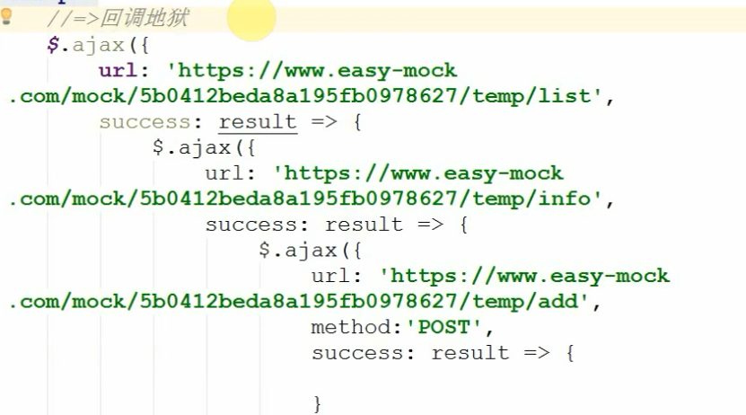
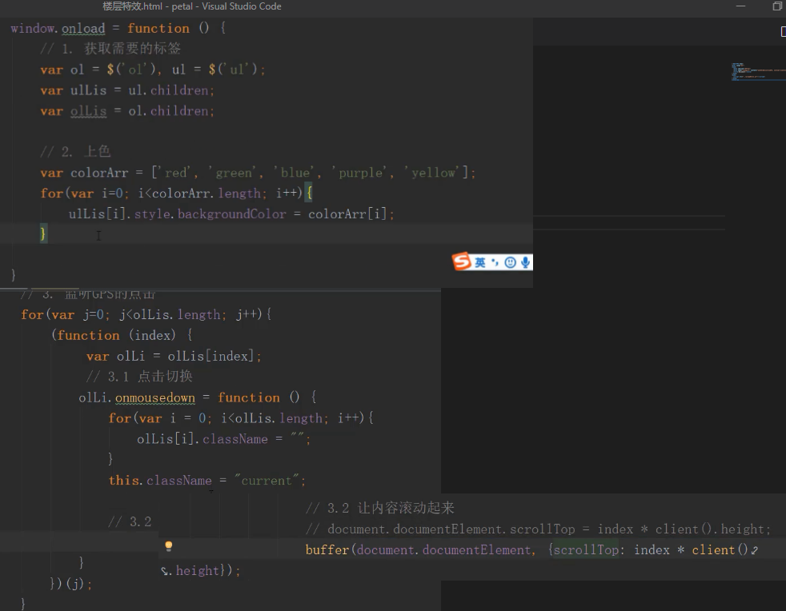
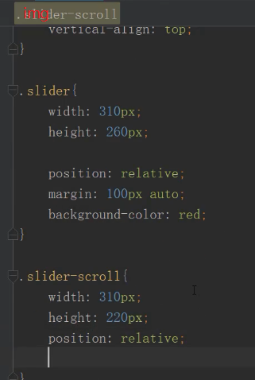

# 知识总结

## 一.基础知识

### 1.常识

#### 1.前端发展

~~~html'
第一阶段：C/S（client server） -> B/S（browser server） 网页制作
  技术栈：PhotoShop、HTML、CSS
第二阶段：从静态到动态，从后端到前端   前端开发工程师
  前后端分离
    后台：完成数据的分析和业务逻辑编写（包含API接口编写）
    前端：网页制作、JS交互效果、数据的交互和绑定
  技术栈：JavaScript、AJAX（跨域技巧）、jQuery...
第三阶段：从前端到全端（从PC端到移动端）
  技术栈：H5、CSS3、响应式布局开发、Zepto、Hybrid（混合APP开发）、微信小程序...
第四阶段（当前）：从全端到全栈
  全栈开发：前后端都可以开发（严格意义讲，一种语言完成前后端开发）
  技术栈：NODE(基于JS编程语言开发服务器端程序)、Express/Koa...
为了迎合日益发展的前端开发，JS中诞生很多有助于开发、维护、提高性能的框架：Vue、React、Angular、webpack...
展望WEB4.0时代，VR/AR元年，前端需要Canvas/webGL...
~~~


#### 2.浏览器内核

~~~HTML
 webkit（v8引擎）：大部分浏览器
 gecko：火狐
 trident：IE
 ...
 W3C：万维网联盟，制定编程语言的规范与标准
   开发者按照规范编写代码，浏览器开发商也会开发一套按照规范把代码渲染成页面的东西（这个东西就是内核或者引擎）
   浏览器内核作用：
       按照一定的规范，把代码基于GPU(显卡)绘制出对应的图形和页面等
   为啥会出现浏览器兼容：
     1.部分浏览器会提前开发一些更好的功能，后期这些功能会被收录到W3C规范中，但是在收录之前，会存在一定的兼
容性。可能是根据w3c的草稿提前开发的，后来w3c在推出规范的时候又做了一些修改，就导致了兼容性的问题，但是为了
解决兼容性的问题所以提出了浏览器前缀的办法。
     2.各个浏览器厂商，为了突出自己的独特性，用其它方法实现了W3C规范中的功能
~~~


### 2.JS组成以及ES的发展史

~~~html
1. 轻量级的客户端脚本编程语言
1. 目前的JS已经不仅仅是客户端语言了，基于NODE可以做服务器端程序，所以JS是全栈编程语言
2. 学习JS，我们学习它的几部分组成：
- ECMAScript（ES）：JS的核心语法规划，JS中的变量、数据类型、语法规范、操作语句、设计模式等等都是
									ES规定的
- DOM：document object model 文档对象模型，提供各种API（属性和方法）让JS可以获取或者操作页面中的
       HTML元素(DOM和元素)
- BOM：browser object model 浏览器对象模型，提供各种API让JS可以操作浏览器。
~~~


### 3.创建变量（variable）的六种方式（重点）

~~~html
 变量的本质是一段内存空间的别名。
 它不是具体的值，只是一个用来存储具体值的容器或者代名词，因为它存储的值可以改变，所以称为变量
  基于ES语法规范，在JS中创建变量有以下方式：
- var (ES3)
- function (ES3) 创建函数(函数名也是变量，只不过存储的值是函数类型的而已)
- let (ES6)
- const (ES6) 创建的是常量，不能给一个常量重新的赋值，常量存储的值不能被修改。
- import (ES6) 基于ES6的模块规范导出需要的信息
- class (ES6) 基于ES6创建类
~~~

~~~JavaScript
/*
 * 语法：
 *   var [变量名]=值
 *   let [变量名]=值
 *   const [常量名]=值  
 *   function 函数名(){
 *
 *   }
 *   ...
 */
var n = 13;
n = 15;
alert(n+10);//=>弹出来25 此时的N代表15

const m = 100;
m = 200;/*=>Uncaught TypeError: Assignment to constant variable.
不能给一个常量重新的赋值（常量存储的值不能被修改，能够修改就是变量了）*/
~~~

### 4.JavaScript的命名规范

~~~JavaScript
创建变量，命名的时候要遵循一些规范：
- 严格区分大小写
- 遵循驼峰命名法：按照数字、字母、下划线或者$来命名（数字不能做为名字的开头）
命名的时候基于英文单词拼接成一个完整的名字（第一个单词字母小写，其余每一个有意义单词的首字母都大写）
- 不能使用关键字和保留字：在JS中有特殊含义的叫做关键词，未来可能会成为关键字的叫做保留字

  var n=12;
  var N=13; //=>两个n不是同一个变量
  var studentInfo / student_info / _studentInfo（下划线在前的，都是公共变量） 
                  / $studentInfo（一般存储的是JQuery元素）...
                  
-语义化强一些
  add / create / insert
  del（delete）/ update / remove（rm）
  info / detail
  log
  ...
~~~

### 5.JavaScript中的数据类型

数据值是一门编程语言进行生产的材料，JS中包含的值有以下这些类型：

- 基本数据类型（值类型）
  - 数字number
  - 字符串string
  - 布尔boolean
  - null
  - undefined
- 引用数据类型
  - 对象object（对象里面还可以细分为）
    - 普通对象
    - 数组对象
    - 正则对象
    - 日期对象
    - ...
  - 函数function
- ES6中新增加的一个特殊的类型：Symbol，唯一的值

~~~html
[基本数据类型]
var n = 13; //=>0 -13 13.2 数字类型中有一个特殊的值NaN（not a number代表不是一个有效的数字,
但是属于number类型的）
var s = '';//=>"" '13' "{}" JS中所有用单引号或者双引号包裹起来的都是字符串，里面的内容是当前
字符串中的字符（一个字符串由零到多个字符组成）
var b = true;//=>布尔类型只有两个值 true真 false假

[引用数据类型]
var o = {name:'珠峰培训',age:9};//=>普通的对象：由大括号包裹起来，里面包含多组属性名和属性值
（包含多组键值对） {}空对象
var ary = [12,23,34,45]; //=>中括号包裹起来，包含零到多项内容，这种是数组对象  []空数组
var reg = /-?(\d|([1-9]\d+))(\.\d+)?/g; //=>由元字符组成一个完整的正则  //不是空正则是单行注释
function fn(){
}

[Symbol]
创建出来的是一个唯一的值
var a = Symbol('珠峰');
var b = Symbol('珠峰');
a==b =>false 假
~~~

### 6.JS代码如何被运行以及如何输出（重点）

[如何被运行]

- 把代码运行在浏览器中(浏览器内核来渲染解析)
- 基于NODE来运行(NODE也是一个基于V8引擎渲染和解析JS的工具，***node不是语言，而是一个平台、工具***)

[如何输出结果]

- alert：在浏览器中通过弹框的方式输出(浏览器提示框)，***基于alert输出的结果都会转换为字符串*。**

```
var num=12;
alert(num); //=>window.alert
var str='珠峰';
alert(str);
基于alert输出的结果都会转换为字符串：把值(如果是表达式先计算出结果)通过toString这个方法转换为字符串，
然后再输出
alert(1+1); =>'2'
alert(true); =>'true'
alert([12,23]); =>'12,23'
alert({name:'xxx'}); =>'[object Object]' 对象toString后的结果就是object object，为啥？
```

- confirm：和alert的用法一致，只不过提示的框中有确定和取消两个按钮，所以它是确认提示框

  

```
var flag = confirm('确定要退出吗?');
if(flag){
   //=>flag:true 用户点击的是确定按钮
}else{
   //=>flag:false 用户点击的是取消按钮
}
```

- prompt：在confirm的基础上增加输入框，一般不怎么用。

  

- console.log：在浏览器控制台输出日志（按F12(FN+F12)打开浏览器的控制台）

  - Elements：当前页面中的元素和样式在这里都可以看到，还可以调节样式修改结构等

  - Console：控制台，可以在JS代码中通过.log输出到这里，也可以在这里直接的编写JS代码

  - Sources：当前网站的源文件都在这里

    

- console.dir：比log输出的更加详细一些（尤其是输出对象数据值的时候）

- console.table：把一个JSON数据按照表格的方式输出。

### 7.数据类型详解（重点）

#### 1.number-数字类型

NaN：  not a number（不是一个数字）  但是NaN本身是数字（number）类型的
isNaN：检测当前值是否不是有效数字，返回true代表不是有效数字，返回false是有效数字

~~~html
var num=12;
isNaN(num); //->检测num变量存储的值是否为非有效数字 false
isNaN('13') =>false
isNaN('珠峰') =>true
isNaN(true) =>false
isNaN(false) =>false
isNaN(null) =>false
isNaN(undefined) =>true
isNaN({age:9}) =>true
isNaN([12,23]) =>true
isNaN([12]) =>false
isNaN(/^$/) =>true
isNaN(function(){}) =>true
重要：isNaN检测的机制
1、首先验证当前要检测的值是否为数字类型的，如果不是，浏览器会默认的把值转换为数字类型
2、当前检测的值已经是数字类型，是有效数字返回false，不是返回true（数字类型中只有NaN不是有效数字，其余都是
有效数字）
3、把非数字类型的值转换为数字
  - 其它基本类型转换为数字：直接使用Number这个方法转换的
  [字符串转数字]
    Number('13') ->13
    Number('13px') ->NaN 如果当前字符串中出现任意一个非有效数字字符，结果则为NaN
    Number('13.5') ->13.5 可以识别小数
  [布尔转数字]
    Number(true) ->1
    Number(false) ->0
  [其它]
    Number(null) ->0
    Number(undefined) ->NaN

  - 把引用数据类型值转换为数字：先把引用值调取toString转换为字符串，然后再把字符串调取Number转换为数字
 [对象]
     ({}).toString() ->'[object Object]' ->NaN 所有对象调用tostring,转成的结果都是'[object Object]
   [数组]
     [12,23].toString() ->'12,23' ->NaN
     [12].toString() ->'12' ->12
   [正则]
     /^$/.toString() ->'/^$/' ->NaN

  Number('') ->0  空字符串的结果是0
  [].toString() ->''  空数组转化成字符串的结果是空
  => isNaN([])：false
~~~

#### 2.parseInt / parseFloat数字类型转换

等同于Number，也是为了把其它类型的值转换为数字类型，和Number的区别在于字符串转换分析上

Number：出现任意非有效数字字符，结果就是NaN

parseInt：把一个字符串中的整数部分解析出来，

parseFloat是把一个字符串中小数(浮点数)部分解析出来

```
parseInt('13.5px') =>13
parseFloat('13.5px') =>13.5
parseInt('width:13.5px') =>NaN 从字符串最左边字符开始查找有效数字字符，并且转换为数字，
                         但是一但遇到一个非有效数字字符，查找结束
parseFloat('width:13.5px') =>NaN
```

NaN的比较

```
NaN==NaN：false NaN和谁都不相等，包括自己
思考题：有一个变量num，存储的值不知道，我想检测它是否为一个有效数字，下面方案是否可以
if(Number(num)==NaN){
    alert('num不是有效数字!');
}
NaN和谁都不相等，条件永远不成立（即使num确实不是有效数字，转换的结果确实是NaN，但是NaN!=NaN的）
if(isNaN(num)){
    //=>检测是否为有效数字，只有这一种方案
    alert('num不是有效数字!')
}
 var num="123acdw";
      if (isNaN(num)) {
        alert("num不是一个有效数字");
}
```

#### 3.布尔类型

> 只有两个值：true / false 

如何把其它数据类型转换为布尔类型?

- Boolean
- ! 取反
- !! 取两次反，相当于把其它数据类型转化为布尔类型。

```javascript
Boolean(1) =>true

!'珠峰培训' =>先把其它数据类型转换为布尔类型，然后取反

!!null =>去两次反，等价于没取反，也就剩下转换为布尔类型了
```

​	***规律：`在JS中只有“0/NaN/空字符串/null/undefined”这五个值转换为布尔类型的false，其余都转换为true`***

#### 4.null && undefined

> 都代表空或者没有
>
> - null：空对象指针
> - undefined：未定义，js当中独有数据类型

null一般都是意料之中的没有（通俗理解：一般都是人为手动的先赋值为null，后面的程序中我们会再次给他赋值）

```javascript
var num = null; //=>null是手动赋值，预示着后面我会把num变量的值进行修改
...
num = 12;
```

undefined代表的没有一般都不是人为手动控制的，大部分都是浏览器自主为空（后面可以赋值也可以不赋值）

```javascript
var num; //=>此时变量的值浏览器给分配的就是undefined
...
后面可以赋值也可以不赋值
```

#### 5.对象（object）数据类型

> 普通对象
>
> - 由大括号包裹起来的
> - 由零到多组**属性名和属性值**（键值对）组成

**属性是用来描述当前对象特征的，属性名是当前具备这个特征，属性值是对这个特征的描述（专业语法，属性名称为键[key]，属性值称为值[value]，一组属性名和属性值称为一组键值对）**

~~~js
var obj = {
	name:'珠峰培训',
	age:9
};
//=>对象的操作：对键值对的增删改查
语法：对象.属性 / 对象[属性]

[获取]
obj.name 
obj['name']  一般来说，对象的属性名都是字符串格式的（属性值不固定，任何格式都可以）

[增/改]
JS对象中属性名是不允许重复的，是唯一的
obj.name='周啸天'; //=>原有对象中存在NAME属性，此处属于修改属性值
obj.sex='男'; //=>原有对象中不存在SEX，此处相当于给当前对象新增加一个属性SEX
obj['age']=28;

[删]
彻底删除：对象中不存在这个属性了
delete obj['age'];

假删除：并没有移除这个属性，只是让当前属性的值为空
obj.sex=null;
----
在获取属性值的时候，如果当前对象有这个属性名，则可以正常获取到值（哪怕是null），但是如果没有这个属性名，
则获取的结果是undefined
obj['friends'] =>undefined
~~~

扩展（面试）：

~~~js
var obj = {
	name:'珠峰培训',
	age:9
};
var name = 'zhufeng';

obj.name  =>'珠峰培训'  获取的是NAME属性的值
obj['name'] =>'珠峰培训' 获取的是NAME属性的值
obj[name] =>此处的NAME是一个变量,我们要获取的属性名不叫做NAME，是NAME存储的值'zhufeng'
          =>obj['zhufeng'] =>没有这个属性,属性值是undefined

----
'name' 和 name 的区别?
  => 'name'是一个字符串值，它代表的是本身
  => name是一个变量，它代表的是本身存储的这个值
~~~

一个对象中的属性名不仅仅是字符串格式的，还有可能是数字格式的,否者浏览器会把这个值转化为字符串。

~~~js
var obj = {
	name:'珠峰培训',
	0:100
};
obj[0] =>100
obj['0'] =>100
obj.0 =>Uncaught SyntaxError: Unexpected number 语法错误,属性名是数字的时候不能通过“.”获取。

----
当我们存储的属性名不是字符串也不是数字的时候，浏览器会把这个值转换为字符串（toString），然后再进行存储

obj[{}]=300;  =>先把({}).toString()后的结果作为对象的属性名存储进来 obj['[object Object]']=300

obj[{}] =>获取的时候也是先把对象转换为字符串'[object Object]',然后获取之前存储的300

~~~

#### 6.数组（数组也是对象）

~~~js
数组对象（对象由键值对组成的）
var oo = {
	a:12
};
var ary = [12,23]; //=>12和23都是属性值，属性名呢？

通过观察结果，我们发现数组对象的属性名是数字（我们把数字属性名称为当前对象的索引）
ary[0]
ary['0']
ary.0  =>报错
~~~

### 8.了解JS的运行机制(堆栈内存)


**扩展：**


### 9.JS中的操作语句

#### 1.if、else判断

只要有一个条件成立，后面不管是否还有成立的条件，都不在判断执行了

~~~js
var num = 10;
if(num>5){
	num+=2;
}else if(num>8){
	num+=3;
}else{
	num+=4;
}
console.log(num); //=>12
~~~

关于条件可以怎么写？

~~~js
// >= / <= / == 常规比较
if(0){
	/*=>不管你在条件判断中写什么，最后总要把其计算出TRUE/FALSE来判断条件是否成立
  （把其它类型的值转换为布尔类型，只有 0/NaN/''/null/undefined 是false，其余都是true）*/
}

if('3px'+3){
	/*=>在JS中，+ - * / % 都是数学运算，除 + 以外，其余运算符在运算的时候，如果遇到了非数字类型的值，
  首先会转换为数字类型（Number），然后再进行运算*/
	
	//=>  + 在JS中除了数学相加，还有字符串拼接的作用（如果运算中遇到了字符串，则为字符串拼接，而不是数学相加）

	'3px'+3 =>'3px3'  =>true
}
if('3px'-3){
	'3px'-3 =>NaN
}
~~~

**面试题：**

~~~js
var num = parseInt('width:35.5px');   =>NaN
if(num==35.5){
	alert(0);
}else if(num==35){
	alert(1);
}else if(num==NaN){
	alert(2);
}else if(typeof num=='number'){
    //=>先算typeof num =>NaN,  NaN属于number类型，所以返回的结果是对应类型的字符串=>"number"
    //=>在做比较
	alert(3);//=>alert输出的都是字符串格式的 '3'
}else{
    alert(4);
}
~~~

#### 2.三元运算符

**语法：条件?成立做的事情:不成立做的事情;  <=>相当于简单的if/else判断**

~~~js
var num=12;
if(num>10){
    num++;
}else{
	num--;
}
//=>改写成三元运算符
num>10?num++:num--;
~~~

特殊情况：

~~~js
//=>如果三元运算符中的某一部分不需要做任何的处理，我们用 null/undeifned/void 0... 占位即可
var num = 12;
num>10?num++:null;
//=>如果需要执行多项操作，我们把其用小括号包裹起来，每条操作语句用逗号分隔
num=10;
num>=10?(num++,num*=10):null;
~~~

#### 3.switch case

**JS中的一种判断方式**，switch case 应用于变量（或者表达式等）在不同值情况下的不同操作，每一种case结束后都要加break（结束整个判断,否则不管后面的条件成不成立都会被执行，直到遇到break为止）。

~~~js
var num = 12;
if(num==10){
	num++;
}else if(num==5){
	num--;
}else{
	num=0;
}

//=>改成switch case
switch(num){
	case 10:
		num++;
		break;
	case 5:
		num--;
		break;
	default:
		num=0;	
}
~~~

**拓展：**

~~~js
var n="10";
n++;
n=n+1 
// 此时n++和n=n+1的效果一样吗？  
// 结果不一样，此时n++ =>10+1=11 而n+1 =>101这里是做了一个字符串的拼接，“+” 不仅仅代表数学运算，
// 在js中也有可能是字符串的拼接。
console.log(n);
~~~

**switch case和if的比较**

~~~js
var num = '10';
if (num==10) {
  console.log('相等');   //相等
} else {
  console.log('不相等');
}
//'10'==10 
//=>true 相等比较,如果等号左右两边的类型不一样，首先会转换为一样的数据类型，然后再进行比较
//  当前案例中，就是把字符串'10'转换为数字了，然后再比较的

switch(num){
  case 10:console.log('相等') ;break;
  default:console.log('不相等');  //不相等
}
//'10'===10 绝对比较，如果两边的数据类型不一样，则直接不相等，它要求类型和值都完全一样才会相等
//（真实项目中为了保证代码的严谨性，我们应该更多使用绝对比较）
~~~

#### 4.for循环

**循环：按照一定的规律去重复做某一件事情。**


**基本使用：**


**提升：**


**continue和break的区别：**


##### **案例：隔行变色**

~~~html
//用css实现
<style>
      ul {
        list-style: none;
        margin: 0;
        padding: 0;
      }
      ul li {
        margin: 0;
        padding: 0;
        display: block;
        height: 40px;
        margin: 5px 0;
        background-color: antiquewhite;
        border: 1px solid #ececec;
        line-height: 40px;
        text-align: center;
      }
      .contener {
        width: 300px;
        margin: auto;
        /* background-color: rgb(189, 176, 176); */
      }
      li:nth-child(2n) {
        background-color: rgb(155, 116, 116);
      }
  </style>
</head>
<body>
  <div class="contener">
     <ul>
       <li>1</li>
       <li>2</li>
       <li>3</li>
       <li>4</li>
       <li>5</li>
       <li>6</li>
     </ul>
  </div>
~~~


拓展：用一行代码实现隔行变色

1.

2.

3.

4.

5.

**获取页面中的DOM元素**

**document.getElementById**

 在整个文档中，**通过元素的ID属性值，获取到这个元素对象**，getElementById是获取元素的方法，而document限定了获取元素的范围，我们把这个范围称之为：“上下文 [context]”

~~~js
var oBox = document.getElementById('box');
1. 同过getElementById获取的元素是一个对象数据类型的值（里面包含很多内置的属性）
typeof oBox  =>"object"
2. 分析包含的属性
className：存储的是一个字符串，代表当前元素的样式类名
id：存储的是当前元素ID值（字符串）

innerHTML：存储当前元素中所有的内容（包含HTML标签）
innerText：存储当前元素中所有的文本内容（没有元素标签）

onclick：元素的一个事件属性，基于这个属性，可以给当前元素绑定点击事件
onmouseover：鼠标滑过事件
onmouseout：鼠标离开事件

style：存储当前元素所有的 "行内样式" 值（获取和操作的都只能是写在标签上的行内样式，写在样式表中的样式，
无法基于这个属性获取到）
~~~


**[context].getElementsByTagName** 

在指定的上下文中，**通过元素的标签名获取一组元素集合**，上下文是我们自己来指定的。


~~~js
var boxList = oBox.getElementsByTagName('li');

1. 获取的结果是一个元素集合（HTMLCollection）,首先它也是对象数据类型的，结构和数组非常相似
（数字作为索引，length代表长度），但是不是数组，我们把它叫做“类数组”

boxList[0] 获取当前集合中的第一个LI（通过索引获取到具体的某一个LI即可）
boxList.length 获取集合中LI的数量

2. 集合中的每一项存储的值又是一个元素对象（对象数据类型，包含很多的内置属性，例如：id/className...）

boxList[1].style.color='red';  修改集合中第二个LI的文字颜色
~~~


~~~js
//javascript实现隔行变色
<style>
      ul {
        list-style: none;
        margin: 0;
        padding: 0;
      }
      ul li {
        margin: 0;
        padding: 0;
        display: block;
        height: 40px;
        margin: 5px 0;
        background-color: antiquewhite;
        border: 1px solid #ececec;
        line-height: 40px;
        text-align: center;
      }
      .contener {
        width: 300px;
        margin: auto;
      }
  </style>
</head>
<body>
  <div class="contener">
     <ul id="box"> 
       <li>1</li>
       <li>2</li>
       <li>3</li>
       <li>4</li>
       <li>5</li>
       <li>6</li>
     </ul>
  </div>
  <script>
      var Box = document.getElementById('box');
      var boxlist = Box.getElementsByTagName('li');
          console.dir(boxlist);
        for (var i=0; i < boxlist.length; i+=2) {
           boxlist[i].style.backgroundColor='#ececec';
        }
  </script>
~~~

### 10.数据类型检测

#### 1.typeof

> 在JS中用来检测数据类型的方式之一，除了它以外，还有：
>
> - instanceof
> - constructor
> - Object.prototype.toString.call()

~~~js
语法：typeof [value] =>检测value的数据类型

返回值：使用typeof检测出来的结果是一个字符串，字符串中包含着对应的数据类型，
例如："number"/"string"/"boolen"/"undefined"/"object"/"function"
 
typeof null =>"object" 因为null代表空对象指针（没有指向任何的内存空间）

typeof检测数组/正则/对象，最后返回的都是"object"，也就是基于这种方式无法细分对象，只能检测基本数据类型。

面试题：
console.log(typeof []); 
//=>"object"

console.log(typeof typeof []); 
//=>typeof "object"
//=>"string"
~~~

### 11.function-函数

**在JS中，函数就是一个方法（一个功能体），基于函数一般都是为了实现某个功能。**

#### 1.函数的创建

**`函数诞生的目的就是为了实现封装`**：把实现一个功能的代码封装到一个函数中，后期想要实现这个功能，只需要把函数执行即可，不必要再次编写重复的代码，起到了**`低耦合高内聚（减少页面中的冗余代码，提高代码的重复使用率）`**的作用。

~~~js
function fn(){
	var total=10;
	total+=10;
	total/=2;
	total=total.toFixed(2);
	console.log(total);
}
fn();
fn();
...
想用多少次，我们就执行多少次函数即可
~~~

**es3中的函数与es6中的箭头函数**

~~~js
=====
ES3标准中：
//=>创建函数
function 函数名([参数]){
	函数体：实现功能的JS代码
}
函数名(); //=>函数执行

=====
ES6标准中创建箭头函数：
let 函数名(变量名)=([参数])=>{
	函数体
}；
函数名();  //函数执行
~~~

#### 2.函数数据类型的运行机制


~~~js
function fn(){
	var total=10;
	total+=10;
	total=total.toFixed(2);
	console.log(total);
}
fn();

【创建函数】
1. 函数也是引用类型，首先会开辟一个新的堆内存，把函数体中的代码当做“字符串”存储到内存中（对象向内存中存储的是键值对）
2. 把开辟的堆内存地址赋值给函数名(变量名)

此时我们输出fn（切记不是fn()）代表当前函数本身，返回的是代码字符串。
如果我们执行fn()，这是把函数执行，返回的是代码执行的结果。
所以是否加小括号是两种不同本质的操作

【函数执行】
目的：把之前存储到堆内存中的代码字符串变为真正的JS代码自上而下执行，从而实现应有的功能

1.函数执行，首先会形成一个私有的作用域（一个供代码执行的环境，也是一个栈内存）
2.把之前在堆内存中存储的字符串复制一份过来，变为真正的JS代码，在新开辟的作用域中自上而下执行 
~~~


#### 3.函数中的参数

**参数是函数的入口：当我们在函数中封装一个功能，发现一些原材料不确定，需要执行函数的时候用户传递进来才可以，此时我们就基于参数的机制，提供出入口即可**

~~~js
//=>此处的参数叫做形参：入口，形参是变量（n/m就是变量）
function sum(n,m){
	//=>n和m分别对应要求和的两个数字
	var total = 0;
	total = n + m;
	console.log(total);
}

//=>此处函数执行传递的值是实参：实参是具体的数据值
sum(10,20);  //=>n=10 m=20
sum(10); //=>n=10 m=undefined
sum(); //=>n和m都是undefined
sum(10,20,30); //=>n=10 m=20  30没有形参变量接收
~~~

#### 4案例：选项卡（堆栈内存释放，闭包作用域初见）


~~~html
//HTML基本结构
<style>
      ul {
        list-style: none;
        margin: 0;
        padding: 0;
      }
      li {
        margin: 0;
        padding: 0;
      }
      .box {
        width: 300px;
        margin: auto;
      }
      .box ul {
        position: relative;
        top:1px;
      }
      .box ul li{
        display: inline-block;
        margin-right: 10px;
        height: 30px;
        padding: 0 10px;
        line-height: 28px;
        border: 1px solid #ececec;
      }
      .box ul li.active {
        border-bottom-color: #fff;
      }
      .box div {
        display: none;
        height: 200px;
        /* background-color: antiquewhite; */
        text-align: center;
        line-height: 200px;
        border: 1px solid #ececec;
      }
      .box div.active {
        display:block;
      }
  </style>
</head>
<body>
        <div class="box" id="tablebox">
          <ul>
            <li class="active">新闻</li>
            <li>体育</li>
            <li>娱乐</li>
          </ul>
          <div class="active">新闻列表</div>
          <div>体育列表</div>
          <div>娱乐列表</div>
        </div>
</body>
</html>
~~~

~~~js
//js实现功能
  <script>
       var tableBox=document.getElementById("tablebox");
       var titlelist=tableBox.getElementsByTagName("li");
       var contanerlist=tableBox.getElementsByTagName("div");
        // console.dir(contanerlist);
        /*
       for (var i=0;i<titlelist.length;i++){
          titlelist[i].onclick= function(){ //事件绑定，给元素的onclick绑定一个方法，绑定的时候方法没有执行
                                           //属于创建方法，只有当点击的时候方法才会执行。
            //  console.log(i);
             //此时我们发现点击任何一个选项卡，打印出来的都是3，为什么会出现这种情况，原因是绑定的时候方法没有执行，
             //属于创建方法，只有当点击的时候方法才会执行，当我们去点击的时候，循环已经结束，此时的i=3，当方法执行
             //的时候传入的数字都是3.
             changeOn(i); 
          }
       }
       */

       //如何解决这种情况呢？
       //方法一：利用es6 的let创建变量
      //  for (let i=0;i<titlelist.length;i++){
      //     titlelist[i].onclick= function(){ 
      //        changeOn(i); 
      //    }
      //  }

      //方法二：给titlelist添加一个属性，用来保存titlelist的索引，当方法调用的时候传入每一次调用的具体的索引值
      //  for (let i=0;i<titlelist.length;i++){
      //     titlelist[i]['titindex']=i;  //添加属性
      //     titlelist[i].onclick= function(){ 
      //        changeOn(this.titindex); //此时存入的是每一个选项卡的具体的索引，而不是一个变量名i，谁调用就转入谁的索引
      //    }
      //  }

      //方法三：创建一个自执行函数，把创建和执行都完成了

      //  for (let i=0;i<titlelist.length;i++){
      //    ~function(i){
      //     titlelist[i].onclick= function(){ 
      //        changeOn(i); 
      //      }
      //    }(i);
      //  }
    
       //方法四：
       for (let i=0;i<titlelist.length;i++){
        
          titlelist[i].onclick= function(i){ 
            return function(){
              changeOn(i); 
            }
         }(i);
       }

       //封装一个选项卡切换的方法，传入需要修改的元素的索引
      function changeOn(index){
      for(var i=0;i<titlelist.length;i++){
         // 1.先将所有的标题和内容的默认样式类清空
          titlelist[i].className="";
          contanerlist[i].className="";
        }
      //2.将需要显示的标题和内容增加样式类
       titlelist[index].className="active";
      //   9demo.html:84 Uncaught TypeError: Cannot set property 'className' of undefined
      // at changeOn (demo.html:84)  无法设置未定义的属性。
      //此时会报错，报错原因来自于函数调用的时候，
        contanerlist[index].className="active";
      }
  </script>
</body>
</html>
~~~

**重点：**


#### **5.选项卡提升：真实项目中采用（重点）**


~~~js
 <style>
    ul {
      list-style: none;
      margin: 0;
      padding: 0;
    }
    li {
      margin: 0;
      padding: 0;
    }
    .box {
      width: 300px;
      margin: auto;
    }
    .box ul {
      position: relative;
      top:1px;
    }
    .box ul li{
      display: inline-block;
      margin-right: 10px;
      height: 30px;
      padding: 0 10px;
      line-height: 28px;
      border: 1px solid #ececec;
    }
    .box ul li.active {
      border-bottom-color: #fff;
    }
    .box div {
      display: none;
      height: 200px;
      /* background-color: antiquewhite; */
      text-align: center;
      line-height: 200px;
      border: 1px solid #ececec;
    }
    .box div.active {
      display:block;
    }
</style>
</head>
<body>
      <div class="box" id="tablebox">
        <ul>
          <li class="active">新闻</li>
          <li>体育</li>
          <li>娱乐</li>
        </ul>
        <div class="active">新闻列表</div>
        <div>体育列表</div>
        <div>娱乐列表</div>
      </div>
      <script>
        var tableBox=document.getElementById("tablebox");
        var lilist=tableBox.getElementsByTagName("li");
        var divlist=tableBox.getElementsByTagName("div");

        //方法一：自定义属性值
      //   for (var i=0;i<titlelist.length;i++){
      //     lilist[i]['titindex']=i;  
      //     lilist[i].onclick= function(){ 
      //        changeOn(this.titindex); 
      //    }
      //  }

      //  function changeOn(index){
      //  for(var i=0;i<titlelist.length;i++){
      //      lilist[i].className=divlist[i].className="";
           
      //    }
      //   lilist[index].className=divlist[index].className="active";
         
      //  }

      //方法二：上面的方法需要提前把所有未点击的元素的样式都清空，不灵活，所以如果能只针对我们当前点击的元素设置样式类；
      //      通过一个变量记录选择的元素的索引

      // var lastIndex=0; //当前选中的元素
      // for(var i=0;i<lilist.length;i++){
      //   lilist[i].myindex=i;//为选中的元素添加索引
      //   lilist[i].onclick=function(){
      //     if(this.myindex===lastIndex){
      //           return;  //如果当前点击的是上一次选中的元素则不进行任何处理
      //   }else{
      //     //如果当前点击的元素之前没有被选中，则将之前选中的元素样式清空，然后再设置当前元素的样式
      //      lilist[lastIndex].className=divlist[lastIndex].className="";

      //      this.className=divlist[this.myindex].className="active";
           
      //      lastIndex=this.myindex;   //将当前选中的元素的索引保存，传入到下一个要执行的对象中

      //   }
      //   }
      // }

      //方法三：之前我们传入的参数都是这个元素的索引值，如果我们直接传入要被点击的元素本身，
      //       则可以直接操作传入的元素对象
      for(var i=0;i<lilist.length;i++){
          lilist[i].onclick=function(){
            changOfTab(this);
          }
      }
      function changOfTab(elements){//此时传入的是一个元素
          for(var i=0;i<lilist.length;i++){
             //通过循环查找我们点击的元素的索引值
            if (elements===lilist[i]) {
              //如果当前传入的对象是我们需要点击的，则给其添加样式,就不再进行下面的操作
              lilist[i].className=divlist[i].className="active";
              continue;        //结束当前循环
            } else {
              //如果不相等，则取消选中的样式
              lilist[i].className=divlist[i].className="";
            }
          }
      }
   </script>
~~~

### 12.js中的数据类型转换

JS中的数据类型

【基本数据类型】
    数字 number
    字符串 string
    布尔 boolean
    空 null
    未定义 undefined
【引用数据类型】
    对象 object
       普通对象
       数组对象 (Array)
       正则对象 (RegExp)
       日期对象 (Date)
       数学函数 (Math)
       ...
    函数 function

真实项目中，根据需求，我们往往需要把数据类型之间进行转换

#### 1.把其它数据类型转换为number类型

`1.发生的情况`

- isNaN检测的时候：当检测的值不是数字类型,浏览器会自己调用Number方法把它先转换为数字，然后再检测是否为非有效数字

```javascript
isNaN('3') =>false
  Number('3')->3
  isNaN(3)->false

isNaN('3px') =>true
  Number('3px')->NaN
  isNaN(NaN)->true
```

- 基于parseInt/parseFloat/Number去手动转换为数字类型
- 数学运算：+ - * / %，但是“+”不仅仅是数学运算，还可能是字符串拼接

```javascript
'3'-1 =>2
  Number('3')->3
  3-1->2

'3px'-1 =>NaN

'3px'+1 =>'3px1' 字符串拼接

var i='3';
i=i+1; =>'31'
i+=1; =>'31'
i++; =>4  i++就是单纯的数学运算，已经摒弃掉字符串拼接的规则
```

- 在基于“==”比较的时候，有时候也会把其它值转换为数字类型

`2.转换规律`

```javascript
//=>转换的方法：Number（浏览器自行转换都是基于这个方法完成的）
【把字符串转换为数字】
只要遇到一个非有效数字字符，结果就是NaN
'' ->0
' ' ->0 空格(Space)
'\n' ->0 换行符(Enter)
'\t' ->0 制表符(Tab)

【把布尔转换为数字】
true ->1
false ->0

【把没有转换为数字】
null ->0
undefined ->NaN

【把引用类型值转换为数字】
首先都先转换为字符串（toString），然后再转换为数字（Number）
```

#### 2.把其它类型值转换为字符串

`1.发生的情况`

- 基于alert/confirm/prompt/document.write等方法输出内容的时候，会把输出的值转换为字符串，然后再输出

```javascript
alert(1) =>'1'
```

- 基于“+”进行字符串拼接的时候
- 把引用类型值转换为数字的时候，首先会转换为字符串，然后再转换为数字
- 给对象设置属性名，如果不是字符串，首先转换为字符串，然后再当做属性存储到对象中（对象的属性只能是数字或者字符串）
- 手动调用toString/toFixed/join/String等方法的时候，也是为了转换为字符串

```javascript
var n=Math.PI;//=>获取圆周率：
n.toFixed(2) =>'3.14'

var ary=[12,23,34];
ary.join('+') =>'12+23+34'
```

`2.转换规律`

```javascript
//=>调用的方法：toString

【除了对象，都是你理解的转换结果】
1 ->'1'
NaN ->'NaN'
null ->'null'
[] ->''
[13] ->'13'
[12,23] ->'12,23'
...

【对象】
{name:'xxx'} ->'[object Object]'
{} ->'[object Object]'
不管是啥样的普通对象，最后结果都一样
```

#### 3.把其它值转换为布尔类型

`1.发生的情况`

- 基于!/!!/Boolean等方法转换
- 条件判断中的条件最后都会转换为布尔类型
- ...

```javascript
if(n){
  //=>把n的值转换为布尔验证条件真假
}

if('3px'+3){
  //=>先计算表达式的结果'3px3'，把结果转换为布尔true，条件成立
}
```

`2.转换的规律`
只有“0/ NaN/  " " /null /undefined”五个值转换为布尔值的时候是false,其余都是转换为true

#### 4.特殊情况：

**数学运算和字符串拼接 “+”**

```javascript
//=>当表达式中出现字符串，就是字符串拼接，否则就是数学运算

1+true =>2 数学运算
'1'+true =>'1true' 字符串拼接

[12]+10 =>'1210' 虽然现在没看见字符串，但是引用类型转换为数字，首先会转换为字符串，所以变为了字符串拼接
({})+10 =>"[object Object]10"
[]+10 =>"10"

{}+10 =>10 这个和以上说的没有半毛钱关系，因为它根本就不是数学运算，也不是字符串拼接，它是两部分代码
  {} 代表一个代码块（块级作用域）
  +10 才是我们的操作
  严格写法：{}; +10;
```

思考题：

```javascript
12+true+false+null+undefined+[]+'珠峰'+null+undefined+[]+true
=>'NaN珠峰nullundefinedtrue'

12+true ->13
13+false ->13
13+null ->13
13+undefined ->NaN
NaN+[] ->'NaN'
'NaN'+'珠峰' ->'NaN珠峰'
...
'NaN珠峰trueundefined'
'NaN珠峰trueundefined'+[] ->'NaN珠峰trueundefined'
...
=>'NaN珠峰trueundefinedtrue'
```

**“==”在进行比较的时候，如果左右两边的数据类型不一样，则先转换为相同的类型，再进行比较**

对象==对象：不一定相等，因为对象操作的是引用地址，地址不相同则不相等

```javascript
{name:'xxx'}=={name:'xxx'} =>false
[]==[] =>false

var obj1={};
var obj2=obj1;
obj1==obj2 =>true
```

==========================>上面是重点强调的

对象==数字：把对象转换为数字
对象==布尔：把对象转换为数字，把布尔也转换为数字
对象==字符串：把对象转换为数字，把字符串也转换为数字
字符串==数字：字符串转换为数字
字符串==布尔：都转换为数字
布尔==数字：把布尔转换为数字
===========================>不同情况的比较，都是把其它值转换为数字，然后再进行比较的

null==undefined：true
null===undefined：false
null&&undefined和其它值都不相等

NaN==NaN：false
NaN和谁都不相等包括自己
===========================>以上需要特殊记忆

```javascript
1==true =>true
1==false =>false
2==true =>false  规律不要混淆，这里是把true变为数字1


[]==true：false  都转换为数字 0==1
![]==true：false

[]==false：true  都转换为数字 0==0
![]==false：true  先算![]，把数组转换为布尔取反=>false  =>false==false
```

### 13.数组

#### 1.数组常用方法

​	

##### 1.push—末尾追加新内容

​	

​	

##### 2.pop—删除最后一项

​	

​	

##### 3.shift—删除第一项（数组坍陷）

​	

​	

##### 4.unshift—开始位置追加新内容

​	

​	

##### 5.splice—删除指定内容

​	

​	

​	

​	

​	

**提升：**

​	

​	

##### 6.slice—查找指定内容

​	

​	

##### 7.concat-连接

​	

​	

##### 8.toString

​	

##### 9.join—数组转字符串

​	

​	

##### 10.reverse—数组反转

​	

​	

##### 11.sort—排序

​	

​	

​	

##### 12.**indexof / lastindexof**

​	

​	

​	

​	

​	

#### 2.数组去重

##### 1.双循环解决和数组塌陷问题

基于splice删除数组元素导致的数组塌陷问题引出

~~~js
/*==数组去重==*/
var ary = [1, 2, 3, 2, 2, 3, 4, 3, 4, 5];

/*--解决方案一--*/
/*
 * 1.依次拿出数组中的每一项（排除最后一项：最后一项后面没有需要比较的内容）
 * 2.和当前拿出项后面的每一项依次比较
 * 3.如果发现有重复的，我们把找到的这个重复项在原有数组中删除掉（splice）
 */
//=>i<ary.length-1：不用拿最后一项
for (var i = 0; i < ary.length - 1; i++) {
    var item = ary[i];
    //=>item：依次拿出的每一项
    //=>i：当前拿出项的索引
    //=>和当前项后面的每一项比较：起始索引应该是i+1  k < ary.length找到末尾依次比较
    for (var k = i + 1; k < ary.length; k++) {
        //ary[k]：后面需要拿出来和当前项比较的这个值
        if (item === ary[k]) {
            //=>相等：重复了,我们拿出来的K这个比较项在原有数组中删除
            // ary.splice(k, 1);
            /*
             * 这样做会导致数组塌陷问题：当我们把当前项删除后，后面每一项都要向前进一位，
			 也就是原有数组的索引发生了改变，此时我们k继续累加1，下一次在拿出来的结果就会跳过一位
             * 原数组 [1,2,3,4]
             * i=1 =>2 我们把这一项干掉，然后i++，i=2
             * 原数组 [1,3,4]
             * i=2这一项是4,3这一项就错过了
             * ...
             */
            ary.splice(k, 1);//=>删除后不能让k累加了
            k--;//=>删除后先减减，在加加的时候相当于没加没减
        }
    }
}
console.log(ary);
~~~

**分析：**


##### 2.基于对象键值对方式处理

~~~js
var ary = [1, 2, 3, 2, 2, 3, 4, 3, 4, 5];
/*
 * 基于对象的属性名不能重复,我们实现高性能的数组去重
 * 1.创建一个空对象
 * 2.依次遍历数组中的每一项,把每一项存储的值，当做对象的属性名和属性值存储起来
 *
 *  第一次循环 1  {1:1}
 *  第二次循环 2  {1:1,2:2}
 *  第三次循环 3  {1:1,2:2,3:3}
 *  第四次循环 2  我们在存储之前做一个判断，判断当前对象中是否已经存在这个属性名了，
     如果存在，说明之前有这一项存储的操作，进一步说明之前数组中出现过这个数值了
	 （也就是重复了，此时我们把当前项在数组中移除即可）
 *  ...
 *
 *  如何判断对象中是否存在这个属性：如果没有这个属性，获取的属性值是undefined
 */
var obj = {};
for (var i = 0; i < ary.length; i++) {
    var item = ary[i];//=>每一次循环从数组中拿出来的这一项

    //=>存储之前需要做判断：如果对象中已经存在这个属性了，说明当前item在之前出现过，
	  //也就是当前项重复了，我们把当前项删掉
    if (typeof obj[item] !== 'undefined') {
        
        /* 方法一：
          ary.splice(i, 1);
         * i--;//=>防止数组塌陷
         * 这种删除方式不好，如果数组很长，我们删除某一项，后面索引都需要重新计算，非常耗性能
        */

        /*  方法二
         * 1.我们把数组最后一项的结果获取到，替换当前项内容
         * 2.在把数组最后一项删除
         * [12,23,34,56] 想要删除23
         *    先让56替换23 [12,56,34,56]
         *    在把最后一项删除 [12,56,34]
         */
        ary[i] = ary[ary.length - 1];
        ary.length--;
        i--;
        continue;
    }
     //=>把这一项作为对象的属性名和属性值存储进去
     obj[item] = item;//=>obj[1]=1 =>{1:1}
}
console.log(ary);
~~~

### 14.string—字符串

​	

#### 1.字符串中常用的方法

​	

##### **1.charAt /charCodeAt**

​	

​	

​	

##### **2.indexOf / lastIndexOf**

​	

​	

##### 3.slice —查找

​	

​	

##### 4.substring—真实项目中常用

​	

##### 5.substr—字符串截取

​	

​	

##### 6.toUpperCase / toLowerCase

​	

##### 7.split

​	

​	

##### 8.replace—替换

​	

​	

#### 2.字符串常做的处理

##### **1.时间字符串格式化**

​	

**方法一：**

~~~js
/*
 * 1.基于SPLIT按照空格把字符串拆成两部分(数组中的两项)
 * 2.左边这一部分继续以SPLIT按照中杠来拆
 * 3.右边这一部分继续以SPLIT按照冒号来拆
 * 4.把需要的信息拼接在一起即可（拼接的时候不足十位的补零）
 */
function addZero(val) {
    return val < 10 ? '0' + val : val;
}
var str = '2018-4-4 16:32:8';
var ary = str.split(' '),//=>["2018-4-4", "16:32:8"]
    aryLeft = ary[0].split('-'),//=>["2018", "4", "4"]
    aryRight = ary[1].split(':');//=>["16", "32", "8"]
var month = addZero(aryLeft[1]),
    day = addZero(aryLeft[2]),
    hour = addZero(aryRight[0]),
    minute = addZero(aryRight[1]);
var result = month + '月' + day + '日 ' + hour + '时' + minute + '分';
console.log(result);
~~~

**方法二：格式化时间日期万能模板**

~~~js
//可以自定义字符串输出的格式
~function (pro) {
    pro.formatTime = function (template) {
        template = template || '{0}年{1}月{2}日 {3}时{4}分{5}秒';
        var ary = this.match(/\d+/g);
        template = template.replace(/\{(\d+)\}/g, function () {
            var n = arguments[1],
                val = ary[n] || '0';
            val < 10 ? val = '0' + val : null;
            return val;
        });
        return template;
    }
}(String.prototype);
~~~

​	

##### **2.URL地址栏问号参数截取**

常用于在一个页面中，详情页展示不同内容，其实只是开发了一个页面，结构相同，只是展示的数据不同。如何判断是不是一个页面，就要根据 "?" 后面的内容来判断——问号传参。

​	

**方法一：**

~~~js
/*
 * 1.先找到问号，把问号后面的信息截取下来即可
 *  A.首先我们需要验证是否存在#哈希值，存在我们从问号开始截取到#，不存在我们直接
 截取到字符串的末尾
 * 2.以&进行拆分(数组)
 * 3.遍历数组中的每一项，把每一项在按照=进行拆分，把拆分后的第一项作为对象的属性名，
 第二项作为属性值进行存储即可
 */
var str = 'http://www.zhufengpeixun.cn/stu/?lx=1&name=AA&sex=man#teacher';
//=>#后面的称为哈希(HASH)值,这个值可能有可能没有,我们需要处理,有的话我们截取的时候需要过滤掉

//=>获取问号和井号在字符串中索引位置
var indexASK = str.indexOf('?'),
    indexWell = str.indexOf('#');
//=>#可能有可能没有
if (indexWell > -1) {
    //=>存在井号,我们截取到井号的位置即可
    str = str.substring(indexASK + 1, indexWell);
} else {
    //=>没有井号,我们截取到末尾即可
    str = str.substr(indexASK + 1);
}
//=>str='lx=1&name=AA&sex=man'
var ary = str.split('&'),//=>["lx=1", "name=AA", "sex=man"]
    obj = {};
for (var i = 0; i < ary.length; i++) {
    var item = ary[i],
        itemAry = item.split('=');
    //console.log(itemAry);//=>["lx", "1"]  ["name", "AA"] ...
    var key = itemAry[0],
        value = itemAry[1];
    obj[key] = value;
}
console.log(obj);//=>{lx: "1", name: "AA", sex: "man"}
~~~

方法二：真实项目中常用正则的方式（通用模板）

~~~js
//阿里面试题
~function (pro) {
    pro.queryURLParameter = function () {
        var obj = {}, //要存的对象的值
            reg = /([^?=&#]+)(?:=([^?=&#]+)?)/g;
        this.replace(reg, function () {
            var key = arguments[1],
                value = arguments[2] || null;
            obj[key] = value;
        });
        return obj;
    }
}(String.prototype);


var str = 'http://www.zhufengpeixun.cn/stu/?lx=1&name=&sex=#teacher';
console.log(str.queryURLParameter());

~~~

### 15.math—数学函数（对象类型）

​	

#### 1.abs—取绝对值

​	

#### 2.ceil / floor —向上或向下取整

​	

#### 3.round—四舍五入

​	

#### 4.sqrt—开平方

​	

#### 5.pow—取幂

​	

#### 6.max / min —最大值和最小值

​	

#### 7.PI—圆周率

#### 8.random—0-1之间随机小数

​	

​	**规律：**

​	

### 16.函数类型（提升）

​	

​	

#### 1.函数中的返回值


#### 2.arguments实参集合及任意数求和


~~~javascript
/*
 * 任意数求和：不管函数执行的时候，传递多少实参值进来，我们都可以求和
 * 形参有局限性：我们需要具体的知道用户执行的时候传递实参数量、顺序等，才可以使用形参变量定义对应的入口
 * arguments：函数内置的实参集合（内置：函数天生就存在的机制，不管你是否设置了形参，也不管你是否传递了实参，
 ARGUMENTS都有，始终存在）
 */
/*
function sum(n, m) {
    console.log(arguments);
    /!*
     * ARG它是一个类数组(不是数组,不能直接使用数组中的方法)
     * 即使设置形参变量,形参该是什么值还是什么值,但是ARG使用存储的是“所有”传递进来的实参，所以它被称为“实参集合”
     *
     * {
     *   0:10,
     *   1:20,
     *   length:2,
     *   callee:存储的是当前函数本身  arguments.callee===sum:true
     * }
     *!/
}
sum(10, 20);

/*把ARG中存储的实参值依次遍历,每遍历一个都累加起来,最后实现任意数求和
//=>基础版
function sum() {
    var total = null;
    for (var i = 0; i < arguments.length; i++) {
        var item = arguments[i];//=>每一次遍历出来的实参值
        total += item;
    }
    return total;//=>把计算的结果返回
}
console.log(sum(10));
*/

//=>升级版：在累加的时候，把字符串转换为数字，对于一些非有效数字，不在相加
function sum() {
    var total = null;
    for (var i = 0; i < arguments.length; i++) {
        var item = arguments[i];//=>10 '20' 'AA'
        //1.不管ITEM获取的是传递的啥,都先转换为数字类型
        item = Number(item);
        //2.如果当前的值是有效数字我们才累加,非有效数字直接跳过即可
        isNaN(item) ? null : total += item;
    }
    return total;
}

console.log(sum(10, '20', 'AA')); //=>30
~~~

**提升：**

~~~JavaScript
//es6语法
let sum = (...arg) => eval(arg.filter(item => !isNaN(item)).join('+'));
console.log(sum(10, '20', 'AA', 50));
~~~

#### 3.匿名函数和实名函数

~~~JavaScript
/*
 * 实名函数：有函数名的
 * 匿名函数：没有函数名的
 *   - 函数表达式：把函数当做值赋值给变量或者元素的事件
 *   - 自执行函数：创建和执行一起完成的
 */

/*function fn() {
}*/

//=>函数表达式
/*var fn = function () {
};
oBox.onclick = function () {
};*/

//=>自执行函数
(function (i) {  //标准推荐的使用方法
})(10);

~function () {
}();

+function () {
}();

!function () {
}();
~~~

#### 4.综合案例—验证码（重点）

~~~html
 <style>
        #codeBox {
            display: inline-block;
            width: 80px;
            height: 35px;
            line-height: 35px;
            border: 1px solid #AAA;
            text-align: center;
            font-size: 18px;
            letter-spacing: 5px;
        }
        #link{
            display: inline-block;
        }
    </style>
</head>
<body>
<div id="codeBox">
</div>
<a href="javascript:;" id="link">看不清楚换一张</a>
~~~

~~~JavaScript
// 生成一个四位随机验证码
var codeBox = document.getElementById('codeBox'),
    link = document.getElementById('link');

//=>编写一个获取四位随机验证码的方法
function queryCode() {
    //1.准备验证码获取的范围（索引：0~61）
    var codeArea = 'qwertyuiopasdfghjklzxcvbnm' +
        'QWERTYUIOPASDFGHJKLZXCVBNM' +
        '1234567890';
    //2.我们只需要准备四个索引,即可在CODE-AREA中通过CHAR-AT方法获取到四个字符,
	 // 把四个字符串拼接成一个字符串就是我们的验证码
    var result = '';
    for (var i = 0; i < 4; i++) {
        var n = Math.round(Math.random() * 61),//=>*(61-0)+0
            char = codeArea.charAt(n);
        result += char;
    }
    return result;
}

//=>开始加载页面（和点击LINK）需要生成一个验证码
codeBox.innerHTML = queryCode();//=>执行方法,把RETURN返回的四位验证码插入到CODE-BOX盒子中
link.onclick = function () {
    codeBox.innerHTML = queryCode();
};
~~~

**提升：**上面的方法有重复的

~~~JavaScript
//生成不重复的验证码

var codeBox = document.getElementById('codeBox'),
var  link = document.getElementById('link');


/* 方法一：
function queryCode() {
    var codeArea = 'qwertyuiopasdfghjklzxcvbnm' +
        'QWERTYUIOPASDFGHJKLZXCVBNM' +
        '1234567890';
    var result = '';
    for (var i = 1; i <= 4; i++) {
        var n = Math.round(Math.random() * 61),
            char = codeArea.charAt(n);
        //=>生成四个不重复的
        //=>CHAR当前本次循环找到的字符,这个字符不一定是我们想要的,如果已经在RESULT中存在了,不要这个字符了重新找
        if (result.indexOf(char) > -1) {
            i--;
            continue;
        }
        result += char;
    }
    return result;
}*/

//方法二：
function queryCode() {
    var codeArea = 'qwertyuiopasdfghjklzxcvbnm' +
        'QWERTYUIOPASDFGHJKLZXCVBNM' +
        '1234567890';
    var result = '';
    while (result.length < 4) {  //判断生成验证码的长度，如果够了就不再查找
        var n = Math.round(Math.random() * 61),
            char = codeArea.charAt(n);
        if (result.indexOf(char) === -1) {
            result += char;
        }
    }
    return result;
}
codeBox.innerHTML = queryCode();
link.onclick = function () {
    codeBox.innerHTML = queryCode();
};
~~~

### 17.DOM操作

​	

​	

​	

#### 1.获取DOM元素的方法

##### 1.getElementById 

**通过元素的ID获取指定的元素对象，使用的时候都是  document.getElementById('')  此处的document是限定了获取元素的范围，我们把它称之为“上下文(context)”** 

1. **getElementById的上下文只能是document因为严格意义上，一个页面中的ID是不能重复的，浏览器规定在整个文档中只可以获取这个唯一的ID**
2. **如果页面中的ID重复了，我们基于这个方法只能获取到第一个元素，后面相同ID元素无法获取**
3. **在IE6~7浏览器中，会把表单元素(input…)的name属性值当做ID来使用（建议：以后使用表单元素的时候，不要让name和id的值有冲突）**

##### 2.getElementsByTagName

**[context].getElementsByTagName 在指定的上下文中，根据标签名获取到一组元素集合（HTMLCollection）**

1. **获取的元素集合是一个类数组（不能直接的使数组中的方法）**

  ​	

  **2.它会把当前上下文中，子子孙孙（后代）层级内的标签都获取到（获取的不仅仅是儿子级的）**

  **3.基于这个方法获取到的结果永远都是一个集合（不管里面是否有内容，也不管有几项，它是一个容器或者集合），如果想操作集合中具体的某一项，需要基于索引获取到才可以**

#####  3.getElementsByClassName

**[context].getElementsByClassName() 在指定的上下文中，基于元素的样式类名（class=’xxx’）获取到一组元素集合**

**真实项目中，我们经常是基于样式类来给元素设置样式，所以在JS中，我们也会经常基于样式类来获取元素，但是此方法在IE6~8下不兼容**

兼容处理方案参考：

~~~JavaScript
Node.prototype.queryElementsByClassName = function queryElementsByClassName() {
  if (arguments.length === 0) return [];
  var strClass = arguments[0],
        nodeList = utils.toArray(this.getElementsByTagName('*'));
        strClass = strClass.replace(/^ +| +$/g, '').split(/ +/);
  for (var i = 0; i < strClass.length; i++) {
        var reg = new RegExp('(^|+)' + strClass[i] + '( +|$)');
        for (var k = 0; k < nodeList.length; k++) {
            if (!reg.test(nodeList[k].className)) {
                 nodeList.splice(k, 1);
                 k--;
              }
         }
   }
  return nodeList;
};
~~~

##### 4.getElementsByName

**document.getElementsByName() 它的上下文也只能是document，在整个文档中，基于元素的name属性值获取一组节点集合（也是一个类数组）**

**在IE浏览器中（IE9及以下版本），只对表单元素的name属性起作用（正常来说：我们项目中只会给表单元素设置name，给非表单元素设置name，其实是一个不太符合规范的操作）**

##### 5.querySelector—通过选择器获取

**[context].querySelector()  在指定的上下文中基于选择器（类似于CSS选择器）获取到指定的元素对象（获取的是一个元素，哪怕选择器匹配了多个，我们只获取第一个）**

##### 6.querySelectorAll

**在querySelector的基础上，我们获取到选择器匹配到的所有元素，结果是一个节点集合（NodeList）**

**querySelector/querySelectorAll 都是不兼容IE6~8浏览器的（不考虑兼容的情况下，我们能用ById或者其它方式获取的，也尽量不要用这两个方法，这两个方法性能消耗较大）**

##### 7.document.head

​	获取HEAD元素对象

##### 8.document.body

​	获取BODY元素对象

##### 9.document.documentElement

​	获取HTML元素对象

​	

**面试题：**获取当前页面中所有ID为box的元素（兼容所有的浏览器）

~~~JavaScript
/*
 * 1.首先获取当前文档中所有的HTML标签
 * 2.依次遍历这些元素标签对象，谁的ID等于HAHA，我们就把谁存储起来即可
 */
function queryAllById(id) {
    //->基于通配符*获取到整个文档中所有的HTML标签
    var nodeList = document.getElementsByTagName('*');

    //->遍历集合中的每一项，把元素ID和传递ID相同的这一项存储起来
    var ary = [];
    for (var i = 0; i < nodeList.length; i++) {
        var item = nodeList[i];
        item.id === id ? ary.push(item) : null;
    }
    return ary;
}
console.log(queryAllById('box'));

//console.log(box);  这种方式会默认把传入的当做变量名，然后进行查找
/*在JS中，默认会把元素的ID设置为变量（不需要在即获取设置），而且ID重复，获取的
结果就是一个集合，包含所有ID项，不重复就是一个元素对象（类似于ById获取的结果）*/
~~~

#### 2.节点（node）

**在一个HTML文档中出现的所有东西都是节点**
	元素节点（HTML标签）
	文本节点（文字内容）
	注释节点（注释内容）
	文档节点（document）
	…

​	

​	

​	

​	

​	

#### 3.获取节点之间关系的属性

​	

​	

​	

​	

​	

​	

​	

#### 4.提升：节点查找（jQuery设计思路）


~~~JavaScript
function children(curEle) {
    //=>首先获取当前元素下所有的子节点,然后遍历这些节点,筛选出元素的(NODE-TYPE===1)
	//把筛选出来的结果单独存储起来即可
    var nodeList = curEle.childNodes,
        result = [];
    for (var i = 0; i < nodeList.length; i++) {
        var item = nodeList[i];
        if (item.nodeType === 1) {
            result.push(item);
        }
    }
    return result;
}
console.log(children(course));
~~~


~~~JavaScript
function prev(curEle) {
    //=>先找当前元素的哥哥节点,看是否为元素节点,不是的话,基于哥哥,找哥哥的上一个哥哥节点...
	  //一直到找到元素节点或者已经没有哥哥了(说明我就是老大)则结束查找
    var pre = curEle.previousSibling; //先获取当前元素的上一个哥哥节点，在判断有没有这个节点且是不是元素节点
    while (pre && pre.nodeType !== 1) {
        /*
         * pre && pre.nodeType !== 1
         *   pre是验证还有没有，这样写代表有，没有pre是null
         *   pre.nodeType是验证是否为元素
         */
        pre = pre.previousSibling;  //如果当前节点不是元素节点，则再继续向上查找
    }
    return pre;
}
~~~

#### 5.DOM的增删改查

##### 1.createElement

​	

##### 2.appendChild

​	

##### 3.insertBefore

​	

##### 4.cloneNode

​	

##### 5.removeChild

​	

6.set / get / removeAttribute

​	

~~~javascript
var oBox=document.getElementById('box');//=>把当前元素作为一个对象，在对象对应的堆内存中新增一个自定义的属性
    oBox.myIndex = 10;//=>设置
console.log(oBox['myIndex']);//=>获取
delete oBox.myIndex; //=>删除

//=>基于Attribute等DOM方法完成自定义属性的设置
oBox.setAttribute('myColor','red'); //=>设置
oBox.getAttribute('myColor');//=>获取
oBox.removeAttribute('myColor');//=>删除
/*
上下两种机制属于独立的运作体制，不能互相混淆使用
- 第一种是基于对象键值对操作方式，修改当前元素对象的堆内存空间来完成
- 第二种是直接修改页面中HTML标签的结构来完成（此种办法设置的自定义属性可以在结构上呈现出来）
基于setAttribute设置的自定义属性值都是字符串
*/
~~~

​	

**案例：**解析一个URL字符串问号传参和HASH值部分

~~~JavaScript
//之前我们获取URL里面的内容需要的步骤：
/*
 * 1.先找到问号，把问号后面的信息截取下来即可
 *   首先我们需要验证是否存在#哈希值，存在我们从问号开始截取到#，不存在我们直接截取到字符串的末尾
 * 2.以&进行拆分(数组)
 * 3.遍历数组中的每一项，把每一项在按照=进行拆分，把拆分后的第一项作为对象的属性名，第二项作为属性值进行存储即可
 */

/*而a标签里面自带的search属性里面就存储了问号后面的内容，不管带不带有哈希，里面都存储了参数值
我们只需要获取这个属性值就可以了 */
function queryURLParameter(str) {
    //1.创建一个A标签,把需要解析的地址当做A标签的HREF赋值
    var link = document.createElement('a');
    link.href = str;
    //=>页面中不需要展示A,我们只是想要利用它的属性而已,所以无需添加到页面中

    //2.A元素对象的HASH/SEARCH两个属性分别存储了哈希值和参数值
    var search = link.search.substr(1),
        hash = link.hash.substr(1);

    //3.分别解析出HASH和参数即可
    var obj = {};
    hash ? obj.HASH = hash : null; //如果有哈希值，就把哈希值存起来
    if (search) {
        //->先按照&进行拆分
        search = search.split('&');
        for (var i = 0; i < search.length; i++) {
            var itemAry = search[i].split('=');
            obj[itemAry[0]] = itemAry[1];
        }
    }
    return obj;
}
var str = "http://www.zhufengpeixun.cn/stu?lx=1&name=AA&age=20#teacher";
console.log(queryURLParameter(str));
~~~

## 二.JS中级

### 1.变量提升机制

#### 1.JS数据渲染机制及堆栈内存

**js的基本运行机制**：

​	

​	

#### 2.**完整的运行机制**：**变量提升**

~~~JavaScript
/*  变量提升：
 *   =>当栈内存(作用域)形成，JS代码自上而下执行之前，浏览器首先会把所有带 “VAR”/“FUNCTION”
      关键词的进行提前 “声明” 或者 “定义” ，这种预先处理机制称之为 “变量提升”
 *
 *   =>声明(declare)：var a  （默认值undefined）
 *   =>定义(defined)：a=12 （定义其实就是赋值操作）
 *
 *   [变量提升阶段]
 *   =>带“VAR”的只声明未定义
 *   =>带“FUNCTION”的声明和赋值都完成了
 *
 *   =>变量提升只发生在当前作用域（例如：开始加载页面的时候只对全局作用域下的进行提升，因为此时函数中存储的都是字符串而已）
 *   =>在全局作用域下声明的函数或者变量是“全局变量”，同理，在私有作用域下声明的变量是“私有变量” [带VAR/FUNCTION的才是声明]
 *
 *   =>浏览器很懒，做过的事情不会重复执行第二遍，也就是，当代码执行遇到创建函数这部分代码后，直接的跳过即可
      （因为在提升阶段就已经完成函数的赋值操作了）
 */
console.log(a);//=>undefined
var a = 12;

//=>案例一：
/*console.log(a, b, c);//=>undefined * 3
var a = 10,
    b = 10,
    c = 10;

function fn(a) {
    console.log(a, b, c);//=>10 undefined 10
    var b = a = c = 100;
    console.log(a, b, c);//=>100 * 3
}

fn(10, 20);
console.log(a, b, c);//=>10 10 100*/


/*
 var a = 10,
    b = 10,
    c = 10;

 =>var a=10;  var b=10;  var c=10;

 var a=b=c=100;
 =>var a=100;  b=100;  c=100; （只有A带VAR声明，其余的都没有）
*/

//=>所有的定义赋值操作都是先准备值，然后再赋值的
/*var n = m = [12, 23];
/!*
 * 1. var n;
 * 2. 准备值(AAAFFF222)
 * 3. n=AAAFFF222
 *    m=AAAFFF222
 *!/*/

/*var n=[12,23];
/!*
 * 1. 声明N
 * 2. 准备值（开辟一个堆内存，存储键值对，有一个16进制地址）
 * 3. 赋值（把16进制地址赋值给N：N=AAAFFF111）
 *!/*/


//=>案例二：
/*
 * 变量提升：
 *    var a;
 *    var b;
 *    fn = aaafff000;
 */
/*var a = 10,
    b = 10;
function fn(a) {
    /!*
     * 形参赋值：a=10
     * 变量提升：var b;
     *!/
    //console.log(a, b, c);//=>Uncaught ReferenceError: c is not defined
    a *= 2;//=>a=20
    var b = a;//=>b=20
    b++;//=>b=21
    c = b;//=>给全局作用域中设置一个C
    console.log(a, b, c);//=>20/21/21
}
a = fn(a);//=>把FN执行，把全局变量A的值作为实参传递给函数的形参，接收函数的返回结果，用结果替换原有全局变量A的值  a=fn(10)
//=> 想要知道函数的返回值，只需要看函数中是否有RETURN，有的话，RETURN是啥返回结果就是啥，没有默认返回UNDEFINED  a=undefined
console.log(a, b, c);//=>undefined/10/21*/
~~~

​	

#### 3.带var和不带的区别

**补充：**

​	

**带var的**：

~~~JavaScript
//=>在全局作用域下声明一个变量，也相当于给WINDOW全局对象设置了一个属性，变量的值就是属性值
//  （私有作用域中声明的私有变量和WINDOW没啥关系） js中恶心的地方之一。

console.log(a);//=>undefined
console.log(window.a);//=>undefined
console.log('a' in window); //=>TRUE 在变量提升阶段，在全局作用域中声明了一个变量A，
							//  此时就已经把A当做属性赋值给WINDOW了，只不过此时还没有给A赋值，
							//默认值UNDEFINED  in：检测某个属性是否隶属于这个对象
var a = 12;//=>全局变量值修改，WIN的属性值也跟着修改
console.log(a);//=>全局变量A  12
console.log(window.a);//=>WINDOW的一个属性名A  12

a = 13;
console.log(window.a);//=>13

window.a = 14;
console.log(a);//=>14
//=>全局变量和WIN中的属性存在 “映射机制”
~~~

**不带var的**：

~~~JavaScript
//=>不加VAR的本质是WIN的属性

// console.log(a);//=>Uncaught ReferenceError: a is not defined
   console.log(window.a);//=>undefined
// console.log('a' in window);//=>false
a = 12; //=> 在执行这行代码之前window.a是undefined，说明这行代码并不是声明一个变量，而是给window添加了一个属性并进行赋值
        //  是window.a=12 的简写
console.log(a);//=>12
console.log(window.a);//=>12
~~~

**提升**：作用域链

~~~JavaScript
/*var a = 12,
    b = 13;//=>这样写B是带VAR的*/
/*var a = b = 12;//=>这样写B是不带VAR的*/

console.log(a, b);//=>undefined undefined
var a = 12,
    b = 12;

function fn() {
    console.log(a, b);//=>undefined 12
    var a = b = 13;   // 相当于 var a=13;  b=13;
    console.log(a, b);//=>13 13
}

fn();
console.log(a, b);//=>12 13 
~~~

·	

#### 4.作用域链扩展

~~~JavaScript
function fn() {
    //变量提升：无
    // console.log(b);   //=>Uncaught ReferenceError: b is not defined
    b = 13;
    console.log('b' in window);//=>true  在作用域链查找的过程中，
	                             //如果找到WIN也没有这个变量，相当于给WIN设置了一个属性B (window.b=13)
    console.log(b);//=>13
}

fn();
console.log(b);//=>13
~~~

#### 5.变量提升的细节

~~~JavaScript
/*
 * 变量提升：
 *   var fn;   =>只对等号左边进行变量提升
 *   sum = AAAFFF111;
 */
sum();
fn();//=>Uncaught TypeError: fn is not a function

//=>匿名函数之函数表达式
var fn = function () {
    console.log(1);
};//=>代码执行到此处会把函数值赋值给FN

fn();
//=>普通的函数
function sum() {
    console.log(2);
}
~~~

#### 6.条件判断下的变量提升

~~~JavaScript
/*
 * 在当前作用域下，不管条件是否成立都要进行变量提升
 *   =>带VAR的还是只声明
 *   =>带FUNCTION的在老版本浏览器渲染机制下，声明和定义都处理，但是为了迎合ES6中的块级作用域，
   新版浏览器对于函数（在条件判断中的函数），不管条件是否成立，都只是先声明，没有定义，类似于VAR
 */

/*
 * 变量提升
 *   var a;  =>在全局作用域下声明的全局变量也相当于给WIN设置了一个属性 window.a=undefined
 */
console.log(a);//=>undefined
if ('a' in window) {
    var a = 100;
}
console.log(a);//=>100

/*
 * 变量提升：
 *   function fn;
 */
// console.log(fn);//=>undefined
if (1 === 1) {
    console.log(fn);//=>函数本身：当条件成立，进入到判断体中（在ES6中它是一个块级作用域）第一件事并不是代码执行
	                 // 而是类似于变量提升一样，先把FN声明和定义了，也就是判断体中代码执行之前，FN就已经赋值了
    function fn() {
        console.log('ok');
    }
}
// console.log(fn);//=>函数本身


/*
 * 变量提升：无
 */
f = function () {return true;};//=>window.f=...（TRUE）
g = function () {return false;};//=>window.g=...（FALSE）
~function () {
    /*
     * 变量提升：
     *   function g;  //=>g是私有变量
     */
    if (g() && [] == ![]) {//=>Uncaught TypeError: g is not a function （此时的g是undefined）
        //=>[]==![]：TRUE
        f = function () {return false;};//=>把全局中的f进行修改 window.f=...（FALSE）
        function g() {return true;}
    }
}();
console.log(f());
console.log(g());
~~~

#### 7.变量提升机制下重名的处理

~~~JavaScript
/*
 * 1.带VAR和FUNCTION关键字声明相同的名字，这种也算是重名了（其实是一个FN，只是存储值的类型不一样）
 */
/*
var fn = 12;
function fn() {

}
*/

/*
 * 2.关于重名的处理：如果名字重复了，不会重新的声明，但是会重新的定义（重新赋值）
 [不管是变量提升还是代码执行阶段皆是如此]
 */

/*
 * 变量提升：
 *   fn = ...（1）
 *      = ...（2）
 *      = ...（3）
 *      = ...（4）
 */
/*
fn();//=>4
function fn() {console.log(1);}
fn();//=>4
function fn() {console.log(2);}
fn();//=>4
var fn=100;//=>带VAR的在提升阶段只把声明处理了,赋值操作没有处理,所以在代码执行的时候需要完成赋值 FN=100
fn();//=>100() Uncaught TypeError: fn is not a function
function fn() {console.log(3);}
fn();
function fn() {console.log(4);}
fn();
*/
~~~

#### 8.ES6中的LET不存在变量提升

~~~JavaScript
//变量提升本身不严谨，因为在后面定义的变量，前面也能调用
/*
 * 在ES6中基于LET/CONST等方式创建变量或者函数,不存在变量提升机制
 *
 *  =>切断了全局变量和WINDOW属性的映射机制
 *
 *  =>在相同的作用域中，基于LET不能声明相同名字的变量（不管用什么方式在当前作用域下声明了变量，
 *    再次使用LET创建都会报错）
 *
 *   虽然没有变量提升机制，但是在当前作用域代码自上而下执行之前，浏览器会做一个重复性检测（语法检测）：
 *   自上而下查找当前作用域下所有变量，一旦发现有重复的，直接抛出异常，代码也不会在执行了
 *  （虽然没有把变量提前声明定义，但是浏览器已经记住了，当前作用域下有哪些变量）
 */

// console.log(a);//=>Uncaught ReferenceError: a is not defined
// let a = 12;
// console.log(window.a);//=>undefined
// console.log(a);//=>12

/*let a = 12;
console.log(a);
let a = 13;//=>Uncaught SyntaxError: Identifier 'a' has already been declared
console.log(a);*/

/*b = 12;
console.log(b);//=>12
a = 12;//=>Uncaught ReferenceError: a is not defined
console.log(a);
let a = 13;
console.log(a);*/

let a = 10,
    b = 10;
let fn = function () {
    console.log(a, b);//=>Uncaught ReferenceError: a is not defined
    let a = b = 20;
    /*
     * let a=20;
     * b=20; //=>把全局中的 b=20
     */
    console.log(a, b);
};
fn();
console.log(a, b);
~~~

#### 9.暂时性死区

~~~JavaScript
/*
var a = 12;
if (true) {
    console.log(a);//=>Uncaught ReferenceError: a is not defined
    let a = 13;//=>基于LET创建变量，会把大部分{}当做一个私有的块级作用域（类似于函数的私有作用域），
	//在这里也是重新检测语法规范，看一下是否是基于新语法创建的变量，如果是按照新语法规范来解析
}
*/

/*
// console.log(a);//=>Uncaught ReferenceError: a is not defined
  console.log(typeof a);//=>"undefined" 在原有浏览器渲染机制下,基于typeof等逻辑运算符检测一个
  未被声明过的变量，不会报错，返回UNDEFINED
*/

// console.log(a);//=>Uncaught ReferenceError: a is not defined
console.log(typeof a);//=>Uncaught ReferenceError: a is not defined
let a;//=>如果当前变量是基于ES6语法处理，在没有声明这个变量的时候，使用TYPEOF检测会直接报错，
      //不会是UNDEFINED，解决了原有的JS的死区
~~~

### 2.闭包

**[闭包]**  **闭包就是能够读取其他函数内部变量的函数**。

1. **函数执形成一个私有的作用域，保护里面的私有变量不受外界的干扰，这种保护机制称之为“闭包”**
2. **市面上的开发者认为的闭包是：形成一个不销毁的私有作用域（私有栈内存）才是闭包**

#### 1.区分私有变量和全局变量

~~~JavaScript
/*
 * 变量提升：
 *    var a;  var b;  var c;
 *    fn = xxx...
 */
var a = 12,
    b = 13,
    c = 14;

function fn(a) {
    /*
     * 形参赋值
     *   a = 12
     * 变量提升
     *   var b;
     * =>在私有作用域中，只有以下两种情况是私有变量
     *  A:声明过的变量(带VAR/FUNCTION)
     *  B:形参也是私有变量
     *  剩下的都不是自己私有的变量，都需要基于作用域链的机制向上查找
     */
    console.log(a, b, c);//=>12 undefined 14(C是全局的)
    var b = c = a = 20; //var b=20; c=20; =>把全局的C修改为20  a=20;
    console.log(a, b, c);//=>20*3
}
fn(a);//=>把FN执行(小括号中是实参:值) =>执行FN把全局变量A的值12当做实参传递给函数的形参 =>fn(12)
console.log(a, b, c);//=>12 13 20
~~~

**提升：**

~~~JavaScript
var ary = [12, 23];

function fn(ary) {
    console.log(ary);
    ary[0] = 100;  //将原来数组的第一项改为100  此时原来的数组变为100 23
    ary = [100];   //此时ary指向了另一个数组
    ary[0] = 0;
    console.log(ary); 
}

fn(ary);   //此时arr并没有返回值 所以arr的指向没有发生改变
console.log(ary);  //100 23  打印的还是原来数组的值
~~~


#### 2.上级作用域的查找

~~~JavaScript
/*
 * 当前函数执行，形成一个私有作用域A，A的上级作用域是谁，和他在哪执行的没有关系，
   和他在哪创建（定义）的有关系，在哪创建的，它的上级作用域就是谁
 */
var a = 12;
function fn() {
    //=>arguments:实参集合
    //=>arguments.callee:函数本身FN
    console.log(arguments.callee.caller);  //=>arguments.callee.caller:当前函数在哪执行的,
	                                       //CALLER就是谁(记录的是它执行的宿主环境),在全局下执行CALLER的结果是NULL
}
function sum() {
    var a = 120;
    fn();  //12  因为fn是在全局作用域中创建的，所以它的上级作用域都是window对象
}
sum();

function aa() {
    fn();  //unll
}
aa();
~~~

**提升：**

~~~JavaScript
//下面代码 输出几次 ，结果分别是什么
var n = 10;
function fn() {
    var n = 20;
    function f() {
        n++;
        console.log(n);  
    }
    f(); //21  //当前函数执行，形成一个私有作用域A，A的上级作用域是谁，和他在哪执行的没有关系，
               // 和他在哪创建（定义）的有关系，在哪创建的，它的上级作用域就是谁
    return f;
}
var x = fn(); //此时x的赋值是函数f
x(); //22
x(); //23
console.log(n); //10
~~~


#### 3.闭包及堆栈内存释放

~~~JavaScript
/*
 * JS中的内存分为堆内存和栈内存
 *   堆内存：存储引用数据类型值（对象：键值对  函数：代码字符串）
 *   栈内存：提供JS代码执行的环境和存储基本类型值
 *
 * [堆内存释放]
 *   让所有引用堆内存空间地址的变量赋值为null即可（没有变量占用这个堆内存了，
     浏览器会在空闲的时候把它释放掉）
 *
 * [栈内存释放]
 *   一般情况下，当函数执行完成，所形成的私有作用域（栈内存）都会自动释放掉（在栈内存
     中存储的值也都会释放掉），但是也有特殊不销毁的情况：
 *   1.函数执行完成，当前形成的栈内存中，某些内容被栈内存以外的变量占用了，此时栈内存
       不能释放（一旦释放外面找不到原有的内容了）
 *   2.全局栈内存只有在页面关闭的时候才会被释放掉
 *   ...
 *   如果当前栈内存没有被释放，那么之前在栈内存中存储的基本值也不会被释放，能够一直保存下来
 */

var i = 1;
function fn(i) {
    return function (n) {
        console.log(n + (++i));
    }
}
var f = fn(2);
f(3);
fn(5)(6);
fn(7)(8);
f(4);
//=>在和其它值进行运算的时候有一些区别
// i++:自身累加1 （先拿原有值进行运算，运算结束后，本身累加1）
// ++i:自身累加1 （先自身累加1，拿累加后的结果进行运算）
/*
var k = 1;
console.log(5 + (k++), k);//=>6 2
k = 1;
console.log(5 + (++k), k);//=>7 2
*/
//=>思考题:
// var k = 1;
// console.log(5 + (++k) + (k++) + 4 + (k--) + (++k) + 3 + (--k) + (k++), k);

/*
var i = 2;
function fn() {
    var i = 3;
    return function (n) {
        console.log(n + (++i));
    }
}
var f = fn(4);
f(2);
fn(5)(2);
fn(6)(3);
f(3);
*/

var i = 2;
console.log(5 + (i++) + (++i) + 4 + (--i) + (i--) + 3 + (i++) + (--i), i);
/*
 5+(2++) =>7  i=3
 7+(++3) =>11 i=4
 11+4 =>15
 15+(--4) =>18 i=3
 18+(3--) =>21 i=2
 21+3 =>24
 24+(2++) =>26 i=3
 26+(--3) =>28 i=2 
*/
~~~

提升：

~~~JavaScript
//案例1
var i = 2;
function fn() {
    i += 2;
    return function (n) {
        console.log(n + (--i));
    }
}
var f=fn();
f(2);
f(3);
fn()(2);
fn()(3);
f(4);

//案例2
let i = 1;
let fn = function (n) {
    i *= 2;
    return function (m) {
        i += n + m;
        console.log(i);
    }
};
let f = fn(2);
f(3);//=>7
fn(2)(3);//=>19
f(4);//=>25
f(5);//=>32
~~~

#### 4.闭包的作用—保护

~~~JavaScript
//=>闭包：柯理化函数
function fn() {
    return function () {

    }
}
var f = fn();

/*
//=>闭包：惰性函数
var utils = (function () {
    return {

    }
})();
*/


//=>闭包项目实战应用
//==>真实项目中为了保证JS的性能（堆栈内存的性能优化），
//应该尽可能的减少闭包的使用（不销毁的堆栈内存是耗性能的）
//1.闭包具有“保护”作用：保护私有变量不受外界的干扰
//> 在真实项目中，尤其是团队协作开发的时候，应当尽可能的减少全局变量的使用，
//以防止相互之前的冲突（“全局变量污染”），那么此时我们完全可以把自己这一部分内容
//封装到一个闭包中，让全局变量转换为私有变量

/*
(function () {
    var n = 12;
    function fn() {

    }

    //...
})();
*/

//> 不仅如此，我们封装类库插件的时候，也会把自己的程序都存放到闭包中保护起来，
//防止和用户的程序冲突，但是我们又需要暴露一些方法给客户使用，这样我们如何处理呢？


//1.JQ这种方式：把需要暴露的方法抛到全局
/*
(function () {
    function jQuery() {
        //...
    }
    window.jQuery = window.$ = jQuery;//=>把需要供外面使用的方法，通过给WIN设置属性的方式暴露出去
})();
// jQuery();
// $();
*/

//2.Zepto这种方式：基于RETURN把需要共外面使用的方法暴露出去
/*
var Zepto=(function () {
    //...
    return {
        xxx:function () {
        }
    };
})();
Zepto.xxx();
*/
//2.闭包具有“保存”作用：形成不销毁的栈内存，把一些值保存下来，方便后面的调取使用
~~~

#### 5.闭包的应用案例

~~~JavaScript
//选项卡本质
var oTab = document.getElementById('tab'),
    tabList = oTab.getElementsByTagName('li'),
    divList = oTab.getElementsByTagName('div');

function changeTab(curIndex) {
    for (var i = 0; i < tabList.length; i++) {
        tabList[i].className = divList[i].className = '';
    }
    //=>curIndex:记录的是当前点击LI的索引
    tabList[curIndex].className = 'active';
    divList[curIndex].className = 'active';
}

/*
for (var i = 0; i < tabList.length; i++) {
    tabList[i].onclick = function () {
        changeTab(i);
        //=>执行方法，形成一个私有的栈内存，遇到变量I，I不是私有变量，向上一级作用域查找（上级作用域WINDOW）

        //=>所有的事件绑定都是异步编程（同步编程：一件事一件事的做，当前这件事没完成，下一个任务不能处理 / 
		//异步编程：当前这件事件没有彻底完成，不在等待，继续执行下面的任务），绑定事件后，不需要等待执行，
		//继续执行下一个循环任务，所以当我们点击执行方法的时候，循环早已结束（让全局的I等于循环最后的结果3）
    }
}
*/

//=>解决方案1：自定义属性
/*for (var i = 0; i < tabList.length; i++) {
    tabList[i].myIndex = i;
    tabList[i].onclick = function () {
        changeTab(this.myIndex);
        //=>THIS:给当前元素的某个事件绑定方法,当事件触发,方法执行的时候,方法中的THIS是当前操作的元素对象
    }
}*/

//=>解决方案2：闭包 但是采用这种方式非常耗性能，因为每循环一次都会形成一个不释放的私有作用域，实际项目中不采用
/*for (var i = 0; i < tabList.length; i++) {
    tabList[i].onclick = (function (n) {
        //=>让自执行函数执行,把执行的返回值(RETURN)赋值给ON-CLICK（此处ON-CLICK绑定的是返回的小函数，
		    //  点击的时候执行的是小函数），自执行函数在给事件赋值的时候就已经执行了
        var i = n;
        return function () {
            changeTab(i);//=>上级作用域：自执行函数形成的作用域
        }
    })(i);
}*/
/*
 * i=0 第一次循环
 *   tabList[0].onclick = (function(n){
 *      //=>自执行函数执行形成一个私有作用域（不释放：返回的函数对应的堆地址被外面的事件占用了）
 *      //1.形参赋值 n=0
 *      //2.变量提升 var i;
 *      var i=n; //=>i=0
 *      return function(){//=>点击的时候执行的是小函数
 *         changeTab(i);
 *      }
 *   })(i);//=>把本次全局I(0)当做实参传递给形参n
 *
 * i=1 第二次循环
 *   tabList[1].onclick = (function(n){
 *      var i=n; //=>i=1
 *      return function(){
 *         changeTab(i);
 *      }
 *   })(1);
 *
 * ...
 *
 * 总结：循环三次，形成三个不销毁的私有作用域（自执行函数执行），而每一个不销毁的栈内存中都存储了一个私有变量I，
 * 而这个值分别是每一次执行传递进来的全局I的值（也就是：第一个不销毁的作用域存储的是0，第二个是1，第三个是2）；
 * 当点击的时候，执行返回的小函数，遇到变量I，向它自己的上级作用域查找，找到的I值分别是：0/1/2，达到了我们想要的效果；
 */

/*for (var i = 0; i < tabList.length; i++) {
    /!*原理都是形成三个不销毁的私有作用域,分别存储需要的索引值*!/
    (function (n) {
        tabList[n].onclick = function () {
            changeTab(n);
        }
    })(i);
}*/

//=>解决方案3：基于ES6解决
for (let i = 0; i < tabList.length; i++) {
    tabList[i].onclick = function () {
        changeTab(i);
    }
}

//=>基于ES6中的LET来创建变量,是存在块级作用域的(类似于私有作用域)
//作用域：（栈内存）
//1.全局作用域
//2.私有作用域（函数执行）
//3.块级作用域（一般用大括号包起来的都是块级作用域，前提是ES6语法规范）

/*
{
    let a = 12;
    console.log(a);//=>12
}
console.log(a);//=>Uncaught ReferenceError: a is not defined 
                // ES6中虽然没有变量提升，但是有语法解析，浏览器会记录声明的变量
*/

/*let a = 100;
{
    let a = 100;
    {
        {
            console.log(a);//=>100
        }
    }
}
*/

/*if (1 === 1) {
    //=>判断体也是块级作用域
    let a = 12;
}
console.log(a);//=>Uncaught ReferenceError: a is not defined*/

/*for (let i = 0; i < 5; i++) {
    //=>循环体也是块级作用域，初始值设置的变量是当前本次块级作用域中的变量(形成了五个块级作用域，
	//  每个块级作用域中都有一个私有变量I，变量值就是每一次循环I的值)
}
console.log(i);//=>Uncaught ReferenceError: i is not defined*/

// var obj={};//=>对象的大括号不是块级作用域
~~~

### 3.OOP

#### 1.单例设计模式（singleton pattern）

~~~JavaScript
/*
 * 单例设计模式（singleton pattern）
 *  1.表现形式
 *  var obj = {
 *      xxx:xxx,
 *      ...
 *  };
 *  在单例设计模型中,OBJ不仅仅是对象名,它被称为“命名空间[NameSpace]”，把描述事务的属性存放到命名空间中，多个命名空间是独立分开的，互不冲突
 *
 *  2.作用
 *  =>把描述同一件事务的属性和特征进行“分组、归类”(存储在同一个堆内存空间中)，因此避免了全局变量之间的冲突和污染
 *  var pattern1={name:'xxx'}
 *  var pattern2={name:'xxx'}
 *
 *  3.单例设计模式命名的由来
 *  =>每一个命名空间都是JS中Object这个内置基类的实例，而实例之间是相互独立互不干扰的，所以我们称它为“单例：单独的实例”
 */

/*
var name = "fgdcyy";
var age = 18;
var sex = "girl";

var name = "fgdcyy0";
var age = 81;
var sex = "boy";
*/

/*
var person1={
    name:"fgdcyy",
    age:18
};
var person2={
    name:"fgdcyy0",
    age:81
};*/


/*
 * 高级单例模式
 *   1.在给命名空间赋值的时候，不是直接赋值一个对象，而是先执行匿名函数，形成一个私有作用域AA
       （不销毁的栈内存），在AA中创建一个堆内存，把堆内存地址赋值给命名空间
 *
 *   2.这种模式的好处：我们完全可以在AA中创造很多内容（变量OR函数），哪些需要供外面调取使用的，
       我们暴露到返回的对象中（模块化实现的一种思想）
 */
/*var nameSpace = (function () {
    var n = 12;
    function fn() {
        //...
    }
    function sum() {

    }
    return {
        fn: fn,
        sum: sum
    }
})();*/

/*
 * THIS
 *   1.给当前元素的某个事件绑定方法, 当事件触发方法执行的时候，方法中的THIS是当前操作的元素对象
 *   oBox.onclick=function(){
 *      //=>this:oBox
 *   }
 *
 *   2.普通函数执行，函数中的THIS取决于执行的主体，谁执行的，THIS就是谁（执行主体：
       方法执行，看方法名前面是否有“点”，有的话，点前面是谁this就是谁，没有this是window）
 *   function fn(){//=>AAAFFF000
        console.log(1);
     }
     var obj={
        fn:fn //=>fn:AAAFFF000
     };

     //=>执行的是相同的方法（不同地方在于函数执行方法中的this是不一样的）
     obj.fn();//=>this:obj
     fn();//=>this:window

     //=>自执行函数执行，方法中的this是window
     ~function(){
         //=>this:window
     }();
 */

/*
var n = 2;
var obj={
    n:3,
    fn:(function (n) {
        n*=2;
        this.n+=2;
        var n=5;
        return function (m) {
            this.n*=2;
            console.log(m + (++n));
        }
    })(n)//=>obj.n会报错
};
var fn = obj.fn;
fn(3);  //9
obj.fn(3);  //10
console.log(n, obj.n);  //  8  6
*/
~~~


#### 2.实战项目中的模块化

~~~JavaScript
/*
 * 模块化开发
 *   1.团队协作开发的时候，会把产品按照功能板块进行划分，每一个功能板块有专人负责开发
 *   2.把各个版块之间公用的部门进行提取封装，后期在想实现这些功能，直接的调取引用即可（模块封装）
 */

var utils=(function () {
    return {
        aa:function () {

        }
    }
})();

//=>少帅
var skipRender = (function () {
    var fn = function () {
        //...
    };
    //...
    return {
        init: function () {

        },
        fn:fn
    }
})();
skipRender.init();

//=>敏洁
var weatherRender = (function () {
    var fn = function () {

    };
    return {
        init: function () {
            fn();//=>调取自己模块中的方法直接调取使用即可
            skipRender.fn();//=>调取别人模块中的方法
        }
    }
})();
weatherRender.init();
~~~

#### 3.工厂模式

~~~JavaScript
/*
 * 工厂模式（Factory Pattern）
 *   1.把实现相同功能的代码进行“封装”，以此来实现“批量生产”（后期想要实现这个功能，我们只需要执行函数即可）
 *
 *   2.“低耦合高内聚”：减少页面中的冗余代码，提高代码的重复使用率
 */

function createPerson(name, age) {
    var obj = {};
    obj.name = name;
    obj.age = age;
    return obj;
}

var p1 = createPerson('xxx', 25);
var p2 = createPerson('xxx', 25);
~~~

#### 4.JS基于面向对象

~~~JavaScript
/*面向对象编程，需要我们掌握：“对象、类、实例” 的概念
 *   对象：万物皆对象
 *   类  ：对象的具体细分（按照功能特点进行分类：大类、小类）
 *   实例：类中具体的一个事物（拿出类别中的具体一个实例进行研究，那么当前类别下的其它实例也具备这些特点和特征）
 *
 * 整个JS就是基于面向对象设计和开发出来的语言，我们学习和实战的时候也要按照面向对象的思想去体会和理解
 */
~~~

**js中的类：**


#### 5.基于构造函数创建自定义类（constructor）

 **JS中创建值有两种方式**

 *   **1.字面量表达式**
 *   **2.构造函数模式**

 ~~~JavaScript
var obj = {};//=>字面量方式
var obj = new Object();//=>构造函数模式
 ~~~

~~~JavaScript
/*
 * 基于构造函数创建自定义类（constructor）
 *   1.在普通函数执行的基础上“new xxx()”，这样就不是普通函数执行了，而是构造函数执行，当前的函数名称之为“类名”，
       接收的返回结果是当前类的一个实例
 *
 *   2.自己创建的类名，最好第一个单词首字母大写
 *
 *   3.这种构造函数设计模式执行，主要用于组件、类库、插件、框架等的封装，平时编写业务逻辑一般不这样处理
 */
/*function Fn() {

}

// Fn();//=>普通函数执行
var f = new Fn();//=>Fn是类 f是类的一个实例
var f2 = new Fn();//=>f2也是Fn的一个实例，f2和f是独立分开的，互不影响*/

/*
 * JS中创建值有两种方式
 *   1.字面量表达式
 *   2.构造函数模式
 */
// var obj = {};//=>字面量方式
// var obj = new Object();//=>构造函数模式
//=>不管是哪一种方式创造出来的都是Object类的实例，而实例之间是独立分开的，
 // 所以 var xxx={} 这种模式就是JS中的单例模式

//=>基本数据类型基于两种不同的模式创建出来的值是不一样的
//> 基于字面量方式创建出来的值是基本类型值
//> 基于构造函数创建出来的值是引用类型
//->NUM2是数字类的实例，NUM1也是数字类的实例，它只是JS表达数字的方式之一，都可以使用数字类提供的属性和方法
// var num1 = 12;
// var num2 = new Number(12);
// console.log(typeof num1);//=>"number"
// console.log(typeof num2);//=>"object"
~~~

#### 6.构造函数执行的机制

~~~JavaScript
/*function Fn(name, age) {
    var n = 10;
    this.name = name;
    this.age = age + n;
}

//=>普通函数执行
/!*
//1.形成一个私有的作用域
//2.形参赋值
//3.变量提升
//4.代码执行
//5.栈内存释放问题
Fn();
*!/

//=>构造函数执行
var f1 = new Fn('xxx', 20);
var f2 = new Fn('aaa', 30);

console.log(f1 === f2);//=>false：两个不同的实例（两个不同的堆内存地址）
console.log(f1.age);//=>30
console.log(f2.name);//=>'aaa'
console.log("name" in f1);//=>true name&age在两个不同的实例都有存储，但是都是每个实例自己私有的属性
console.log(f1.n);//=>undefined 只有this.xxx=xxx的才和实例有关系,n是私有作用域中的
                  //  一个私有变量而已（this是当前类的实例）*/
~~~

**分析：**


#### 7.构造函数中的一些细节

~~~JavaScript
/*
 * 构造函数执行，不写RETURN，浏览器会默认返回创建的实例，但是如果我们自己写了RETURN？
 *   1.return是的一个基本值，返回的结果依然是类的实例，没有受到影响
 *   2.如果返回的是引用值，则会把默认返回的实例覆盖，此时接收到的结果就不在是当前类的实例了
 *
 *   =>构造函数执行的时候，尽量减少RETURN的使用，防止覆盖实例
 */
function Fn() {
    var n = 10;
    this.m = n;
    // return;//=>这样RETURN是结束代码执行的作用，并且不会覆盖返回的实例
    // console.log(1);
}

var f = new Fn();//=>new Fn;  在构造函数执行的时候，如果Fn不需要传递实参，我们可以省略小括号，
                 //意思还是创建实例（和加小括号没有区别）
console.log(f);

//=>instanceof：检测某一个实例是否隶属于这个类
// console.log(f instanceof Fn);//=>TRUE
// console.log(f instanceof Array);//=>FALSE
// console.log(f instanceof Object);//=>TRUE （万物皆对象：所有的对象，包含创建的实例都是Object的实例）

//=>in:检测当前对象是否存在某个属性（不管当前这个属性是对象的私有属性还是公有属性，只要有结果就是TRUE）
// console.log('m' in f);//=>TRUE
// console.log('n' in f);//=>FALSE
// console.log('toString' in f);//=>TRUE toString是它的公有属性

//=>hasOwnProperty：检测当前属性是否为对象的私有属性（不仅要有这个属性，而且必须还是私有的才可以）
// console.log(f.hasOwnProperty('m'));//=>TRUE
// console.log(f.hasOwnProperty('n'));//=>FALSE 连这个属性都没有
// console.log(f.hasOwnProperty('toString'));//=>FALSE 虽然有这个属性但是不是私有的属性
~~~

**提升：**

~~~JavaScript
//=>思考题：编写一个方法hasPubProperty，检测当前属性是否为对象的公有属性，和hasOwnProperty对应
function hasPubProperty(obj, attr) {
    //=>OBJ:要检测的对象
    //=>ATTR:要检测的属性
    //...
}
hasPubProperty(f, 'm');//=>FALSE
hasPubProperty(f, 'n');//=>FALSE
hasPubProperty(f, 'toString');//=>TRUE
~~~

### 4.原型（prototype）和原型链（_proto_）

~~~JavaScript
/*
 * 原型（prototype）、原型链（__proto__）
 *
 *  [函数]
 *    普通函数、类（所有的类:内置类、自己创建的类）
 *
 *  [对象]
 *    普通对象、数组、正则、Math、arguments...
 *    实例是对象类型的(除了基本类型的字面量创建的值)
 *    prototype的值也是对象类型的
 *    函数也是对象类型的
 *    ...
 *
 *  1.所有的函数数据类型都天生自带一个属性：prototype（原型），这个属性的值是一个对象，
      浏览器会默认给它开辟一个堆内存
 *  2.在浏览器给prototype开辟的堆内存中有一个天生自带的属性：constructor，这个属性存储的值是当前函数本身
 *  3.每一个对象都有一个__proto__的属性，这个属性指向当前实例所属类的prototype（如果不能确定它是谁的实例，
      都是Object的实例）
 */
~~~


**提升：**

~~~JavaScript

function Fn() {
    var n = 100;
    this.AA = function () {
        console.log(`AA[私]`);
    };
    this.BB = function () {
        console.log(`BB[私]`);
    };
}
Fn.prototype.AA = function () {
    console.log(`AA[公]`);
};

var f1 = new Fn;
var f2 = new Fn;

console.log(f1.n);
~~~


### 5.基础强化

~~~JavaScript
//一、选择题
1、B
1.console.log(a); 
2.var a=12; 
3.function fn(){
4.    console.log(a); 
5.    var a=13;   
6.}
7.fn();   
8.console.log(a);
9.
10./*
11. A、undefined  12 13             
12. B、undefined undefined 12   
13. C、undefined undefined 13         
14. D、有程序报错
15.*/

2、A
1.console.log(a); 
2.var a=12;
3.function fn(){
4.    console.log(a); //此时a不是私有变量，而是全局作用域下的a，所以向上查找（作用域链）
5.    a=13;
6.}
7.fn();
8.console.log(a);
9.
10./*
11. A、undefined  12 13             
12. B、undefined undefined 12   
13. C、undefined undefined 13         
14. D、有程序报错
15.*/

3、D
1.console.log(a);  //a is not defined
2.a=12;
3.function fn(){
4.    console.log(a);
5.    a=13;   
6.}
7.fn();
8.console.log(a);
9.
10./*
11. A、undefined  12 13             
12. B、undefined undefined 12   
13. C、undefined undefined 13         
14. D、有程序报错
15.*/
4、 B

1.var foo=1; 
2.function bar(){
      //变量提升 var foo;(不管条件成不成立，都要进行变量提升，新浏览器对于判断体中的函数只是提前声明)
3.    if(!foo){  // ！undefined => true
4.        var foo=10; 
5.    }
6.    console.log(foo); 
7.}
8.bar();
9.
10./*
11. A、1     
12. B、10     
13. C、undefined    
14. D、报错
15.*/

6、D

1.var a=10,b=11,c=12;
2.function test(a){
3.     a=1;  //私有变量
4.     var b=2;
5.     c=3; //全局变量
6.}
7.test(10);
8.console.log(a);  
9.console.log(b);   
10.console.log(c);
11.
12./*
13. A、1 11 3   
14. B、10 11 12  
15. C、1 2 3   
16. D、10 11 3
17.*/
7、B
/*
 * 变量提升
 *   var a; 不管条件是否成立都要进行变量提升，在全局作用域下声明的变量，也相当于给window设置了一个对象的属性，而且两者之间建立了映射的机制 <=> window.a=undefined;
 */
/*
 * in：检测某一个属性是否隶属于这个对象（不管是私有属性还是公有属性，只要有这个属性结果就是TRUE）
 * hasOwnProperty：检测某一个属性是否为对象的私有属性（只有这个属性是私有的才可以）
 */
1.if(!("a" in window)){  //=>"a" in window =>TRUE
2.   var a=1;
3.}
4.console.log(a);
5.
6./*
7. A、1   
8. B、undefined   
9. C、报错   
10. D、以上答案都不对
11.*/

二、问答题（需要画图）
1、

/*
 * 变量提升
 *   var ary;
 *   fn = aaafff000;
 *   var res;
 */
var ary = [1, 2, 3, 4];//=>ary=bbbfff111 [ARY全局变量]  [0,2,3,4]
function fn(ary) {
    /*
     * 形参赋值：ary=bbbfff111 [ARY是私有变量]
     */
    ary[0] = 0;
    ary = [0];//=>ary=bbbfff222  [0(100)]
    ary[0] = 100;
    return ary; //=>return bbbfff222
}
var res = fn(ary);//=>res=fn(bbbfff111)=bbbfff222
console.log(ary);//=>[0,2,3,4]
console.log(res);//=>[100]
2、
/*
 * 变量提升
 *   fn = AAAFFF000
 *   var f;
 */
function fn(i) {
    /*
     * 第一次FN执行
     *   i = 10 (11) (12)
     *
     * return BBBFFF111 （返回的小函数）
     */

    /*
     * 第二次执行FN
     *   i=20 (21)
     * return BBBFFF222;
     */
    return function (n) {
        /*
         * 第一次执行F(20)
         *   n=20
         * 20+(i++)  不管是否加小括号都是先算20+i =>30
         */

        /*
         * 第二次执行小函数(40)
         *    n=40
         * 40+20++ =>60
         */

        /*
         * BBBFFF111的第二次执行(30)
         *    n=30
         * 30+i++   =>41
         */
        console.log(n + (i++));
    }
}
var f = fn(10);//=> f=fn(10)=BBBFFF111
f(20);//=>30
fn(20)(40);//=>60
fn(30)(50);//=>80
f(30);//=>41
3、

1.var i = 10;
2.function fn() {
3.    return function (n) {
4.        console.log(n + (++i));
5.    }
6.}
7.var f = fn();
8.f(20); //31
9.fn()(20); //32
10.fn()(30);//43
11.f(30);//44
~~~

~~~javascript
5、C
1.var n=0; 
2.function a(){
3.    var n=10; 
4.    function b(){
5.        n++; 
6.        console.log(n); 
7.    }
8.    b();
9.    return b; 
10.}
11.var c=a();
12.c(); 
13.console.log(n);
14.
15.
16./*
17. A、1 1 1   
18. B、11 11 0  
19. C、11 12 0  
20. D、11 12 12
21.*/
~~~


#### 1.JS中的严格模式和ARG的映射机制

~~~javascript
8、D
1.var a=4;
2.function b(x,y,a) {
     /*
     * 形参赋值：x=1 y=2 a=3
     * 变量提升
          //=>arguments：函数内置的实参集合，不管是否设置形参，传递的实参值在这个集合中都存在
     * arguments
     * {
     *   0:1
     *   1:2
     *   2:3
     *   length:3
     *   callee:函数本身
     *   ...
     * }
     *
     *
     *  在JS非严格模式下，函数中的形参变量和ARGUMENTS存在映射机制(映射：相互之间影响)
     *  第一个形参变量值修改为100，那么ARG[0]的值也跟着修改为100
     *  ARG[1]的值修改为200，那么第二个形参变量Y的值也会跟着变为200
     *  ...
     */
3.     console.log(a); 
4.     arguments[2]=10;//=>把传递的第三个实参值修改为10,此时第三个形参变量a也会受到影响       
5.     console.log(a); 
6.}
7.a=b(1,2,3); //=>a=b执行的结果  =>a=undefined [b函数中并没有编写return，所以默认函数的返回值是undefined] 
8.console.log(a); 
9.
10./*
11. A、3  3  4   
12. B、3  10  4   
13. C、3  10  10   
14. D、3  10  undefined
15.*/

/*
function fn(x, y) {
    /!*
     * 形参
     *   x=10
     *   y=undefined  y也是私有变量,不是没赋值,而是赋值为undefined
     *
     * ARG
     *   0:10
     *   length:1
     *
     * ARG和形参之间的映射是以ARG的索引为基础完成的，ARG中有这个索引，浏览器会完成和对应形参变量中的映射机制搭建，如果形参比ARG中个数多，那么多出来的形参是无法和ARG中对应的索引建立关联的
     *!/
    var arg = arguments;
    arg[0] = 100;
    console.log(x);//=>100
    y = 200;
    console.log(arg[1]);//=>undefined
}
fn(10);
/*
~~~

**提升：**

~~~JavaScript
/*
function fn(x, y) {
    var arg = arguments;
    /!*
     * x=10 y=undefined
     *
     * ARG
     *  0:10
     *  length:1
     *!/
    // y = 200;
    // console.log(arg[1]);//=>undefined

    arg[1] = 300;
    /!*
     * ARG
     *  0:10,
     *  1:300,
     *  length:2
     *!/
    console.log(y);
    y=400;
    console.log(arg[1]);

    //=>ARGUMENTS和形参的映射机制建立在函数执行后形参赋值的一瞬间，此时能建立映射机制的建立映射机制，不能建立起来的，以后不管怎么操作都无法再建立了
}
fn(10);
*/

//=>JS严格模式
//> 在当前作用域的“第一行”添加 "use strict" 即可，这样在当前作用域中就开启了JS的严格模式

/*--us [TAB]--*/
// "use strict";//=>整个JS都开启了严格模式（只对当前这个JS文件中的代码生效，下一个JS文件需要开启严格模式，第一行还需要再次编写），真实项目中，我们一般都会把所有JS文件合并压缩为一个导入到页面中

/*function fn() {
    // "use strict";//=>只在当前作用域中使用严格模式
}*/

~function () {
    "use strict";
    //...
}();

//=>1.在严格模式下不支持使用 “arguments.callee / arguments.callee.caller” 
//（Uncaught TypeError: 'caller', 'callee', and 'arguments' properties 
//may not be accessed on strict mode functions or the arguments objects for calls to them）

//=>2.在严格模式下ARGUMENTS和形参没有映射机制
//=>3.在严格模式下不允许给一个对象设置重复属性名的：“obj={n:10,n:20}”
//=>4.在严格模式下，函数执行，如果没有明确指定执行的主体（函数前面没有点），
//不再像非严格模式下一样，统一都交给window，而是让this指向undefined，代表没有执行主体：
//“严格模式下，有执行主体this就指向谁，没有执行主体，this就是undefined”

//=>高程三，最后有严格模式和非严格模式汇总

~function () {
    /*function fn(x) {
        arguments[0]=100;
        console.log(x);//=>100 存在映射机制
    }
    fn(10);*/

    /*var obj={
        n:10,
        n:20
    };
    console.log(obj.n);*/

    function fn() {
        console.log(this);//=>window
    }
    fn();
}();

~function () {
    "use strict";
    /*function fn(x) {
        arguments[0]=100;
        console.log(x);//=>10 不存在映射机制
    }
    fn(10);*/

    /*var obj={
        n:10,
        n:20
    };
    console.log(obj.n);*/

    function fn() {
        console.log(this);//=>undefined
    }
    fn();
}();
~~~

#### 2.逻辑或和逻辑与

~~~JavaScript
9、A
/*
 * 变量提升
 *   var foo;
 */
var foo = 'hello';
(function (foo) {
    /*
     * 形参赋值：foo='hello'
     * 变量提升：var foo; (这一步省略：因为在私有作用域中已经有foo这个变量了，浏览器不会重新声明重复的变量)
     */
    console.log(foo); //=>'hello'
    var foo = foo || 'world'; //=>'hello'||'world' =>foo='hello'
    console.log(foo); //=>'hello'
})(foo);//=>把全局下的FOO的值作为实参传递给函数的形参 =>"hello"
console.log(foo);//=>'hello'
/*
10. A、hello hello hello   
11. B、undefined world  hello   
12. C、hello world world   
13. D、以上答案都不正确
14.*/


//=>逻辑与&& 和 逻辑或||
//1.条件判断中使用它们
/*
if(1===1 && 2===2){
    //=>条件中的&&：两个条件都成立，整体判断条件才会成立
    //=>条件中的||：只要有一个条件成立，整体判断条件就成立
}
*/

//2.在赋值操作中,我们有时候也会用他们
/*
var a = 1 || 2;//=>首先验证1是真假，如果为真，把1赋值给a，如果为假，把2赋值给a =>"A||B":先验证A的真假,为真结果是A,为假结果是B
var b = 1 && 2;//=>"A&&B"：先验证A的真假,为真结果是B,为假结果是A
*/

/*
function fn(x) {
    //=>“给形参赋值默认值”：验证传递的参数值,如果没有传递实参,让其默认值为零

    // if(x===undefined){
    //     x=0;
    // }

    // if (typeof x === 'undefined') {
    //     x = 0;
    // }

    x = x || 0;//=>如果X没传递值,X=undefined =>x=undefined||0 =>这种赋值的方式没有上面IF判断严谨（IF这种是没传值才会赋值默认值，||这种是不传值或者传递的值是假，都让它等于零）
}

fn(false);
*/

/*  回调函数——>函数作参数
function fn(callback) {
    //=>如果传递的值是个函数,我们才让其执行
    // if(typeof callback==='function'){
    //     callback();
    // }

    callback && callback();//=>上面IF判断的简写版（不严谨）：默认callback要不然就传函数，要不然就不传
}
fn(function () {
});
*/

//3.逻辑与和逻辑或的混合应用模式
//优先级：逻辑与的优先级高于逻辑或
// console.log(0 || 1 && 2 || 0 || 3 && 2 || 1);

//4.逻辑或的实战应用：形参赋值默认值（初始化形参）
/*
//在ES6新语法规范中可以直接给形参设置默认值
function fn(x = 0) {
    //=>如果X没有传递值,默认值是零,一旦传递值,不管传递的是啥,都是按照传递的值处理的
    console.log(x);
}
fn();//=>0
fn(null);//=>null
fn(undefined);//=>0 传递undefined，浏览器也是按照没有传递值处理的
~~~

#### 3.有关堆栈内存释放

~~~javascript
10、D
1.var a=9; 
2.function fn(){ 
3.    a=0;       
4.    return function(b){ 
5.        return b+a++; 
6.    }    
7.}
8.var f=fn();
9.console.log(f(5)); //5
10.console.log(fn()(5)); //5  先执行Fn 把返回值再执行
11.console.log(f(5)); //6
12.console.log(a);  //2
14./*
15. A、6 6 7 2   
16. B、5 6 7 3   
17. C、5 5 6 3   
18. D、以上答案都不正确 
19.*/
~~~


#### 4.堆栈内存和this混合应用

~~~javascript
1.var num = 10;
2.var obj = {num: 20};
3.obj.fn = (function (num) {
4.    this.num = num * 3;
5.    num++;
6.    return function (n) {
7.        this.num += n;
8.        num++;
9.        console.log(num);
10.    }
11.})(obj.num);
12.var fn = obj.fn;
13.fn(5); //22
14.obj.fn(10); //23
15.console.log(num, obj.num); //65 30


拓展：
/*
 * 变量提升：
 *   var num;
 *   var obj;
 *   var fn;
 */
var num = 10,
    obj = {num: 20};//=>obj=aaafff000   =>{num:20,fn:bbbfff000}
obj.fn = (function (num) {
    /*
     * num=10
     * this->window
     */
    num = this.num + 10;//=>num=20 (21) (22)
    this.num = num + 10;//=>window.num=30

    return function () {//=>bbbfff000
        /*
         * fn()
         *   this->window
         *   window.num+= ++num; //=>window.num=51
         */
        /*
         * obj.fn()
         *   this->obj
         *   obj.num+= ++num; //=>obj.num=42
         */
        this.num += ++num;
    }
})(num);
var fn = obj.fn;//=>fn=bbbfff000
fn();
obj.fn();
console.log(num, obj.num);
~~~


#### 5.构造函数和原型链的运行机制

~~~JavaScript
/*
 * 1 和 new Number(1)
 * 区别:
 *   前面是一个基本数据类型值
 *   后面是一个引用数据类型值(对象)
 * 相同点：
 *   都是Number这个类的一个实例
 */

/*
 * 函数类型：
 *   1.普通函数
 *   2.构造函数（类：内置类和自己创建的类）
 * 对象类型：
 *   1.普通对象
 *   2.Math \ JSON ...
 *   3.类的实例（数组、正则、日期...）
 *   4.prototype 或者 __proto__
 *   5.arguments或者元素集合等类数组
 *   6.函数也是一种对象
 *   7....
 *   =>万物皆对象
 */
/*
 * 1.每一个函数(类)都有一个prototype(原型)属性,属性值是一个对象：这个对象中存储了当前类供实例调取使用的公有属性和方法
 * 2.在“浏览器默认”给原型开辟的堆内存中有一个属性constructor：存储的是当前类本身
 * 3.每一个对象(实例)都有一个__proto__(原型链)属性，这个属性指向当前实例所属类的原型（不确定所属的类，都指向Object.prototype）
 */
function Fn() {
    this.x = 100;
    this.y = 200;
    this.getX = function () {
        console.log(this.x);
    }
}
Fn.prototype.getX = function () {
    console.log(this.x);
};
Fn.prototype.getY = function () {
    console.log(this.y);
};
var f1 = new Fn;
var f2 = new Fn;
console.log(f1.getX === f2.getX);//=>false
console.log(f1.getY === f2.getY);//=>true
console.log(f1.__proto__.getY === Fn.prototype.getY);//=>true
console.log(f1.__proto__.getX === f2.getX);//=>false
console.log(f1.getX === Fn.prototype.getX);//=>false
console.log(f1.constructor);//=>Fn
console.log(Fn.prototype.__proto__.constructor);//=>Object
f1.getX();//=>this:f1  =>console.log(f1.x);  =>100
f1.__proto__.getX();//=>this:f1.__proto__  =>console.log(f1.__proto__.x); =>undefined
f2.getY();//=>this:f2  =>console.log(f2.y); =>200
Fn.prototype.getY();//=>this:Fn.prototype  =>console.log(Fn.prototype.y); =>undefined
~~~


#### 6.基于闭包解决循环绑定

~~~JavaScript
1、以下代码的功能是要实现为5个input按钮循环绑定click点击事件，绑定完成后点击1、2、3、4、5五个按钮分别会alert输出0、1、2、3、4五个字符。（腾讯）
请问如下代码是否能实现？
如果不能实现那么现在的效果是什么样的？
应该做怎样的修改才能达到我们想要的效果，并说明原理？
1.<div id="btnBox">
2.    <input type="button" value="button_1" />
3.    <input type="button" value="button_2" />
4.    <input type="button" value="button_3" />
5.    <input type="button" value="button_4" />
6.    <input type="button" value="button_5" />
7.</div>
9.<script type="text/javascript">
10.    var btnBox=document.getElementById('btnBox'),
11.        inputs=btnBox.getElementsByTagName('input');
13.    for(var i=0;i<inputs.length;i++){
14.        inputs[i].onclick=function(){
15.            alert(i);
16.        }
17.    }
18.</script>

/*
 * 1.为啥不行？
 *   事件绑定是“异步编程”，当触发点击行为，绑定的方法执行的时候，外层循环已经结束；方法执行产生私有作用域，用到变量i，不是私有的变量，按照“作用域链”的查找机制，找到的是全局下的i（此时全局的i已经成为循环最后一次的结果3）
 *
 * 2.如何解决?
 *  ->自定义属性
 *  ->闭包
 *  ->ES6
 */
/*

//=>利用闭包的机制，把后期需要的索引实现存储到自己的私有作用域中：“闭包有保存作用”
for (var i = 0; i < inputs.length; i++) {
    inputs[i].onclick = (function (i) {
        return function () {
            alert(i);
        }
    })(i);//=>把每一次循环时候i(全局的)的值传递给自执行函数
}
*/

//=>ES6和闭包的机制类似，ES6中使用LET创建变量，会形成块级作用域，当前案例中，每一轮循环都会有一个自己的块级作用域，把后续需要用到的索引i实现存储到自己的作用域中
for (let i = 0; i < inputs.length; i++) {
    inputs[i].onclick = function () {
        alert(i);
    }
}
/*{
    let i=0;
    inputs[0].onclick = function () {
        alert(i);
    }
}
{
    let i=1;
    inputs[0].onclick = function () {
        alert(i);
    }
}*/
~~~


#### 7.有关this的面试题

~~~JavaScript
/*
 * 1.元素绑定事件，方法中的this是当前操作的元素
 * 2.方法名前面是否有点，有点，点前面是谁this就是谁，没有this是window(严格模式下是undefined)
 * 3.构造函数执行,方法体中的this是当前类的一个实例
 *
 */
/*
var fullName = 'language';
var obj = {
    fullName: 'javascript',
    prop: {
        getFullName: function () {
            return this.fullName;
        }
    }
};
console.log(obj.prop.getFullName());//=>this:obj.prop =>obj.prop.fullName =>undefined
var test = obj.prop.getFullName;
console.log(test());//=>this:window =>window.fullName =>'language'*/


var name = 'window';
var Tom = {
    name: "Tom",
    show: function () {
        console.log(this.name);
    },
    wait: function () {
        var fun = this.show;//=>Tom.show
        fun();//=>this:window =>window.name =>'window'
    }
};
Tom.wait();//=>this:Tom
~~~

#### 8.原型重定向问题

~~~javascript
1.function fun(){
2.    this.a=0;
3.    this.b=function(){
4.        alert(this.a);
5.    }
6.}
7.fun.prototype={
8.    b:function(){
9.        this.a=20;
10.        alert(this.a);
11.    },
12.    c:function(){
13.        this.a=30;
14.        alert(this.a)
15.    }
16.}
17.var my_fun=new fun();
18.my_fun.b();
19.my_fun.c();
/*
 * 在实际项目基于面向对象开发的时候(构造原型设计模式),我们根据需要,很多时候会重定向类的原型(让类的原型指向自己开辟的堆内存)
 *  [存在的问题]
 *  1.自己开辟的堆内存中没有constructor属性,导致类的原型构造函数缺失（解决：自己手动在堆内存中增加constructor属性）
 *  2.当原型重定向后，浏览器默认开辟的那个原型堆内存会被释放掉，如果之前已经存储了一些方法或者属性，这些东西都会丢失（所以：内置类的原型不允许重定向到自己开辟的堆内存，因为内置类原型上自带很多属性方法，重定向后都没了，这样是不被允许的）
 */
/*function Fn() {

}
//=>当我们需要给类的原型批量设置属性和方法的时候,一般都是让原型重定向到自己创建的对象中
Fn.prototype = {
    constructor: Fn,
    aa: function () {

    }
};*/
~~~


**提升：**


#### 9.数组去重引发的基于内置类原型扩展方法实现链式调用

~~~JavaScript
//普通方法实现数组去重
function unique(ary) {
   // ary = AAAFFF000 
    var obj = {};
    for (var i = 0; i < ary.length; i++) {
        var item = ary[i];
        if (obj.hasOwnProperty(item)) {
            /*
             * 优化方案一:
             *   不使用SPLICE删除(删除当前项,后面索引移动位置,如果后面有很多项,导致性能消耗较大)
             *   解决：把最后一项替换当前项，在把最后一项删除即可（会改变原有数组的顺序）
             */
            ary[i] = ary[ary.length - 1];
            ary.pop();
            i--;
            continue;
        }
        obj[item] = item;
    }
    obj = null;//=>优化二：OBJ没用后我们手动释放一下，节约内存
    return ary;//=>AAAFFF000
}
var ary = [1, 2, 3, 2, 3, 2, 1, 2, 3, 2, 1, 2, 3, 2, 1, 1, 3];
var res = unique(ary);//=>AAAFFF000
~~~

~~~javascript
/*
 * 基于内置类的原型扩展方法，供它的实例调取使用
 *   1.我们增加的方法最好设置“my”前缀(前缀是啥自己定)，防止把内置方法重写
 */
/*
Array.prototype.myUnique = function myUnique() {
    //=>方法中的THIS一般都是当前类的实例(也就是我们要操作的数组)
    //=>操作THIS相当于操作ARY，方法执行完成会改变原有数组
    var obj = {};
    for (var i = 0; i < this.length; i++) {
        var item = this[i];
        obj.hasOwnProperty(item) ? (this[i] = this[this.length - 1], this.length--, i--) : obj[item] = item;
    }
    obj = null;
};
ary.myUnique();//=>this:ary 此时方法执行完成的返回值是undefined(原有数组改变)
console.log(ary);
// ary.__proto__.myUnique();//=>this:ary.__proto__ (IE浏览器中屏蔽了我们对__proto__的操作)
// Array.prototype.myUnique();//=>this:Array.prototype 这种方式也很少用*/

//=>执行SORT返回排序后的数组(也是ARRAY的一个实例)，执行REVERSE返回的也是一个数组，执行POP返回的是删除的那一项(不是数组)
//=>JS中的链式写法：保证每一个方法执行返回的结果依然是当前类的实例，这样就可以继续调取方法使用了
/*ary.sort(function(a,b){
    return a-b;
}).reverse().pop();*/
// ary.sort(function(a,b){
//     return a-b;
// }).reverse().slice(2,7).join('+').split('+').toString().substr(2).toUpperCase();


Array.prototype.myUnique = function myUnique() {
    var obj = {};
    for (var i = 0; i < this.length; i++) {
        var item = this[i];
        obj.hasOwnProperty(item) ? (this[i] = this[this.length - 1], this.length--, i--) : obj[item] = item;
    }
    obj = null;
    return this;
};
var max = ary.myUnique().sort(function (a, b) {
    return a - b;
}).pop();

//=>思考题：
~function (pro) {
    pro.plus = function plus(val) {
        return this + Number(val);
    };
    pro.minus = function minus(val) {
        return this - Number(val);
    };
}(Number.prototype);
var n = 5;
var res = n.plus(3).minus(2);//=>res=6
console.log(res);
~~~

#### 10.闭包和团队协作开发

.....

### 6.原型深入

#### 1.函数的三种角色

~~~JavaScript
/*
 * 函数有三种角色 >三种角色间没有什么必然关系
 *   1.普通函数
 *     ->堆栈内存释放
 *     ->作用域链
 *
 *   2.类
 *     ->prototype：原型
 *     ->__proto__：原型链
 *     ->实例
 *
 *   3.普通对象
 *     ->和普通的一个OBJ没啥区别,就是对键值对的增删改查 
 */
function Fn() {
    var n = 10;
    this.m = 100;
}
Fn.prototype.aa = function () {
    console.log('aa');
};
Fn.bb = function () {
    console.log('bb');
};
//=>作为普通函数执行
Fn();//=>this:window  有一个私有变量n  和原型以及属性bb没有关系

//=>构造函数执行
 var f = new Fn;//=>this:f
 console.log(f.n);//=>undefined：n是私有变量和实例没有关系
 console.log(f.m);//=>100 实例的私有属性
 f.aa();//=>实例通过__proto__找到Fn.prototype上的方法
 console.log(f.bb);//=>undefined：bb是把Fn当做一个普通的对象设置的属性而已，和实例等没有半毛钱关系
//=>普通对象
 Fn.bb();
~~~


提升：

~~~JavaScript
//=>JQ这个类库中提供了很多的方法,其中有一部分是写在原型上的,有一部分是把它当做普通对象来设置的
~function () {
    function jQuery() {
        //...
        return [JQ实例]
    }
    jQuery.prototype.animate=function(){}
    //...
    jQuery.ajax=function(){}
    //....
    window.jQuery = window.$ = jQuery;
}();
// $().ajax() //=>调不了 因为ajax在里面是普通对象的方法
// $().anaimte() //=>这样可以调取，anaimte是原型上的方法，供实例调用
// $.ajax() //=>直接的对象键值对操作
// $.animate() //=>对象上没有animate这个属性，这个属性在和实例相关的原型上
~~~

#### 2.基于阿里的面试题理解函数的三种角色

~~~JavaScript
function Foo() {
    getName = function () {
        console.log(1);
    };
    return this;
}
Foo.getName = function BBB() {
    console.log(2);
};
Foo.prototype.getName = function AAA() {
    console.log(3);
};
var getName = function () {
    console.log(4);
};
function getName() {
    console.log(5);
}

Foo.getName();//=>2 把Foo当做一个对象，找Foo的私有方法执行
getName();//=>4 执行全局下的GET-NAME
Foo().getName();//=>1 先把FOO当做普通函数执行,执行返回的结果在调取GET-NAME执行
getName();//=>1 执行的依然是全局下的GET-NAME

console.log(new Foo.getName());;//=>A:(Foo.getName) =>new A()  =>2
new Foo().getName();//=>B:new Foo() =>B.getName() =>3
console.log(new new Foo().getName());//=>C:new Foo() =>new C[Foo的实例].getName() 
                                    //=>D:C.getName =>new D(); =>3  (先计算new Foo()创建一个实例f，
									//然后new f.getName()，先找到f.getName，在把这个函数new一下，
									//最后其实相当于把f.getName当做一个类，返回这个类的一个实例)
~~~


#### 3.原型链机制最终版


#### 4.深入理解原型和CALL

~~~JavaScript
/*
 * 用来改变某一个函数中THIS关键字指向的方法
 *  call
 *  apply
 *  bind
 */
window.name = '珠峰';
let fn = function () {
    console.log(this.name);
};
let obj = {
    name: "OBJ",
    fn: fn
};
let oo = {name: "OO"};
fn();//=>this:window "珠峰"
obj.fn();//=>this:obj "OBJ"
/*
 * call
 *  1. [fn].call([this],[param]...)
 *   fn.call：当前实例(函数FN)通过原型链的查找机制，找到Function.prototype上的call方法  =>function call(){[native code]}
 *   fn.call()：把找到的call方法执行
 *
 *   当call方法执行的时候，内部处理了一些事情
 *    =>首先把要操作函数中的THIS关键字变为CALL方法第一个传递的实参值
 *    =>把CALL方法第二个及第二个以后的实参获取到
 *    =>把要操作的函数执行，并且把第二个以后的传递进来的实参传给函数
 */
fn.call(oo);//=>this:oo
fn.call(obj,10,20,30);//=>this:obj

/* call方法实现原理
Function.prototype.call = function () {
    let param1 = arguments[0],
        paramOther = [];//=>把ARG中除了第一个以外的实参获取到

    //=>this:fn 当前要操作的函数(函数类的一个实例)
    //把FN中的THIS关键字修改为PARAM1 =>把THIS(CALL中)中的this关键字修改为param1

    //=>把fn执行，把paramOther分别传递给fn
    // this(paramOther)  =>fn(paramOther)
};
fn.call({name:'xx'})
sum.call({..})
*/


let sum=function(a,b){
    console.log(this);//=>opt
};
let opt={n:20};

sum.call(opt,20,30);//=>call执行 call中的this是sum  把this(call中的)中的“this关键字”改为opt 
                    //把this(call中的)执行，把20,30分别传递给它 //=>sum中this:opt  a=20 b=30

sum.call.call(opt)
//1.sum.call 找到Function.prototype上的call方法(也是一个函数，也是函数类的一个实例，
//也可以继续调用call/apply等方法)  =>A（函数）

//2.A.call(opt)  继续找到原型上的call方法，把call方法执行：把A中的this关键字修改为opt，然后把A执行
~~~

提升：

~~~JavaScript
/* call方法实现原理
Function.prototype.call=function callAA(){
    //=>1.把THIS(FN)中的"THIS关键字"修改为第一个参数值(OBJ)
    //=>2.把THIS(FN)执行,把第二个及以后接受的参数值传递给函数(10,20)
    //this(10,20)
};
fn.call(obj,10,20)
*/
function fn1(){console.log(1);}
function fn2(){console.log(2);}
fn1.call(fn2);//=>找到CALL-AA把它执行,CALL-AA中的THIS是FN1,第一个参数传递的是FN2  =>在CALL-AA中执行的是FN1 =>1

fn1.call.call(fn2);//=>找到CALL-AA让它执行,CALL-AA中的THIS是FN1.CALL,第一个参数是FN2  
                   //(把FN1.CALL中的THIS变为FN2，再让FN1.CALL执行  =>先找到CALL-AA，把它执行，
				   //只不过此时它中的THIS是FN2 =>让FN2中的THIS变为UNDEFINED，因为执行FN1.CALL的时候没有传递参数值，
				   //然后让FN2执行)  =>2

Function.prototype.call(fn1);//=>先找到CALL-AA把它执行，它中的THIS是Function.prototype 
                             //=>让F.P中的THIS变为FN1,然后让F.P执行,F.P是一个匿名函数也是一个空函数，
							 //执行没有任何的输出

Function.prototype.call.call(fn1);//=>先找到CALL-AA把它执行，它中的THIS是F.P.CALL =>把F.P.CALL中的THIS修改为FN1,
                                  //让F.P.CALL执行  =>F.P.CALL(CALL-AA)第二次把它执行(此时它里面的THIS已经是FN1) 
								  //=>这一次其实在CALL-AA中是让FN1执行 =>1
//<==> fn1.call.call(fn2)
//<==> fn1.call===Function.prototype.call ：true

fn1.call.call.call.call.call(fn2);
//=>fn1.call.call.call.call===Function.prototype.call
~~~

#### 5.原型深入5-call、apply、bind三者的区别

~~~JavaScript
//"use strict"; JavaScript严格模式
let fn = function (a, b) {
    console.log(this);
};
let obj = {name: "OBJ"};
/*
 * CALL中的细节
 *   1.非严格模式下，如果参数不传，或者第一个传递的是null/undefined，THIS都指向WINDOW
 *   2.在严格模式下，第一个参数是谁，THIS就指向谁（包括null/undefined），不传THIS是undefined
 */
 fn.call(obj, 10, 20);//=>this:obj a=10 b=20
 fn.call(10, 20);//=>this:10 a=20 b=undefined
 fn.call();//=>this:window a=undefined b=undefined
 fn.call(null);//=>this:window
 fn.call(undefined);//=>this:window


 // apply：和call基本上一模一样，唯一区别在于传参方式
 /* fn.call(obj,10,20)
 *  fn.apply(obj,[10,20]) APPLY把需要传递给FN的参数放到一个数组（或者类数组）中传递进去，虽然写的是一个数组，但是也相当于给FN一个个的传递
 */

/*
 * bind：语法和call一模一样，唯一的区别在于立即执行还是等待执行
 *   fn.call(obj,10,20) 改变FN中的THIS,并且把FN立即执行
 *   fn.bind(obj,10,20) 改变FN中的THIS,此时的FN并没有执行（不兼容IE6~8）
 */
// document.onclick = fn;//=>把FN绑定给点击事件，点击的时候执行FN
// document.onclick = fn();//=>在绑定的时候,先把FN执行,把执行的返回值(UNDEFINED)绑定给事件,当点击的时候执行的是undefined

//=>需求：点击的时候执行FN，让FN中的THIS是OBJ
 document.onclick = fn;//=>this:document
 document.onclick = fn.call(obj);//=>虽然this确实改为obj了，但是绑定的时候就把fn执行了(call是立即执行函数)，点击的时候执行的是fn的返回值undefined
// document.onclick = fn.bind(obj);//=>bind属于把fn中的this预处理为obj，此时fn没有执行，当点击的时候才会把fn执行
/*
~~~

#### 6.基于APPLY获取数组中的最大值

~~~JavaScript
/*
 * 需求一：获取数组中的最大值(最小值)
 *   1.给数组先排序(由大到小排序),第一项就是最大值
 *   2.假设法:假设第一个值是最大值,依次遍历数组中后面的每一项,和假设的值进行比较,如果比假设的值要大,把当前项赋值给MAX...
 *   3.基于Math.max完成
 */
let ary = [12, 13, 14, 23, 24, 13, 15, 12];
//=>假设法
let max = ary[0];
for (let i = 1; i < ary.length; i++) {
    let item = ary[i];
    item > max ? max = item : null;
}
console.log(max);

//=>Math.max  
// console.log(Math.max(ary));//=>NaN =>Math.max是获取一堆数中的最大值,需要我们把比较的数,
                              //一个个的传递给这个方法 =>Math.max(12,13,14...) 
						   //=>Math.max([12,13,14...])这样只是传递一个值
/*
[12,13,14].toString() =>"12,13,14"
eval("12,13,14") =>14
   1.eval：把字符串转换为JS表达式
    eval("1+2") =>3

   2.括号表达式（小括号的应用）
    用小括号包起来，里面有很多项（每一项用逗号分隔），最后只获取最后一项的内容（但是会把其它的项也都过一遍）
    (function(){
        console.log(1);
    },function(){
        console.log(2);
    })();
    =>2
    let a=1===1?(12,23,14):null;
    =>a=14
   不建议过多使用括号表达式，因为会改变THIS
*/
//=>基于EVAL转换字符串为JS表达式
console.log(eval("Math.max(" + ary.toString() + ")")); //24

//=>利用了APPLY的一个特征：虽然放的是一个数组，但是执行方法的时候，也是把数组中的每一项一个个的传递给函数
console.log(Math.max.apply(null, ary));  //24

//=>基于ES6中的展开运算符完成
let max = Math.max(...ary);
console.log(max);
~~~

#### 7.es6中的数组和对象的解构赋值

~~~JavaScript
/*
 * 解构赋值：按照一个数据值的结构，快速解析获取到其中的内容
 *   1.真实项目中一般都是针对于数组或者对象进行结构赋值
 */

 //=====数组解构赋值=====
 let ary = [12, 23, 34];
 let [a, b, c] = ary;//=>让等号左边出现和右边相同的数据结构,左边可以创建一些变量快速获取到
                     //右侧对应位置的值(解构赋值)
 console.log(a, b, c); //12, 23, 34
let ary = [12];
let [a, b = 0] = ary;//=>在解构的时候可以给变量设置默认值：如果当前变量对应结构中的这一项没有值，
                     //变量用默认值
console.log(a, b);//=>12 0

let ary = [12, 23, 34, 45, 56];
let [a] = ary;
console.log(a);//=>12
let [a, , c] = ary;
console.log(a, c);//=>12 34
//=>需求：获取第一项，把剩下的项作为一个数组返回
let [a, ...b] = ary;
console.log(a, b);//=>12 [23,34,45,56]  “...”在此处称之为剩余运算符：除了前面以外的项，都放在一个数组中
let [a, ...b, c] = ary;//=>Uncaught SyntaxError: Rest element must be last element 
                       //剩余运算符处于解构中最后的位置
let a = 12,
   b = 13;
//=>a&b互换位置
let c=a;
a=b;
b=c;
console.log(a, b);

a=a+b;
b=a-b;
a=a-b;
console.log(a, b);

[a, b] = [b, a];//=>[13,12]
console.log(a, b);


//=====对象解构赋值=====
let obj = {name: 'xxx', age: 25, sex: 0};
let {name, age} = obj;//=>对象解构赋值默认情况下要求：左侧变量名和对象中的属性名一致才可以
console.log(name, age);

let {sex} = obj;
console.log(sex);//=>0

let {age: ageAA} = obj;// console.log(age);//=>Uncaught ReferenceError: age is not defined
console.log(ageAA);//=>25 给解构的属性名起别名作为我们使用的变量

let {friend = 0} = obj;
console.log(friend);//=>0 给不存在的属性设置默认值
let fn = function ({
    name = '珠峰',
    age = 0 } = {}) {//=>把传递的对象解构了(不传递值,默认赋值为空对象：现在传递对象或者不传递，形参接
                   //收到的都是对象)，解构的时候，可以把传递进来对象中，如果某个属性不存在，我们赋值默认值
    console.log(name, age);
};

let value = {name: 'xxx', age: 25, score: [12, 23, 34, 45]};
// a='xxx'
// b=12
// c=[23,34,45]
let {name: a, score: [b, ...c]} = value;
console.log(a, b, c);
~~~

#### 8.剩余和展开运算符

~~~JavaScript
/*
 * “...”在ES6的语法中，三个点有三种含义
 *   1.剩余运算符
 *   2.拓展运算符
 *   3.展开运算符：把数组(对象/类数组)中的每一项展开 xxx,xxx,xxx...
 */
 let ary = [12, 23, 34];
 let [...arg] = ary; //=>ary.slice(0) 类似于数组的克隆

// function fn(context, ...arg) {
//     //=>获取传递值中的第一个和剩下的
//     console.log(context, arg);
//     //=>ARG是一个数组 / ARGUMENTS是类数组
// }
// let obj = {};
// fn(obj, 10, 20, 30);

// function sum(...arg) {
//     //=>传递几个实参,ARG中就存储多少个,此时的ARG和ARGUMENTS一样的,区别是ARG是一个数组,ARGUMENTS是一个类数组
// }

// let ary = [12, 23, 34];
// let fn = function (a, b, c) {
//     console.log(a, b, c);
// };
// // Math.max(...ary);//=>Math.max(12,23,34)
// // fn(ary);//=>a:ary b/c:undefined
// fn(...ary);//=>fn(12, 23, 34) 把数组中的每一项分别传递给一个函数,此时我们使用展开运算符把数组展开即可

// let obj = {name: 'xxx', age: 20};
// let newObj = {...obj, sex: 0};//=>{name: 'xxx', age: 20,sex:0} 把原有对象展开(克隆)放到新对象中

// let ary = [12, 23];
// let newAry = [...ary, 100];//=>[12, 23, 100]
~~~

#### 9.把类数组转换为数组

~~~JavaScript
/*
 * 编写一个方法fn，实现任意数求平均数（去除数字中的最大和最小，然后再算平均数，保留小数点后面两位）
 */
 let fn = function () {
     //=>arguments:类数组(不能直接调取数组原型上的方法)
     //1.先给ARGUMENTS排序(不能直接使用SORT方法),把排序后的值去掉首位(干掉最大值和最小值)
     //2.把剩下的值求和,除以总长度,求出平均数即可

     //arguments.sort()//=>Uncaught TypeError: arguments.sort is not a function
     //=>把ARG类数组转换为数组ARY
    let ary = [];
    for (let i = 0; i < arguments.length; i++) {
         ary.push(arguments[i]);
     }

       //=>给ARY排序，去除首位
     ary.sort(function (a, b) {
         return a - b;
    });
     ary.pop();
     ary.shift();

     //=>然后再求和，最后求平均
    let total = 0;
     for (let i = 0; i < ary.length; i++) {
         total += ary[i];
    }
    return (total / ary.length).toFixed(2);
 };


//=>重写数组的SLICE方法,实现:ary.slice()相当于把ARY克隆一份新数组
Array.prototype.mySlice = function () {
    //=>把操作的数组ARY克隆一份
    //=>this:ary
    //=>内置的SLICE实现数组克隆的代码
    let newAry = [];
    for (let i = 0; i < this.length; i++) {
        newAry.push(this[i]);
    }
    //=>如果我们把内置的SLICE执行，并且让方法中的THIS指向ARGUMENTS，就相当于把ARG转换为数组
    /*
        let ary = [];
        for (let i = 0; i < arguments.length; i++) {
            ary.push(arguments[i]);
        }
        =>把ARG这个类数组转换为数组
     */
    return newAry;
};
let ary = [12, 23, 34];
console.log(ary.mySlice());//=>[12, 23, 34]

//提升：
let fn = function () {
    //=>把ARG类数组转换为数组ARY（把类数组克隆一份一模一样的，最后存储到数组中）  =>数组的SLICE可以实现克隆的
    //=>把内置的SLICE方法执行 Array.prototype.slice() / [].slice() ...
    let ary = [].slice.call(arguments, 0);//=>类数组借用数组原型上的方法执行,实现相关的操作(借用SLICE实现把类数组转换为数组)  
	     //前提：类数组和数组类似，都有length和索引（字符串也符合这个前提，所以也可以这样搞）
   /* [].sort.call(arguments, function (a, b) {
        return a - b;
    });//=>借用SORT给ARG排序，除此之外其它的很多数组的方法都可以被ARG借用*/

    ary.sort(function (a, b) {
        return a - b;
    }).pop();
    ary.shift();
    return (eval(ary.join('+')) / ary.length).toFixed(2);
};
console.log(fn(10, 9.8, 9.5, 8.7, 8.8, 8, 9.2, 8.9));
~~~

#### 10.基于ES6的方式把类数组转换为数组

~~~JavaScript
/*let fn = function () {
    // let ary = [...arguments];//=>把类数组转换为数组
    let ary = Array.from(arguments);//=>把类数组转换为数组
    ary.sort(function (a, b) {
        return a - b;
    }).pop();
    ary.shift();
    return (eval(ary.join('+')) / ary.length).toFixed(2);
};*/

let fn = function (...ary) {
    ary.sort(function (a, b) {
        return a - b;
    }).pop();
    ary.shift();
    return (eval(ary.join('+')) / ary.length).toFixed(2);
};
console.log(fn(10, 9.8, 9.5, 8.7, 8.8, 8, 9.2, 8.9));
~~~

### 7.less的基本使用

#### 1.基本认识

它是CSS预编译语言，和它类似的还有sass/stylus...

css是标记语言，不是编程语言，没有类、实例、函数、变量等东西；而less等预编译语言就是让css具备面向对象编程的思想；但是浏览器不能直接识别和渲染less代码，需要我们把less代码预先编译为正常的css后，再交给浏览器渲染解析。

#### 2.less的编译

- 在开发环境下编译(产品没有开发完，正在开发中，这个是开发环境)

  ~~~JavaScript
  //导入less.js即可
  //=>rel="stylesheet/less" 这块有修改
  <link rel="stylesheet/less" href="css/demo1.less">
  
  //=>导入JS文件即可
  <script src="js/less-2.5.3.min.js"></script>
  ~~~

- 在生产环境下编译(产品开发完成了，需要部署到服务器上)

  ~~~JavaScript
  //项目上线，不能把less部署，这样用户每一次打开页面都需要重新的编译，非常耗性能，我们部署到服务器上的是编译后的css
  1.在当前电脑的全局环境下安装less模块
    $ npm install less -g
    验证是否安装成功：$ lessc -v
  
  2.基于命令把我们的less编译成css
    $ lessc xxx/xxx.less xxx/xxx.min.css -x
    把指定目录中的less编译成为css(并且实现了代码的压缩)，把编译后的css存入到具体指定路径中的文件中；上线前在HTML中导入的是css文件；
  ~~~

- 目前基于webpack和框架实现工程化开发的时候，我们都是在webpack配置文件中，配置出less的编译（需要安装less/less-loader等模块），这样不管是开发环境下的预览，还是部署到生产环境下，都是基于webpack中的less模块编译的

#### 3.less语法

​	

用变量存储一个公共值，后期需要使用这个值，直接调取变量即可，以后如果值需要修改，只需要更改变量的值，那么所有用到这个变量的地方都跟着修改了。

~~~less
@link-color: #555; //less中定义变量的方式
@bg-src: "../img"; //设置公共路径，便于后期修改
@H: 200;
background: url("@{bg-src}/news_1.png") no-repeat; //less中拼接字符串

.pub {      //Lee中的嵌套 less中也隐含了作用域 ，作用域链，变量提升的概念
  @H: 100;
  .bg { /*.pub .bg*/
    a {   width: unit(@H, px); /*300*/ } //变量提升
    @H: 300;
  }
  & > .bg { /*.pub > .bg*/
  }
  &.bg { /*.pub.bg*/
  }
  &:hover { /*.pub:hover*/
  }
}
//less中的函数
.transition(@property:all,@duration:.5s,@timing-function:linear,@delay:0s) {
  -webkit-transition: @arguments; //把形参变量传递的值依次复制到末尾
  transition: @arguments;
}
.cc{ //函数调用
  .transition;/*默认值*/
  .transition(@duration: 1s); //只传一个参数
}
//引入其他less文件
@import (reference) "common";/*reference:只把内容导入过来使用,但是不会编译common中的内容*/
~~~

​	

~~~CSS
.centerPos(@w:100,@h:100) { //less可以定义函数抽取公共样式，可以设置默认参数，
  position: absolute;
  top: 50%;
  left: 50%;
  margin-top: unit(-(@h/2), px);
  margin-left: unit(-(@w/2), px);
}
.box {
  .centerPos(200,200); //如果不传参数，就使用默认参数
  width: 200px;
  height: 200px;
  background: url("@{bg-src}/news_1.png") no-repeat;

  a {
    color: @link-color;
  }
}
~~~

### 8.箭头函数

~~~JavaScript
//======================[箭头函数]
let fn = (x, y) => {
 };
 fn(10, 20);

 let fn = x => { //=>只有一个形参，我们可以省略小括号
 };
 fn(10);

 let fn = function (x, y) {
     return x + y;
 };
 let fn = (x = 0, y = 0) => x + y; //=>如果函数体中只有一句操作，并且是RETURN的，
                                   //我们可以省略大括号（给形参设置默认值）
 console.log(fn(10, 20));

 let fn = x => y => x + y;
 /*
 var fn = function fn(x) {
 return function (y) {
    return x + y;
  };
  }; */

//1.箭头函数中没有arguments
 let fn = (...arg) => {
    // console.log(arguments);//=>Uncaught ReferenceError: arguments is not defined
      console.log(arg);//=>可以使用剩余运算符代替，而且ARG是一个数组
};
 fn(10, 20, 30, 40);

//2.箭头函数中没有自己的执行主体(THIS)，它的THIS都是继承上下文中的THIS
let obj = {
    fn: (function () {
        //=>this:window
        let _this = this;//=>window
        return function () {
            // console.log(this);
            console.log(_this);//=>_this只是一个变量，不是私有的，找上级作用域中的
        }
    })()
};
obj.fn();//=>this:obj  如果我想让obj.fn执行,this也是window，该如何处理?
obj.fn.call(window);//=>this:window

 let obj = {
   fn: (function () {
     return () => {  //=>this:window
         console.log(this);
      }
  })()
 };
 obj.fn();//=>this:window 箭头函数执行和是否有点，点前面是谁都没关系了，因为它没有自己的执行主体，
            //在箭头函数中使用到的THIS都是直接找上下文中的THIS来使用
~~~

### 9.综合案例—商城排序

#### 1.基于AJAX获取数据

~~~JavaScript
let productData = null;
let xhr = new XMLHttpRequest();//=>创建AJAX实例
xhr.open('GET', 'json/product.json', false);//=>打开一个请求的地址(一般地址都是服务器提供好的,
                    //会给我们一个API接口文档),最后一个参数是设置同步还是异步(FALSE:同步 TRUE:异步),
			        //真实项目中最常使用的是异步,我们今天为了简单使用同步
xhr.onreadystatechange = () => {
    if (xhr.readyState === 4 && xhr.status === 200) {
        productData = xhr.responseText;
    }
};
xhr.send(null);
console.log(productData);
~~~

#### 2.把获取的JSON字符串转换为对象

~~~JavaScript
/*
 * 1.获取数据和实现数据绑定
 *  =>真实项目中，页面中大部分数据都不是写死的，而是动态绑定的
 *   A:从服务器端获取到数据（基于AJAX/JSONP等技术，通过服务器端提供的数据API接口地址，把数据请求回来）
 *   B:把获取的数据进行解析
 *   C:把数据绑定在HTML页面中(数据绑定)：ES6中的模板字符串
 */
let productData = null;
let xhr = new XMLHttpRequest();
xhr.open('GET', 'json/product.json', false);
xhr.onreadystatechange = () => {
    if (xhr.readyState === 4 && xhr.status === 200) {
        productData = xhr.responseText;
    }
};
xhr.send(null);

//=>获取的结果是一个字符串:"JSON格式的字符串"，我们此时需要把获取的字符串转换为对象
/*
 * JSON格式：JSON不是一种数据类型，而是一种数据格式，只要把对象的属性名用双引号括起来，此时的对象就不再称之为普通对象，而是叫做JSON格式的对象
 *
 * 从服务器端获取的数据格式一般都是JSON格式的(大部分都是JSON格式字符串)
 *   window.JSON
 *      1.parse：把JSON格式的字符串转换为对象
 *      2.stringify：把对象转换为JSON格式的字符串
 *
 *   window.JSON.parse()
 *   JSON.parse()
 */
// let obj = {"name": "xxx"};//=>OBJ是JSON格式对象（操作起来和普通对象没啥太大区别）
// let str = '{"name": "xxx"}';//=>JSON格式的字符串
productData = JSON.parse(productData);
~~~

#### 3.基于ES6模板字符串完成数据绑定

~~~javascript
/* =>数据绑定（DOM数据绑定）：依托获取的数据，把页面中需要展示的数据和结构都搞出来，
 *   然后把创建好的数据和结构放到页面指定容器中
 * 1.字符串拼接
 *   ->传统字符串拼接
 *   ->ES6模板字符串拼接
 *   ->模板引擎:原理也是字符串拼接
 *
 * 2.动态创建DOM
 *   ->createElement
 *   ->appendChild
 *   弊端：操作起来太麻烦，而且性能消耗更大（DOM回流）
 */
let list = document.getElementById('list');
let str = ``;//=>这是两个撇(TAB上边按键) ES6模板字符串
for (let i = 0; i < productData.length; i++) {
    let {
        title,
        img = 'img/1.jpg',//=>没有返回IMG,我们用默认图占位
        price
    } = productData[i];  //真实项目中采用 解构赋值

    str += `<li><a href="javascript:;">
            
            <p>${title}</p>
            <span>${price}</span>
        </a></li>`;
}
list.innerHTML = str;
~~~

#### 4.按照价格升序排序

~~~javascript
let listBox = document.getElementById('list'),
    headerBox = document.getElementById('header'),
    linkList = headerBox.getElementsByTagName('a'),
    productList = listBox.getElementsByTagName('li');

~function () {  
    //=>AJAX  通过自执行函数获取 绑定数据
    let productData = null,
        xhr = new XMLHttpRequest;
    xhr.open('GET', 'json/product.json', false);
    xhr.onreadystatechange = () => {
        xhr.readyState === 4 && xhr.status === 200 ? productData = xhr.responseText : null;

        //->FORMAT DATA
        productData ? productData = JSON.parse(productData) : null;
    };
    xhr.send(null);

    //=>BIND DATA
    let str = ``;
    for (let i = 0; i < productData.length; i++) {
        let {
            title,
            img,
            price,
            time,
            hot
        } = productData[i];

        str += `<li data-price="${price}" 
                    data-time="${time}" 
                    data-hot="${hot}">
        <a href="javascript:;">
            
            <p>${title}</p>
            <span>￥${price}</span>
        </a></li>`;
    }
    listBox.innerHTML = str;
}();

//=>HANDLE CLICK 实现点击根据价格排序
~function () {
    let sortList = () => {
        //=>按照价格升序排列
        //1.基于GET-ELEMENTS-BY-TAG-NAME获取的元素集合是一个类数组，不能直接使用数组中的SORT方法
        //(我们首先把它转换为数组,然后在排序)
    let productAry = [].slice.call(productList);//=>用这种借用SLICE方式操作元素集合或者节点集合，在IE6~8中不兼容

        //2.基于SORT给所有的LI按照其价格进行排序
    productAry.sort((a, b) => { //=>a:数组中的当前项 ，b:数组中的下一项
        // return a-b; 数组当前项减去下一项，如果返回的值大于零，则A/B交换位置，否则小于等于零什么都不做
        //=>A是当前LI,B下一个LI,我们应该获取出每个LI的价格,让价格相减从而实现排序（首先数据绑定的时候，
        //我们可以把后面需要用到的“价格/日期/销量”等信息存储到LI的自定义属性上[在结构中显示 后期只能基于
        //GET-ATTRIBUTE这种模式获取到]，后期需要用到这个值的时候，我们基于自定义属性获取到即可）
         let aP = a.getAttribute('data-price'),
             bP = b.getAttribute('data-price');
         return aP - bP;
     });

        //3.按照排好序的数组，我们把LI重新增加到页面中
     for (let i = 0; i < productAry.length; i++) {
           let curLi = productAry[i];
           listBox.appendChild(curLi); //appendChild 向容器末尾追加新元素 但此时页面中的元素不是20个
                   //还是10个， 这是因为dom的映射机制
        }
    };
    sortList();
}();
/*
 * DOM的映射机制
 *  页面中的HTML元素，和JS中通过相关方法获取到的元素集合或者元素对象存在映射关系(一个改另外一个会跟着自动
 *  修改)
 *  xxx.style.color='red' : 把xxx元素对象对应堆内存中的style属性下的color属性值修改为'red'（本质操作的是
 *  JS堆内存） ；但是由于DOM映射关系，页面中的标签和XXX元素对象是绑在一起的，我们修改元素对象空间的值，页面
 *  中的元素会按照最新的值进行渲染；
 *  在元素绑定前，我们获取容器中元素，得到一个空的元素集合，元素数据绑定后，我们不需要重新获取，DOM的映射机
 *  制会帮我们把新增加的元素映射到之前获取的空集合中，让其变为有元素的集合（querySelectorAll获取的集合是静
 *  态集合(staticNodeList)，不存在上述所谓的映射机制，所以基于这种办法，数据绑定完成后需要重新的获取一次才
 *  可以）
 *  appendChild在追加元素对象的时候，如果这个元素之前容器中已经存在，此时不是克隆一份新的追加到末尾，而是把
 *  原有的元素移动到末尾位置。
 */
~~~

#### 4.-按照价格升降序切换

~~~javascript
~function () {
    let sortList = function () {
        //=>this:当前操作的A
        let productAry = [].slice.call(productList);
        /*
         let _this=this;
         productAry.sort(function(a,b){
             //this:window
             _this.flag
         });*/
        productAry.sort((a, b) => {
            //=>this:当前操作的A
            let aP = a.getAttribute('data-price'),
                bP = b.getAttribute('data-price');
            return (aP - bP) * this.flag;
        });
        for (let i = 0; i < productAry.length; i++) {
            let curLi = productAry[i];
            listBox.appendChild(curLi);
        }
    };
    linkList[1].flag = -1;
    linkList[1].onclick = function () {
       //=>this:当前操作的A标签(价格A标签)
       this.flag *= -1;//=>每一次点击可以让FLAG的值从1~-1来回切换(第一次点击变为1,第二次变为-1...)
       sortList.call(this);//=>执行SORT-LIST，让方法中的THIS关键字改为操作的A标签  (箭头函数虽然很强大，
		            //但是不可以乱用，尤其是在需要改变函数中THIS的情况下，箭头函数中的THIS不受我们管控，
		            //都是默认继承上下文中的，我们基于call也改不了)
    };
}();
~~~

#### 5.实现多列升降序切换

~~~javascript
//方案一：
~function () {
    let sortList = function () {
        //=>this:点击的A标签
        let productAry = [].slice.call(productList);
        productAry.sort((a, b) => {
            //=>需要获取当前点击A的索引,通过索引不同,按照不同的方式进行排序
            let aInn,
                bInn;
            switch (this.index) {
                case 0:
                    //=>日期不能直接的相减，需要把字符串中的“-”去掉在相减
                    aInn = a.getAttribute('data-time').replace(/-/g, '');
                    bInn = b.getAttribute('data-time').replace(/-/g, '');
                    break;
                case 1:
                    aInn = a.getAttribute('data-price');
                    bInn = b.getAttribute('data-price');
                    break;
                case 2:
                    aInn = a.getAttribute('data-hot');
                    bInn = b.getAttribute('data-hot');
                    break;
            }
            return (aInn - bInn) * this.flag;
        });
        for (let i = 0; i < productAry.length; i++) {
            let curLi = productAry[i];
            listBox.appendChild(curLi);
        }
    };

    //=>给每一个LINK都绑定点击切换
    for (let i = 0; i < linkList.length; i++) {
        let curLink = linkList[i];
        curLink.index = i;//=>设置自定义属性存储A的索引
        curLink.flag = -1;//=>每一个A标签上都有一个FLAG，能够在点击的时候实现1~-1之间的切换,
		                  //点击都要执行SORT-LIST，同时方法中的THIS也都改为当前点击的A
        curLink.onclick = function () {
            this.flag *= -1;
            sortList.call(this);
        };
    }
}();

//方案二：优化代码
~function () {
    let sortList = function () {
        let {index: _index, flag: _flag} = this,
            productAry = [].slice.call(productList);
        productAry.sort((a, b) => {
            let ary = ['data-time', 'data-price', 'data-hot'];
            let aInn = a.getAttribute(ary[_index]),
                bInn = b.getAttribute(ary[_index]);
            if (_index === 0) {
                aInn = aInn.replace(/-/g, '');
                bInn = bInn.replace(/-/g, '');
            }
            return (aInn - bInn) * _flag;
        });
        for (let i = 0; i < productAry.length; i++) {
            let curLi = productAry[i];
            listBox.appendChild(curLi);
        }
    };

    for (let i = 0; i < linkList.length; i++) {
        let curLink = linkList[i];
        curLink.index = i;
        curLink.flag = -1;
        curLink.onclick = function () {
            //=>点击当前的A标签，我们需要让其余的A标签的FLAG回归原始值-1，这样下一次再点击某一个A标签，
            //还是从-1开始乘，变为1，也就是从升序开始的 如果不这样做就有bug。
            for (let j = 0; j < linkList.length; j++) {
                let item = linkList[j];
                if (item !== this) {
                    item.flag = -1;
                }
            }
            this.flag *= -1;
            sortList.call(this);
        };
    }
}();
~~~

### 10.正则表达式

#### 1.正则基础常识

~~~javascript
/*
 * 正则：是一个用来处理字符串的规则
 *   1.正则只能用来处理字符串
 *   2.处理一般包含两方面：
 *     A:验证当前字符串是否符合某个规则 “正则匹配”
 *     B:把一个字符串中符合规则的字符获取到 “正则捕获”
 *   学习正则其实就是在学习如何编写规则，每一个正则都是由修饰“元字符”、“符”两部分组成
 */
//=>1.创建正则的两种方式
let reg1 = /^\d+$/g;//=>字面量方式
let reg2 = new RegExp("^\\d+$", "g");//=>构造函数方式
//=>2.正则两个斜杠之间包起来的都是“元字符”，斜杠后面出现的都是“修饰符”
let reg = /^\d+$/g;

/*
 * 常用的修饰符
 *   i：ignoreCase 忽略大写小匹配
 *   m：multiline 多行匹配
 *   g：global 全局匹配
 *
 * 常用的元字符
 *   [特殊元字符]
 *     \d  0~9之间的一个数字
 *     \D  非0~9之间的任意字符
 *     \w  “数字、字母、下划线”中的任意一个 =>/[0-9a-zA-Z_]/等价于\w
 *     \s  匹配任意一个空白字符（包括\t制表符[TAB键四个空格]）
 *     \b  匹配边界符  'zhu'(z左边和u右边就是边界)  'zhu-feng'(z左边、u右边、f左边、g右边是边界)
 *     \n  匹配一个换行符
 *     \  转义字符(把一个普通字符转义为特殊的字符,例如:\d，把有特殊含义的转换为普通意思，例如：\. 
 *        此处的点就不是任意字符，而是一个小数点)
 *     . 不仅仅是小数点，代表除了\n以外的任意字符
 *     ^  以某个元字符开头
 *     $  以某个元字符结尾
 *     x|y  x或者y中的任意一个(a|z...)
 *     [xyz] x或者y或者z中的任意一个
 *     [^xyz] 除了x\y\z以外的任意字符
 *     [a-z] 获取a-z中的任意一个字符([0-9] 等价于\d ...)
 *     [^a-z] 除了a-z的任意字符
 *     ()  正则分组
 *     (?:) 当前分组只匹配不捕获
 *     (?=) 正向预查
 *     (?!) 负向预查
 *     ...
 *
 *   [量词元字符：让其左边的元字符出现多少次]
 *     * 出现零到多次
 *     ? 出现零到一次
 *     + 出现一到多次
 *     {n} 出现N次
 *     {n,} 出现N到多次
 *     {n,m} 出现N到M次
 *
 *   [普通元字符]
 *     只要在正则中出现的元字符（在基于字面方式创建），除了特殊和有量词意义的以外，其余的都是普通元字符
 */
~~~

#### 2.中括号的一点特殊细节

~~~javascript
/*
 * 中括号的一些细节
 *   [xyz]
 *   [^xyz]
 *   [a-z]
 *   [^a-z]
 *
 * 1.中括号中出现的元字符一般都是代表本身含义的
 * 2.中括号中出现的两位数，不是两位数，而是两个数字中的任意一个
 */
 let reg = /^.+$/;//=>一个正则设置了^和$，那么代表的含义其实就是只能是xxx
 console.log(reg.test('n'));//=>true
 console.log(reg.test('1'));//=>true
 console.log(reg.test('nn'));//=>true
 console.log(reg.test('\n'));//=>false

 let reg = /^[.]+$/;
 console.log(reg.test('n'));//=>false
 console.log(reg.test('1'));//=>false
 console.log(reg.test('nn'));//=>false
 console.log(reg.test('\n'));//=>false
 console.log(reg.test('...'));//=>true

 let reg = /^[\d]+$/; //=>\d在这里依然是0~9中的一个数字
 console.log(reg.test('0'));//=>true
 console.log(reg.test('d'));//=>false

 let reg = /^[18]$/;//=>不加^和$代表字符串中只要包含xxx即可
 console.log(reg.test('18'));//=>false
 console.log(reg.test('1'));//=>true
 console.log(reg.test('8'));//=>true

 let reg = /^[12-65]$/;
 console.log(reg.test('13'));//=>false 不是12~65
 console.log(reg.test('7'));//=>false  这个正则的意思是 1或者2~6或者5
 console.log(reg.test('3.5'));//=>false

//年龄：18~65之间
/*
 * 18~19  1[89]
 * 20~59  [2-5]\d
 * 60~65  6[0-5]
 */
 let reg = /^((1[89])|([2-5]\d)|(6[0-5]))$/;

//=>需求：编写一个规则，匹配 "[object AAA]"
 let reg = /^\[object .+\]$/;
 console.log(reg.test('[object AAA]'));//=>true
~~~

#### 3.分组的三个作用

~~~javascript
/*
 * 分组的作用
 *   1.改变的默认的优先级
 *   2.分组捕获
 *   3.分组引用
 */
// let reg = /^18|19$/;
// console.log(reg.test('18'));//=>true
// console.log(reg.test('19'));//=>true
// console.log(reg.test('1819'));//=>true
// console.log(reg.test('189'));//=>true
// console.log(reg.test('181'));//=>true
// console.log(reg.test('819'));//=>true
// console.log(reg.test('119'));//=>true

// reg = /^(18|19)$/;
// console.log(reg.test('18'));//=>true
// console.log(reg.test('19'));//=>true
// console.log(reg.test('1819'));//=>false
// console.log(reg.test('189'));//=>false
// console.log(reg.test('181'));//=>false
// console.log(reg.test('819'));//=>false
// console.log(reg.test('119'));//=>false

分组捕获
// let reg = /^([a-z])([a-z])\2\1$/;//=>正则中出现的\1代表和第一个分组出现一模一样的内容...
// console.log(reg.test('oppo'));
// console.log(reg.test('poop'));

分组引用
//=>编写一个正则匹配身份证号码
// let reg = /^\d{17}(\d|X)$/;//=>简单：只能匹配是否符合格式，不能提取出身份证中的一些信息
// '130828199012040617'
//=>130828 地域
//=>19901204 出生年月
//=>0617 倒数第二位：奇数=男  偶数=女

let reg = /^(\d{6})(\d{4})(\d{2})(\d{2})\d{2}(\d)(?:\d|X)$/;
console.log(reg.exec('130828199012040617'));
//=>EXEC实现的是正则捕获，获取的结果是一个数组，如果不匹配获取的结果是null，捕获的时候不仅把
//大正则匹配的信息捕获到，而且每一个小分组中的内容也捕获到了(分组捕获) :
//["130828199012040617", "130828", "1990", "12", "04", "1", index: 0, input: "130828199012040617"]
/*
 * 正则捕获使用的是正则中的EXEC方法
 *   1.如果可以匹配获取的结果是一个数组，如果不能匹配获取的结果是NULL
 *   2.如果我们只在匹配的时候，想要获取大正则中部分信息，我们可以把这部分使用小括号包起来，
       形成一个分组，这样在捕获的时候，不仅可以把大正匹配的信息捕获到，而且还单独的把
	   小分组匹配的部分信息也捕获到了(分组捕获)
 *   3.有时候写小分组不是为了捕获信息，只是为了改变优先级或者进行分组引用，此时我们可以在分组的前面
       加上“?:”，代表只去匹配，但是不把这个分组内容捕获
 */
~~~

#### 4.常用的正则表达式

~~~javascript
/*
 * 有效数字
 *   1.正数 负数 零
 *   2.小数 整数
 *   -12.4
 *   -12
 *   12
 *   12.4
 *   0
 *   +2
 *   -2
 *   +0
 *   -0
 *   0.5
 *   =====下面两种不行
 *   02.4
 *   2.
 *   .5
 *
 *  分析规则：
 *    1.可以出现+/-号：可以没有，也可以有一个
 *    2.整数 0 12 9 : 一位或者多位数字，一位0~9，多位数字不能以0开头
 *    3.小数部分：可能有可能没有，有小数点后面至少要跟一位数字
 */
 let reg = /^[+-]?(\d|([1-9]\d+))(\.\d+)?$/;

/*电话(手机)号码
 *   1. 11位数字
 *   2. 以1开头
 */
 let reg = /^1\d{10}$/;

/*中文姓名
 *   1. 中文汉字  [\u4E00-\u9FA5]  UNICODE编码
 *   2. 尼古拉斯·赵四
 */
 let reg = /^[\u4E00-\u9FA5]{2,}(·[\u4E00-\u9FA5]{2,})?$/;

/*邮箱
 *   xxxx@xxx.xx.xx
 *  第一部分：数字、字母、下划线、-、.，但是-和.不能作为开头，不能连续出现-或者.
 *  第二部分：xxx.xx.xx  xxx.xx  xxx.xx.xx.xx  xxx-xxx-xx.xx.xx
 */
 //=>/^\w+((-\w+)|(\.\w+))*@[A-Za-z0-9]+((\.|-)[A-Za-z0-9]+)*\.[A-Za-z0-9]+$/
 let reg = /^\w+([-.]\w+)*@[A-Za-z0-9]+([-.][A-Za-z0-9]+)*(\.[A-Za-z0-9]+)$/;
~~~

#### 5.正则捕获的懒惰性和解决方案

~~~javascript
/*
 * 正则捕获：把一个字符串中和正则匹配的部分获取到
 *   [正则]
 *     exec
 *     test
 *
 *   [字符串]
 *     replace
 *     split
 *     match
 *     ...
 */

 let str = 'zhufeng2018peixun2019';
 let reg = /\d+/;
 console.log(reg.exec('zhufengpeixun'));//=>null
 console.log(reg.exec(str));//=>['2018',index:7,input:...]
/*
 * 基于EXEC可以实现正则的捕获
 *   1.如果当前正则和字符串不匹配，捕获的结果是NULL
 *   2.如果匹配，捕获的结果是一个数组
 *     0:大正则捕获的内容
 *     index:正则捕获的起始索引
 *     input:原始操作的字符串
 *     ...
 *   3.执行一次EXEC只能捕获到第一个和正则匹配的内容，其余匹配的内容还没有捕获到，而且更恶心的是，
       我傻傻的执行多次，然而并没啥卵用 
       =>“正则的捕获有懒惰性”：只能捕获到第一个匹配的内容，剩余的默认捕获不到
 */

//=>LAST-INDEX不变导致了正则捕获的懒惰性
 console.log(reg.lastIndex);//=>0 正则捕获时候，下一次在字符串中开始查找的索引
 console.log(reg.exec(str));//=>['2018']
 console.log(reg.lastIndex);//=>0
 console.log(reg.exec(str));//=>['2018']

//=>即使我们手动修改了LAST-INDEX，然而还是没啥卵用
 console.log(reg.exec(str));//=>['2018']
 reg.lastIndex = 11;
 console.log(reg.lastIndex);
 console.log(reg.exec(str));//=>['2018']

//=>解决正则捕获的懒惰性，我们需要加全局修饰符G（这个是唯一的方案，而且不加G不管用什么办法捕获，也都不能把全部匹配的捕获到）
 let str = 'zhufeng2018peixun2019';
 let reg = /\d+/g;
 console.log(reg.lastIndex);//=>0
 console.log(reg.exec(str));//=>['2018']
 console.log(reg.lastIndex);//=>11
 console.log(reg.exec(str));//=>['2019']
 console.log(reg.lastIndex);//=>21
 console.log(reg.exec(str));//=>null
 console.log(reg.lastIndex);//=>0
 console.log(reg.exec(str));//=>['2018']

//封装一个方法，把所有符合正则的结果都捕获到
 let str = 'zhufeng2018peixun2019yangfan2020qihang2021';
 let reg = /\d+/g;
RegExp.prototype.myExecAll = function (str) {
    //=>this:reg 当前操作的正则
    //=>str:我们要捕获的字符串
    //=>执行EXEC开始捕获，具体捕获多少次不定，但是一直到捕获不到内容(NULL)为止，期间把捕获到的内容存储到数组中即可
    //=>为了防止出现死循环：我们检测一下正则是否加G，没有加G只把第一次捕获的结果返回即可
    if (!this.global) {
        return this.exec(str);
    }
    let result = [],
        valAry = this.exec(str);
    while (valAry) {
        result.push(valAry[0]);//=>把每一次正则捕获到的结果第一项(具体捕获的内容)存储到容器中
        valAry = this.exec(str);
    }
    return result;
};
 console.log(reg.myExecAll(str));
 console.log(str.match(reg));//=>MATCH实现了我们自己编写的EXEC-ALL处理的事情，正则不加G返回第一个匹配的即可，
                               //加了G，把所有匹配的内容都捕获到，最后统一存储到一个数组中返回

let str = 'zhufeng{2018}peixun{2019}yangfan{2020}qihang{2021}';
let reg = /\{(\d+)\}/g;//=>大括号有特殊含义：{N}出现的次数
console.log(reg.exec(str));//=>['{2018}','2018']在正则捕获的时候，如果正则中存在分组，捕获的时候不仅仅把大正则匹配到的字符捕
//获到（数组第一项），而且把小分组匹配的内容也单独抽取出来（数组中的第二项开始就是小分组捕获的内容） 
//=>“分组捕获” ，而/\{(?:\d+)\}/g  ?:是用来阻止分组捕获内容的“只匹配不捕获”

console.log(str.match(reg));//=>["{2018}","{2019}","{2020}","{2021}"]MATCH方法也有自己的局限性，在正则设置了G的情况下，
//基于MATCH捕获的内容只有大正则匹配的，小分组的内容没有单独抽取出来（不设置G的情况下和执行EXEC一样）
~~~

#### 6.正则捕获的贪婪性和分组捕获

~~~javascript
//=>正则捕获还具备贪婪性：每一次匹配捕获的时候，总是捕获到和正则匹配中最长的内容，
例如: '2' 符合 \d+  '2018' 也符合 \d+，但是捕获的是最长的内容 '2018'...
let str = 'zhufeng2018peixun2019';
let reg = /\d+?/g;//=>把问号放到量词元字符后面，代表的就不是出现零次或者一次了，而且取消捕获的贪婪性
console.log(reg.exec(str));//=>['2']

/*
 * ?在正则中的作用
 *   1.量词元字符：出现零次或者一次
 *     /-?/ 让减号出现一次或者不出现
 *
 *   2.取消贪婪性
 *    /\d+?/ 捕获的时候只捕获最短匹配的内容
 *
 *   3.?: 只匹配不捕获
 *
 *   4.?= 正向预查
 *
 *   5.?! 负向预查
 */
~~~

#### 7.更多的捕获方式(REPLACE)

~~~javascript
 //test 匹配跟G的关系
 let str = 'zhufeng2018peixun2019';
 let reg = /\d+/g;
 console.log(reg.test(str));//=>TRUE
 console.log(reg.lastIndex);//=>11 基于TEST进行匹配的时候，如果设置了G，TEST匹配也相当于捕获，修改了LAST-INDEX的值
 console.log(reg.exec(str));//=>['2019']
 //错误案例
 let str = 'zhufeng2018';
 let reg = /\d+/g;
 if(reg.test(str)){
     console.log(reg.exec(str));//=>NULL
 }

 let str = 'zhufeng2018';
 let reg = /\d+/g;
 console.log(reg.exec(str));//=>['2018'] 把REG.LAST-INDEX修改了
 console.log(reg.exec('zhufeng2018peixun2019'));//=>['2019'] 虽然捕获的不是同一个字符串，但是正则是同一个，上一次正则处理
                                                //的时候修改了它的LAST-INDEX，也会对下一次匹配新的字符串产生影响

 let str = 'zhufeng2018peixun2019';
 let reg = /(\d+)/g;
 console.log(reg.test(str));//=>TRUE
 console.log(RegExp.$1);//=>'2018' //=>把上一次匹配(TEST/EXEC)到的结果获取到，获取的是第一个小分组匹配的内容，大正则匹配的
                        //内容无法获取，它是一个全局的值，浏览器中$1只有一个，其它的正则操作也会覆盖这个值，所以这种方式没啥用
 console.log(reg.test(str));//=>TRUE
 console.log(RegExp.$1);//=>'2019'
 console.log(reg.test(str));//=>FALSE
 console.log(RegExp.$1);//=>'2019'
 console.log(reg.test(str));//=>TRUE
 console.log(RegExp.$1);//=>'2018'
~~~

~~~javascript
  //replace：实现正则捕获的方法（本身是字符串替换）
let str = 'zhufeng2018zhufeng2019';//=>'zhufeng' => 'zhufengpeixun'

  //=>真实项目中很多需求不基于正则是无法替换的
 str = str.replace('zhufeng', 'zhufengpeixun');
 console.log(str);//=>'zhufengpeixun2018zhufeng2019'
 str = str.replace('zhufeng', 'zhufengpeixun');
 console.log(str);//=>'zhufengpeixunpeixun2018zhufeng2019'

 str = str.replace(/zhufeng/g, 'zhufengpeixun');
 console.log(str);//=>'zhufengpeixun2018zhufengpeixun2019'

  //==============REPLACE原理
 let str = 'zhufeng{val:2018}zhufeng{val:2019}',
     reg = /\{val:(\d+)\}/g;
 str = str.replace(reg, '@');//=>用REG正则和STR字符串进行匹配，匹配几次就替换几次，每一次都是把当前“大正则”
                             //匹配的结果用第二个传递的字符串替换掉了
 console.log(str); //=>'zhufeng@zhufeng@'

 str = str.replace(reg, '$1');//=>$1不是拿这个字符串替换掉大正则匹配的内容，此处的$1代表第一个分组匹配的内容，
                              //等价于 RegExp.$1
 console.log(str);//=>'zhufeng2018zhufeng2019'

/*
 * 1. REG 和 STR 匹配多少次，函数就被触发执行对少次，而且传递了一些参数信息值
 * 2. 每一次ARG中存储的信息，和执行EXEC捕获的信息相似（内置原理：每一次正则匹配到结果，都把函数执行，然后基于EXEC把本次匹配的信       息捕获到，然后把捕获的信息传递给这个函数）
 * 3. 每一次函数中返回的是啥，就把当前大正则匹配的内容替换成啥
 */
 str = str.replace(reg, (...arg) => {
     console.log(arg);
    return 'AA';
 });
 console.log(str);
~~~

#### 8.处理时间字符串格式化.

~~~javascript
//=>时间字符串格式化
"2018/4/30 17:50:23"  => "04-30 17:50"

//=>简单处理
 let str = "2018/4/30 17:50:23",
 ary = str.split(/(?:\/| |:)/g);
 console.log(ary);//=>["2018", "4", "30", "17", "50", "23"]
 let [, month, day, hours, minutes] = ary,
 result = `${month}-${day} ${hours}:${minutes}`;
 console.log(result);

//扩展
 let str = "2018/4/30 17:50:23";
 //1.获取时间字符串中的所有数字 (SPLIT)
 let ary = str.match(/\d+/g).map(item => {
     return item < 10 ? '0' + item : item;
 });//=>MAP相对于FOR-EACH来讲多了返回值,函数中RETURN的是啥,就是把当前数组中迭代的这一项替换成啥
  console.log(ary);//=>["2018", "04", "30", "17", "50", "23"]

2.指定最后想要的时间格式，我们基于这个数组中的内容，帮你拼接好即可
let template = '{0}年{1}月{2}日 {3}时{4}分{5}秒';
     //=>{0} / 0  =>'2018' ARY[0]
     //=>{1} / 1  =>'04' ARY[1]
      //=>...
template = template.replace(/\{(\d)\}/g, (...arg) => {
let [, index] = arg;//=>index:每一次正则匹配小分组捕获的结果(也就是那个数字)
    return ary[index];
 });
 console.log(template);


//提升：扩展string原型上的方法
String.prototype.myFormatTime = function myFormatTime(template = '{0}年{1}月{2}日 {3}时{4}分{5}秒') {
    let ary = this.match(/\d+/g).map(item => (item < 10 ? '0' + item : item));
    return template.replace(/\{(\d)\}/g, (...[, index]) => ary[index] || '00');
};

let str = "2018-4-30";
console.log(str.myFormatTime('{1}-{2} {3}:{4}'));
~~~

### 11.综合测试

~~~JavaScript
1.
/* 变量提升
var m;  =>基于VAR声明全局变量，也相当于给WINDOW设置了一个属性=>window.m=undefined 
(ES6中基于LET声明的全局变量和WINDOW没啥关系) */
if ('m' in window) {
    var m = m && 12;//=>m=undefined && 12; 左边条件成立返回右边的值，否则返回左边的值
}
console.log(m);//=>undefined

2.
//=>所有的JS代码执行之前，浏览器都会进行词法检测和分析，其中有一件事情就是查看当前变量是
//基于哪种规范声明的
let n = 10;//=>window.n =>window下没有n这个属性
if (!('n' in window)) {
     /*
     * 词法分析(不是提前声明)
     *   let n
     *     1)当前变量n是块级作用域的私有变量
     *     2)n是基于ES6规范创建的(不会提前进行变量提升)
    */
let n = n + 30; // 赋值操作是先准备值，然后再声明变量，再给变量赋值 （n是基于ES6规范创
     //建的，es6中没有变量提升，在当前操作中，先处理n+30，然后在声明n，然后再赋值，但是
                //n+30的时候，此时块级作用域中的n还没有声明，所以直接报错）
                //=>Uncaught ReferenceError: n is not defined
 }
 console.log(n);

3.
let n = 10,
    m = 20;
 ~function (n, m) {
    /*
    * 形参赋值
    *   n=20 m=undefined [私]  ARG:[0:20,length:1]
    *
    *   非严格模式下，形参和ARG存在映射机制
    *     n -> arg[0]
    *     m -> arg[1] 此时ARG中没有第二项,所以m无法个ARG建立映射
    */
    let arg = arguments;
    arg[0] = n || 100;
    arg[1] = m || 200;  //=>ARG:[0:20,1:200...] 即使加了一个索引,和M也没有关系，因为
                        //开始的时候并没有构建出映射机制
    console.log(n, m);//=>20/undefined
 }(m);//=>把全局下m的值赋值给私有变量n
console.log(n, m);//=>10/20

4.
let ary = [12, 23, 34, 45];//=>ary=aaafff000
/*
 {
   0:12
   1:23
   2:34
   3:45 （删除）
   length:4 （3）
   __proto__:Array.prototype
 }
 */
(function (ary) {
    /*
     * 形参赋值
     *   ary = aaafff000   [私]此处的ARY是私有变量,外面的是全局变量,本身没关系,但是我
     *    们把全局ARY对应的空间地址赋值给私有的了,此时两者都指向同一个空间
     */
    ary.pop();
    ary = ary.slice(0);//=>把原有的数组(堆内存)克隆一份一模一样新的
    //ary=bbbfff000 此时私有的ARY指向不同的堆内存，再次操作和全局ARY就毫无关系了
    /*
     0:12 （删）
     1:23
     2:34
     length:3 (2)
     */
    ary.shift();
    console.log(ary); //=>[23,34]
})(ary);//=>把全局ARY的值(空间地址)赋值给私有形参ARY
console.log(ary);//=>[12,23,34]
~~~

~~~javascript
5.
var n = 0,
     fn = function () {
         this.n *= 2;
        n++;
         return function (m) {
            n += ++m;
            console.log(n);
        }
     };
 var f = fn(2);
 f(3); //5
 fn(3)(4); //16
 f(4);  //21
 console.log(n);//21
~~~


~~~javascript
6.
let i = 2;
let fn = function (n) {
    i *= 2;
    return function (m) {
        i -= (n--) + (++m);
        console.log(i);
    }
};
let f = fn(1);
f(2); //0
fn(3)(4); //-8
f(5); //-14
console.log(i); //-14
~~~


~~~javascript
7
let n = 1;
let x = {
    n: 2,
    y: (function (n) {
        n = n || 3; //undfined||3 ==>3
        return function (m) {
            m = m || 4;
            this.n += m++;
            n += ++m;
            console.log(n);
        }
    })(window.n)//=>把window下n这个属性的值赋值给私有变量n （window中没有n这个属性，所以传递的是undefined）
};
let z = x.y;
x.y(5); //10
z(6);//18
console.log(n, x.n, window.n);
~~~


~~~javascript
8.
let a = {n: 4};
let b = a;
//=> b=AAAFFF000  =>{n:4,x:AAAFFF111}
b.x = a = {n: 10};
//=>AAAFFF111 =>{n:10}
//b.x=AAAFFF111
//a=AAAFFF111 =>{n:10}
console.log(a.x);//=>undefined
console.log(b.x);//=>{n:10}

9.
function C1(name) {//=>undefined
    if (name) this.name = name; //=>没有给实例THIS设置私有属性
}
function C2(name) {//=>undefined
    this.name = name;//=>给实例THIS设置私有属性NAME:UNDEFINED
}
function C3(name) {//=>undefined
    this.name = name || 'join';//=>给实例THIS设置私有属性NAME:JOIN
}
C1.prototype.name = 'Tom';
C2.prototype.name = 'Tom';
C3.prototype.name = 'Tom';
alert(new C1().name + new C2().name + new C3().name);//=>"Tom undefined join"*/

10.
function C1(name) {
    this.name = name || 'join';
}
function C2(name) {
    name ? this.name = name : null;
}
function C3(name) {
    this.name = name && 'join';
}
C1.prototype.name = 'tom';
C2.prototype.name = 'tom';
C3.prototype.name = 'tom';
alert(new C1().name + new C2().name + new C3().name);//join tom undfined

11.
let Fn = function (x = 0, y = 0) {
    this.x = x;
    this.y = y;
    this.getX = function () {
        console.log(this.x);
    }
};
Fn.prototype.getY = function () {
    console.log(this.y);
};
Fn.prototype = {
    // constructor:Fn,
    setX: function (val) {
        this.x = val;
    },
    getX: function () {
        console.log(this.x);
    }
};
let f1 = new Fn; //new 一个对象的时候指向所属类的原型
let f2 = new Fn(1, 2);
console.log(f1.constructor);//=>Object
f1.setX(3);//=>this:f1 =>f1.x = 3; (把f1的私有属性改为3) [设置无输出]
f1.getX();//=>this:f1 =>f1.x =>3
f1.__proto__.getX();//=>this:f1.__proto__ =>f1.__proto__.x =>undefined
f1.__proto__.setX(4);//=>this:f1.__proto__ =>f1.__proto__.x = 4 给f1对应类的原型上设置x属性值为4   [设置无输出]
f2.getX();//=>this:f2 =>f2.x =>1
f2.__proto__.getX();//=>this:f2.__proto__ =>f2.__proto__.x =>4
f2.getY();//=>undefined() 报错
~~~


~~~javascript
12.
/*
 * 变量提升
 *   var a;
 *   fun = xxxfff000;
 */
var a = 0;
function fun() {
     /*
      * 形参赋值
      * 变量提升
      * var a;
    */
  alert(a);//=>undefined
  var a = 10;
}
fun();
alert(a);//=>0

13.
let a = 0,
    b = 0;
function A(a) {
    A = function (b) {
        alert(a + b++);
    };
    alert(a++); //1--->2
}
A(1); //1  第一次函数执行结果将全局下的A的指向改变了
A(2); //4
~~~


### 12.商城排序提升

~~~HTML
<!DOCTYPE html>
<html>
<head>
    <meta charset="UTF-8">
    <title>珠峰培训-商品排序</title>
    <!--IMPORT LESS (development [DEV]);
    <link rel="stylesheet/less" href="css/index.less">
    <script src="js/less-2.5.3.min.js"></script>
     -->
    <!--IMPORT CSS [PRO]-->
    <link rel="stylesheet" href="css/index.min.css">
</head>
<body>
<div class="container">
    <header class="headerBox">
        <span>排序：</span>
        <a href="javascript:;">上架时间</a>
        <a href="javascript:;">价格</a>
        <a href="javascript:;">热销</a>
    </header>
    <ul class="productBox clearfix">
        <!--<li><a href="#">
            
            <p title="HUAWEI P10 Plus 6GB+128GB 全网通版（钻雕金）">
			HUAWEI P10 Plus 6GB+128GB 全网通版（钻雕金）</p>
            <span>￥4888</span>
            <span>时间：2014-01-01</span>
            <span>热度：9999</span>
        </a></li>-->
    </ul>
</div>
<!--
 真实项目中我们经常使用A标签做一些点击的按钮
   1.因为A标签的:hover伪类兼容所有的浏览器

 A标签的HREF属性存储的是点击需要跳转的页面，或者是#XXX，这个是HASH定位，如果只想让其
 作为一个普通的按钮，我们需要阻止A标签点击跳转的默认行为
    <a href="javascript:;">珠峰</a>
-->
<!--<a href="javascript:;">珠峰</a>-->

<!--IMPORT JS-->
<script src="js/index.js"></script>
<script src="js/数据绑定.js"></script>
</body>
</html>
~~~

#### 1.基于LESS实现样式

~~~less
//reset.less
body,h1,h2,h3,h4,h5,h6,hr,p,blockquote,dl,dt,dd,ul,ol,li,button,input,textarea,th,td{margin:0;padding:0}
body{font-size:12px;font-style:normal;font-family:"\5FAE\8F6F\96C5\9ED1",Helvetica,sans-serif}
small{font-size:12px}
h1{font-size:18px}
h2{font-size:16px}
h3{font-size:14px}
h4,h5,h6{font-size:100%}
ul,ol{list-style:none}
a{text-decoration:none;background-color:transparent}
a:hover,a:active{outline-width:0;text-decoration:none}
table{border-collapse:collapse;border-spacing:0}
hr{border:0;height:1px}
img{border-style:none}
img:not([src]){display:none}
svg:not(:root){overflow:hidden}
html{-webkit-touch-callout:none;-webkit-text-size-adjust:100%}
input,textarea,button,a{-webkit-tap-highlight-color:rgba(0,0,0,0)}
article,aside,details,figcaption,figure,footer,header,main,menu,nav,section,summary{display:block}
audio,canvas,progress,video{display:inline-block}
audio:not([controls]),video:not([controls]){display:none;height:0}
progress{vertical-align:baseline}mark{background-color:#ff0;color:#000}
sub,sup{position:relative;font-size:75%;line-height:0;vertical-align:baseline}
sub{bottom:-0.25em}sup{top:-0.5em}
button,input,select,textarea{font-size:100%;outline:0}
button,input{overflow:visible}button,select{text-transform:none}
textarea{overflow:auto}
button,html [type="button"],[type="reset"],[type="submit"]{-webkit-appearance:button}
button::-moz-focus-inner,[type="button"]::-moz-focus-inner,[type="reset"]::-moz-focus-inner,[type="submit"]::-moz-focus-inner{border-style:none;padding:0}
button:-moz-focusring,[type="button"]:-moz-focusring,[type="reset"]:-moz-focusring,[type="submit"]:-moz-focusring{outline:1px dotted ButtonText}
[type="checkbox"],[type="radio"]{box-sizing:border-box;padding:0}
[type="number"]::-webkit-inner-spin-button,[type="number"]::-webkit-outer-spin-button{height:auto}[type="search"]
{-webkit-appearance:textfield;outline-offset:-2px}[type="search"]
::-webkit-search-cancel-button,[type="search"]
::-webkit-search-decoration{-webkit-appearance:none}
::-webkit-input-placeholder{color:inherit;opacity:.54}
::-webkit-file-upload-button{-webkit-appearance:button;font:inherit}
.clearfix:after{display:block;height:0;content:"";clear:both}
~~~

~~~less
//common.less
@con-bg: #FFF;
@text-black: #555;
@text-gray: #999;
@text-active: #E01D20;

.transition(@property:all,@duration:1s,@timing-function:linear,@delay:0s) {
  -webkit-transition: @arguments;
  -moz-transition: @arguments;
  -ms-transition: @arguments;
  -o-transition: @arguments;
  transition: @arguments;
}
~~~

~~~LESS
//index.less
/*
 * RESET是清空默认样式的,不仅需要导入进来使用,最后需要和我们写的CSS一起编译，放到浏览器中渲染解析才可以
 *
 * COMMON中存放的一般都是公用的变量或者方法，只需要调取使用即可，编译的时候不需要编译这些内容，所以用 REFERENCE 修饰一下
 *
 * @import导入的时候最好都是导入less文件，这样可以在编译这个less的时候，把所有的less编译到一个css中，实现css的合并和压缩
 */
@import "reset";
@import (reference) "common";

html, body {
  background: #F4F4F4;
  overflow-x: hidden; //横向溢出隐藏
}

.container {
  margin: 20px auto;
  width: 1200px;
}

.headerBox {
  @H: 50px;
  @F: 14px;

  height: @H;
  line-height: @H;
  background: @con-bg;
  font-size: 0;

  span {
    display: inline-block; /*使用INLINE-BLOCK会把标签之间的空格和换行当做元素占位，导致元素之间有间隙。解决：让父元素的FONT-SIZE:0*/
    width: 90px;
    text-align: center;
    height: @H;
    line-height: @H;
    font-size: @F;
    color: @text-black;
  }
  a {
    display: inline-block;
    padding: 0 15px;
    height: @H;
    line-height: @H;
    font-size: @F;
    color: @text-gray;
    &:hover { /*a:hover*/
      color: @text-active;
    }
  }
}

.productBox {
  margin: 20px 0 0 0;
  overflow: hidden;
  li {
    float: left; /*子元素浮动，子元素的高度不能撑开父元素（脱离文档流）。解决：清除子元素浮动对父元素的影响 =>clear:both*/
    margin-right: 10px;
    margin-bottom: 10px;
    background: @con-bg;

    &:nth-child(5n) { /*五个为一组,一组中的第五个*/
      margin-right: 0;
    }

    a {
      display: block;
      box-sizing: border-box; /*CSS3新盒子模型：我们设置的WIDTH是盒子最后的宽度，包括（边框、PADDING、内容宽度）*/
      width: 232px;
      padding: 0 16px;
      border: 3px solid transparent;
      .transition(@duration: .2s);

      &:hover {
        border-color: @text-active;
      }

      img {
        display: block;
        width: 100%;
        height: 194px;
      }

      p {
        font-size: 14px;
        color: @text-gray;
        height: 40px;
        line-height: 20px;
        overflow: hidden;
      }

      span {
        display: block;
        line-height: 25px;
        font-size: 12px;
        color: @text-black;

        &:nth-of-type(1) {
          /*
          a span:nth-child(1) 不是所有SPAN中的第一个，它是A子元素中的第一个，并且是SPAN标签
          nth-of-type(1) 先按照SPAN标签分组，获取分组中的第一个
          */
          color: @text-active;
          font-weight: bold;
        }
      }
    }
  }
}
~~~

#### 2.高级单例模式框架结构

​	

#### 3.数据获取和绑定

~~~javascript
let productRender = (function () {
    let productData = null, //定义一个变量存储获取到的数据，那么在闭包里面其他方法也能使用
        productBox = document.querySelector('.productBox'),
        headerBox = document.querySelector('.headerBox'),
        linkList = headerBox.querySelectorAll('a'),
        productList = null;

    //=>GET-DATA:基于AJAX从服务器端获取数据
    let getData = function () {
        let xhr = new XMLHttpRequest;
        xhr.open('GET', 'json/product.json', false);
        xhr.onreadystatechange = function () {
            if (xhr.readyState === 4 && xhr.status === 200) {
                productData = JSON.parse(xhr.responseText);//=>把从服务器获取的JSON字符串转换为对象,方便后续操作
            }
        };
        xhr.send(null);
    };
    
  
    /*
    forEach：数组中的方法，用来遍历数组中每一项内容的
    let ary = [12, 23, 34];
       ary.forEach((item, index) => { item：当前遍历数组中这一项的值，index: 当前遍历这一项的索引
                      //数组中有多少项，我们这个函数就被执行多少次，保证数组中的每一项都可以得到遍历
       console.log(item, index);
    });*/
  //=>BIND-HTML：完成数据的绑定（基于ES6模板字符串）
  let bindHTML = function () {
        let str = ``;
        productData.forEach(({title, price, hot, time, img}, index) => {
            //=>ES6模板字符串中出现的${}里面存放的是JS代码(包含需要动态绑定数据的JS变量的值)
            str += `<li data-time="${time}" data-hot="${hot}" data-price="${price}"><a href="#">
                
                <p title="${title}">${title}</p>
                <span>￥${price}</span>
                <span>时间：${time}</span>
                <span>热度：${hot}</span>
            </a></li>`;
        });
        productBox.innerHTML = str;
        productList = productBox.querySelectorAll('li');
    };
    
    
    return {
        init: function () {
            getData();
            bindHTML();
            bindClick();
        }
    }
})();
productRender.init(); 
~~~

#### 4.绑定排序—学习DOM映射和告别DOM映射

~~~javascript
   let  productBox = document.querySelector('.productBox'),
        headerBox = document.querySelector('.headerBox'),
        linkList = headerBox.querySelectorAll('a'),
        productList = null; //这里之所以置为null，因为在创建方法的时候，并没有执行，在函数调用的
                            //时候才会执行，所以只需要在执行数据绑定的时候再获取li标签

//=>BIND-CLICK：给三个排序标签绑定点击事件,先获取到3个需要点击的按钮，以及所有需要排序的li标签
    let bindClick = function () {
        //linkList 是一个类数组，不是数组所以不能用数组方法，需要先转化成数组，或者直接借用
        //数组原型上的forEach方法。[].forEach.call
        [].forEach.call(linkList, (curLink, index) => {
            //=>循环三次，执行三次这个方法，每一次执行都会形成一个闭包，每一个闭包中保存了当前这个A对
            //应的索引INDEX
         curLink.flag = -1;
         curLink.onclick = function () {
                //1.给PRODUCT-LIST进行排序(依据点击列的不同进行排序)
                //=>点击的需要获取每一个LI的价格/热度等信息,此时我们可以在绑定的时候，把这些信息存储
                //到自定义属性上，点击的时候根据自定义属性获取即可
             
               this.flag *= -1;

                //A:根据点击LI的索引获取按照谁来排序
              let ary = ['data-time', 'data-price', 'data-hot'];
              productList = [].slice.call(productList);
              productList.sort((a, b) => {
                 let aInn = a.getAttribute(ary[index]),
                     bInn = b.getAttribute(ary[index]);
                 if (index === 0) {//=>对于日期来说,我们需要去除字符串之间的中杠，才能实现数学相减
                        aInn = aInn.replace(/-/g, '');
                        bInn = bInn.replace(/-/g, '');
                    }
                    return (aInn - bInn) * this.flag;
                });

                //2.按照最新顺序依次添加到容器中
                productList.forEach(curLi => {
                    productBox.appendChild(curLi);
                });
            }
        });
    };
~~~

#### 5.由数据绑定引发的DOM性能优化

~~~javascript
/*数据绑定
 * 1.字符串拼接
 *   ->普通字符串拼接
 *   ->ES6模板字符串
 *   ->模板引擎
 * 2.DOM操作
 */
1.
 let str = ``;
 data.forEach(item => {
    str += `<li><a href="#">
         
         <p title="HUAWEI P10 Plus 6GB+128GB 全网通版（钻雕金）">HUAWEI P10 Plus 6GB+128GB 全网               通版（钻雕金）</p>
         <span>￥4888</span>
         <span>时间：2014-01-01</span>
         <span>热度：9999</span>
       </a></li>`;
 });
 document.querySelector('.productBox').innerHTML = str;//=>只引发一次DOM回流  +=str 把原有容器
                                       //中的结构都以字符串的方式获取到，然后和新的STR字符串拼接，
                                 //最后统一在插入到原有的容器中  =str 用新的字符串替换原有的结构
2.
data.forEach((item, index) => {
    //=>动态创建DOM的方式(外层容器基于CREATE-ELEMENT完成，容器中的具体内容可以基于创建DOM完成，
    //也可以基于字符串拼接完成)
    //=>之所以不建议使用这种方式，因为循环十次，每一次都改变了原有的DOM结构，引发浏览器的回流
let curLi = document.createElement('li');
  curLi.innerHTML = `<a href="#">
           
            <p title="HUAWEI P10 Plus 6GB+128GB 全网通版（钻雕金）">HUAWEI P10 Plus 6GB+128GB               全网通版（钻雕金）</p>
            <span>￥4888</span>
            <span>时间：2014-01-01</span>
           <span>热度：9999</span>
       </a>`;
    document.querySelector('.productBox').appendChild(curLi);
 });

/*
 * DOM的回流(reflow)和重绘(repaint)
     浏览器渲染页面的过程
 *   1.计算DOM结构(DOM TREE)
 *   2.加载CSS
 *   3.生成渲染树(RENDER TREE)，渲染树是和样式相关的
 *   4.浏览器基于GPU(显卡)开始按照RENDER TREE画页面
 *
 * 重绘：当某一个DOM元素样式更改（位置没变只是样式更改，例如：颜色变为红色...）浏览器会重新渲染这个元素
 *   box.style.color='red'
 *   //...还有一些其它代码
 *   box.style.fontSize='16px'
 *
 *   上面的操作触发了两次重绘，性能上有所消耗，真实项目中为了优化这个性能，我们最好一次性把需要
 *   修改的样式搞定，例如：
 *   .xxx{
 *      color:'red',
 *      fontSize:'16px'
 *   }
 *   box.className='xxx'
 *
 * 回流：当DOM元素的结构或者位置发生改变（删除、增加、改变位置、改变大小...）都会引发回流，所谓回流，
 * 就是浏览器抛弃原有计算的结构和样式，从新进行DOM TREE或者RENDER TREE，非常非常非常...消耗性能
 */
/*
 * 分离读写
 */
//[引发两次回流]
 box.style.top = '100px';
 console.log(box.style.top);//=>'100px'
 box.style.left = '100px';

//[引发一次回流]
box.style.top = '100px';
box.style.left = '100px';
console.log(box.style.top);//=>'100px'

3.
//=>基于文档碎片(虚拟内存中开辟的一个容器)可以解决这个问题：每当创建一个LI，我们首先把它存放到
  //文档碎片中（千万不要放到页面中，避免回流），当我们把需要的元素都创建完成，并且都添加到文档碎片中，
  //在统一把文档碎片放到页面中（只会引发一次回流操作）
 let frg = document.createDocumentFragment();//=>创建文档碎片容器
 data.forEach((item, index) => {
    let curLi = document.createElement('li');
     curLi.innerHTML = `<a href="#">
            
            <p title="HUAWEI P10 Plus 6GB+128GB 全网通版（钻雕金）">HUAWEI P10 Plus 6GB+128GB 全网通              版（钻雕金）</p>
            <span>￥4888</span>
            <span>时间：2014-01-01</span>
            <span>热度：9999</span>
         </a>`;
     frg.appendChild(curLi);//=>每一次把创建的LI存放到文档碎片中
 });
 document.querySelector('.productBox').appendChild(frg);//=>把文档碎片中的内容，统一存放到页面中
 frg = null;
~~~

### 13.DOM盒子模型

#### 1.常用的DOM操作属性和方法

~~~JavaScript
1.
 /* 操作DOM的属性和方法
 *   [获取元素或者元素集合]
 *    getElementById
 
 *      ->上下文只能是document（只有document这个实例的原型链上才能找到这个方法，其它实例都找不到）
 *      ->ID重复了获取第一个
 *      ->IE6~7中会把表单元素的name当做id使用
 
 *    getElementsByTagName
 *      ->获取当前上下文中，所有子子孙孙中标签名叫做XXX的元素
 
 *    getElementsByClassName
 *      ->IE6~8中不兼容
 
 *    getElementsByName
 *      ->在IE浏览器中只对表单元素的name起作用
 *      ->上下文也只能是document
 
 *    querySelector
 
 *    querySelectorAll
 *      ->不兼容IE6~8
 *      ->没有DOM映射
 
 *    document.documentElement
 
 *    document.body
 
 *    document.head */
 
 2.
/*   [描述节点和节点之间关系的属性]
 *          nodeType nodeName  nodeValue
 *     元素节点  1  大写标签名  null
 *     文本节点  3  #text     文本内容
 *     注释节点  8  #comment  注释内容
 *     文档节点  9  #document null
 *
 *   childNodes：所有子节点
 *   children：所有元素子节点（IE6~8中会把注释当做元素节点）
 *   parentNode
 *   previousSibling / previousElementSibling
 *   nextSibling
 *   firstChild
 *   lastChild
 */

3.
 /*[动态操作DOM]
 *     createElement
 *     createDocumentFragment
 *     appendChild
 *     insertBefore
 *     cloneNode(true/false)
 *     removeChild
 *     set/get/removeAttribute
 */

4.
 /*   [其他]
 *     xxx.style.xxx=xxx  设置行内样式
 *     =>xxx.style.xxx  获取行内样式
 *
 *     xxx.className='xxx'
 *
 *     xxx.onclick=function... 事件绑定
 *
 *     ...
 */
~~~

#### 2.JS盒子模型属性第一部分

~~~JavaScript
1.
/*
 * JS盒子模型属性
 *   =>在JS中通过相关的属性可以获取(设置)元素的样式信息,这些属性就是盒子模型属性（基本上都是有关于样式的）
 *
 *   client
 *      top
 *      left
 *      width
 *      height
 *
 *   offset
 *      top
 *      left
 *      width
 *      height
 *      parent
 *
 *   scroll
 *      top
 *      left
 *      width
 *      height
 */
~~~

​	1.

​	2.

​	3.

​	4.

~~~javascript
// client Top/Left/Width/Height
    1.clientWidth & clientHeight：
     获取当前元素可视区域的宽高（内容的宽高+左右/上下PADDING）
          和内容是否有溢出无关（和是否设置了OVERFLOW:HIDDEN也无关），就是我们自己设定的内容的宽高+PADDING
     获取当前页面一屏幕(可视区域)的宽度和高度
     document.documentElement.clientWidth || document.body.clientWidth  //兼容性写法
     document.documentElement.clientHeight || document.body.clientHeight

    2.clientTop & clientLeft：获取(上/左)边框的宽度

// offset Width/Height：
    在client的基础上加上border（和内容是否溢出也没有关系）

//scroll Width/Height：
    真实内容的宽高（不一定是自己设定的值，因为可能会存在内容溢出，有内容溢出的情况下，需要把溢出的内容也算上）+ 左/上PADDING，而且是一个约等于的值 （没有内容溢出和CLIENT一样）在不同浏览器中，或者是否设置了OVERFLOW:HIDDEN都会对最后的结果产生影响，所以这个值仅仅做参考，属于约等于的值
    获取当前页面的‘真实’宽高（包含溢出的部分）
 document.documentElement.scrollWidth || document.body.scrollWidth
 document.documentElement.scrollHeight || document.body.scrollHeight
~~~

#### 3.获取元素的具体样式

​	1.

~~~JavaScript
//=>通过JS盒模型属性获取值的特点
1.获取的都是数字不带单位
2.获取的都是整数，不会出现小数（一般都会四舍五入，尤其是获取的 偏移量）
3.获取的结果都是复合样式值（好几个元素的样式组合在一起的值），如果只想获取单一样式值
（例如：只想获取PADDING），我们的盒子模型属性就操作不了了（这不能说没有用，真实项目中，
有时候我们就是需要获取组合的值来完成一些操作）

//[获取元素具体的某个样式值]
1.[元素].style.xxx 操作获取
只能获取所有写在元素行内上的样式(不写在行内上,不管你写没写都获取不到,真实项目中我们很少会把样式写在行内上)
 =>outer.style.width =>'' (width是写在样式表中的)

2.获取当前元素所有经过浏览器计算的样式
 经过计算的样式：只要当前元素可以在页面中呈现（或者浏览器渲染它了），那么它的样式都是被计算过的
 不管当前样式写在哪，不管你是否写了(浏览器会给元素设置一些默认样式)

 标准浏览器(IE9+)
   window.getComputedStyle([元素],[伪类,一般都写null]) 获取到当前元素所有被浏览器计算过的样式(对象)

 IE6~8
  [元素].currentStyle 获取经过计算的样式

/*  封装获取元素属性的方法
 * getCss：获取当前元素某一个样式属性值
 * @param
 *    curEle[object]：当前要操作的元素
 *    attr[string]：当前要获取的样式属性名
 * @return
 *    获取的样式属性值
 */
let getCss = function getCss(curEle, attr) {
    if ('getComputedStyle' in window) {
        let val = window.getComputedStyle(curEle, null)[attr];
        //=>把获取的结果去除单位（不是所有的值都能去单位的，例如：display\一些复合值都去不掉单位），只有符合 数字+单位 这种模式的结果才能基于PARSE-FLOAT去单位
        let reg = /^-?\d+(\.\d+)?(px|rem|em|pt)?$/i;
        reg.test(val) ? val = parseFloat(val) : null;
        return val;
    }
    //=>throw new SyntaxError：抛出一个错误(语法错误),让浏览器崩溃,不在继续执行JS
    throw new SyntaxError('您的浏览器版本过低，请升级到最新版本，谢谢配合！！');
};
console.log(getCss(outer, 'width'));
~~~

​	

#### 4.封装SET-CSS设置元素的样式

~~~JavaScript
//=>设置当前元素的某一个具体样式的属性值
//JS中给元素设置样式只有两种
//1.设置元素的样式类名（前提：样式类及对应的样式已经处理完成）
//2.通过行内样式设置 xxx.style.xxx=xxx
let setCss = function (curEle, attr, value) {
    /*
     * 细节处理
     *   1.如果需要考虑IE6~8兼容，透明度这个样式在低版本浏览器中不是使用opacity，而是filter（我们两套都要设置）
     *   2.如果传递进来的VALUE值没有带单位,我们根据情况设置PX单位
     *     ->某些样式属性才会加单位：WIDTH/HEIGHT/PADDING(LEFT...)/MARGIN(LEFT...)/FONT-SIZE/TOP/LEFT/BOTTOM/RIGHT...
     *     ->用户自己传递的VALUE值中是没有单位的
     */
    if (attr === 'opacity') {
        curEle.style.opacity = value;
        curEle.style.filter = `alpha(opacity=${value * 100})`;
        return;
    }
    if (!isNaN(value)) {
        //=>IS-NaN检测的结果是FALSE：说明VALUE是纯数字没单位
        let reg = /^(width|height|fontSize|((margin|padding)?(top|left|right|bottom)?))$/i;
        reg.test(attr) ? value += 'px' : null;
    }
    curEle['style'][attr] = value;
};
~~~


#### 5.封装SET-GROUP-CSS批量设置元素的样式


~~~JavaScript
//补充：FOR-IN循环，遍历一个对象中的键值对的，有多少组键值对，我们就遍历多少次

let obj = {name: 'xxx', age: 27, 0: 0, sex: 0, score: 100, 1: 1};
for (let key in obj) {
   console.log(key);//=>KEY存储的是每一次循环获取的属性名
   console.log(obj[key]);//=>每一次循环基于KEY获取属性值

   if(key==='age'){
     break;    //也支持BREAK和CONTINUE等关键词
   }
 console.log(key);
}
//=>FOR-IN遍历的时候有自己的顺序：先遍历数字属性名（按照小->大），再遍历字符串属性名（按照书写顺序）
for (let attr in obj) {
    console.log(attr);//=>0 1 name age sex score
}
//=>obj.__proto__===Object.prototype : obj是Object这个类的一个实例
//=>大括号中的是OBJ的私有属性，Object.prototype上的是OBJ公有属性
Object.prototype.bbbb = 1000;
for (let key in obj) {
    //=>FOR-IN循环只遍历当前对象可枚举（可遍历）的属性
    //1.对象的私有属性(自己写的)是可枚举的
    //2.浏览器内置的属性一般都是不可枚举的
    //3.自己在类的原型上设置的属性也是可枚举的,FOR-IN循环的时候也会被遍历出来
	//（一般情况下我们是不想遍历到原型上的公有属性的）
    if (obj.hasOwnProperty(key)) {
		//=>一般使用FOR-IN在遍历对象的时候，我们加一个私有属性的验证，只有是私有的属性，我们才做操作
        console.log(key);
    }
}


//=>给元素批量设置样式
let setGroupCss = function (curEle, options = {}) {
    //=>遍历传递的OPTIONS,有多少键值对,就循环多少次,每一次都调取SET-CSS方法逐一设置即可
    for (let attr in options) {
        if (!options.hasOwnProperty(attr)) break;
        //=>options:传递进来的需要修改的样式对象(集合)
        //=>attr:每一次遍历到的集合中的某一项(要操作的样式属性名)
        //=>options[attr]:传递的要操作的样式属性值
        setCss(curEle, attr, options[attr]);
    }
};

let setCss = function (curEle, attr, value) {
    if (attr === 'opacity') {
        curEle.style.opacity = value;
        curEle.style.filter = `alpha(opacity=${value * 100})`;
        return;
    }
    if (!isNaN(value)) {
        //=>IS-NaN检测的结果是FALSE：说明VALUE是纯数字没单位
        let reg = /^(width|height|fontSize|((margin|padding)?(top|left|right|bottom)?))$/i;
        reg.test(attr) ? value += 'px' : null;
    }
    curEle['style'][attr] = value;
};
~~~


#### 6.封装UTILS库实现CSS方法统一操作样式

~~~JavaScript

//=>CSS:集合GET/SET/SET-GROUP为一体的方法
let css = function (...arg) {  //项目中经常采用剩余运算符 
    //=>ARG:传递的实参集合
    let len = arg.length;
    if (len >= 3) {
        //=>单一设置:SET-CSS
        // arg=[outer, 'width', 500];
        // setCss(outer, 'width', 500);
        // setCss.apply(null,arg);
        setCss(...arg);
        return;
    }

    if (len === 2 && typeof arg[1] === 'object' && arg[1] !== null) {
        //=>传递两个参数，第二个参数是一个对象(不是NULL)，说明想要操作的是批量设置
        setGroupCss(...arg);
        return;
    }
    //=>剩下的代表获取样式
    return getCss(...arg);
};

//代码优化
let css = function (...arg) {
    let len = arg.length,
        fn = getCss;
    len >= 3 ? fn = setCss : null;
    len === 2 && (arg[1] instanceof Object) ? fn = setGroupCss : null;
    return fn(...arg);
};
~~~

实际项目中我们会基于闭包或者单例设计模式把这些公共的方法封装成一个公共库utils

~~~javascript
/=>公共方法库:项目中常用的一些方法,我们都封装到这里
let utils = (function () {
    //=>获取元素的样式
    let getCss = function (curEle, attr) {
        if (typeof window.getComputedStyle === 'undefined') {
            return;
        }
        let val = window.getComputedStyle(curEle, null)[attr],
            reg = /^-?\d+(\.\d+)?(px|rem|em|pt)?$/i;
        reg.test(val) ? val = parseFloat(val) : null;
        return val;
    };

    //=>设置元素样式
    let setCss = function (curEle, attr, value) {
        if (attr === 'opacity') {
            curEle.style.opacity = value;
            curEle.style.filter = `alpha(opacity=${value * 100})`;
            return;
        }
        if (!isNaN(value)) {
            let reg = /^(width|height|fontSize|((margin|padding)?(top|left|right|bottom)?))$/i;
            reg.test(attr) ? value += 'px' : null;
        }
        curEle['style'][attr] = value;
    };

    //=>批量设置元素样式
    let setGroupCss = function (curEle, options = {}) {
        for (let attr in options) {
            if (!options.hasOwnProperty(attr)) break;
            setCss(curEle, attr, options[attr]);
        }
    };

    //=>CSS操作汇总
    let css = function (...arg) {
        let len = arg.length,
            fn = getCss;
        len >= 3 ? fn = setCss : null;
        len === 2 && (arg[1] instanceof Object) ? fn = setGroupCss : null;
        return fn(...arg);
    };
    
    //=>offset：获取当前元素距离BODY的偏移(左偏移和上偏移)
    let offset = function (curEle) {
        //1.先获取当前元素本身的左/上偏移
        let curLeft = curEle.offsetLeft,
            curTop = curEle.offsetTop,
            p = curEle.offsetParent;

        //2.累加父参照物的边框和偏移(一直向上找,找到BODY为止,每当找到一个父参照物都把它的边框和偏移累加起来,
		//根据元素不一样,具体找几次也不知道)
        //TAG-NAME获取当前元素的标签名(大写的)
        while (p.tagName !== 'BODY') {//=>当找到的父参照物是BODY结束查找和累加操作
            //3.把找到的父参照物的边框和偏移值累加起来
            curLeft += p.clientLeft;
            curLeft += p.offsetLeft;
            curTop += p.clientTop;
            curTop += p.offsetTop;
            p = p.offsetParent;//=>基于当前找到的父参照物继续向上查找
        }

        return {
            top: curTop,
            left: curLeft
        };
    };

    //=>操作浏览器盒子模型属性的
    let winHandle = function (attr, value) {
        if (typeof value !== 'undefined') {
            //=>设置盒子模型属性值:SCROLL-TOP/LEFT
            document.documentElement[attr] = value;
            document.body[attr] = value;
            return;
        }
        return document.documentElement[attr] || document.body[attr];
    };

    return {
        css, //=>在ES6中直接这样写相当于 css:css
        offset,
        winHandle
    }
})();
~~~

#### 7.盒子偏移量和OFFET

~~~javascript
/*
 * offsetParent：当前盒子的父级参照物
 * offsetTop / offsetLeft：获取当前盒子距离其父级参照物的偏移量(上偏移/左偏移)  
   当前盒子的外边框开始~父级参照物的内边框
 */
//=>“参照物”：同一个平面中，元素的父级参照物和结构没有必然联系，默认他们的父级参照物都是BODY
//（当前平面最外层的盒子） BODY的父级参照物是NULL
 center.offsetParent  //=>BODY
 inner.offsetParent   //=>BODY
 outer.offsetParent   //=>BODY

//=>“参照物可以改变”：构建出不同的平面即可（使用zIndex，但是这个属性只对定位有作用），所以改变元素的定位(position:relative/absolute/fixed)可以改变其父级参照物
 utils.css(outer, {
   position: 'relative' //=>把OUTER脱离原有的平面，独立出一个新的平面，后代元素的父级参照物都会以它为参考
 });
 console.log(center.offsetParent);//=>OUTER
 console.log(inner.offsetParent);//=>OUTER
 console.log(outer.offsetParent);//=>BODY

 utils.css(inner, {
     position: 'absolute'
 });
 console.log(center.offsetParent);//=>INNER
 console.log(inner.offsetParent);//=>OUTER
 console.log(outer.offsetParent);//=>BODY
 console.log(document.body.offsetParent);//=>NULL

 //=>offset：获取当前元素距离BODY的偏移(左偏移和上偏移)
    let offset = function (curEle) {
        //1.先获取当前元素本身的左/上偏移
        let curLeft = curEle.offsetLeft,
            curTop = curEle.offsetTop,
            p = curEle.offsetParent;

      //2.累加父参照物的边框和偏移(一直向上找,找到BODY为止,每当找到一个父参照物都把它的边框和偏移累加起来,
	  //根据元素不一样,具体找几次也不知道)
       //TAG-NAME获取当前元素的标签名(大写的)
        while (p.tagName !== 'BODY') {//=>当找到的父参照物是BODY结束查找和累加操作
            //3.把找到的父参照物的边框和偏移值累加起来
            curLeft += p.clientLeft;
            curLeft += p.offsetLeft;
            curTop += p.clientTop;
            curTop += p.offsetTop;
            p = p.offsetParent;//=>基于当前找到的父参照物继续向上查找
        }

        return {
            top: curTop,
            left: curLeft
        };
    };

~~~

​	

#### 8.滚动条卷去的宽度和高度

~~~javascript
 //scrollTop / scrollLeft：滚动条卷去的宽度或者高度

  最小卷去值：0
  最大卷去值：真实页面的高度 - 一屏幕的高度   
   //document.documentElement.scrollHeight-document.documentElement.clientHeight

  在JS盒子模型13个属性中，只有scrollTop/scrollLeft是“可读写”属性，其余都是“只读”属性

  操作浏览器的盒子模型属性，我们一般都要写两套，用来兼容各种模式下的浏览器
  
     //=>操作浏览器盒子模型属性的
    let winHandle = function (attr) {
        return document.documentElement[attr] || document.body[attr];
    };
   console.log(winHandle('scrollTop'));
~~~

#### 9.跑马灯案例


~~~JavaScript
1.
//方法一 使用 <marquee>内容</marquee> 标签
    1.不好实现无缝衔接
    2.开始显示内容的时候后有空白
    3.性能消耗大
    4.目前MARQUEE标签基本上被舍弃了
    ...
  现如今跑马灯都是基于JS动画或者CSS3动画实现的
-->

2.
//方法二：JS实现
//html
    <style>
        .marqueeBox {
            position: relative;
            margin: 20px auto;
            width: 500px;
            height: 100px;
            border: 1px solid green;
            overflow: hidden;
        }
        .wrapper {
            position: absolute;
            top: 0;
            left: 0;
            width: 900px;
            height: 100px;
        }
        .wrapper li {
            float: left;
            width: 100px;
            height: 100px;
            line-height: 100px;
            text-align: center;
            font-size: 20px;
        }
        .wrapper li:nth-child(3n+1) {
            background: lightblue;
        }
        .wrapper li:nth-child(3n+2) {
            background: lightcyan;
        }
        .wrapper li:nth-child(3n+3) {
            background: lightpink;
        }
    </style>
<div class="marqueeBox">
    <ul class="wrapper">
        <li>1</li>
        <li>2</li>
        <li>3</li>
        <li>4</li>
        <li>5</li>
        <li>6</li>
        <li>7</li>
        <li>8</li>
        <li>9</li>
    </ul>
</div>
<script src="js/utils.js"></script>
<script src="js/跑马灯.js"></script>

//javascript
/*
 * 实现JS动画
 *   让WRAPPER每间隔一段时间（最优动画时间是13~17MS）在原有的LEFT值基础上减去步长
 *   （想让动画快一些，步长就大一点）
 	JS中的定时器:间隔1000MS执行一次这个方法,直到手动清除为止
        let n = 0;
         setInterval(() => {
            console.log(++n);
        }, 1000);
 */

//基于定时器实现动画

let wrapper = document.querySelector('.wrapper');
//把WRAPPER中原有的LI整体克隆一份放到容器的末尾（无缝滚动）
    /*一个一个克隆，根据节点克隆
    let wrapperList = wrapper.querySelectorAll('li');
    let frg = document.createDocumentFragment();  //添加一份文档碎片
    [].forEach.call(wrapperList, item => {
        frg.appendChild(item.cloneNode(true));
    });
    wrapper.appendChild(frg);
    frg = null; //清空文档碎片
    */
wrapper.innerHTML += wrapper.innerHTML;// 整体克隆
utils.css(wrapper, 'width', utils.css(wrapper, 'width') * 2);
//=>克隆完成后别忘记修改一下WRAPPER的宽度(内容变多了)

setInterval(() => {
    //=>获取当前WRAPPER的LEFT值，减去步长，把最新的LEFT赋值给元素即可
    let curL = utils.css(wrapper, 'left');
    curL -= 2;
    utils.css(wrapper, {
        left: curL
    });
    //=>实现无缝:当我们UL距离MARQUEE-BOX的左偏移已经是整个WRAPPER的一半宽度(第一组原始内容已经
	//运动完成了，现在看到的是克隆后的)，此时我们让WRAPPER立即运动到LEFT为零的位置即可
    if (Math.abs(wrapper.offsetLeft) >= utils.css(wrapper, 'width') / 2) {
        utils.css(wrapper, 'left', 0);//=>立即回到起始的位置
    }
}, 17);
~~~

### 14.jQuery使用

#### 1.jQuery基础知识

~~~JavaScript

 //类库、插件、UI组件、框架
 *   1.类库:JQ/ZEPTO...  提供一些真实项目中常用的方法，任何项目都可以把类库导入进来，调取里面的方法实现自己需要的业务逻辑

 *   2.插件:具备一定的业务功能，例如，我们可以封装轮播图插件、选项卡插件、模态框插件等（插件规定了当前这个功能的样式结构，
       把实现功能的JS进行封装，以后想实现这个功能直接导入插件即可） 
       swiper\iscroll\jquery-dialog\jquery-drag\jquery-datepicker\ECharts...
       
 *   3.UI组件:把结构、CSS、JS全部都封装好了,我们想实现一个功能直接导入进来即可（偶尔需要我们修改一下） bootstrap...
 
 *   4.框架:具备一定的编程思想，要求我们按照框架的思想开发，一般框架中提供了常用的类库方法，提供了强大的功能插件，有
       的也提供了强大的UI组件...  React(React native) / Vue / Angular / Backbone / Sea.js / Require.js ...
 *
 //jQuery(JQ)非常优秀的JS“类库”
 *    ->基于原生JS封装的一个类库，提供了很多的方法，而且这些方法是兼容所有浏览器的
 *    ->JQ版本
 *     V1 (常用) 1.8.3  1.9.3  1.11.3
 *     V2
 *     V3
~~~

#### 2.JQ的核心结构

~~~javascript
(function () {
    var version = "1.11.3",
        jQuery = function (selector, context) {
            return new jQuery.fn.init(selector, context);//=>创建了init这个类的实例，也相当于创建了jQuery这个类的
                                                  //实例（因为在后面的时候，让init.prototype=jQuery.prototype）
        };

    //=>JQUERY是一个类，在它的原型上提供了很多的属性和方法，供JQ的实例调取使用
    jQuery.fn = jQuery.prototype = {
        jquery: version,
        constructor: jQuery,//=>当前类的原型重定向后,自己开辟的堆内存中是没有CONSTRUCTOR的，需要手动增加保证它的完整性
        filter:function(){

        },
        ...
    };
 
    //=>给JQ原型上增加EXTEND方法，同时把JQ当做一个普通对象，给这个对象设置了一个私有的方法
     * JQ是一个类（也是一个普通对象）：函数的两种角色，JQ是一个类库提供了很多的方法，其中这些方法有两部分
     *   1.放到JQ原型上的(jQuery.fn/jQuery.prototype)，这里面的方法是供JQ实例调取使用的
     *   2.把JQ当做一个普通的对象，在对象上设置一些私有的属性和方法，这类方法以后用的时候直接的jQuery.xxx()执行即可
     
    jQuery.extend = jQuery.fn.extend = function () {
        //=>EXTEND是把一个对象中的属性和方法扩展到指定的对象上
    };  
    
    jQuery.extend({
        isFunction: function (obj) {

        },
        isArray: function () {

        },
        ...
    });
        
    //jQuery:{extend:...,isFunction:...,isArray:...}

    // jQuery.fn.extend({
    //     find:...
    // });
    // //jQuery.prototype:{...,find:...}

    var init = jQuery.fn.init = function (selector, context) {

    };
    init.prototype = jQuery.fn;//=>把init当做一个类，但是让这个类的原型指向了jQuery.prototype
	        //（init这个类的实例最后找到的也是jQuery这个类原型上的方法 =>init的实例其实也可以理解为jQuery的实例）

    window.jQuery = window.$ = jQuery;
})();

$().filter() //=>创建一个JQUERY类的实例，可以调取JQ.FN中的方法
$.isFunction() //=>把JQ当做一个普通对象，直接的使用对象上扩展的那些私有属性和方法（这些方法和实例没关系）


 let Fn = function () {
     return new init();//=>创建INIT的实例
 };

 let init = function () {
 };
 init.prototype = Fn.prototype;
 let f = Fn();//=>目的：不加NEW也能创建FN的实例
~~~

#### 3.JQ的选择器源码解读

~~~JavaScript
$();
//=>JQ选择器：基于各种选择器创建一个JQ实例(JQ对象)
1.selector 选择器的类型(一般都是字符串，但是支持函数或者元素对象)
2.context 基于选择器获取元素时候指定的上下文（默认document）
 JQ对象：一个类数组结构(JQ实例)，这个类数组集合中包含了获取到的元素
  jQuery = function (selector, context) {
            return new jQuery.fn.init(selector, context);
        };
 
// 通过jQuery获取元素
 console.log($('.tabBox'));
/*
 * JQ对象（类数组）=>JQ实例
 *   0: div.tabBox
 *   length: 1
 *   context: document
 *   selector: '.tabBox'
 *
 *   __proto__:jQuery.prototype
 *      add
 *      ...
 *      __proto__:Object.prototype
 *         hasOwnProperty
 *         ...
 */

 // 获取页面中的元素对象
 *   1.基于原生JS提供的属性和方法获取 =>"原生JS对象"
 *      可以调取使用内置的JS属性和方法
 *        className
 *        onclick
 *        ...
 *
 *   2.基于JQ选择器获取 =>"JQ对象"
 *      可以调取JQ原型上提供的属性和方法
 *        add
 *        find
 *        ...
 *
 *  把JQ对象和原生JS对象之间相互的转换
 *
 *   [把JQ->原生JS]
 *     JQ对象是一个类数组集合，集合中每个索引对应的都是原生JS对象，我们基于索引获取即可
 *     let $tabBox=$('.tabBox'); 变量名前面是以$开始的，一般代表基于JQ选择器获取的结果
 *     let tabBox=$tabBox[0];
 *         tabBox=$tabBox.get(0); //=>GET是JQ原型上提供的方法，供JQ实例基于索引获取到指定的JS对象
 *     $tabBox.eq(0):它也是基于索引获取集合中的某一项，只不过GET获取的是JS对象，EQ会把获取的结果包裹成一个新的JQ对象
                    (JQ实例返回)
 *
 *  [把原生JS->JQ]
 *     let tabBox=document.querySelector('.tabBox');
 *     $(tabBox) 直接使用选择器把原生JS对象包裹起来，就会把JS转换为JQ对象（因为$()就是创建JQ的一个实例）
 
 let $tabBox = $('.tabBox');
 let tabBox = document.querySelector('.tabBox');

/*
 * 分析选择器源码，我们发现SELECTOR传递的值支持三种类型
 *   1.STRING ：基于选择器获取元素
 *   2.元素对象 selector.nodeType：  把JS对象转换为JQ对象
 *   3.函数：把传递的函数执行，把JQ当做实参传递给函数
 *     selector(jQuery)
 */

 $(function ($) {
     //=>$:传递进来的jQuery

 });

 $ = '哈哈哈';
 $(); //=>Uncaught TypeError: $ is not a function
 jQuery(function ($) {
     //=>$:私有变量,而且特定就是JQ
    $();
 });

 jQuery(() => {
     //=>函数肯定会执行，但是会在当前页面中的HTML结构都加载完成后再执行
     //=>函数执行会形成一个闭包
 });

$(function () {
    //=>写自己的代码
});
~~~

#### 4.JQ中常用的方法

##### 1.appendTo—追加内容到页面中

~~~javascript

/*
 * JQ选择器的SELECTOR可以是字符串，字符串这种格式也有两种
 *   1.选择器
 *   2.HTML字符串拼接的结构：把拼接好的HTML字符串转换为JQ对象，然后可以基于APPEND-TO等方法追加到页面中
 */
 $('<div id="AA"></div>').appendTo(document.body);
~~~

##### 2.each—遍历

~~~javascript
//JQ中的EACH方法是用来进行遍历的（类似于数组的FOR-EACH）
 *   [可遍历内容]
 *     1.数组
 *     2.对象
 *     3.类数组(JQ对象)
 *     ...
 *   [三种EACH]
 *     1.给JQUERY设置的私有属性  $.each()
 *     2.给实例设置的公有属性 $([selector]).each()
 *     3.内置的EACH
 
 
 1.
 $.each([12, 23, 34], (index, item) => {
   //=>参数的顺序和内置FOR-EACH相反
   console.log(index, item);
 });

2.
 $.each({name: 'xxx', age: 25, 0: 100}, (key, value) => {
     //=>原理其实就是FOR-IN循环
     console.log(key, value);
 });

3.
 $('.tabBox li').each(function (index, item) {
     //=>非箭头函数：THIS===ITEM，当前遍历的这一项 （原生JS对象）
     //=>$(THIS)把当前遍历的这一项转换为JQ对象
     $(this).click(function () {
         //=>给每一个遍历的LI都绑定一个点击事件
         //THIS:当前点击的LI（原生JS对象）
         $(this).css({
             color: 'red'
         });
     });
 });
扩展:
 $('.tabBox li').click(function () {
     //=>获取的JQ集合中有三个，我们此处相当于给三个LI都绑定了点击事件（JQ在调取CLICK的时候，会默认的
     //把集合进行EACH遍历，把每一项都给CLICK了）
 });

 $('.tabBox li').css({  //设置CSS样式，
     color: 'green'
 });

~~~

​	1.

​	2.

​	3.

##### 3.ajax

~~~javascript
 $.ajax({
    url: 'json/product.json',
    method: 'GET',
    dataType: 'json',
    async: false,
    success: function (result) {
        console.log(result);
    }
 });
~~~

4.noConflict—转让JQ使用$的权利

~~~JavaScript
 jQuery.noConflict();//=>转让JQ使用$的权利
 console.log($);//=>UNDEFINED
 jQuery();

let zzz = jQuery.noConflict(true);//=>深度转让:把jQuery这个名字也让出去，返回结果赋值给一个变量，此时这个变量是新的JQ代言人
console.log(jQuery);//=>UNDEFINED
console.log(zzz);
~~~

5.find—筛选

~~~JavaScript
//=>常用的筛选方法：
 filter：同级筛选
 children：子集筛选
 find：后代筛选
~~~

#### 5.基于JQ完成选项卡（重点）

~~~JavaScript
<div class="tabBox">
    <ul class="header clearfix">
        <li class="active">新闻</li>
        <li>电影</li>
        <li>音乐</li>
    </ul>
    <div class="active">时事新闻</div>
    <div>最新电影</div>
    <div>欧美音乐</div>
</div>

//=>当HTML结构都加载完成执行函数
 jQuery(function ($) {
     let $tabBox = $('.tabBox'),
         $tabList = $tabBox.find('.header>li');
     
     // let $tabList = $('.tabBox>.header>li'),  效果跟上面一样
     //     $divList = $('.tabBox>div');

    //=>基于JQ内置EACH机制,给每个LI都绑定了点击事件
    $tabList.on('click', function () {
        let index = $(this).index();//=>获取当前点击LI的索引
         $(this).addClass('active')  //给当前元素添加样式
             .siblings().removeClass('active') //获取当前元素的兄弟节点，并移除样式
             .parent().nextAll() //通过li元素的父节点的弟弟节点，获取所有的div元素
            .eq(index).addClass('active') //获取到所有div元素后，通过当前li的索引给对应的div设置样式
             .siblings('div').removeClass('active');//将未选中的div样式移除
     });
 });

//项目中的简写
jQuery(function ($) {
    $('.tabBox>.header>li').on('click', function () {
        let index = $(this).index();
        $(this).addClass('active')
            .siblings().removeClass('active')
            .parent().nextAll()
            .eq(index).addClass('active')
            .siblings('div').removeClass('active');
    });
});
~~~

### 15.瀑布流案例

#### 1.原理分析和数据获取

瀑布流
  效果：多列的不规则排列，每一列中有很多内容，每一项内容的高度不定，最后我们按照规则排列，三列之间不能相差太多高度

  实现：首先获取需要展示的数据（假设有50条，共三列），把50条数据中的前三条依次插入到三列中（目前有的列高有的列低），
 接下来在拿出三条数据，但是本次插入不是依次插入，而是需要先把当前三列按照高矮进行排序，哪个最矮，先给哪个插入内容，
 以此类推，把50条数据都插入即可。


~~~html
//页面基本结构
<ul class="flowBox clearfix">
    <li>
      <!--
      <a href="#">
            <div></div>
            <span>泰勒·斯威夫特（Taylor Swift），1989年12月13日出生于美国宾州，美国歌手、演员。2006年出道...
      </a>
     -->
    </li>
    <li>  </li>
    <li>  </li>
</ul>
~~~


#### 2.数据获取

~~~javascript
    //1.获取需要的数据
    //真实项目中，我们第一页加载完成，当用户下拉到底部，开始获取第二页的内容。服务器端会给我们提供一个API获取数据的地址，
	//并要求客户端把获取的是第几页的内容传递给服务器，服务器依照这个原理把对应不同的数据返回 ————“分页技术”
    let page = 0,
        imgData = null;
    let queryData = () => {
        page++;
        $.ajax({
            url: `json/data.json?page=${page}`,
            method: 'get',
            async: false,//=>同步请求（真实项目中使用的是异步）
            dataType: 'json',//=>把从服务器端获取的JSON字符串转化为对象(我们这样设置后，JQ内部会帮我们转换)
            success: result => {
                //=>result:就是我们从服务器端获取的结果
                imgData = result;
            }
        });
    };
    queryData();

~~~

#### 3.数据绑定

~~~JavaScript
    //2.数据绑定
    //=>传递一个对象进来,返回对应的结构字符串
    let queryHTML = ({id, pic, link, title} = {}) => { // 解构赋值
        return `<a href="${link}">
            <div></div>
            <span>${title}</span>
        </a>`;
    };

    let $boxList = $('.flowBox > li'),
        boxList = [].slice.call($boxList); //将获取到的li（类数组）转化为数组
    // console.log($boxList.get());//=>把JQ类数组对象转换为数组(GET不能传参,传参数就是获取类数组中的某一项了)
    for (let i = 0; i < imgData.length; i += 3) {
        //=>分别获取每三个为一组,一组中的三个内容（存在的隐性风险：当前数据总长度不是3的倍数，那么最后一次循环的时候，
		//三个中的某一个会不存在，获取的ITEM值是UNDEFINED）
        let item1 = imgData[i],
            item2 = imgData[i + 1],
            item3 = imgData[i + 2];
        //=>我们接下来要把获取的ITEM依次插入到每一个LI中，但是绝对不是按照顺序插入，我们
		//需要先按照每一个LI的现有高度给LI进行排序（小->大），按照最新的顺序依次插入即可
        boxList.sort((a, b) => a.offsetHeight - b.offsetHeight);

        if (item1) {
            boxList[0].innerHTML += queryHTML(item1);
        }

        if (item2) {
            boxList[1].innerHTML += queryHTML(item2);
        }

        if (item3) {
            boxList[2].innerHTML += queryHTML(item3);
        }
    }

//代码优化
    let queryHTML = ({id, pic, link, title} = {}) => {
        if (typeof id === 'undefined') { //当item不存在的时候
            return '';
        }
        return `<a href="${link}">
            <div></div>
            <span>${title}</span>
        </a>`;
    };

    let $boxList = $('.flowBox > li'),
        boxList = [].slice.call($boxList);

    for (let i = 0; i < imgData.length; i += 3) {
        let item1 = imgData[i],
            item2 = imgData[i + 1],
            item3 = imgData[i + 2];
        boxList.sort((a, b) => {
            return a.offsetHeight - b.offsetHeight;
        }).forEach((curLi, index) => {
            curLi.innerHTML += queryHTML(eval('item' + (index + 1)));
        });
    }
~~~


#### 4.数据绑定(基于JQ的方法优化代码)

~~~JavaScript
$(function () {
    //1.获取数据
    let page = 0,
        imgData = null,
        isRun = false;
    let queryData = () => {
        page++;
        $.ajax({
            url: `json/data.json?page=${page}`,
            method: 'get',
            async: false,
            dataType: 'json',
            success: result => {
                imgData = result;
            }
        });
    };
    queryData();

    //2.数据绑定
    let bindHTML = () => {
        let $boxList = $('.flowBox > li');
        for (let i = 0; i < imgData.length; i += 3) {
            $boxList.sort((a, b) => {
                return $(a).outerHeight() - $(b).outerHeight();
            }).each((index, curLi) => {
                let item = imgData[i + index];
                if (!item) return;
                let {id, pic, link, title} = item;
                $(`<a href="${link}">
                    <div></div>
                    <span>${title}</span>
                </a>`).appendTo($(curLi));
            });
        }
        isRun = false;
    };
    bindHTML();
});
~~~

#### 5.加载更多数据——上拉加载

~~~JavaScript
$(function () {
    //1.获取数据
    let page = 0,
        imgData = null,
        isRun = false;
    let queryData = () => {
        page++;
        $.ajax({
            url: `json/data.json?page=${page}`,
            method: 'get',
            async: false,
            dataType: 'json',
            success: result => {
                imgData = result;
            }
        });
    };
    queryData();

    //2.数据绑定
    let bindHTML = () => {
        let $boxList = $('.flowBox > li');
        for (let i = 0; i < imgData.length; i += 3) {
            $boxList.sort((a, b) => {
                return $(a).outerHeight() - $(b).outerHeight();
            }).each((index, curLi) => {
                let item = imgData[i + index];
                if (!item) return;
                let {id, pic, link, title} = item;
                $(`<a href="${link}">
                    <div></div>
                    <span>${title}</span>
                </a>`).appendTo($(curLi));
            });
        }

        isRun = false;//=>当前这一组数据绑定完成后，让isRun=false，代表运行完成了
    };
    bindHTML();

    //3.当滚动到页面底部的时候，加载下一页的更多数据
    $(window).on('scroll', () => { //绑定一个滚动条滚动事件
        let winH = $(window).outerHeight(), //当前屏幕的高度
            pageH = document.documentElement.scrollHeight || document.body.scrollHeight, //真实内容的高度
            scrollT = $(window).scrollTop(); //卷去的高度
                 //=>最大卷去的高度 大于 真实高度-一屏幕高度：距离底下还有100PX，我们让其开始加载更多的数据
        if ((scrollT + 100) >= (pageH - winH)) {
            //隐性问题：人为操作滚动，这个在同一个操作内会被触发N次，也就是同一个时间段，获取数据会被执行N次，
			//此时我们需要做“重复操作限定”
            if (isRun) return;
            isRun = true;//=>开始进行新一轮处理了

            if (page > 5) {
                alert('没有更多数据了');
                return;
            }

            queryData();
            bindHTML();
        }
    });
});
~~~

### 16.阶段复习

#### 1.ES6新语法和DOM回流

~~~JavaScript
1.ES6新语法
//let / const和ES5中的VAR的区别 
1)let不存在变量提升机制（变量不允许在声明之前使用） 
2)let不允许重复声明 
3)在全局作用域中基于let声明的变量不是window的一个属性，和他没关系 
4)typeof 未被声明的变量 =>不是undefined而是报错（暂时性死区） 
5)let会形成块级作用域（类似于私有作用域，大部分大括号都会形成块作用域） 
…
//解构赋值
“…” 拓展、剩余、展开运算符
ES6中的模板字符串

//箭头函数和普通函数的区别 
1)没有arguments，但是可以基于…arg获取实参集合（结果是一个数组） 
2)没有自己的this，箭头函数中的this是上下文中的this

//Promise（async/await）
class（ES6中创建类的）
interator（for of 循环）
Map / Set

2.请说出你对 “重排(回流)和重绘读写分离” 的理解！
//思路： 
1.首先说出什么是重排和重绘 
2.突出他们耗性能 
3.突出自己写项目的时候重点注意了这些事情，以及自己的解决方案（说一下解决原理）

浏览器渲染一个页面的时候是按照“先创建DOM树->在加载CSS->生成渲染树 RENDER TREE->把渲染树交给浏览器（GPU）进行绘制”，如果后期我们修改了元素的样式（但是没有改变大小和位置），浏览器会把当前元素重新生成渲染树，然后重新渲染，这个机制是重绘。但是一旦元素的位置或者大小等发生改变，浏览器就要从DOM树重新计算渲染，这个机制是回流(重排)，不论是重排还是重绘都非常的消耗性能.

//常用的解决方案：尽量减少操作DOM引发的回流和重绘问题.
1.)需要动态向页面追加元素的时候，基于文档碎片或者先把需要增加的所有元素拼接成字符串，最后统一进行增加

2.)读写分离：把统一修改样式都放到一起执行，新版浏览器都有一个自己检测的机制，如果发现下面紧挨着的操作也是修改元素的样式，会把所有修改的事先存起来，直到遇到非修改样式的操作，会把之前存储的统一执行，引发一次回流和重绘
当然还有一些其它的办法，这些是最常注意的，减少DOM的回流重绘是非常重要的性能优化手段之一.
~~~

~~~JavaScript
3.写出下面代码运行的结果
var str='abc123',
    num=parseFloat(str); //nan
if(num===NaN){
   alert(NaN);
}else if(num===123){
   alert(123);
}else if(typeof num==='number'){ nan -> number
    alert('number');
}else{
    alert('str');
}

4.写出下面代码运行的结果
var a='abc'+123+456;
alert(a); //abc123456

var b='456'-'123';
alert(b);//333

var c=1,
    d='1';
var f=c>d?(c<d?c:d):(c===d?c:d);
alert(f); //1


5.用户昵称规定只能是“数字、大小写字母”组成，而且不能少于2位，也不能超过20位，写个正则匹配这个需求
let reg = /^[0-9a-zA-Z]{2,20}$/;

6.谈谈你对面向对象的理解！

//[JS本身就是面向对象编程的] 
JS本身就是基于面向对象(OOP)编程思想开发出来的语言，我们学习JS就是在学习JS中的类和实例，例如： 
数组是Array的实例、对象是Object的实例、函数是Function的实例…，在这些内置类的原型上有很多公共的属性和方法，
这些方法可以被实例调用，我们学习JS就是学习这些方法…

//[面向对象真实项目的应用] 
平时的业务逻辑开发，我没有刻意使用类的方式来做，只有在一些组件或者插件封装的时候才会基于构造函数和原型链使用类和实例完成，
例如：我之前封装过一些 TAB页卡、轮播图、模态框、表单验证等插件，就是这样处理的（我之前看了一些类库和插件的源码，
也都是基于面向对象封装的）

//[面向对象中的一些语法和特点] 
所谓面向对象就是基于class或者function创建一个类，执行的时候new执行创建一个实例，这样实例就可以调取类上提供的方法，想要基于
面向对象进行插件封装，必须掌握关于类的继承、封装和多态，封装就是提取公共的方法、JS中没有严格意义的多态，不能进行方法的重写，
常用的继承方式有很多，例如：原型继承、call继承、寄生组合继承、es6中的继承等，有些方式会存在一些问题，我项目中后来都是基于
class中的extend实现继承的
~~~

#### 2.关于THIS

~~~javascript
JS中的THIS汇总
THIS:当前方法执行的主体(谁执行的这个方法,那么THIS就是谁,所以THIS和当前方法在哪创建的或者在哪执行的都没有必然的关系)

//1.给元素的某个事件绑定方法，方法中的THIS都是当前操作的元素本身
 document.body.onclick = function () {
 //=>this:body
};

//2.函数执行，看函数前面是否有点，有的话，点前面是谁THIS就是谁，没有点，THIS是WINDOW（在JS的严格模式下，
   //没有点THIS是UNDEFINED）
 let fn = function () {
     console.log(this.name);
 };
 let obj = {
     name: '哈哈',
     fn: fn
 };
 fn();//=>this:window 非严格模式下
 obj.fn();//=>this:obj

//3.构造函数执行，方法中的this一般都是当前类的实例
 let Fn = function () {
     this.x = 100;//=>this:f
 };
 let f = new Fn;

//4.箭头函数中没有自己的THIS,THIS是上下文中的THIS
 let obj = {
    fn: function () {
         // this:obj
        setTimeout(() => {
             //this:obj
         }, 1000);
     }
 };
 obj.fn();

//5.在小括号表达式中，会影响THIS的指向
 let obj = {
     fn: function () {
         console.log(this);
     }
 };
 obj.fn();//=>this:obj
 ;(12, obj.fn)();//=>this:window

//6.使用call/apply/bind可以改变this指向
 fn.call(obj);//=>this:obj
 fn.call(12);//=>this:12
 fn.call();//=>this:window 非严格模式下call/apply/bind第一个参数不写或者写null和undefined，this都是window，
           //严格模式下写谁this就是谁，不写是undefined


7.
var point={
    x:10,
    y:20,
    moveTo:function(x,y){
        var moveX=function(x){ 
            this.x=x; //this :window
        }
        var moveY=function(y){
            this.y=y; //this :window
        }
        moveX(x); //此时相当于给window设置了一个x
        moveY(y); ////此时相当于给window设置了一个y
    }
};
point.moveTo(100,200);
console.log(point.x,point.y); //10 20 

//如果想让point中的x y也改变
方法一：用call方法改变this指向
var point = {
    x: 10,
    y: 20,
    moveTo: function (x, y) {
        //=>this:point
        //=>x:100 y:200

        var moveX = function (x) {
            //=>this:point
            this.x = x;
        };
        var moveY = function (y) {
            //=>this:point
            this.y = y;
        };
        moveX.call(this,x);
        moveY.call(this,y);
    }
};
point.moveTo(100, 200);
console.log(point.x, point.y); //100 200

方法二：利用箭头函数，箭头函数中的this就是上下文中的this
var point = {
    x: 10,
    y: 20,
    moveTo: function (x, y) {
        var moveX = (x) => {
            //=>this:point
            this.x = x;
        };
        var moveY = (y) => {
            //=>this:point
            this.y = y;
        };
        moveX(x);
        moveY(y);
    }
};
point.moveTo(100, 200);
console.log(point.x, point.y); //100 200

方法三：下划线this
var point = {
    x: 10,
    y: 20,
    moveTo: function (x, y) {
        var _this = this;
        var moveX = function (x) {
            //=>_this:point
            _this.x = x;
        };
        var moveY = function (y) {
            //=>_this:point
            _this.y = y;
        };
        moveX(x);
        moveY(y);
    }
};
point.moveTo(100, 200);
console.log(point.x, point.y); //100 200
~~~

#### 3.作用域链和原型链

~~~javascript
8.
function fun(){
    this.a=10;
    this.b=function(){
        alert(this.a);
    }
}
fun.prototype={ //原型重定向会导致constructor没有了，需要手动添加 jQuery设计思想里面有采用
    b:function(){
        this.a=20;
        alert(this.a);
    },
    c:function(){
        this.a=30;
        alert(this.a)
    }
}
var my_fun=new fun();
my_fun.b();//10
my_fun.c();//30

9.
var n=2;
function a(){
    var n=3;
    function b(m){
        alert(++n+m);
    }
    b(4);
    return b;
}
var c=a(5); //8
c(6); //11
alert(n); //2
~~~


~~~javascript
10.
//谈一下你对作用域链和原型链的理解
//作用域链 
函数执行会形成一个私有的作用域，形参和在当前私有作用域中声明的变量都是私有变量，当前的私有作用域有自我保护机制，私有变量和外界
是没有关系的，但是如果私有作用域中遇到一个非私有的变量，则向它的上级作用域找，如果还不是上级作用域私有的，则继续向上查找，
一直找到window为止。这种变量一层层向上查找的机制就是“作用域链机制”

//原型链 
它也是一种查找机制，实例首先在自己的私有属性中进行属性的查找，如果不是私有属性，基于__proto__ 向所属类的原型上进行查找，如果在
找不到，则继续基于__proto__ 向上查找，一直找到Object.prototype为止，例如：obj.hasOwnProperty() 这里调取的hasOwnProperty
这个属性就是找到Object.prototype才找到的
~~~


~~~javascript
11.
//实现 一个$attr(domId,name,value)遍历id是domId的，内部属性为name且值为value的元素？

let $attr = (domID, name, value) => {
    //1.先获取当前页面中所有的标签
    let tagList = document.getElementsByTagName('*');

    //2.在获取的所有标签中按照ID/NAME/VALUE进行筛选（数组内置方法：filter）
    tagList = [].slice.call(tagList);//=>把类数组转换为数组
    //=> tagList=[...tagList] 基于ES6中的展开运算符完成，让TAG-LIST等于一个数组，数组中的每一项是把之前的类数组展开后得到的
    tagList = tagList.filter(item => {
        //=>item.name:只有表单元素这样才可以获取到值,普通元素需要基于getAttribute获取值
        // return item.id === domID && item.getAttribute('name') === name && (item.innerHTML === value || item.value === value);
		//=>传统标签获取里面的内容不是基于VALUE属性，而是基于INNER-HTML/INNER-TEXT属性完成的

        return item.id === domID && item.getAttribute(name) === value;
    });
    return tagList;
};
console.log($attr('hobbyBox', 'hobby', 'music'));


 let ary = [12, 23, 34, 25, 36, 47];
 ary = ary.filter((item, index) => {
     return item > 20 && item < 40;//=>返回的结果是TRUE或者FALSE，返回的是TRUE会把这一项存放到新数组中（基于FILTER
                                     //不会修改原有的数组，会把遍历后符合条件的放到新数组中）
 });

//=>扩展：获取当前页面中所有ID重复的元素
~~~

#### 4.数组去重

~~~javascript
12.
//实现数组去重（不改变原有数组）你都有哪些办法?

1.对象键值对处理（推荐）
 Array.prototype.myUnique = function () {
 //=>this:ary 我们需要操作的数组，如果不想改变原有的数组，我们需要把要操作的数组克隆一份一模一样的处理，处理的都是克隆的这个数组
    let _this = [...this],
         obj = {};
    for (let i = 0; i < _this.length; i++) {
         let item = _this[i];
         if (typeof obj[item] !== 'undefined') {
             //=>当前迭代的这一项在数组中已经存在，我们把这一项在数组中干掉
             // _this.splice(i, 1); [后面项移位，消耗性能]
             _this[i] = _this[_this.length - 1];
             _this.length--;
             i--;
             continue;
         }
         obj[item] = true;
     }
     obj = null;
     return _this;
 };

let ary = [1, 2, 3, 2, 3, 4, 3, 2, 2, 2, 2, 3, 4, 5, 6, 7, 4, 1, 3, 2];
let uniqueAry = ary.myUnique();
console.log(uniqueAry);


//=>双循环(不推荐)
 Array.prototype.myUnique = function () {
     let _this = [...this];
     for (let i = 0; i < _this.length; i++) {
        let item = _this[i];
        //=>每一次迭代到ITEM后,都拿其后面的内容和它进行比较（出现和当前项相同的，我们就在数组中把其干掉）
         for (let j = i + 1; j < _this.length; j++) {
             if (item === _this[j]) {
                //=>删除索引J这一项
                 _this[j] = _this[_this.length - 1];
                 _this.length--;
                 j--;
             }
         }
     }
    return _this;
 };

//=>indexOf：获取当前项在数组中第一次出现位置的索引，也能判断是否存在这一项（不存在获取的索引是-1），这个方法是不兼容IE6~8的
 Array.prototype.myUnique = function () {
     let _this = [...this];
     //=>依次迭代数组中的每一项，验证当前项在数组中是否存在（不是和整个数组比较是否存在，而是和当前项的后面项比较是否存在=>类似于双FOR）,存在把当前项干掉
     for (let i = 0; i < _this.length; i++) {
         let item = _this[i],
             nextAry = _this.slice(i + 1);
        if (nextAry.indexOf(item) > -1) {
             _this[i] = _this[_this.length - 1];
             _this.length--;
             i--;
         }
     }
     return _this;
 };

//=>排序后相邻去除法
先把数组进行排序，验证当前项和后一项是否相同，如果不相同，说明没有重复，我们把着于相提取出来保存即可
 Array.prototype.myUnique = function () {
     let _this = [],
         ary = this.slice(0).sort((a, b) => a - b);
     for (let i = 0; i < ary.length; i++) {
         let item = ary[i],
             next = ary[i + 1];
         if (item !== next) {
            _this.push(item);
         }
     }
     return _this;
 };
~~~

#### 5.递归算法和数组扁平化

~~~javascript
13.
//说出你所掌握的算法
/*
 * 常用的算法
 *   递归
 *   去重
 *   冒泡排序
 *   插入排序
 *   快速排序
 *   时间复杂度
 *   空间复杂度
 *   KMP
 *   ...
 */
=>递归：函数自己调用自己执行就是递归 （递归是基于条件判断的：因为我们不能形成死递归，在某个条件下我们需要结束递归操作）
 function fn() {
     fn(); //=>Uncaught RangeError: Maximum call stack size exceeded
 }
 fn();

=>需求：在1~100之间获取即是3也是5的倍数（也就是15的倍数）的和
 let total = 0;
 for (let i = 1; i <= 100; i++) {
     if (i % 15 === 0) {
         total += i;
     }
 }
 console.log(total);//=>315

 function fn(n) {
     if (n > 100) return 0;
     if (n % 15 === 0) {
         return n + fn(n + 1);
     }
     return fn(n + 1);
 }
 console.log(fn(1));//=>315

 function fn(n) {
     if(n===0){
         return 0;
     }
     if (n % 2 === 0) {
         return n + fn(n - 1);
     }
     return fn(n-1);
 }
 fn(10);

//        第一次执行
//         n=10 条件成立 return  fn(9)
//         n=9 条件不成立 return fn(8)
//         fn(8)
//         n=8 条件成立 return 8+fn(7)
//         ...


46.
//编写一个函数实现数组扁平化  ，数组扁平化就是将多维数组变成一维数组。
 let ary = [1, [2, [3, [4, 5]]], [6, 7, [8, 9, [11, 12]], 10]];  //=>[1,2,3,4,5,6]
 let str = JSON.stringify(ary);
 //=>第一种处理
 console.log(str);//=>[1,[2,[3,[4,5]]],6]
 ary = str.replace(/(\[|\])/g, '').split(','); //通过正则去掉中括号，在通过逗号分隔成数组
 console.log(ary);
 //=>第二种处理
 str = str.replace(/(\[|\])/g, '');
 str = '[' + str + ']'; //手动在外面添加中括号
 ary = JSON.parse(str);
 console.log(ary);

//通过递归实现数组扁平化
let result = [],
    fn = function (ary) {
        if (ary.length === 0) return;
        for (let i = 0; i < ary.length; i++) {
            let item = ary[i];
            if (typeof item === 'object') {
                fn(item);
            } else {
                result.push(item);
            }
        }
    };
fn(ary);
console.log(result);
~~~

#### 6.类的封装继承和多态

~~~javascript
14.
//写出你掌握的JS继承方式，项目中什么时候你用到了继承？
 * 面向对象：类的继承 封装 和多态
 *   [封装]
 *     把实现一个功能的JS代码进行封装，主要目的：“低耦合高内聚”
 *
 *   [多态]
 *     重载：方法名相同，参数的个数或者类型不同，此时名字相同的方法叫做方法的重载（后台语言中的重载），JS中不存在重载的
 *     重写：子类重写父类的方法
 *    public void fn(int n,int m){
      }
      public void fn(string n,string m){

      }
      public void fn(int n,int m,int z){

      }
    //=>根据传递参数的不同执行不同的方法

     function fn(n, m) {

     }

     function fn(n, m, x) {
         //=>后面的方法会把前面的方法覆盖掉，不管传递多少实参，执行的都是后面的这个方法（JS中的重载指的是：
         //同一个方法根据传参不一样，实现不同的功能）
     }
     fn(10, 20);
     fn(10, 20, 30);

 *   [继承]
 *     子类继承父类的属性和方法
 *     1. 原型继承
 *     2. call继承
 *     3. 寄生组合继承
 *     4. ES6中class类实现继承

~~~


~~~javascript
//=>原型继承：让子类的原型指向父类的一个实例

 function A() {
     this.x = 100;
 }
 A.prototype = {
     constructor: A,
     getX: function () {
         console.log(this.x);
     }
 };
 function B() {
     this.y = 200;
 }
 B.prototype = new A();
 let f = new B();

//=>CALL继承：把父类A做为普通函数执行，让A中的THIS变为B的实例，相当于给B的实例增加一些属性和方法（弊端：
//把父类A当做普通函数执行，和父类原型没啥关系了，仅仅是把A中的私有属性变为子类B实例的私有属性而已，
//A原型上的公有属性方法和B及它的实例没啥关系）

new A() 把A作为类创建它的实例 this:实例
A(); 把A作为普通函数执行 this:window
 function A() {
     //=>this:f
     this.x = 100; //=>f.x=100
 }
 A.prototype = {
     constructor: A,
     getX: function () {
         console.log(this.x);
     }
 };
 function B() {
     //=>this:f
     A.call(this);//=>call继承  把A执行，让A中的this变为f
     this.y = 200;
 }
 let f = new B();

//=>寄生组合继承：A的私有变为B的私有，A的公有变为B的公有
 function A() {
     this.x = 100;
 }
 A.prototype = {
     constructor: A,
     getX: function () {
         console.log(this.x);
     }
 };
 function B() {
     A.call(this);//=>基于CALL把A的私有变为B的私有  f.x=100
     this.y = 200;
 }
// B.prototype = A.prototype; //=>一般都不这样处理，因为这种模式可以轻易修改父类A原型上的东西（重写“太方便”了），
                              //这样会导致A的其它实例也受到影响
 B.prototype=Object.create(A.prototype);
 let f = new B();

/*
 * Object.create：内置Object类天生自带的方法
 *   1.创建一个空对象
 *   2.让新创建的空对象的__proto__指向第一个传递进来的对象（把OBJ作为新创建空对象的原型）
 	 let obj={
     name:'哈哈'
     };
     console.log(Object.create(obj))
 */
~~~


~~~javascript
 es5创建类的方法
function Fn(n,m){
     this.x=n;
     this.y=m;
 }
 Fn.prototype.getX=function(){}
 Fn.prototype.BB=100;
 Fn.AA=function(){} //=>把Fn当做一个普通对象设置的私有方法(和实例没关系)

es6中创建类的方法
ES6中创建类是有自己标准语法的（这种语法创建出来的类只能NEW执行，不能当做普通函数执行）
class Fn {//=>Fn是类名，没有小括号
     constructor(n, m) {  //构造函数
         //=>等价于传统ES5类的构造体
         this.x = n;
         this.y = m;
     }

     //=>给Fn的原型上设置方法（只能设置方法不能设置属性）
     getX() {
         console.log(this.x);
     }

     //=>把Fn当做一个普通对象设置的私有方法（和实例没有关系），同样也只能设置方法不能写属性
     static AA(){

     }
 }
 Fn.prototype.BB = 100;//给类设置私有属性
 Fn.xxx = 'xxx';
 let f = new Fn(10, 20);

es6中的继承
class A {
    constructor() {
        this.x = 100;
    }

    getX() {
        console.log(this.x);
    }
}
class B extends A {//=>extends类似于实现了原型继承
    constructor() {
        super();//=>类似于CALL继承：在这里SUPER相当于把A的CONSTRUCTOR给执行了，并且让方法中的THIS是B的实例，
                //SUPER当中传递的实参都是在给A的CONSTRUCTOR传递
        this.y = 200;
    }

    getY() {
        console.log(this.y);
    }
}
let f = new B();
~~~

#### 7.正则的一点应用

~~~javascript
15.
JS中有一个insertBefore方法，目的是实现把新元素插入到指定元素之前，实现一个 InsertAfter 方法，把新元素插入到指定元素之后
function insertAfter(newEle, originEle) {
    //=>newEle:新插入的元素
    //=>originEle:指定的老元素
    //=>插入到原有元素的后面，其实就是插入到原有元素弟弟的前面
    let next = originEle.nextElementSibling,
        par = originEle.parentNode;
    if (next) {
        //=>有弟弟插入到弟弟的前面
        par.insertBefore(newEle, next);
    } else {
        //=>没有弟弟插入到容器的末尾
        par.appendChild(newEle);
    }
}

let link = document.createElement('a');
insertAfter(link, p2);

//=>扩展 JQ:prepend 把新元素插入到指定容器的开头
~~~

~~~javascript
16.
//英文字母汉字组成的字符串，用正则给英文单词前后加空格
 let str = "zhufeng哈哈，javascript高级程序设计，good good study!",
     reg = /([a-zA-Z]+)([\u4e00-\u9fa5]+)/g;
     str = str.replace(reg, (...arg) => {
     //=>REG和STR匹配几次，函数就被执行几次
     //=>ARG是数组，存储了每一次匹配捕获到的结果（包含分组捕获的结果）
     let [, oneVal, twoVal] = arg;
     return ` ${oneVal} ${twoVal} `;//=>RETURN是啥就会把本次大正则匹配的字符替换成啥
 });
 console.log(str);

扩展：
 let str = "珠峰培训zhufeng哈哈，javascript高级程序设计，good good study!",
     reg = /(?:(?:([a-zA-Z]+)([\u4e00-\u9fa5]+))|(?:([\u4e00-\u9fa5]+)([a-zA-Z]+)))/g;
 str = str.replace(reg, (...arg) => {
     //=>REG和STR匹配几次，函数就被执行几次
     //=>ARG是数组，存储了每一次匹配捕获到的结果（包含分组捕获的结果）
     let [, oneVal, twoVal, threeVal, fourVal] = arg;

     if (oneVal && twoVal) {
        return ` ${oneVal} ${twoVal}`;
     }

     return `${threeVal} ${fourVal} `;//=>RETURN是啥就会把本次大正则匹配的字符替换成啥
 });
 console.log(str);

再扩展：
 let str = "珠峰培训zhufeng哈哈，javascript高级程序设计，good good study!",
     reg = /.?([a-zA-Z]+).?/g;
 str = str.replace(reg, (...arg) => {
     //=>每一次捕获的时候我们都把单词左右两边的一位捕获到，这样我们只需要判断捕获的内容中是否有汉字即可，有汉字加空格
    let reg = /[\u4e00-\u9fa5]/,
         [val, oneVal] = arg;
     if (reg.test(val)) {
        val = val.replace(oneVal, ` ${oneVal} `);
         return val;
     }
     return val;
 });
 console.log(str);


还扩展：
//=>扩展：把一个英文段落中，每一个单词首字母大写

let str = 'the-man is practice is to cultivate his body and cultivate his virtues.';


// let reg = /\b([a-zA-Z]+)\b/g;//=>\b会把中杠左右两边算作边界 the-man算作两个单词
// str = str.replace(reg, (...arg) => {
//     // arg[0] : 当前找到的单词
//     let val = arg[0];
//     return val.substr(0, 1).toUpperCase() + val.substr(1);
// });
// console.log(str);

let reg = /(?:^| )([^\s]+)(?: |$)/g;
str = str.replace(/ /g, '  ').replace(reg, (...arg) => {
    return arg[1].substr(0, 1).toUpperCase() + arg[1].substr(1) + ' ';
});
console.log(str);
~~~

#### 8.关于对闭包的理解

 ~~~javascript
17.
jQuery的原理，怎么扩展插件
//=>jQuery
// JQ是一个JS类库，里面提供了很多的常用方法，有助于我们快速开发，而且这些方法是兼容所有浏览器的（V2 / V3 不兼容低版本浏览器）
// JQ就是一个类，而$()就是创建这个类的一个实例，这个实例是基于内置方法makeArray创造的类数组
// JQ提供的方法有两部分，一部分是放到原型上的，供实例调取使用，一部分是放到对象上的，直接$.xxx调取使用，
// 想要后期自己扩展方法（包括基于JQ写插件），都可以基于extend这个方法向JQ中扩展
// JQ中提供了动画、事件、AJAX等常用的方法，学习JQ源码要注重里面的一些封装和编程的思想，
 ~~~

#### 9.闭包、THIS、面向对象综合

~~~javascript
21.
var fullName='language';
var obj={
   fullName:'javascript',
   prop:{
      getFullName:function(){
         return this.fullName;
      }
   }
};
console.log(obj.prop.getFullName());//this.fullName->obj.prop.fullName->undefined
var test=obj.prop.getFullName;
console.log(test());//this->window   language

22.
let a = 3,
    b = 4;
function A(a) {
    A = function (b) {  //此时A的指向已经发生了改变
        alert(a + (--b));
    };
    alert(++a);
}
A(5); // 6 此时A的指向已经发生了改变
A(6); //11
~~~


~~~javascript
23.
window.val = 1;
let json = { 
   val: 10,
    dbl: function () {
        this.val *= 2;
    }
};
json.dbl(); //json.val=20
let dbl = json.dbl;
dbl(); //2  this->window    window.val=2
json.dbl.call(window);  //4
alert(window.val + json.val);//24

24.
(function () {
     //=>自执行函数执行，形成私有作用域 AA
     let val = 1;
    let json = {
         val: 10,
         dbl: function () {
             //=>私有作用域，它的上级作用域是 AA ，和JSON对象没关系（对象不会产生作用域，它就是个堆而已）
             val *= 2; //=>AA val=2
         }
     };
     json.dbl();//val=2
     alert(json.val + val);//=>'12'
 })();

25.
1.let test = (function (i) {
2.    return function () {
3.        alert(i *= 2);
4.    }
5.})(2);
6.test(5);  //4
// let test = (i => () => i *= 2)(2);
// console.log(test(5));

26.
let n = 2,
    fn = () => {
        this.n *= 3;
        n++;
        return m=>console.log((++n)+m);
    };
var f = fn(4);
f(5); //9
fn(4)(5); //11
f(6);//13
console.log(n);//7
~~~


~~~javascript
27.
忽略报错阻碍代码的执行
let Fn = function (x = 0, y = 0) {
    this.x = x;
    this.y = y;
    this.getX = function () {
        console.log(this.x);
    }
};
Fn.prototype.getX = function () {
    console.log(this.x);
};
let f1 = new Fn;
Fn.prototype = {
    getY: function () {
        console.log(this.y);
    }
};
let f2 = new Fn(1, 2);
console.log(f1.constructor===f2.constructor);//fleas
f1.getX();//0
f1.getY();
f1.__proto__.getX();
f1.__proto__.getY();
f2.getX();
f2.getY();
f2.__proto__.getX();
f2.__proto__.getY();
~~~


~~~javascript
28.
写出输出结果，说出原因
let fn1=function(){
    alert(1)
},
    fn2=function(){
        alert(2)
    };
fn1.call(fn2);//1  一个call执行左边的 两个call执行右边的
fn1.call.call(fn2);//2
~~~

~~~javascript
40.
/*
 * 函数的角色
 *   1.函数（普通函数、类）
 *   2.对象
 */
function Foo() {
    getName = function () {
        console.log(1);
    };
    return this;
}
Foo.getName = function () {
    console.log(2);
};//=>给FOO设置属性(FOO.XXX)
Foo.prototype.getName = function () {
    console.log(3);
};//=>给FOO的原型设置公有属性方法(NEW FOO().XXX)
var getName = function () {
    console.log(4);
};
function getName() {
    console.log(5);
}

Foo.getName();
getName();
Foo().getName();
getName();
new Foo.getName();
new Foo().getName();
new new Foo().getName();
~~~


#### 10.复杂一些的正则

~~~javascript
29.
如下一个字符串 “54389”，要求将字符串中的阿拉伯数字替换成我们的中文大写数字”伍肆叁捌玖”，请使用正则的方式进行处理
 let str = '54389',
     ary = ['零', '壹', '贰', '叁', '肆', '伍', '陆', '柒', '捌', '玖'];
 str = str.replace(/\d/g, item => {
     //=>item =>arg[0] =>正则每一次捕获的内容 5/4/3/8/9
     //=>把捕获的数字做为索引，到ARY中找到对应的汉字，用找到的结果替换当前捕获的内容
     return ary[item];
 });
 console.log(str);

30.
在javascript对象上定义一个repeatify函数,这个函数接受一个整数参数,来明确子字符串需要重复几次,这个函数要求字符串重复指定的次数,
比如:’abc’.repeatify(3);//”abcabcabc”

 String.prototype.repeatify = function repeatify(n = 1) {
     //=>this:需要处理的字符串
     let result = '';
     for (let i = 0; i < n; i++) {
         result += this;
     }
     return result;
 };
 console.log('abc'.repeatify());

31.
// var str='helloworld';正确匹配输出’hello[哈哈]world’
~~~


~~~javascript
扩展：
 let str = 'helloworld',
     reg = /]*alt="([\u4e00-\u9fa5]*)")\/>/g;
 str = str.replace(reg, (...arg) => {
     return `[${arg[1]}]`;
 });
 console.log(str);

//拆解长正则，分步处理
 let str = 'helloworld',
     reg = /]*)\/>/g;
 str = str.replace(reg, (...arg) => {
     let val = arg[1],
         regVal = /alt=("|')([\u4e00-\u9fa5]*)\1/,
         flag = regVal.test(val);
     if (flag) {
         val = regVal.exec(val)[2] || '';
         return `[${val}]`;
     }
     return '';
 });
 console.log(str);
~~~

#### 11.拿正则处理各种需求

~~~javascript
32.
一个url后面好多key-value如localhost?key=val&key2=val2&key3=val3 封装一个函数 getParam(‘key’) 通过key获得相应等号后面的值.

let getParam = function (attr) {
     //=>先把URL问号后面的值获取到
     let str = 'localhost?name=zhufeng&year=9&teacher=zxt',
         obj = {},
         reg = /([^?&=#]+)=([^?&=#]+)/g;
     str.replace(reg, (...arg) => {
         let [, key, value] = arg;
         obj[key] = value;
     });
     return obj[attr];
 };
 console.log(getParam('xxx'));

/*
NODE中提供一个URL.PARSE方法，这个方法可以把一个URL地址中的每一部分都捕获到,最后存储成为一个对象
let url = require('url');
console.log(url.parse('http://www.zhufengpeixun.cn:80/stu/index.html?name=xxx&age=9#teatcher', true));
{
    protocol: 'http:',
    port: '80',
    hostname: 'www.zhufengpeixun.cn',
    hash: '#teatcher',
    search: '?name=xxx&age=9',
    query: { name: 'xxx', age: '9' },
    pathname: '/stu/index.html'
}
*/

//扩展：自写一个类似于node提供的功能

let str = 'http://www.zhufengpeixun.cn:80/stu/index.html?name=xxx&age=9#teatcher';
let link = document.createElement('a');
link.href = str;
let {hash, hostname, pathname, protocol, search, port} = link;
//=>端口号：如果没有值，则使用默认端口（HTTP:80 HTTPS:443 FTP:21）
if (!port) {
    switch (protocol) {
        case 'https:':
            port = 443;
            break;
        case 'ftp':
            port = 21;
            break;
        default:
            port = 80;
    }
}
//=>QUERY
let query = {};
if (search) {//=>search:"?name=xxx&age=9"
    search.replace(/([^?=&]+)=([^?=&]+)/g, (...arg) => {
        let [, key, value] = arg;
        query[key] = value;
    });
}

let result = {
    protocol,//=>protocol:protocol
    hostname,
    port,
    pathname,
    search,
    hash,
    query
};
console.log(result);
~~~

#### 12.一些杂七杂八的题

~~~javascript
33.
call、apply、bind的区别
//=>CALL APPLY 的作用
//1.改变函数中的THIS(并且让函数执行)
//2.可以基于CALL让类数组借用数组原型上的方法（例如：借用SLICE实现把类数组转换为数组）
//3.可以基于CALL实现继承
//4.可以基于APPLY获取数组中的最大值和最小值


 let ary = [12, 23, 24, 35, 16];
//=>获取数组中的最大值
1.数组先排序，然后获取第一个和最后一个就是最大最小值
 console.log(ary.sort((a, b) => b - a)[0]);

2.假设法：假设第一个是最大的，让其和后面每一项进行比较，如果当前项大于假设的值，修改假设的值
 let max = ary[0];
 ary.slice(1).forEach(item => {
     item > max ? max = item : null;
 });
 console.log(max);

3.基于APPLY
 console.log(Math.max.apply(null, ary));

4.基于ES6的展开运算符
 console.log(Math.max(...ary));

34.
有两个升序数组，然后将他们合为 一个数组并进行升序排序？
 let ary1 = [1, 2, 3, 4, 5],
    ary2 = [2, 3, 4, 5, 6];
  let ary = ary1.concat(ary2).sort((a, b) => a - b);
  // let ary = [...ary1, ...ary2].sort((a, b) => a - b);
 console.log(ary);
~~~

~~~javascript
35.
瀑布流的实现原理
// 1.并排排列三列，三列没有具体的高度，靠内容撑开
// 2.通过API接口地址，基于AJAX，从服务器端获取数据，拿出数据的前三项依次插入到三列中（数据绑定）
// 3.计算目前三列的高度，按照高度由小到大把三列进行排序，再次拿出获取数据中的三条，按照排好序的LI依次插入......
     一直基于这个规律插入完成即可
// 4.当用户下拉到页面底部，加载更多的数据即可
~~~

~~~javascript
38.
使用jquery实现点击按钮弹出一个对话框（对话框在整个页面正中间，并且最初页面中没有任何的HTML标签）？

$(function () {
    //=>当页面结构加载完成执行函数
    $('#link').on('click', function () {
        $('<div class="center"></div>').appendTo(document.body);
    });
});
~~~

~~~javascript
41.
点击每一个li可以创建出对应的对象（可以不兼容低版本浏览器）
$('#nav>li>a').on('click', function (ev) {
    //=>this:当前点击的A
    //=>$(this):当前点击的A(JQ对象)

    //=>阻止点击A标签页面跳转的行为
    ev.preventDefault();

    //=>准备数据
    let $this = $(this),
        $p = $this.parent();
    let obj = {
        index: $p.index() + 1,
        name: $this.text(),
        link: $this.attr('href')
    };
    console.log(obj);
});
~~~

#### 13.图片延迟加载（图片懒加载）

~~~javascript
前端性能优化的重要手段之一，开始加载页面的时候，并没有加载真实的图片，当页面结构和数据都呈现完成后，在加载真实的图片
   1.在结构上，我们把IMG图片放到一个DIV盒子中，开始的时候图片的SRC(SRC中有地址就按照地址加载图片)为空，我们把图片的地址存放
     到自定义属性DATA-SRC中（此位置不展示真实的图片），我们给图片所在的盒子设置一个默认的背景图片占位(要求这张图片越小越好 1KB)
   2.在JS中，当监听到页面中的结构和数据都加载完成后（或者设置一个间隔时间），开始把DATA-SRC自定义属性中存储的真实图片地址赋值
     给IMG的SRC属性（浏览器此时开始加载真实的图片 =>为了防止图片地址不存在导致的404错误，我们在赋值给图片的SRC属性时，往往都会
     验证一下图片是否存在）
 
//=>当页面加载完成（结构、数据、DOM等都加载完成）
// window.onload=function(){}
//=>也可以设置一个定时器，间隔多长时间后在加载真实图片（定时器是异步的，所以定时器能执行，也代表页面加载完成）
// setTimeout(function(){},100);
~~~


~~~javascript
//html
<style>
        .imgBox {
            margin: 20px auto;
            width: 1000px;
            height: 300px;
            /*设置一张默认的占位背景图:图片没有显示之前，显示的是默认图*/
            background: url("img/default.gif") no-repeat center center #EEE;
        }

        .imgBox img {
            display: none;/*开始的时候由于图片没有加载，我们让其先隐藏，当真实图片加载完成的时候我们在让其显示
			   即可（某些浏览器在图片SRC为空或者加载的图片不存在的时候，不是不显示，而是显示一个×，不好看）*/
            width: 100%;
            height: 100%;
        }
    </style>
</head>
<body>
<div class="imgBox" id="imgBox">
    <!--
      IMG是放到一个盒子中的
      SRC是空
      DATA-SRC存储真实图片的地址
    -->
    
</div>

<script src="js/jquery-1.11.3.min.js"></script>
<script src="js/8.js"></script>

//javascrit
var imgBox = document.getElementById('imgBox'),
    pageImg = imgBox.getElementsByTagName('img')[0];
setTimeout(function () {
    //=>加载真实图片
    var trueImg = pageImg.getAttribute('data-src');

    //=>创建一个临时的IMG来验证
    // var tempImg = document.createElement('img');
    var tempImg = new Image();
    tempImg.onload = function () {
        //=>图片加载成功触发这个事件
        pageImg.src = trueImg;
        pageImg.style.display = 'block';
        tempImg = null;
    };
    tempImg.src = trueImg;//=>在部分IE浏览器中只有把SRC赋值放到ONLOAD下面才能起到作用

    //=>这样做不好：如果图片不存在，在部分浏览器中，页面中的IMG部分显示的是一个叉叉，不好看（我们最好在赋值给页面的SRC属性
    //   的时候，先验证一下图片是否存在，存在我们在赋值）
    // pageImg.src = trueImg;
    // pageImg.style.display = 'block';
}, 1000);
~~~

~~~javascript
//扩展 页面中加载多张图片 当滚动条滚动到下面的时候再显示其它图片
$(function () {
    let $container = $('.container'),
        $imgList = null;

    //1.先绑定数据
    ~function () {
        let str = ``;
        for (let i = 0; i < 100; i++) {
            let ran = Math.round(Math.random() * 3 + 1);
            str += `<div class="imgBox">
            
        </div>`;
        }
        $container.html(str);

        $imgList = $container.find('img');
    }();

    //2.加载真实的图片
    //=>lazyImg:单张图片延迟加载(传递给我谁,我就加载谁)
    let lazyImg = curImg => {
        let $curImg = $(curImg),
            trueImg = $curImg.attr('data-src');
        let tempImg = new Image();
        tempImg.onload = () => {
            // $curImg.attr('src', trueImg).css({
            //     display: 'block'
            // });
            $curImg.attr('src', trueImg)
                .stop().fadeIn(300);//=>结束当前正在运行的动画,执行FADE-IN,让图片300MS内渐现出来(JQ中提供的动画方法)
            tempImg = null;
            curImg.isLoad = true;//=>图片加载成功后，设置一个自定义属性存储当前图片已经加载了，后期不需要重复的加载
        };
        tempImg.src = trueImg;
    };

    //=>computedImg:计算哪张图片可以加载了
    let computedImg = () => {
        //=>观察所有图片中谁能加载了，就执行LAZY-IMG让其加载即可
        $imgList.each((index, curImg) => {
            //=>A:当前图片所在盒子的底边距离BODY偏移
            //=>B:当前浏览器底边距离BODY偏移
            let $curImg = $(curImg),
                $imgBox = $curImg.parent(),
                A = $imgBox.offset().top + $imgBox.outerHeight(),
                B = document.documentElement.scrollTop + document.documentElement.clientHeight;
            if (A <= B) {
                //=>代表图片所在盒子呈现在视野中，开始加载真实的图片
                if (curImg.isLoad) {
                    //=>当前图片如果已经加载过了，不在重复的加载
                    return;
                }
                lazyImg(curImg);
            }
        });
    };
    $(window).on('load scroll', computedImg);//=>LOAD和SCROLL的时候做相同的事情（JQ中的事件绑定特点）
});
~~~

#### 14.柯理化函数编程思想

~~~javascript
41.

在函数式编程当中有一个很重要的概念就是函数组合，实际上就是把处理数据的函数像管道一样连接起来，然后让数据穿过管道得到最终的结果。例如：
const add1 = (x) => x + 1;
const mul3 = (x) => x * 3;
const div2 = (x) => x / 2;
div2(mul3(add1(add1(0)))) //=>3
而这样的写法可读性明显太差了。我们可以构建一个 compose 函数，它接受任意多个函数作为参数（这些函数都只接受一个参数），然后 compose 返回的也是一个函数，达到以下的效果：
const operate = compose(div2, mul3, add1, add1)
operate(0) //=>相当于div2(mul3(add1(add1(0)))) 
1operate(2) //=>相当于div2(mul3(add1(add1(2))))
简而言之：compose 可以把类似于 f(g(h(x))) 这种写法简化成 compose(f, g, h)(x)。请你完成 compose 函数的编写。
额外挑战：你能通过 1~2 行代码实现 compose 吗。

//=>把数组拼成字符串，把字符串EVAL了即可
 [div2, mul3, add1, add1]
 'div2(mul3(add1(add1(0))))'

 const compose = (...arg) => {//=>不销毁的栈
               //=>arg:[div2, mul3, add1, add1]
     return val => {
         //=>fn(0):执行的是小函数,val=0
         let str = '';
         arg.forEach(item => (str += item.name + ','));
         str = str.replace(/,/g, '(');
         str += val;
         arg.forEach(item => (str += ')'));
         return eval(str);
     }
 };
 let fn = compose(div2, mul3, add1, add1);
 console.log(fn(0));//=>div2(mul3(add1(add1(0))))


 * 柯理化函数编程思想
 *   1.执行一个方法，传递一些参数进去，首先形成一个不销毁的栈，把传递的这些值存储起来（没有立即使用，属于预先存储一下）
 *   2.返回一个小函数给栈外面
 *   3.当执行返回的小函数时候，把之前第一步预先存储的信息拿过来使用（作用域链、闭包等机制完成的）
 *
 *   我们把JS中基于闭包实现的预先存储的思想成为 “柯理化函数思想”
 
// const compose = (...arg) => {
//     //=>arg:[div2, mul3, add1, add1]
//     arg = arg.reverse();//=>[add1, add1,mul3,div2]
//     return val => {
//         //=>val:0
//         arg.forEach(item => {
//             val = item(val);
//             //第一次 add1(0) =>1  =>val=1
//             //第二次 add1(1) =>2  =>val=2
//             //第三次 mul3(2) ...
//         });
//         return val;
//     }
// };
// let fn = compose(div2, mul3, add1, add1);
// console.log(fn(0));//=>div2(mul3(add1(add1(0))))
~~~

### 17.插件封装的思想

#### 1.选项卡基本精准实现


~~~html
    <style>
        /*==选项卡样式（用户决定）==*/
        .tabBox {
            margin: 20px auto;
            width: 360px;
        }

        .tabBox .option {
            height: 34px;
            border: 1px solid #DBDEE1;
            background: #EEE;
        }

        .tabBox .option li {
            float: left;
            padding: 0 12px;
            height: 34px;
            line-height: 34px;
        }

        .tabBox .option li a {
            display: block;
            color: #000;
            font-size: 14px;
        }

        .tabBox .option li.active {
            /*==插件中要求想让谁选中，给谁加ACTIVE样式类即可==*/
            border-top: 3px solid #FF8400;
            height: 33px;
            line-height: 33px;
            margin-top: -1px;
            background: #FFF;
        }

        .tabBox .con {
            display: none;
            padding-top: 10px;
            height: 220px;
            font-size: 14px;
            text-align: center;
        }

        .tabBox .con.active {
            display: block;
        }
    </style>
</head>
<body>
<!--
  1.外层容器包裹着整个选项卡
  2.页卡项都存储到样式类为OPTION的UL中,每一个页卡项都是一个LI（LI中放什么无所谓）
  3.每一个页卡对应的内容都在样式类为CON的DIV中（内容放什么无所谓）
  4.想让谁选中，就给谁加ACTIVE样式类（具体的选中样式用户自己规划，但是对于CON来说，开始是隐藏的，选中后是显示的）
-->
<div class="tabBox" id="tabBox">
    <ul class="option">
        <li class="active"><a href="#">图片</a></li>
        <li><a href="#">专栏</a></li>
        <li><a href="#">热点</a></li>
    </ul>
    <div class="con active">
        <!--每一个CON中存放什么用户自己确定-->
        1
    </div>
    <div class="con">2</div>
    <div class="con">3</div>
</div>
<script src="js/tab.js"></script>
~~~

~~~javascript
// let tabBox = document.querySelector('#tabBox'),
//     option = tabBox.querySelector('.option'),
//     con = tabBox.querySelectorAll('.con');
            //=>querySelectorAll:是从当前上下文的所有后代元素中按照选择器规则进行筛选(而我们想要的是儿子中筛选)
//=>获取需要的元素（精准获取）
let tabBox = document.querySelector('#tabBox'),
    childAry = [].slice.call(tabBox.children),
    option = null,
    optionList = null,
    conList = null;
/*option = childAry.filter((item, index) => {
    //=>我们不能直接用INDEX-OF检测当前元素中是否包含某一个样式类，因为INDEX-OF是只要包含这几个字符即可，
        我们需要是样式类名是完整的
    if (item.className.indexOf('option') >= 0) {
        return true;
    }
});*/

//=>检测当前元素中是否包含某一个样式类名
let hasClass = (ele, str) => ele.className.trim().split(/ +/).indexOf(str) >= 0;
// let hasClass = function hasClass(ele, strClass) {
//     //1.首先获取ELE的现有的样式类名
//     let curClass = ele.className;
//     //2.把现有的样式类拆分成一个数组
//     let ary = curClass.trim().split(/ +/);
//     //3.验证数组中是否包含这一项即可
//     return ary.indexOf(strClass) >= 0;
// };

option = childAry.filter(item => hasClass(item, 'option'));
option = option.length > 0 ? option[0] : null;
optionList = [].filter.call(option.children, item => item.tagName === 'LI');
conList = childAry.filter(item => hasClass(item, 'con'));

//=>给获取的LI进行事件绑定
let lastIndex = 0;//=>上一个选择的索引
optionList.forEach((item, index) => {
    item.onmouseover = function anonymous() {
        if (lastIndex === index) return;
        //=>this:当前操作的LI
        //=>index:当前操作LI的索引
        addClass(this, 'active');
        removeClass(optionList[lastIndex], 'active');

        addClass(conList[index], 'active');
        removeClass(conList[lastIndex], 'active');

        lastIndex = index;
    };
});

//=>给当前元素增加样式类名
let addClass = (ele, str) => {
    let isExit = hasClass(ele, str);
    if (isExit) return;//=>已经有这个样式类了，那么什么都没必要搞了
    ele.className += ` ${str}`;
};

//=>给当前元素移除样式类名
let removeClass = (ele, str) => {
    let isExit = hasClass(ele, str);
    if (!isExit) return;//=>不存在这个样式类，那还搞啥!
    let ary = ele.className.trim().split(/ +/);
    ary = ary.filter(item => item !== str);
    ele.className = ary.join(' ');
};
~~~

#### 2.封装选项卡插件

当一个页面中有多个地方都需要选项卡，可以把选项卡封装成插件，在任何地方都能使用，只需要传入基本的数据，用的时候只需要传入选项卡的ID，切换的事件类型（是点击切换还是鼠标划过切换），切换的效果（不传入的话就保持默认），当前选中的索引（不传入的话就保持默认）。。。

~~~html
<div class="tabBox" id="tabBox">
    <ul class="option">
        <li class="active"><a href="#">图片</a></li>
        <li><a href="#">专栏</a></li>
        <li><a href="#">热点</a></li>
    </ul>
    <div class="con active">
        <!--每一个CON中存放什么用户自己确定-->
        1
    </div>
    <div class="con">2</div>
    <div class="con">3</div>
</div>

<div class="tabBox" id="tabBox2">
    <ul class="option">
        <li class="active"><a href="#">图片</a></li>
        <li><a href="#">专栏</a></li>
        <li><a href="#">热点</a></li>
        <li><a href="#">趣图</a></li>
    </ul>
    <div class="con active">
        <!--每一个CON中存放什么用户自己确定-->
        1
    </div>
    <div class="con">2</div>
    <div class="con">3</div>
    <div class="con">4</div>
</div>

<script src="js/tabPlugin.js"></script>
<script>
    new TabPlugin(tabBox, {
        eventType: 'click'
    });

    new TabPlugin(tabBox2, {
        lastIndex: 2,
        changeEnd: function (curLi, curCon, index, lastIndex) {

        }
    });
</script>
~~~

~~~javascript
/*
 * 插件封装
 *   1.体现了封装的思想
 *   2.尽可能让用户操作简单，但是可以实现非常完善的效果（支持更多种业务可能）
     3.基于面向对象的思想设计，通过类实现，调用的时候new一个对象，每个对象都是这个类的实例，
	   但彼此又独立且互不干扰，还可以调用类原型上公共的方法
 */
~function anonymous(window) {

    class TabPlugin {
        constructor(container, options = {}) {
            //=>第一个参数必传，而且传递的还需要是元素对象，如果匹配直接抛出异常信息，不让继续执行了（参数合法性验证）
            if (typeof container === 'undefined' || container.nodeType !== 1) {
                throw new SyntaxError('The first parameter is the item that must be passed, and it must be an element object type!');
            }

            //=>参数初始化（初始化配置项）：把处理好的参数配置项尽可能的挂载到当前类的实例上，成为实例的私有属性，
			//这样不仅在公共或者私有方法中直接可以获取使用，而且也保证每一个实例之间这些属性是不冲突的
            let _default = {
                lastIndex: 0,
                eventType: 'mouseover',
                customPageClass: 'option',
                customContentClass: 'con',
                changeEnd: null
            };
            for (let attr in options) {
                if (options.hasOwnProperty(attr)) {
                 _default[attr] = options[attr];//=>把OPTIONS传递进来的信息值覆盖_DEFAULT，此时_DEFAULT中存储的就是最新值
                }
            }
            for (let attr in _default) {
                if (_default.hasOwnProperty(attr)) {
                    this[attr] = _default[attr];
                }
            }
			/*基于es6解构赋值实现参数初始化
				  let {
					lastIndex = 0,
					eventType = 'mouseover',
					customPageClass = 'option',
					customContentClass = 'con',
					changeEnd
				} = options;

				['lastIndex', 'eventType', 'customPageClass', 'customContentClass', 'changeEnd'].forEach(item => {
				this[item] = eval(item);//=>挂载：把每一项当做实例的私有属性设置一下即可，我们通常说是把属性挂载到实例上
					// this['lastIndex'] = eval('lastIndex');
				});
			*/

            //=>获取需要操作的元素，把获取的元素也挂载到实例上
            this.container = container;
            let childs = [...container.children],
                option = null;
            option = childs.find(item => this.hasClass(item, this.customPageClass));
            this.optionList = option ? [...option.children] : [];
            this.conList = childs.filter(item => this.hasClass(item, this.customContentClass));

            //=>让个LAST-INDEX对应项有选中样式，其余项没有选中样式
            this.optionList.forEach((item, index) => {
                if (index === this.lastIndex) {
                    this.addClass(this.optionList[index], 'active');
                    this.addClass(this.conList[index], 'active');
                    return;
                }
                this.removeClass(this.optionList[index], 'active');
                this.removeClass(this.conList[index], 'active');
            });

            //=>实现选项卡
            this.changeTab();
        }

        /*==把公共方法挂载到类的原型上==*/
        hasClass(ele, str) {
            return ele.className.trim().split(/ +/).indexOf(str) >= 0;
        }

        addClass(ele, str) {
            //=>hasClass()不能直接调取，需要基于实例调取使用(或者直接基于类来调取使用也可以 TabPlugin.prototype.hasClass())
            if (this.hasClass(ele, str)) return;
            ele.className += ` ${str}`;
        }

        removeClass(ele, str) {
            if (!this.hasClass(ele, str)) return;
            ele.className = ele.className.trim().split(/ +/).filter(item => item !== str).join(' ');
        }

        changeTab() {
            this.optionList.forEach((item, index) => {
                //=>THIS:实例
                let _this = this;
                item[`on${this.eventType}`] = function anonymous() {
                    //=>THIS:当前操作的LI
                    if (_this.lastIndex === index) return;
                    _this.addClass(this, 'active');
                    _this.removeClass(_this.optionList[_this.lastIndex], 'active');

                    _this.addClass(_this.conList[index], 'active');
                    _this.removeClass(_this.conList[_this.lastIndex], 'active');

                    _this.lastIndex = index;

                    //=>切换完成后执行传递进来的回调函数（回调函数中的THIS是当前类的实例，把当前切换这一项索引和
					//上一项的索引传递给回调函数，还把当前操作的LI以及操作的CON也都传给回调函数了）
                    _this.changeEnd && _this.changeEnd(this, _this.conList[index], index, _this.lastIndex);
                };
            });
        }
    }

    window.TabPlugin = TabPlugin;
}(window);
// new TabPlugin([container], [options配置项对象]);

/*
 * 不确定项
 *   1.哪个容器实现选项卡
 *   2.默认选中项（参考值：0 第一个选中）
 *   3.切换的事件类型（参考值：mouseover 鼠标滑过切换）
 *   4.可以自定义页卡区域的样式类和内容区域的样式类（参考值：option/con）
 *   5.支持钩子函数(生命周期函数)，例如：我们可以支持切换完成后做什么事，你只需要传递给我一个回调函数，在内部插件每一次切换完成后，我把传递的回调函数执行
 *   ...
 */
~~~

**插件压缩**：

扩展：


~~~html
    <style>
        .container {
            position: relative;
            margin: 20px auto;
            width: 400px;
            height: 300px;
            border: 1px solid #DDD;
            overflow: hidden;
        }
        .container .itemBox {
            position: absolute;
            right: 0;
            top: 0;
            z-index: 1;
            width: 100px;
            height: 100%;
        }
        .container .itemBox li {
            box-sizing: border-box;
            width: 100%;
            height: 100px;
            border: 2px solid transparent;
        }
        .container .itemBox li.active {
            border-color: lightcoral;
        }
        .container .itemBox li img {
            display: block;
            width: 100%;
            height: 100%;
        }
        .container .imgBox {
            display: none;
            position: absolute;
            top: 0;
            left: 0;
            width: 300px;
            height: 300px;
            overflow: hidden;
        }
        .container .imgBox.active {
            display: block;
        }
        .container .imgBox img {
            display: block;
            width: 100%;
            height: 100%;
            transform: scale(1);
            transition: all .5s linear 0s;
        }
    </style>
</head>
<body>
<div class="container" id="container">
    <div class="imgBox"></div>
    <div class="imgBox"></div>
    <div class="imgBox"></div>
    <ul class="itemBox">
        <li></li>
        <li></li>
        <li></li>
    </ul>
</div>
<script src="js/TabPlugin.js"></script>
<script>
    new TabPlugin(container, {
        customPageClass: 'itemBox',
        customContentClass: 'imgBox',
        changeEnd: function (curLi, curCon) {
            let tempImg = curCon.getElementsByTagName('img')[0];
            tempImg.style.transform = 'scale(1.5)';
        }
    });
</script>
~~~


## 三.JS高级

### 1.定时器基础知识

~~~javascript
 * 定时器：设定一个定时器，并且设定了等到的时间，当到达执定的时间，浏览器会把对应的方法执行
 *
 * [常用定时器]
 *    setTimeout([function],[interval])
 *    setInterval([function],[interval])
 *
 *       [function]：到达时间后执行的方法（设置定时器的时候方法没有执行，到时间浏览器帮我们执行）
 *       [interval]：时间因子（需要等到的时间 MS）
 *
 *    setTimeout是执行一次的定时器，setInterval是可执行多次的定时器

//=>执行一次
 let count = 0;
 setTimeout(() => {
     count++;
     console.log(count);
 }, 1000);

//=>轮循定时器：每间隔INTERVAL这么长的时间，都会把设定的方法重新执行一次，直到定时器被清除
 let count = 0;
 setInterval(() => {
     count++;
     console.log(count);
 }, 1000);

//=>清除定时器
clearTimeout / clearInterval：这两个方法中的任何一个都可以清除用任何方法创建的定时器
1.设置定时器会有一个返回值，这个值是一个数字，属于定时器的编号，代表当前是第几个定时器（不管是基于setTimeout还是setInterval
  创建定时器，这个编号会累加）
2.clearTimeout([序号])/clearInterval([序号])：根据序号清除浏览器中设定的定时器

 let count = 0;
 let timer = setInterval(() => {
     count++;
     console.log(count);
     if (count === 5) {
        //=>清除定时器
         clearTimeout(timer);
     }
 }, 1000);
~~~

### 2.JS中的同步异步编程核心原理

~~~javascript
* JS中的同步编程和异步编程
 *    同步编程：任务是按照顺序依次处理，当前这件事没有彻底做完，下一件事是执行不了的
 *    异步编程：当前这件事没有彻底做完，需要等待一段时间才能继续处理，此时我们不等，继续执行下面的任务，
      当后面的任务完成后，再去把没有彻底完成的事情完成
 *
 *    [JS中的异步编程]
 *       1.所有的事件绑定都是异步编程   xxx.onclick=function(){}
 *       2.所有的定时器都是异步编程 setTimeout(function(){},1000)
 *       3.AJAX中一般都使用异步编程处理
 *       4.回调函数也算是异步编程
 *       ...
 
  let n = 0;
 setTimeout(() => {
     console.log(++n);//=>2) 1
 }, 1000);
  console.log(n);//=>1) 0  浏览器会先输出 0 再输出1 ，之前只是相当于绑定了一个定时器 ，到了时间才会触发、执行

定时器设定一个时间，到达时间后不一定执行（如果当前还有其它的同步任务正在处理，那么到时间了也得等着）
 let n = 0;
 setTimeout(() => {
     console.log(++n);
 }, 1000);
 console.log(n);//=>0
 while(1===1){
     //=>死循环
 }  //定时器执行一次后 遇到一个死循环 

浏览器是如何规划同步异步机制的
 1.浏览器是多线程的，JS是单线程的（浏览器只给JS执行分配一个线程）：单线程的特点就是一次只能处理一件事情
   进程：每一个应用程序都可以理解为一个进程（浏览器打开一个页面，就相当于开辟一个进程），在一个程序中（进程中）我们经常会同时
   干很多事情，此时我们可以分配多个线程去同时完成多项任务
 2.JS在单线程中实现异步的机制，主要依赖于浏览器的任务队列完成的。浏览器中有两个任务队列（主任务队列、等待任务队列）
~~~


~~~javascript
setTimeout(() => {
     console.log(1);
 }, 20);
 console.log(2);
 setTimeout(() => {
     console.log(3);
 }, 10);
 setTimeout(() => {
     console.log(4);
 }, 100);
 for (let i = 0; i < 90000000; i++) {

 }
 console.log(5); 


测试程序反应时间
 let startTime = new Date();
 console.time('AA');
 for (let i = 0; i < 90000000; i++) {

 }
 console.log(new Date() - startTime);
 console.timeEnd('AA');

 let n = 0;
 setTimeout(() => {
     console.log(++n);
 }, 0);//=>定时器时间因子设置为零也不是立即执行，每个浏览器都有一个自己最小的等待和反应时间（谷歌：5~6  IE：10~13），
       //所以写零还是异步编程
 console.log(n);
~~~


### 3.初识Promise

~~~javascript
 * Promise：它是ES6中新增加的类 (new Promise)，目的是为了管理JS中的异步编程的，所以我们也把它称为“Promise设计模式”
     let p = new Promise();
     p.then();

  Promise 三个状态：pending(准备:初始化成功，开始执行异步的任务)\fulfilled(成功)\rejected(失败)

 new Promise(() => {
     //=>执行一个异步的任务（new Promise的时候，创建Promise的一个实例，立即会把当前函数体中的异步操作执行） 
     //=>“Promise本身是同步的，它可以管理异步操作”
     setTimeout(() => {

     }, 1000);
     console.log(1);//=>先输出1
 }).then();
 console.log(2);//=>再输出2

 //promise管理异步操作的方式
 new Promise((resolve, reject) => {
     //=>resolve：当异步操作执行成功，我们执行resolve方法
     //=>reject：当异步操作执行失败，我们执行reject方法
     setTimeout(() => {
         resolve(100);
     }, 1000);
 }).then((res) => {
     //=>第一个传递的函数是resolve
     console.log('ok', res);
 }, () => {
     //=>第二个传递的函数是reject
     console.log('no');
 });


基础的AJAX请求
// let val = null;
// let xhr = new XMLHttpRequest();
// xhr.open('get', 'js/1.js', true);
// xhr.onreadystatechange = () => {
//     if (xhr.readyState === 4 && xhr.status === 200) {
//         val = xhr.responseText;
//         //=>此处是获取结果,获取结果后还要做很多的事情（此时我们只能把数数绑定等任务写在这里）
//     }
// };
// xhr.send(null);
// console.log(val);//=>如果使用异步AJAX请求，不等AJAX彻底完成，就把VAL输出，此时的结果是NULL


基于promise发送ajax请求
let pro = new Promise((resolve, reject) => {
    //=>执行一个异步操作
    let xhr = new XMLHttpRequest();
    xhr.open('get', 'js/1.js', true);
    xhr.onreadystatechange = () => {
        if (xhr.readyState === 4 && xhr.status === 200) {
            val = xhr.responseText;
            resolve(val);
        }
        if (xhr.status !== 200) {
            //=>失败
            reject();
        }
    };
    xhr.send(null);
});
pro.then((res) => {
    console.log(res);
    //=>数据绑定
    return 100;//=>它返回的结果传递给第二个THEN了...
}, () => {
    console.log('no');
}).then((res) => {
    //=>当第一个THEN中的函数执行完，会执行第二个
    console.log(res);
}, () => {

}).then(() => {
    //=>当第二个THEN中的函数执行完，会执行第三个
}, () => {

});
~~~

### 4.动画效果

~~~javascript
* 动画
 *   1.CSS3动画（能用C3解决的动画绝对不用JS，因为C3动画性能好）
 *    + transition过渡动画
  *   + animation帧动画
  *   + transform是变形不是动画（经常依托某一种动画让元素在一定时间内实现变形效果）
  *
  *  2.JS动画
  *   + 定时器
  *   + requestAnimationFrame(JS中的帧动画)
  *   + 所谓的canvas动画就是JS基于定时器完成（canvas是一个HTML标签，可以理解为是一个画布，我们可以基于JS在画布上绘制出
        图像和效果）
  *
  *  3.FLASH动画（ActionScript）
~~~

#### 1.定时器动画的基础模型

~~~javascript
//=>需求：让BOX盒子从最左边运动到最右边(结束) [修改BOX的LEFT值即可]
let minL = 0,
    maxL = document.documentElement.clientWidth - box.offsetWidth;

匀速运动
1.第一种思路：步长=总距离/总时间*频率，剩下变为固定步长的匀速运动了
2.在JS中基于定时器完成动画，不论是固定步长还是固定时间，只要算出当前盒子应该运动的位置即可(新的位置信息)
    t:TIME当前运动的时间
    d:DURATION总时间
    b:BEGIN起始位置
    c:CHANGE总距离 (TARGET-BEGIN)
    t/d:当前已经运动的时间/总时间 =>当前动画完成的百分比
    t/d*c:当前动画完成的百分比*总距离 =>当前已经走的距离
    t/d*c+b:当前走的距离+盒子的起始位置 =>当前盒子应该有的位置

 //=>[固定步长的匀速运动]
 let step = 5,
     autoTimer = setInterval(() => {
         let curL = box.offsetLeft;//=>我们用左偏移临时代替一下LEFT值
         curL += step;
         if (curL >= maxL) {
             //=>固定步长的情况下做边界判断：都是先加上步长在做判断，验证我如果走这一步会不会超，如果超了，
             //我们直接运动到末尾即可，没超才走一步
             box.style.left = maxL + 'px';
             clearInterval(autoTimer);
             return;
         }
         box.style.left = curL + 'px';
     }, 17);//=>17/13MS都是比较好的动画执行时间（浏览器不会出现卡顿）

//=>[固定时间的匀速运动]
let duration = 1000,//=>总时间
    interval = 17,//=>频率:多长时间迈一步
    begin = 0,//=>起始位置
    target = maxL,//=>目标位置
    change = target - begin,//=>总距离：目标值(TARGET)-起始值(BEGIN)
    time = 0;//=>已经运动的时间
let autoTimer = setInterval(() => {
    //=>根据公式计算出当前盒子应有的位置
    time += interval;//=>time+=17;
    if (time >= duration) {
        //=>当前运动的时间超过总时间：到达边界
        box.style.left = target + 'px';
        clearInterval(autoTimer);
        return;
    }
    let curL = time / duration * change + begin;
    box.style.left = curL + 'px';
}, interval)
~~~

#### 2.规定时间内的多方向匀速运动

~~~javascript
* 规定时间内的多方向匀速运动
 *    TIME 当前运动时间
 *    DURATION 总时间
 *
 *    [记录每一个方向的起始位置、目标值、总距离]
 *      BEGIN 起始位置
 *      TARGET 目标位置
 *      CHANGE 总距离
 
let time = 0,
    duration = 1000;
let target = {
    left: document.documentElement.clientWidth - box.offsetWidth,
    top: document.documentElement.clientHeight - box.offsetHeight,
    width: 50,
    height: 50,
    fontSize: 30
};

//=>根据目标值计算出当前元素每一个运动方向的总距离（前提：计算出每个方向的起始值）
// let change = {
//     left: target['left'] - begin['left'],
//     top: target['top'] - begin['top']
// };

//=>提升：根据目标值计算出当前元素每一个运动方向的总距离（前提：计算出每个方向的起始值）
let change = {};
let begin = {};
for (let attr in target) {
    if (target.hasOwnProperty(attr)) {
        begin[attr] = parseFloat(window.getComputedStyle(box)[attr]);
        change[attr] = target[attr] - begin[attr];
    }
}

let animateTimer = setInterval(() => {
    time += 17;
	//设置边界，运动时间结束关闭定时器
    if (time >= duration) {
        clearInterval(animateTimer);
        //给目标位置加上单位 因为之前计算的是距离 没有单位
        for (let key in target) {
            if (target.hasOwnProperty(key)) {
                box.style[key] = target[key] + 'px';
            }
        }
        return;
    }
    //=>根据目标值中的方向，基于公式计算出每一个方向的当前位置
    let cur = {};
    for (let attr in target) {
        if (target.hasOwnProperty(attr)) {
            cur[attr] = time / duration * change[attr] + begin[attr];
        }
    }

	//给每个方向的值加上单位
    for (let key in cur) {
        if (cur.hasOwnProperty(key)) {
            box.style[key] = cur[key] + 'px';
        }
    }
}, 17);
~~~

#### 3.封装基础版动画库

~~~javascript
/*==ANIMATE动画库==*/
~function () {
    //=>准备操作CSS样式的方法 GET-CSS/SET-CSS/SET-GROUP-CSS/CSS
    let utils = (function () {
        //=>获取样式
        let getCss = (ele, attr) => {
            let val = null,
                reg = /^-?\d+(\.\d+)?(px|rem|em)?$/;
            if ('getComputedStyle' in window) {
                val = window.getComputedStyle(ele)[attr];
                if (reg.test(val)) {
                    val = parseFloat(val);
                }
            }
            return val;
        };

        //=>设置样式
        let setCss = (ele, attr, value) => {
            if (!isNaN(value)) {
                if (!/^(opacity|zIndex)$/.test(attr)) {
                    value += 'px';
                }
            }
            ele['style'][attr] = value;
        };

        //=>批量设置样式
        let setGroupCss = (ele, options) => {
            for (let attr in options) {
                if (options.hasOwnProperty(attr)) {
                    setCss(ele, attr, options[attr]);
                }
            }
        };

        //=>合并为一个
        let css = (...arg) => {
            let len = arg.length,
                fn = getCss;
            if (len >= 3) {
                fn = setCss;
            }
            if (len === 2 && typeof arg[1] === 'object') {
                fn = setGroupCss;
            }
            return fn(...arg);
        };

        return {css}
    })();

    //=>EFFECT：准备运动的公式
    let effect = {
        Linear: (t, b, c, d) => t / d * c + b
    };

    //=>封装动画库
    window.animate = function (ele, target = {}, duration = 1000) {
        //1.基于TARGET计算出BEGIN/CHANGE
        let begin = {},
            change = {},
            time = 0;
        for (let attr in target) {
            if (target.hasOwnProperty(attr)) {
                begin[attr] = utils.css(ele, attr);
                change[attr] = target[attr] - begin[attr];
            }
        }

        //2.实现动画
        clearInterval(ele.animteTimer);//=>在给当前元素设置新的动画之前,先清空原有正在运行的动画(防止多动画共存,
		//把动画的返回值赋值给当前元素的自定义属性，这样只要元素不变，我们不管啥时候在哪执行都可以清除元素的动画)
        ele.animteTimer = setInterval(() => {
            time += 17;
            //=>边界判断
            if (time >= duration) {
                utils.css(ele, target);
                clearInterval(ele.animteTimer);
                return;
            }
            //=>依托TARGET计算出每个方向的当前位置
            let cur = {};
            for (let attr in target) {
                if (target.hasOwnProperty(attr)) {
                    cur[attr] = effect.Linear(time, begin[attr], change[attr], duration);
                }
            }
            utils.css(ele, cur);
        }, 17);
    };
}();
~~~

#### 4.jQuery中的动画

~~~javascript
let $box = $('#box');
//=>animate:$.prototype
//EFFECT：linear\ease\ease-in\ease-out\ease-in-out

//=>stop:结束正在运行的动画，继续执行下一个新的动画
//=>finish:同stop一样也是结束正在运行的动画（结束动画后让元素立即运动到目标位置，从上一个动画的目标位置作为
//下一个动画的起始位置，stop是从哪停止的，就从哪开始）
 $box.stop().animate({
     top: 300,
     left: 500
 }, 500, () => {
     $box.css({
         borderRadius: '50%',
         background: 'lightblue'
     });
 });

 $box.animate({
     top: 0,
     left: 0
 }, 5000);
 setTimeout(() => {
     $box.finish();
 }, 1000);

快捷动画
1. show/hide/toggle
2. fadeIn/fadeOut/fadeToggle
3. slideDown/slideUp/slideToggle
 可以指定具体运动时间，也可以指定'slow' / 'fast'
~~~

### 5.回调函数原理和实战（重点）

~~~javascript
 * 回调函数：把一个函数A当做实参专递给另外一个函数B，在B方法执行的时候，把A执行了，我们把这种机制叫做 “回调函数机制”
 *
 *   1.根据需求回调函数可以被执行N多次
 *   2.不仅可以把回调函数执行，还可以给传递的回调函数传递实参，这样在回调函数中设置形参（或者使用ARG）接收即可
 *   3.还可以改变回调函数中的THIS指向
 *   4.可以在宿主函数（它在哪执行的，它的宿主函数就是谁）中接收回调函数执行的返回结果

 let fn = (callback) => {
     //=>callback:传递进来的函数
     callback && callback.call(obj, 100, 200);
     //=>typeof callback==='function'?callback():null;

     let res = callback(10, 20);
     console.log(res);
 };
 fn((n, m) => {
     //=>this:window 回调函数中一般THIS都是WINDOW,除非宿主函数执行回调函数的时候把THIS特殊指向了（箭头函数除外：
    //箭头函数中的THIS是它上下文的）
    // console.log(n, m);
     return n + m;
 });

//=>jQuery中的each方法和内置的FOR-EACH类似（但是FOR-EACH只能遍历数组），用来遍历数组（类数组、对象）中的每一项的
 [12, 23, 34].forEach(function (item, index) {
     console.log(item, index, this);
     //=>this:window
 });
 [12, 23, 34].forEach(function (item, index) {
     console.log(item, index, this);
     //=>this:'哈哈'
 }, '哈哈');//=>FOR-EACH第二个参数是用来改变回调函数中THIS的

 $.each([12, 23, 34], function (index, item) {
     console.log(item, index, this);
     //=>this:当前遍历的这一项(item)
 });


自己封装一个类似each的方法
 //=>OBJ:我们需要迭代的数组、类数组、对象
 let each = function (obj, callback) {
     //=>验证是数组(类数组)还是对象
     let flag = 'length' in obj;//=>我们先简单验证：有LENGTH是数组或者类数组，没有是对象
     if (flag) {
         for (let i = 0; i < obj.length; i++) {
             let item = obj[i];
             let res = callback && callback.call(item, i, item);//=>接收回调函数的返回值，如果返回的是FALSE，
                                                               //我们结束循环即可
             if (res === false) {
                 break;
             }
         }
     } else {
         for (let key in obj) {
             if (obj.hasOwnProperty(key)) {
                 let value = obj[key],
                     res = callback && callback.call(value, key, value);
                 if (res === false) {
                     break;
                 }
             }
         }
     }
 };
 each([12, 23, 34], function (index, item) {
     //=>this:item
     // console.log(index, item, this);
     // return false;//=>如果回调函数返回FALSE，我们让其代表：结束当前迭代
     console.log(item);
     if (index >= 1) {
         return false;
     }
 });

 each({name: 'xxx', age: 12, sex: 0}, function (key, value) {
     console.log(key, value, this);
     if (key === 'age') {
         return false;
     }
 });


//在string上原型上添加一个自己的replace方法
String.prototype.myReplace = function myReplace(reg, callback) {
    //=>this:str
    //=>默认REG肯定加G了,CALLBACK肯定传递函数了
    let res = reg.exec(this),
        _this = this;
    while (res) {
        //=>res:每一次EXEC捕获的结果（数组）
        let returnV = callback(...res);//=>捕获一次执行一次回调函数，并且把通过EXEC捕获的数组展开，每一项都
        //依次传递给回调函数（returnV：当前回调函数执行的返回结果，我们要拿这个结果替换字符串中当前大正则匹配的内容）
        let v = res[0],
            i = _this.indexOf(v);
        _this = _this.substring(0, i) + returnV + _this.substring(v.length + i);
        res = reg.exec(this);
    }
    return _this;
};
let str = 'my name is {0}，i am {1} years old!',
    ary = ['周啸天哈哈', '28'];
str = str.myReplace(/\{(\d+)\}/g, function (...arg) {
    let index = arg[1];
    return ary[index];
});
console.log(str);

// 'my name is {0}，i am {1} years old!'  "周啸天"
// ['{0}','0',index:11]
~~~

### 6.轮播图

#### 1.[左右运动版轮播图]基础结构和样式


~~~html
//HTML
<section class="container" id="container">
    <div class="wrapper">
        <!--<div class="slide"></div>
        <div class="slide">
            
        </div>
        <div class="slide"></div>
        <div class="slide"></div>-->
    </div>
    <ul class="focus">
        <!-- <li class="active"></li>
         <li></li>
         <li></li>
         <li></li>-->
    </ul>
    <a href="javascript:;" class="arrow arrowLeft"></a>
    <a href="javascript:;" class="arrow arrowRight"></a>
</section>
~~~

~~~CSS
//css
.container {
    position: relative;
    margin: 20px auto;
    width: 1000px;
    height: 300px;
    overflow: hidden;
}

.container .wrapper {
    position: absolute;
    top: 0;
    left: 0;
    width: 4000px; /*根据JS中获取的数据动态控制宽度*/
    height: 100%;
}

.container .wrapper .slide {
    float: left;
    width: 1000px;
    height: 100%;
    overflow: hidden;
}

.container .wrapper .slide img {
    display: block;
    width: 100%;
    height: 100%;
}

.container .focus {
    position: absolute;
    z-index: 999;
    bottom: 10px;
    left: 50%;
    transform: translateX(-50%); 
    padding: 4px;
    height: 12px;
    background: rgba(0, 0, 0, .5);
    border-radius: 10px; /*让其为盒子高度的一半,这样把长方型的盒子修改为椭圆状*/
    font-size: 0;
}

.container .focus li {
    display: inline-block;
    margin: 0 4px;
    width: 12px;
    height: 12px;
    border-radius: 50%;
    background: #FFF;
    cursor: pointer;
}

.container .focus li.active {
    background: #DB192A;
}

.container .arrow {
    display: none;
    position: absolute;
    top: 50%;
    margin-top: -22.5px;
    width: 28px;
    height: 45px;
    background: url("../img/pre.png") no-repeat;
    opacity: 0.3;
}

.container .arrow:hover {
    opacity: 1;
}

.container .arrow.arrowLeft {
    left: 0;
    background-position: 0 0;
}

.container .arrow.arrowRight {
    right: 0;
    background-position: -50px 0;
}
~~~


#### 2.基于PROMISE实现数据的获取和绑定

~~~javascript
let bannerRender = (function () {
    //->获取后续需要操作的元素对象或者元素集合
    let container = document.querySelector('#container'),
        wrapper = container.querySelector('.wrapper'),
        focus = container.querySelector('.focus'),
        arrowLeft = container.querySelector('.arrowLeft'),
        arrowRight = container.querySelector('.arrowRight'),
        slideList = null,
        focusList = null;

    //=>QUERY-DATA:获取数据
    let queryData = function queryData() {
        return new Promise((resolve, reject) => {
            let xhr = new XMLHttpRequest;
            xhr.open('GET', 'json/banner.json');//=>第三个参数不写或者写TRUE都是异步编程
            xhr.onreadystatechange = () => {
                if (xhr.readyState === 4 && xhr.status === 200) {
                    let data = JSON.parse(xhr.responseText);
                    resolve(data);
                }
            };
            xhr.send(null);
        });
    };

    //=>BIND-HTML：数据绑定
    let bindHTML = function bindHTML(data) {
        let strSlide = ``,
            strFocus = ``;
        data.forEach((item, index) => {
            //->解构的时候如果当前返回的数据中没有IMG,我们可以让其等于默认图片
            let {img = 'img/banner1.jpg', desc = '珠峰培训'} = item;
            strSlide += `<div class="slide">
                
            </div>`;

            //->ES6模板字符串中${}存放的是JS表达式,但是需要表达式有返回值,因为我们要把这个返回值拼接到模板字符串中
            strFocus += `<li class="${index === 0 ? 'active' : ''}">
            </li>`;
        });

        wrapper.innerHTML = strSlide;
        focus.innerHTML = strFocus;

        //->获取所有的SLIDE和LI
        slideList = wrapper.querySelectorAll('.slide');
        focusList = focus.querySelectorAll('li');

        //->根据SLIDE的个数动态计算WRAPPER的宽度
        utils.css(wrapper, 'width', slideList.length * 1000);
    };

    return {
        init: function init() {
            let promise = queryData();
            promise.then(bindHTML);
        }
    }
})();
bannerRender.init();
~~~

#### 3.轮播图基础切换的实现

~~~javascript
轮播功能实现基础版
    //=>轮播图运动的基础参数
    let stepIndex = 0,//=>STEP-INDEX记录当前展示块的索引(步长)
        autoTimer = null,//=>AUTO-TIMER自动轮播的定时器
        interval = 3000;//=>INTERVAL间隔多长时间自动切换一次

    //=>AUTO-MOVE：控制轮播图的运动和切换
     * 索引为1，展示第二张，WRAPPER的LEFT -1000
     * 索引为2，展示第三张，WRAPPER的LEFT -2000
     * ...
     * WRAPPER的LEFT值其实就是当前要展示的图片索引对应的结果：-索引*1000
    
    let autoMove = function autoMove() {
        stepIndex++;
        if (stepIndex >= slideList.length) {
            stepIndex = 0;
        }
        //->基于自主封装的ANIMATE实现切换动画
        animate(wrapper, {
            left: -stepIndex * 1000
        }, 200);//=>200是从当前切换到下一张的动画时间 INTERVAL间隔多久切换一次
    };
~~~

#### 4.无缝衔接和焦点对齐

~~~javascript
let bannerRender = (function () {
    //->获取后续需要操作的元素对象或者元素集合
    let container = document.querySelector('#container'),
        wrapper = container.querySelector('.wrapper'),
        focus = container.querySelector('.focus'),
        arrowLeft = container.querySelector('.arrowLeft'),
        arrowRight = container.querySelector('.arrowRight'),
        slideList = null,
        focusList = null;

    //=>轮播图运动的基础参数
    let stepIndex = 0,//=>STEP-INDEX记录当前展示块的索引(步长)
        autoTimer = null,//=>AUTO-TIMER自动轮播的定时器
        interval = 3000;//=>INTERVAL间隔多长时间自动切换一次

    //=>AUTO-MOVE：控制轮播图的运动和切换
    /*
     * 索引为1，展示第二张，WRAPPER的LEFT -1000
     * 索引为2，展示第三张，WRAPPER的LEFT -2000
     * ...
     * WRAPPER的LEFT值其实就是当前要展示的图片索引对应的结果：-索引*1000
     */
    let autoMove = function autoMove() {
        stepIndex++;
        if (stepIndex >= slideList.length) {//=>stepIndex>(slideList.length-1)
            //=>说明再往后切换没有了（现在展示的是克隆的第一张），此时我们让WRAPPER立即回到真实第一张的位置(LEFT=0)，
            //然后STEP-INDEX=1（这样可以切换到第二张）
            utils.css(wrapper, 'left', 0);
            stepIndex = 1;
        }
        //->基于自主封装的ANIMATE实现切换动画
        animate(wrapper, {
            left: -stepIndex * 1000
        }, 200);//=>200是从当前切换到下一张的动画时间 INTERVAL间隔多久切换一次

        //->每一次运动完成需要让焦点跟着切换
        changeFocus();
    };

    //=>CHANGE-FOCUS：让焦点跟着轮播图的切换而切换
    //（运动到克隆这一张的时候，也需要让第一个LI有选中的样式）
    let changeFocus = function changeFocus() {
        //=>当轮播图运动到最后一张(克隆的第一张,我们需要让第一个LI[索引0]有选中的样式)（之所以使用TEMP-INDEX
        //是因为STEP-INDEX对轮播图的切换有很大作用，不能轻易修改）
        let tempIndex = stepIndex;
        tempIndex === slideList.length - 1 ? tempIndex = 0 : null;
        [].forEach.call(focusList, (item, index) => {
            item.className = index === tempIndex ? 'active' : '';
        });
    };

    //=>QUERY-DATA:获取数据
    let queryData = function queryData() {
        return new Promise((resolve, reject) => {
            let xhr = new XMLHttpRequest;
            xhr.open('GET', 'json/banner.json');//=>第三个参数不写或者写TRUE都是异步编程
            xhr.onreadystatechange = () => {
                if (xhr.readyState === 4 && xhr.status === 200) {
                    let data = JSON.parse(xhr.responseText);
                    resolve(data);
                }
            };
            xhr.send(null);
        });
    };

    //=>BIND-HTML：数据绑定
    let bindHTML = function bindHTML(data) {
        let strSlide = ``,
            strFocus = ``;
        data.forEach((item, index) => {
            //->解构的时候如果当前返回的数据中没有IMG,我们可以让其等于默认图片
            let {img = 'img/banner1.jpg', desc = '珠峰培训'} = item;
            strSlide += `<div class="slide">
                
            </div>`;

            //->ES6模板字符串中${}存放的是JS表达式,但是需要表达式有返回值,因为我们要把这个返回值拼接到模板字符串中
            strFocus += `<li class="${index === 0 ? 'active' : ''}">
            </li>`;
        });

        //=>把第一张克隆一份放到最末尾
        // strSlide += `<div class="slide">
        //     
        // </div>`;

        wrapper.innerHTML = strSlide;
        focus.innerHTML = strFocus;

        //->获取所有的SLIDE和LI
        slideList = wrapper.querySelectorAll('.slide');
        focusList = focus.querySelectorAll('li');

        //->把现有的第一张克隆一份放到容器的末尾（由于querySelectorAll不存在DOM映射，
        //新增加一个原有集合中还是之前的SLIDE，所以我们需要重新获取一遍）
        wrapper.appendChild(slideList[0].cloneNode(true));
        slideList = wrapper.querySelectorAll('.slide');

        //->根据SLIDE的个数动态计算WRAPPER的宽度
        utils.css(wrapper, 'width', slideList.length * 1000);
    };

    return {
        init: function init() {
            let promise = queryData();
            promise.then(bindHTML).then(() => {
                //=>开启定时器驱动的自动轮播
                autoTimer = setInterval(autoMove, interval);
            })
            });
        }
    }
})();
bannerRender.init();
~~~

5.点击焦点或左右按钮实现切换

~~~javascript
    //=>HANDLE-CONTAINER：鼠标进入和离开控制自动的轮播的停止和开启
    let handleContainer = function handleContainer() {
        container.onmouseenter = function () {
            clearInterval(autoTimer);
            arrowLeft.style.display = arrowRight.style.display = 'block';
        };
        container.onmouseleave = function () {
            autoTimer = setInterval(autoMove, interval);
            arrowLeft.style.display = arrowRight.style.display = 'none';
        };
    };

    //=>HANDLE-FOCUS：点击焦点实现切换
    let handleFocus = function handleFocus() {
        [].forEach.call(focusList, (item, index) => {
            item.onclick = function () {
                stepIndex = index;//=>点击的是谁，就让STEP-INDEX运动到哪（STEP-INDEX和点击LI的索引一致即可）
                animate(wrapper, {
                    left: -stepIndex * 1000
                }, 200);
                changeFocus();
            };
        });
    };

    //=>HANDLE-ARROW：给两个按钮绑定点击事件
    let handleArrow = function handleArrow() {
        arrowRight.onclick = autoMove;//=>点击右边的按钮和自动轮播是一样的(执行AUTO-MOVE即可实现效果)

        arrowLeft.onclick = function () {
            stepIndex--;
            //=>如果索引减减小于零，说明当前已经是第一张，不能在向右运动了，此时我们让WRAPPER瞬间移动到最后一张（最后一张和第一张一模一样），在让其运动到倒数第二张即可
            if (stepIndex < 0) {
                utils.css(wrapper, 'left', -(slideList.length - 1) * 1000);
                stepIndex = slideList.length - 2;
            }
            animate(wrapper, {
                left: -stepIndex * 1000
            }, 200);
            changeFocus();
        };
    };

    return {
        init: function init() {
            let promise = queryData();
            promise.then(bindHTML).then(() => {
                //=>开启定时器驱动的自动轮播
                autoTimer = setInterval(autoMove, interval);
            }).then(() => {
                //=>左右按钮或者焦点切换
                handleContainer();
                handleFocus();
                handleArrow();
            });
        }
    }
})();
bannerRender.init();
~~~

#### 5.[渐隐渐现轮播图]实现思路和基础样式


~~~html
    <meta charset="UTF-8">
    <title>珠峰培训</title>
    <link rel="stylesheet" href="css/reset.min.css">
    <link rel="stylesheet" href="css/banner-fade.css">
</head>
<body>
<section class="container" id="container">
    <div class="wrapper">
        <!--<div class="slide"></div>
        <div class="slide"></div>
        <div class="slide"></div>
        <div class="slide"></div>-->
    </div>
    <ul class="focus">
        <!--<li class="active"></li>
        <li></li>
        <li></li>
        <li></li>-->
    </ul>
    <a href="javascript:;" class="arrow arrowLeft"></a>
    <a href="javascript:;" class="arrow arrowRight"></a>
</section>

<script src="js/jquery-1.11.3.min.js"></script>
<script src="js/banner-fade.js"></script>
~~~

~~~css
.container {
    position: relative;
    margin: 20px auto;
    width: 1000px;
    height: 300px;
    overflow: hidden;
}

.container .wrapper {
    position: absolute;
    top: 0;
    left: 0;
    width: 100%;
    height: 100%;
}

.container .wrapper .slide {
    position: absolute;
    top: 0;
    left: 0;
    z-index: 0;
    opacity: 0;

    width: 100%;
    height: 100%;
    overflow: hidden;
}

/*默认展示第一个*/
.container .wrapper .slide:nth-of-type(1) {
    z-index: 1;
    opacity: 1;
}

.container .wrapper .slide img {
    display: block;
    width: 100%;
    height: 100%;
}

.container .focus {
    position: absolute;
    z-index: 999;
    bottom: 10px;
    left: 50%;
    transform: translateX(-50%);

    padding: 4px;
    height: 12px;
    background: rgba(0, 0, 0, .5);
    border-radius: 10px;
    font-size: 0;
}

.container .focus li {
    display: inline-block;
    margin: 0 4px;
    width: 12px;
    height: 12px;
    border-radius: 50%;
    background: #FFF;
    cursor: pointer;
}

.container .focus li.active {
    background: #DB192A;
}

.container .arrow {
    display: none;
    position: absolute;
    top: 50%;
    z-index: 999;
    margin-top: -22.5px;
    width: 28px;
    height: 45px;
    background: url("../img/pre.png") no-repeat;
    opacity: 0.3;
}

.container .arrow:hover {
    opacity: 1;
}

.container .arrow.arrowLeft {
    left: 0;
    background-position: 0 0;
}

.container .arrow.arrowRight {
    right: 0;
    background-position: -50px 0;
}
~~~

#### 6.[渐隐渐现轮播图]快速实现出所有的业务操作

~~~javascript
$(function () {
    let bannerRender = (function anonymous() {
        let $container = $('#container'),
            $wrapper = $container.children('.wrapper'),
            $focus = $container.children('.focus'),
            $arrowLeft = $container.children('.arrowLeft'),
            $arrowRight = $container.children('.arrowRight'),
            $slideList = null,
            $focusList = null;

        //=>QUERY-DATA:获取数据
        let queryData = function queryData() {
            return new Promise((resolve, reject) => {
                $.ajax({
                    url: 'json/banner.json',//=>请求API地址
                    method: 'get',//=>请求方式
                    dataType: 'json',//=>把获取的JSON字符串转为对象
                    async: true,//=>TRUE:异步 FALSE:同步
                    success: resolve,
                    error: reject
                    /*success: data => {
                        //=>成功后执行的回调函数,DATA从服务器端获取的数据(对象)
                        resolve(data);
                    },
                    error: msg => {
                        //=>失败后执行的回调函数,MSG存储了失败的信息
                        reject(msg);
                    }*/
                });
            });
        };

        //=>BIND-HTML:数据绑定
        let bindHTML = function bindHTML(data) {
            let strSlide = ``,
                strFocus = ``;
            $.each(data, (index, item) => {
                let {img, desc} = item;
                strSlide += `<div class="slide">
                    
                </div>`;
                strFocus += `<li class="${index === 0 ? 'active' : ''}"></li>`;
            });
            $wrapper.html(strSlide);
            $focus.html(strFocus);

            $slideList = $wrapper.find('.slide');
            $focusList = $focus.find('li');
        };

        //=>SLIDE切换的公共方法
        let changeSlide = function changeSlide() {
            /*
             * 切换思路：
             *   1.让当前的Z-INDEX=1，并且让上一个的Z-INDEX=0（这样是为了保证不管结构是靠前还是靠后，始终当前这个都是层级
                   最高的，也是优先展示的）
             *   2.让当前的实现出渐现的效果（OPACITY从0~1）
             *   3.当前这个已经渐现出来（动画结束），我们再让上一个透明度为零（为了下一次展示它的时候，透明度是从零开始渐现的）
             *   4.让当前的索引变为下一次对应的上一次索引
             */
            let $cur = $slideList.eq(_index),
                $last = $slideList.eq(_lastIndex);
            $cur.css('zIndex', 1);
            $last.css('zIndex', 0);
            $cur.stop().animate({
                opacity: 1
            }, _speed, () => {
                $last.css({opacity: 0});
                _lastIndex = _index;
            });
            changeFocus();
        };

        //=>AUTO-MOVE:自动轮播
        let _index = 0,//=>当前展示SLIDE的索引
            _lastIndex = 0,//=>上一次展示SLIDE的索引
            _timer = null,//=>存储自动轮播的定时器
            _interval = 3000,//=>多久切换一次
            _speed = 200;//=>每一次切换动画的时间

        let autoMove = function autoMove() {
            _index++;
            //=>边界判断：如果累加的结果大于最大索引，我们展示第一个SLIDE即可
            if (_index >= $slideList.length) {
                _index = 0;
            }
            changeSlide();
        };

        //=>CHANGE-FOCUS:焦点对齐
        let changeFocus = function changeFocus() {
            $focusList.eq(_index).addClass('active');
            $focusList.eq(_lastIndex).removeClass('active');
        };

        //=>HANDLE-MOUSE:鼠标控制暂停和开启
        let handleMouse = function handleMouse() {
            $container.on('mouseenter', () => {
                clearInterval(_timer);
                $arrowLeft.add($arrowRight).css('display', 'block');
                           //=>ADD:是在一个JQ集合中增加一些新的元素(获取新的JQ对象),有点类似乎两个集合合并
            }).on('mouseleave', () => {
                _timer = setInterval(autoMove, _interval);
                $arrowLeft.add($arrowRight).css('display', 'none');
            })
        };

        //=>HANDLE-ARROW:箭头左右切换
        let handleArrow = function handleArrow() {
            $arrowRight.on('click', autoMove);
            $arrowLeft.on('click', () => {
                _index--;
                if (_index < 0) {
                    _index = $slideList.length - 1;
                }
                changeSlide();
            });
        };

        //=>HANDLE-FOCUS:点击焦点切换
        let handleFocus = function handleFocus() {
            $focusList.on('click', function anonymous() {
                let curIndex = $(this).index();
                if (_index === curIndex) {
                    //=>当前展示的和点击的是同一个，不做任何的处理
                    return;
                }
                _index = curIndex;
                changeSlide();
            });
        };

        return {
            init: function init() {
                let promise = queryData();
                promise.then(data => {
                    //=>获取数据成功后处理的事情(DATA就是获取的数据)
                    bindHTML(data);
                    _timer = setInterval(autoMove, _interval);
                    handleMouse();
                    handleArrow();
                    handleFocus();
                });
            }
        }
    })();
    bannerRender.init();
});
~~~

#### 7.封装轮播图插件

~~~javascript
 *// 封装插件
 *   1. 每一次调用插件都是独立的，互不影响的
 *   2. 一些常用的方法还要是公用的
 
 *   调取一次插件就是创建一个独立的实例，里面的很多信息是互相不干扰的，但是对于一些操作操作方法还是共同调取一个即可（这套机制
     就是我们的构造函数模式中类和实例的机制），所以插件、组件、类库、框架的封装一般都是基于OOP面向对象完成的
 *
 *   3. 封装插件的目的是：可以更多适配各种需求、让用户使用起来非常的方便，所以插件封装的核心和难点都在于细节的思考和处理，而
     不应该局限到各种模式或者装X的代码中
     一个优秀的插件是尽可能支持更多的配置项（大部分配置项都是有默认值的）
// new Banner({
//     ele: '#container', //=>操作哪个容器(选择器)
//     // data: [], //=>需要绑定的数据
//     url: '',//=>获取数据的API地址(插件内部帮我们获取数据)
//     isArrow: true,//=>是否支持左右切换
//     isFocus: true,//=>是否支持焦点切换
//     isAuto: true,//=>是否支持自动切换
//     defaultIndex: 0,//=>默认展示第几张
//     interval: 3000,//=>多久切换一次
//     speed: 200,//=>切换的速度
//     moveEnd:()=>{},//=>切换完成后处理的事情
//     ...
// });

支持扩展，可以让用户自己在你的插件中扩展方法
// Banner.fn.extend({xxx:()=>{}})
// ...


~function () {
    class Banner {
        constructor(options = {}) {
            //=>OPTIONS传递的配置项(解构赋值并且给更多的配置项设置默认值)
            let {
                ele,
                url,
                isArrow = true,
                isFocus = true,
                isAuto = true,
                defaultIndex = 0,
                interval = 3000,
                speed = 200,
                moveEnd
            } = options;

            //=>把所有的配置项信息都挂载到实例上(这样以后在原型的任何方法中都可以调取这些属性获取值了)
            ['ele', 'url', 'isArrow', 'isFocus', 'isAuto', 'defaultIndex', 'interval', 'speed', 'moveEnd'].forEach(item => {
                this[item] = eval(item);
            });

            this.container = document.querySelector(ele);
            let _con = this.container;
            this.wrapper = _con.querySelector('.wrapper');
            this.focus = _con.querySelector('.focus');
            this.arrowLeft = _con.querySelector('.arrowLeft');
            this.arrowRight = _con.querySelector('.arrowRight');
            this.slideList = null;
            this.focusList = null;
            this.stepIndex = defaultIndex;
            this.autoTimer = null;

            //=>调取INIT开启轮播图
            this.init();
        }

        //=>BANNER的主入口(在INIT中规划方法的执行顺序)
        init() {
            let {isAuto, interval} = this;
            let promise = this.queryData();
            promise.then(() => {
                this.bindHTML();
            }).then(() => {
                if (isAuto) {
                    this.autoTimer = setInterval(() => {
                        this.autoMove();
                    }, interval);
                }
            });
        }

        //=>获取数据(PROMISE)
        queryData() {
            let {url} = this;
            return new Promise((resolve, reject) => {
                let xhr = new XMLHttpRequest;
                xhr.open('GET', url);
                xhr.onreadystatechange = () => {
                    if (xhr.readyState === 4 && xhr.status === 200) {
                        //=>把获取的数据也挂载到实例上了
                        this.data = JSON.parse(xhr.responseText);
                        resolve();
                    }
                };
                xhr.send(null);
            });
        }

        //=>数据绑定
        bindHTML() {
            let {data, wrapper, focus, slideList, focusList} = this;
            let strSlide = ``,
                strFocus = ``;
            data.forEach((item, index) => {
                let {img = 'img/banner1.jpg', desc = '珠峰培训'} = item;
                strSlide += `<div class="slide">
                    
                </div>`;
                strFocus += `<li class="${index === 0 ? 'active' : ''}"></li>`;
            });
            wrapper.innerHTML = strSlide;
            focus.innerHTML = strFocus;

            //->获取所有的SLIDE和LI
            this.slideList = wrapper.querySelectorAll('.slide');
            this.focusList = focus.querySelectorAll('li');
            wrapper.appendChild(this.slideList[0].cloneNode(true));
            this.slideList =wrapper.querySelectorAll('.slide');
            utils.css(wrapper, 'width', this.slideList.length * 1000);
        };

        //=>自动轮播
        autoMove() {
            this.stepIndex++;
            if (this.stepIndex >= this.slideList.length) {
                utils.css(this.wrapper, 'left', 0);
                this.stepIndex = 1;
            }
            //->基于自主封装的ANIMATE实现切换动画
            animate(this.wrapper, {
                left: -this.stepIndex * 1000
            }, this.speed);
            this.changeFocus();
        };

        changeFocus() {
            let tempIndex = this.stepIndex;
            tempIndex === this.slideList.length - 1 ? tempIndex = 0 : null;
            [].forEach.call(this.focusList, (item, index) => {
                item.className = index === tempIndex ? 'active' : '';
            });
        };
    }

    window.Banner = Banner;
}();
~~~

### 7.事件

#### 1.事件的理论基础

~~~javascript
 * 1.什么是事件?
 *   事件就是一件事情或者一个行为（对于元素来说，它的很多事件都是天生自带的），只要我们去操作这个元素，就会触发这些行为
 *   “事件就是元素天生自带的行为，我们操作元素，就会触发相关的事件行为”
   2.事件绑定：给元素天生自带的事件行为绑定方法，当事件触发，会把对应的方法执行
 *    oBox.onclick=function(){}
   3.元素天生自带的事件？
 *  [鼠标事件]
 *    click：点击 (PC端是点击，移动端的click代表单击[移动端使用click会有300MS延迟的问题])
 *    dblclick：双击
 *    mouseover：鼠标经过
 *    mouseout：鼠标移出
 *    mouseenter：鼠标进入
 *    mouseleave：鼠标离开
 *    mousemove：鼠标移动
 *    mousedown：鼠标按下（鼠标左右键都起作用，它是按下即触发，click是按下抬起才会触发，而且是先把down和up触发，
                才会触发click）
 *    mouseup：鼠标抬起
 *    mousewheel：鼠标滚轮滚动
 *    ...
 *
 *  [键盘事件]
 *    keydown：键盘按下
 *    keyup：键盘抬起
 *    keypress：和keydown类似，只不过keydown返回的是键盘码，keypress返回的是ASCII码值
 *    input：由于PC端有实体物理键盘，可以监听到键盘的按下和抬起，但是移动端是虚拟的键盘，所以keydown和keyup在大部分手机上都没
            有，我们使用input事件统一代替他们（内容改变事件）
 *    ...
 *
 *  [表单元素常用的事件]
 *    focus：获取焦点
 *    blur：失去焦点
 *    change：内容改变
 *    ...
 *
 *  [其它常用事件]
 *    load：加载完成
 *    unload
 *    beforeunload
 *    scroll：滚动条滚动事件
 *    resize：大小改变事件  window.onresize=function(){} 当浏览器窗口大小发生改变，会触发这个事件，执行对应的事情
 *    ...
 *
 *  [移动端手指事件]
 *    [touch：单手指操作]
 *      touchstart：手指按下
 *      touchmove：手指移动
 *      touchend：手指离开
 *      touchcancel：因为意外情况导致手指操作取消
 *
 *    [gesture：多手指操作]
 *      gesturestart：手指按下
 *      gesturechange：手指改变
 *      gestureend：手指离开
 *    ...
 *
 *  [H5中的AUDIO/VIDEO音视频事件]
 *    canplay：可以播放（播放过程中可能出现由于资源没有加载完成，导致的卡顿）
 *    canplaythrough：资源加载完成，可以正常无障碍播放
 *    ...
 */
// box.onclick = function () {
//     console.log('click');
// };
// box.onmousedown = function () {
//     console.log('down');
// };
// box.onmouseup = function () {
//     console.log('up');
// };
//
// tempInp.onkeydown = function () {
//     console.log('ok');
// };

~~~

#### 2.事件对象中常用的属性

~~~javascript
 * 事件绑定
 *   [DOM 0级事件绑定]
 *     [element].onxxx=function(){}
 *
 *   [DOM 2级事件绑定]
 *     [element].addEventListener('xxx',function(){},false);
 *     [element].attachEvent('onxxx',function(){}); [IE6~8]
 *
 * 目的：给当前元素的某个事件绑定方法（不管是基于DOM0还是DOM2），都是为了触发元素的相关行为的时候，能做点事情（也就是把绑定
   的方法执行）；“不仅把方法执行了，而且浏览器还给方法传递了一个实参信息值 ==>这个值就是事件对象”
 */

// box.onclick = function (ev) {
//     定义一个形参EV用来接收方法执行的时候，浏览器传递的信息值（事件对象：MouseEvent鼠标事件对象、KeyboardEvent键盘
           事件对象、Event普通事件对象...）
//     事件对象中记录了很多属性名和属性值，这些信息中包含了当前操作的基础信息，例如：鼠标点击位置的X/Y轴坐标，鼠标点击的
           是谁（事件源）等信息
//
//     //[MouseEvent]
//     // ev.target：事件源（操作的是哪个元素）
//     // ev.clientX / ev.clientY ：当前鼠标触发点距离当前窗口左上角的X/Y轴坐标
//     // ev.pageX / ev.pageY：当前鼠标触发点距离BODY(第一屏幕)左上角的X/Y轴坐标
//     // ev.preventDefault()：阻止默认行为
//     // ev.stopPropagation()：阻止事件的冒泡传播
//     // ev.type：当前事件类型
//
//     //[KeyboardEvent]
//     // ev.code：当前按键'keyE'
//     // ev.key：当前按键'e'
//     // ev.which / ev.keyCode：当前按键的键盘码 69
//     // let code = ev.which || ev.keyCode;
//
//     //=>常用的键盘码
//     /*
//      * 左-上-右-下：37-38-39-40
//      * Backspace：8
//      * Enter：13
//      * Space：32
//      * Delete：46
//      *
//      * Shift：16
//      * Alt：18
//      * Ctrl：17
//      * ESC：27
//      *
//      * F1~F12：112 ~ 123
//      * 48~57：数字键
//      * 65~90：小写字母
//      */
// };
//
// tempInp.onkeydown = function (ev) {
//     console.log(ev.which);
// };


//=>IE6~8
/*box.onclick = function (ev) {
    //=>在IE低版本浏览器中，浏览器执行绑定的方法，并没有把事件对象传递进来，此时ev===undefined，需要基于window.event来获取（
    由于是全局属性，鼠标每次操作都会把上一次操作的值替换掉）
    if (!ev) {
        //=>低版本中没有的属性，我们手动设置一下：按照自己有的先获取到值，然后赋值给和标准对应的新属性（经过判断处理后，低版本
            中也有TARGET/PAGE-X/PAGE-Y这些属性了），后期再使用的时候，直接按照高版本的使用即可
        ev = window.event;
        // console.log(ev.srcElement);//=>ev.srcElement是获取事件源（标准中使用的是ev.target）
        ev.target = ev.srcElement;
        // console.log(ev.pageX);//=>低版本浏览器的事件对象中不存在pageX/pageY
        ev.pageX = ev.clientX + (document.documentElement.scrollLeft || document.body.scrollLeft);
        ev.pageY = ev.clientY + (document.documentElement.scrollTop || document.body.scrollTop);
        ev.which = ev.keyCode;

        // preventDefault & stopPropagation 这些在低版本下都没有
        ev.preventDefault = function () {
            ev.returnValue = false;//=>低版本阻止默认行为
        };
        ev.stopPropagation = function () {
            ev.cancelBubble = true;//=>低版本阻止冒泡传播
        };
    }
    //=>直接按照高版本的规则来使用即可
    console.log(ev.target, ev.which);
    ev.preventDefault();
    ev.stopPropagation();
};*/

box.onclick = function (ev) {
    //=>用到谁给谁处理兼容
    ev = ev || window.event;
    var target = ev.target || ev.srcElement;
    ev.preventDefault ? ev.preventDefault() : ev.returnValue = false;
};
~~~

#### 3.事件的默认行为及阻止

~~~javascript
 * 事件的默认行为：事件本身就是天生就有的，某些事件触发，即使你没有绑定方法，也会存在一些效果，
                   这些默认的效果就是“事件的默认行为”
 *
 *   A标签的点击操作就存在默认行为
 *     1.页面跳转
 *     2.锚点定位(HASH定位[哈希定位])
 *
 *      <a href="http://www.zhufengpeixun.cn/" target="_blank">
 *          珠峰培训
 *      </a>
 *      target='_blank'：让其在新窗口打开
 *
 *      <a href="#box">珠峰培训</a> 首先会在当前页面URL地址栏末尾设置一个HASH值，浏览器检测到HASH值后，
                   会默认定位到当前页面中ID和HASH相同的盒子的位置（基于HASH值我们还可以实现SPA单页面应用）
 *
 *   INPUT标签也有自己的默认行为
 *      1.输入内容可以呈现到文本框中
 *      2.输入内容的时候会把之前输入的一些信息呈现出来（并不是所有浏览器和所有情况下都有）
 *      ...
 *
 *   SUBMIT按钮也存在默认行为
 *      1.点击按钮页面会刷新
 *      <form action="http://www.zhufengpeixun.cn/">
            <input type="submit" value="提交">
        </form>
        在FORM中设置ACTION，点击SUBMIT，会默认按照ACTION指定的地址进行页面跳转，并且把表单中的信息传递过去
		（非前后端分离项目中，由服务器进行页面渲染，由其它语言实现数据交互，一般都是这样处理）

     ...
 */
//=>如何阻止默认行为
//1.阻止A标签的默认行为：很多时候我们使用A标签仅仅是想当做一个普通的按钮，点击实现一个功能，不想页面跳转，
    也不想锚点定位
/*
 * 在结构中阻止
 *   <a href="javascript:;">珠峰培训最新全栈视频，等你来拿~~</a>
 *   javascript:void 0/undefined/null...;
 *
 * 在JS中也可以阻止
 *   给其CLICK事件绑定方法，当我们点击A标签的时候，先触发CLICK事件，其次才会执行自己的默认行为
 */
// link.onclick = function (ev) {
//     ev = ev || window.event;
//     return false;
// };

// link.onclick = function (ev) {
//     ev = ev || window.event;
//     ev.preventDefault ? ev.preventDefault() : ev.returnValue = false;
// };

// tempInp.onkeydown = function (ev) {
//     // ev = ev || window.event;
//     // ev.preventDefault ? ev.preventDefault() : ev.returnValue = false;
//     return false;
// };
tempInp.onkeydown = function (ev) {
    ev = ev || window.event;

    let val = this.value.trim(),//=>TRIM去除字符串首位空格(不兼容) this.value=this.value.replace(/^ +| +$/g,'')
        len = val.length;
    if (len >= 6) {
        this.value = val.substr(0, 6);

        //=>阻止默认行为去除特殊按键（DELETE\BACK-SPACE\方向键...）
        let code = ev.which || ev.keyCode;
        if (!/^(46|8|37|38|39|40)$/.test(code)) {
            ev.preventDefault ? ev.preventDefault() : ev.returnValue = false;
        }
    }
};
~~~

#### 4.事件传播机制(很重要)


~~~javascript
 事件的传播机制
 *   冒泡传播：触发当前元素的某一个事件（点击事件）行为，不仅当前元素事件行为触发，而且其
     祖先元素的相关事件行为也会依次被触发，这种机制就是“事件的冒泡传播机制”
 */
/*window.onclick = function () {
    console.log('window');
};

document.onclick = function () {
    console.log('document');
};

document.documentElement.onclick = function () {
    console.log('html');
};*/
let aa = null;
document.body.onclick = function (ev) {
    console.log('body', ev, ev === aa);//=>TRUE
};

outer.onclick = function (ev) {
    console.log('outer', ev, ev === aa);//=>TRUE
};

inner.onclick = function (ev) {
    /*ev = ev || window.evenet;
    ev.stopPropagation ? ev.stopPropagation() : ev.cancelBubble = true;*/
    aa = ev;
    console.log('inner', ev);
};

/*
 * xxx.onxxx=function(){}  DOM0事件绑定，给元素的事件行为绑定方法，这些方法都是在当前元素事件行为的
                           冒泡阶段(或者目标阶段)执行的
 *
 * xxx.addEventListener('xxx',function(){},false)  第三个参数FALSE也是控制绑定的方法在事件传播的冒泡阶段(或者
 目标阶段)执行；只有第三个参数为TRUE才代表让当前方法在事件传播的捕获阶段触发执行（这种捕获阶段执行没啥实际意义，项目中不用）；
 */

/*
 * 不同浏览器对于最外层祖先元素的定义是不一样的
 *    谷歌：window->document->html->body...
 *    IE高：window->html->body...
 *    IE低：html->body...
 */

/*
 * 关于事件对象的一些理解
 *   1.事件对象是用来存储当前本次操作的相关信息，和操作有关，和元素无必然关联
 *   2.当我们基于鼠标或者键盘等操作的时候，浏览器会把本次操作的信息存储起来（标准浏览器存储到默认的内存中（自己找不到），
      IE低版本存储到window.event中了），存储的值是一个对象（堆内存）；操作肯定会触发元素的某个行为，也就会把绑定的方法执行，
	  此时标准浏览器会把之前存储的对象（准确来说是堆内存地址）当做实参传递给每一个执行的方法，所以操作一次，即使再多方法
	  中都有EV，但是存储的值都是一个（本次操作信息的对象而已）
 */
~~~

#### 5.mouseenter和mouseover的区别

~~~javascript
inner.onmouseover = function () {
    console.log('inner over');
};
outer.onmouseover = function () {
    console.log('outer over');
};
inner.onmouseout = function () {
    console.log('inner out');
};
outer.onmouseout = function () {
    console.log('outer out');
};
~~~


~~~javascript
//提升：阻止事件的冒泡传播
inner.onmouseenter = function () {
    console.log('inner enter');
};
outer.onmouseenter = function () {
    console.log('outer enter');
};
inner.onmouseleave = function () {
    console.log('inner leave');
};
outer.onmouseleave = function () {
    console.log('outer leave');
};
/*
 * mouseeneter 和 mouseover 的区别?
 *   1.over属于滑过(覆盖)事件，从父元素进入到子元素，属于离开了父元素，会触发父元素的out，触发子元素的over
 *     enter属于进入，从父元素进入子元素，并不算离开父元素，不会触发父元素的leave，触发子元素的enter
 *
 *   2.enter和leave阻止了事件的冒泡传播，而over和out还存在冒泡传播的
 *
 * 所以对于父元素嵌套子元素这种情况，使用OVER会发生很多不愿意操作的事情，此时我们使用ENTER会更加简单，
   操作方便，所以真实项目中ENTER的使用会比OVER多
 */
~~~


#### 6.DOM0和DOM2的运行机制(事件池机制)

~~~javascript
事件绑定
   //DOM0
     *     box.onclick=function(){}
     *     每一个元素对象都是对应类的实例，浏览器天生为其设置了很多私有属性和公有的属性方法，而onclick就是其中的一个私有属性（
           事件类私有属性，还有很多其它的事件私有属性），这些属性默认值是null
     *     DOM0事件绑定的原理：就是给元素的某一个事件私有属性赋值（浏览器会建立监听机制，当我们触发元素的某个行为，浏览器会
                             自己把属性中赋的值去执行）
                             
   DOM0事件绑定：只允许给当前元素的某个事件行为绑定一个方法，多次绑定，后面绑定的内容会替换前面绑定的，以最后一次绑定的方法为主
                box.onclick = function () {
                    console.log(1);
                };
                box.onclick = function () {
                    console.log(2);//=>触发点击行为，只输出2
                };
     
    // DOM2
          box.addEventListener('click',function(){},false)  
          =>removeEventListener是移除（使用的方法都是EventTarget.prototype定义的）
     *
     *     在IE低版本中使用的是attachEvent来处理的：box.attachEvent('onclick',function(){})  移除使用的是dettachEvent
     *
     *    1.DOM2事件绑定可以给当前元素的某一个事件行为绑定“多个不同的方法”
~~~


扩展：

~~~javascript
function fn1(){console.log(1);}
function fn2(){console.log(2);}
function fn3(){console.log(3);}
function fn4(){console.log(4);}
function fn5(){console.log(5);}
function fn6(){console.log(6);}
function fn7(){console.log(7);}
function fn8(){console.log(8);}
function fn9(){console.log(9);}
function fn10(){console.log(10);}
function fn11(){console.log(11);}
function fn12(){console.log(12);}
box.attachEvent('onclick',fn1);
box.attachEvent('onclick',fn3);
box.attachEvent('onclick',fn5);
box.attachEvent('onclick',fn7);
box.attachEvent('onclick',fn9);
box.attachEvent('onclick',fn2);
box.attachEvent('onclick',fn2);//=>重复
box.attachEvent('onclick',fn2);//=>重复
box.addEventListener('mouseenter',fn2);//=>增加到事件池中的
box.attachEvent('onclick',fn4);
box.attachEvent('onclick',fn6);
box.attachEvent('onclick',fn8);
box.attachEvent('onclick',fn10);
box.attachEvent('onclick',fn11);
box.attachEvent('onclick',fn12);
~~~


再扩展：

~~~javascript
function fn1(){console.log(1);}
    function fn2(){console.log(2);}
    function fn3(){console.log(3);}
    function fn4(ev){
        console.log(4,this===box,ev.target);
        box.detachEvent('onclick',fn5);
        box.detachEvent('onclick',fn8);
    }
    function fn5(){console.log(5);}
    function fn6(){console.log(6);}
    function fn7(){console.log(7);}
    function fn8(){console.log(8);}
    function fn9(){console.log(9);}
    function fn10(){console.log(10);}
    function fn11(){console.log(11);}
    function fn12(){console.log(12);}

    box.attachEvent('onclick',fn1);
    box.attachEvent('onclick',fn3);
    box.attachEvent('onclick',fn5);
    box.attachEvent('onclick',fn7);
    box.attachEvent('onclick',fn9);
    box.attachEvent('onclick',fn2);
    box.attachEvent('onclick',fn2);//=>重复
    box.attachEvent('onclick',fn2);//=>重复
    // box.addEventListener('mouseenter',fn2);//=>增加到事件池中的
    box.attachEvent('onclick',fn4);
    box.attachEvent('onclick',fn6);
    box.attachEvent('onclick',fn8);
    box.attachEvent('onclick',fn10);
    box.attachEvent('onclick',fn11);
    box.attachEvent('onclick',fn12);
~~~


#### 7.DOM2事件绑定的兼容问题

~~~javascript
 /* DOM2事件绑定的兼容
     *   [谷歌 VS IE高版本]
     *     在移除事件绑定的时候，如果移除操作发生在正要执行的方法之前（例如：点击的时候，正要执行FN8，但是在执行FN4的时候，
           我们把FN8从事件池中移除了），谷歌下是立即移除生效，第一次也不再执行FN8了，而IE是当前本次不生效，下一次点击才生效，
           第一次点击还是要执行FN8的；
     *
     *   [标准 VS IE低版本]
     *     标准：addEventListener / removeEventListener
     *     IE低：attachEvent / detachEvent
     *
     *     标准用的是行为名称“click”，而IE低版本使用时前面要加on“onclick”
     *
     *     1.THIS问题
     *       标准浏览器中，行为触发方法执行，方法中的THIS是当前元素本身，IE低版本中THIS指向了WINDOW
     *
     *     2.重复问题
     *       标准浏览器中的事件池是默认去重复的，同一个元素的同一个事件行为不能出现相同的绑定方法，但是IE低版本的事件池机制
             没有这么完善，不能默认去重，也就是可以给同个元素的同个事件绑定相同的方法了
     *
     *     3.顺序问题
     *       标准浏览器是按照向事件池中存放的顺序依次执行的，而IE低版本是乱序执行的，没有规律
     *
     *     IE低版本浏览器出现的所有问题都是由于本身自带的事件池机制不完整导致的
     */
~~~

#### 8.DOM0和DOM2在事件绑定上的区别

~~~javascript
//DOM0事件绑定和DOM2事件绑定的区别
  1.机制不一样
     *    DOM0采用的是给私有属性赋值，所以只能绑定一个方法
     *    DOM2采用的是事件池机制，所以能绑定多个不同的方法
  2.移除的操作
          DOM2在移除的时候，必须清楚要移除哪一个方法，才能在事件池中移除掉，所以基于DOM2做事件绑定，我们要有 “瞻前顾后” 
          的思路，也就是绑定的时候考虑一下如何移除（技巧：不要绑定匿名函数，都绑定实名函数）
     box.onclick = function () {
   
     };
     box.onclick = null;//=>赋值为NULL就移除了（所以不需要考虑绑定的是谁）

     box.addEventListener('click', function () {
         console.log(1);
     });
     box.removeEventListener('click', function () {
         console.log(1);
     });
 3.DOM2事件绑定中增加了一些DOM0无法操作的事件行为，例如：DOMContentLoaded事件（当页面中的HTML结构加载完成就会触发执行）
     let fn = function () {
   
     };
     box.addEventListener('DOMContentLoaded', fn);//=>可以
     box.onDOMContentLoaded = fn;//=>不可以,dom0中BOX没有这个属性

    window.onload = function () {
        //=>当页面中的资源都加载完成（HTML结构加载完、CSS和JS等资源加载完成等）才会触发执行
    };
     window.addEventListener('load',function(){}); //=>这样处理也可以执行多次了


  //=>$(document).ready(function(){})
 //原理：基于DOMContentLoaded完成的(IE中用的是onreadystatechange监听的，在document.readyState === "complete"时候执行函数)
    $(function () {
        //=>当页面中的HTML结构加载完成就会执行
    });

    $(function(){
        //=>基于DOM2事件绑定的，所以在同一个页面中可以执行多次（绑定多个不同的方法），当结构加载完成，会依次执行这些方法
    });

    //=>DOM0和DOM2可以共存，执行顺序和编写顺序有关系
    box.addEventListener('click', function () {
        console.log(2);
    });
    box.onclick = function () {
        console.log(1);
    };
    box.addEventListener('click', function () {
        console.log(3);
    });
~~~

#### 9.JQ中的事件绑定方法

~~~javascript
JQ中的事件绑定
     *   on / off：基于DOM2事件绑定实现事件的绑定和移除（兼容了所有的浏览器）
     *
     *   one：只绑定一次，第一次执行完成后，会把绑定的方法移除(基于ON/OFF完成的)
     *   click / mouseover / mouseout ...：JQ提供快捷绑定方法，但是这些方法最后都是基于ON/OFF完成的
     *   delegate：事件委托方法（1.7版本以前用的是live方法）
     *   bind / unbind：正常绑定
 
    let fn = function (ev) {
        console.log(1);
    };
     $(document).on('click', fn);
     $(document).off('click', fn);
     $(document).one('click', fn);
     $(document).click(fn);
     $(document).delegate('#box', 'click', fn);
//=>把点击行为委托给DOCUMENT，不管点击文档中的哪一个元素，都会触发文档的点击行为，第一个参数代指事件源是#BOX我们执行FN这件事
~~~

### 8.放大镜功能实现

#### 1.[放大镜]结构样式和移动比例原理分析

事先要准备两张图片，一张大图一张小图，鼠标进入小图，大图显示，鼠标在小图中移动，大图的位置进行移动


#### 2.[放大镜]基于JQ实现具体的功能


~~~CSS
.magnifierBox {
    margin: 20px auto;
    width: 600px;
    height: 300px;
    overflow: hidden;
}

.magnifierBox .smallBox, .magnifierBox .bigBox {
    position: relative;
    float: left;
    width: 300px;
    height: 100%;
    overflow: hidden;
}

.magnifierBox .smallBox img {
    display: block;
    width: 100%;
    height: 100%;
}

.magnifierBox .smallBox .mark {
    position: absolute;
    top: 0;
    left: 0;
    z-index: 10;
    width: 100px;
    height: 100px;
    background: #E01D20;
    opacity: 0.3; 透明度
    filter: alpha(opacity=30);
    cursor: move; /*鼠标是可移动的图标*/
}

.magnifierBox .bigBox img {
    position: absolute;
    top: 0;
    left: 0;
    width: 900px;
    height: 900px; /*MARK/SMALL-BOX===BIG-BOX:BIG-IMG*/
}
/*mark 和大图片默认是隐藏的，只有当鼠标进入小盒子的时候才显示*/
.magnifierBox .smallBox .mark, .magnifierBox .bigBox {
    display: none;
}
~~~

~~~javascript
 * 1. 鼠标进入和离开SMALL-BOX，控制MARK以及BIG-BOX的显示隐藏
 * 2. 控制MARK在SMALL-BOX中运动，但是不能超过边界
 * 3. 当MARK在SMALL-BOX移动的时候，根据MARK移动的距离，计算出BIG-IMG在BIG-BOX中移动的距离（反向三倍：
      X/Y轴移动都是三倍，整体九倍）
 
$(function () {
	   //获取要操作的对象
    var $magnifierBox = $('.magnifierBox'),
        $smallBox = $magnifierBox.find('.smallBox'),
        $mark = $smallBox.find('.mark'),
        $bigBox = $magnifierBox.find('.bigBox'),
        $bigImg = $bigBox.find('img');

    //=>控制MARK和BIG-BOX的显示隐藏
	//这里之所以用mouseenter而不用mouseover是为了避免导致冒泡传播
    $smallBox.on('mouseenter', function (ev) { 
        $mark.css('display', 'block');
        $bigBox.css('display', 'block');
        computedMark(ev);//=>刚进入到盒子中，也把MARK位置计算出来，因为刚进入盒子鼠标就移动了一丢丢

    }).on('mouseleave', function () {
        $mark.css('display', 'none');
        $bigBox.css('display', 'none');
    }).on('mousemove', function (ev) {
        //=>JQ中的EV已经是兼容所有浏览器的了（JQ内部处理了），我们只需要按照标准浏览器的属性使用即可
        computedMark(ev);//=>鼠标在盒子中移动随时计算MARK的位置
    });

    //=>鼠标在SMALL-BOX中移动的时候控制MARK跟着移动(计算出MARK的位置即可)
    function computedMark(ev) {
        var offsetObj = $smallBox.offset(),
            curL = ev.pageX - offsetObj.left - $mark.outerWidth() / 2,
            curT = ev.pageY - offsetObj.top - $mark.outerHeight() / 2;
        //->边界判断 Mark在小盒子中能移动的范围，上下左右方向 最小是0 最大是小盒子的宽（高）度-Mark的宽（高）度
        var minL = 0,
            minT = 0,
            maxL = $smallBox.outerWidth() - $mark.outerWidth(),
            maxT = $smallBox.outerHeight() - $mark.outerHeight();
		// 判断 如果当前值比最小值小那就是最小值，如果比最大值大那就是最大值，否则还是当前值不变
        curL = curL < minL ? minL : (curL > maxL ? maxL : curL);
        curT = curT < minT ? minT : (curT > maxT ? maxT : curT);
        $mark.css({
            top: curT,
            left: curL
        });
        //=>MARK动，则右侧大图朝反向运动（横竖都是3倍）
        $bigImg.css({
            top: -curT * 3,
            left: -curL * 3
        });
    }
});
~~~

#### 3.放大镜第二种写法-基于原生实现（左右盒子不同的宽度）

~~~CSS
/*html*/
<section class="container clearfix">
    <div class="smallBox">
        
        <!-- <div class="mark"></div> -->
    </div>
    <div class="bigBox">
        
    </div>
</section>

/*css*/
.container {
    margin: 20px auto;
    width: 650px;
}

.smallBox {
    position: relative;
    float: left;
    width: 300px;
    height: 300px;
    overflow: hidden;
}

.smallBox img {
    display: block;
    width: 100%;
    height: 100%;
}

.smallBox .mark {
    position: absolute;
    top: 0;
    left: 0;
    z-index: 10;
    width: 100px;
    height: 100px;
    background: rgba(255, 0, 0, .3);
    cursor: move;
}

.bigBox {
    display: none;
    position: relative;
    float: left;
    width: 350px;
    height: 350px;
    overflow: hidden;
}

.bigBox img {
    position: absolute;
    top: 0;
    left: 0;
    /*mark/small-box===big-box/大图*/
    width: 1050px;
    height: 1050px;
}
~~~

分析：


~~~javascript
let smallBox = document.querySelector('.smallBox'),
    bigBox = document.querySelector('.bigBox'),
    bigImg = bigBox.querySelector('img'),
    mark = null;

//=>鼠标划入:创建MARK

//如果这里用mouseover 移除用mouseout 会出现Mark闪烁的问题且鼠标划出，Mark就会回到起始位置
smallBox.onmouseenter = function () { 
    if (!mark) {
        mark = document.createElement('div');
        mark.className = 'mark';
        this.appendChild(mark);

        bigBox.style.display = 'block';
    }
};

//=>鼠标移动:让MARK也跟着移动
//1.SMALL-BOX的父级参照物是BODY(如果不是BODY，我们就需要基于OFFSET方法获取它距离BODY的偏移了)
//2.鼠标处于MARK盒子中间的位置(随时计算出MARK盒子的TOP/LEFT即可)
//3.做边界判断(MARK不能移动出SMALL-BOX里面)
smallBox.onmousemove = function (ev) {
    if (!mark) return;
    //=>鼠标在盒子中间计算的LEFT/TOP
    let curL = ev.pageX - smallBox.offsetLeft - mark.offsetWidth / 2,
        curT = ev.pageY - smallBox.offsetTop - mark.offsetHeight / 2;
    //=>计算出来的值不能超过边界
    let minL = 0,
        minT = 0,
        maxL = smallBox.offsetWidth - mark.offsetWidth,
        maxT = smallBox.offsetHeight - mark.offsetHeight;
    curL = curL < minL ? minL : (curL > maxL ? maxL : curL);
    curT = curT < minT ? minT : (curT > maxT ? maxT : curT);
    //=>给MARK赋值样式,让其移动到指定的位置
    mark.style.left = curL + 'px';
    mark.style.top = curT + 'px';

    //=>MARK移动多少,BIG-IMG向其相反的方向移动3.5倍
    bigImg.style.left = -curL * 3.5 + 'px';
    bigImg.style.top = -curT * 3.5 + 'px';
};

//=>鼠标离开:移除MARK
smallBox.onmouseleave = function () {
    if (mark) {
        this.removeChild(mark);
        //=>从页面中移除MARK，但是此时MARK变量还存储者之前的值呢(页面中移除是DOM操作,但是MARK是JS变量,没啥关系)
        mark = null;//=>手动赋值为NULL,代表MARK已经不存在了

        bigBox.style.display = 'none';
    }
};
~~~

### 9.鼠标跟随实战案例

鼠标滑过图片放大


~~~javascript
实现方案：
<!--
  方案一：
    每一个LI中都有一个大盒子，大盒子中存放的是大图，开始是隐藏的，鼠标进入到LI中，让其显示，并且让他的位置跟随鼠标的位置改变即
    可，鼠标离开LI，让自己的大盒子消失即可（类似于放大镜SMALL-BOX中出现的MARK）

  方案二：
    只有一个大盒子（可以在JS中动态创建，也可以事先写好，控制显示隐藏），鼠标进入任意一个LI，都让大盒子出来，并且大盒子中存放的图
    片根据当前进入的LI动态改变，同样实现鼠标移动，让大盒子也跟着移动
-->
~~~


~~~javascript
 <style>
        .container {
            position: relative;
            margin: 20px auto;
            width: 462px;
            height: 77px;
        }
        .container .imgBox li {
            float: left;
            margin-right: 18px;
            width: 100px;
            height: 75px;
            border: 1px solid #000;
        }
        .container .imgBox li:nth-last-child(1) {
            margin-right: 0;
        }
        .container .imgBox li img {
            display: block;
            width: 100%;
            height: 100%;
        }
        .container .mark {
            position: absolute;
            top: 0;
            left: 0;
            box-sizing: border-box;
            width: 400px;
            height: 300px;
            border: 1px solid #000;
        }
        .container .mark img {
            display: block;
            width: 100%;
            height: 100%;
        }
    </style>
</head>
<body>
<section class="container">
    <ul class="imgBox clearfix">
        <!--
          如果小图和大图在名字上“没有固定的规则”，我们把大图地址都以自定义属性的方式存储起来，后期需要展示大图的时候，
          从自定义属性获取即可
          <li></li>

          如果有固定的规则，我们完全可以不采用自定义属性的方式，而是基于规则自己处理和匹配即可
        -->
        <li></li>
        <li></li>
        <li></li>
        <li></li>
    </ul>
    <!--
      在JS中根据操作动态创建和移除的
        <div class="mark">
            
        </div>
    -->
</section>
//基于jQuery实现
<script src="js/jquery-1.11.3.min.js"></script>
<script>
    let $container = $('.container'),
        $imgList = $('.container>.imgBox>li'),
        $mark = null;
    $imgList.on('mouseover', function (ev) {
        //=>创建MARK:根据经过的LI中的小图片,动态管控MARK中的大图片
        let srcStr = $(this).children('img').attr('src');
        srcStr = srcStr.replace(/_(\d+)/g, '_$1_bigger');  //(\d+)分组捕获   $1代表第一个分组中的内容
        if (!$mark) {
            $mark = $(`<div class="mark">
                
            </div>`);
            $container.append($mark);
        }
    }).on('mouseout', function (ev) {
        //=>移除MARK
        if ($mark) {
            $mark.remove();
            $mark = null;
        }
    }).on('mousemove', function (ev) {
        //=>根据鼠标的位置计算出MARK的位置
        let {top: conTop, left: conLeft} = $container.offset(),
            curL = ev.pageX - conLeft + 20,
            curT = ev.pageY - conTop + 20;
        $mark.css({
            top: curT,
            left: curL
        });
    });
</script>
~~~

### 10.事件委托（事件代理）——重点

~~~javascript
<!--
  事件委托（事件代理）
    一个容器中，很多后代元素的点击行为都要处理一些事情，之前的思路是把需要操作的元素一一获取，然后再一一做事件绑定，在不同的方法中完成不同的需求；现在不用了，基于事件的冒泡传播，我们可以只给容器的CLICK绑定一个方法，这样不管以后点击的是容器中的哪一个后代元素，都会通过事件的冒泡传播机制，把容器的CLICK行为触发，把绑定的方法执行，我们在方法执行的时候，根据事件对象中的事件源（EV.TARGET）来做不同的业务处理即可，这种机制即事件委托机制

    1.容器中很多后代元素的某个行为要进行操作，委托给容器处理是不错的选择
    2.元素是动态绑定的
    3.需求是除了某某某，剩下的操作都是干同样的事情（此时把点击行为的操作委托给BODY，事件源是某某做什么，不是统一做什么）
    ...
-->
~~~


#### 1.基于事件委托实现分类导航

案例：


~~~HTML
1.基于CSS实现，实际项目也基本用CSS实现
 <style>
        .shop {
            margin: 20px auto;
            width: 200px;
            height: 50px;
        }

        .shop .shopLink {
            position: relative;
            display: block;
            height: 50px;
            line-height: 50px;
            background: lightblue;
            text-align: center;
        }

        .shop .shopLink .shopList {
            display: none;
            position: absolute;
            top: 50px;
            left: 0;
            width: 400px;
            height: 100px;
            line-height: 100px;
            text-align: center;
            background: lightcoral;
        }

        .shop .shopLink:hover .shopList {
            display: block;
        }
    </style>
</head>
<body>
<div class="shop">
    <a href="javascript:;" class="shopLink">
        我的购物车
        <!--基于CSS完成显示隐藏，需要保证列表是A的子元素，这样从A进入到列表不算离开A，这样列表就不会消失了-->
        <div class="shopList">
            购物车列表
        </div>
    </a>
</div>
</body>
~~~

类似的应用还有很多，比如鼠标滑过展示详情页。


上面的鼠标滑过显示详情页（分类导航），虽然用CSS可以实现，但是结构过于复杂，嵌套过多。

~~~javascript
2.基于事件委托实现分类导航
    <style>
        html, body {
            height: 100%;
            overflow: hidden;
        }

        .menuBox {
            margin: 20px auto;
            width: 700px;
            height: 270px;
            border: 1px solid #000;
        }

        .navBox {
            float: left;
            width: 200px;
            background: lightblue;
        }

        .navBox ul li {
            height: 30px;
            line-height: 30px;
        }

        .navBox ul li a {
            display: block;
            padding: 0 10px;
            height: 100%;
            font-size: 14px;
            color: #555;
        }

        .navBox ul li a:hover {
            background: lightcoral; 这里用的是hover添加背景，但是因为不是在一个盒子所以，当鼠标进入详情页的时候背景就会消失，
                                    所以要想办法用JS处理一下，当鼠标进入详情页的时候，背景仍然存在
        }

        .detailBox {
            display: none;
            float: left;
            width: 500px;
            height: 100%;
            background: #EEE;
            font-size: 20px;
        }
    </style>
</head>
<body>
<section class="menuBox">
    <nav class="navBox">
        <ul>
            <li><a href="#" target="_blank">导航1</a></li>
            <li><a href="#" target="_blank">导航2</a></li>
            <li><a href="#" target="_blank">导航3</a></li>
            <li><a href="#" target="_blank">导航4</a></li>
            <li><a href="#" target="_blank">导航5</a></li>
            <li><a href="#" target="_blank">导航6</a></li>
            <li><a href="#" target="_blank">导航7</a></li>
            <li><a href="#" target="_blank">导航8</a></li>
            <li><a href="#" target="_blank">导航9</a></li>
        </ul>
    </nav>
    <div class="detailBox">导航1对应的详情内容</div>
</section>

<script src="js/jquery-1.11.3.min.js"></script>
<script>
    //=>基于事件委托给最外层的盒子的MOUSE-OVER绑定方法，这样不管操作后代元素中的谁的MOUSE-OVER，这个方法都会执行
    let $detailBox = $('.detailBox');
    $(document.body).on('mouseover', function (ev) {
        let target = ev.target,
            tag = target.tagName,
            $target = $(target),
            $pars = $target.parents();//=>获取当前事件源的祖先元素

        //=>如果事件源是NAV-BOX中的A或者LI（让DETAIL-BOX显示）
        let flag = $pars.filter('.navBox').length > 0 ? true : false;//=>TRUE祖先中包含NAV-BOX,FALSE则相反
        if ((tag === 'A' || tag === 'LI') && flag) {
            let val = $target.text().match(/\d+/);
            $detailBox.css('display', 'block').html(`导航${val}对应的内容`);
            return;
        }

        /*//=>如果事件源是DETAIL-BOX或者是它的后代元素，不做处理
        if ($target.hasClass('detailBox') || $pars.filter('.detailBox').length > 0) {
            return;
        }*/

        $detailBox.css('display', 'none');
    });

    //如果事件源是DETAIL-BOX或者是它的后代元素，因为事件的冒泡传播，此时也会传播到body上，所以这里要阻止冒泡传播，
	//真实项目常用，只用一个详情盒子，某些项要展示详情页，某些不展示，就可以采用这种方法。
    $detailBox.on('mouseover', function (ev) {
        ev.stopPropagation();
    });
</script>
~~~


#### 2.基于事件委托实现无限级折叠菜单


~~~html
    <style>
        html, body {
            height: 100%;
            overflow: hidden;
        }
        .menuBox {
            width: 300px;
            height: 100%;
            overflow: auto;
            /*CSS3中新增的背景颜色渐变*/
            background: -webkit-linear-gradient(top left, lightblue, lightcyan, lightpink, lightgoldenrodyellow);
        }
        .menuBox li {
            position: relative;
        }
        .menuBox li span {
            margin-left: 20px;
            line-height: 30px;
            font-size: 14px;
        }
        .menuBox li em {
            position: absolute;
            left: 0;
            top: 7px;
            width: 16px;
            height: 16px;
            background: url("img/icon.png") no-repeat;
        }
        .menuBox li em.plus {
            background-position: -59px -28px;
        }
        .menuBox li em.minus {
            background-position: -42px -29px;
        }
        .menuBox .level1 {
            margin-left: 10px;
        }
        .menuBox .level2 {
            margin-left: 20px;
        }
        .menuBox .level3 {
            margin-left: 30px;
        }
        .menuBox .level4 {
            margin-left: 40px;
        }
        /*CSS3中的NOT伪类：除了XXX*/
        .menuBox ul:not(.level1) {
            display: none;
        }
    </style>
</head>
<body>
<section class="menuBox">
    <ul class="level1">
        <li>
            <!--每个LI中必有SPAN，如果有下一级，再有EM和UL即可-->
            <!--plus:+  minus:- -->
            <em class="plus"></em><span>产品技术部</span>
            <ul class="level2">
                <li><span>产品小组</span></li>
                <li>
                    <em class="plus"></em><span>UI小组</span>
                    <ul class="level3">
                        <li><span>UI设计师</span></li>
                        <li><span>UE体验师</span></li>
                    </ul>
                </li>
                <li>
                    <em class="plus"></em><span>开发小组</span>
                    <ul class="level3">
                        <li>
                            <em class="plus"></em><span>前端开发</span>
                            <ul class="level4">
                                <li><span>传统前端开发</span></li>
                                <li><span>VR/AI开发</span></li>
                                <li><span>NATIVE-APP开发</span></li>
                                <li><span>NODE开发</span></li>
                            </ul>
                        </li>
                        <li><span>后台开发</span></li>
                        <li><span>服务器开发</span></li>
                        <li><span>公共技术研发团队</span></li>
                    </ul>
                </li>
                <li>
                    <em class="plus"></em><span>测试小组</span>
                    <ul class="level3">
                        <li><span>黑盒测试</span></li>
                        <li><span>白盒测试</span></li>
                    </ul>
                </li>
                <li><span>运维小组</span></li>
            </ul>
        </li>
        <li>
            <!--每个LI中必有SPAN，如果有下一级，再有EM和UL即可-->
            <!--plus:+  minus:- -->
            <em class="plus"></em><span>产品技术部</span>
            <ul class="level2">
                <li><span>产品小组</span></li>
                <li>
                    <em class="plus"></em><span>UI小组</span>
                    <ul class="level3">
                        <li><span>UI设计师</span></li>
                        <li><span>UE体验师</span></li>
                    </ul>
                </li>
                <li>
                    <em class="plus"></em><span>开发小组</span>
                    <ul class="level3">
                        <li>
                            <em class="plus"></em><span>前端开发</span>
                            <ul class="level4">
                                <li><span>传统前端开发</span></li>
                                <li><span>VR/AI开发</span></li>
                                <li><span>NATIVE-APP开发</span></li>
                                <li><span>NODE开发</span></li>
                            </ul>
                        </li>
                        <li><span>后台开发</span></li>
                        <li><span>服务器开发</span></li>
                        <li><span>公共技术研发团队</span></li>
                    </ul>
                </li>
                <li><span>测试小组</span></li>
                <li><span>运维小组</span></li>
            </ul>
        </li>
        <li>
            <!--每个LI中必有SPAN，如果有下一级，再有EM和UL即可-->
            <!--plus:+  minus:- -->
            <em class="plus"></em><span>产品技术部</span>
            <ul class="level2">
                <li><span>产品小组</span></li>
                <li>
                    <em class="plus"></em><span>UI小组</span>
                    <ul class="level3">
                        <li><span>UI设计师</span></li>
                        <li><span>UE体验师</span></li>
                    </ul>
                </li>
                <li>
                    <em class="plus"></em><span>开发小组</span>
                    <ul class="level3">
                        <li>
                            <em class="plus"></em><span>前端开发</span>
                            <ul class="level4">
                                <li><span>传统前端开发</span></li>
                                <li><span>VR/AI开发</span></li>
                                <li><span>NATIVE-APP开发</span></li>
                                <li><span>NODE开发</span></li>
                            </ul>
                        </li>
                        <li><span>后台开发</span></li>
                        <li><span>服务器开发</span></li>
                        <li><span>公共技术研发团队</span></li>
                    </ul>
                </li>
                <li><span>测试小组</span></li>
                <li><span>运维小组</span></li>
            </ul>
        </li>
    </ul>
</section>
~~~

~~~javascript
let $menuBox = $('.menuBox');
$menuBox.on('click', function (ev) {
    let target = ev.target,//获取事件源
        $target = $(target),
        tarTag = target.tagName;

    //=>合并事件源:点击的是EM,我们让TARGRT也等于它弟弟SPAN,此时TARGET只有SPAN我们才处理,统一基于SPAN位置为参照即可
    if (tarTag === 'EM') {
        $target = $target.next();
        target = $target[0];
        tarTag = target.tagName;
    }

    //=>只有事件源是SPAN我们才会处理
    if (tarTag === 'SPAN') {
        let $ul = $target.next('ul'),
            $em = $target.prev('em');
        //=>基于JQ获取的结果一般都是JQ对象,即使没有获取到元素也是一个LENGTH为零的空对象,而不是NULL,所以 
		//if($ul){...} 这样算存在不行 （“如果没有下级结构,我们什么都不做处理，有下一级结构在控制显示和隐藏即可”）
        if ($ul.length === 0) return;

        //=>EM的样式类名：如果是PLUS(加号)，说明当前是折叠的，我们应当让其展开，反之让其折叠起来
        let promise = new Promise(resolve => {
            $ul.stop().slideToggle(200, () => {
                resolve();
            });
        });
        if ($em.hasClass('plus')) {
            $em.addClass('minus').removeClass('plus');
            // $ul.stop().slideDown(200);
        } else {
            $em.addClass('plus').removeClass('minus');
            // $ul.stop().slideUp(200);
            //=>外层级收起,里面的小层级也都应该收起
            promise.then(() => {
                $ul.find('em').removeClass('minus').addClass('plus');
                $ul.find('ul').css('display', 'none');
            });
        }
    }
});
~~~

### 11.拖拽

#### 1.基础结构样式和整理操作流程


~~~HTML
    <style>
        html, body {
            height: 500%;
            -webkit-user-select: none; /*禁止用户选中页面中的文字*/
        }
        /*DIALOG  遮挡层  相对于当前屏幕，不管滚动到哪一屏，遮挡层的位置都不变*/
        .diaLogMark {
            position: fixed;
            top: 0;
            left: 0;
            z-index: 1000;
            width: 100%;
            height: 100%;
            background: rgba(0, 0, 0, 0.3);
        }
        .diaLogBox {
           /*控制盒子在中间我们最好在JS中实现，经过精密的计算，算出具体的TOP和LEFT，而不是模糊的百分比，
            这样以后我们在JS中通过修改它的TOP/LEFT就可以改变位置了*/
            position: fixed;
            z-index: 1001;
            width: 200px;
            height: 300px;
            background: #FFF;
            overflow: hidden;
        }
        .diaLogBox h3 {
            position: relative;
            padding: 0 10px;
            height: 35px;
            line-height: 35px;
            background: #DDD;
            border-bottom: 1px solid #AAA;
            cursor: move;
        }
        .diaLogBox h3 i {
            position: absolute;
            right: 10px;
            top: 50%;
            margin-top: -10px;
            width: 20px;
            height: 20px;
            line-height: 20px;
            text-align: center;
            font-size: 16px;
            color: #E01D20;
            font-style: normal;
            font-family: "Microsoft JhengHei";
            cursor: pointer;
        }

        .active {
            background: orange !important;
        }
    </style>
</head>
<body>

<!--DIALOG：模态框（弹出框）-->
<div class="diaLogMark"></div>
<div class="diaLogBox">
    <h3 class="title">
        珠峰培训DIALOG
        <i>X</i>
    </h3>
    <div class="con"></div>
</div>
~~~

~~~javascript
  let $diaLogMark = $('.diaLogMark'),
        $diaLogBox = $('.diaLogBox'),
        $boxTitle = $diaLogBox.find('.title'),
        $closeBtn = $boxTitle.find('i');

    //=>1.先让DIALOG-BOX在屏幕中间
    let winW = document.documentElement.clientWidth,
        winH = document.documentElement.clientHeight,
        boxW = $diaLogBox[0].offsetWidth,
        boxH = $diaLogBox[0].offsetHeight;
    $diaLogBox.css({
        top: (winH - boxH) / 2,
        left: (winW - boxW) / 2
    });

    //=>2.点击关闭按钮让DIALOG消失
    $closeBtn.on('click', function () {
        //=>FADE-OUT:JQ中提供的渐隐动画
        $diaLogBox.stop().fadeOut(200, () => {
            //=>动画完成
            $diaLogMark.css('display', 'none');
        });
    });
~~~

#### 2.实现基础的拖拽效果


~~~javascript
//=>3.实现拖拽效果
    /*
     * 思路
     *  A:鼠标在H3中按下(MOUSE-DOWN)证明拖拽开始
     *  B:鼠标在H3中移动(MOUSE-MOVE)让盒子也跟着移动
     *  C:鼠标在H3上松开(MOUSE-UP)证明拖拽结束,此时我们再在H3中移动,不做任何的处理
     */

 //=>鼠标按下处理的事情：记录鼠标的起始位置和盒子的起始位置，在移动的过程中需要使用
    let dragStart = function dragStart(ev) {
        //=>this:H3
        /* $(this).attr({
            //=>ATTR：JQ中设置自定义属性（属性值最后都是字符串）
            starX: ev.clientX,
            starY: ev.clientY,
			//starL: $diaLogBox.css('left'), 基于JQ中的CSS获取的样式属性值是带着单位的(13PX)
            starL: parseFloat($diaLogBox.css('left')),
            starT: parseFloat($diaLogBox.css('top'))
        });*/

        //=>基于普通对象的方式设置自定义属性,获取的时候THIS.XXX获取即可
        this.starX = ev.clientX;
        this.starY = ev.clientY;
        this.starL = parseFloat($diaLogBox.css('left'));
        this.starT = parseFloat($diaLogBox.css('top'));

        $boxTitle.on('mousemove', dragMove);//=>只有按下后才会给MOVE行为绑定方法（在H3中移动鼠标才会让其做一些事情）
    };

    //=>鼠标移动处理的事情:让盒子跟随鼠标一起移动(边界判断)
    let dragMove = function dragMove(ev) {
        //=>this:H3
        //=>随时根据鼠标的当前位置，减去起始的鼠标位置，计算出鼠标的偏移值，用偏移值加上盒子的起始位置，算出盒子的当前位置
        let {starX, starY, starL, starT} = this;
        let curL = ev.clientX - starX + starL,
            curT = ev.clientY - starY + starT;
        $diaLogBox.css({
            left: curL,
            top: curT
        });
    };

    //=>鼠标离开处理的事情
    let dragEnd = function dragEnd() {
        $boxTitle.off('mousemove', dragMove);
        //=>手指在H3中抬起，证明结束拖拽，我们把给MOVE绑定的方法移除，这样让鼠标再运动的时候，盒子也不会处理
    };
    $boxTitle.mousedown(dragStart);
    $boxTitle.mouseup(dragEnd);
});
~~~

#### 3.边界问题


此时没有做边界判断，模态框会超出当前屏幕，解决办法：


#### 4.解决鼠标焦点丢失的问题

~~~javascript
拖拽的问题：当鼠标移动过快，盒子需要计算最新的位置，但是计算速度跟不上鼠标的移动速度，导致鼠标离开了盒子（具体来说离开了H3），
          而我们的所有方法都是绑定给H3的相关事件行为的，鼠标不在H3上，不管做什么操作都不会和之前绑定的方法有关
 *   [鼠标不在H3上]
 *     1.鼠标继续移动，盒子也不动了，因为并没有触发H3的MOUSE-MOVE
 *     2.鼠标在H3以外松开，没有触发它的MOUSE-UP，也就是没有执行取消MOUSE-MOVE绑定方法的操作，此时H3的MOUSE-MOVE还绑定着呢，
         这样即使你鼠标松开课，我们鼠标重回到H3上，也会触发它的MOVE，让盒子跟着走
 *   ...
 *
 * 解决问题
 *   1.用一根绳子把H3和鼠标拴在一起，这样鼠标就不会离开H3了
 *      this.setCapture() ：把当前元素THIS和鼠标绑在一起
 *      this.releaseCapture()：解绑
 *     [此方法不兼容谷歌浏览器]
 *
 *   2.鼠标移动在快，也不会逃离DOCUMENT，此时我们可以把给document的mousemove绑定方法dragMove（给document的mouseup绑定方
       法dragEnd），只要是在文档中移动或者抬起鼠标，都执行对应的操作即可
~~~

~~~javascript
$(function () {
    let $diaLogMark = $('.diaLogMark'),
        $diaLogBox = $('.diaLogBox'),
        $boxTitle = $diaLogBox.find('.title'),
        $closeBtn = $boxTitle.find('i');

    //=>1.先让DIALOG-BOX在屏幕中间
    let winW = document.documentElement.clientWidth,
        winH = document.documentElement.clientHeight,
        boxW = $diaLogBox[0].offsetWidth,
        boxH = $diaLogBox[0].offsetHeight;
    $diaLogBox.css({
        top: (winH - boxH) / 2,
        left: (winW - boxW) / 2
    });

    //=>2.点击关闭按钮让DIALOG消失
    $closeBtn.on('click', function () {
        //=>FADE-OUT:JQ中提供的渐隐动画
        $diaLogBox.stop().fadeOut(200, () => {
            //=>动画完成
            $diaLogMark.css('display', 'none');
        });
    });

    //=>3.实现拖拽效果
    let dragStart = function dragStart(ev) {
        //=>THIS:$boxTitle[0]  =>H3(我们把起始位置记录到H3上)
        this.starX = ev.clientX;
        this.starY = ev.clientY;
        this.starL = parseFloat($diaLogBox.css('left'));
        this.starT = parseFloat($diaLogBox.css('top'));

        /*$(document).on('mousemove', dragMove)
            .on('mouseup', dragEnd);

          此时dragMove/dragEnd中的THIS都是DOCUMENT，但是我们在DRAG-MOVE使用的THIS希望和DRAG-START中的THIS相同，都是H3即可
           A:bind
           B:箭头函数
        */

        //=>BIND是预先处理THIS
        // console.log(dragMove.bind(this) === dragMove);=>FALSE:说明执行BIND把方法中的THIS预先进行改变处理，得到的结果和
                                           //原有的函数是不一样的，也就是此时我们给DOCUMENT绑定的方法就不在是DRAG-MOVE了
        this.DRAG_MOVE = dragMove.bind(this);
        this.DRAG_END = dragEnd.bind(this);
        $(document).on('mousemove', this.DRAG_MOVE)
            .on('mouseup', this.DRAG_END);
    };

    let dragMove = function dragMove(ev) {
        //=>THIS:H3
        let {starX, starY, starL, starT} = this,
            curL = ev.clientX - starX + starL,
            curT = ev.clientY - starY + starT;
        //=>边界判断
        let minL = 0,
            minT = 0,
            maxL = winW - boxW,
            maxT = winH - boxH;
        curL = curL < minL ? minL : (curL > maxL ? maxL : curL);
        curT = curT < minT ? minT : (curT > maxT ? maxT : curT);
        $diaLogBox.css({
            left: curL,
            top: curT
        });
    };

    let dragEnd = function dragEnd(ev) {
        //=>THIS:H3
        $(document).off('mousemove', this.DRAG_MOVE)
            .off('mouseup', this.DRAG_END);
    };
    $boxTitle.mousedown(dragStart);
});
~~~

#### 5.扩展柯理化函数编程思想

~~~javascript
let fn = function fn(x, y, ev) {
    console.log(this, x, y, ev);
    this.val = x + y;
};
let obj = {name: '珠峰'};

// document.body.onclick = fn;//=>FN中的THIS:BODY  X是事件对象  Y是UNDEFINED  
//=>需求:触发BODY的点击事件,执行FN,但是需要让FN中的THIS是OBJ,并且给FN传递一个10&20,而且在FN中还需要得到事件对象

// document.body.onclick = fn.bind(obj, 10, 20);
//=>基于FUNCTION.PROTOTYPE上的BIND方法可以预先处理THIS，还可以给函数预先传递参数，而且还可以把事件对象等信息最后传递给函数...

//=>在外层包裹一层匿名函数，就可以实现类似于BIND的效果（因为BIND就是这样搞的）
// document.body.onclick = function anonymous(ev) {
//     //=>THIS:BODY EV:事件对象
//     //=>我们的需求是执行FN
//     fn.call(obj, 10, 20, ev);
// };

Function.prototype.myBind = function myBind(context, ...arg) {
    //=>THIS:FN(当前需要处理的函数)
    //=>CONTEXT:OBJ(需要把FN中的THIS改为谁就传递谁)
    //=>ARG:需要传递给FN的实参(数组) [10,20]
    let _this = this;
    return function anonymous(...innerArg) {
  //=>INNER-ARG:可能有值,可能没有值,如果把BIND返回的结果给元素的事件绑定,则事件触发,执行这个匿名函数,会把事件对象传递进来 [ev]
        //=>最后的目的是把FN执行,把THIS改成OBJ,把参数传递给FN即可
        _this.apply(context, arg.concat(innerArg));
    }
};
document.body.onclick = fn.myBind(obj, 10, 20);//=>首先找到原型上的BIND，在BIND方法执行的时候，把FN中的信息进行预先处理
/*
 * 执行BIND形成一个不销毁的私有栈内存(AAA)，返回一个新的匿名函数(每一次返回的不一样:不是相同的堆内存)
 *   [存储的内容]
 *      //=>THIS:FN(当前需要处理的函数)
        //=>CONTEXT:OBJ(需要把FN中的THIS改为谁就传递谁)
        //=>ARG:需要传递给FN的实参(数组)

   document.body.onclick = function anonymous(ev) {} 当我们触发BODY的点击行为，执行的是返回的匿名函数
 */
~~~

#### 6.把拖拽封装成为插件(支持回调函数)


~~~javascript
~function ($) {
    if (typeof $ === 'undefined') {
        throw new ReferenceError('The current plugin needs to rely on jquery！');
    }

    //=>空函数没用:我们可以把它赋值给所有的回调函数默认值,也就是回调函数不传,执行的就是这个空函数(不会报错)
    let emptyFn = function emptyFn() {

    };

    class Drag {
        constructor(ele, options = {}) {
            if (typeof ele === 'undefined' || ele.nodeType !== 1) {
                throw new ReferenceError('ele is a must pass parameter and must be an element object！');
            }

            //=>INIT PARAMETERS
            let {
                selector = ele,
                dragstart = emptyFn,
                draging = emptyFn,
                dragend = emptyFn
            } = options;

            /*
             * dragTarget:通过谁来移动
             * ele:移动谁
             */
			 //往实例上挂载属性
            this.ele = ele;
            this.dragTarget = selector;
            if (typeof selector === 'string') {
                //=>传递一个选择器进来了:我们是想通过操作ELE中某个元素让ELE实现移动
                this.dragTarget = $(ele).find(selector)[0];
            }
            this.dragstart = dragstart;  //传入的回调函数
            this.draging = draging;
            this.dragend = dragend;

            //=>DRAG-START:保证执行原型上的方法,方法中的THIS都是当前类的实例
            this.dragTarget.addEventListener('mousedown', this.down.bind(this));
        }

        //=>MOUSE-DOWN
        down(ev) {
			//=>THIS:当前实例
            this.starX = ev.clientX;
            this.starY = ev.clientY;

            let $ele = $(this.ele);
            this.starL = parseFloat($ele.css('left'));
            this.starT = parseFloat($ele.css('top'));

            this.MOVE = this.move.bind(this);
            this.UP = this.up.bind(this);
            document.addEventListener('mousemove', this.MOVE);
            document.addEventListener('mouseup', this.UP);

            this.dragstart();//=>THIS:当前实例 ，执行完以后调用回调函数
        }

        //=>MOUSE-MOVE
        move(ev) {
            let {starX, starY, starL, starT} = this,
                curL = ev.clientX - starX + starL,
                curT = ev.clientY - starY + starT;
            $(this.ele).css({
                top: curT,
                left: curL
            });

            this.curL = curL;
            this.curT = curT;
            this.draging();//执行完以后调用回调函数
        }

        //=>MOUSE-UP
        up(ev) {
            document.removeEventListener('mousemove', this.MOVE);
            document.removeEventListener('mouseup', this.UP);

            this.dragend();//执行完以后调用回调函数
        }
    }

    window.Drag = Drag;
}(jQuery);

/*
new Drag(ele, {
    selector: 'h3' //=>SELECTOR:当前需要操作的目标元素选择器(按住它实现让ELE移动,不传默认就是按住ELE移动)
});*/


调用：
$(function () {
    let $diaLogMark = $('.diaLogMark'),
        $diaLogBox = $('.diaLogBox'),
        $boxTitle = $diaLogBox.find('.title'),
        $closeBtn = $boxTitle.find('i');

    //=>1.先让DIALOG-BOX在屏幕中间
    let winW = document.documentElement.clientWidth,
        winH = document.documentElement.clientHeight,
        boxW = $diaLogBox[0].offsetWidth,
        boxH = $diaLogBox[0].offsetHeight;
    $diaLogBox.css({
        top: (winH - boxH) / 2,
        left: (winW - boxW) / 2
    });

    //=>2.点击关闭按钮让DIALOG消失
    $closeBtn.on('click', function () {
        //=>FADE-OUT:JQ中提供的渐隐动画
        $diaLogBox.stop().fadeOut(200, () => {
            //=>动画完成
            $diaLogMark.css('display', 'none');
        });
    });
    
    
    //创建一个drag实例并传递参数，以及编写回调函数
   let drag = new Drag($diaLogBox[0], {
         selector: 'h3',
         dragstart: function () {
             //=>THIS:当前实例DRAG
             $(this.dragTarget).addClass('active');
         },
         draging: function () {
             //1.
             let minL = 0,
                 minT = 0,
                 maxL = winW - boxW,
                 maxT = winH - boxH;
             let {curL, curT} = this;
             curL = curL < minL ? minL : (curL > maxL ? maxL : curL);
             curT = curT < minT ? minT : (curT > maxT ? maxT : curT);
             $(this.ele).css({
                 left: curL,
                 top: curT
             });
    
             //2.
    
             //3.
         },
         dragend: function () {
             $(this.dragTarget).removeClass('active');
         }
     });
});
~~~

#### 7.基于发布订阅封装DRAG插件

~~~javascript
~function ($) {
    if (typeof $ === 'undefined') {
        throw new ReferenceError('The current plugin needs to rely on jquery！');
    }

    //=>空函数没用:我们可以把它赋值给所有的回调函数默认值,也就是回调函数不传,执行的就是这个空函数(不会报错)
    let emptyFn = function emptyFn() {

    };

    class Drag {
        constructor(ele, options = {}) {
            if (typeof ele === 'undefined' || ele.nodeType !== 1) {
                throw new ReferenceError('ele is a must pass parameter and must be an element object！');
            }

            //=>INIT PARAMETERS
            let {selector = ele} = options;
            this.ele = ele;
            this.dragTarget = selector;
            if (typeof selector === 'string') {
                //=>传递一个选择器进来了:我们是想通过操作ELE中某个元素让ELE实现移动
                this.dragTarget = $(ele).find(selector)[0];
            }

            //=>给当前实例挂载三个属性:三个属性就是三个计划表
            this.dragstartPlan = $.Callbacks();
            this.dragingPlan = $.Callbacks();
            this.dragendPlan = $.Callbacks();

            //=>DRAG-START:保证执行原型上的方法,方法中的THIS都是当前类的实例
            this.dragTarget.addEventListener('mousedown', this.down.bind(this));
        }

        //=>MOUSE-DOWN
        down(ev) {
            this.starX = ev.clientX;
            this.starY = ev.clientY;

            let $ele = $(this.ele);
            this.starL = parseFloat($ele.css('left'));
            this.starT = parseFloat($ele.css('top'));

            this.MOVE = this.move.bind(this);
            this.UP = this.up.bind(this);
            document.addEventListener('mousemove', this.MOVE);
            document.addEventListener('mouseup', this.UP);

            this.dragstartPlan.fire(this, ev);
            //=>通知某一个计划表中的方法执行,把当前类的实例传递给计划表中每一个方法(可以传递更多的值)
        }

        //=>MOUSE-MOVE
        move(ev) {
            let {starX, starY, starL, starT} = this,
                curL = ev.clientX - starX + starL,
                curT = ev.clientY - starY + starT;
            this.curL = curL;
            this.curT = curT;
            $(this.ele).css({
                top: curT,
                left: curL
            });

            this.dragingPlan.fire(this, ev);
        }

        //=>MOUSE-UP
        up(ev) {
            document.removeEventListener('mousemove', this.MOVE);
            document.removeEventListener('mouseup', this.UP);

            this.dragendPlan.fire(this, ev);
        }
    }
    
    window.Drag = Drag;
}(jQuery);

/*
new Drag(ele, {
    selector: 'h3' //=>SELECTOR:当前需要操作的目标元素选择器(按住它实现让ELE移动,不传默认就是按住ELE移动)
});*/


调用drag插件：
    let drag = new Drag($diaLogBox[0], {
        selector: 'h3',
    });
    //=>后期想干什么，直接往计划表中增加方法即可
    drag.dragstartPlan.add((_this, ev) => {
        //=>_this:执行计划表传递给每一个方法的实例
        $(_this.dragTarget).addClass('active');
    });

    drag.dragstartPlan.add((_this, ev) => {
        $(_this.dragTarget).css('color', 'blue');
    });

    drag.dragendPlan.add((_this, ev) => {
        $(_this.dragTarget).removeClass('active');
        $(_this.dragTarget).css('color', '#000');
    });

    drag.dragingPlan.add((_this) => {
        let minL = 0,
            minT = 0,
            maxL = winW - boxW,
            maxT = winH - boxH;
        let {curL, curT} = _this;
        curL = curL < minL ? minL : (curL > maxL ? maxL : curL);
        curT = curT < minT ? minT : (curT > maxT ? maxT : curT);
        $(_this.ele).css({
            left: curL,
            top: curT
        });
    });
~~~

### 12.发布订阅（观察者模式）

#### 1.jQuery中的发布订阅

~~~javascript
/*
 * 发布订阅设计模式（观察者模式）
 *   思想：准备一个容器，把到达指定时候要处理的事情，事先一一的增加到容器中（发布计划，并且向计划表中订阅方法）, 
     当到达指定时间点，通知容器中的方法依次执行即可
 */
let $plan = $.Callbacks();//=>创建一个空的计划表：空容器 =>$PLAN
setTimeout(function () {
    $plan.fire(10, 20);
    //=>FIRE就是通知容器中的方法按照顺序依次执行的：10和20是执行容器中每一个方法的时候，都给他们传递两个参数值
}, 1000);

$plan.add((x, y) => {//=>ADD是向容器中增加方法  REMOVE是从容器中移除方法
    console.log(1);
});
$plan.add((x, y) => {
    console.log(2);
});
$plan.add((x, y) => {
    console.log(3);
});
~~~

#### 2.原生JS实现发布订阅

~~~javascript
//=>JQ里面的发布订阅机制
// let $plan = $.Callbacks(); 创建一个容器（事件池）
// $plan.add(function(x,y){});
// $plan.remove(function(){});
// $plan.fire(10,20);


//自己实现类似功能
~function anonymous(window) {
    class Subscribe {
        constructor() {
            //=>创建一个容器
            //每一个实例都有一个自己独有的容器,管理自己需要执行的方法即可
            this.pond = [];
        }

        //=>向计划表(POND池子)中增加方法:去重
        //FN:我们需要增加的方法
        add(fn) {
            let pond = this.pond,
                isExist = false;
            pond.forEach(item => item === fn ? isExist = true : null);
            !isExist ? pond.push(fn) : null;
        }

        //=>从计划表(POND池子)中移除方法
        remove(fn) {
            let pond = this.pond;
            pond.forEach((item, index) => {
                if (item === fn) {
                 // pond.splice(index, 1);//=>我们不能基于SPLICE删除，因为这种删除方式会改变原有的数组，
                    //例如：我们通知方法执行，当执行到FN3的时候（FIRE循环索引是2），但是基于SPLICE把FN1/FN2删除后，原始数组
                    //后面的项都向前提取两位，此时FIRE中继续遍历下一个方法（索引3），已经找不到和他匹配的那一项了

                    //=>让当前项赋值为NULL即可(这样函数移除掉了,但是此时的数组结构没有改变，不会出现数组塌陷的问题)
                    pond[index] = null;//=>item=null是不行的
                }
            });
        }

        //=>通知计划表中的方法依次执行
        //如果传递参数信息了,把这些参数依次赋值给执行的每一个方法
        fire(...arg) {
            let pond = this.pond;
            //=>REMOVE机制处理了,此时ITEM不一定都是函数了,还有可能是NULL
            //NULL的话不执行，而且最好是把这一项删除掉
            for (let i = 0; i < pond.length; i++) {
                let item = pond[i];
                if (item === null) {
                    pond.splice(i, 1);
                    i--;
                    continue;
                }
                item(...arg);
            }
        }
    }

    window.Subscribe = Subscribe;
}(window);


// let subscribe = new Subscribe();
// let fn1 = function fn1(x, y) {
//     console.log(1, x, y);
// };
// let fn2 = function fn2() {
//     console.log(2);
// };
// let fn3 = function fn3() {
//     console.log(3);
//     subscribe.remove(fn1);
//     subscribe.remove(fn2);
// };
// let fn4 = function fn4() {
//     console.log(4);
// };
//
// subscribe.add(fn1);
// subscribe.add(fn1);
// subscribe.add(fn2);
// subscribe.add(fn1);
// subscribe.add(fn3);
// subscribe.add(fn4);
//
// setInterval(() => {
//     subscribe.fire(100, 200);
// }, 1000);
~~~


注意点：数组塌陷问题


#### 3.基于发布订阅实现水平和垂直方向切换运动

~~~html
    <style>
        html, body {
            height: 100%;
            overflow: hidden;
        }

        #box, #box2, #box3 {
            position: absolute;
            top: 100px;
            left: 100px;
            width: 150px;
            height: 150px;
            background: lightcoral;
            cursor: move;
            z-index: 0;
        }

        #box2 {
            top: 200px;
            left: 400px;
            background: lightgreen;
        }

        #box3 {
            top: 50px;
            left: 50px;
            background: orange;
        }
    </style>
</head>
<body>
<div id="box"></div>
<div id="box2"></div>
<div id="box3"></div>

<script src="js/subscribe.js"></script>
<script src="js/1-drag.js"></script>
~~~


~~~javascript
let box = document.querySelector('#box');

//通过实例创建三个计划表 鼠标按下 移动 松开
let subscribeDown = new Subscribe(),
    subscribeMove = new Subscribe(),
    subscribeUp = new Subscribe();

let down = function down(ev) {
    this.strX = ev.clientX;
    this.strY = ev.clientY;
    this.strL = this.offsetLeft;
    this.strT = this.offsetTop;

    this.MOVE = move.bind(this);
    this.UP = up.bind(this);
    document.addEventListener('mousemove', this.MOVE);
    document.addEventListener('mouseup', this.UP);

    subscribeDown.fire(this, ev);
	//=>方法结束的时候，通知计划表中的方法执行，并且把当前操作的元素以及事件对象传递给每一个即将执行的方法
};

let move = function move(ev) {
    this.curL = ev.clientX - this.strX + this.strL;
    this.curT = ev.clientY - this.strY + this.strT;
    this.style.left = this.curL + 'px';
    this.style.top = this.curT + 'px';

    subscribeMove.fire(this, ev);
};

let up = function up(ev) {
    document.removeEventListener('mousemove', this.MOVE);
    document.removeEventListener('mouseup', this.UP);

    subscribeUp.fire(this, ev);
};

box.onmousedown = down;

//==================================

//=>浏览器有最小计算(反应)时间，同样的距离移动，操作快（用的时间短），浏览器能够反应过来的次数就少，
    触发MOUSE-MOVE这个行为次数也就变少了，如果移动的慢，反应次数多，触发行为的次数也就多了
//=>水平方向的运动只跟即将松开手的一瞬间运动的速度有关系：我们需要获取的就是即将松开一瞬间的速度

//1.移动中随时计算速度
subscribeMove.add((curEle, ev) => {
    //=>第一次开始运动：让LAST-FLY(上一次的位置)以及SPEED-FLY(最新的速度)都为初始当前位置
    if (!curEle.lastFly) { //判断 如果不存在curEle.lastFly就创建这个属性
        curEle.lastFly = curEle.offsetLeft;
        curEle.speedFly = 0; //记录速度值
        return;
    }
    //=>第二次移动：用当前的值-上一次记录的值，就是最新的差值（速度），当前最新的值很快就会
	    成为下一次的上一次的值，直到拖动结束为止
    curEle.speedFly = curEle.offsetLeft - curEle.lastFly; //记录速度的差值
    curEle.lastFly = curEle.offsetLeft;
});

//2.离开的时候做一些事情（根据获取的SPEED-FLY）让元素运动起来
subscribeUp.add((curEle, ev) => {
    //=>curEle.speedFly:记录了最后一次运动的速度
    //计算边界
    let minL = 0,
        maxL = document.documentElement.clientWidth - curEle.offsetWidth;

    //动画运动之前计算运动的方向
    let speed = curEle.speedFly,
        dir = 'right';
    speed < 0 ? dir = 'left' : null;
    speed = Math.abs(speed);//绝对值

    //开始按照方向运动
    curEle.flyTimer = setInterval(() => {
        //offsetLeft获取的值都会四舍五入,所以在当前LEFT基础上+小于0.5的速度，
		  下一次在获取当前LEFT值的时候还是会被省略掉，也就是元素不在运动，此时结束定时器
        if (speed < 0.5) {
            clearInterval(curEle.flyTimer);
            return;
        }

        //实现指数衰减的运动，一直到速度为零位置
        speed *= .98;
        let curL = curEle.offsetLeft;
        if (dir === 'right') {
            if (curL >= maxL) {
                //向右走到达右边界
                curEle.style.left = maxL + 'px';
                dir = 'left';
                return;
            }
            curL += speed;
        } else {
            if (curL <= minL) {
                //向左走到达左边界
                curEle.style.left = minL + 'px';
                dir = 'right';
                return;
            }
            curL -= speed;
        }
        curEle.style.left = curL + 'px';
    }, 17);
});

//3.当我们按住盒子的时候，还要结束当前所有正在运动的动画
subscribeDown.add((curEle, ev) => {
    clearInterval(curEle.flyTimer);
    curEle.speedFly = undefined;

    clearInterval(curEle.dropTimer);
});

//4.实现垂直方向的运动
subscribeUp.add((curEle, ev) => {
    let speed = 9.8,
        //计算上下边界
        minT = 0,
        maxT = document.documentElement.clientHeight - curEle.offsetHeight,
        flag = 0;

    curEle.dropTimer = setInterval(() => {
        if (flag > 1) {
            clearInterval(curEle.dropTimer);
            return;
        }
        //实现速度衰减和加速
        speed *= .98;
        speed += 10;

        let curT = curEle.offsetTop;
        curT += speed;
        if (curT >= maxT) {
            curEle.style.top = maxT + 'px';
            speed *= -1;
            flag++;
            return;
        }
        if (curT <= minT) {
            curEle.style.top = minT + 'px';
            speed *= -1;
            return;
        }
        curEle.style.top = curT + 'px';
        flag = 0;
    }, 17);
});
~~~

#### 4.封装DRAG和发布订阅结合插件

提升：实现任意盒子都可以调用这个方法，实现拖拽 动画效果

~~~javascript
~function anonymous() {
    if (typeof Subscribe === 'undefined') {
        throw new ReferenceError('Subscribe插件不存在!');
    }

    //如果按照之前的方法，要用到Subscribe这个类里面的方法，一般是通过new Subscribe 现在有更好的方式，通过继承的方式，
	
   
    class Drag extends Subscribe {
        constructor(ele) {
            super();
            //=>THIS:DRAG的实例
            //this.pond=[]  this.add()  this.remove()  this.fire()

            //=>INIT PARAMETERS
			//挂载私有属性
            this.ele = ele;
            ['strX', 'strY', 'strL', 'strT', 'curL', 'curT'].forEach(item => {
                this[item] = null;
            });
            //=>SUB-SCRIBE
            this.subDown = new Subscribe;
            this.subMove = new Subscribe;

            //=>DRAG-START
            this.DOWN = this.down.bind(this);
			//当我们封装组件的时候，绑定事件最好采用DOM2级事件绑定，防止别人在调用的时候私自绑定事件会覆盖掉我们的方法。
            this.ele.addEventListener('mousedown', this.DOWN);

        }

        down(ev) {
            let ele = this.ele;
            this.strX = ev.clientX;
            this.strY = ev.clientY;
            this.strL = ele.offsetLeft;//=>应该是获取LEFT和TOP样式值
            this.strT = ele.offsetTop;

            this.MOVE = this.move.bind(this);
            this.UP = this.up.bind(this);
            document.addEventListener('mousemove', this.MOVE);
            document.addEventListener('mouseup', this.UP);

            this.subDown.fire(ele, ev);
        }

        move(ev) {
            let ele = this.ele;
            this.curL = ev.clientX - this.strX + this.strL;
            this.curT = ev.clientY - this.strY + this.strT;
            ele.style.left = this.curL + 'px';
            ele.style.top = this.curT + 'px';

            this.subMove.fire(ele, ev);
        }

        up(ev) {
            document.removeEventListener('mousemove', this.MOVE);
            document.removeEventListener('mouseup', this.UP);

            this.fire(this.ele, ev);
			//=>继承方式的好处：子类的实例可以直接调取父类的方法，也继承了父类实例的一些私有属性，
			//用的时候没必要在单独创建父类的实例来搞了，直接基于子类的实例即可
        }
    }

    window.Drag = Drag;
}();
~~~

调用：

~~~HTML
    <style>
        html, body {
            height: 100%;
            overflow: hidden;
        }

        #box, #box2, #box3 {
            position: absolute;
            top: 100px;
            left: 100px;
            width: 150px;
            height: 150px;
            background: lightcoral;
            cursor: move;
            z-index: 0;
        }

        #box2 {
            top: 200px;
            left: 400px;
            background: lightgreen;
        }

        #box3 {
            top: 50px;
            left: 50px;
            background: orange;
        }
    </style>
</head>
<body>
<div id="box"></div>
<div id="box2"></div>
<div id="box3"></div>

<script src="js/subscribe.js"></script>
<script src="js/drag.js"></script>
<script>
    let drag1 = new Drag(box),
        drag2 = new Drag(box2),
        drag3 = new Drag(box3);

    let change = function change(curEle) {
        [].forEach.call(document.querySelectorAll('div'), item => {
            item.style.zIndex = 0;
        });
        curEle.style.zIndex = 1;
    };
    drag1.subDown.add(change);
    drag2.subDown.add(change);
    drag3.subDown.add(change);

    let computedFly = function computedFly(curEle) {
        if (!curEle.lastFly) {
            curEle.lastFly = curEle.offsetLeft;
            curEle.speedFly = 0;
            return;
        }
        curEle.speedFly = curEle.offsetLeft - curEle.lastFly;
        curEle.lastFly = curEle.offsetLeft;
    };
    drag1.subMove.add(computedFly);
    drag2.subMove.add(computedFly);
    drag3.subMove.add(computedFly);

    let stopAnimate = function stopAnimate(curEle) {
        clearInterval(curEle.flyTimer);
        curEle.speedFly = undefined;
        clearInterval(curEle.dropTimer);
    };
    drag1.subDown.add(stopAnimate);
    drag2.subDown.add(stopAnimate);
    drag3.subDown.add(stopAnimate);

    let animateFly = function animateFly(curEle) {
        let minL = 0,
            maxL = document.documentElement.clientWidth - curEle.offsetWidth;
        let speed = curEle.speedFly,
            dir = 'right';
        speed < 0 ? dir = 'left' : null;
        speed = Math.abs(speed);
        curEle.flyTimer = setInterval(() => {
            if (speed < 0.5) {
                clearInterval(curEle.flyTimer);
                return;
            }
            speed *= .98;
            let curL = curEle.offsetLeft;
            if (dir === 'right') {
                if (curL >= maxL) {
                    curEle.style.left = maxL + 'px';
                    dir = 'left';
                    return;
                }
                curL += speed;
            } else {
                if (curL <= minL) {
                    curEle.style.left = minL + 'px';
                    dir = 'right';
                    return;
                }
                curL -= speed;
            }
            curEle.style.left = curL + 'px';
        }, 17);
    };
    drag1.add(animateFly);
    drag2.add(animateFly);
    drag3.add(animateFly);

    let animateDrop = function animateDrop(curEle) {
        let speed = 9.8,
            minT = 0,
            maxT = document.documentElement.clientHeight - curEle.offsetHeight,
            flag = 0;
        curEle.dropTimer = setInterval(() => {
            if (flag > 1) {
                clearInterval(curEle.dropTimer);
                return;
            }
            speed += 10;
            speed *= .98;
            let curT = curEle.offsetTop;
            curT += speed;
            if (curT >= maxT) {
                curEle.style.top = maxT + 'px';
                speed *= -1;
                flag++;
                return;
            }
            if (curT <= minT) {
                curEle.style.top = minT + 'px';
                speed *= -1;
                return;
            }
            curEle.style.top = curT + 'px';
            flag = 0;
        }, 17);
    };
    drag1.add(animateDrop);
    drag2.add(animateDrop);
    drag3.add(animateDrop);
</script>
~~~

## 四.移动端响应式布局

**网页在不同尺寸的设备上，都有良好的显示效果，叫做["响应式设计"](http://www.ruanyifeng.com/blog/2012/05/responsive_web_design.html)（responsive web design）。**

### 1.移动端知识梳理

#### HTML5（H5）

~~~javascript
1.新增加(修改/删除)的语义化标签
  header
  footer
  main 主体
  section 区域
  article 文章区域
  aside 与内容无关的部分（例如：广告）
  nav
  figure 配图区域
  figcaption 配图说明

  mark 标记
  time 时间标记
  progress 进度条
  ...

2.关于表单元素的新改革
 [传统表单元素]
    input:text/password/radio/checkbox/file/hidden/button/submit/reset...
    select
    textarea 文本域
    button
    form
    label
    ...

 [新增一些表单元素或者是表单类型]
    input:search/email/tel/number/range/color/date/time/url...

3.音视频标签
  audio
  video
  =>让我们告别了FLASH时代

4.canvas图形绘制

5.提供了一些新的API
  本地存储：localStorage/sessionStorge
  获取地理位置： navigator.geolocation.getCurrentPosition 调取手机内部的GPS定位系统获取当前手机所在地的经纬度以及精准度等
  ...
  还提供了一些API，让我们可以通过浏览器调取手机内部的软件或者硬件（但是性能都不咋高，而且兼容性不是特别好）

6.websocket：socket.io 客户端和服务器端新的传输方式（即时通讯IM系统基本上很多是基于它完成的）

...
~~~


#### CSS3

```javascript
[选择器]
    #ID
    .CLASS
    TAG
    *
    SELECTOR1,SELECTOR1... 群组选择器

        A .B{} 后代
        A.B{} 既具备A也具备.B的（同级二次筛选）
        A>B{} 子代
        A+B{} 下一个弟弟
        A~B{} 兄弟

        A[NAME=''] 属性选择器 NAME!='' / NAME^='' / NAME$='' / NAME*='' ...

        A:HOVER
        A:ACTIVE
        A:VISTED
        A:AFTER
        A:BEFORE

        A:NTH-CHILD
        A:NTH-LAST-CHILD
        A:NTH-OF-TYPE
        A:NTH-LAST-OF-TYPE
        A:NOT
        A:FIRST-CHILD
        A:LAST-CHILD
[样式属性]
    1.基本常用的
          border-radius
          box-shadow
          text-shadow
    2.背景的
      background -color / -image / -position / -repeat / -attachment / ...

      background-size：
           100px 100px  宽高具体值
           100% 100%  宽高百分比（相对于所在容器）
           cover  以合适的比例把图片进行缩放(不会变形)，用来覆盖整个容器
           contain 背景图覆盖整个容器（但是会出现，如果一边碰到容器的边缘，则停止覆盖，导致部分区域是没有背景图的）
       ...

      background-clip: 背景图片裁切
          border-box
          padding-box
          content-box

      background-origin：设置背景图的起始点
          border-box
          padding-box
          content-box
          filter

    3.CSS3动画和变形(2D/3D)

      //=>变形不是动画
      transform:
         translate(X|Y|Z)  位移
         scale 缩放
         rotate 旋转
         skew 倾斜
         matrix 矩阵(按照自己设定的矩阵公式实现变形)
      transform-style:preserve-3d 实现3D变形
      transform-origin：变形的起点

      //=>过渡动画
      transition:
         transition-property:all/width... 哪些属性样式发生改变执行过渡动画效果，默认ALL，所有样式属性改变都会执行这个
                                          过渡效果
         transition-duration:过渡动画的时间，我们一把都用秒，例如：.5s
         transition-timing-function:动画运动的方式 linear(默认) ease ease-in ease-out ease-in-out cubic-bezier(执行自                                     己设定的贝塞尔曲线)
         transition-delay:设置延迟的时间,默认是0s不延迟,立即执行动画
         ...

      //=>帧动画
      animation：
         animation-name 运动轨迹的名称
         animation-duration 运动的时长
         animation-timing-function 运动的方式(默认ease)
         animation-delay 延迟时间
         animation-iteration-count 运动次数(默认1  infinite无限次运动)
         animation-fill-mode 运动完成后的状态（帧动画完成后，元素会默认回到运动的起始位置，如果想让其停留在最后一帧的位置，设置
                             这个属性值为forwards；backwards是当前帧动画如果有延迟时间，在延迟等待时间内，元素处于帧动画的第
                             一帧位置；both是让帧动画同时具备forwards和backwards）
         ...

      //=>设置帧动画的运动轨迹
      @keyframes [运动轨迹名称] {
        from{
           //开始的样式
        }
        to{
           //结束的样式
        }
      }

      @keyframes [运动轨迹名称] {
         0%{
            //开始的样式
         }
         50%{}
         100%{
            //结束的样式
         }
      }

    4.CSS3中的新盒子模型
      box-sizing: border-box / padding-box / content-box（默认值） 改变的就是我们在CSS中设置的WIDTH/HEIGHT到底代表啥                               border-box让其代表整个盒子的宽高，当我们去修改PADDING或者BORDER，盒子大小不变，只会让内容缩放

      columns：多列布局

      flex：弹性盒子模型

    5.一些其它的CSS3属性
      perspective:视距 实现3D动画必用的属性
      @media:媒体查询 实现响应式布局的一种方案
      @font-face:导入字体图标
      ...
```

#### 响应式布局开发

   响应式布局：在不同尺寸的设备上都能良好的展示，这就是响应式布局设计（Responsive Layout）

    公司中的产品形态：
        1.PC端(全屏页面需要宽度自适应，但是一般都是固定宽度的)
        2.PC+移动端用同一套项目（简单的页面，例如：产品介绍，公司展示类的官网等）
        3.移动端（移动端设备尺寸差异较大，需要做响应式布局开发）
           嵌入到APP中的H5
           微信中分享出来的H5
           微信公号
           小程序
           靠浏览器访问的H5
           ...
        4.RN(React Native) / ionic / cordova ... JS开发APP的框架，使用JS代码开发APP，最后框架会把代码转换为 安卓和IOS 
           需要的代码
    
        如何实现响应式布局开发?
            最常用的方案：REM等比缩放响应式布局
    
        做移动端H5开发，首先加META标签
           <!--meta:vp [Tab]-->
           <meta name="viewport" content="width=device-width, initial-scale=1.0">
    
        REM和PX一样都是样式单位，PX是固定单位，REM是相对单位（相对于当前页面根元素HTML的字体设定的单位）
    
        我们开始给HTML的字体大小设置为100PX(1REM=100PX)，接下来我们写样式的时候，把所有的尺寸都用REM设定（测量出来的PX值/100就是
        应该设置的REM的值）,如果HTML的FONT-SIZE不变，用REM和PX一样，但是如果字体大小改变，也就是改变了REM和PX之间的换换算比例，那
        么之前所有用REM做单位的样式都会自动按照最新的比例进行缩放（实现了改动HTML的FONT-SIZE，整个页面中的元素都跟着缩放了，牵一发
        而动全身）
    
        真实项目中，设计师给给我们一套设计稿（常用的尺寸：640*1136  750*1334 640*960 ...），拿到设计稿后，我们严格按照设计稿中的
        尺寸去编写样式
           HTML{
              FONT-SIZE:100PX;
           }
           接下来写样式，把测量出来的PX都除以100变为REM，所有的单位基于REM来搞
           =>假设设计稿是750,也就相当于750的设备下,1REM=100PX
    
        我们页面运行在320的设备上，我们需要修改HTML的字体大小，以此实现页面跟着整体缩放：320/750*100 =>当前设备上HTML的字体大小

### 2.基于H5的场景交互效果

#### 1.LOADING区域的结构样式(搭建REM结构)


~~~HTML
<head>
    <meta charset="UTF-8">
    <meta name="viewport" content="width=device-width, initial-scale=1.0"> 开启视口，一定要有这个
    <title>珠峰培训</title>
    <!--IMPORT CSS-->
    <link rel="stylesheet" href="css/swiper-3.4.2.min.css">
    <link rel="stylesheet" href="css/index.min.css">
    <!--PRE-FIX-FREE:设置前缀的插件-->
    <script src="js/prefixfree.min.js"></script>
    <!--REM-->
    <script>
        //=>根据当前设备的宽度,动态计算出REM的换算比例,实现页面中元素的等比缩放
        ~function anonymous(window) {
            let computedREM = function computedREM() {
                let winW = document.documentElement.clientWidth,
                    desW = 640;
                if (winW >= 640) {
                    //设置HTML的字体大小
                    document.documentElement.style.fontSize = '100px';
                    return;
                }
                document.documentElement.style.fontSize = winW / desW * 100 + 'px';
            };
            computedREM();
            //添加一个事件，当字体改变的时候，执行这个方法
            window.addEventListener('resize', computedREM);
        }(window);
    </script>
</head>

<main class="mainBox">
    <!--LOADING-->
    <section class="loadingBox">
        <div class="title">
            <h1>珠峰培训</h1>
            <h2>H5场景交互型简历</h2>
        </div>
        <div class="progress">
            <div class="current"></div>
        </div>
    </section>
 <main>
     <!--IMPORT JS-->
     <script src="js/zepto.min.js"></script>
     <script src="js/swiper-3.4.2.jquery.min.js"></script>
     <script src="js/makisu.min.js"></script>
     <script src="js/index.js"></script>
</body>
~~~

#### 2.LOADING区域的进度条动画

进度条如何实现波纹效果：通过一个背景渐变的盒子 在横向平铺，并且定位在下方，然后向上运动


~~~less
/*
 * 虽然移动端（安卓&IOS）上的浏览器大部分都是WEBKIT内核的，但是由于很多手机操作系统版本过低（尤其是安卓手机），
   导致很多CSS3新特性不能有效识别，此时我们使用的大部分CSS3属性都要写两套才能兼容（加前缀的在前，不加的在后）
 *  -webkit-animation
 *  animation
 *
 * 太麻烦了，不过没关系，有JS插件可以帮我们搞定这件事情 （prefixfree.min.js）, 
   导入插件后，它会帮我们把所有需要加前缀的都加上
 */
@import "reset.min.less";
@import (reference) "common";
html {
  font-size: 100px; /*640PX设计稿尺寸中：1REM=100PX*/
}
html, body {
  position: relative;
  z-index: -4;
  height: 100%;
  overflow: hidden;
  background: #F4F4F4;
  font-family: "Microsoft JhengHei";
}
.mainBox {
  position: relative;
  z-index: -3;
  margin: 0 auto;
  max-width: 640px;
  height: 100%;
  background: #FFF;
}
.loadingBox, .phoneBox, .messageBox, .cubeBox, .detailBox {
  display: none;
  position: relative;
  height: 100%;
  overflow: hidden;
}
/*LOADING*/
.loadingBox {
  background: #000;
  .title {
    position: absolute;
    left: 0;
    top: 50%;
    margin-top: -2.2rem; /* -0.7(正中间)+1.5(距离中间靠上的位移) */
    width: 100%;
    height: 1.4rem;
    color: #FFF;
    h1 {
      line-height: .75rem;
      font-size: .5rem;
      text-align: center;
    }
    h2 {
      margin-top: .2rem;
      line-height: .45rem;
      text-align: center;
      letter-spacing: .04rem;
    }
  }
  .progress {
    position: absolute;
    top: 50%;
    left: 50%;
    margin: .85rem 0 0 -2.3rem;
    width: 4.6rem;
    height: .3rem;
    background: #FFF;
    .current {
      position: absolute;
      top: 0;
      left: 0;
      width: 0;
      height: 100%;
      background: -webkit-linear-gradient(left bottom, #5CB85C 0%, #5CB85C 25%, #74C274 25%, #74C274 50%, #5CB85C 50%, #5CB85C 75%, #74C274 75%, #74C274 100%);
      background: linear-gradient(left bottom, #5CB85C 0%, #5CB85C 25%, #74C274 25%, #74C274 50%, #5CB85C 50%, #5CB85C 75%, #74C274 75%, #74C274 100%);
      background-size: .3rem .3rem;
      animation: loadingMove .5s linear 0s infinite both;

      /*给CURRENT设置一个过渡动画:当我们在JS中控制它的宽度在变化的时候,给其一个平稳的过渡动画效果(而不是生硬的改变)*/
      transition: .3s;
    }
  }
}

@keyframes loadingMove {
  0% {
    background-position: 0 0;
  }
  100% {
    background-position: 0 -.3rem;
  }
}
~~~

~~~javascript
/*LOADING*/
let loadingRender = (function () {
    let $loadingBox = $('.loadingBox'),
        $current = $loadingBox.find('.current');
    let imgData = ["img/icon.png", "img/zf_concatAddress.png", "img/zf_concatInfo.png",
		"img/zf_concatPhone.png", "img/zf_course.png", "img/zf_course1.png", "img/zf_course2.png",
		"img/zf_course3.png", "img/zf_course4.png", "img/zf_course5.png", "img/zf_course6.png", 
		"img/zf_cube1.png", "img/zf_cube2.png", "img/zf_cube3.png", "img/zf_cube4.png",
		"img/zf_cube5.png", "img/zf_cube6.png", "img/zf_cubeBg.jpg", "img/zf_cubeTip.png", 
		"img/zf_emploment.png", "img/zf_messageArrow1.png", "img/zf_messageArrow2.png",
		"img/zf_messageChat.png", "img/zf_messageKeyboard.png", "img/zf_messageLogo.png",
		"img/zf_messageStudent.png", "img/zf_outline.png", "img/zf_phoneBg.jpg", "img/zf_phoneDetail.png",
		"img/zf_phoneListen.png", "img/zf_phoneLogo.png", "img/zf_return.png", "img/zf_style1.jpg", 
		"img/zf_style2.jpg", "img/zf_style3.jpg", "img/zf_styleTip1.png", "img/zf_styleTip2.png", 
		"img/zf_teacher1.png", "img/zf_teacher2.png", "img/zf_teacher3.jpg", "img/zf_teacher4.png",
		"img/zf_teacher5.png", "img/zf_teacher6.png", "img/zf_teacherTip.png"];

    //=>RUN:预加载图片的
    let n = 0,
        len = imgData.length;
    let run = function run(callback) {
        imgData.forEach(item => {
            let tempImg = new Image;
            tempImg.onload = () => {
                tempImg = null;
                $current.css('width', ((++n) / len) * 100 + '%');

                //=>加载完成:执行回调函数(让当前LOADING页面消失)
                if (n === len) {
					//如果正常加载完成，就不需要延迟，需要清除定时器
                    clearTimeout(delayTimer);
                    callback && callback();
                }
            };
            tempImg.src = item;
        });
    };
    //=>MAX-DELAY:设置最长等待时间（假设10S，到达10S我们看加载多少了，如果已经达到了90%以上，
	//我们可以正常访问内容了，如果不足这个比例，直接提示用户当前网络状况不佳，稍后重试）
    let delayTimer = null;
    let maxDelay = function maxDelay(callback) {
        delayTimer = setTimeout(() => {
            clearTimeout(delayTimer);
            if (n / len >= 0.9) {
                $current.css('width', '100%');
                callback && callback();
                return;
            }
            alert('非常遗憾，当前您的网络状况不佳，请稍后在试！');
     // window.location.href = 'http://www.qq.com';//=>此时我们不应该继续加载图片，而是让其关掉页面或者是跳转到其它页面
        }, 10000);
    };

    //=>DONE:完成
    let done = function done() {
        //=>停留一秒钟再移除进入下一环节
        let timer = setTimeout(() => {
            $loadingBox.remove();
            clearTimeout(timer);
        }, 1000);
    };
    return {
        init: function () {
            $loadingBox.css('display', 'block');
            run(done);
            maxDelay(done);
        }
    }
})();
~~~

#### 3.PHONE区域的结构样式(HASH路由处理模型)


~~~HTML
    <!--PHONE-->
    <section class="phoneBox">
        <h2>
            
            <span>00:00</span>
        </h2>
        <div class="answer">
            <div class="markMove"></div>
            <a href="javascript:;" class="markLink"></a>
        </div>
        <div class="hang">
            <a href="javascript:;" class="markLink"></a>
        </div>
        <!--AUDIO-->
        <audio src="audio/bell.mp3" loop preload="none" id="answerBell"></audio>
        <audio src="audio/say.mp3" preload="none" id="introduction"></audio>
    </section>
~~~

~~~less
/*PHONE*/
.phoneBox {
  z-index: -2;
  background: url("../img/zf_phoneBg.jpg") no-repeat;
  background-size: cover;

  h2 {
    margin-top: .5rem;
    text-align: center;

    img {
      display: inline-block;
      width: 2.62rem;
      height: 1.25rem;
    }

    span {
      display: none;
      margin-top: .1rem;
      line-height: .3rem;
      font-size: .3rem;
      color: #FFF;
      letter-spacing: .05rem;
    }
  }

  .answer {
    position: absolute;
    bottom: .3rem;
    left: 50%;
    margin-left: -2.6rem;
    width: 5.2rem;
    height: 3.6rem;
    background: url("../img/zf_phoneListen.png") no-repeat;
    background-size: 100% 100%;

    .markMove {
      position: absolute;
      right: -.06rem;
      bottom: .48rem;
      z-index: -1;
      box-sizing: border-box;
      width: 1.6rem;
      height: 1.6rem;
      border-radius: 50%;
      border: .03rem solid #0F0;
      animation: answerMove 1s linear infinite both;
    }

    .markLink {
      .markMove; //=>把MARK-MOVE的样式继承过来使用
      z-index: 1;
      border: none;
      border-radius: 0;
      animation: none;
    }
  }

  .hang {
    position: absolute;
    bottom: .3rem;
    left: 50%;
    margin-left: -2.6rem;
    width: 5.2rem;
    height: 6.59rem;
    background: url('../img/zf_phoneDetail.png') no-repeat;
    background-size: 100% 100%;

    /*  =>初始位置是在PHONE的底部（看不见：溢出内容隐藏），当点击接听按钮后，控制它从底下出来即可
    （JS中改变样式） “我们可以基于TRANSFORM改变样式的尽量不要使用传统的样式属性，
    因为TRANSFORM操作开启了浏览器的硬件加速，性能更高一些”     */
    transform: translateY(6.89rem);
    transition: .3s;

    .markLink {
      position: absolute;
      bottom: .26rem;
      left: 50%;
      z-index: 1;
      margin-left: -.8rem;
      width: 1.6rem;
      height: 1.6rem;
    }
  }
}

@keyframes answerMove {
  from {
    transform: scale(1.2);
  }
  to {
    transform: scale(0);
  }
}
~~~

**关于AUDIO的一些常用属性：**

~~~javascript
/*
 * 关于AUDIO的一些常用属性
 *    [属性]
 *    duration:播放的总时间(S)
 *    currentTime:当前已经播放的时间(S)
 *    ended:是否已经播放完成
 *    paused:当前是否为暂停状态
 *    volume:控制音量 (0~1)
 *
 *    [方法]
 *    pause() 暂停
 *    play() 播放
 *
 *    [事件]
 *    canplay：可以正常播放（但是播放过程中可能出现卡顿）
 *    canplaythrough：资源加载完毕，可以顺畅的播放了
 *    ended：播放完成
 *    loadedmetadata：资源的基础信息已经加载完成
 *    loadeddata：整个资源都加载完成
 *    pause:触发了暂停
 *    play:触发了播放
 *    playing:正在播放中
 */


/*PHONE*/
let phoneRender = (function () {
    let $phoneBox = $('.phoneBox'),
        $time = $phoneBox.find('span'),
        $answer = $phoneBox.find('.answer'),
        $answerMarkLink = $answer.find('.markLink'),
        $hang = $phoneBox.find('.hang'),
        $hangMarkLink = $hang.find('.markLink'),

		//因为ZEPETO里面并没有提供音视频播放的方法，所以要转化成原生JS
        answerBell = $('#answerBell')[0],
        introduction = $('#introduction')[0];

    //=>点击ANSWER-MARK
    let answerMarkTouch = function answerMarkTouch() {
        //1.REMOVE ANSWER
        $answer.remove();
        answerBell.pause();
        $(answerBell).remove();//=>一定要先暂停播放然后再移除，否则即使移除了浏览器也会播放着这个声音

        //2.SHOW HANG
        $hang.css('transform', 'translateY(0rem)');
        $time.css('display', 'block');
        introduction.play();
        computedTime();
    };

    //=>计算播放时间
    let autoTimer = null;
    let computedTime = function computedTime() {
        //=>我们让AUDIO播放,首先会去加载资源,部分资源加载完成才会播放,才会计算出总时间DURATION等信息,所以我们可以把获取信息
            放到CAN-PLAY事件中
        /*let duration = 0;
        introduction.oncanplay = function () {
            duration = introduction.duration;
        };*/
        autoTimer = setInterval(() => {
            let val = introduction.currentTime,
                duration = introduction.duration;
            //=>播放完成
            if (val >= duration) {
                clearInterval(autoTimer);
                closePhone();
                return;
            }
            let minute = Math.floor(val / 60),
                second = Math.floor(val - minute * 60);
            minute = minute < 10 ? '0' + minute : minute;
            second = second < 10 ? '0' + second : second;
            $time.html(`${minute}:${second}`);
        }, 1000);
    };

    //=>关闭PHONE
    let closePhone = function closePhone() {
        clearInterval(autoTimer);
        introduction.pause();
        $(introduction).remove();
        $phoneBox.remove();

        messageRender.init();
    };

    return {
        init: function () {
            $phoneBox.css('display', 'block');

            //=>播放BELL
            answerBell.play();
            answerBell.volume = 0.3;

            $answerMarkLink.tap(answerMarkTouch);
            $hangMarkLink.tap(closePhone);
        }
    }
})();
~~~

#### 4.移动端事件中的一点知识

~~~javascript
 /* CLICK在移动端是单击事件行为，当触发点击操作，浏览器总会等待300MS，验证是否
	   触发了第二次点击操作，没有触发才会执行CLICK对应的方法（CLICK在移动端的300MS延迟问题）
     *   1.不建议大家在移动端使用CLICK（如果非要使用也可以，最好导入一个插件 fastclick.min.js 
	       就是解决300MS延迟的插件）
     *
     *   2.目前项目中移动端的点击操作等基本上都是基于第三方类库（事件库完成的）
     *     zepto:提供了移动端常用的事件操作
     *     touch.js
     *     hammer.js
     */
     let $box = $('.box');
    //=>ZEPTO中提供的专门供移动端操作的事件方法
     $box.tap(ev => {
         //=>点击
     });
     $box.singleTap(ev => {
         //=>单击
     });
     $box.doubleTap(ev => {
         //=>双击
     });
     $box.longTap(ev => {
         //=>长按
     });
    //=>swipe / swipeLeft / swipeRight / swipeUp / swipeDown... 滑动
    //=>pinchIn / pinchOut ... 放大和缩小
    //=>ZEPTO VS JQ
    /*1.ZEPTO没有考虑浏览器的兼容，专门为移动端开发的小型类库，也仅仅是把JQ中
	    的一些常规方法实现了，很多方法也没有实现（例如：slideDown/show...在ZEPTO
		中都没有） =>为了保证ZEPTO的体积足够小
      2.ZEPTO中提供了移动端专门操作的事件方法(例如：tap等)，这些方法都是基于移动端
	    的TOUCH和GESTURE事件模型封装好的方法，JQ中并没有提供这些方法 =>ZEPTO更适合移动端
   */

用原生JS实现点击操作：
<script>
    let box = document.querySelector('.box');

    box.ontouchstart = function (ev) {
        // console.dir(ev);
        /*
         * TouchEvent：手指事件对象
         *   changedTouches
         *   touches
         *   手指操作的信息集合，集合中记录了每一根操作的手指的相关信息（包含触发点的坐标位置），
		     touches记录的信息只有手指在屏幕上才有，也就是手指离开屏幕的时候信息就消失了，
		     changedTouches本意上记录的是改变的值，即使手指离开，信息值也在
         */

        //=>按下的时候记录手指的起始位置
        let point = ev.changedTouches[0];
        this.strX = point.clientX;
        this.strY = point.clientY;
        this.isMove = false;
    };
    box.ontouchmove = function (ev) {
        let point = ev.changedTouches[0];
        this.changeX = point.clientX - this.strX;
        this.changeY = point.clientY - this.strY;
        if (Math.abs(this.changeX) > 10 || Math.abs(this.changeY) > 10) {
            //=>10是操作误差值
            this.isMove = true;
        }
    };
    box.ontouchend = function (ev) {
        if (this.isMove) {
            //=>滑动
            return;
        }
        //=>点击
        console.log('我是点击操作');
    };
</script>
~~~

#### 5.MESSAGE区域的结构


~~~html
 <!--MESSAGE-->
 <section class="messageBox">
        <ul class="wrapper clearfix">
            <li class="self">
                <i class="arrow"></i>
                
                我叫xxx，来自于河北承德，2019年毕业于XXX院校，学习的是XXX专业
            </li>
            <li class="inter">
                <i class="arrow"></i>
                
                哇塞！好牛X啊！介绍一下自己的专业技能吧！
            </li>
            <!--后期会手动在这个位置增加一条新的记录-->
            <li class="self">
                <i class="arrow"></i>
                
                本人擅长：原生JS、ES6、Promise等设计模式、组件和插件封装，看过JQ源码，可以开发各种Hybrid混合APP...
            </li>
        </ul>
        <div class="keyBoard">
            <span></span><!--好的，马上介绍！-->
            <a href="javascript:;" class="submit"></a>
        </div>
        <audio src="audio/music.mp3" preload="none" loop id="demonMusic"></audio>
</section>
~~~

~~~less
/*MESSAGE*/
.messageBox {
  background: #EAEAEA;

  .wrapper {
    position: absolute;
    top: .2rem;
    left: 0;
    width: 100%;
    transition: .3s;

    li {
      position: relative;
      max-width: 3.6rem;
      padding: .25rem;
      margin-bottom: .4rem;
      border-radius: .1rem;
      line-height: .4rem;
      font-size: .26rem;
      opacity: 0;

      &.active {
        animation: messageListMove .3s linear both;
      }

      .pic {
        position: absolute;
        top: 0;
        width: .82rem;
        height: .82rem;
        border-radius: 50%;
      }

      .arrow {
        position: absolute;
        top: .2rem;
        width: .1rem;
        height: .2rem;
      }

      &.self {
        float: left;
        margin-left: 1.25rem;
        background: #FFF;
        border: .02rem solid #CACACA;

        .pic {
          left: -1rem;
        }

        .arrow {
          left: -.1rem;
          background: url("../img/zf_messageArrow1.png") no-repeat;
          background-size: 100% 100%;
        }
      }

      &.inter {
        float: right;
        margin-right: 1.25rem;
        background: #A2E45C;
        border: .02rem solid #96B474;

        .pic {
          right: -1rem;
        }

        .arrow {
          right: -.1rem;
          background: url("../img/zf_messageArrow2.png") no-repeat;
          background-size: 100% 100%;
        }
      }
    }
  }

  .keyBoard {
    position: absolute;
    left: 0;
    bottom: -.5rem;
    box-sizing: border-box;
    width: 100%;
    height: 5.16rem;
    background: url("../img/zf_messageKeyboard.png") no-repeat;
    background-size: 100% 100%;

    /*初始位置*/
    transform: translateY(3.7rem);
    transition: .3s;

    span {
      position: absolute;
      left: .9rem;
      top: .35rem;
      width: 4rem;
      height: .4rem;
      line-height: .4rem;
      font-size: .25rem;
    }

    .submit {
      display: none;
      position: absolute;
      right: .1rem;
      bottom: .6rem;
      width: 1.47rem;
      height: .74rem;
      background: url("../img/zf_messageChat.png") no-repeat;
      background-size: 100% 100%;
    }
  }
}

@keyframes messageListMove {
  from {
    transform: translateY(1rem);
    opacity: 0;
  }
  to {
    transform: translateY(0rem);
    opacity: 1;
  }
}
~~~

~~~javascript
/*MESSAGE*/
let messageRender = (function () {
    let $messageBox = $('.messageBox'),
        $wrapper = $messageBox.find('.wrapper'),
        $messageList = $wrapper.find('li'),
        $keyBoard = $messageBox.find('.keyBoard'),
        $textInp = $keyBoard.find('span'),
        $submit = $keyBoard.find('.submit'),
        demonMusic = $('#demonMusic')[0];

    let step = -1,//=>记录当前展示信息的索引
        total = $messageList.length + 1,//=>记录的是信息总条数(自己发一条所以加1)
        autoTimer = null,
        interval = 1500;//=>记录信息相继出现的间隔时间

    //=>展示信息
    let tt = 0;
    let showMessage = function showMessage() {
        ++step;
        if (step === 2) {
            //=>已经展示两条了:此时我们暂时结束自动信息发送，让键盘出来，开始执行手动发送
            clearInterval(autoTimer);
            handleSend(); //手动发送
            return;
        }
        let $cur = $messageList.eq(step);
        $cur.addClass('active');
        if (step >= 3) {
            //=>展示的条数已经是四条或者四条以上了,此时我们让WRAPPER向上移动(移动的距离是新展示这一条的高度)
            /*let curH = $cur[0].offsetHeight,
                wraT = parseFloat($wrapper.css('top'));
            $wrapper.css('top', wraT - curH);*/
            //=>JS中基于CSS获取TRANSFORM，得到的结果是一个矩阵
            let curH = $cur[0].offsetHeight;
            tt -= curH;
            $wrapper.css('transform', `translateY(${tt}px)`);
        }
        if (step >= total - 1) {
            //=>展示完了
            clearInterval(autoTimer);
            closeMessage();
        }
    };

    //=>手动发送
    let handleSend = function handleSend() {
        $keyBoard.css({
            transform: 'translateY(0)'
        }).one('transitionend', () => {
            //=>TRANSITION-END:监听当前元素TRASITION动画结束的事件(并且有几个样式属性改变，
			//并且执行了过渡效果，事件就会被触发执行几次 =>用ONE方法做事件绑定,只会让其触发一次)
            let str = '好的，马上介绍！',
                n = -1,
                textTimer = null;
            textTimer = setInterval(() => {
                let orginHTML = $textInp.html();
                $textInp.html(orginHTML + str[++n]);
                if (n >= str.length - 1) {
                    //=>文字显示完成
                    clearInterval(textTimer);
                    $submit.css('display', 'block');
                }
            }, 100);
        });
    };

    //=>点击SUBMIT
    let handleSubmit = function handleSubmit() {
        //=>把新创建的LI增加到页面中第二个LI的后面
        $(`<li class="self">
            <i class="arrow"></i>
            
            ${$textInp.html()}
        </li>`).insertAfter($messageList.eq(1)).addClass('active');
        //=>重要:把新的LI放到页面中,我们此时应该重新获取LI，让MESSAGE-LIST和页面中的LI正对应，方便后期根据索引展示对应的LI
        $messageList = $wrapper.find('li');

        //=>该消失的消失
        $textInp.html('');
        $submit.css('display', 'none');
        $keyBoard.css('transform', 'translateY(3.7rem)');

        //=>继续向下展示剩余的消息
        autoTimer = setInterval(showMessage, interval);
    };

    //=>关掉MESSAGE区域
    let closeMessage = function closeMessage() {
        let delayTimer = setTimeout(() => {
            demonMusic.pause();
            $(demonMusic).remove();
            $messageBox.remove();
            clearTimeout(delayTimer);

            cubeRender.init();
        }, interval);
    };

    return {
        init: function () {
            $messageBox.css('display', 'block');
            //=>加载模块立即展示一条信息,后期间隔INTERVAL在发送一条信息
            showMessage();
            autoTimer = setInterval(showMessage, interval);
            //=>SUBMIT
            $submit.tap(handleSubmit);
            //=>MUSIC
            demonMusic.play();
            demonMusic.volume = 0.3;
        }
    }
})();
~~~

#### 6.实现3D魔方

~~~html
<section class="cubeBox">
        <ul class="cube">
            <li></li>
            <li></li>
            <li></li>
            <li></li>
            <li></li>
            <li></li>
        </ul>
        
    </section>
~~~

~~~less
/*CUBE*/
.cubeBox {
  background: url("../img/zf_cubeBg.jpg") no-repeat;
  background-size: cover;

  .cube {
    position: absolute;
    top: 50%;
    left: 50%;
    margin: -2.55rem 0 0 -2.55rem;
    width: 5.1rem;
    height: 5.1rem;

    li {
      position: absolute;
      top: 0;
      left: 0;
      width: 100%;
      height: 100%;

      img {
        display: block;
        width: 100%;
        height: 100%;
      }
    }
  }

  .tip {
    position: absolute;
    bottom: .5rem;
    left: 50%;
    margin-left: -1.97rem;
    width: 3.94rem;
    height: .44rem;
  }
}

//=>在二维平面中实现3D效果
.cubeBox {
  //1.给需要实现3D变形元素所在的舞台设置“视距”(1000~2000)
  perspective: 2000px;

  .cube {
    //2.给需要操作的元素设置3D变形效果
    transform-style: preserve-3d;

    //3.基于TRASFORM实现3D变形
    li {
      &:nth-child(1) {
        transform: translateZ(2.55rem);
      }

      &:nth-child(2) {
        transform: translateZ(-2.55rem) rotateY(180deg);
      }

      &:nth-child(3) {
        transform: translateX(2.55rem) rotateY(90deg);
      }

      &:nth-child(4) {
        transform: translateX(-2.55rem) rotateY(-90deg);
      }

      &:nth-child(5) {
        transform: translateY(-2.55rem) rotateX(90deg);
      }

      &:nth-child(6) {
        transform: translateY(2.55rem) rotateX(-90deg);
      }
    }

    //4.给魔方一个初始的旋转角度，让其可以看到3D的效果（旋转后太大了，把魔方缩小一点）
    transform: scale(0.6) rotateX(-35deg) rotateY(35deg);
    transition: .3s; //=>后期让魔方旋转的时候有一个平稳的过渡动画效果
  }
}
~~~

~~~javascript
/*CUBE*/
let cubeRender = (function () {
    let $cubeBox = $('.cubeBox'),
        $cube = $('.cube'),
        $cubeList = $cube.find('li');

    //=>手指控住旋转
    let start = function start(ev) {
        //=>记录手指按在位置的起始坐标
        let point = ev.changedTouches[0];
        this.strX = point.clientX;
        this.strY = point.clientY;
        this.changeX = 0; //记录手指移动的偏移量
        this.changeY = 0;
    };
    let move = function move(ev) {
        //=>用最新手指的位置-起始的位置，记录X/Y轴的偏移
        let point = ev.changedTouches[0];
        this.changeX = point.clientX - this.strX;
        this.changeY = point.clientY - this.strY;
    };
    let end = function end(ev) {
        //=>获取CHANGE/ROTATE值
        let {changeX, changeY, rotateX, rotateY} = this,
            isMove = false;
        //=>验证是否发生移动（判断滑动误差）
        Math.abs(changeX) > 10 || Math.abs(changeY) > 10 ? isMove = true : null;
        //=>只有发生移动再处理
        if (isMove) {
            //1.左右滑=>CHANGE-X=>ROTATE-Y (正比:CHANGE越大ROTATE越大)
            //2.上下滑=>CHANGE-Y=>ROTATE-X (反比:CHANGE越大ROTATE越小)
            //3.为了让每一次操作旋转角度小一点，我们可以把移动距离的1/3作为旋转的角度即可
            rotateX = rotateX - changeY / 3;
            rotateY = rotateY + changeX / 3;
            //=>赋值给魔方盒子
            $(this).css('transform', `scale(0.6) rotateX(${rotateX}deg) rotateY(${rotateY}deg)`);
            //=>让当前旋转的角度成为下一次起始的角度
            this.rotateX = rotateX;
            this.rotateY = rotateY;
        }
        //=>清空其它记录的自定义属性值
        ['strX', 'strY', 'changeX', 'changeY'].forEach(item => this[item] = null);
    };

    return {
        init: function () {
            $cubeBox.css('display', 'block');

            //=>手指操作CUBE,让CUBE跟着旋转
            let cube = $cube[0];
            cube.rotateX = -35;
            cube.rotateY = 35;//=>记录初始的旋转角度（存储到自定义属性上）
            $cube.on('touchstart', start)
                .on('touchmove', move)
                .on('touchend', end);

            //=>点击每一个面跳转到详情区域对应的页面
            $cubeList.tap(function () {
                $cubeBox.css('display', 'none');

                //=>跳转到详情区域,通过传递点击LI的索引,让其定位到具体的SLIDE
                let index = $(this).index();
                detailRender.init(index);
            });
        }
    }
})();
~~~

#### 7.SWIPER的基础用法

~~~HTML
 <!--DETAIL-->
    <section class="detailBox">
        <div class="swiper-container">
            <div class="swiper-wrapper">
                <!--PAGE1-->
                <div class="swiper-slide page1">
                    <dl>
                        <dt>课程大纲</dt>
                        <dd>
                            <em>01</em>
                            <a href="#">HTML(5)+CSS(3)+移动端响应式布局开发及相关插件的使用</a>
                        </dd>
                        <dd>
                            <em>02</em>
                            <a href="#">JS中的闭包及堆栈内存以及THIS的处理</a>
                        </dd>
                    </dl>
                </div>

                <!--PAGE2-->
                <div class="swiper-slide page2">
                    <h2>课程体系</h2>
                    
                    
                    
                    
                    
                    
                    
                </div>
                <div class="swiper-slide"></div>
                <div class="swiper-slide"></div>
                <div class="swiper-slide"></div>
                <div class="swiper-slide"></div>
            </div>
        </div>
    </section>
~~~

~~~less
/*DETAIL*/
.detailBox {
  .swiper-container {
    height: 100%;
    overflow: hidden;

    .swiper-slide {
      position: relative; /*每一个页面中的元素相对于自己的页面定位*/
      width: 100%;
      height: 100%;
      overflow: hidden;

      &:nth-child(2) {
        background: #FFF9C1;
      }

      &:nth-child(3) {
        background: #E45454;
      }

      &:nth-child(4) {
        background: #FAC471;
      }

      &:nth-child(5) {
        background: #FBFFE8;
      }

      &:nth-child(6) {
        background: #5975FF;
      }
    }
  }

  //=>PAGE1
  .page1 {
    dl {
      position: absolute;
      left: 50%;
      top: 50%;
      margin: -3.6rem 0 0 -2.7rem;
      width: 5.4rem;
      height: 7.2rem;

      dt, dd {
        box-sizing: border-box;
        height: .6rem;
        line-height: .6rem;
        background: #8FBB4C;
      }

      dt {
        text-align: center;
        font-size: .4rem;
        color: yellow;
      }

      dd {
        position: relative;
        border-top: .02rem dashed rgba(255, 255, 255, .3);

        em {
          position: absolute;
          left: .15rem;
          top: 50%;
          margin-top: -.21rem;
          width: .36rem;
          height: .42rem;
          line-height: .42rem;
          text-align: center;
          font-style: normal;
          font-size: .2rem;
          color: #FFF;
          background: url("../img/zf_outline.png") no-repeat;
          background-size: 100% 100%;
        }

        a {
          position: relative;
          display: block;
          margin-left: .66rem;
          font-size: .28rem;
          color: #000;

          text-overflow: ellipsis;
          white-space: nowrap;
          overflow: hidden;
        }

        em, a {
          z-index: 1000; //=>基于MAKISU实现3D折叠，为了保证内容不被折叠创建的SPAN遮住，我们需要把内容的层级提高
        }
      }
    }
  }

  //=>PAGE2
  .page2 {
    h2 {
      margin-top: .8rem;
      line-height: .9rem;
      text-align: center;
      font-size: .6rem;
      font-weight: normal;
      opacity: 0;
    }

    img {
      position: absolute;
      top: 50%;
      left: 50%;
      margin: -.5rem 0 0 -.5rem;
      width: 1rem;
      height: 1rem;
      opacity: 0;
      transition: .5s; //=>从中心到四周的动画我们可以基于TRANSITION完成

      &:nth-last-of-type(1) {
        margin: -.85rem 0 0 -.66rem;
        width: 1.32rem;
        height: 1.7rem;
      }
    }
  }

  #page2 {
    //=>PAGE2中的动画都写在ID选择器中
    h2 {
      animation: bounceInLeft 1s both;
    }

    img {
      &:nth-last-of-type(1) {
        animation: shake 1s both;
      }

      &:not(:nth-last-of-type(1)) {
        opacity: 1;
        animation: tada 1s .5s infinite both;
      }

      &:nth-of-type(1) {
        margin-top: -2.9rem; /*-.5-2.4*/
      }

      &:nth-of-type(2) {
        margin-top: -1.7rem;
        margin-left: 1.5rem;
      }

      &:nth-of-type(3) {
        margin-top: .7rem;
        margin-left: 1.5rem;
      }

      &:nth-of-type(4) {
        margin-top: 1.9rem;
      }

      &:nth-of-type(5) {
        margin-top: .7rem;
        margin-left: -2.5rem;
      }

      &:nth-of-type(6) {
        margin-top: -1.7rem;
        margin-left: -2.5rem;
      }
    }
  }
  /*
   * 基于SWIPER实现切换到哪一个页卡，让哪一个页卡中的后代元素有动画效果
   *   1.除了编写正常的CSS样式(都写在.PAGE-X中)，把需要实现动画的元素所对应的动画写在#PAGE-X中(ID选择器优先级高)
   *   2.在SWIPER插件的某些回调函数中(例如:onTransitionEnd...)获取当前展示SLIDE的索引，根据索引为其设置对应的ID值，
         当前展示的SLIDE有ID，其余的没有ID
   *   3.为了保证切换到这一页面的时候，元素是动画运动出来的（也就是开始啥都看不见），每个元素都是基于动画显示的（在初始样式
         中.PAGE? 把所有需要运动的元素透明度设置为零  加ID后执行动画效果，在动画的最后一帧位置让透明度为1即可）
   */
}
@keyframes bounceInLeft {
  from,
  60%,
  75%,
  90%,
  to {
    -webkit-animation-timing-function: cubic-bezier(0.215, 0.61, 0.355, 1);
    animation-timing-function: cubic-bezier(0.215, 0.61, 0.355, 1);
  }
  0% {
    opacity: 0;
    -webkit-transform: translate3d(-3000px, 0, 0);
    transform: translate3d(-3000px, 0, 0);
  }
  60% {
    opacity: 1;
    -webkit-transform: translate3d(25px, 0, 0);
    transform: translate3d(25px, 0, 0);
  }
  75% {
    -webkit-transform: translate3d(-10px, 0, 0);
    transform: translate3d(-10px, 0, 0);
  }
  90% {
    -webkit-transform: translate3d(5px, 0, 0);
    transform: translate3d(5px, 0, 0);
  }
  to {
    -webkit-transform: translate3d(0, 0, 0);
    transform: translate3d(0, 0, 0);
    opacity: 1;
  }
}

@keyframes shake {
  from,
  to {
    -webkit-transform: translate3d(0, 0, 0);
    transform: translate3d(0, 0, 0);
  }
  0% {
    opacity: 0;
  }
  100% {
    opacity: 1;
  }
  10%,
  30%,
  50%,
  70%,
  90% {
    -webkit-transform: translate3d(-10px, 0, 0);
    transform: translate3d(-10px, 0, 0);
  }
  20%,
  40%,
  60%,
  80% {
    -webkit-transform: translate3d(10px, 0, 0);
    transform: translate3d(10px, 0, 0);
  }
}
@keyframes tada {
  from {
    -webkit-transform: scale3d(1, 1, 1);
    transform: scale3d(1, 1, 1);
  }
  10%,
  20% {
    -webkit-transform: scale3d(0.9, 0.9, 0.9) rotate3d(0, 0, 1, -3deg);
    transform: scale3d(0.9, 0.9, 0.9) rotate3d(0, 0, 1, -3deg);
  }
  30%,
  50%,
  70%,
  90% {
    -webkit-transform: scale3d(1.1, 1.1, 1.1) rotate3d(0, 0, 1, 3deg);
    transform: scale3d(1.1, 1.1, 1.1) rotate3d(0, 0, 1, 3deg);
  }
  40%,
  60%,
  80% {
    -webkit-transform: scale3d(1.1, 1.1, 1.1) rotate3d(0, 0, 1, -3deg);
    transform: scale3d(1.1, 1.1, 1.1) rotate3d(0, 0, 1, -3deg);
  }
  to {
    -webkit-transform: scale3d(1, 1, 1);
    transform: scale3d(1, 1, 1);
  }
}
~~~

~~~javascript
/*DETAIL*/
let detailRender = (function () {
    let $detailBox = $('.detailBox'),
        swiper = null,
        $dl = $('.page1>dl');

    let swiperInit = function swiperInit() {
        swiper = new Swiper('.swiper-container', {
            effect: 'coverflow',
            onInit: move,
            onTransitionEnd: move
        });
    };

    let move = function move(swiper) {
        //=>SWIPER:当前创建的实例
        //1.判断当前是否为第一个SLIDE:如果是让3D菜单展开,不是收起3D菜单
        let activeIn = swiper.activeIndex,
            slideAry = swiper.slides;
        if (activeIn === 0) {
            //=>PAGE1
            $dl.makisu({
                selector: 'dd',
                overlap: 0.6,
                speed: 0.8
            });
            $dl.makisu('open');
        } else {
            //=>OTHER PAGE
            $dl.makisu({
                selector: 'dd',
                speed: 0
            });
            $dl.makisu('close');
        }

        //2.滑动到哪一个页面，把当前页面设置对应的ID，其余页面移除ID即可
        slideAry.forEach((item, index) => {
            if (activeIn === index) {
                item.id = `page${index + 1}`;
                return;
            }
            item.id = null;
        });
    };

    return {
        init: function (index = 0) {
            $detailBox.css('display', 'block');
            if (!swiper) {
                //=>防止重复初始化
                swiperInit();
            }
            swiper.slideTo(index, 0);
			//=>直接运动到具体的SLIDE页面(第二个参数是切换的速度：0立即切换没有切换的动画效果)
        }
    }
})();

/*以后在真实的项目中，如果页面中有滑动的需求，我们一定要把DOCUMENT本身滑动的默认行为阻止掉
（不阻止：浏览器中预览，会触发下拉刷新或者左右滑动切换页卡等功能）*/
$(document).on('touchstart touchmove touchend', (ev) => {
    ev.preventDefault();
});
~~~

#### 8.流程梳理和产品发布

**基于node编译less文件：**


**搭建服务器发布静态的web站（基于GitHub免费的服务器）**：

登录github—>创建空仓库—>设置settings里面的GitHub pages—>choose a theme—>选择一个模板


—>点击commit changes


—>进入仓库，此时仓库就不是空的了，在进入settings里面—>GitHub pages 里面就能看到仓库已经发布到另一个网址了：


—>把当前仓库克隆到本地，再把项目文件拷贝到这个仓库，把本地仓库中的内容推送到远程仓库上。


—>最后再重新访问刚才的网址就OK了。

**将网址生成二维码：**


### 3.响应式布局原理

#### 1.VIEWPORT（视口）的理论基础

在PC端，我们开发的HTML页面运行在浏览器中，浏览器有多宽（一般浏览器代表设备的宽度）HTML就有多宽，也就是在浏览器宽度的视口中渲染和呈现我们的页面

  移动端和PC端有区别：不管移动端设备(代指打开的浏览器)的宽度是多少，HTML页面的宽度是980(或者1024) =>导致的问题：如果在设备窗口中想把整个页面完全呈现出来（小窗口中完全展示大页面），我们只能把大页面进行缩放，HTML页面缩放了，那么页面中所有内容都缩放了

  [解决方案]
    只要让H5页面的宽度和手机设备的宽度保持一致即可，就不会出现手机渲染页面的时候把页面缩放的事情了

~~~javascript
<meta name="viewport"content="width=device-width, initial-scale=1.0">
   //此META标签就是在设置VP(视口)的规则
   width=device-width：让HTML页面的宽度等于设备的宽度
   height=：设置HTML页面的高度（一般不用）
   initial-scale=1.0：初始缩放比例是1:1（也就是既不放大也不多小）
   user-scalable=no：禁止用户手动缩放
   maximum-scale=1.0
   minimum-scale=1.0：设置最大最小的缩放比例1:1(既不放大也不缩小 =>部分安卓机中只设置user-scalable是不起作用的，
                      需要同这两个一起使用)
   layout viewport：布局（页面）视口（和开发CSS等相关）
   visual viewport：手机视口
   ideal viewport：理想视口
~~~


#### 2.MEDIA媒体查询


**平时处理的移动端项目**

~~~javascript
//1.PC端和移动端公用一套项目的（结构相对简单的：一般都是展示类的企业站）
   [设计师一般只给一套设计稿]
   A：先做PC端（设计给的设计稿一般都是给PC端的）
    一般宽度都是自适应的（具体情况有所不同）

   B：切换到手机端，使用@media（媒体查询）把不同设备上不合适的样式进行修改
~~~

~~~javascript
 /*
         * 我们可以把@MEDIA理解为JS中的条件判断：在不同条件中使用不同的CSS样式进行渲染
         *   @media [媒体设备]
         *      all->所有设备
         *      screen->所有屏幕设备（PC+电脑）
         *      print->打印机设备
         *      ...
         *
         *   @media [媒体设备] and [媒体条件] and [媒体条件] ...
         *
         *  手机常用的设备尺寸
         *    苹果：320、375、414
         *    安卓：320、360、480、540、640、(760...)
         *    PAD：768*1024、1024*1366 ...
         */
~~~

#### 3.DPR屏幕像素密度比

~~~javascript
//3.设计给的移动端设计稿一般都是：640*1136(980或者不定高度)、750*1334...
  A:为啥我们的设计稿都比参照的手机大一倍?
   目的是保证我们切下来的素材资源图片是大图

  B:为啥要保证是大图？
   因为很多手机都是二倍及三倍屏幕像素密度比(DPR)的

  C:即使给的是二倍设计稿，但是部分手机的设备尺寸要大于设计稿的一半，有的手机是3倍DPR的，这样就导致一个问题：部分图片还是会变的
    模糊一些，此时我们找设计师单独的把模糊图片要一张大图即可
~~~


#### 4.响应式布局解决方案

~~~javascript
//2.PC端和移动端是分开的两套不同项目
   [设计师一般会给两套设计稿 (PC+移动)]
    =>PC端单独做（做它的时候不需要考虑移动端响应式）
      固定布局
      
    =>移动端单独做（只需要考虑移动端的响应式适配即可）
      响应式布局
      
    A:依然可以基于@MEDIA来处理（麻烦一些）
    B:固定布局(viewport => width=320px)：按照设计稿把320尺寸的写好即可（所有的尺寸都可以固定，而且都是设计稿的一半 
      [因为设计稿是大一倍的]），在其它的设备上，让320的页面居中展示即可
    C:SCALE等比缩放布局（严格按照设计稿的尺寸来写样式[没有啥自适应宽度，都是固定值]，在其它设备上，首先获取设备的宽度，
      让其除以设计稿的宽度，然后让原始写好的页面按照这个比例整体缩小即可） =>会导致一些问题例如字体变模糊...
       <!--<script>
        window.addEventListener('load', () => {
            let container = document.querySelector('.container'),
                winW = document.documentElement.clientWidth;
            container.style.transform = `scale(${winW / 750})`;
        });
      </script>-->
    D:REM等比缩放：它是参考SCALE，只是用的REM单位来实现的等比缩放（严格按照设计稿的尺寸编写 [但是一般宽度让他自适应]，其余的值
      可以写成固定值 -> 在编写CSS样式的时候，我们把所有的PX单位都换算成REM单位 -> 当加载页面的时候，根据当前设备的尺寸除以设计
      稿，根据比例动态调整REM和PX的换算比例）
      /*REM是相对单位，相对于根元素(HTML标签)的字体大小设定的单位*/
        <script>
        window.addEventListener('load', () => {
            let HTML = document.documentElement,
                winW = HTML.clientWidth;
            HTML.style.fontSize = `${winW / 750 * 100}px`;
			//=>重新调整HTML字体大小(重新调整REM的转换比例),这样以前所有以REM为单位的样式值都会按照最新的比例中心渲染
        });
      </script>    
    E:CSS3中提供了flex-box伸缩盒子模型，基于这个属性，可以让某些效果处理起来更加的方便

    A&&D&&E是目前最常用的响应式布局方案
~~~


### 4.Hybrid混合APP开发

~~~javascript
1.前端做的都是H5页面  WebApp
  ->运行在浏览器中
  ->移动端不仅可以运行在浏览器中，还可以运行在 APP 中（例如：微信、自己公司的APP中）

  [优点]
    及时更新（不需要用户选择，我们只需要把服务器上的源文件更新，用户访问的永远是最新的）
    跨平台

  [弊端]
    不是直接运行在操作系统中的吗，是运行在浏览器或者APP中的，所以不能直接的操作手机上的软硬件
    （运作模式：H5通知浏览器或者APP我们想做什么 -> 浏览器调取手机的软硬件 ->浏览器把信息返回给H5）
    性能没有APP好
    ...

2.APP不是H5，它是原生的应用 NativeApp
  ->IOS: object-c / swift  (需要C的功底)
  ->安卓：java-native   (需要JAVA功底)

 [优点]
   用户把安装包下载到手机上进行安装，后期程序是直接运行在手机操作系统中的
     A:性能高
     B:可以调取手机内置的软件或者硬件（例如：调取摄像头、重力感应器、通讯录等）[前提用户需要同意才可以]

 [弊端]
   不能跨平台，一款产品需要两个团队开发两套不同的安装包
     A:成本大
     B:版本不统一
   不能及时更新
   苹果商店上传一款APP需要7天审核周期

3.Hybrid混合开发模式
  把传统IOS和安卓开发与H5开发结合在一起来做（微信公众号开发：把我们做的H5运行在微信APP中）

4.ReactNative ionic 微信小程序 ...
~~~


### 5.webAPP

#### 1.搭建基础结构(SEO的一点小知识)

~~~javascript
//SEO 网络运营推广（搜索引擎优化推广）
 目标：尽可能在搜索引擎中提升产品的权重(ALEX排名)

 百度是一个搜索引擎，它养一个宠物“爬虫/蜘蛛”，他会让爬虫有规律的去你的网站中进行内容的收录（收录到自己的词库中），当用户在引擎中输 
 入关键词进行查询，引擎会到自己的词库中进行匹配，把匹配的站点推荐展示

 如果我们想做SEO优化，应该尽可能的让引擎多收录一些关键词和内容
 ->给当前的页面设置META标签/TITLE
       <title>网页标题</title>
       <meta name="keywords" content="网页关键词">
       <meta name="description" content="网页描述">
 ->对于一个页面中H1~H6这些标签的权重较高，尤其是H1，我们尽可能把重要的关键词放到H1中（语义化标签合理使用）
         <h1>
             
             xxx
           </h1>
   H1中的文字不需要展示给用户，但是我们还会写一些文字，主要是给爬虫看的（样式中让FONT-SIZE等于零即可）；IMG是不被收录的，
   但是ALT中编写的问题可以被收录，所以IMG标签的ALT属性一定要加，最好写一些关键词...
  
 ->前后端分离项目（数据有客户端JS获取和渲染）是不利于SEO优化的
   使用JS做数据绑定，页面的原代码中是没有动态绑定的数据的（但是用户在页面中可以看见内容），而搜索引擎的爬虫就是从源代码进行抓取
   收录的（VUE/REACT都是JS做数据绑定）
   目前市场上大部分都是前后端分离项目，也就是JS做数据绑定，由客户端渲染，但是还有一部分项目依然是传统的服务端数据处理（非完全前
   后端分离项目）
~~~


~~~HTML
<head>
    <meta charset="UTF-8">
    <meta name="viewport"
          content="width=device-width, initial-scale=1.0,user-scalable=no,maximum-scale=1.0,minimum-scale=1.0">
    <title>新浪网</title>
    <meta name="keywords" content="">
    <meta name="description" content="">
    <!--IMPORT CSS-->
    <link rel="stylesheet/less" href="css/index.less">
    <script src="js/less-2.5.3.min.js"></script>
    <!--REM & OTHER-->
    <script src="js/prefixfree.min.js"></script>
    <script>
        ;(function anonymous() {
            let computedREM = function computedREM() {
                let HTML = document.documentElement,
                    winW = HTML.clientWidth,
                    desW = 640;
                if (winW >= desW) {
                    HTML.style.fontSize = '100px';
                    return;
                }
                HTML.style.fontSize = winW / desW * 100 + 'px';
            };
            computedREM();
            window.addEventListener('resize', computedREM);
        })();
    </script>
</head>
<body>
<main class="mainBox">
    <!--HEADER-->
    <header class="headerBox">
        <h1>
            <i class="icon-logo"></i>
            前端
        </h1>
        <a href="javascript:;" class="navMenu icon-menu"></a>
        <a href="javascript:;" class="person icon-user"></a>
        <a href="javascript:;" class="weather"></a>
    </header>
    <!--NAV-->
    <nav class="navBox clearfix">
        <a href="#">新闻</a>
        <a href="#">财经</a>
        <a href="#">体育</a>
        <a href="#">娱乐</a>
        <a href="#">军事</a>
        <a href="#">汽车</a>
        <a href="#">科技</a>
        <a href="#">视频</a>
        <a href="#">美图</a>
        <a href="#">NBA</a>
        <a href="#">博客</a>
    </nav>
    <!--BANNER-->
    <section class="swiper-container bannerBox">
        <div class="swiper-wrapper">
            <!--<div class="swiper-slide">
                
                <p>最后的“国家司法考试”现场</p>
            </div>-->
        </div>
        <!--分页器-->
        <div class="swiper-pagination"></div>
    </section>
    <!--MESSAGE-->
    <section class="messageBox">
        <div class="liveFlag"></div>
        <div class="swiper-container messageCon">
            <div class="swiper-wrapper">
                <!--<div class="swiper-slide"><a href="#">xxxxxx</a></div>-->
            </div>
        </div>
    </section>
    <!--NEWS-->
    <section class="newsBox">
        <ul class="container">
            <li class="newsItem">
                
                <h3>房企再次涌入到三四线市场，持久性待考察</h3>
                <span>20万</span>
            </li>
            <li class="newsItem imgBox">
                <h3>房企再次涌入到三四线市场，持久性待考察</h3>
                <div>
                    
                    
                    
                </div>
                <span>20万</span>
            </li>
        </ul>
    </section>
</main>
    <!--IMPORT JS-->
<script src="js/zepto.min.js"></script>
<script src="js/swiper-3.4.2.jquery.min.js"></script>
<script src="js/index.js"></script>
</body>
~~~

#### 2.REM框架搭建及功能实现

~~~less
//=>清除默认样式
@import "reset";
//=>SWIPER插件需要使用的
@import "swiper";
//=>字体图标库
@import "font";
//=>公共的LESS资源
@import "common";

html {
  //=>640设计稿:1REM=100PX
  font-size: 100px;
}

html, body {
  overflow-x: hidden;
}

.mainBox {
  margin: 0 auto;
  max-width: 640px;
  background: #F4F4F4;
}
/*HEADER*/
.headerBox {
  padding: 0 .2rem;
  height: 1rem;
  line-height: 1rem;
  background: @blue;
  overflow: hidden;

  h1 {
    float: left;
    font-size: 0;

    i {
      font-size: .8rem;
      color: #FFF;
    }
  }
  a {
    float: right;
    margin-left: .32rem;
    width: .44rem;
    height: 100%;

    &.weather {
      background: url("../images/cloud.gif") no-repeat center center;
      background-size: 100%;
    }

    &.person, &.navMenu {
      font-size: .44rem;
      color: #FFF;
    }
  }
}
/*NAV*/
.navBox {
  display: none;
  padding: .16rem 0;

  a {
    float: left;
    width: unit(100/6, %);
    height: .64rem;
    line-height: .64rem;
    text-align: center;
    font-size: .32rem;
    color: @text;
  }
}

/*BANNER*/
.bannerBox {
  display: none; //=>当JS中数据动态绑定完成，我们才显示这个区域，实际项目中经常采用
  position: relative;
  height: 3.4rem;
  overflow: hidden;
    
  .swiper-slide {
    position: relative;
    height: 100%;
      
    img {
      display: block;
      width: 100%;
      height: 100%;
    }
      
    p {
      position: absolute;
      left: 0;
      bottom: 0;
      box-sizing: border-box;
      padding: 0 .2rem;
      width: 100%;
      height: .6rem;
      line-height: .6rem;
      font-size: .28rem;
      color: #FFF;
      background: rgba(0, 0, 0, .5);
      .text-clip;
    }
  }
    
  .swiper-pagination {
    z-index: 10;
    left: auto;
    right: 0;
    bottom: 0;
    width: 1rem;
    height: .6rem;
    line-height: .6rem;
    text-align: center;
    font-size: .28rem;
    color: rgba(255, 255, 255, .5);
    .swiper-pagination-current {
      color: #FFF;
      font-weight: bold;
    }
  }
}

/*MESSAGE*/
.messageBox {
  display: none;
  position: relative;
  margin: .16rem 0;
  height: .8rem;
  background: #FFF;
    
  .liveFlag {
    position: absolute;
    top: 0;
    left: 0;
    width: 1rem;
    height: .8rem;
      
    &:after {
      position: absolute;
      top: 50%;
      left: 50%;
      margin: -.2rem 0 0 -.37rem;
      width: .74rem;
      height: .4rem;
      line-height: .4rem;
      text-align: center;
      font-size: .3rem;
      color: #FFF;
      background: @red;
      content: '直播';
    }
  }
  .swiper-container {
    margin-left: 1rem;
    height: .8rem;
    overflow: hidden;
      
    .swiper-slide {
      height: .8rem;
      line-height: .8rem;
        
      a {
        display: block;
        font-size: .28rem;
        color: @text;
        .text-clip;
      }
    }
  }
}
~~~

~~~javascript
//点击菜单显示菜单栏
let headerRender = (function () {
    let $headerBox = $('.headerBox'),
        $navMenu = $headerBox.find('.navMenu'),
        $navBox = $('.navBox');

    let handleTap = function handleTap() {
        // $navBox.stop().slideToggle(200); //=>ZEPTO和JQ不完全一样：ZP中只是实现了部分JQ方法
        let block = $navBox.css('display');
        if (block === 'none') {
            $navBox.css('display', 'block');
            return;
        }
        $navBox.css('display', 'none');
    };

    return {
        init: function init() {
            $navMenu.tap(handleTap);
        }
    }
})();
headerRender.init();

/*BANNER*/
let bannerRender = (function () {
    let $bannerBox = $('.bannerBox'),
        $wrapper = $bannerBox.find('.swiper-wrapper');

    let queryData = function queryData() {
        return new Promise(resolve => {
            $.ajax({
                url: 'banner.json',
                dataType: 'json',
                success: resolve
            });
        });
    };

    let bindHTML = function bindHTML(result) { //result 得到的数据
        let str = ``;
        result.forEach(item => {
            let {img, desc} = item;
            str += `<div class="swiper-slide">
                
                <p>${desc}</p>
            </div>`;
        });
        $wrapper.html(str);
        $bannerBox.css('display', 'block');//让banner显示
    };

    let swiperInit = function swiperInit() {
        let swiper = new Swiper('.bannerBox', {
            loop: true,
            autoplay: 3000,
            autoplayDisableOnInteraction: false,
            pagination: '.swiper-pagination',
            paginationType: 'fraction'
        });
    };

    return {
        init: function init() {
            let promise = queryData();
            promise.then(bindHTML)
                .then(swiperInit);
        }
    }
})();
bannerRender.init();

/*MESSAGE*/
let messageRender = (function () {
    let $messageBox = $('.messageBox'),
        $wrapper = $messageBox.find('.swiper-wrapper');

    let queryData = function queryData() {
        return new Promise(resolve => {
            $.ajax({
                url: 'aside.json',
                dataType: 'json',
                success: resolve
            });
        });
    };

    let bindHTML = function bindHTML(result) {
        let str = ``;
        result.forEach(item => {
            let {title, link} = item;
            str += `<div class="swiper-slide">
                <a href="${link}">${title}</a>
            </div>`;
        });
        $wrapper.html(str);
        $messageBox.css('display', 'block');
    };

    let swiperInit = function swiperInit() {
        let swiper = new Swiper('.messageCon', {
            loop: true,
            autoplay: 3000,
            direction: 'vertical'
        });
    };

    return {
        init: function init() {
            let promise = queryData();
            promise.then(bindHTML)
                .then(swiperInit);
        }
    }
})();
messageRender.init();
~~~

### 6.音乐播放器案例

#### 1.基础结构和AUDIO以及VIDEO

**补充**：

~~~HTML
<!--
  AUDIO:音频标签
    1.H5中AUDIO支持的音乐播放格式
     MP3(常用)   MP4=>VIDEO(常用)
     OGG         OGG
     WAV         WMV

     M3U8:直播流

   2.常用属性
     controls:设置这个属性，则使用浏览器默认的播放器控制（项目中很少
	          使用默认播放器，一般都是自己做的）
     autoplay:自动播放
     loop:    播放完成后是否循环播放
     preload: 资源预加载模式 (none开始的时候什么都不加载，播放的时候才加载[常用]  
	 metadata 开始加载一些基础信息  auto加载页面就开始加载资源)
	duration  音频长度
-->
<!--
 <audio>
    <source src="xxx.mp3" type="audio/mpeg">
    <source src="xxx.ogg" type="audio/ogg">
    <source src="xxx.wav" type="audio/wav">
    当前浏览器版本过低，不支持AUDIO播放! （有的项目中，上面三种都不支持，会继续使用FLASH完成音频的播放）
 </audio>
-->
~~~


~~~HTML
<head>
    <meta charset="UTF-8">
    <meta name="viewport" content="width=device-width, initial-scale=1.0">
    <title>音乐播放器</title>
    <link rel="stylesheet" href="css/reset.min.css">
    <link rel="stylesheet/less" href="css/index.less">
    <script src="js/less-2.5.3.min.js"></script>
    <!--PER-FIX-FREE-->
    <script src="js/prefixfree.min.js"></script>
    <!--REM-->
    <script>
        ~function anonymous(window) {
            let computedREM = function computedREM() {
                let winW = document.documentElement.clientWidth,
                    desW = 640;
                if (winW >= desW) {
                    document.documentElement.style.fontSize = '100px';
                    return;
                }
                document.documentElement.style.fontSize = winW / desW * 100 + 'px';
            };
            computedREM();
            window.addEventListener('resize', computedREM);
        }(window);
    </script>
</head>
<body>
<main class="mainBox">
    <!--BG-IMG-->
    
    <div class="backgroundMark"></div> //模糊效果
    <!--AUDIO-->
    <audio src="img/myDream.m4a" preload="none" id="musicAudio"></audio>
    <!--HEADER-->
    <header class="headerBox">
        
        <div class="title">
            <h1>阿刁-Live</h1>
            <h2>张韶涵</h2>
        </div>
        <a href="javascript:;" class="playBtn"></a>
    </header>

    <!--CONTENT-->
    <section class="contentBox">
        <div class="wrapper">
            <!--<p>我的梦（华为手机主题曲） - 张靓颖</p>-->
        </div>
    </section>

    <!--FOOTER-->
    <footer class="footerBox">
        <div class="progressBox">
            <span class="already">00:00</span>
            <div class="progress">
                <div class="current"></div>
            </div>
            <span class="duration">00:00</span>
        </div>
        <a href="javascript:;" class="downLoadBtn">下载这首音乐</a>
    </footer>
</main>
    <!--IMPORT JS-->
<script src="js/zepto.min.js"></script>
<script src="js/index.js"></script>
</body>
~~~

~~~less
@green: #31C27C;

html {
  font-size: 100px; /*1REM=100PX*/
}

html, body, .mainBox {
  position: relative;
  z-index: -3;
  height: 100%;
  overflow: hidden;
  background: #F4F4F4;
}

/*MAIN*/
.mainBox {
  position: relative;
  margin: 0 auto;
  max-width: 640px;

  .backgroundImg, .backgroundMark {
    position: absolute;
    top: 0;
    left: 0;
    z-index: -2;
    box-sizing: border-box;
    width: 100%;
    height: 100%;
    filter: blur(6px);
  }

  .backgroundImg {
    width: auto;
  }

  .backgroundMark {
    z-index: -1;
    filter: none;
    background: rgba(0, 0, 0, 0.5);
    box-shadow: inset 0 0 .5rem .2rem #000;
  }
}

/*HEADER*/
.headerBox {
  position: relative;
  padding: .3rem;
  height: 1.2rem;
  overflow: hidden;
  background: rgba(0, 0, 0, .2);

  .pic {
    position: absolute;
    top: .3rem;
    left: .3rem;
    width: 1.2rem;
    height: 1.2rem;
  }

  .title {
    margin-left: 1.4rem;
    color: #FFF;

    h1, h2 {
      line-height: .6rem;
      font-size: .36rem;
      font-weight: normal;
    }
    h2 {
      font-size: .32rem;
    }
  }

  .playBtn {
    display: none;
    position: absolute;
    right: .3rem;
    top: 50%;
    margin-top: -.3rem;
    width: .6rem;
    height: .6rem;
    background: url("../img/music.svg") no-repeat;
    background-size: 100% 100%;

    &.move { /*.playBtn.move*/
      animation: musicMove 1s linear infinite both;
    }
  }
}

@keyframes musicMove {
  from {
    transform: rotate(0deg);
  }
  to {
    transform: rotate(360deg);
  }
}

/*FOOTER*/
.footerBox {
  margin: 0 .2rem;
  padding-bottom: .2rem;

  .progressBox {
    position: relative;
    height: .8rem;
    overflow: hidden;

    span {
      position: absolute;
      top: 0;
      width: .9rem;
      height: .8rem;
      line-height: .8rem;
      text-align: center;
      font-size: .24rem;
      color: rgba(255, 255, 255, .5);

      &.already {
        left: 0;
      }

      &.duration {
        right: 0;
      }
    }

    .progress {
      position: relative;
      margin: unit((.8-.04)/2, rem) auto;
      width: 4.2rem;
      height: .04rem;
      background: rgba(255, 255, 255, .5);

      .current {
        position: absolute;
        top: 0;
        left: 0;
        width: 0;
        height: 100%;
        background: @green;
        transition: 1s;
      }
    }
  }

  .downLoadBtn {
    display: block;
    margin: 0 auto;
    width: 4.4rem;
    height: .9rem;
    line-height: .9rem;
    text-align: center;
    color: #FFF;
    font-size: .36rem;
    background: url("../img/sprite_play.png") no-repeat .2rem -5.86rem @green;
    background-size: .8rem 7rem;
    border-radius: .45rem; /*大小是高度的一半，就可以实现椭圆效果*/

    &:active {
      background-color: darken(@green, 20%); 
      /*DARKEN:加深颜色 LIGHTEN:减轻颜色  基于这个我们可以给需要触发的按钮设置按下态*/
    }
  }
}

/*CONTENT*/
.contentBox {
  position: relative;
  margin: .4rem .2rem;
  /*height: ; 内容区域是不能固定的:一屏幕的高度-HEADER-FOOTER-MARGIN  WRAPPER的高度是内容撑开的，
  即使比CONTENT高也没有问题，因为已经做了溢出隐藏，后期控制WRAPPER在CONTENT中上下运动即可*/
  overflow: hidden;

  .wrapper {
    position: absolute;
    left: 0;
    top: 0;
    width: 100%;
    transition: .5s; /*当WRAPPER运动的时候可以有平缓的过渡效果*/

    p {
      line-height: .84rem;
      text-align: center;
      font-size: .32rem;
      color: rgba(255, 255, 255, 0.5);
      letter-spacing: .04rem;

      text-overflow: ellipsis;
      white-space: nowrap;
      overflow: hidden;

      &.active {
        color: @green;
      }
    }
  }
}
~~~

#### 2.获取歌词进行绑定(正则解析歌词)

**第一次处理前**：


**第一次处理后**（**第二次处理前**）：去掉歌词中的特殊字符


~~~javascript
 let promise = queryLyric();
    promise.then(result => {
        //=>FORMAT-DATA:去掉歌词中的特殊内容
        let {lyric = ''} = result,
            obj = {32: ' ', 40: '(', 41: ')', 45: '-'};
        lyric = lyric.replace(/&#(\d+);/g, (...arg) => {
            //item大正则捕获的 num小正则捕获的 
            let [item, num] = arg;
            item = obj[num] || item; //|| item 如果的得到值在obj里面没有，就还等于原来的值
            return item;
        });
        return lyric;//=>上一个THEN方法中返回的结果会作为下一个THEN实参传递过去
    })
        .then(lyric => {
        //=>LYRIC:上一次处理好的结果
        //=>FORMAT-DATA:把歌词对应的分钟、秒、歌词内容等信息依次存储起来
        lyric += '&#10;';//=>向歌词末尾直接结束符，为了匹配正则以&#10结尾
        let lyricAry = [],
            reg = /\[(\d+)&#58;(\d+)&#46;\d+\]([^&#]+)&#10;/g;
        lyric.replace(reg, (...arg) => {
            let [, minutes, seconds, content] = arg;
            lyricAry.push({
                minutes,
                seconds,
                content
            });
        });
        return lyricAry;
    }).then(bindHTML)
 
~~~

**第二次处理得到的结果**：


**绑定歌词**：

~~~javascript
  //=>绑定歌词数据
    let bindHTML = function bindHTML(lyricAry) {
        let str = ``;
        lyricAry.forEach(item => {
            let {minutes, seconds, content} = item;
            str += `<p data-minutes="${minutes}" data-seconds="${seconds}">${content}</p>`;
			//=>数据绑定的时候把歌词对应的分钟和秒设置为自定义属性存储起来,后期需要使用直接获取即可
        });
        $wrapper.html(str);
        $lyricList = $wrapper.find('p');//歌词列表赋值
    };
~~~

#### 3.控制音乐的暂停和播放、进度条 歌词对应

~~~javascript
  //=>开始播放
    let $plan = $.Callbacks();//发布订阅设计模式
    let playRun = function playRun() {
        musicAudio.play();
        musicAudio.addEventListener('canplay', $plan.fire);//=>能够播放了
    };

    //=>控制暂停播放
    $plan.add(() => {
        $playBtn.css('display', 'block')
            .addClass('move');

        $playBtn.tap(() => {
            if (musicAudio.paused) {
                //=>是否为暂停状态:是暂停我们让其播放
                musicAudio.play();
                $playBtn.addClass('move');
                return;
            }
            //=>当前是播放状态我们让其暂停
            musicAudio.pause();
            $playBtn.removeClass('move');
        });
    });

//=>控制进度条
    let autoTimer = null;
    $plan.add(() => {
        let duration = musicAudio.duration;//=>获取的总时间是秒
        $duration.html(computedTime(duration)); //结束位置的时间

        //=>随时监听播放状态
        autoTimer = setInterval(() => {
            let currentTime = musicAudio.currentTime; //当前已经播放的时间
            if (currentTime >= duration) {
                //=>播放完成
                clearInterval(autoTimer);
                $already.html(computedTime(duration)); //开始位置的时间
                $current.css('width', '100%');

                musicAudio.pause();
                $playBtn.removeClass('move');
                return;
            }
            //=>正在播放中
            $already.html(computedTime(currentTime));
            $current.css('width', currentTime / duration * 100 + '%'); //进度条的位置
            matchLyric(currentTime);
        }, 1000);
    });

      //=>计算时间
    let computedTime = function computedTime(time) {
        //=>TIME:秒
        let minutes = Math.floor(time / 60),
            seconds = Math.floor(time - minutes * 60);
        minutes < 10 ? minutes = '0' + minutes : null;
        seconds < 10 ? seconds = '0' + seconds : null;
        return `${minutes}:${seconds}`;
    };

 //=>匹配歌词实现歌词对应
    let translateY = 0;
    let matchLyric = function matchLyric(currentTime) {
        //=>currentTime:已经播放的时间
        let [minutes, seconds] = computedTime(currentTime).split(':');

        //=>在歌词集合中筛选出我们想要展示的
        let $cur = $lyricList.filter(`[data-minutes="${minutes}"]`).filter(`[data-seconds="${seconds}"]`);

        if ($cur.length === 0) return;//当前时间没有歌词对应
		//=>当前歌词已经被选中了(例如：这句歌词可能需要五秒才能播放完成，
		//我们定时器监听五次，第一次设置后，后面四次不需要重新设置了)
        if ($cur.hasClass('active')) return;
		

        let index = $cur.index();
        $cur.addClass('active')
            .siblings().removeClass('active');//给当前歌词添加样式，其他歌词移除样式
        if (index >= 4) {
            //=>已经对应超过四条歌词了,接下来每当对应一条都让WRAPPER向上移动一行
            let curH = $cur[0].offsetHeight;
            translateY -= curH;
            $wrapper.css('transform', `translateY(${translateY}px)`);
        }
    };
~~~

## 五.AJAX & axios

### 1.基础知识

#### 1.职业规划（购买服务器发布博客）

~~~javascript
 A:可以基于第三方平台搭建
 B:基于gitHub发布页面(HEXO)
 C:自己创建博客项目，并且购买域名和服务器进行发布推广

  ->开发项目（项目代码在自己的本地）
  ->项目发布
    1）需要一台服务器 （万网->被阿里云收购了）
       虚拟云服务器 / 独立主机
       购买服务器成功后会有一个外网的IP地址（外网IP：任何用户通过这个IP地址都可以访问到你的服务器）

    2）需要一个域名
       .com/.cn...

    3）把域名进行DNS解析：把域名和服务器关联在一起（解析时候需要填写服务器的外网IP），以后访问域名就相当于访问服务器
       =>DNS（Domain Name System，域名系统），万维网上作为域名和IP地址相互映射的一个分布式数据库 （域名解析成功会在DNS系统中
       记录一条信息   “www.xxx.com  xxx.xxx.xx.xxx” 保证以后访问域名，可以直接找到外网IP，通过外网IP访问到服务器）
       =>我们还要进行备案

    4）一台服务器可以发布很多项目，服务器买回来还不算结束，我们还需要在服务器上进行项目发布，此时需要一些发布WEB站的工具：
      IIS(C#.. ->WINDOWS)、APACHE TOMCAT(PHP/JAVA... ->LINUX)、NGINX(用的最多的)...
      ->指定当前域名访问服务器后，到底执行的是哪一个项目的源代码（让域名和服务器上的项目关联到一起）
    5）内网IP（局域网）
      在一个区域内，大家连接的是同一个网络（准确来说：连接同一个WIFI不一定是同一个网络，连接不同的WIFI也可能是相同的网络，一切
      都看路由交换机的配置），这就是局域网
      在同一个局域网下，成员可以互相访问（你的电脑连接了A网络，手机也连接了A网络，那么手机可以访问电脑上的一些信息了 =>这样可以做
      移动端开发时候的手机联调）
      HBuilder也提供了联调的功能（代码上加断点，手机访问，程序会走断点）

   6）怎么把自己本地的代码上传到远程服务器上
    ->服务器上是不允许安装除了开发需要的环境项以外的任何东西(保持服务器的干净)
    ->我们一般都基于FTP上传（有很多FTP上传的工具：FileZilla）
~~~


IIS发布项目的流程：


### 2.客户端和服务器端交互模型（面试必问问题）

**打开一个浏览器，在地址栏输入一个网址，按下ENTER键，到看到整个页面，中间都经历了哪些事情?**


~~~javascript
1.
【HTTP请求阶段：向服务器发送请求】
    1.浏览器首先向DNS域名解析服务器发送请求
    2.DNS反解析：根据浏览器请求地址中的域名，到DNS服务器中找到对应的服务器外网IP地址
    3.通过找到的外网IP，向对应的服务器发送请求（首先访问的是服务器的WEB站点管理工具:准确来说是我们先基于工具在服务器上创建很多
      服务，当有客户端访问的时候，服务器会匹配出具体是请求哪个服务）
    4.通过URL地址中携带的端口号，找到服务器上对应的服务，以及服务所管理的项目源文件

【HTTP响应阶段：服务器把客户端需要的内容准备好，并且返回给客户端】
    5.服务器端根据请求地址中的路径名称、问号传参或者哈希值，把客户端需要的内容进行准备和处理
    6.把准备的内容响应给客户端（如果请求的是HTML或者CSS等这样的资源文件，服务器返回的是资源文件中的源代码[不是文件本身]）

【浏览器渲染阶段】
    7.客户端浏览器接受到服务器返回的源代码，基于自己内部的渲染引擎（内核）开始进行页面的绘制和渲染
      ->首先计算DOM结构，生成DOM TREE
      ->自上而下运行代码，加载CSS等资源内容
      ->根据获取的CSS生成带样式的RENDER TREE
      ->开始渲染和绘制

2.我们把一次完整的 请求+响应 称之为 “HTTP事务”
  事务就是完整的一次操作，请求和响应缺一不可

3.一个页面完全加载完成，需要向服务器发起很多次HTTP事务操作
  一般来说：首先把HTML源代码拿回来，加载HTML的时候，遇到link/script/img[src]/iframe/video和audio[没有设置         
  preload='none']...都会重新和服务器端建立HTTP事务交互

  特殊情况：如果我们做了资源缓存处理(304)，而且即将加载的资源在之前已经加载过了，这样的操作和传统的HTTP事务有所不一样，他们是从
  服务器和浏览器的缓存中读取数据，比传统的读取快很多

4.在客户端向服务器发送请求，以及服务器把内容响应给客户端的时候，中间相互传递了很多内容(客户端把一些内容传递服务器，服务器把一些
  内容响应给客户端)，我们把传递的内容统称为“HTTP报文”
~~~

### 3.一个完整URL的各部分分析

~~~javascript
//======= 一个完整URL的组成
1. URL/URN/URI
 URI=URL+URN
 URI：统一资源标识符
 URL：统一资源定位符
 URN：统一资源名称
 
 
2. http://www.zhufengpeixun.cn:80/stu/index.html?name=xxx&age=25#teacher
  [传输协议]
    用来传输客户端和服务器端交互的信息的（类似于快递小哥）
    HTTP：超文本传输协议（除了传递普通的文本，还可以传递文件流或者进制编码等信息），是目前最常用的WEB传输协议
    HTTPS：基于SSL（Secure Sockets Layer 安全套接层）加密的HTTP传输协议，比HTTP更加的安全（涉及支付的网站一般都是基于HTTPS
    完成的）
    FTP：文件传输协议，一般用来实现资源文件在服务器上的上传下载

  [域名] Domain Name
    一级域名（顶级域名）  www.qq.com
    二级域名   sports.qq.com
    三级域名   kbs.sports.qq.com

    .com 供商用的国际域名
    .cn 供商用的中文域名
    .net 用于网络供应服务商（系统类的经常使用NET域名）
    .org 用于官方组织
    .edu 用于教育院校
    .gov 用于政府机构

  [端口号]
    用来区分同一台服务器上不同服务的标识（基于WEB服务管理器创建服务的时候可以指定），不同服务之间一般是不能使用相同的端口号的

    HTTP =>默认端口号80
    HTTPS =>默认端口号443
    FTP =>默认端口号21
    如果当前网站服务，采用的是协议对应的默认端口管理，那么当用户输入网址的时候可以不指定端口号，浏览器会默认帮用户把默认的端口传
    递给服务器

    一台服务器上的端口号范围：0~65535之间

    WEBSTORM预览页面：WS把自己的电脑当做服务器，在服务器上创建一个服务，端口号是63342，自己电脑上的浏览器预览自己电脑上的服务，
                    属于本机服务请求，用localhost(127.0.0.1)本地域名即可
    http://localhost:63342/201802LESSON/WEEK7/0522DAY1/1.html

    服务器上安装一款应用都可能会作为一个服务，占用一个端口号

  [请求路径名称]
    path
    pathname
    例如：/stu/index.html 一般都是请求当前服务对应的项目目录中，STU文件夹中的INDEX.HTML页面。但是也有特情况，就是当前的URL是
         被“伪URL重写”的，我们看到的URL请求其实不是真实的请求（例如 https://item.jd.com/4679424.html 这个URL就是被重写的，
         它的真实URL地址很可能是 https://item.jd.com/detail.jsp?id=4679424，其实就是跳转到详情页，通过问号传递不同的产品编
         号，展示不同的产品详情信息，但是.jsp这种服务器渲染的动态页面不能被搜索引擎收录，不利于页面的SEO，所以我们会把动态页面静
         态化，这也就用到了URL重写技术）

    例如：/stu/info 这种没有任何后缀信息，一般都不是用来请求资源文件的，而是用于AJAX数据请求的接口地址（如果后缀是.json类的，也
         是同理），但是有一种除外 /stu/info/ 这种的很可能不是接口地址，而是没有指定请求的资源名称，服务器会请求默认的资源文件，
         一般都是index.html/default.html...
    DHTML：动态页面，泛指当前页面中的内容不是写死的而是动态绑定的，例如.jsp/.php/.aspx...这些页面中的数据都是基于AJAX或者是后
           台编程语言处理，由服务器端渲染，最后把渲染后的结果返回给客户端呈现的

  [问号传参及哈希值]
    ?xxx=xxx&...#xxx

    在HTTP事务中，问号传参是客户端把信息传递给服务器的一种方式(也有可能是跳转到某一个页面，把参数值传递给页面用来标识的)

    哈希值一般都跟客户端服务器交互没啥关系，主要用于页面中的锚点定位和HASH路由切换
~~~

### 4.HTTP报文知识

~~~javascript
//========HTTP报文
起始行：请求起始行、响应起始行
首部（头）：请求头、响应头、通用头
主体：请求主体、响应主体

General 通用头
    Request URL: http://www.zhufengpeixun.cn/  请求地址
    Request Method: GET  请求方式:GET/POST/DELETE/PUT/HEAD/OPTION...
    Status Code: 304 Not Modified   响应的HTTP状态码
    Remote Address: 125.39.174.137:80  主机地址(服务器外网IP地址)
    Referrer Policy: no-referrer-when-downgrade


Request Headers 请求头 [客户端设置，服务器接收]
    GET / HTTP/1.1  =>起始行(描述当前请求的一些基本信息：用的是1.1版本传输协议进行内容传输的)
    Host: www.zhufengpeixun.cn
    Connection: keep-alive
    Cache-Control: max-age=0
    Upgrade-Insecure-Requests: 1
    User-Agent: Mozilla/5.0 (Windows NT 6.3; Win64; x64) AppleWebKit/537.36 (KHTML, like Gecko) 
                Chrome/66.0.3359.139 Safari/537.36
    Accept: text/html,application/xhtml+xml,application/xml;q=0.9,image/webp,image/apng,*/;q=0.8
    Accept-Encoding: gzip, deflate
    Accept-Language: zh-CN,zh;q=0.9
    Cookie: ... =>cookie信息一般都是放到头文件中实现和服务器端的数据通信的
    If-Modified-Since: Sun, 06 May 2018 10:02:42 GMT


Response Headers 响应头 [服务器端设置，客户端获取]
    HTTP/1.1 304 Not Modified  =>响应起始行（HTTP状态码）
    Date: Tue, 22 May 2018 09:18:56 GMT=>服务器响应内容时候的“服务器端时间”（客户端获取这个时间的时候已经和真实的时间产生误差
     了，因为服务器返回内容到客户端接收到，也是需要时间的）并且这个时间是格林尼治时间（比北京时间慢8小时，北京时间是GMT+0800）
    Connection: keep-alive
    ETag: "700a6f-17f43-56b86a77513d3"
    Vary: Accept-Encoding,User-Agent
    Server: yunjiasu-nginx  //=>管理WEB服务的工具
    CF-RAY: 41ee32c192db66b8-TSNResponse Headers 响应头 [服务器端设置，客户端获取]

Response [响应主体]
    服务器返回的是啥就是啥

Request Payload / Form Data  [请求主体]
    客户端传递给服务器的内容
~~~

扩展：

~~~javascript
2. 了解HTTP报文以及如何查看对工作开发和BUG调试至关重要，涉及到交互功能（前端<=>后台）出现问题，都按照如下方式查找问题原因
   A:打开控制台，在NET-WORK中找到当前交互的请求地址，点击进去看详情
   B:如果是传递给服务器的参数或者方式错误 [前端问题]
   C:如果服务器返回的信息有错误或者和API接口文档规定的内容不一样 [后台问题]
   D:如果返回数据是对的，但是展示有问题 [前端问题]

   确定是自己前端的问题后，基于断点(或者代码中的debugger)或者控制台输出等方式，开始逐步调试即可

3. 客户端和服务器端信息交互的方式
  [客户端传递给服务器]
     A:问号传参
      请求的URL地址末尾通过问号传参方式，把一些信息传递给服务器
      /stu/info?id=12&lx=man

     B:设置请求头
      客户端把需要传递给服务器的内容设置到请求头信息中（自定义请求头）,服务器可以通过接收请求头信息把内容得到

     C:设置请求主体
      xhr.send([AJAX SEND中传递的内容，就是客户端设置的请求主体内容，服务器端可以接收到这些信息的]);

  [服务器返回给客户端]
     A:设置响应头信息
      例如把服务时间通过响应头返回给客户端，客户端通过获取响应头信息得到这个时间（响应头返回的速度是优先于响应主体的）

     B:设置响应主体
      主要的返回信息都在响应主体中
~~~

### 5.前端性能优化技巧

~~~javascript
===前端开发性能优化方案===
减少HTTP请求次数和请求大小
代码优化
  ->有利于SEO
  ->有利于扩展维护
  ->有利于减少性能消耗
  [JS代码优化的108条建议]  [雅虎CSS优化的36条建议]
  ...
DNS及HTTP通信方式的优化

1.在JS中尽量减少闭包的使用（原因：闭包会产生不释放的栈内存）
  A:循环给元素做事件绑定的时候，尽可能的把后期需要的信息（例如索引）存储到元素的自定义属性上，而不是创建闭包存储
  B:可以在最外层形成一个闭包，把一些后续需要的公共信息进行存储，而不是每一个方法都创建闭包(例如单例模式)
  C:尽可能的手动释放不被占用的内存
  ...

2.尽量合并CSS和JS文件（把需要引入的CSS合并为一个，JS也是合并为一个），原理是在减少HTTP请求次数，尽可能的把合并后的代码进行压缩，
  减小HTTP请求资源的大小
  A:webpack这种自动化构建工具，可以帮我们实现代码的合并和压缩（工程化开发）
  B:在移动开发(或者追求高性能的PC端开发\[例如百度首页])，如果CSS或者JS不是需要很多，我们可以选择把css和js编程内嵌式（也就是代码
    直接写在HTML中）

3.尽量使用字体图标或者SVG图标，来代替传统的PNG等格式的图片（因为字体图标等是矢量图(基于代码编写出来的)，放大不会变形，而且渲染速度快，相对比位图要小一些）

4.减少对DOM的操作（主要是减少DOM的重绘和回流(重排)）
  A:关于重排的分离读写
  B:使用文档碎片或者字符串拼接做数据绑定(DOM的动态创建)

5.在JS中避免“嵌套循环”（这种会额外增加很多循环次数）和“死循环”（一旦遇到死循环浏览器就卡壳了）

6.采用图片的“懒加载”（延迟加载）
  目的是为了减少页面“第一次加载”过程中HTTP的请求次数，让页面打开速度变快
  步骤：开始加载页面的时候，所有的真实图片都不去发送HTTP请求加载，而是给一张占位的背景图，当页面加载完，并且图片在可视区域内我们
       再去做图片加载

7.利用浏览器和服务器端的缓存技术(304缓存)，把一些不经常更新的静态资源文件做缓存处理（例如：JS、CSS、静态图片等都可以做缓存）
   原理是为了减少HTTP请求大小，让获取速度更快

8.尽可能使用事件委托(事件代理)来处理事件绑定的操作，减少DOM的频繁操作，其中包括给每一个DOM元素做事件绑定

9.尽量减少CSS表达式的使用(expression)
  /*
  #myDiv {
    position: absolute;
    width: 100px;
    height: 100px;
    left: expression(document.body.offsetWidth - 110 + "px");
    top: expression(document.body.offsetHeight - 110 + "px");
    background: red;
  }*/
 
10.CSS选择器解析规则是从右向左解析

 .container .link a{
    先找到所有的A，再筛选是在.link样式类中的，再次筛选是在.container样式类中的... 先找到的是所有的A，操作起来是消耗性能的，
    我们在使用CSS选择器的时候尽可能减少对标签选择器的使用
 }
11.CSS雪碧图技术(css sprite / css 图片精灵)
  把所有相对较小资源图片汇总到一张大图上，后期我们只需要把大图加载下来，用背景定位的方式展示对应的小图即可
  /*
  .bg{
    background:url('xxx.png');
  }
  .box1{
     background-position:xx xx;
  }
  .box2{
     background-position:xx xx;
  }
  <div class='bg box1'></div>
  */

13.减少对于COOKIE的使用（最主要的是减少本地COOKIE存储内容的大小），因为客户端操作COOKIE的时候，这些信息总是在客户端和服务器端传来传去

14.页面中的数据获取采用异步编程和延迟分批加载
  使用异步获取数据，是为了降低HTTP通道的堵塞，不会因为数据没有请求回来耽误下面信息的渲染，提高页面的打开速度（我们可以这样处理：需要动态绑定数据的区域先隐藏，等数据返回并且绑定完成后在让其显示）
  延迟分批加载类似于图片懒加载，是为了减少第一次页面加载时候的HTTP请求次数

15.页面中出现音视频标签，我们不让页面加载的时候就去加载这些资源（要不然页面加载速度会变慢）（方案：只需要设置 preload='none' 即可），等待页面加载完成，音视频播放的时候我们在去加载音视频资源

16.在客户端和服务器端进行信息交互的时候，对于多项数据我们尽可能基于JSON格式来进行传送（JSON格式的数据处理方便，资源偏小） ==>相对于XML格式的传输才会有这个优势

17.尽可能实现JS的封装（低耦合高内聚），减少页面中的冗余代码（减少HTTP请求资源的大小）

20.CSS中设置定位后，最好使用Z-INDEX改变盒子的层级，让所有的盒子不在相同的平面上，这样后续处理的时候，性能有那么一丢丢的提高

21.在基于AJAX的GET请求进行数据交互的时候，根据需求可以让其产生缓存（这个缓存不是304缓存），这样下一次从相同地址获取的数据是上一次缓存的数据（但是很少用，项目中一般刻意清除这个缓存的时候偏多）

22.尽量减少对于filter滤镜属性的使用(这个属性消耗性能较大一些)

23.在CSS导入的时候尽量减少使用@import导入式，因为@import是同步操作，只有把这个对应的CSS导入，才会向下加载，而link是异步操作

24.配置ETag(有点类似于304缓存)

25.使用window.requestAnimationFrame（JS中的帧动画）代替传统的定时器动画

26.减少递归的使用，避免死递归，避免由于递归导致的栈内存嵌套（建议使用尾递归）

27.避免使用iframe（不仅不好管控样式，而且相当于在A页面中加载了其它页面，消耗较大）

28.利用H5中提供的localstorage本地存储或者是manifest离线缓存，做一些信息的本地存储，下一次加载页面的时候直接从本地获取，减少HTTP请求次数

29.基于SCRIPT调取JS的时候，可以使用 defer或者async 来异步加载

重量级优化：做CDN加速（烧钱机器）

===额外技巧===
1.我们一般都把CSS放到BODY上，把JS放到BODY下面（原因：让其先加载CSS在加载JS，先加载CSS是为了保证页面渲染的过程中，元素是带着样式渲染的，而JS一般都是用来操作DOM元素的，需要等到元素加载完再操作）

2.能用CSS搞定的绝对不用JS，能用原生JS搞定的绝对不用插件，绝对不使用FLASH（除了音视频的低版本浏览器播放）
  =>CSS处理动画等功能的性能优于JS，而且CSS中的transform变形还开起了硬件加速

3.JS中尽量减少对EVAL的使用，因为JS合并压缩的时候，可能出现由于符号不完善，导致的代码执行优先级错乱问题，EVAL处理起来消耗的性能也是偏大一点的

4.使用keep-alive实现客户端和服务器端的长连接

5.尽量使用设计模式来管理我们的代码（单例、构造、Promise、发布订阅），方便后期的升级和维护

6.开启服务器端的gzip压缩（这个压缩可以有效减少请求资源文件的大小），其实客户端的图片等资源也是可以进行压缩的（但是对于24位的位图，压缩后可能会变模糊）

7.页面中不要出现无效的链接（利于SEO优化），还有其它技巧：提高关键字曝光率、img需要加alt、设置meta标签、标签语义化...

8.避免使用with语句（非常耗性能）
~~~


### 6.ajax全局刷新和局部刷新


~~~javascript
1.async javascript and xml 异步的JS和XML
 在AJAX中的异步不是我们理解的同步异步编程，而是泛指“局部刷新”，但是我们在以后的AJAX请求中尽可能使用异步获取数据（因为异步数据获取不会阻塞下面代码的执行）

 XML是一种文件格式（我们可以把HTML理解为XML的一种）：可扩展的标记语言，它的作用是用自己扩展的一些语义标签来存储一些数据和内容，这样存储的好处是清晰的展示出数据的结构

 很久以前，AJAX刚刚兴起的时候，客户端从服务器端获取数据，服务器为了清晰的表达数据结构，都是返回XML格式的内容，当下，我们获取的数据一般都是JSON格式的内容，JSON相对于XML来说，也能清晰表达数据结构，而且访问里面数据的时候操作起来比XML更简便（但是现在某些项目中，服务器返回给客户端的数据不单纯是数据，而是数据和需要展示的结构拼接好的结果(类似于我们自己做的字符串拼接)，换句话说，是服务器端把数据和结构拼接好返回给我们，此时返回的数据格式一般都是XML格式的字符串）
 
2.AJAX操作
//=>1.创建AJAX实例：IE6中是不兼容的，使用的是new ActiveXObject来实现的
let xhr = new XMLHttpRequest();

//=>2.打开请求：发送请求之前的一些配置项xhr.open([HTTP METHOD],[URL],[ASYNC],[USER-NAME],[USER-PASS]);
  HTTP METHOD -  请求方式 GET/DELETE/HEAD/OPTIONS/TRACE/CONNECT/POST/PUT
  URL -  向服务器端发送请求的API（Application Programming Interface）接口地址
  ASYNC - 设置AJAX请求的同步异步，默认是异步（写TRUE也是异步），FALSE是同步，项目中都使用异步编程，防止阻塞后续代码执行
  USER-NAME/USER-PASS - 用户名密码，一般不用

//=>3.事件监听：一般监听的都是 READY-STATE-CHANGE 事件（AJAX状态改变事件），基于这个事件可以获取服务器返回的响应头响应主体内容
xhr.onreadystatechange=()=>{
    if(xhr.readyState===4 && xhr.status===200){
       xhr.responseText;
    }
};
//=>4.发送AJAX请求：从这步开始，当前AJAX任务开始，如果AJAX是同步的，后续代码不会执行，要等到AJAX状态成功后在执行，反之异步不会
xhr.send([请求主体内容]);
~~~

### 7.http请求方式及GET和POST的区别

~~~javascript
//关于HTTP请求方式
所有的请求都可以给服务器端传递内容，也都可以从服务器端获取内容
  GET：从服务器端获取数据(给的少拿的多)
  POST：向服务器端推送数据(给的多拿的少)
  DELETE：删除服务器端的某些内容（一般是删除一些文件）
  PUT：向服务器上存放一些内容（一般也是存放文件）
  HEAD：只想获取服务器返回的响应头信息，不要响应主体中的内容
  OPTIONS：一般使用它向服务器发送一个探测性请求，如果服务器端返回的信息了，说明当前客户端
       和服务器端建立了连接，我们可以继续执行其它请求了（TRACE是干这件事的，但是axios这个
	   AJAX类库在基于cross domain进行跨域请求的时候，就是先发送OPTIONS请求进行探测尝试，
	   如果能连通服务器，才会继续发送其它的请求


//GET VS POST
 [传递给服务器信息的方式不一样]
  GET是基于URL地址“问号传参”的方式把信息传递给服务器，POST是基于“请求主体”把信息传递给服务器
    [GET]
    xhr.open('GET','/temp/list?xxx=xxx&xxx=xxx')

    [POST]
    xhr.send('xxx=xxx&xxx=xxx')
	
    let xhr = new XMLHttpRequest();
    xhr.open('POST', 'https://www.easy-mock.com/mock/5b0412beda8a195fb0978627/temp/list');
    xhr.onreadystatechange = () => {
        if (xhr.readyState === 4 && xhr.status === 200) {
            console.log(JSON.parse(xhr.responseText));
        }
    };
    xhr.send(JSON.stringify({id: 1000, lx: 2000}));
	//=>请求主体中传递给服务的是JSON格式的字符串，但是真实项目中常用的是URL-ENCODE格式的字符串 "id=1000&lx=2000"*/


  GET一般应用于拿（给服务器的会少一些），而POST给服务器的很多，如果POST是基于问号传参方式来搞会出现一些问题：URL会拼接很长，浏览器对于URL的长度有有最大限度（谷歌8KB 火狐7KB IE2KB ...），超过的部分浏览器就把它截掉了 =>所以GET请求可以基于URL传参，而POST都是使用请求主体传递（请求主体理论上是没有限制的，真实项目中我们会自己做大小限制，防止上传过大信息导致请求迟迟完不成）

 [GET不安全，POST相对安全]
   因为GET是基于“问号传参”把信息传递给服务器的，容易被骇客进行URL劫持，POST是基于请求主体传递的，相对来说不好被劫持；所以登录、注册等涉及安全性的交互操作，我们都应该用POST请求；

 [GET会产生不可控制的缓存,POST不会]
   不可控：不是想要就要，想不要就不要的，这是浏览器自主记忆的缓存，我们无法基于JS控制，真实项目中我们都会把这个缓存干掉
   GET请求产生缓存是因为：连续多次向相同的地址（并且传递的参数信息也是相同的）发送请求，浏览器会把之前获取的数据从缓存中拿到返回，导致无法获取服务器最新的数据（POST不会）
   解决方案：
     xhr.open('GET',`/temp/list?lx=1000&_=${Math.random()}`);
    //=>保证每次请求的地址不完全一致：在每一次请求的末尾追加一个随机数即可(使用_作为属性名就是不想和其它的属性名冲突)
~~~

### 8.AJAX状态和HTTP网络状态码

~~~javascript
//5.AJAX状态(READY-STATE)
0 =>UNSENT  刚开始创建XHR，还没有发送
1 =>OPENED  已经执行了OPEN这个操作
2 =>HEADERS_RECEIVED 已经发送AJAX请求（AJAX任务开始），响应头信息已经被客户端接收了（响应头中包含了：服务器的时间、
                      返回的HTTP状态码...）
3 =>LOADING 响应主体内容正在返回
4 =>DONE 响应主体内容已经被客户端接收

//6.HTTP网络状态码(STATUS)根据状态码能够清楚的反映出当前交互的结果及原因
  200 OK 成功(只能证明服务器成功返回信息了，但是信息不一定是你业务需要的)

  301 Moved Permanently 永久转移（永久重定向）
    =>域名更改，访问原始域名重定向到新的域名

  302 Move temporarily 临时转移（临时重定向 =>307）
    =>网站现在是基于HTTPS协议运作的，如果访问的是HTTP协议，会基于307重定向到HTTPS协议上
    =>302一般用作服务器负载均衡：当一台服务器达到最大并发数的时候，会把后续访问的用户临时转移到其它的服务器机组上处理
    =>偶尔真实项目中会把所有的图片放到单独的服务器上“图片处理服务器”，这样减少主服务器的压力，当用户向主服务器访问图片的时候，
      主服务器都把它转移到图片服务器上处理

  304 Not Modified 设置缓存
    =>对于不经常更新的资源文件，例如：CSS/JS/HTML/IMG等，服务器会结合客户端设置304缓存，第一次加载过这些资源就缓存到客户端了，下次再获取的时候，是从缓存中获取；如果资源更新了，服务器端会通过最后修改时间来强制让客户端从服务器重新拉取；基于CTRL+F5强制刷新页面，304做的缓存就没有用了。

  400 Bad Request 请求参数错误
  401 Unauthorized 无权限访问
  404 Not Found  找不到资源(地址不存在)
  413 Request Entity Too Large 和服务器交互的内容资源超过服务器最大限制

  500 Internal Server Error 未知的服务器错误
  503 Service Unavailable 服务器超负荷
~~~

### 9.AJAX中常用的属性和方法

~~~javascript
7.关于XHR的属性和方法
  xhr.response  响应主体内容
  xhr.responseText 响应主体的内容是字符串（JSON或者XML格式字符串都可以）
  xhr.responseXML 响应主体的内容是XML文档

  xhr.status 返回的HTTP状态码
  xhr.statusText 状态码的描述

  xhr.timeout 设置请求超时的时间
  xhr.withCredentials 是否允许跨域（FALSE）

  xhr.abort() 强制中断AJAX请求
  xhr.getAllResponseHeaders() 获取所有响应头信息
  xhr.getResponseHeader([key]) 获取KEY对应的响应头信息，例如：xhr.getResponseHeader('date')就是在获取响应有中的服务器时间

  xhr.open() 打开URL请求
  xhr.overrideMimeType() 重写MIME类型
  xhr.send() 发送AJAX请求
  xhr.setRequestHeader() 设置请求头
  

   let xhr = new XMLHttpRequest();
    xhr.open('GET', 'temp.json');
    // xhr.setRequestHeader('zhufeng', '@@@');//=>设置的请求头信息不能出现中文而且必须在OPEND之后才可以设置成功

    // xhr.timeout = 200;
    // xhr.ontimeout = () => {
    //     console.log('请求超时，请稍后重试');
    // };

    xhr.onreadystatechange = () => {
        if (!/^(2|3)\d{2}$/.test(xhr.status)) return; //=>证明服务器已经返回内容了（HTTP请求成功）
        if (xhr.readyState === 2) {
            //=>响应头信息已经回来了
            let time = xhr.getResponseHeader('date');//=>获取的结果是格林尼治时间，而且是字符串
            console.log(time, new Date(time));
            //=>new Date()获取当前客户端时间
            //=>new Date(时间字符串) 把指定的时间字符串格式化为标准的北京时间(不在是字符串了，而是DATE类的实例，
            也是标准的时间格式数据)
        }

        if (xhr.readyState === 4) {
            console.log(xhr.responseText);
        }
    };
    xhr.send(null);
~~~

### 10.AJAX中的同步异步

~~~javascript
1.异步
    <!--<script>
        let xhr = new XMLHttpRequest();
        xhr.open('GET', '/temp/list', true);//=>异步
          //=>监听的是AJAX状态“改变”事件：设置监听之前有一个状态，当后续的状态和设置之前的状态不相同，才会触发这个事件
        xhr.onreadystatechange = () => {
            if (xhr.readyState === 2) {
                console.log(1);
            }
            if (xhr.readyState === 4) {
                console.log(2);
            }
        };
        xhr.send();//=>发送AJAX请求：这个执行才证明AJAX任务开始
        console.log(3);
        //=>3 1 2
    </script>-->

    扩展：
    <!--<script>
        let xhr = new XMLHttpRequest();
        xhr.open('GET', '笔记.MD', true);
        xhr.send();//=>AJAX任务开始(异步)
        //此时状态是1
        xhr.onreadystatechange = () => {
            if (xhr.readyState === 2) {
                console.log(1);
            }
            if (xhr.readyState === 4) {
                console.log(2);
            }
        };
        console.log(3);
        //=>3 1 2
    </script>-->

2.同步
    <!--<script>
        let xhr = new XMLHttpRequest();
        xhr.open('GET', '笔记.MD', false);
        xhr.onreadystatechange = () => {//=>监听前的状态是1
            if (xhr.readyState === 2) {
                console.log(1);
            }
            if (xhr.readyState === 4) {
                console.log(2);
            }
        };
        xhr.send();//=>任务开始(同步：只要当前AJAX请求这件事没有完成，什么都不能做)
        console.log(3);
        //=>2 3  当AJAX任务开始，由于是同步编程，主任务队列在状态没有变成4（任务结束）之前一直被这件事占用着，其它事情都做不了（当服务器把响应头返回的时候，状态为2，触发了事件readystatechange，但是由于主任务队列没有完成，被占着呢，绑定的方法也无法执行... 所有只有状态为4的时候执行一次这个方法）
    </script>-->

    扩展：
    <script>
        let xhr = new XMLHttpRequest();
        xhr.open('GET', '笔记.MD', false);
        xhr.send();//=>开始请求(状态不为4，其它是都做不了)
        //=>事件绑定前状态已经是4了
        xhr.onreadystatechange = () => {
            if (xhr.readyState === 2) {
                console.log(1);
            }
            if (xhr.readyState === 4) {
                console.log(2);
            }
        };
        console.log(3);
        //=>3
    </script>
~~~

**提升**：

~~~javascript
基于JS完成一个AJAX请求
  ```API接口文档
  获取所有成交客户信息
      接口地址：/custom/list
      请求方式：GET
      传递标识：type = chengjiao
      返回结果：[{
         id:1,
         name:'张三'
      },...]
  ```
  要求：每间隔10秒钟就重新从服务器端获取最新的数据展示在页面中
  
   let queryData = function queryData() {
        return new Promise(resolve => {
            let xhr = new XMLHttpRequest;
            //=>GET请求是URL地址问号传参把信息传递给服务器
            //=>GET请求会产生缓存，我们一般都在URL末尾追加随机数，让其不建立缓存
            xhr.open('GET', `/custom/list?type=chengjiao&_=${Math.random()}`);
            xhr.onreadystatechange = () => {
                if (xhr.readyState === 4 && /^(2|3)\d{2}$/.test(xhr.status)) {
                    let data = JSON.parse(xhr.responseText);
                    resolve(data);
                }
            };
            xhr.send(null);
        });
    };
    let bindHTML = function bindHTML() {
        let promise = queryData();
        promise.then(data => {
            //=>完成数据绑定
        });
    };
    bindHTML();
    let timer = setInterval(bindHTML, 10000);
~~~

### 11.倒计时案例

==基于服务器时间做倒计时==
JS中也可以获取时间：“new Date()” 获取的是客户端时间，这个时间客户端可以任意修改，所以在项目中，如果时间作为重要参考标准，需要使用服务器的时间

~~~HTML
<div class="timeBox">
    距离抢购还剩
    <span>-- : -- : --</span>
</div>
~~~


~~~javascript
 /*
     * new Date() 获取当前客户端本机时间（是标准的时间格式数据 =>对象）
     *   Thu May 24 2018 12:21:09 GMT+0800 (中国标准时间)
     *
     * new Date("时间字符串") 把指定的时间字符串转换为标准时间数据，时间字符串支持很多格式，例如："xxxx-xx-xx xx:xx:xx" 
                中杠换成斜杠也可以 、"xxxx/xx/xx" ...
  */

1.从本地获取时间，计算时间差值
    //=>计算倒计时
    let computedTime = function computedTime() {
        //=>获取当前时间和目标时间之间的差值（两个时间相差的毫秒差）
        let nowTime = new Date(),
            tarTime = new Date('2018/05/24 18:00:00'),
            diffTime = tarTime - nowTime;

        //=>在毫秒差中计算出对应的“时分秒”
        if (diffTime >= 0) {
            let hours = Math.floor(diffTime / (1000 * 60 * 60));
            diffTime = diffTime - hours * 3600000;
            let minutes = Math.floor(diffTime / (1000 * 60));
            diffTime = diffTime - minutes * 60000;
            let seconds = Math.floor(diffTime / 1000);
            hours < 10 ? hours = '0' + hours : null;
            minutes < 10 ? minutes = '0' + minutes : null;
            seconds < 10 ? seconds = '0' + seconds : null;
            timeSpan.innerHTML = `${hours} : ${minutes} : ${seconds}`;
            return;
        }

        //=>已经到达抢购的时间了
        timeSpan.innerHTML = '-- : -- : --';
        clearInterval(autoTimer);
    };


2.从服务器获取时间，计算时间差
   let timeBox = document.querySelector('.timeBox'),
        timeSpan = timeBox.querySelector('span'),
        autoTimer = null,
        _serverTime = null;

    //=>从服务器获取时间（获取响应头中的时间信息即可）
    let queryTime = function queryTime() {
        //=>从服务器端获取时间会存在一个问题：由于服务器端返回数据需要时间，所以客户端拿到
		    返回的“服务器时间”的时候，已经过去一会了，导致获取的时间和真实的 时间是有一定误差的，
			这个误差越小越好，那么如何减少误差：
        //1.在AJAX为2的时候就从响应头中获取信息，而不是等到更靠后的状态4
        //2.请求方式设置为HEAD：只获取响应头信息即可，响应主体内容不需要
        //3.特殊：即使我们想服务器发送一个不存在的请求地址，返回的是404状态码，但是响应头信息中都会存在服务器的时间
            （不建议使用，不友好）

        //=>第二次执行QUERY-TIME：
        //用之前记录的全局变量值，但是需要把这个值手动累加1秒钟
        if (_serverTime) {
            _serverTime = new Date(_serverTime.getTime() + 1000);
            return _serverTime;
        }
        //=>第一次向服务器发送请求:把获取的结果存储到全局变量中
        return new Promise(resolve => {
            let xhr = new XMLHttpRequest(),
                serverTime = null;
            xhr.open('HEAD', 'json/data.json');
            xhr.onreadystatechange = () => {
                if (xhr.readyState === 2) {
                    serverTime = new Date(xhr.getResponseHeader('date'));
                    _serverTime = serverTime;
                    resolve(serverTime);
                }
            };
            xhr.send(null);
        });
    };
let computedTime = function computedTime() {
        //=>这样处理也有一个问题：一个客户端每间隔1秒都会向服务器发送一个新的请求，这样下去访问用户多，服务器就爆了
           （超过负载均衡）
        //=>解决方案：创建一个全局变量，记录第一次从后台获取的服务器时间，每一秒刷新的时候，都是在第一次的基础上一直累加一秒，
           而不是重新重新从服务器获取（减轻服务器的压力）
        let promise = queryTime();
        promise instanceof Promise ? promise.then(fn) : fn(promise);
        function fn(serverTime) {
            let nowTime = serverTime,
                tarTime = new Date('2018/05/24 18:00:00'),
                diffTime = tarTime - nowTime;

            //=>在毫秒差中计算出对应的“时分秒”
            if (diffTime >= 0) {
                let hours = Math.floor(diffTime / (1000 * 60 * 60));
                diffTime = diffTime - hours * 3600000;
                let minutes = Math.floor(diffTime / (1000 * 60));
                diffTime = diffTime - minutes * 60000;
                let seconds = Math.floor(diffTime / 1000);
                hours < 10 ? hours = '0' + hours : null;
                minutes < 10 ? minutes = '0' + minutes : null;
                seconds < 10 ? seconds = '0' + seconds : null;
                timeSpan.innerHTML = `${hours} : ${minutes} : ${seconds}`;
                return;
            }

            //=>已经到达抢购的时间了
            timeSpan.innerHTML = '-- : -- : --';
            clearInterval(autoTimer);
        }
    };
    computedTime();
    autoTimer = setInterval(computedTime, 1000);
~~~

### 12.封装AJAX库（参考JQ方式）

**jQuery中的ajax：**

~~~javascript
=>$.ajax([URL],[OPTIONS]) 或者 $.ajax([OPTIONS]) 在OPTIONS中有一个URL字段代表请求的URL地址
=>$.get / $.post / $.getJSON / $.getScript 这些方法都是基于$.ajax构建出来的快捷方法，项目中最常使用的还是$.ajax
/*
     * URL：请求的API接口地址
     * METHOD：请求的方式
     *
     * DATA：传递给服务器的信息可以放到DATA中，如果是GET请求是基于问号传参传递过去的如果是POST请求是基于请求主体传递过去的
             DATA的值可以是对象也可以是字符串(一般常用对象)如果是对象类型，JQ会把对象转换为 xxx=xxx&xxx=xxx 的模式
             (x-www-form-urlencoded) 如果是字符串，我们写的是什么就传递什么
     *
     * DATA-TYPE：预设置获取结果的数据格式 TEXT/JSON/JSONP/HTML/SCRIPT/XML...（服务器返回给客户端的响应主体中的内容一般都是
                 字符串[JSON格式居多]），而设置DATA-TYPE='JSON'，JQ会内部把获取的字符串转为JSON格式的对象 =>“他不会影响服务
                 返回的结果，只是把返回的结果进行了二次处理”
     *
     * ASYNC：设置同步或者异步（TRUE->异步 FALSE->同步）
     * CACHE：设置GET请求下是否建立缓存（默认TRUE->建立缓存 FALSE->不建立缓存），当我们设置FALSE，并且当前请求是GET请求，JQ会
              在请求的URL地址末尾追加随机数（时间辍）
     *
     * SUCCESS：回调函数，当AJAX请求成功执行，JQ执行回调函数的时候会把从响应主体中获取的结果(可能二次处理了)当做参数传递给回调
               函数
     * ERROR：请求失败后执行的回调函数
 */

    $.ajax({
        url: 'https://www.easy-mock.com/mock/5b0412beda8a195fb0978627/temp/list',
        method: 'GET',
        data: {
            name: '周啸天',
            age: 28
        },
        dataType: 'json',
        async: true,
        cache: false,
        success: (result, textStatus, xhr) => {
            //=>RESULT就是从服务器获取的结果
            console.log(result);
            console.log(textStatus);
            console.log(xhr.getResponseHeader('date'));//=>jqXHR
        },
        error: () => {

        }
    });
~~~

**自己封装的ajax：**

~~~javascript
;(function anonymous(window) {
    function AJAX(options) {
        return new init(options);
    }

    let init = function init(options = {}) {
        //=>INIT PARAM
        let {
            url,
            method = 'GET',
            data = null,
            dataType = 'JSON',
            async = true,
            cache = true,
            success,
            error
        } = options;

        //=>MOUNT:把配置项挂载到实例上
        ['url', 'method', 'data', 'dataType', 'async', 'cache', 'success', 'error'].forEach(item => {
            this[item] = eval(item);
        });

        //=>SEND:发送AJAX请求
        this.sendAjax();
    };

    AJAX.prototype = {
        constructor: AJAX,
        init,
        //=>发送AJAX请求
        sendAjax() {
            this.handleData();
            this.handleCache();

            //=>SEND
            let {method, url, async, error, success, data} = this,
                xhr = new XMLHttpRequest;
            xhr.open(method, url, async);
            xhr.onreadystatechange = () => {
                if (xhr.readyState === 4) {
                    //=>ERROR
                    if (!/^(2|3)\d{2}$/.test(xhr.status)) {
                        error && error(xhr.statusText, xhr);
                        return;
                    }
                    //=>SUCCESS
                    let result = this.handlDataType(xhr);
                    success && success(result, xhr);
                }
            };
            xhr.send(data);
        },
        //=>处理DATA-TYPE
        handlDataType(xhr) {
            let dataType = this.dataType.toUpperCase(),
                result = xhr.responseText;
            switch (dataType) {
                case 'TEXT':
                    break;
                case 'JSON':
                    result = JSON.parse(result);
                    break;
                case 'XML':
                    result = xhr.responseXML;
                    break;
            }
            return result;
        },
        //=>处理CACHE
        handleCache() {
            let {url, method, cache} = this;
            if (/^GET$/i.test(method) && cache === false) {
                //=>URL末尾追加时间辍
                url += `${this.check()}_=${+(new Date())}`;
                this.url = url;
            }
        },
        //=>处理DATA
        handleData() {
            let {data, method} = this;
            if (!data) return;
            //=>如果是个OBJECT对象,我们把它转换为x-www-form-urlencoded这种模式,方便后期传递给服务器
            if (typeof data === 'object') {
                let str = ``;
                for (let key in data) {
                    if (data.hasOwnProperty(key)) {
                        str += `${key}=${data[key]}&`;
                    }
                }
                data = str.substring(0, str.length - 1);
            }

            //=>根据请求方式不一样,传递给服务器的方式也不同
            if (/^(GET|DELETE|HEAD|TRACE|OPTIONS)$/i.test(method)) {
                this.url += `${this.check()}${data}`;
                this.data = null;
                return;
            }
            this.data = data;//=>POST系列
        },
        //=>检测URL中是否存在问号
        check() {
            return this.url.indexOf('?') > -1 ? '&' : '?';
        }
    };

    init.prototype = AJAX.prototype;
    window.ajax = AJAX;
})(window);

调用：
    ajax({
        url: 'https://www.easy-mock.com/mock/5b0412beda8a195fb0978627/temp/list2',
        method: 'GET',
        data: {
            name: '周啸天',
            age: 28
        },
        cache: false,
        success: (result, xhr) => {
            console.log(result);
        },
        error: (result, xhr) => {
            console.log(result);
        }
    });
~~~

### 13.回调地狱问题



**通过发布订阅的方式解决回调嵌套的问题：**

~~~javascript
let $plan = $.Callbacks(),
        $planB = $.Callbacks();
    $.ajax({
        url: 'https://www.easy-mock.com/mock/5b0412beda8a195fb0978627/temp/list',
        success: result => {
            $plan.fire(result);
        }
    });

    $plan.add(result => {
        $.ajax({
            url: 'https://www.easy-mock.com/mock/5b0412beda8a195fb0978627/temp/list',
            success: result => {
                $planB.fire(result);
            }
        });
    });

    $planB.add(result => {

    });
~~~

### 14.深入promise


~~~javascript

 Promise是ES6中新增加的内置类：目的是为了管理异步操作的
 *   1.new Promise() 创建类的一个实例，每一个实例都可以管理一个异步操作
 *    ->必须传递一个回调函数进去（回调函数中管理你的异步操作）,不传递会报错
 *    ->回调函数中会有两个参数
 *      resolve：异步操作成功做的事情（代指成功后的事件队列 =>成功后要做的所有的事情都存放到成功这个事件队列中）
 *      reject：异步操作失败做的事情（代指失败后的事件队列）
 *    ->new Promise的时候立即把回调函数执行了（Promise是同步的）
                 let promise1 = new Promise((resolve, reject) => {
                    $.ajax({
                        url: 'json/data2.json',
                        success(result) {
                            resolve(result);
                        },
                        error(msg) {
                            reject('no');
                        }
                    });
                });

 *  2.基于Promise.prototype.then方法（还有catch/finally两个方法）向成功队列和失败队列中依次加入需要处理的事情
 			
 *  3.如果是多个THEN调用，不是像我们想象的依次把增加的方法执行
 *    异步操作成功或者失败，先把第一个THEN中的方法执行，每当执行一个THEN会返回一个新的Promise实例，这个实例管控的是第一个THEN
      中方法执行的是成功还是失败
 		promise1.then(
                    result => {
                        console.log('THEN1 OK', result);
                        return 100;
                    },
                    msg => {
                        console.log('THEN1 NO', msg);
                        return 100;
                    }
                ).then(
                    result => {
                        console.log('THEN2 OK', result);
                    },
                    msg => {
                        console.log('THEN2 NO', msg);
                    }
                );


  =>建议不要使用THEN中的第二个参数（这样看起来很乱），而是建议我们使用Promise.prototype.catch来管理失败的情况
        let promise1 = new Promise((resolve, reject) => {
            $.ajax({
                url: 'json/data2.json',
                success(result) {
                    resolve(result);
                },
                error(msg) {
                    reject('no');
                }
            });
        });
        promise1.then(result => {
            console.log('THEN1 OK', result);
            100();
            return 100;
        }).catch(msg => {
            //=>第一个CATCH
            //1.异步请求失败会执行它
            //2.第一个THEN方法失败也会执行它
            console.log('CATCH1', msg);
        }).then(result => {
            console.log('THEN2 OK', result);
        }).catch(msg => {
            console.log('CATCH2', msg);
        });
 
 =>JS中的异常捕获（目的：把抛出异常的错误捕获到，不让其阻断浏览器的继续执行）

        try {
            //=>正常执行的JS代码(可能会报错)
            1();
        } catch (e) {
            //=>TRY中的代码报错了会执行CATCH
            console.log(e.message);
        } finally {
            //=>不管TRY中的代码成功还是失败都会执行
        }


扩展：
let A = function A() {
    return new Promise(resolve => {
        setTimeout(() => {
            resolve();
        }, 1000);
    });
};

let B = function B() {
    return new Promise(resolve => {
        setTimeout(() => {
            resolve();
        }, 1000);
    });
};

let promise = A();
promise.then(() => {
    console.log(1);
    return B();/*=>如果方法中返回的一个具体值，而且执行中没有错误异常，会立即执行下一个THEN中的方法
	          （不写RETURN也是返回的了具体值：undefined），但是如果返回的是一个PROMISR实例（并且管控了一个异步操作）
             只能等PROMISE完成，把成功后的结果当做具体的值返回，才能进入下一个函数执行*/
}).then(() => {
    console.log(2);
});
~~~

**基于promise解决回调地狱：**

~~~javascript
=>基于Promise设计模式解决，只要是执行成功的都是找后面最靠近的THEN中的方法执行，执行失败的都是找最靠近的CATCH执行（不管成功还
   是失败都会执行FINALLY中的方法）
   
    /* new Promise((resolve, reject) => {
         //=>异步:成功执行resolve 失败执行reject
         
     }).then(res => {
         //=>RES:执行RESOLVE传递的值
         
     }).catch(msg => {
         //=>MSG:执行REJECT会执行这个方法，或者上一个THEN执行出现问题也会走这个方法
         
     }).then(res => {
         //=>管控的是上面的THEN/CATCH中方法中的执行,执行不出错,就会把这个方法执行；如果执行出现问题，走CATCH中的方法
         
     }).catch(msg => {

     });*/
   
   
     let A = () => {
        return new Promise((resolve, reject) => {
            ajax({
                url: 'A',
                success: resolve,
                error: reject
            });
        });
    };

    let B = () => {
        return new Promise((resolve, reject) => {
            ajax({
                url: 'B',
                success: resolve,
                error: reject
            });
        });
    };

    let C = () => {
        return new Promise((resolve, reject) => {
            ajax({
                url: 'C',
                success: resolve,
                error: reject
            });
        });
    };

    let pro = A();
    pro.then(res => {
        return B();//=>B执行返回的是一个PROMISE实例:在PROMISE设计模式中,只有上一个THEN中的方法返回一个具体的值(哪怕不写返回                     UNDEFINED也是具体值),就会执行下一个THEN中的方法，并且把返回的值传递给下一个方法；但是如果返回的是一个的新                     的PROMISE，则会等到新PROMISE结束才会执行下一个方法，把异步操作成功或者失败的结果传递给下一个THEN或CATCH；
    }).then(res => {
        return C();
    }).then(res => {

    });
~~~

### 15.axios基础

~~~javascript
//axios：它是一个类库，实际上是一个函数，基于PROMISE管理的AJAX库
  1.提供了对应请求方式的方法（例如：get/post/head/delete/put/options...）
     *    axios.get() 向服务器发送一个请求，基于的是GET方式
     *    ...
     
     axios.get('https://www.easy-mock.com/mock/5b0412beda8a195fb0978627/temp/info', {
        params: {//=>GET请求中，会把PARAMS中的键值对拼接成URLENCODE格式的字符串，然后以问号传递参数的方式，传递给服务器，
                  //类似于JQ-AJAX中的DATA（或者自己基于URL后面拼接也可以，不用PARAMS）
            name: 'zhufeng',
            age: 9
           }
        });

    axios.post('https://www.easy-mock.com/mock/5b0412beda8a195fb0978627/temp/add', {
        //=>配置项中传递的内容都相当于基于请求主体专递给服务器，但是传递给服务器的内容格式是RAW(JSON格式的子字符串)，
        //不是X-WWW-FORM-URLENCODED
        name: 'zhufeng',
        age: 9
    });

  2.支持的参数配置
     *     axios.get([URL],[OPTIONS])
     *
      
  3.基于GET或者POST方法发请求，返回的结果都是PROMISE实例
    let promise = axios.get('https://www.easy-mock.com/mock/5b0412beda8a195fb0978627/temp/info2', {
        params: {
            lx: 12
        }
    });
    promise.then(result => {
        // console.log(result);//=>获取的结果是一个对象
        /!*
         * data：从服务器获取的响应主体内容
         * headers：从服务器获取的响应的头信息
         * request：创建的AJAX实例
         * status：状态码
         * statusText：状态码的描述
         * config：基于AXIOS发送请求的时候做的配置项
         *!/
    }).catch(msg => {
        console.log(msg);//=>请求失败的原因
    });


项目中常用：
  axios.get('https://www.easy-mock.com/mock/5b0412beda8a195fb0978627/temp/info', {
        params: {
            lx: 12
        }
    }).then(result => {
        let {data} = result;
        //...
        console.log(data);

        return axios.post('https://www.easy-mock.com/mock/5b0412beda8a195fb0978627/temp/add');
    }).then(result => {
        let {data} = result;
        console.log(data);
    });
~~~

### 16.axios的请求合并以及参数配置

~~~javascript
需求：既要A的结果又要B的结果
let result = null;
    axios.get('A').then(resultA => {
        result = resultA;
        return axios.get('B');
    }).then(resultB => {
        //=>A和B都成功执行:RESULTB是B成功后的结果
        //=>全局RESULT是A的结果
    });
这种方法需要自己再定义一个变量接收A的结果。

//=>SEND-ARY存放三个AJAX请求的PROMISE实例
    let sendAry = [
        axios.get('https://www.easy-mock.com/mock/5b0412beda8a195fb0978627/temp/list'),
        axios.get('https://www.easy-mock.com/mock/5b0412beda8a195fb0978627/temp/info'),
        axios.post('https://www.easy-mock.com/mock/5b0412beda8a195fb0978627/temp/add')
    ];
    //=>三个请求都完成才做一些事情（可以基于ALL实现）
    //写法一
    axios.all(sendAry).then(result => {
        console.log(result);//=>是一个数组，分别存储每一个请求的结果
        let [resA, resB, resC] = result;
    });

    /*源码
    module.exports = function spread(callback) {
        return function wrap(arr) {
            return callback.apply(null, arr);
        };
    };
    let wrap = axios.spread(() => {
    });*/
    
    //写法二
    axios.all(sendAry).then(axios.spread((resA, resB, resC) => {
        //=>RES-A/-B/-C分别代表三次请求的结果
        //=>原理是JS中的柯理化函数
    }));
~~~

~~~javascript
 //=>axios初始化一些常用的配置项
   //设置请求地址头
1. axios.defaults.baseURL = 'https://www.easy-mock.com/mock/5b0412beda8a195fb0978627/temp';
   //自定义失败规则
2. axios.defaults.validateStatus = function validateStatus(status) {
    //     //=>自定义成功失败规则：RESOLVE / REJECT（默认规则：状态码以2开头算作成功）
    //     return /^(2|3)\d{2}$/.test(status);
    // };

   =>axios.defaults.validateStatus = status => /^(2|3)\d{2}$/.test(status);

//=>使用
   axios.get('/list', {
        params: {
            lx: 12
        },
        headers: {xxx: 'xxx'}
    }).then(result => {
        console.log(result);
        //=>result.headers:服务器返回的响应头信息
    });

    //=>POST：三个参数 axios.post(url[,data][,config])
    axios.post('/add', {
        lx: 12,
        sex: 1
    },{
	  headers: {xxx: 'xxx'}
	}).then(result => {
        console.log(result);
    });

3.//=>设置在POST请求中基于请求头向服务器发送内容的格式，默认是RAW，项目中常用的是URL-ENCODEED格式
   axios.defaults.headers['Content-Type'] = 'appliction/x-www-form-urlencoded';

4. axios.interceptors.response.use(function success(result) {
        return result.data;
    }, function error() {
    });//=>设置响应拦截器：分别在响应成功和失败的时候做一些拦截处理（在执行成功后设定的方法之前，先会执行拦截器中的方法）

   简写=>axios.interceptors.response.use(result => result.data);

5.//=>设置在POST请求中基于请求主体向服务器发送内容的格式，默认是RAW，项目中常用的是URL-ENCODEED（name=xxx&age=xxx&..）格式
    axios.defaults.headers['Content-Type'] = 'appliction/x-www-form-urlencoded';
    axios.defaults.transformRequest = data => {
        //=>DATA:就是请求主体中需要传递给服务器的内容（对象）
        let str = ``;
        for (let attr in data) {
            if (data.hasOwnProperty(attr)) {
                str += `${attr}=${data[attr]}&`;
            }
        }
        return str.substring(0, str.length - 1);
    };
~~~

### 17.FETCH中的基础语法

~~~javascript
FETCH不是AJAX，它诞生的目的是为了代替AJAX，它是JS中内置的API：基于FETCH可以实现客户端和服务器端的信息通信
     *   1.FETCH是ES2018规范中新增的API，所以浏览器的支持度不是特别好（可以基于BABEL的最新语法解析包，
	       把其进行解析），想要兼容性好一些，需要使用 “fetch polyfill”
     *
     *   2.使用FETCH发送请求
     *
     *     => GET/HEAD等请求不能设置BODY
     *     => 不管服务器返回的状态是多少，FETCH都不认为是失败（那怕是4或者5开头的状态码），
	          都执行的是THEN中的方法（需要我们自己进行异常抛出处理）
     /*fetch('https://www.easy-mock.com/mock/5b0412beda8a195fb0978627/temp/info2', {
        method: 'GET',
        headers: {
            //=>设置请求头
            'content-type': 'x-www-form-urlencoded'
        },
        //=>不管同源还是跨域请求都带着COOKIE信息
        credentials: 'include'
    }).then(result => {
        console.log(result);
        /!*
         * headers：{} 包含响应头信息
         * redirected：false 是否重定向
         * status：状态码
         * statusText
         * type：'basic'/'cors'
         * url：请求的地址
         *
         * __proto__:Response
         *   arrayBuffer()
         *   blob()
         *   json()
         *   text()
         *   ...
         *   基于这些方法可以快速的把从服务器获取的结果找到
         *!/
    });*/
              
              
   用法：
   
   fetch('https://www.easy-mock.com/mock/5b0412beda8a195fb0978627/temp/info').then(result => {
        let {status} = result;
        if (/^(4|5)\d{2}$/.test(status)) {
            throw new Error('query data is error!');
            return;
        }
        return result.json();
    }).then(result => {
        console.log(result);
    }).catch(msg => {
        console.log(msg);
    });

    fetch('https://www.easy-mock.com/mock/5b0412beda8a195fb0978627/temp/add', {
        method: 'POST',
        body: 'a=1&b=2'//=>BODY中只支持字符串(GET请求还无法设置BODY)
    }).then(result => {
        let {status} = result;
        if (/^(4|5)\d{2}$/.test(status)) {
            throw new Error('query data is error!');
            return;
        }
        return result.json();
    }).then(result => {
        console.log(result);
    }).catch(msg => {
        console.log(msg);
    });
~~~

### 18.基于promise封装AJAX库

~~~javascript
;(function anonymous(window) {
    //=>设置默认的参数配置项
    let _default = {
        method: 'GET',
        url: '',
        baseURL: '',
        headers: {},
        dataType: 'JSON',//设置需要返回的数据格式
        data: null,//=>POST系列请求基于请求主体传递给服务器的内容
        params: null,//=>GET系列请求基于问号传参传递给服务器的内容
        cache: true
    };

    //=>基于PROMISE设计模式管理AJAX请求
    let ajaxPromise = function ajaxPromise(options) {
      //=>OPTIONS中融合了:默认配置信息、用户基于DEFAULTS修改的信息、用户执行GET/POST方法时候传递的配置信息，越靠后的优先级越高
        let {url, baseURL, method, data, dataType, headers, cache, params} = options;

        //=>把传递的参数进一步进行处理
        if (/^(GET|DELETE|HEAD|OPTIONS)$/i.test(method)) {
            //=>GET系列
            if (params) {
				//=>要把对象转换为URLENCODED格式的字符串添加在URL的末尾
                url += `${ajaxPromise.check(url)}${ajaxPromise.formatData(params)}`;
            }
            if (cache === false) {
                url += `${ajaxPromise.check(url)}_=${+(new Date())}`;
            }
            data = null;//=>GET系列请求主体就是什么都不放
        } else {
            //=>POST系列
            if (data) {
                data = ajaxPromise.formatData(data);
            }
        }

        //=>基于PROMISE发送AJAX
        return new Promise((resolve, reject) => {
            let xhr = new XMLHttpRequest;
            xhr.open(method, `${baseURL}${url}`);
            //=>如果HEADERS存在,我们需要设置请求头
            if (headers !== null && typeof headers === 'object') {
                for (let attr in headers) {
                    if (headers.hasOwnProperty(attr)) {
                        let val = headers[attr];
                        if (/[\u4e00-\u9fa5]/.test(val)) {
                            //=>VAL中包含中文:我们把它进行编码
                            //encodeURIComponent/decodeURIComponent
                            val = encodeURIComponent(val);
                        }
                        xhr.setRequestHeader(attr, val);
                    }
                }
            }
            xhr.onreadystatechange = () => {
                if (xhr.readyState === 4) {
                    if (/^(2|3)\d{2}$/.test(xhr.status)) {
                        let result = xhr.responseText;
						//根据设置的需要返回的数据格式返回数据
                        dataType = dataType.toUpperCase();
       dataType === 'JSON' ? result = JSON.parse(result) : (dataType === 'XML' ? result = xhr.responseXML : null);
                        resolve(result);
                        return;
                    }
                    reject(xhr.statusText);
                }
            };
            xhr.send(data);
        });
    };

    //=>把默认配置暴露出去,后期用户在使用的时候可以自己设置一些基础的默认值(发送AJAX请求的时候按照用户配置的信息进行处理)
    ajaxPromise.defaults = _default;

    //=>把对象转换为URLENCODED格式的字符串
    ajaxPromise.formatData = function formatData(obj) {
        let str = ``;
        for (let attr in obj) {
            if (obj.hasOwnProperty(attr)) {
                str += `${attr}=${obj[attr]}&`;
            }
        }
        return str.substring(0, str.length - 1);
    };

    //判断URL中是否存在？
    ajaxPromise.check = function check(url) {
        return url.indexOf('?') > -1 ? '&' : '?';
    };

    //=>GET
    ['get', 'delete', 'head', 'options'].forEach(item => {
        ajaxPromise[item] = function anonymous(url, options = {}) {
            options = {
                ..._default,//=>默认值或者基于defaults修改的值
                ...options,//=>用户调取方法传递的配置项
                url: url,//=>请求的URL地址(第一个参数:默认配置项和传递的配置项中都不会出现URL，只能这样获取)
                method: item.toUpperCase()
                //=>以后执行肯定是ajaxPromise.head执行，不会设置METHODS这个配置项，我们自己需要配置才可以
            };
            return ajaxPromise(options);
        };
    });

    //=>POST
    ['post', 'put', 'patch'].forEach(item => {
        ajaxPromise[item] = function anonymous(url, data = {}, options = {}) {
            options = {
                ..._default,
                ...options,
                url: url,
                method: item.toUpperCase(),
                data: data
            };
            return ajaxPromise(options);
        };
    });

    window.ajaxPromise = ajaxPromise;
})(window);


调用方法：
    //=>DEFAULT
    ajaxPromise.defaults.baseURL = 'https://www.easy-mock.com/mock/5b0412beda8a195fb0978627/temp';

    //=>SEND
    ajaxPromise.get('/list').then((result) => {
        console.log(result);
    });

    ajaxPromise.get('/info', {
        params: {
            id: 1000
        },
        cache: false
    }).then((result) => {
        console.log(result);
    });

    ajaxPromise.post('/add', {
        name: 'xxx',
        age: 9
    }, {
        headers: {
            'content-type': 'x-www-form-urlencoded'
        }
    }).then((result) => {
        console.log(result);
    });
~~~


## 投票系统案例

### 1.项目概述

~~~javascript
1.打开项目
  `$ yarn install / $ npm install`：跑环境（把项目依赖的插件进行安装）
  `$ node admin.js`：启服务（把自己的计算机作为服务器，创建一个指定端口的服务，
  来管理后台程序 -> 后台程序会根据客户端请求的需求，把对应的数据和业务逻辑实现）

2.API.TXT：API接口文档
  真实项目中，后台开发人员会给前端开发人员提供一个技术文档（接口文档），文档中描述了前端需要调取后台的某些接口实现的某些功能，并
  且标注了请求的地址、请求方式、传递给服务器的内容、以及服务器返回的结果等信息

  这就是前后端分离：前端开发者不需要考虑后台是基于什么技术怎么实现的，我们只需要按照API文档中提供的信息，去发送请求传递内容即可，
  这样就可以获取我们需要的数据（API文档就是约束前端和后台的规范文档）
~~~


### 2.跑通数据获取的逻辑——分页


**分页模型**：


结构：

~~~HTML
<head>
    <meta charset="UTF-8">
    <meta name="viewport" content="width=device-width, user-scalable=no, initial-scale=1.0, maximum-scale=1.0, minimum-scale=1.0">
    <title>投票首页</title>
    <!--IMPORT CSS-->
    <link rel="stylesheet" href="css/index.min.css">
    <!--REM-->
    <script>
        ~function anonymous(window) {
            let computedREM = function computedREM() {
                let winW = document.documentElement.clientWidth,
                    desW = 640;
                if (winW >= desW) {
                    document.documentElement.style.fontSize = '100px';
                    return;
                }
                document.documentElement.style.fontSize = winW / desW * 100 + 'px';
            };
            computedREM();
            window.addEventListener('resize', computedREM);
        }(window);
    </script>
</head>
<body>
<main class="mainBox">
    <header class="headerBox">
        
        <a href="join.html" class="sign">我要参赛</a>
        <div class="search">
            <input type="search" placeholder="输入用户名查找">
            <a href="javascript:;" class="searchBtn">搜索</a>
        </div>
    </header>

    <section class="userList">
        <ul>
            <!--<li>
                <a href="detail.html?userId=0">
                    
                    <p class="title">
                        <span>canfoo</span>
                        |
                        <span>编号 #001</span>
                    </p>
                    <p class="slogan">同一个世界同一个梦想同一个世界同一个梦想</p>
                </a>
                <div class="vote">
                    <span class="voteNum">7</span>
                    <a href="javascript:;" class="voteBtn">投他一票</a>
                </div>
            </li>-->
        </ul>
        <div class="tip">暂时没有匹配的数据</div>
    </section>
</main>
<!--IMPORT JS-->
<script src="js/zepto.min.js"></script>
<script src="js/axios.min.js"></script>
<script src="js/axios_default.js"></script>
<script src="js/component/nav.js"></script>
<script src="js/index.js"></script>
</body>
~~~

**样式**：

~~~less
@import "reset";
@import "animate";
@import "common";

.headerBox {
  background: @blue-moderate;
  border-bottom: .04rem solid @blue-darken;

  .title {
    display: block;
    margin: 0 auto;
    width: 5rem;
    height: 3.4rem;
    .animation(@name: tada);
  }

  .sign {
    display: block;
    margin: .24rem auto 0 auto;
    width: 2.2rem;
    height: .7rem;
    line-height: .7rem;
    text-align: center;
    color: #FFF;
    font-size: .32rem;
    background: @orange;
    border-radius: .7rem;
    box-shadow: 0 .06rem rgba(49, 49, 49, 0.13);

    &:active {
      background: darken(@orange, 15%);
    }
  }

  .search {
    position: relative;
    margin: .24rem auto;
    width: 4.2rem;
    height: .7rem;

    input {
      display: block;
      box-sizing: border-box;
      padding: 0 1.2rem 0 .3rem;
      width: 100%;
      height: 100%;
      line-height: .7rem;
      border: .02rem solid @blue-darken;
      border-radius: .7rem;
      font-size: .28rem;
    }

    .searchBtn {
      position: absolute;
      top: 0;
      right: 0;
      box-sizing: border-box;
      width: 1rem;
      height: .7rem;
      line-height: .65rem;
      text-align: center;
      border: .02rem solid @blue-darken;
      background: @blue-darken;
      color: #FFF;
      font-size: .32rem;
      border-radius: 0 .7rem .7rem 0;

      &:active {
        background: darken(@blue-darken, 15%);
      }
    }
  }
}

.userList {
  li {
    position: relative;
    margin-top: .1rem;
    background: #FFF;

    a {
      display: block;
      box-sizing: border-box;
      padding: .34rem .2rem;
      width: 100%;
      height: 100%;

      .picture {
        position: absolute;
        top: .34rem;
        left: .2rem;
        width: 1.12rem;
        height: 1.12rem;
        border-radius: 50%;
      }

      .title, .slogan {
        margin: 0 1.5rem 0 1.22rem;
        height: .56rem;
        line-height: .56rem;
        text-overflow: ellipsis;
        white-space: nowrap;
        overflow: hidden;
        font-size: .3rem;
        color: #000;
      }

      .title {
        span {
          margin: 0 .05rem;
        }
        span:nth-last-of-type(1) {
          font-size: .28rem;
          color: #999;
        }
      }
    }

    .vote {
      position: absolute;
      top: .34rem;
      right: .2rem;
      width: 1.4rem;
      height: 1.12rem;

      .voteNum {
        display: block;
        margin-top: .1rem;
        line-height: .4rem;
        text-align: center;
        font-size: .28rem;
        color: @orange;
      }

      .voteBtn {
        display: block;
        margin-top: .1rem;
        padding: 0;
        width: 1.4rem;
        height: .5rem;
        line-height: .5rem;
        text-align: center;
        color: #FFF;
        font-size: .24rem;
        background: @blue-darken;
        border-radius: .5rem;
        box-shadow: 0 .04rem rgba(127, 212, 245, 0.37);

        &:active {
          background: darken(@blue-darken, 15%);
        }
      }
    }
  }

  .tip {
    display: none;
    line-height: 1.5rem;
    text-align: center;
    font-size: .34rem;
    color: #999;
  }
}
~~~

**业务逻辑**：

~~~javascript
//设置axios的默认配置项
//先盘判断axios是否存在
if (typeof axios !== 'undefined') {
    axios.defaults.baseURL = 'http://localhost:8000';
    axios.defaults.withCredentials = true;//=>允许跨域请求

	//设置在POST请求中基于请求主体向服务器发送内容的格式，默认是RAW，项目中常用的是URL-ENCODEED
    axios.defaults.transformRequest = data => {
        let str = ``;
        if (data && typeof data === 'object') {
            for (let attr in data) {
                if (data.hasOwnProperty(attr)) {
                    str += `${attr}=${data[attr]}&`;
                }
            }
        }
        return str.substring(0, str.length - 1);
    };

	//=>设置在POST请求中基于请求头向服务器发送内容的格式，默认是RAW，项目中常用的是URL-ENCODEED格式
    axios.defaults.headers['Content-Type'] = 'x-www-form-urlencoded';
    //加拦截器 在响应成功前执行这个方法把从服务器获取的data单独返回;
    axios.interceptors.response.use(result => result.data);
}
~~~

**如何跳转到详情页，并且根据用户的不同展示不同的信息**：


~~~javascript
let {id, name, picture, sex, matchId, slogan, voteNum, isVote} = item;

            /*从列表点击跳转到详情页面：我们把用户的ID通过问号传递参数的方式传递给详情页面 
			（?userId=xxx），到详情页面我们只需要获取到这个ID，然后根据传递ID不同展示不同的信息即可*/
            $frg.append(`<li>
                <a href="detail.html?userId=${id}">
                    
                    <p class="title">
                        <span>${name}</span>
                        |
                        <span>编号 #${matchId}</span>
                    </p>
                    <p class="slogan">${slogan}</p>
                </a>
                <div class="vote">
                    <span class="voteNum">${voteNum}</span>
                    ${parseFloat(isVote) === 0 ? `<a href="javascript:;" class="voteBtn">投他一票</a>` : ``}
                </div>
            </li>`);
        });
        $wrapper.append($frg);
        $frg = null;
~~~

### 3.首页数据的上拉加载和搜索


如果屏幕的高度加上卷去的高度大于页面真实的高度，说明到了展示数据的底部，此时需要加载新的数据了，

并且可以在离页面底部一定距离的时候就开始加载。

~~~javascript
let matchRender = (function ($) {
    let $userList = $('.userList'),
        $wrapper = $userList.find('ul'),
        $tip = $userList.find('.tip'),
        $headerBox = $('.headerBox'),
        $searchBtn = $headerBox.find('.searchBtn');

        //配置项
    let limit = 10,//=>每页展示的数量
        page = 1,//=>当前是第几页
        pageNum = 1,//=>总页数
        total = 0,//=>总条数
        search = '',//=>搜索的内容
        isRun = false;//=>是否正在加载最新的数据

    //=>QUERY-DATA:获取数据
    let queryData = function queryData() {
        axios.get('/getMatchList', {
            params: {
                limit,
                page,
                search
            }
        }).then(result => {
            pageNum = parseFloat(result['pageNum']);
            total = parseFloat(result['total']);
            return result;
        }).then(bindHTML);
    };

    //=>BIND-HTML:数据绑定
    let bindHTML = function bindHTML(result) {
        let {code, list = []} = result;
        if (parseFloat(code) !== 0) {
            //=>获取数据失败:这个失败不是服务器返回失败，而是获取的数据不是我们最终想要的而已，非状态码的失败
            $wrapper.css('display', 'none');
            $tip.css('display', 'block');
            isRun = false;
            return;
        }

        //=>成功绑定数据
        $wrapper.css('display', 'block');
        $tip.css('display', 'none');
		//创建文档碎片，减少DOM回流
        let $frg = $(document.createDocumentFragment());
        list.forEach((item, index) => {
            let {id, name, picture, sex, matchId, slogan, voteNum, isVote} = item;

            /*从列表点击跳转到详情页面：我们把用户的ID通过问号传递参数的方式传递给详情页面 
			（?userId=xxx），到详情页面我们只需要获取到这个ID，然后根据传递ID不同展示不同的信息即可*/
            $frg.append(`<li>
                <a href="detail.html?userId=${id}">
                    
                    <p class="title">
                        <span>${name}</span>
                        |
                        <span>编号 #${matchId}</span>
                    </p>
                    <p class="slogan">${slogan}</p>
                </a>
                <div class="vote">
                    <span class="voteNum">${voteNum}</span>
                    ${parseFloat(isVote) === 0 ? `<a href="javascript:;" class="voteBtn">投他一票</a>` : ``}
                </div>
            </li>`);
        });
        $wrapper.append($frg);
        $frg = null;

        //=>最新数据加载完成
        isRun = false;
    };

    return {
        init: function init() {
            //=>开始展示第一页的内容
            queryData();

            //=>下拉加载更多数据
            $(window).on('scroll', () => {
                let {
                    clientHeight,  //屏幕的高度
                    scrollTop,    //卷去的高度
                    scrollHeight //真实的高度
                } = document.documentElement;
                if ((clientHeight + scrollTop + 200) >= scrollHeight) {
                    //=>即将到达页面底部：加载更多数据

                    //正在加载中是不允许加载新的数据的 
                    if (isRun) return;

					//如果已经把所有数据都加载完成了,也不再继续加载了
                    if (page >= pageNum) return;
                    isRun = true;
                    page++;
                    queryData();
                }
            });

            //=>点击搜索
            $searchBtn.tap(() => {
                if (isRun) return;
                isRun = true;
                search = $searchBtn.prev('input').val().trim();
                page = 1;
                //=>还要把之前UL中的内容清空，然后展示最新搜索的信息即可
                $wrapper.html('');
                queryData();
            });
        }
    }
})(Zepto);
matchRender.init();
~~~

### 4.导航插件的构建

**登录回转模型**：


**封装导航插件**：


~~~HTML
<!--NAV-->
    <nav class="navBox">
        <a href="index.html">首页</a>
        <a href="javascript:;">登录</a>
        <a href="javascript:;">注册</a>
        <a href="detail.html"></a>
        <a href="javascript:;">退出</a>
    </nav>
~~~

~~~javascript
/*
 * 导航插件：导入插件后，可以动态向页面中MAN-BOX盒子的起始位置创建一个NAV-BOX，并且完成相关的业务处理
 *   1.进入到登录页面或者注册页面，都会记录FROM-URL，当登录或者注册成功的时候，跳转回到原有的页面
 *   2.验证是否已经登录，展示不同的信息
 *   3.完成其余的业务，例如：退出、点击用户名进入到详情页面等
 */
$(function anonymous() {
    let $mainBox = $('.mainBox'),
        $navBox = null,
        $navList = null;

    //=>检测是否登录
    axios.get('/checkLogin').then(result => {
        //=>控制导航的显示
        let code = parseFloat(result.code);
        $mainBox.prepend(`<nav class="navBox">
            <a href="index.html">首页</a>
			//es6 模板字符串添加js可以通过${}的方式，但是不支持判断，只能用三元运算符
            ${code === 0 ? `<a href="javascript:;">登录</a>
			<a href="javascript:;">注册</a>` : `<a href="detail.html"></a>
			<a href="javascript:;">退出</a>`}
        </nav>`);
        $navBox = $mainBox.find('.navBox');
        $navList = $navBox.find('a');
        return code;
    }).then(code => {
        //=>如果已经登录：获取登录用户的用户信息
        if (code === 0) return;
        return axios.get('/getUser');
    }).then(result => {
        //=>未登录传递的是UNDEFINED,已登录传递的是用户的信息
        if (typeof result !== 'undefined') {
            let {data: {name}} = result;
            $navList.eq(1).html(name);
        }
    }).then(() => {
        //=>基于事件委托给NAV-BOX中的A绑定点击事件，然后根据不同的内容处理
        $navBox.tap(ev => {
            let target = ev.target,  //事件源
                tarTAG = target.tagName,
                tarINN = target.innerHTML;
            if (tarTAG !== 'A') return;
            if (tarINN === '登录') {
                /*=>window.location.href既可以实现页面跳转也可以基于这个属性获取当前页面的
				URL地址(一定要编码，否则特殊字符会和跳转的地址冲突) */
                window.location.href = `login.html?fromURL=${encodeURIComponent(window.location.href)}`;
                return;
            }
            if (tarINN === '注册') {
                window.location.href = `register.html?fromURL=${encodeURIComponent(window.location.href)}`;
                return;
            }
            if (tarINN === '退出') {
                axios.get('/exitLogin');
                window.location.href = window.location.href;//=>页面刷新
                return;
            }
        });
    });
});
~~~

### 5.登录页面


~~~html
<head>
    <meta charset="UTF-8">
    <meta name="viewport" content="width=device-width, user-scalable=no, initial-scale=1.0, maximum-scale=1.0, minimum-scale=1.0">
    <title>登录页面</title>

    <!--IMPORT CSS-->
    <link rel="stylesheet" href="css/register.min.css">

    <!--REM-->
    <script>
        ~function anonymous(window) {
            let computedREM = function computedREM() {
                let winW = document.documentElement.clientWidth,
                    desW = 640;
                if (winW >= desW) {
                    document.documentElement.style.fontSize = '100px';
                    return;
                }
                document.documentElement.style.fontSize = winW / desW * 100 + 'px';
            };
            computedREM();
            window.addEventListener('resize', computedREM);
        }(window);
    </script>
</head>
<body>
<main class="mainBox">
    <header class="headerBox">
        
    </header>
    <section class="registerBox">
        <div class="item">
            <h3>用户名：</h3>
            <input type="text" id="userName" placeholder="请填写您的真实姓名或者手机号码">
            <span></span>
        </div>
        <div class="item">
            <h3>密码：</h3>
            <input type="password" id="userPass" placeholder="由6~12位数字和字母组成">
            <span></span>
        </div>
        <a href="javascript:;" class="submit" id="submit">确认登录</a>
    </section>
</main>

<!--IMPORT JS-->
<script src="js/zepto.min.js"></script>
<script src="js/axios.min.js"></script>
<script src="js/axios_default.js"></script>
<script src="js/md5.min.js"></script>
<script src="js/component/utils.js"></script>
<script src="js/component/nav.js"></script>
<script src="js/login.js"></script>
</body>
~~~

**登录模型**：


~~~javascript
let loginRender = (function ($) {
    let $userName = $('#userName'),
        $userPass = $('#userPass'),
        $submit = $('#submit');

    //=>FROM-URL 登录之前的页面
    let fromURL = utils.queryURLParams()['fromURL'];

	//此时得到的fromURL是经过编译的，所以得到以后要进行反编译
    fromURL ? fromURL = decodeURIComponent(fromURL) : fromURL = 'index.html';

    let submitFn = function submitFn() {
        //=>可以验证输入的格式是否符合要求，如果不符合要求，没必要发送请求
        //（自己回去扩展）
        axios.post('/login', {
            name: $userName.val().trim(),
            //=>HEX_MD5把一个字符串进行MD5加密处理
            password: hex_md5($userPass.val().trim())
        }).then(result => {
            let code = parseFloat(result.code);
            if (code === 0) {
                //=>登录成功
                window.location.href = fromURL;
                return;
            }
            alert('请检查用户名密码，登录失败了！');
        });
    };

    return {
        init: function init() {
            $submit.tap(submitFn);
        }
    }
})(Zepto);
loginRender.init();


//utils.js
//获取URL地址里面的内容
let utils = (function anonymous() {

    //=>URL地址解析
    let queryURLParams = function (url = window.location.href//不传的话就为默认值) {
        let obj = {},
            reg = /([^?=&#]+)=([^?=&#]+)/g;
        url.replace(reg, (...arg) => {
            let [, key, value] = arg;
            obj[key] = value;
        });
        return obj;
    };


    return {
        queryURLParams
    }
})();
~~~


## 花瓣网—瀑布流

### 1.缓动动画

#### 1.基本缓动动画

~~~js
<style>
    * {
      margin: 0;
      padding: 0;
    }
    #btn {
      width: 100px;
      height: 50px;
      background-color: rgb(206, 141, 141);
    }
    #test {
      width: 200px;
      height: 200px;
      background-color: red;
      position: absolute; //这里一定要设置position 否则盒子不会移动 因为style.left设置的是相对于元素自己之前的位置移动的距离
    }
  </style>
</head>
<body>
  <button id="btn">移动</button>
  <div id="test"></div>
<script>
   window.onload=function(){
    var sportWidth=800 //运动到的位置
      var timer=null    //定时器
      var box=$('test')
      $("btn").onclick=function(){
        //点击之前要清除上一次的定时器
        clearInterval(timer)  
        timer=setInterval(function(){
          //设置每次运动的步长
          var speed=(sportWidth-box.offsetLeft)*0.2
              speed=Math.ceil(speed)//对运动步长向上取整
          //设置盒子运动
          box.style.left=box.offsetLeft+speed+"px"
          // console.log(box.style.left);
          box.innerText=box.offsetLeft;
          if(box.offsetLeft==sportWidth){
             clearInterval(timer)
           }
        },20)
      }
   }
</script>
~~~


#### 2.封装缓动动画函数

~~~js
<script>
   window.onload=function(){
      var box=$('test')
      $("btn").onclick=function(){
        //调用动画函数
        buffer(box,600)
      }
      $("btn1").onclick=function(){
        buffer(box,300)
      }
   }
    //封装缓动动画函数
  function buffer(obj,target){
     //点击之前要清除上一次的定时器
     clearInterval(obj.timer)  
        obj.timer=setInterval(function(){
          //设置每次运动的步长
          var speed=(target-obj.offsetLeft)*0.2
              speed=target>=obj.offsetLeft?Math.ceil(speed):Math.floor(speed)//通过运动方向对运动步长向上取整还是向下取整进行判断
          //设置盒子运动
          obj.style.left=obj.offsetLeft+speed+"px"
          obj.innerText=obj.offsetLeft;
          if(obj.offsetLeft==target){
             clearInterval(obj.timer)
           }
        },20)
  }
</script>
~~~


#### 3.动态设置CSS属性


~~~JS
 <script>
    let btn1=$('btn1')
    let btn2=$('btn2')
    let box=$('box')
    // btn1.onclick=function(){
    //   box.style.background='red'
    // }
    // btn2.onclick=function(){
    //   box.style.width=400+'px'
    // }
    btn1.onclick=function(){
      change(box,"background","pink");
    }
    btn2.onclick=function(){
      change(box,"width","400");
    }

    function change(obj,attr,value){
      // obj.style.attr=value  此时设置的属性不能被识别
      if (attr=="width"||attr=="height") {
        obj.style[attr]=value+'px'
      } else {
        obj.style[attr]=value
      }
    }
  </script>
~~~


#### 4.JS获取CSS的属性值


~~~js
/**
* 获取css的样式属性值
* @param {Object}obj
* @param {string}attr
* @returns {*}
*/
function getCssAttr(obj, attr) {
  if(obj.currentStyle){ // IE 和 Opera
      return obj.currentStyle[attr];
  }else { // 遵循W3C的
      return window.getComputedStyle(obj, null)[attr];
  }
}
~~~

#### 5.封装缓动动画函数-单值

~~~JS
<script>
   window.onload=function(){
      var box=$('test')
      $("btn").onclick=function(){
        //调用动画函数
        buffer(box,"left",800)
      }
      $("btn1").onclick=function(){
        buffer(box,"top",400)
      }
   }
    //封装缓动动画函数
  function buffer(obj,attr,target){
     //点击之前要清除上一次的定时器
     clearInterval(obj.timer)  
        obj.timer=setInterval(function(){
          //设置每次运动的步长
          var begin=parseInt(myGetCssAttr(obj,attr));
          var speed=(target-begin)*0.2
              speed=target>=begin?Math.ceil(speed):Math.floor(speed)//通过运动方向对运动步长向上取整还是向下取整进行判断
          //设置盒子运动
          obj.style[attr]=begin+speed+"px"
          obj.innerText=begin;
          if(begin==target){
             clearInterval(obj.timer)
           }
        },20)
  }
  //获取css属性值 attr:传入的属性
  function myGetCssAttr(obj,attr){
    if (obj.currentStyle) {
      return obj.currentStyle[attr] //兼容IE和op
    } else {
      return window.getComputedStyle(obj,null)[attr]
    }
  }
</script>
~~~

#### 6.JSON的遍历


#### 7.封装缓动动画函数-多值

~~~JS
<script>
   window.onload=function(){
      var box=$('test')
      $("btn").onclick=function(){
        //调用动画函数
        buffer(box,{"left":800,"top":400,"width":300,"height":300})
      }
      $("btn1").onclick=function(){
        buffer(box,{"left":0,"top":50,"width":200,"height":200})
      }
   }
    //封装缓动动画函数
  function buffer(obj,json){
    var begin=0
    var speed=0
    var target=0
     //点击之前要清除上一次的定时器
    clearInterval(obj.timer)  
    obj.timer=setInterval(function(){
      var flag=true  //定义一个标识，判断里面所有属性是否设置完成，才能结束动画，否则会出现其中一个属性运动完成就结束了动画
      for (let key in json) {
          //设置每次运动的步长
        begin=parseInt(myGetCssAttr(obj,key))||0;
        target=parseInt(json[key])
        speed=(target-begin)*0.2
        speed=target>=begin?Math.ceil(speed):Math.floor(speed)//通过运动方向对运动步长向上取整还是向下取整进行判断
        //设置盒子运动
        obj.style[key]=begin+speed+"px"
        if(begin!==target){
          flag=false
        }
      }
     if(flag){
       clearInterval(obj.timer)
     }
    },20)
  }
  //获取css属性值 attr:传入的属性
  function myGetCssAttr(obj,attr){
    if (obj.currentStyle) {
      return obj.currentStyle[attr]
    } else {
      return window.getComputedStyle(obj,null)[attr]
    }
  }
</script>
~~~


#### 8.封装缓动动画函数-回调

**完成当前动画以后再进行其他的任务**


#### 9.封装缓动动画函数-透明度


#### 10.缓动案例-联动特效


~~~js
 <style>
    * {
      margin: 0;
      padding: 0;
    }
    #box {
      width: 330px;
      height: 400px;
      position: fixed;
      bottom: 0;
      right: 0;
      background-color: #ececec;
    }
    #colse {
      position: absolute;
      top: 1px;
      right: 1px;
      width: 25px;
      height: 25px;
      background-color: rgba(233, 62, 62,.6);
      border-radius: 50%;
      color: #fff;
      line-height: 25px;
      text-align: center;
    }
    #colse:active {
      background-color: rgba(31, 12, 12, 0.1);
      color: rgb(189, 172, 172);
    }
    #top {
      height: 330px;
      background-color: rgb(138, 196, 132);
    }
    #bottom {
      height: 70px;
      background-color: rgb(141, 112, 112);
    }
  </style>
</head>
<body>
  <div  id="box">
      <span id="colse">X</span>
      <div id="top"></div>
      <div id="bottom"></div>
  </div>
<script>
   window.onload=function(){
     //获取元素
     let box=$('box')
     let colse=$("colse")
     let top=$('top')
     let bottom=$('bottom')
     //监听点击事件
     colse.onclick=function (){
         //调用缓动动画函数
         buffer(bottom,{"height":0},function(){
          colse.style.display="none"
           buffer(box,{"width":0},function(){
            // colse.style.display="none"
           })
         })
     }
   }
</script>
<script src="./js/qyUtils.js"></script>
~~~

#### 11.缓动案例-楼层特效




**优化**：当点击的时候也会产生一个滚动，此时会出现上下跳动的情况，一个将点击和滚动区分开来，点击的时候不执行onScroll里面的方法


#### 12.缓动案例-音乐导航


### 2.轮播图





