## 一.Vue概述

### 1.Vuejs的认识


### 2.vuejs安装方式


### 3.Vuejs的初体验


分析：


### 4.Vue列表展示案例


### 5.计数器案例


~~~vue
<body>
     <div id="app"> 
        <h2>{{content}}</h2>
        <!-- <button v-on:click="content++">+</button> -->
        <!-- <button v-on:click="conte?nt--">-</button> -->
        <button v-on:click="add">+</button>
        <button v-on:click="sub">-</button>
     </div>

</body>
<script>
   const app = new Vue({
       el:'#app',
       data: {
            massage:'biaoti',
            content:0
       },
       methods:{
           add:function(){
               this.content++;
           },
           sub:function(){
               this.content--;
           }
       }
   })
</script>
~~~

### 6.Vue的mvvm（重点）

MVVM最早由微软提出来，它借鉴了桌面应用程序的MVC思想，在前端页面中，把Model用纯JavaScript对象表示，View负责显示，两者做到了最大限度的分离。把Model和View关联起来的就是ViewModel。ViewModel负责把Model的数据同步到View显示出来，还负责把View的修改同步回Model。


计数器里面的mvvm分析：


### 7.Vue的options选项


### 8.Vue的生命周期（重点）

生命周期：从诞生到消亡的整个过程，在Vue中表现为 对象的创建到销毁（并不是实际上的销毁），整个过程做了很多的事情


生命周期函数，告诉我们程序执行到了哪一步，我们可以在对应的时间段做一些操作，比如网络请求....

## 二.Vue基础指令

### 1.插值操作-mustache语法

mustache语法：**双大括号写法  用于将文本展示在标签里面 是内容的显示**


#### 1.v-once显示一次

只展示最初的数据，当数据发生改变的时候不会发生变化


#### 2.v-html


~~~Vue
<body>
     <div id="app"> 
        <h3 v-html="url"></h3>
     </div>
</body>
<script>
  const app = new Vue ({
    el:'#app',
    data:{
        url:'<a href="http://www.baidu.com">baidu</a>'
    },
  })
</script>
~~~

#### 3.v-text


**但是这种方式会将原本要显示在标签里面的内容覆盖掉。**


#### 4.v-pre


#### 5.v-cloak延迟显示


### 2.动态绑定属性

**修改的是标签的属性值**

#### 1.v-bind的基本使用


#### 2.v-bind动态绑定class(对象语法)


#### 3.v-bind动态绑定class(数组语法)


#### 4.v-bind动态绑定style(对象语法)


#### 5.v-bind动态绑定style(数组语法)


### 3计算属性


#### 1.计算属性的基本使用


#### 2.计算属性的复杂操作


#### 3.计算属性setter和getter

为什么计算属性里面的方法调用的时候可以直接写属性名，而不用加括号，因为这是一种简写的方式，

computed：注意不能直接在后面加参数，没效果（应该是vue不支持）


**计算属性的完整写法**：


#### 4.计算属性的缓存和methods的对比

**计算属性为什么要单独写在computed里面，而不写在methods里面**

​	


### 4.es6语法补充

#### 1.块级作用域-let和var


**变量的作用域**：变量在什么范围内是可用的

 

 

 

#### 2.const的使用和注意点

​	

​	

#### 3.ES6对象字面量增强写法(解构赋值)

​	

#### 4.箭头函数的使用和this指向

​	1.

​	2.

​	3.

​	4.

​	5.

​	6.

​	7.

### 5.事件监听

​	

#### 1.v-on的基本使用

​	

#### 2.v-on的参数传递问题

​		

#### 3.v-on的修饰符使用

​	

​	

### 6.条件判断

#### 1.v-if和v-else-if和v-else的使用

​	

#### 2.登录切换的小案例

~~~html
<body>
  <div id="app">
    <span v-if="isuser">
      <label for="username"></label>
      <input type="text" id="username" placeholder="用户账户">
    </span>
    <span v-else>
      <label for="useremail"></label>
      <input type="text" id="useremail" placeholder="用户邮箱">
    </span>
    <button @click="isuser = !isuser">切换类型</button>
  </div>
</body>
<script>
  const app=new Vue({
    el:'#app',
    data:{
      scor:8,
      isuser:true,
    },

  })
</script>
~~~


#### 3.登录切换的input复用问题

由上面案例引申出一个问题，当之前在输入框里面输入内容后点击切换类型，这个时候输入框里面的内容没有被清除掉


这是因为Vue底层设计的问题，解决办法在标签里面添加一个关键字，让Vue底层知道，这个不能复用：


#### 4.v-show的使用以及和v-if的区别

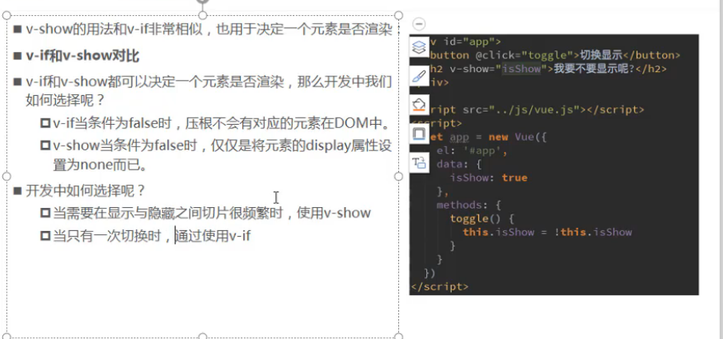

### 7.循环遍历

#### 1.v-for遍历数组和对象


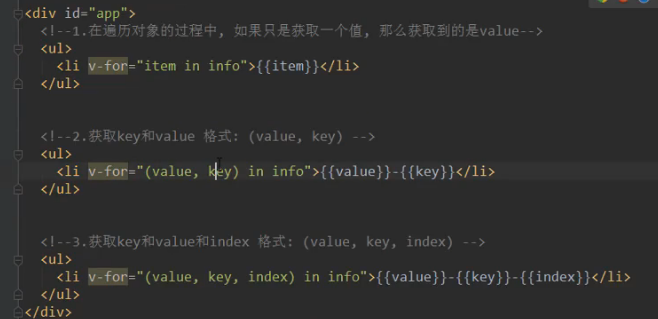

#### 2.v-for-绑定和非绑定key的区别


#### 3.数组中哪些方法是响应式的


案例：点击元素 元素变红，默认只有第一个元素变红


~~~html
 <div id="app">
    <ul>
      <li v-for="(item, index) in books" 
      :class="{active:index===curreIndex}"
      @click="bianseclick(index)"
      >
      {{index}}-{{item}}
      </li>
    </ul>
  </div>
</body>
<script>
  const app=new Vue({
    el:'#app',
    data:{
      books:['华为','小米','OPPO','iphone'],
      curreIndex:0,//默认下标变红
    },
    methods: {
      bianseclick:function(index){
        this.curreIndex=index;
      }
    }, 
  })
~~~

#### 4.购物车案例：

**过滤器的使用**：保留小数

方法：

使用：


**设置按钮到达一定条件就不能点击**：


**移除按钮实现**：


~~~html
 <style>
      table{
        border: 1px solid #ececec;
        border-collapse: collapse;
        border-spacing: 0;
      }
      th,td {
        width: 120px;
        border: 1px solid #ececec;
        padding: 5px;
        text-align: center;
      }
      th{
        background-color: rgb(194, 182, 177);
        color: rgb(43, 38, 38);
        font-weight: 700;
      }
      button{
        background-color: silver;
        border-radius: 5px;
        text-align: center;
      }
   </style>
</head>
<body>
  <div id="app">
      <table>
          <thead>
            <th></th>
            <th>品牌</th>
            <th>日期</th>
            <th>价格</th>
            <th>数量</th>
            <th>总价</th>
            <th>操作</th>
          </thead>
          <tbody>
            <tr v-for="(item,index) in books">
              <td>{{item.id}}</td>
              <td>{{item.name}}</td>
              <td>{{item.date}}</td>
              <td>{{item.spice|showspice}}</td>
              <td>
                <button @click="sub(index)" :disabled="item.cunt<=1">-</button>
                {{item.cunt}}
                <button @click="add(index)">+</button>
              </td>
              <td>{{zhognjia(index)|showspice}}</td>
              <td>
                <button @click="remove(index)">移除</button>
              </td>
            </tr>
          </tbody>
      </table>
  </div>
</body>
<script>
  const app=new Vue({
    el:'#app',
    data:{
      books:[
        {
          id: 1,
          name: '华为',
          date: '2020-10-18',
          spice: 4300,
          cunt: 1
        },
        {
          id: 2,
          name: 'iphone',
          date: '2020-10-18',
          spice: 5300,
          cunt: 1
        },
      ]
    },
    methods: {
      add(index){
        this.books[index].cunt++;
      },
      sub(index){
        this.books[index].cunt--;

        //当cunt为1的时候就不能再点击
        // if(this.books[index].cunt){
        //   this.books[index].cunt--;
        // }
      },
      remove(index){
        this.books.splice(index,1);
      },
      zhognjia(index){
        // console.log(index);
        return this.books[index].spice*this.books[index].cunt;
      }

    },
    filters:{
      showspice(spice){
        return '￥'+spice.toFixed(2);
      }
    }
    })
</script>
~~~

**踩坑点**：计算属性的这种写法只有get方法，没有set方法，无法对值进行设置


#### 5.JavaScript高阶函数的使用

​	

​	

​	

##### **filter**

​	

​	

##### map

​	

##### reduce

​	

​	

**链式编程**：

​	

​	

### 8.v-model  表单绑定


#### 1.v-model的使用和原理

**双向数据绑定**：

~~~html
<div id="app">
      <input type="text" v-model="message">{{message}}
  </div>
</body>
<script>
  const app=new Vue({
    el:'#app',
    data:{
      message:'输入内容',
    }
  })
~~~

此时message已解决完成了和input的数据双向绑定，修改message时input里面的value值也会改变

​	

直接修改input里面的输入值时，message也会跟着改变

​	

#### 2.双向数据绑定实现原理


~~~html
<div id="app">
      <!-- <input type="text" v-model="message">{{message}} -->

      <!-- 方法一： -->
      <!-- <input type="text" :value="message" @input="changeinput"> -->

      <!-- 方法二： -->
      <input type="text" :value="message" @input="message=$event.target.value">
      {{message}}
  </div>
</body>
<script>
  const app=new Vue({
    el:'#app',
    data:{
      message:'输入内容',
    },
    methods: {
      changeinput(event){
        this.message=event.target.value;
      }
    },  
  })
~~~


#### 3.v-model结合radio类型使用


4.v-model结合checkbox类型使用

**单选框应用场景**：


**多选框**：


#### 4.v-model结合select类型使用

​	

​	

#### 5.input中的值绑定

​	

​	

#### 6.v-model修饰符的使用


## 三.Vue提升

### 1.组件化开发

#### 1.组件化的实现和使用步骤

​	


#### 2.组件化的基本使用过程

~~~html
  <div id="app">
    <!-- 3.调用组件 -->
    <qianye></qianye>
  </div>

  <script src="js/vue.js"></script>
  <script>
    //1.创建组件构造器
    const mycomppnent= Vue.extend({
      template:`<h2>hello</h2>`,
    });
    //2.注册组件并定义组件的名称
    Vue.component('qianye',mycomppnent);
    const app=new Vue({
      el:'#app',
      data:{
        message:"hello qianye"
      }
    })
  </script>
~~~


#### 3.全局组件和局部组件


~~~javascript
 <div id="app">
    <h3>实例1</h3>
    <myCom></myCom>
  </div>

  <div id="app2">
    <h3>实例2</h3>
    <!-- <myCom></myCom> -->
  </div>

  <script src="JS/vue.js"></script>
  <script>
    //全局组件，可以在任意Vue实例调用
    const myComponent=Vue.extend({
      template:`<div>
      <h2>主题</h2>
      <h2>内容</h2>
    </div>`,
    });

    // Vue.component('myCom',myComponent);
    const app=new Vue({
      el:'#app',
      data:{
        message:'hello'
      },
      //局部组件，只有在对应的Vue实例中可以调用
      components:{
        myCom:myComponent
      }
    })

    const app2=new Vue({
      el:'#app2',
    })
  </script>
~~~

#### 4.父组件和子组件的区分

​	


~~~html
<div id="app">
    <myfather></myfather> 
  </div>
  <script src="JS/vue.js"></script>
  <script>
    //子组件
    const son=Vue.extend({
      template:`
      <h1>我是子组件</h1>`,
    });

    //父组件
    const father=Vue.extend({
      template:`<div>
      <h1>我是父组件</h1>
      <myson></myson>
    </div>`,
      components:{
        'myson':son
      }
    });
    const app=new Vue({
      el:'#app',
      components:{
        'myfather':father
      }
    })
  </script>
~~~

#### 5.注册组件的语法糖写法


#### 6.组件模板抽离的写法


~~~javascript
  <div id="app">
    <myfather></myfather> 
  </div>
  <script type="text/x-template" id="temp">
    <div>
      <h1>我是子组件</h1>
    </div>
  </script>
  <script src="JS/vue.js"></script>
  <script>
    //子组件
    const son=Vue.extend({
      template:"#temp",
    });
    //父组件
    const father=Vue.extend({
      template:`<div>
      <h1>我是父组件</h1>
      <myson></myson>
    </div>`,
      components:{
        'myson':son
      }
    });
    const app=new Vue({
      el:'#app',
      components:{
        'myfather':father
      }
    })
  </script>
~~~

#### 7.为什么组件里面的data必须是函数

**组件内部不能访问实例的数据**


​	

~~~html
<body>
  <div id="app">
    <my-com></my-com>
  </div>
  <script type="text/x-template" id="temp">
    <div>
      <!-- {{title}} --> 
      /*报错 Property or method "title" is not defined on the instance but referenced during render. Make sure that 
      this property is reactive, either in the data option, or for class-based components, by initializing the
      property.*/
     
      {{message}}
    </div>
  </script>
  <script src="JS/vue.js"></script>
  <script>
    const app=new Vue({
      el:'#app',
      data:{
        title:"组件"
      },
      components:{
        'my-com':{
          template:"#temp",
          data() {
            return {
              message:"hello"
          }
        }
        }
      }
    })
  </script>
~~~

**为什么组件里面存放数据必须是一个函数**  

~~~javascript
为了让组件彼此独立，不会形成数据的干扰，比如一个组件被调用多次的时候，每次都会形成一个独立的实例，彼此不会进行干扰；
而组件里面存放数据的是对象的话，会造成所有的实例共用一个对象，数据会彼此干扰。
案例：
 <div id="app">
    <cpn></cpn>
    <cpn></cpn>
    <cpn></cpn>
  </div>
  <template id="cpn"> 
    <div>
      <title>计数器</title>
      <h3>{{number}}</h3>
      <button @click="sub">-</button>
      <button @click="add">+</button>
    </div>
  </template>
  <script src="JS/vue.js"></script>
  <script>
    Vue.component('cpn',{
      template:'#cpn',
      data() {
        return {
          number:0
        }
      },
      methods: {
          sub(){
           this.number>0? this.number--:null;
          },
          add(){
            this.number++;
          },
        },
    }
    );
    const app=new Vue({
      el:'#app',
    })
  </script>
~~~


扩展:那如何让他们相互影响

~~~javascipt
  //定义一个对象，返回对象的内存地址
    const obj={
      number:0,
    }
    Vue.component('cpn',{
      template:'#cpn',
      data() {
        return obj;
      },
~~~


#### 8.父子组件通信-父传子props(属性)


~~~javascript
 <div id="app">
    <son :sonnames="names" :sonmessage="message"></son>
  </div>
  
  <template id="son">
    <div>
      <h2>{{message}}</h2>
      <h2>{{sonnames[0]}}</h2>
      <h2>{{sonmessage}}</h2>
    </div>
  </template>
  <script src="JS/vue.js"></script>
  <script>
    const app=new Vue({
      el:'#app',
      data:{
        names:['qianye','songjiaxing'],
        message:'hello'
      },
      components:{
      son:{
        template:'#son',
        props:['sonnames','sonmessage'],
        data() {
          return {
            message:'我是子组件'
          }
        },
      }
      }
    })
  </script>
~~~


~~~javascript
  <div id="app">
    <son :son-names="names" :son-message="message"></son>
  </div>
  <template id="son">
    <div>
      <h2>{{message}}</h2>
      <h2>{{sonNames[0]}}</h2>
      <h2>{{sonMessage}}</h2>
    </div>
  </template>
  <script src="JS/vue.js"></script>
  <script>
    const app=new Vue({
      el:'#app',
      data:{
        names:['qianye','songjiaxing'],
        message:'hello'
      },
      components:{
      son:{
        template:'#son',
        props:{
          sonNames:{
            type:Array,
            // default() {
            //   return []
            // }
          },
          sonMessage:{
            type:String,
            default:'hello',
            requiresd:true
          }
        },
        data() {
          return {
            message:'我是子组件'
          }
        },
      }
      }
    })
  </script>
~~~


**父子组件通信-props驼峰标识问题**

~~~text
当我们在props里面定义的属性用了驼峰标识的写法后，组件在传值的时候通过v-bind绑定的属性名必须要改成小写并且通过“——”连接，否则没有值传递，这是Vue的一个缺点，还有当一个组件模板里面包含多个标签的时候，必须包含一个跟标签div
~~~

#### 10.父子组件通信-子传父(自定义事件)


~~~javascript
 <div id="app">
    <!-- 在父组件中通过v-on来绑定监听发送过来的事件 并且默认将发送过来的数据接收了-->
    <son @fclick=sonclick></son>
  </div>
  <template id="son"> 
    <div>
      <button v-for="item in list" @click="btnclick(item)">{{item.name}}</button>
    </div>
  </template>
  <script src="JS/vue.js"></script>
  <script>
    const app=new Vue({
      el:'#app',
      methods:{
        sonclick(item){
          console.log(item);
        }
      },
      components:{
        son:{
          template:'#son',
          data() {
            return {
              list:[
                {id:'aaa',name:'手机'},
                {id:'bbb',name:'电脑'},
                {id:'ccc',name:'衣服'},
                {id:'ddd',name:'裤子'},
              ]
              }
            },
            methods:{
            btnclick(item){
              // console.log(item);
              //发送一个事件 事件名称 以及传递的参数
              this.$emit('fclick',item);
             }
            }
         
          }
        }
      }
    )
  </script>
~~~


#### 11.父子组件通信-结合双向绑定案例


#### 12.父访问子-children-refs


~~~javascript
 <div id="app">
    <son ref="aaa"></son>
    <son ref="bbb"></son>
    <button @click="print">qqqqqqq</button>
  </div>
  <template id="son">
    <h3>hello</h3>
  </template>
  <script src="JS/vue.js"></script>
  <script>
    const app=new Vue({
      el:'#app',
      data:{
        message:'hello father'
      },
      methods: {
        print(){
          // console.log(this.message);
          //父组件访问子组件，方法一：通过children 这种方式得到的是一个数组，通过下标操作对应子组件
          // this.$children[0].message='hello';
          // console.log(this.$children[0].message);
          //方法二：通过对象类型操作 $refs=绑定一个组件的名称
          console.log(this.$refs.aaa.message);
          console.log(this.$refs.bbb);
        }
      },
      components:{
        son:{
          template:'#son',
          data() {
            return {
              message:'hello son'
            }
          },
          methods: {
            sprint(){
              console.log(this.message);
            }
          },
        }
      }
    })
  </script>
~~~

#### 13.子访问父-parent-root

~~~javascript
 <div id="app">
    <son></son>
  </div>
  <template id="son">
    <son2></son2>
  </template>
  <template id="son2">
    <div>
      <h3>hello</h3>
      <button @click="printf">dddd</button>
    </div>
  </template>
  <script src="JS/vue.js"></script>
  <script>
    const app=new Vue({
      el:'#app', //Vue 实例 根组件
      data:{
        message:'hello father'
      },
      components:{
        son:{
          template:'#son', //第一层组件
          data() {
            return {
              message:'hello son'
            }
          },
          components:{
            son2:{
              template:'#son2', //第二层组件
              data() {
                return {
                  message:'hello son2'
                }
              },
              methods: {
                printf(){
                  console.log(this.message);
                  console.log(this.$parent.message);
                  console.log(this.$root);
                }
              },
            }
          }
        }
      }
    })
  </script>
~~~


### 2.插槽

#### 1.slot-插槽的基本使用


~~~PHP
 <div id="app">
    <son>
      <button>右边</button>
    </son>
  </div>
  <template id="son">
    <div>
      <button>左边</button>
      <button>中间</button>
      <slot></slot>
      <!-- <button>右边</button> -->
    </div>
  </template>
  <script src="JS/vue.js"></script>
  <script>
    const app=new Vue({
      el:'#app',
      components:{
        son:{
          template:'#son'
        }
      }  
    })
  </script>
~~~


#### 2.slot-具名插槽的使用


~~~html
<div id="app">
    <son>
      <button slot="tihuan">替换</button>
    </son>
  </div>
  <template id="son">
    <div>
      <button>左边</button>
      <button>中间</button>
      <slot>
        <button>右边</button>
        <button>aaa</button>
      </slot>
      <slot name="tihuan">
        <button>右边</button>
        <button>aaa</button>
      </slot>
    </div>
  </template>
~~~


#### 3.编译作用域的概念


#### 4.作用域插槽（带数据的插槽）的使用


~~~html
 <div id="app">
    <son>
      <div slot-scope="list">
         <!-- <span>{{list.data.join(' - ')}}</span> -->
         <span>{{list.data.join(' * ')}}</span>
      </div>
    </son>
  </div>
  <template id="son">
    <div>
     <slot :data="list">
          <ul>
            <li v-for="item in list">{{item}}</li>
          </ul>
     </slot>
    </div>
  </template>
  
  <script src="JS/vue.js"></script>
  <script>
    const app=new Vue({
      el:'#app', //Vue 实例 根组件
      components:{
        son:{
          template:'#son',
          data() {
            return {
              list:['c++','java','php','c','c#']
            }
          },
        }
      }
    })
  </script>
~~~

### 3.前端模块化


#### 1.前端模块化雏形和CommonJS


#### 2.ES6模块化的导入和导出


注意：


****

### 4.webpack

#### 1.webpack的介绍和安装


~~~
npm install webpack@3.6.0 -g
~~~

#### 2.webpack的基本使用过程


注意：

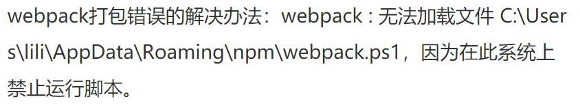

其原因是因为powershell对于脚本的执行有着严格的安全限制。

~~~java
查其原因是因为powershell对于脚本的执行有着严格的安全限制。

可以使用Set-ExecutionPolicy来修改PowerShell中执行策略的用户首选项(preference). 执行策略是Windows PowerShell安全策略中的一部分. 它将决定你是否可以载入配置文件(包括你的Windows PowerShell profile文件)和运行脚本, 它将会在运行前确定哪些文件必须具有数字签名(digitally signed).

其可选的参数如下：
Restricted: 不载入配置文件, 不执行脚本. "Restricted"是默认值.
AllSigned: 所有的配置文件和脚本必须通过信任的出版商签名(trusted publisher), 这里所指的脚本页包括你在本地计算机上创建的脚本.
RemoteSigned: 所有从互联网上下载的脚本必须通过信任的出版商签名(trusted publisher).
Unrestricted: 载入所有的配置文件和脚本. 如果你运行了一个从互联网上下载且没有数字签名的脚本, 在执行前你都会被提示是否执行.
 
由于默认值是Restricted，所以才会有上述错误信息，于是我们可以通过修改执行策略来解决上述遇到的问题
 
解决方案：
一、使用管理员身份打开PowerShell
二、键入Set-ExecutionPolicy RemoteSigned命令
三、键入Y
最后可以使用Get-ExecutionPolicy来看看是否修改成功
~~~

~~~javascript
//bbb.js   commonjs规范
function add(a,b){
  return a+b;
}

module.exports={
  add
}

//aaa.js
const muth=require('./bbb')

console.log('hello');
console.log(muth.add(1,2));

//webpack
webpack js/aaa.js dist/ccc.js

<body>
  <script src="./dist/ccc.js"></script>
</body>
~~~


#### 3.webpack.config.js配置和package.json配置


~~~java
const path=require('path'); //node获取文件路径
module.exports={
  entry:'./js/aaa.js', //入口 
  output:{  //出口，一般是对象类型
    path:path.resolve(__dirname,'dist'), //这里要动态的获取绝对路径，因为路径可能会发生改变
    filename:'ccc.js',
  }, 
}

//此时打包只需要输入webpack 

//而实际项目中 我们常用的命令是 npm run build 那如何将webpack跟npm run build命令关联起来呢
//配置package脚本 让webpack跟其他命令映射起来
  "scripts": {
    "test": "echo \"Error: no test specified\" && exit 1",
    "build":"webpack"
  },
注意：我们在打包的时候如果是在终端直接输入的webpack执行的就是全局的，而通过设置脚本的方式会默认先执行本地的webpack，如果本地没有就会去找全局的，实际开发中要注意本地打包的版本与全局的版本
~~~


#### 4.webpack中使用css文件的配置


****


~~~Java
//引入依赖的CSS文件
require('../css/main.css')
    
//安装打包的依赖项 注意webpack和css-loader的版本问题
  npm install style-loader@3.0.0 --save-dev  
  npm install style-loader@0.23.1 --save-dev  
    
//配置package.json
const path=require('path'); //node获取文件路径
module.exports={
  entry:'./src/js/main.js', //入口 
  output:{  //出口，一般是对象类型
    path:path.resolve(__dirname,'dist'), //这里要动态的获取绝对路径，因为路径可能会发生改变
    filename:'ccc.js',
  }, 
  module: {
    rules: [
      {
        test: /\.css$/, //正则表达式匹配CSS文件
        use: ['style-loader','css-loader'],//css-loader只负责加载CSS不负责解析,有多个loader时webpack默认是从右向左解析的
      },
    ],
  },
}
~~~


#### 5.webpack-less文件的处理


#### 6.webpack-图片文件的处理


#### 7.webpack-ES6转ES5的babel


#### 8.webpack-使用Vue的配置过程


#### 9.创建Vue时template和el关系


#### 10.Vue的终极使用方案

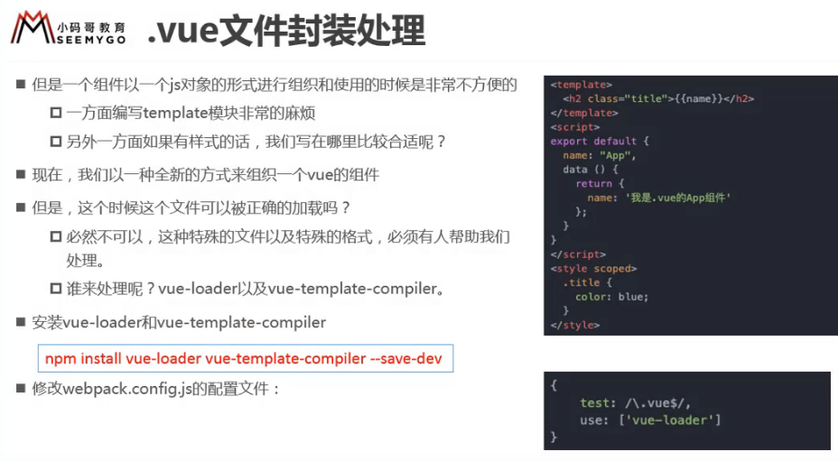

**简写文件扩展名的方式**：


#### 11.webpack-横幅Plugin的使用


#### 12.webpack-HtmlWebpackPlugin的使用


解决生成的新的index.HTML文件中没有插入模板（div）的问题


#### 13.webpack-UglifyjsWebpackPlugin的使用


#### 14.webpack-dev-server搭建本地服务器


#### 15.webpack-配置文件的分离

当我们的项目开环环境和生产环境所需的依赖有很大不同的时候，为了方便 我们可以对配置文件进行分离 
首先可以先建立一个文件夹用来专门存放配置文件，一个生产环境一个开发环境，还可以抽离公共的设置

1.安装合并配置文件的插件：


2.合并配置文件：


3.修改配置文件的路径：


4.修改输出文件路径：


### 5.Vue-Cli

#### 1.vuecli-脚手架的介绍和安装


**安装cli错误的解决办法**：

方法一：

​			

​            npm clean cache --force

​			

方法二：

我们可以安装淘宝镜像来解决

npm config set registry https://registry.npm.taobao.org

然后重新安装

npm install -g @vue/cli

**卸载**Vue/cli

```csharp
npm uninstall -g @vue/cli
```

**安装指定版本**：

npm install -g @vue/cli@版本号

#### 2.vuecli-CLI2初始化项目过程


#### 3.vuecli-CLI2的目录结构解析

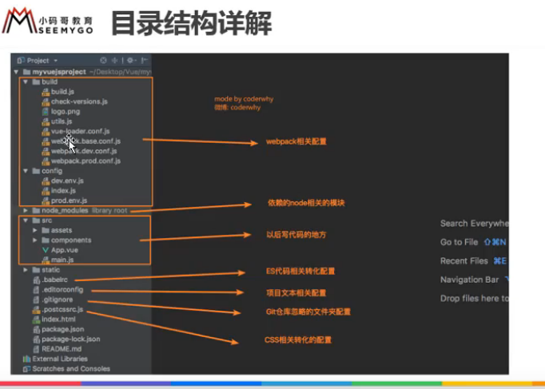

#### 4.ESLint规范


#### 5.runtime-compiler和runtime-only的区别


runtimecompiler和runtimeonly的区别，main.js文件上的不同


#### 6.VueCLI3创建项目和目录结构


#### 7.VueCLI3配置文件的查看和修改


### 6.路由

#### 1.什么是路由和其中映射关系


#### 2.前端渲染后端渲染和前端路由后端路由

​	1.后端渲染、后端路由阶段


​	2.前后端分离阶段


​	3.前端路由阶段


#### 3.url的hash和HTML5的history


#### 4.vue-router-安装和配置方式


#### 5.路由映射配置和呈现


#### 6.路由的默认值和修改为history模式


#### 7.router-link的其他属性补充


#### 8.通过代码跳转路由


#### 9.vue-router-动态路由的使用


#### 10.vue-router-打包文件的解析

#### 11.vue-router-路由懒加载的使用


#### 12.vue-router-路由的嵌套使用


#### 13.vue-router-参数传递


如果当传递的参数比较多就用对象的方式


#### 14.vue-router-router和route的由来


#### 15.vue-router-全局导航守卫

监听跳转的过程，从哪儿跳转到哪儿


16.vue-router  keep-alive及其他问题

保留组件中的状态，组件间在进行跳转的时候，里面的元素的状态不会被改变


### 7.TabBar案例

#### 1.tabbar-基本结构的搭建


**基本目录结构**：


~~~vue
//app.vue
<template>
 <div id="app">
   <div id="tab-bar">
   <div id="tab-bar-item">首页</div>
   <div id="tab-bar-item">分类</div>
   <div id="tab-bar-item">购物车</div>
   <div id="tab-bar-item">我的</div>
 </div>
 </div>
</template>
<script>
export default {
  name: 'App',
  components: {
  }
}
</script>
<style>
@import "./assets/css/base.css";
#tab-bar {
  display: flex;
  height: 49px;
  position: fixed;
  left: 0;
  right: 0;
  bottom: 0;
  background-color: rgba(170, 128, 128, 0.4);
  line-height: 49px;
  border-radius: 12px;
  box-shadow: 0 1px 2px rgba(112, 108, 108, 0.4);
}
#tab-bar-item {
  flex: 1;
  text-align: center;
}
</style>
~~~


#### 2.tabbar-TabBar和TabBarItem组件封装

上面的组件没有上面复用性，此时我们应该对组件进行抽离，封装成独立的组件


~~~vue
//tabbar
<template>
<div id="tab-bar">
<slot></slot>
</div>
</template>

<script>
export default {
  name: 'TabBar',
  components: {
  }
}
</script>
<style>
#tab-bar {
  display: flex;
  height: 49px;
  position: fixed;
  left: 0;
  right: 0;
  bottom: 0;
  background-color: rgba(170, 128, 128, 0.4);
  /* line-height: 49px; */
  border-radius: 12px;
  box-shadow: 0 1px 2px rgba(112, 108, 108, 0.4);
}
</style>

//tabaritem
<template>
   <div id="tab-bar-item">
     <slot name="item-icon"></slot>
     <slot name="item-text"></slot>
   </div>

</template>

<script>
export default {
  name: 'TabBarItem',
  components: {
  }
}
</script>

<style>
#tab-bar-item {
  flex: 1;
  text-align: center;
}
#tab-bar-item img{
  width: 24px;
  height: 24px;
  vertical-align: middle;
  margin-bottom: 2px;
}
</style>
~~~

此处有一个bug：


解决办法：

配置项xx\node_modules\vue-loader\lib\template-compiler\index.js中

```
if (!isProduction) {
  code = prettier.format(code, { semi: false, parser: 'babylon' })
}
 
//修改为：
 
if (!isProduction) {
  code = prettier.format(code, { semi: false, parser: 'babel' })
}
```

#### 3.tabbar-给TabBarItem传入active图片

当对应的item处于活跃状态时，此时要显示不同的icon图片


~~~vue
<template>
 <div id="app">
   <TabBar>
     <TabBarItem>
       
       
       <div slot="item-text">首页</div>
     </TabBarItem>
      <TabBarItem>
       
       
       <div slot="item-text">分类</div>
     </TabBarItem>
      <TabBarItem>
       
       
       <div slot="item-text">购物车</div>
     </TabBarItem>
      <TabBarItem>
       
       
       <div slot="item-text">我的</div>
     </TabBarItem>
   </TabBar>
 </div>
</template>

、、、、
<template>
   <div id="tab-bar-item">
     <div v-if="!isActive">
     <slot name="item-icon"></slot>  //如果直接在slot上面添加属性，则会在调用的时候会被替换掉，所以通常在外面再包一个div
     </div>
     <div v-else>
       <slot name=item-icon-active></slot>
     </div>
     <div :class={active:isActive}>
       <slot name="item-text"></slot>
     </div>
   </div>

</template>

<script>
export default {
  name: 'TabBarItem',
  data() {
    return {
      isActive:true
    }
  },
}
</script>

<style>
#tab-bar-item {
  flex: 1;
  text-align: center;
}
#tab-bar-item img{
  width: 24px;
  height: 24px;
  vertical-align: middle;
  margin-top: 4px;
}
.active{
  color: rgb(66, 40, 40);
}
</style>
~~~

#### 4.tabbar-TabBarItem和路由结合效果

添加路由，使active选中与路由跳转对应起来


#### 5.tabbar-TabBarItem的颜色动态控制

当跳转到对应路由的时候，对应的item处于活跃

~~~vue
<template>
   <div id="tab-bar-item" @click="itemClick">
     <div v-if="!isActive">
       <!-- 如果直接在slot上面添加属性，则会在调用的时候会被替换掉，所以通常在外面再包一个div -->
     <slot name="item-icon"></slot>  
     </div>
     <div v-else>
       <slot name=item-icon-active></slot>
     </div>
     <div :style="activeStyle">
       <slot name="item-text"></slot>
     </div>
   </div>
</template>
<script>
export default {
  name: 'TabBarItem',

  //父子组件通信--父传子
  props:{
    path:String,
    activeColor:{
      type:String,
      default:'red'
    }
  },
  data() {
    return {
      // isActive:true
    }
  },
  computed:{
    isActive(){
      //如果当前活跃的路由和需要点击的item的路由是同一个，那么久返回turn 则这个item置为活跃状态
      //indexOf() 方法可返回某个指定的字符串值在字符串中首次出现的位置,如果要检索的字符串值没有出现，则该方法返回 -1。
      return this.$route.path.indexOf(this.path)!==-1
    },
    activeStyle(){
      //判断当前item是否处于活跃，如果处于活跃就设置为传入的值，否则为默认值
     // return this.isActive?{color:this.activeColor}:{};
      let conback= this.isActive?{color:this.activeColor}:{}; //返回值是一个对象 比如{color:red}
      console.log(conback);
      return conback; 
    }
  },
  methods: {
    itemClick(){
      console.log(this.path);
      this.$router.replace(this.path);
    }
  },
}
</script>
~~~


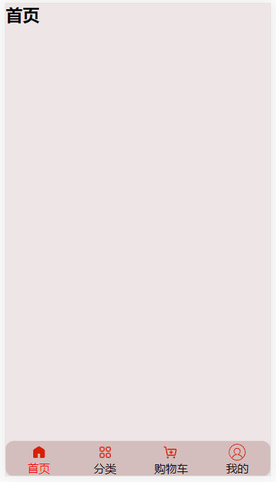

### 8.promise

#### 1.Promise-Promise的介绍和基本使用


#### 2.Promise-Promise的三种状态和另外处理方式


#### 3.Promise-Promise的链式调用


#### 4.Promise-Promise的all方法使用


### 9.Vuex

#### 1.vuex-Vuex概念和作用解析


#### 2.vuex-单界面到多界面状态管理切换


#### 3.vuex-devtools和mutations


#### 4.vuex-state单一状态树的理解


#### 5.vuex-getters的使用详解


 

#### 6.vuex-mutations的携带参数


#### 7.vuex-数据的响应式原理


#### 8.vuex-mutations的类型常量


#### 9.vuex-actions的使用详解


#### 10.vuex-modules的使用详解


#### 11.vuex-store文件夹的目录组织

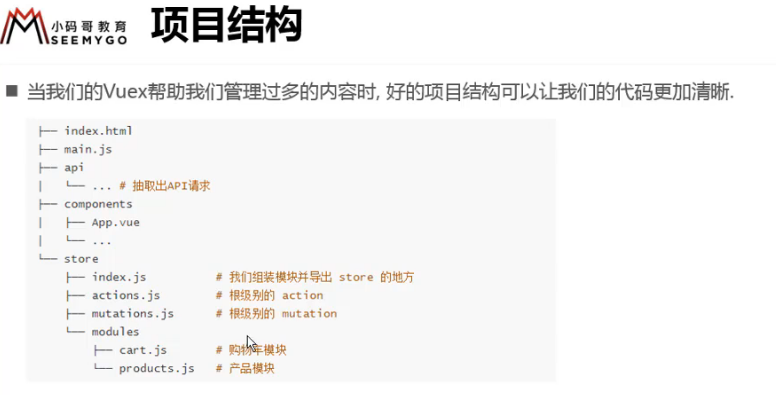

### 10.Axios

#### 1.网络请求模块的选择-axios


#### 2.axios框架的基本使用


#### 3.axios发送并发请求


#### 4.axios的配置信息相关


#### 5.axios的实例和模块封装


#### 6.axios的拦截器的使用


## 四.项目

### 1.项目一（商城）

#### 1.项目开发-划分目录结构


#### 2.项目开发-css文件的引入


#### 3.项目开发-vue.config和editorconfig


~~~
module.exports={
  configuerWebpack:{
    resolve:{
      alias:{
        'assets':'@/assets',
        'common':'@/common',
        'conponents':'@/conponents',
        'network':'@/network',
        'views':'@/views',
      }
    }
  }
}
~~~


#### 4.项目开发-tabbar引入和项目模块划分

**注意坑爹的路径问题**


~~~vue
//router

import Vue from 'vue'
import VueRouter from 'vue-router'
//懒加载
const Home=()=> import('@/views/home/Home')
const Category=()=> import('@/views/category/Category')
const Cart=()=> import('@/views/cart/Cart')
const Profile=()=> import('@/views/profile/Profile')
//1.安装插件
Vue.use(VueRouter)
//3.建立映射关系 此处有坑，一定要在创建路由对象之前定义routes，否者不会跳转到对应的路径
const routes=[
  {
    path:'',
    redirect:'/Home'  //默认展示首页
  },
  {
    path:'/home',
    component:Home
  },
  {
    path:'/category',
    component:Category
  },
  {
    path:'/cart',
    component:Cart
  },
  {
    path:'/profile',
    component:Profile
  }
]
 const router = new VueRouter({
  routes,
  mode:'history'
})
export default router
~~~

~~~vue
//tabbar 的进一步封装
<template>
 <div id="mainTabbar">
   <TabBar>
     <TabBarItem path="/home" activeColor="red">
       
       
       <div slot="item-text">首页</div>
     </TabBarItem>
      <TabBarItem path="/category" activeColor="red">
       
       
       <div slot="item-text">分类</div>
     </TabBarItem>
      <TabBarItem path="/cart" activeColor="red"> 
       
       
       <div slot="item-text">购物车</div>
     </TabBarItem>
      <TabBarItem path="/profile" activeColor="red">
       
       
       <div slot="item-text">我的</div>
     </TabBarItem>
   </TabBar>   
 </div>
</template>
<script>
import TabBar from '@/components/common/tabbar/TabBar'
import TabBarItem from '@/components/common/tabbar/TabBarItem'
export default {
  name: 'mainTabbar',
  components: {
    TabBar,
    TabBarItem
  }
}
</script>
<style>
#mainTabbar {
  height: 49px;
  position: fixed;
  left: 0;
  right: 0;
  bottom: 0;
}
</style>
~~~


#### 5.小图标的修改及路径问题

~~~
<%= BASE_URL %>  jsp语法 获取当前文件所在的路径 打包后不会再存在
~~~

#### 6.首页开发-首页导航栏的封装和使用


~~~JS
<template>
<div class="nav-bar">
  <!-- 为了保留slot的样式 需要在外面包裹一层div -->
  <div class="nav-left">
    <slot name="left"></slot>
  </div>
   <div class="nav-center">
    <slot name="center"></slot>
  </div>
   <div class="nav-right">
    <slot name="right"></slot>
  </div>
</div>
</template>
<script>
export default {
  name: 'NavBar',
  components: {
  }
}
</script>
<style>
.nav-bar {
  position: fixed;
  left: 0;
  right: 0;
  top: 0;
  display: flex;
  height: 44px;
  line-height: 44px;
  background-color: rgba(146, 122, 122, 0.5);
  text-align: center;
  z-index: 999;
  box-shadow: 0 2px 1px  rgba(177, 169, 169,.5);
}
.nav-left,.nav-right {
  width: 60px;
}
.nav-center {
  flex:1;
}
</style>
~~~


#### 7.首页开发-请求首页的多个数据（重点）


**封装网络请求** request 设置默认URL 对axios封装一层，便于后期更改和维护

~~~JS
import axios from 'axios'
//传入配置信息，包含URL
export function request(config){
   //1.创建一个axios实例
   const netInstance=axios.create({
    //设置默认信息 全局配置
     baseURL:'http://152.136.185.210:7878/api/m5',
     timeout:5000,
  })
   //2.设置拦截器
   //请求拦截器
  netInstance.interceptors.request.use(config=>{
    return config
  },error=>{
  })
  //响应拦截器
  netInstance.interceptors.response.use(res=>{
    return res.data
  },error=>{
  })
  return netInstance(config)  //axios 本身返回一个promise
}
~~~

封装首页的网络请求home，基于封装好的request  这样可以便于管理，首页的请求都放在首页，

~~~
import {request} from './request'
export function  getHomeMulData(){
  return request({
    url:'/home/multidata'
  })
}
~~~


~~~js
<template>
<div id="home">
  <nav-bar>
    <div slot="center">购物街</div>
  </nav-bar>
</div>
</template>
<script>
import NavBar from '@/components/common/navbar/NavBar'
import {getHomeMulData,} from '@/network/home'
export default {
  name: 'Home',
  components: {
    NavBar
  },
  data() {
    return {
      //存储请求过来的数据，因为getHomeMulData()方法执行完成以后，里面的数据因为没有被占用所以会被销毁
      banner:[],
      recommend:[]
    }
  },
  //Vue的生命周期 当组件创建成功后，执行这个里面的方法
  created() {
    ///这是个异步操作
    getHomeMulData().then(res=>{
      //箭头函数里面的this是上下文里面的this，这里的this代表的是这个组件对象，所以这里的this可以直接访问data
      this.banner=res.data.banner.list; //此处一定注意是banner下的list数组对象
      this.recommend=res.data.recommend.list;
    })
  },
}
</script>
~~~


#### 8.首页开发-轮播图的展示


引入swiper插件，并在home文件夹建立单独的home页面的子组件文件夹childcomponent，便于组件分离，结构清晰


利用组件间传值 父传子props 将home页面请求到的数据传递到homeswiper组件

~~~JS
<template>
  <swiper >
    <swiper-item v-for="item in banners">
      <a :href="item.link">
        
      </a>
    </swiper-item>
  </swiper>
</template>
<script>
import {Swiper, SwiperItem} from '@/components/common/swiper/index'
export default {
  name: "HomeSwiper",
  props: {
    banners:{
      type: Array,
      default(){
        return []
      }
    }
  },
  components: {
    SwiperItem,
    Swiper
  },
}
</script>
<style scoped>
</style>
~~~

#### 9.首页开发-推荐信息的展示


封装独立的组件


~~~JS
<template>
<div class="home-recommend">
  <div class="recommend">
    <div class="recommend-item" v-for="item in recommends">
      <a href="" :link="item.link">
        
      </a>
      <div class="title">{{item.title}}</div>
    </div>
  </div>
</div>
</template>
<script>
export default {
  name: 'HomeRecommend',
  components: {
  },
  props:{
    recommends:{
      type:Array,
      defult(){
        return []
      }
    }
  },
  methods: {
  },
};
</script>
<style scoped>
.home-recommend {
  padding:1px;
  border-bottom: 8px solid rgb(221, 214, 214);
  background-color: rgb(221, 175, 175);
}
.recommend {
  display: flex;
  height: 80px;
  margin:4px;
  text-align: center;
  border-radius: 10px;
  background-color: #fff;
}
.recommend-item {
  margin-top: 2px;
  flex: 1;
}
.recommend-item img{
  width: 55px;
  height: 55px;
}
.recommend-item .title {
  font-size: 12px;
  font-weight: 200;
}
</style>
~~~

#### 10.首页开发-FeatureView的封装


~~~js
<template>
<div class="home-popular">
    <div class="popular">
      
    </div>
</div>
</template>
<script>
export default {
  name: 'HomePopular',
  components: {
  },
};
</script>
<style>
.home-popular {
  padding:5px;
  background-color:  rgba(172, 115, 115,.5);
  text-align: center;
}
.popular img {
  width: 100%;
  border-radius: 12px;
}
</style>
~~~

#### 11.首页开发-TabControl的封装


针对这个项目封装选项卡，而具体的标题应该有调用组件的时候传入，


~~~js
<template>
<div class="tab">
 <div class="tab-item" v-for="(item,index) in title"
  :class="{active:index===currIndex}"
  @click="itemaTab(index)">
   <span>{{item}}</span>
 </div>
</div>
</template>
<script>
export default {
  name: 'Tab',
  components: {
  },
  methods: {
    itemaTab(index){
        this.currIndex=index
    }
  },
  props:{
    title:{
      type:Array,
      defult(){
        return []
      }
    }
  },
  data() {
    return {
      currIndex:0 //设置默认选中的标签  当当前选中的标签的index=curindex设置的值时 active=true
    }
  },
  };
</script>
<style>
.tab {
  padding-top: 4px;
  display:flex;
  text-align: center;
  height: 40px;
  line-height: 40px;
}
.tab-item {
  flex: 1;
}
 span {
  padding:4px;
  font-size: 15px;
  color:rgb(44, 33, 33);
}
.active span {
  color: red;
  border-bottom: 2px solid red;
}
</style>
~~~

吸顶效果实现


1.监听滚动，当到达某个位置时添加一个 position: fixed; 属性，离开的时候再删除这个属性

2.css3实现，添加 position: sticky;属性

~~~css
position: sticky;
  top:44px;
~~~

#### 12.首页开发-保存商品的数据结构设计


~~~js
data() {
    return {
      //存储请求过来的数据，因为getHomeMulData()方法执行完成以后，里面的数据因为没有被占用所以会被销毁
      banners: [],
      recommends: [],
      goods:{
        pop:{page:0,list:[]},
        new:{page:0,list:[]},
        sell:{page:0,list:[]}
      }
    }
  },
  //Vue的生命周期 当组件创建成功后，执行这个里面的方法 最好只在里面发送请求，具体的逻辑放在methods里面
  created() {
    //1.请求首页多个数据 这是个异步操作
    this.homeMulData()
    //2.请求首页商品数据
    this.homeGoods('pop')
    this.homeGoods('new')
    this.homeGoods('sell')
  },
  methods: {
    homeMulData(){
       getHomeMulData().then(res=>{
      // console.log(res);
      //箭头函数里面的this是上下文里面的this，这里的this代表的是这个组件对象，所以这里的this可以直接访问data
      this.banners=res.data.banner.list;
      // console.log(this.banners);
      this.recommends=res.data.recommend.list;
    })
    },
    homeGoods(type){
      const page=this.goods[type].page+1 //上拉加载的时候页面要加一
       getHomeGoods(type,page).then(res=>{
        // console.log(res);
      //将请求到的数据保存到组件里面
       this.goods[type].list.push(...res.data.list)//剩余运算符
      //请求后，将页码+1
       this.goods[type].page++
    })
    }
  },
}
~~~


#### 13.首页开发-首页商品数据的展示


封装独立的组件


#### 14.首页开发-TabControl点击切换商品

之前在上面是给goodslist组件设置了具体的type=pop，下面要实现点击的时候自动切换，点击tab的时候把被点击的对象传递出去，组件间传值，子传父


#### 15.Better-Scroll在Vue项目中使用过程

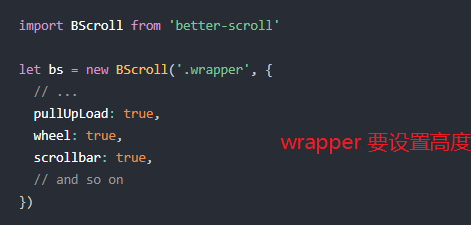


注意点：


如何将滚动区域设置为home页面展示的区域 展示的区域=一屏幕的高度-navbar-topbar

方法一利用定位：

~~~js
#home {
  /* 100vh=100% viewport height视口高度*/
  padding-top: 44px;
  height: 100vh;
  position: relative;
}
.tab-cont {
  position: sticky;
  top:44px;
}

.content {
  overflow: hidden;
  /* height: 400px; */
  position: absolute;
  top:44px;
  bottom: 49px;
}
~~~

#### 16.首页开发-BackTop组件的封装和使用


**组件不能直接监听点击事件**


**@click.native 监听组件的原生点击事件**


**backtop**的显示和隐藏

当滚动到某一个位置的时候显示，


#### 17.首页开发-完成上拉加载更多


#### 18.首页开发-滚动区域的Bug分析和解决

用better-scroll产生的bug，不能滚动，点击tab切换的时候，有些可以拉到底部更多，有些只能拉动一点


组件间关系


解决办法1：vuex状态管理


方法2：事件总线


#### 19.refresh函数找不到的bug处理


#### 20.刷新频繁的防抖函数处理


#### 21.tabControl的offsetTop获取分析


TabControl的吸顶效果完成


#### 22.Home离开时记录状态和位置以及keep-alive问题


#### 23.跳转到详情页并且携带id


#### 24.详情页-导航栏的封装


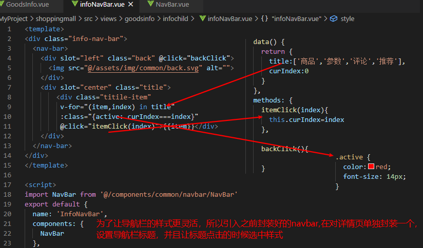

**返回首页**：


#### 25.详情页-数据请求以及轮播图展示


#### 26.详情页-商品基本信息的展示


#### 27.详情页-店铺信息的解析和展示


#### 28.详情页-加入滚动的效果Scroll

先将底部的TabBar隐藏起来，只展示详情页的内容


#### 29.详情页-商品详情数据展示


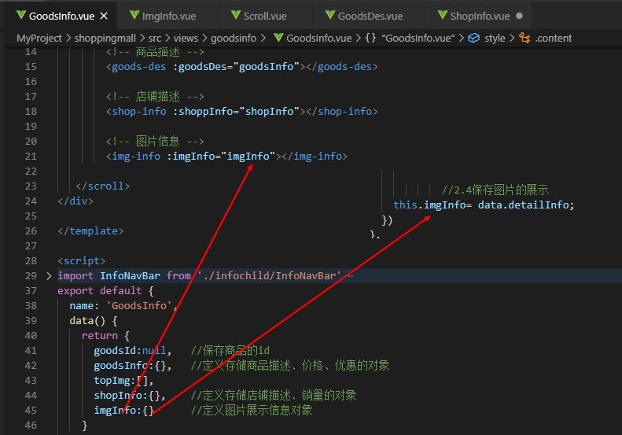


#### 30.详情页-商品参数信息的展示


表格遍历：


#### 31.详情页-商品评论信息的展示


时间格式化问题：


#### 32.详情页-商品推荐数据的展示


#### 33.详情页-首页和详情页监听全局事件和mixin的使用

在之前的goodslist里面定义了一个事件总线，home页面进行接收，但是如果其他页面复用了goodslist组件，而且也需要刷新，

这时候需要对其进行判断 该事件是发送到那个路由地址的

方式一：


方法2：

将home里面监听的事件取消掉


这样如果其他组件在复用goodslist组件的时候，任然可以监听到传出去的事件，并做对应的处理


#### 34.bug处理-详情页不能滚动的bug处理

有大量图片需要展示的地方需要在图片加载完以后，刷新


通常还要加上防抖函数，节流函数 防止频繁调用

#### 35.详情页-点击标题滚到对应内容


如何根据title的点击，跳转到对应的位置，可以先定义一个数组，存储每一个标题对应的位置，然后根据位置进行跳转


但是这种方式拿到的值是不对的，此时仅仅是DOM被渲染出来了里面的图片，还没有被加载出来，应该在图片加载完成的时候获取


#### 36.详情页-滚动内容显示对应标题


#### 37.详情页-底部工具栏的封装


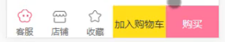


#### 38.详情页-BackTop的混入封装


#### 39.详情页-将商品添加到购物车中


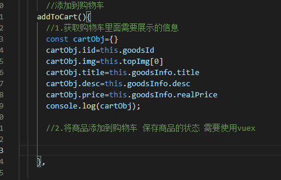

#### 40.详情页-将商品添加到vuex 的store中

添加商品到vuex 的store中：

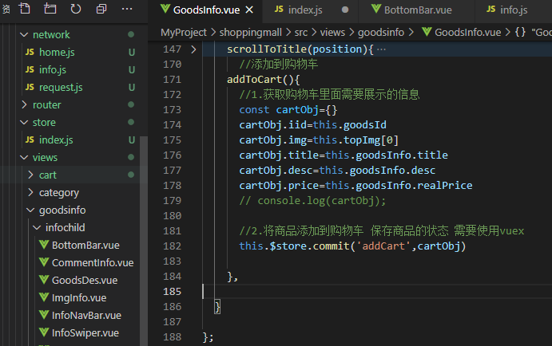

判断商品是否已经存在：

方法一


方法二


#### 41.详情页-Vuex中代码的重构


#### 42.购物车-导航栏实现-Vuex知识点


#### 43.购物车-购物车商品列表展示


#### 44.购物车-Item选中和不选中的切换


#### 45.购物车-底部工具的封装和应用


#### 46.购物车-全选按钮的状态显示

 


#### 47.购物车-全选按钮的点击效果


#### 48.Vuex-actions返回Promise


#### 49.Toast封装-插件方式的封装(弹窗)

常规的组件封装，在用的时候需要引入、注册等，用起来很麻烦，如果能够把组件封装成插件在用的时候直接调用里面的方法

组件只需要在main里面进行引入 注册 并且通过vue.use（默认会调用插件的install方法）的方式进行安装，然后在所有的地方都可以使用。

比如封装一个弹窗插件

首先要有一个独立的组件，

~~~js
<template>
<div class="toast" v-show="isShow">
  <div>{{message}}</div>
</div>
</template>

<script>
export default {
  name: 'Toast',
  props:{
  },
  data() {
    return {
      message:'',
      isShow:false
    }
  },
  methods: {
    show(message,duration=2000){   //duration持续时间
        this.message=message
        this.isShow=true
        setTimeout(() => {
          this.isShow=false
          this.message=''
        }, duration);
    }
  },
};
</script>
<style  scoped>
.toast {
  position: fixed;
  top: 50%;
  left: 50%; 
  transform: translate(-50%, -50%);
  background-color: rgba(10, 9, 9,.7);
  padding: 10px 10px;
  border-radius: 10px;
  z-index: 999999;
}
</style>
~~~

在插件文件夹建立index.js

~~~js
import Toast from './Toast';
const Obj={};
Obj.install=function(Vue) {  //main里面 执行vue.use(Obj)的时候 默认会执行这个函数
    //1.首先要创建一个组件构造器，因为当前我们的组件，里面的模板并没有被添加到body上
    //并且不能直接通过 document.body.appendChild(Toast.$el) 将toast里面模板的元素添加到body节点中
   const toastContrustor=Vue.extend(Toast);  
   //2.通过new的方式，根据组件构造器，创建一个组件对象
   const toast=new toastContrustor();
   //3.将组件对象，手动挂载到某一个元素上，就是组件里面的内容在什么上面进行显示
   toast.$mount(document.createElement('div'));
   //4.然后将toast.$el添加到body中 此时toast.$el对应的就是div
   document.body.appendChild(toast.$el);
   //5.将toast挂载到vue原型上
   Vue.prototype.$toast=toast;
};
export default Obj;
~~~

引入


调用


#### 50.fastclick-解决移动端300ms延迟


#### 51.图片懒加载-vue-lazyload框架

懒加载：图片需要在屏幕上显示的时候在加载出来


#### 52.px2vw-css单位转化插件


#### 53.nginx-项目在Linux下的部署


#### 54.响应式原理-依赖技术的分析和学习


### 2.项目二（jiafangmall）

#### 1.项目搭建，基于vue-cli2构建


#### 2.引入Vant样式组件库


优化：通过babel-plugin-import按需加载的方式引入，性能更高

首先安装babel的插件：

在babellc里面配置：


#### 3.移动端屏幕适配，rem布局


~~~js
 <script>
    let htmlwidth=document.documentElement.clientWidth || document.body.clientWidth //获取当前屏幕的宽度
    console.log(htmlwidth);
    let htmlHight=document.documentElement.clientHeight ||document.body.clientHeight //获取当前屏幕的高度
    console.log(htmlHight);
    let htmlDom=document.getElementsByTagName('html')[0]
        htmlDom.style.fontSize=htmlwidth/20+'px'   //设置rem的大小
  </script>
~~~

#### 4.引入TabBar，设置路由切换


#### 5.首页布局


#### 6.首页轮播图的制作


#### 7.easyMock和axios的使用


#### 8.vue-awesome-swiper插件的使用


注意：局部引入可能会显示组件未定义


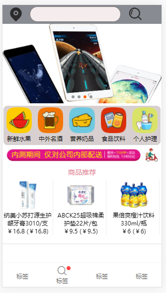

#### 9.首页楼层效果制作goods-list


将goods-list封装成独立的组件：


#### 10.Filter（过滤器）使用和代码优化


#### 11.热卖组件的制作和Van-list使用


bug点：


#### 12.安装Koa2到项目中来

1.首先在项目根目录下建立文件夹`service`，然后进入文件。

```shell
mkdir service
cd service
```

2.使用`npm init -y` 生成并初始化package.json 文件。

3.在终端中使用npm来安装koa

```
npm install --save koa
```

安装好后，写个Hello World 测试，也帮助小伙伴们回忆一下Koa最基本的语法（如果看到这里，你还没有学习Koa2的基础课程），那你需要停下来转到Koa2去学习一下基础，然后回来再进行学习。

```
const Koa = require('koa')
const app = new Koa()
app.use(async(ctx)=>{
    ctx.body = '<h1>hello Koa2</h1>'
})
app.listen(3000,()=>{
    console.log('[Server] starting at port 3000')
})
```

编写好以后，使用`node index.js`来启动服务，然后在浏览器中输入`http://loacalhost:3000`，如果正常显示hell koa2 说明我们的koa2已经安装成功。

#### 13.安装MongoDB数据库

[安装步骤](https://jspang.com/detailed?id=61#toc394)

1. 去官网下载MongoDB，https://www.mongodb.com/ ,在网站中找到Download按钮。下载会有点忙， 国外的服务器，你懂的。
2. 下载后进行安装，安装没什么难度，但是对于新手建议选择默认安装，而不选择自己配置。等我们完全熟悉后再定制式配置。
3. 安装时如果有安全软件，会报一些拦截，一律允许就好，不允许会安装失败的。
4. 安装完成后，需要配置“环境变量”，目的是再命令行中直接使用，而不需要输入很长的路径了。（此步骤观看视频）

安装好MongoDB数据库后，我们需要启用服务端才能使用。启用服务的命令是：Mongod。

1. 打开命令行:先打开运行（快捷键win+R），然后输入cmd后回车，就可以打开命令行工具。
2. 执行mongod:在命令中直接输入mongod，但是你会发现服务并没有启动，报了一个exception，服务停止了。
3. 新建文件夹:出现上边的错误，是因为我们没有简历Mongodb需要的文件夹，一般是安装盘的根目录，建立data/db,这两个文件夹。
4. 运行mongod：这时候服务就可以开启了，链接默认端口是27017

由于我们是作项目，所以图形界面比较直观，我们上边并没有安装图形界面，这里我们使用Robo3来弥补一下。

#### 14.Koa2中用Mongoose链接数据库

在作软件的时候，我们经常会遇到MVC这个词(Model View Controller)，那在Model和Controller这一层经常需要一些工具来进行对接。Mongoose就是Koa和MongoDB的粘合材料（其实也相当于一个驱动），帮助我们完成数据库的操作和通讯。要实现通讯第一步就是实现粘合，软件里叫做连接数据库。这就是这节课我们需要讲的内容。

[Mongoose概念](https://jspang.com/detailed?id=61#toc398)

> Mongoose是一个开源的封装好的实现Node和MongoDB数据通讯的数据建模库。

[Mongoose的安装](https://jspang.com/detailed?id=61#toc399)

还是使用npm来进行安装。

```shell
npm install mongoose --save
```

[连接数据库](https://jspang.com/detailed?id=61#toc3100)

我们在项目的`service`文件夹下建立一个`database`文件夹，用来存放和数据库操作有关的文件。在database文件夹下，建立一个`init.js`文件，用来作数据库的连接和一些初始化的事情。

/service/database/init.js

```
const mongoose = require('mongoose')
const db = "mongodb://localhost/simle-db"

mongoose.Promise =  global.Promise

exports.connect = ()=>{
    //连接数据库
    mongoose.connect(db)

    //增加数据库连接的事件监听
    mongoose.connection.on('disconnected',()=>{
        //进行重连
        mongoose.connect(db)
    })

    //数据库出现错误的时候
    mongoose.connection.on('error',err=>{
        console.log(err)
        mongoose.connect(db)
    })

    //链接打开的时候
    mongoose.connection.once('open',()=>{
        console.log('MongoDB Connected successfully!')
    })

}
```

然后在`/service/index.js`里加入立即执行函数，在使用前记得用require进行引入 `connect`。

```
//引入connect
const {connect} = require('./database/init.js')

//立即执行函数
;(async () =>{
    await connect()
})()
```

然后我们在中终端里使用`node index.js`执行一下，可以看到数据库已经连接成功了。

**总结:**这节课的内容只是简单的连接，还有一些错误或者是连接中断的业务代码没有编写，我们留到下一节进行编写。作程序都是这样的，先要实现主要功能，然后考试考虑意外情况，减少代码错误。

[第21节： Koa用Mongoose连接数据库（2）](https://jspang.com/detailed?id=61#toc2101)

[](https://jspang.com/detailed?id=61#payFor) 上节课已经作了基本的数据库连接，并且已经连接成功。但是如果数据没有开启，或网络出现问题，我们并没有作这些意外处理，在写程序时，当主要功能完成时，我们要作意外处理和逻辑处理，让程序增加健壮性。

[增加Promise的支持](https://jspang.com/detailed?id=61#toc3102)

我们在作这个init.js文件时，必须确保先连接数据库后，再作其他事情，所以我们需要在所有代码的外层增加一个`Promise`。

```
return  new Promise((resolve,reject)=>{
//把所有连接放到这里
})
```

[连接失败自动重连](https://jspang.com/detailed?id=61#toc3103)

一般数据库连接失败，我们会重新连接，但这个重连也是需要有一个次数的，比如连接3次失败，我们在服务端抛出异常。 首先声明一个最大连接数`maxConnectTimes`.

```
let maxConnectTimes = 0 
```

当连接断开时，我们进行重连的代码如下：

```
mongoose.connection.on('disconnected',()=>{
    console.log('***********数据库断开***********')
    if(maxConnectTimes<3){
        maxConnectTimes++
        mongoose.connect(db)    
    }else{
        reject()
        throw new Error('数据库出现问题，程序无法搞定，请人为修理......')
    }

})
```

当连接断开时，我们需要把连接次数加1，并重新连接数据库。当重连次数超过3次后，我们抛出了异常，并用reject()通知了promise。

同样当连接出错时，我们也要进行重连操作。

```
mongoose.connection.on('error',err=>{
    console.log('***********数据库错误***********')
    if(maxConnectTimes<3){
        maxConnectTimes++
        mongoose.connect(db)   
    }else{
        reject(err)
        throw new Error('数据库出现问题，程序无法搞定，请人为修理......')
    }

})
```

[全部文件](https://jspang.com/detailed?id=61#toc3104)

```
const mongoose = require('mongoose')
const db = "mongodb://localhost/smile-db"

exports.connect = ()=>{
    //连接数据库
    mongoose.connect(db)

    let maxConnectTimes = 0 

    return  new Promise((resolve,reject)=>{
    //把所有连接放到这里

        //增加数据库监听事件
        mongoose.connection.on('disconnected',()=>{
            console.log('***********数据库断开***********')
            if(maxConnectTimes<3){
                maxConnectTimes++
                mongoose.connect(db)    
            }else{
                reject()
                throw new Error('数据库出现问题，程序无法搞定，请人为修理......')
            }

        })
        mongoose.connection.on('error',err=>{
            console.log('***********数据库错误***********')
            if(maxConnectTimes<3){
                maxConnectTimes++
                mongoose.connect(db)   
            }else{
                reject(err)
                throw new Error('数据库出现问题，程序无法搞定，请人为修理......')
            }

        })
        //链接打开的时
        mongoose.connection.once('open',()=>{
            console.log('MongoDB connected successfully') 
            resolve()   
        })
    })
}
```

#### 15.Mongoose的Schema建模


数据库已经可以连接成功了，这节课学习一下如何建模，也就是定义Schema，他相当于MongoDB数据库的一个映射。Schema是一种以文件形式存储的数据库模型骨架，无法直接通往数据库端，也就是说它不具备对数据库的操作能力。Schema是以key-value形式Json格式的数据。

[Schema中的数据类型](https://jspang.com/detailed?id=61#toc3106)

- String ：字符串类型
- Number ：数字类型
- Date ： 日期类型
- Boolean： 布尔类型
- Buffer ： NodeJS buffer 类型
- ObjectID ： 主键,一种特殊而且非常重要的类型
- Mixed ：混合类型
- Array ：集合类型

[Mongoose中的三个概念](https://jspang.com/detailed?id=61#toc3107)

- schema ：用来定义表的模版，实现和MongoDB数据库的映射。用来实现每个字段的类型，长度，映射的字段，不具备表的操作能力。
- model ：具备某张表操作能力的一个集合，是mongoose的核心能力。我们说的模型就是这个Mondel。
- entity ：类似记录，由Model创建的实体，也具有影响数据库的操作能力。

[初学定义一个用户Schema](https://jspang.com/detailed?id=61#toc3108)

这节我们先以用户表为例，定义一个基本数据模型，当然这并不完善，我们会在后边的几节课把这个模型完善，并加入一些安全的机制进群。 在`/servcie/database/`文件夹下新建一个`schema`文件夹，然后新建一个`User.js`文件.

~~~
const mongoose = require('mongoose')    //引入Mongoose
const Schema = mongoose.Schema          //声明Schema
let ObjectId = Schema.Types.ObjectId    //声明Object类型

//创建我们的用户Schema
const userSchema = new Schema({
    UserId:ObjectId,
    userName:{unique:true,type:String},
    password:String,
    createAt:{type:Date,default:Date.now()},
    lastLoginAt:{type:Date,default:Date.now()}

})

//发布模型
mongoose.model('User',userSchema)
~~~

#### 16.载入Schema和数据的插入和查询

#### 17.密码的加密处理

[加密处理](https://jspang.com/detailed?id=61#toc3114)

密码的加密有很多种加密算法，比如我们使用的MD5加密或者hash256加密算法，其实他们都是hash的算法。就是把你的密码进行一次不可逆的编译，这样就算别人得到了这个密码值，也不能进行直接登录操作。 我们可以通过（http://www.atool.org/hash.php） 网站，直观的看一下加密的算法。

[加盐处理](https://jspang.com/detailed?id=61#toc3115)

有了加密的处理，我们的密码就安全多了，但是有用户的密码设置的太过简单，很好进行暴力破解或者用彩虹表破解，这时候感觉我们的密码又不堪一击了。这时候我们要使用加盐技术，其实就是把原来的密码里，加入一些其他的字符串，并且我们可以自己设置加入字符串的强度。

把加盐的数据库密码进行hash处理后，再存入数据库就比较安全了。

当然还有很多更严谨更可靠的加密机制，小伙伴可以自行探索一下，这个项目我们就是用加盐加密的方法处理用户的密码。

[bcrypt的使用](https://jspang.com/detailed?id=61#toc3116)

**简介:** bcrypt是一种跨平台的文件加密工具。bcrypt 使用的是布鲁斯·施内尔在1993年发布的 Blowfish 加密算法。由它加密的文件可在所有支持的操作系统和处理器上进行转移。它的口令必须是8至56个字符，并将在内部被转化为448位的密钥。

首先是用npm 进行安装

```
npm instal --save bcrypt --registry=https://registry.npm.taobao.org
```

这里注意如果你安装失败了，试着是用淘宝源来进行安装，因为bcrypt里边的二进制包的下载可能是被墙掉了。

安装完成后就是引入bcrypt

```javascript
const bcrypt = require('bcrypt')
```

然后是用pre每次进行保存时都进行加盐加密的操作。（具体代码解释，视频中进行讲解）

```javascript
//每次存储数据时都要执行
userSchema.pre('save', function(next){
    //let user = this
    console.log(this)
    bcrypt.genSalt( SALT_WORK_FACTOR,(err,salt)=>{
        if(err) return next(err)
        bcrypt.hash(this.password,salt, (err,hash)=>{
            if(err) return next(err)
            this.password = hash
            next()
        }) 

    })
})
```


#### 18.注册页面前端视图


~~~js
<template>
  <div class="register">
      <van-nav-bar
        title="用户注册"
        left-text="返回"
        left-arrow
        @click-left="goBack"
        />
        
        <div class="register-panel">
        <van-field
            v-model="username"
            label="用户名"
            icon="clear"
            placeholder="请输入用户名"
            required
            @click-icon="username = ''"
        />

        <van-field
            v-model="password"
            type="password"
            label="密码"
            placeholder="请输入密码"
            required
        />
        <div class="register-button">
            <van-button type="primary" size="large">马上注册</van-button>
        </div>
       </div>
  </div>
</template>

<script>
    export default {
        data() {
            return {
                username: '',
                password: '',
            }
        },
        methods: {
            goBack() {
                this.$router.go(-1)   
            }
        },
    }
</script>
<style scoped>
    .register-panel{
        width:96%;
        border-radius: 5px;
        margin:20px auto;
        padding-bottom:50px;
    }
    .register-button{
        padding-top:10px;
    }
</style>
~~~

#### 19.koa2的用户操作的路由模块化

在学习基础知识的时候，我们已经讲过·`koa-router`这个插件，但是所有的路由都写在`service/idnex.js`里显然不是正确的选择，这会导致我们的`index.js`页面越来越臃肿，最后变的没办法维护。我们需要把Koa程序模块化，我们也叫做路由模块化。

[安装koa-router](https://jspang.com/detailed?id=61#toc3120)

我们使用npm来安装koa-router，需要注意的是在终端中我们要进入到`service`文件夹下，然后再输入如下命令：

```shell
npm install koa-router --save
```

我现在使用的版本是`7.4.0`，大家一定要注意一下自己的版本，如果版本不同，可能学习的时候稍有区别。

[新建一个User.js的文件](https://jspang.com/detailed?id=61#toc3121)

新建一个appApi的文件夹，然后在进入文件夹，新建User.js的文件。有关User.js的操作，我们以后都会放到这个文件下，就是要编写的供前台使用的接口程序了。

```
mkdir appApi
cd appApi
```

编写我们User.js文件：（视频中会详细讲解）

```
const Router = require ('koa-router')
let router = new Router()
router.get('/',async(ctx)=>{
    ctx.body="这是用户操作首页"
})
router.get('/register',async(ctx)=>{
    ctx.body="用户注册接口"
})
module.exports=router;
```

[让路由模块化](https://jspang.com/detailed?id=61#toc3122)

接下来，我们需要把这个文件和koa-router加入到`service/idnex.js`下面，实现可以访问。 1.首先在`index.js`的文件顶部，引入koa-router

```
const Router = require('koa-router')
```

2.引入我们的user.js模块

```
let user = require('./appApi/user.js')
```

3.装载所有子路由

```
let router = new Router();
router.use('/user',user.routes())
```

1. 加载路由中间件

```
app.use(router.routes())
app.use(router.allowedMethods())
```

这四步作完了，我们就可以在浏览器中实验一下我们的模块化路由是否起作用了。在浏览器中输入，`http://localhost:3000/user`，已经可以出现我们设定好的页面了。

**总结：**通过这种简单的模块化路由机制，我们就实现了文件的分离，当然这并不是最完美的方案，如果对要求比较高的小伙伴，可以看一下egg.js的路由写法或者直接使用egg.js来进行开发。当然现在的这种做法完全可以应付小型项目的开发了。

#### 20.打通前后端通讯

我们要把前后端进行打通，使用API接口的形式可以互相同通讯和传递数据。首先我们要接到前端发过来的请求，这时候需要安装`koa-bodyparser`中间件,我们使用npm来进行安装。

```
npm install --save koa-bodyparser
```

安装好后，在`service/index.js`文件中注册和引入中间件。

```
const bodyParser = require('koa-bodyparser')
app.use(bodyParser());
```

[前台的axios请求处理](https://jspang.com/detailed?id=61#toc3125)

1.在`register.vue`头部引入axios

```
import axios from 'axios'
```

2.修改serviceAPI.config.js接口配置文件 需要对接口配置文件作一些设置，加入我们的注册接口地址。

```javscript
const BASEURL = "https://www.easy-mock.com/mock/5ae2eeb23fbbf24d8cd7f0b6/SmileVue/"
const LOCALURL = "http://localhost:3000/"
const URL = {
    getShoppingMallInfo:BASEURL+'index',
    getGoodsInfo:BASEURL+'getGoodsInfo',
    registerUser:LOCALURL+'user/register',   //用户注册接口
}

module.exports = URL
```

这里主要加入了LOCALURL常量的声明，用于存储本地请求路径，和在URL里增加了registerUser接口的地址配置。

3.引入接口配置文件

```
import url from '@/serviceAPI.config.js'
```

4.编写aixos用户注册方法 进入到`src/components/pages/Register.vue`文件下，在methods属性里，写入如下方法

```
//*********axios注册用户方法********
axiosRegisterUser(){
        axios({
        url: url.registerUser,
        method: 'post',
        data:{
            username:this.username,
            password:this.password 
        }
    })
    .then(response => {
        console.log(response)
    })
    .catch((error) => {
        console.log(error)
    })
}
```

5.把注册按钮绑定axiosRegisterUser方法

```
<van-button type="primary" @click="axiosRegisterUser" size="large">马上注册</van-button>
```

[让koa2支持跨域请求](https://jspang.com/detailed?id=61#toc3126)

跨域对于新手小伙伴来说是个非常头疼的问题，在微信或者QQ群里很多小伙伴问我跨域的问题，当然跨域也有多种解决方案，但是个人认为最完美的解决方案是在后台设置支持跨域。对于这个项目后台就是我们的Koa2服务。

**安装koa2-cors中间件**

在koa2里解决跨域的中间件叫`koa2-cors`，我们先进入service文件夹，然后直接使用npm来进行安装。

```
npm install --save koa2-cors
```

安装完成后，记得要在`service/index.js`文件中引入和注册（使用）一下中间件：

```
const cors = require('koa2-cors')
app.use(cors())
```

[编写koa2接收前台数据的方法](https://jspang.com/detailed?id=61#toc3127)

这时候我们已经万事俱备了，打通了前台和后台数据互通的基本环节。现在主要开心的写一个后台的数据接口方法，就可以实现接收数据，并回传数据了。

进入`service/appApi/user.js`文件，修改resgister路由接口下的代码，记得把get方法换成post方法。

```
router.post('/register',async(ctx)=>{
    console.log(ctx.request.body)
    ctx.body= ctx.request.body
})
```

到此步我们已经完成了前后台数据的互通，可以打开服务接口，开启浏览器，测试一波了。小伙伴们是否传递了数据，并在前台接收到了返回。


#### 21.用户注册的数据库操作

这节课我们主要用户注册时，如何插入到数据库中，实现真正的Vue、Koa2、Mongodb全面互通。相信学完这节课，小伙伴们都可以开始自己向下作项目，并且使用一些小项目练手了。掌握了这节，你已经算是一个准全栈工程师了。有了编写前端+后端的能力。更多的就是练习和积累相关知识了。

[Koa2的User.js 接口的完善](https://jspang.com/detailed?id=61#toc3129)

1.首先在`service/appApi/user.js`下引入mongose,这样就可以操作我们的Schema了。

```javascript
const mongoose = require('mongoose')
```

2.编写 register接口的程序，代码的注释已经很详细，小伙伴们可以直接看注释。

```javascript
router.post('/register',async(ctx)=>{

    //取得Model
    const User = mongoose.model('User')
    //把从前端接收的POST数据封装成一个新的user对象
    let newUser = new User(ctx.request.body)
    //用mongoose的save方法直接存储，然后判断是否成功，返回相应的结果
    await newUser.save().then(()=>{
        //成功返回code=200，并返回成功信息
        ctx.body={
            code:200,
            message:'注册成功'
        }
    }).catch(error=>{
         //失败返回code=500，并返回错误信息
        ctx.body={
            code:500,
            message:error
        }
    })

})
```

[前端Vue的业务处理](https://jspang.com/detailed?id=61#toc3130)

上节课我们只是用axios发送了一个请求，对返回的结果只是简单的console.log()了一下，现在我们把这些代码进行补全，根据koa端返回的code进行不同的提示。

提示我们可以使用vant的轻提示插件Toast，先引入我们的Toast组件，这个直接在`Register.vue`下引入就可以了。

```javascript
import { Toast } from 'vant'
```

具体业务逻辑代码如下：

```javascript
axiosRegisterUser(){
        axios({
        url: url.registerUser,
        method: 'post',
        data:{
            userName:this.username,
            password:this.password 
        }
    })
    .then(response => {
        console.log(response)
        //如果返回code为200，代表注册成功，我们给用户作Toast提示
        if(response.data.code == 200){
            Toast.success('注册成功')
        }else{
            console.log(response.data.message)
            Toast.fail('注册失败')
        }
            console.log(response.data.code)
    })
    .catch((error) => {   
        Toast.fail('注册失败')  
    })
}
```

#### 22.用户注册的防提交编写

当用户端网络延迟的时候，点击没有返回数据，这时候用户可能会再次点击注册按扭，这个时候就发送多次请求到服务器，增加了服务器的压力。

解决办法：在前台注册按钮上面增加一个loading


#### 23.用户注册的前端数据验证

在注册的时候无论是前端还是后端都要做数据的基础验证，防止提交错误的数据类型，比如空值、


解决办法：为输入框绑定一个错误信息的提示


~~~JS
   // 验证表单数据是否正确
            checkFrom(){
                let flag=true //定义一个变量来表示输入信息的状态，是否有误
                if (this.username.length<5) {
                     this.userNameErr="用户名长度不能少于5位"
                     flag=flase
                } else {
                    this.userNameErr=""
                }
                if (this.password.length<6) {
                    this.passwordErr="密码不能少于6位"
                    flag=flase
                } else {
                    this.passwordErr=""
                }
                return flag
            }
       },
           
  registerAction(){
                this.checkFrom() && this.axiosRegisterUser() //当表单输入无误的时候再执行ajax请求
            },
                
                
  <div class="register-button">
      <van-button  type="primary" @click="registerAction" size="large" :loading="openLoading">马上注册</van-button>
  </div>
~~~

#### 24.登录界面制作和路由配置


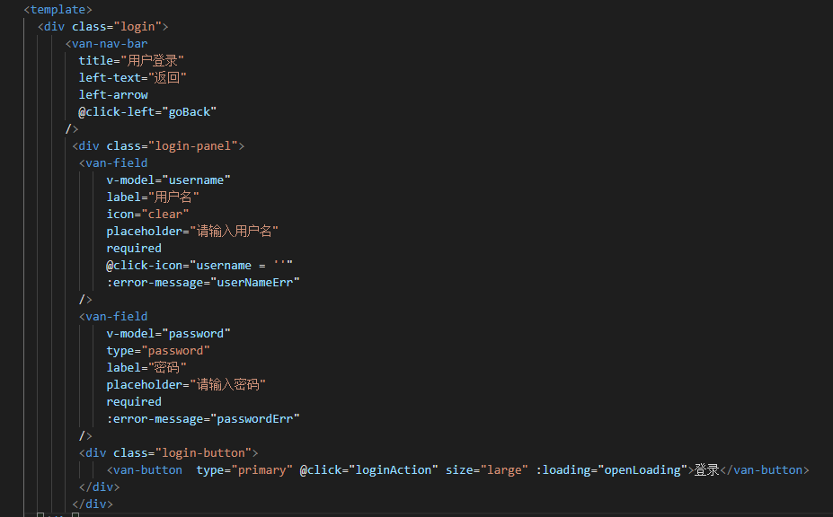

#### 25.登录服务端业务逻辑编写

~~~
router.post('/login',async(ctx)=>{ //用户登录
    let loginUser = ctx.request.body
    console.log(loginUser)
    let userName = loginUser.userName
    let password = loginUser.password
    //引入User的model
    const User = mongoose.model('User')
    await User.findOne({userName:userName}).exec().then(async(result)=>{
        console.log(result)
        if(result){
            let newUser = new User()
            await newUser.comparePassword(password,result.password)
            .then(isMatch=>{
                ctx.body={code:200,message:isMatch}
            })
            .catch(error=>{
                console.log(error)
                ctx.body={code:500,message:error}
            })
        }else{
            ctx.body={code:200,message:'用户名不存在'}
        }
    }).catch(error=>{
        console.log(error)
        ctx.body={code:500,message:error}
    })
})
~~~

#### 26.登录交互与登录态存储

基础登录操作：

~~~js
  loginAction(){
                this.checkFrom() && this.axiosLoginUser()  //当表单输入无误的时候再执行ajax请求
            },
            axiosLoginUser(){
              this.openLoading=true
              axios({
              url: url.login,
              method: 'post',
              data:{
                  userName:this.username,
                  password:this.password 
              }
              }).then(response => {
                  console.log(response)
                if(response.data.code==200&&response.data.message==true){
                    
                    Toast.success('登录成功')
                    // this.$router.push('/')
                }else{
                    Toast.fail('登录失败')
                    this.openLoading = false
                }
              }).catch((error) => {
                 console.log(error);
                 Toast.fail('登录请求失败')
                 this.openLoading=false
              })
            },

            // 验证表单数据是否正确
            checkFrom(){
                let flag=true //定义一个变量来表示输入信息的状态，是否有误
                if (this.username.length<5) {
                     this.userNameErr="用户名长度不能少于5位"
                     flag=false
                } else {
                    this.userNameErr=""
                }
                if (this.password.length<6) {
                    this.passwordErr="密码不能少于6位"
                    flag=false
                } else {
                    this.passwordErr=""
                }
                return flag
            }
       },
~~~

基础登录完成以后，发现返回以后仍然可以再登录，而大多情况下我们需要登录一次后用户的登录状态可以保留一段时间

解决办法：利用localstorage进行本地存储


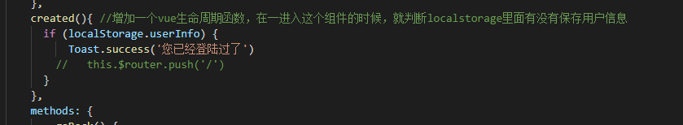

#### 27.商品详情数据的提纯

准备页面的商品数据和类别数据制作我们的列表页和详细页。商品详情的JSON文件，这些数据多数是没有什么用处的，需要我们动手把有用的数据筛选出来，我把这种筛选叫做数据的提纯。

[用fs读入数据](https://jspang.com/detailed?id=61#toc3151)

在service文件夹下，新建一个`fsJson.js`的文件使用node的fs模块，可以轻松把文件读取到程序中，然后进行便利，把有用的数据提取出来，写入到一个新的数组中

```javascript
const fs = require('fs')
fs.readFile('.goods.json', 'utf8', function(err, data){
    let newData= JSON.parse(data)
    let i=0
    let pushData=[]
    newData.RECORDS.map(function(value,index){
        if(value.IMAGE1!=null){
            i++
            console.log(value.NAME)
            pushData.push(value)
        }  
    })
    console.log(i)
    console.log(pushData)
});
```

[写入到新的文件中](https://jspang.com/detailed?id=61#toc3152)

```javascript
fs.writeFile('./newGoods.json',JSON.stringify(pushData),function(err){
    if(err) console.log('写文件操作失败');
    else console.log('写文件操作成功');
});
```

这样就完成了这次数据的提纯操作，通过提纯我们得到了一张可用的json商品详情表。通过这节的学习主要是了解一下node的fs模块，因为这在我们工作中是非常常用的。

#### 28.插入商品详情数据到Mongodb

有了可插入的JSON数据，就可以建立一个Schema模型，然后是用Mongoose插入到我们的数据库中了，建立Schema建立`servic/database/schema/Goods.js`文件，然后根据我们的数据表结构建立模型

```javascript
const mongoose = require('mongoose')    //引入Mongoose
const Schema = mongoose.Schema          //声明Schema
let ObjectId = Schema.Types.ObjectId    //声明Object类型
const goodsSchema = new Schema({
    ID:{unique:true,type:String},
    GOODS_SERIAL_NUMBER:String,
    SHOP_ID:String,
    SUB_ID:String,
    GOOD_TYPE:Number,
    STATE:Number,
    NAME:String,
    ORI_PRICE:Number,
    PRESENT_PRICE:Number,
    AMOUNT:Number,
    DETAIL:String,
    BRIEF:String,
    SALES_COUNT:Number,
    IMAGE1:String,
    IMAGE2:String,
    IMAGE3:String,
    IMAGE4:String,
    IMAGE5:String,
    ORIGIN_PLACE:String,
    GOOD_SCENT:String,
    CREATE_TIME:String,
    UPDATE_TIME:String,
    IS_RECOMMEND:Number,
    PICTURE_COMPERSS_PATH:String
},{
    collections:'Goods'
})
mongoose.model('Goods',goodsSchema)
```

这里需要注意的是，要按照JSON中的数据进行建立。

[2.批量插入数据库的路由方法](https://jspang.com/detailed?id=61#toc3155)

新建一个`service/appApi/goods.js`以后关于商品的操作就都在这个api文件中编写了，我们也是要写路由的形式，提供每一个支持。

```
const Koa = require('koa')
const app = new Koa()
const Router = require ('koa-router')
let router = new Router()

const mongoose = require('mongoose')
const fs = require('fs')
router.get('/insertAllGoodsInfo',async(ctx)=>{
     fs.readFile('./goods.json','utf8',(err,data)=>{ //注意路径问题
        data=JSON.parse(data)
        let saveCount=0
        const Goods = mongoose.model('Goods')
        data.map((value,index)=>{
            console.log(value)
            let newGoods = new Goods(value)
            newGoods.save().then(()=>{
                saveCount++
                console.log('成功'+saveCount)
            }).catch(error=>{
                 console.log('失败：'+error)
            })
        })
    })
    ctx.body="开始导入数据"
})

module.exports=router;
```

#### 29.商品大类Schema建立并导入数据库

把商品大类的数据从JSON格式导入到MongoDB数据库中，涉及到的知识点有Schema的建立，fs模块的使用和Mongoose的存储。

[1.编写Category的Schema](https://jspang.com/detailed?id=61#toc3158)

Schema的建立我们已经用了好几次了，但是还是有一些小伙伴不太明确Schema是什么，其实你把Schema想象成数据库collections的一个复制映射就好，它是和数据可里的collection对应的。 明确了这个道理，我们直接根据Json的格式直接制作就好：

```JavaScript
const mongoose = require('mongoose')    //引入Mongoose
const Schema = mongoose.Schema          //声明Schema

const categorySchema = new Schema({
    ID:{unique:true,type:String},
    MALL_CATEGORY_NAME:{type:String},
    IMAGE:{type:String},
    TYPE:{type:Number},
    SORT:{type:Number},
    COMMENTS:{type:String}
})

mongoose.model('Category',categorySchema)
```

[插入Mongodb数据库](https://jspang.com/detailed?id=61#toc3159)

有了Schema之后可以在`service/appApi/goods.js`文件里增加一个路由配置，并把业务逻辑代码写入到路由里。业务逻辑并不复杂：

1. 用fs读取category.json的数据
2. 把数据进行循环存入数据库。

```Javascript
router.get('/insertAllCategory',async(ctx)=>{
    fs.readFile('./data_json/category.json','utf8',(err,data)=>{
        data=JSON.parse(data)
        let saveCount=0
        const Category = mongoose.model('Category')
        data.RECORDS.map((value,index)=>{
            console.log(value)
            let newCategory = new Category(value)
            newCategory.save().then(()=>{
                saveCount++
                console.log('成功'+saveCount)
            }).catch(error=>{
                 console.log('失败：'+error)
            })
        })
    })
    ctx.body="开始导入数据"

})
```

完成后我们打开mongod服务，然后访问`http://localhost:3000/goods/insertAllCategory`,数据就可以顺利插入到数据库里了。


#### 30.商品子类Schema建立并导入数据库

把子类的Schema建立好，并用fs读取json文件，最后循环保存到数据库中。由于知识点前面都已经讲过，所以这里直接上代码了。

[1.categorySub的Schema建立](https://jspang.com/detailed?id=61#toc3161)

```
const mongoose = require('mongoose')    //引入Mongoose
const Schema = mongoose.Schema          //声明Schema

const categorySubSchema = new Schema({
    ID:{unique:true,type:String},
    MALL_CATEGORY_ID:{type:String},
    MALL_SUB_NAME:{type:String},
    COMMENTS:{type:String},
    SORT:{type:Number}
})

mongoose.model('CategorySub',categorySubSchema)
```

[2.保存到数据库的业务逻辑](https://jspang.com/detailed?id=61#toc3162)

```
router.get('/insertAllCategorySub',async(ctx)=>{
    fs.readFile('./data_json/category_sub.json','utf8',(err,data)=>{
        data = JSON.parse(data)
        let saveCount = 0 
        const CategorySub = mongoose.model('CategorySub')
        data.RECORDS.map((value,index)=>{
            console.log(value)
            let newCategorySub = new CategorySub(value)
            newCategorySub.save().then(()=>{
                saveCount++
                console.log('成功插入'+saveCount)
            }).catch(error=>{
                console.log('插入失败:'+error)
            })
        }) 
    })
    ctx.body="开始导入数据"
})
```


#### 31.编写商品详情页的数据接口

后台：


前台：


~~~JS
<script>
import axios from 'axios'
import URL from '@/serviceAPI.config.js'
export default {
  name: 'GoodsInfo',
  components: {
  },
  data() {
    return {
      goodsID:'11d79429f399494a9016bd631ece4300'
    }
  },
  created(){
    this.getGoodsInfo()
  },
  methods: {
    getGoodsInfo(){
      axios({
        url:URL.goodsInfo,
        method:'post',
        data:{
          goodsId:this.goodsID
        }
      }).then((res)=>{
        console.log(res);
      }).catch((error)=>{
        console.log(error);
      })
    }
  },
};
</script>
~~~


#### 32.路由和参数的传递


#### 33.商品详细页面模板编写

~~~js
<template>
  <div class="goods-info">
     <div class="nav-bar">
       <van-nav-bar
         title="商品详情"
         left-text="返回"
         left-arrow
         @click-left="comBack"
       />
     </div>
     <div class="goodsImg">
       
     </div>
     <div>
       <p class="goodsName">{{goodsInfo.NAME}}</p>
        <span class="goodsPrice">优惠促销    ￥{{goodsInfo.PRESENT_PRICE | toMoney}}</span>
     </div>
     <div class="info">
          <van-tabs v-model="active"  swipeable sticky>
            <van-tab title="详情" class="detail">
              <div v-html="goodsInfo.DETAIL">
              </div>
            </van-tab>
            <van-tab title="评价">
              <div v-html="goodsInfo.DETAIL">
              </div>
            </van-tab>
            <van-tab title="推荐">
              <div v-html="goodsInfo.DETAIL">
              </div>
            </van-tab>
          </van-tabs>
     </div>
     <div class="goods-bottom">
        <div>
          <van-button size="large" type="primary">直接购买</van-button>
        </div>
        <div>
          <van-button size="large" type="danger">加入购物车</van-button>
        </div>
    </div>
  </div>
</template>

<script>
import axios from 'axios'
import URL from '@/serviceAPI.config.js'
import { Toast } from 'vant';
export default {
  name: 'GoodsInfo',
  components: {
  },
  data() {
    return {
      goodsID:'',
      goodsInfo:{},
      active:0
    }
  },
  created(){
    this.goodsID=this.$route.query.goodsId
    // console.log(this.goodsID);
    this.getGoodsInfo()
  },
  methods: {
    getGoodsInfo(){
      axios({
        url:URL.goodsInfo,
        method:'post',
        data:{
          goodsId:this.goodsID
        }
      }).then((res)=>{
        console.log(res);
        if (res.data.code==200 && res.data.message) {
          this.goodsInfo=res.data.message
        } else {
          Toast('数据获取失败')
        }
      }).catch((error)=>{
        console.log(error);
      })
    },
    comBack(){
      this.$router.go(-1)
    }
  },
  filters:{
    toMoney(money){
      return money+'0'
    }
  }
};
~~~


#### 34.商品类别页的前端制作


#### 35.商品类别联动效果制作

根据大的分类获取小类的信息


#### 36.商品类别上拉加载、下拉刷新效果


#### 37.Vue中默认图片实现


38.商品列表页的编程式（链接）导航

方式一：


方式二：


#### 38.购物车页面的建立（这里用的是H5新增的localstorage）


#### 39.购物车中添加商品


#### 40.购物车中的商品价格计算


#### 41.底部导航栏和子导航的制作


