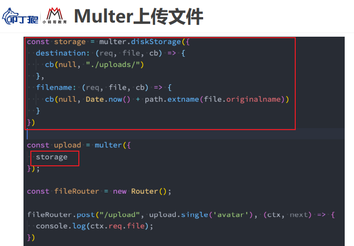
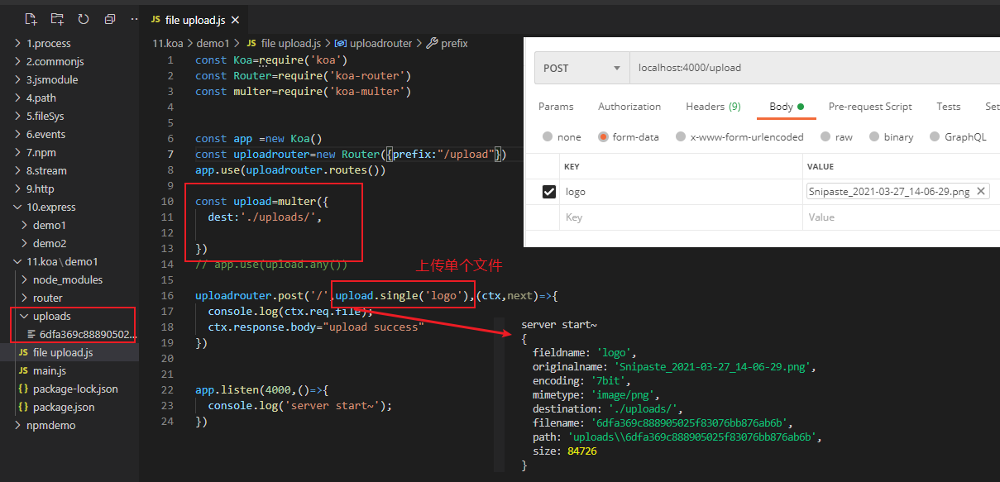
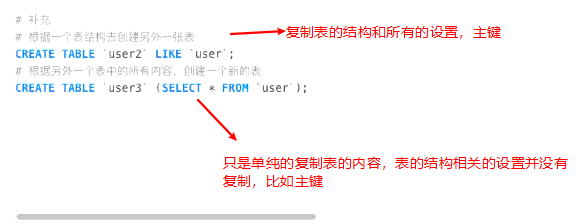

## 1.Node和REPL

**node并不是一门语言，它是一个工具或者环境**，**一个不是浏览器的浏览器**

#### 1.js的发展


#### 2.浏览器内核及工作的过程


#### 3.javascript引擎


#### 4.浏览器内核组成

​    **Browser = WebCore +JavaScriptCore**


#### 5.V8引擎


#### 6.node的本质


#### 7.node的版本管理工具

**nvm-Windows**

~~~javascript
nvm list  查看已经安装过的node版本
nvm list available 查看可用的版本
设置node 和npm 的淘宝镜像
nvm node_mirror https://npm.taobao.org/mirrors/node/ 
nvm npm_mirror https://npm.taobao.org/mirrors/npm/
nvm install latest  安装最新版本
nvm use 14.00  选择对应的版本
~~~


#### 8.node的REPL


#### 9.NODE做后台的优势和特点

 传统后台语言：JAVA/Python/PHP/C#(.NET)...
 =>单线程的： 一心一意
 =>基于V8引擎渲染：快
 =>异步无阻塞的I/O操作：I/O (INPUT/OUTPUT)  对文件的读写
 =>event-driven事件驱动：类似于发布订阅或者回调函数


 * JS运行在客户端浏览器中=>“前端”
 * 浏览器给JS提供可很多全局的属性和方法，例如：window.xxx（setInterval、setTimeout、eval、alert、JSON...）
 * JS运行在服务器端的NODE中=>“后台”
 * NODE也给JS提供很多的内置属性和方法，例如：http、fs、url、path...等对象中都提供很多API供JS操作
 * ===
 * 前端（浏览器运行JS）是限制I/O操作的
 * input type='file' 这种算是I/O操作，但是需要用户手动选择（而且还仅仅是一个读取不是写入）
 * NODE中运行JS是不需要限制I/O操作的

## 2.node的全局对象

#### 1.node程序传递参数


~~~js
console.log(process.argv)

PS D:\project\lianxi\node\process> node .\node参数传递.js name=qinaye age=23
[
  'D:\\Program Files\\nodejs\\node.exe',
  'D:\\project\\lianxi\\node\\process\\node参数传递.js',
  'name=qinaye',
  'age=23'
]
~~~


#### 2.常见的全局对象


#### 3.特殊的全局对象


## 3.javascript模块化

#### 1.什么是模块化


#### 2.CommonJS规范

 NODE本身是基于CommonJS模块规范设计的，所以模块是NODE的组成


案例：


#### 3.exports的本质


#### 4.module.exports的本质


 ```
   1.CommonJS规定，每一个JS都是一个单独的模块（模块是私有的：里面涉及的值和变量以及函数等都是私有的，和其它JS文件中的内容是不冲突的）
   2.CommonJS中可以允许模块中的方法互相的调用
     B模块中想要调取A模块中的方法
       =>A导出
       =>B导入
   [导出]
     CommonJS给每一个模块（每个JS）中都设置了内置的变量/属性/方法
       module：代表当前这个模块[object]
       module.exports：模块的这个“属性”是用来导出当前模块的属性和方法的 [object]
       exports：是内置的一个“变量”，也是用来导出当前模块属性方法的，虽然和module.exports不就是一个东西，但是对应的值是同一个(module.exports=exports 值都是对象)
   [导入]
     require：CommonJS提供的内置变量，用来导入模块的（其实导入的就是module.exports暴露出来的东西）；导入的值也是[object]类型的；
 ```


    CommonJS特点：
     1. 所有代码都运行在模块作用域，不会污染全局作用域（每一个模块都是私有的，包括里面所有的东西也都是私有的，不会和其它模块产生干扰）
     
     2. 模块可以多次加载，但是只会在第一次加载时运行一次，然后运行结果就被缓存了，以后再加载，就直接读取缓存结果。要想让模块再次运行，必须清除缓存。（为了保证性能，减少模块代码重复执行的次数）
     
     3. 模块加载的顺序，按照其在代码中出现的顺序。CommonJS规范加载模块是同步的，也就是说，只有加载完成，才能执行后面的操作。

**提升案例**：

  A/B/C三个模块
    A中有一个sum方法：实现任意数求和
    B中有一个avg方法：实现任意数求平均（先求和再求平均：B中用到A）
    C中调取B中的avg，实现 12,23,34,45,56,67,78,89 求平均数


#### 5.require的规则和原理


#### 6.AMD规范


#### 7.CMD规范


#### 8.ES6里面的模块化


案例：


#### 9.node里面对es module 的支持


## 4.NPM模块管理


### 1.npm配置文件常见的属性


### 2.版本管理的问题


### 3.npm install 命令


### 4.npm 其他命令


### 5.其他的安装包管理工具


## 6.node中常见的内置模块

### 1.fs内置模块


#### 1.FS内置模块常用方法


##### 1.读取文件的状态信息 创建时间、 大小等


##### 2.文件描述符


##### 3.fs.mkdirSync  /  fs.mkdir 创建文件夹 


**总结：无阻塞io操作==异步   ， 事件驱动==回调函数**

##### 4.fs.readdir / fs.readdirSync 读取文件夹


**读取文件下所有文件**：

~~~JS
function reddirflie(dirname){
  fs.readdir(dirname,{withFileTypes: true},(err,files)=>{  //withFileTypes返回文件类型
    files.forEach(item=>{
      if (item.isDirectory()) {
        const fliepath=path.resolve(dirname,item.name)
        reddirflie(fliepath) //递归方式
      } else {
        console.log(item.name);
      }
    })
  })
}

reddirflie("./")
~~~


##### 6.fs.rmdir /fs.rmdirSync  删除文件夹

 但是当文件夹不为空的时候 删除不了 在Windows下会报错


7.fs.writeFile() 向文件中写入内容** ，并且会覆盖文件中已经存在的内容，如果文件不存在会先创建文件


##### 8.fs.appendFile() //向文件中追加内容


##### 9.fs.readFile() //读取文件中的内容


##### **10.fs.copyFile() //拷贝文件到新的位置**


##### **11.fs.unlink() //删除文件**


#### 2.基于promise封装文件操作库

将fs里面常见的文件操作的方法进行封装成自己的模块，可以直接在其他地方使用，按照参数的个数和是否有返回值进行整合，

使用的时候只需要传入文件的路径 等


~~~js
let fs = require('fs'),
    path = require('path');
//=>存储的是当前模块执行所在的绝对路径(!==__dirname)
let dirname = path.resolve();

//=>MKDIR && RMDIR && READ-DIR && READ-FILE && COPY-FILE
['mkdir', 'rmdir', 'readdir', 'readFile', 'copyFile', 'unlink'].forEach(item => {
    exports[item] = function (pathname, copypath = '') {
        pathname = path.resolve(dirname, pathname);
        copypath = path.resolve(dirname, copypath);
        return new Promise((resolve, reject) => {
            let arg = [(err, result) => {
                if (err) {
                    reject(err);
                    return;
                }
                resolve(result || '');
            }];
            item === 'readFile' ? arg.unshift('utf8') : null;
            item === 'copyFile' ? arg.unshift(copypath) : null;
            fs[item](pathname, ...arg);
        });
    };
});

//=>WRITE && APPEND
['writeFile', 'appendFile'].forEach(item => {
    exports[item] = function (pathname, content) {
        pathname = path.resolve(dirname, pathname);
        if (typeof content !== 'string') {
            //=>写入的内容我们规定必须是字符串才可以
            content = JSON.stringify(content);
        }
        return new Promise((resolve, reject) => {
            fs[item](pathname, content, 'utf8', (err, result) => {
                if (err) {
                    reject(err);
                    return;
                }
                resolve(result || '');
            });
        });
    };
});

//=>READ-DIR
// exports.readFile = function (pathname) {
//     pathname = path.resolve(dirname, pathname);
//     return new Promise((resolve, reject) => {
//         fs.readFile(pathname, 'utf8', (err, result) => {
//             if (err) {
//                 reject(err);
//                 return;
//             }
//             resolve(result);
//         });
//     });
// };
~~~

#### 3.利用封装好的文件操作库合并压缩多个文件到一个文件

**合并并且压缩CSS**

~~~js
let {readFile, readdir, writeFile} = require('./utils/fsPromise');

//1.先把所有的CSS文件读取出来
readdir('less').then(result => {
    return result.filter(item => /\.CSS$/i.test(item));
}).then(result => {
    let arg = [];
    result.forEach(item => {
        arg.push(readFile(`less/${item}`));//=>分别调取READ-FILE方法，读取捕捉到的CSS文件，向数组中依次增加读取各个文件的PROMISE实例
    });
    //arg=[promise1,promise2...]  Promise.all：等待数组中所有的PROMISE实例都执行成功才算成功
    return Promise.all(arg);
}).then(result => {
    //=>RESULT:一个数组，存放所有文件读取的内容
    result = result.join('');
    return result.replace(/( |\n|\r)/g, '');
}).then(result => {
    return writeFile('less/build.min.css', result);
}).then(() => {
    console.log('创建成功');
});
~~~

**合并并且压缩less**

~~~js
//less.config.js
//=>需要把CONFIG放到当前项目的根目录中
let path = require('path'),
    rootPath=_dirname
    //rootPath = path.resolve();
module.exports = {
    //=>需要编译的LESS文件
    entry: [
        `${rootPath}/less/index.less`,
        `${rootPath}/less/detail.less`
    ],
    output: [
        `${rootPath}/css/index.min.css`,
        `${rootPath}/css/detail.min.css`
    ]
};
//index.js
let path = require('path'),
    lessc = require('less'),
    rootPath = path.resolve();

let {readFile, writeFile} = require(`./utils/fsPromise`),
    {entry, output} = require(`./less.config`);

module.exports = {
        //=>分别读取ENTRY中对应的LESS文件中的代码
        entry.forEach((item, index) => {
            readFile(item).then(result => {
                //=>把读取的LESS代码进行编译:编译为CSS
                lessc.render(result, {compress: true}, (err, result) => {
                    if (err) {
                        console.log(err);
                        return;
                    }
                    writeFile(output[index], result.css);
                });
            });
        });
};
~~~

#### 4.基于promise封装一个读文件的操作

~~~js
let fs = require('fs'),
    path = require('path');
let readFile = function (pathName) {
    //=>一般都会把传递的PATH-NAME进行处理：以当前项目的根目录为依托，我们只需要传递相对于根目录的相对目录地址，程序自动生成一个绝对目录地址
    /*
     * __dirname：当前模块所在的绝对路径（和模块中的方法在哪执行是没有关系的）
     * path.resolve()：当前模块中方法在哪个模块中执行的，那么对应的绝对路径是执行模块的绝对路径
     */
    pathName = path.resolve(path.resolve(), pathName);
    return new Promise((resolve, reject) => {
        fs.readFile(pathName, 'UTF-8', (err, result) => {
            if (err) {
                reject(err);
                return;
            }
            resolve(result);
        });
    });
};
module.exports = {
    readFile
};
~~~

### 2.path内置模块


#### 1.path里面的基本方法


#### 2.path.join和path.resolve的区别


#### 3.path在webpack里面的应用


### 3.url内置模块

**url.parse(url[,flag])**：

把一个URL地址进行解析，把地址中的每一部分按照对象键值对的方式存储起来

~~~JS
let url=require('url')
console.log(url.parse('http://www.baidu.com?user=qianye'));
//***
Url {
  protocol: 'http:',
  slashes: true,
  auth: null,
  host: 'www.baidu.com',
  port: null,
  hostname: 'www.baidu.com',
  hash: null,
  search: '?user=qianye',
  query: 'user=qianye',
  pathname: '/',
  path: '/?user=qianye',
  href: 'http://www.baidu.com/?user=qianye'
}
~~~


~~~js
let url=require('url')
console.log(url.parse('http://www.baidu.com?user=qianye',true));
//=>第二个参数默认是FALSE，设置为TRUE可以把问号传参的部分也解析成为对象键值对的方式
~~~


### 4.http内置模块

#### 1.创建web服务


~~~js
//=>创建WEB服务
let port = 8686;
http.createServer(() => {
    //=>当服务创建成功，并且客户端向当前服务器发送了请求，才会执行回调函数，并且发送一次请求，回调函数就会被触发执行一次
    console.log(`hello world!`);
}).listen(port, () => {
    //=>当服务创建成功,并且端口号也已经监听成功后,触发的回调函数
    console.log(`server is success，listen on ${port}！`);
});

 ```
  注意：基于NODE创建后台程序，我们一般都创建一个server模块，在模块中实现创建WEB服务，
  和对于请求的处理（并且我们一般都会把server模块放到当前项目的根目录下）
 /*
 * 客户端如何向创建的服务器发送请求
 *   对应好协议、域名、端口等信息，在浏览器中或者AJAX等中发送请求即可
 *
 *   http://localhost:8686/...  服务在电脑上，localhost本机域名，也就是本机的客户端浏览器，访问本机的服务器端程序
 *
 *   http://IP:8686/...(http://192.168.0.23:8686/...)  IP做域名访问，如果是内网IP，
         相同局域网下的用户可以访问这个服务，如果是外网IP，所有能联网的基本上都
	     可以访问这个服务（局域网下访问，需要互相关掉防火墙）
 */
~~~

#### 2.创建服务器的方式


#### 3.请求对象request

~~~JS
let http=require('http')
let url = require('url')
//=>创建WEB服务
let port = 8686;
let handle = function handle(req, res) {
    //=>REQ:REQUEST 请求对象，包含了客户端请求的信息
    // req.url 存储的是请求资源的路径地址及问号传参  例如：/stu/index.html?name=xxx&age=12
    // req.method 客户端请求的方式  例如：GET
    // req.headers 客户端的请求头信息，它是一个对象
    // ...
    //=>把请求的URL地址中：路径名称 & 问号传参 分别解析出来
    // let {pathname, query} = url.parse(req.url, true);
    // console.log(pathname, query);

    //=>RES:RESPONSE 响应对象，包含了一些属性和方法，可以让服务器端返回给客户端内容
    // res.write 基于这个方法，服务器端可以向客户端返回内容
    // res.end 结束响应
    // res.writeHead 重写响应头信息 
    // ...
    res.writeHead(200, {
        'content-type': 'text/plain;charset=utf-8;' //设置响应信息的格式
    });
    res.end(JSON.stringify({name: '哈哈哈'}));//=>服务器端返回给客户端的内容一般都是 STRING或者BUFFER格式的数据
};
http.createServer(handle).listen(port, () => {
    console.log(`server is success，listen on ${port}！`);
});
~~~


#### 4.URL的解析


#### 5.method的处理


#### 6.headers


#### 7.响应对象response


#### 8.http请求


#### 9.文件上传


提升：


### 5.events模块


## 7.buffer的使用.


### 1.buffer和二进制的关系


### 2.buffer的其他方法


### 3.buffer的创建过程及原理


## 8.事件循环

### 1.事件循环的本质


### 2.线程和进程的关系


### 3.javascript是单线程的


### 4.浏览器的事件循环


### 5.宏任务和微任务


面试题：


### 6.node的事件循环


面试题1：


面试题2：


## 9.Stream（流）


## 10.express框架


### 1.express安装


### 2.express的中间件


### 3.中间件的应用


普通中间件：


path中间件：


path和method匹配中间件：


连续注册多个中间件：


### 4.body解析


### 5.body-parse的使用


### 6.from-data的解析


### 7.multer处理文件上传


### 8.用Morgan保存express的日志信息


### 9.客户端发送请求的方式


### 10.服务端响应数据


### 11.express的路由（重点）


### 12.静态资源服务器


### 13.服务端的错误处理


### 14.express源码解析


## 11.koa框架


### 1.koa基本使用


### 2.koa注册中间件的方式


~~~JS
const Koa=require('koa')
const app=new Koa()
app.use((ctx,next)=>{
  if (ctx.request.path==='/login') {
    if (ctx.request.method==='GET') {
      ctx.response.body="yes"
    }
  } else {
   ctx.response.body="nonononono"
})
app.listen(3000,()=>{
  console.log('koa start succse');
})
~~~

### 3.koa中路由的使用


### 4.参数解析 params / query


### 5.参数解析：json/x-www-form-urlencoded


### 6.参数解析：form-data


### 7.Multer上传文件





### 8.koa里面数据的响应


### 9.静态服务器


### 10.错误处理


### 11.koa源码分析


### 12.koa和express的区别


### 13.koa洋葱模型


## 12.MySQL


### 1.安装

https://dev.mysql.com/downloads/mysql/


2.MySQL连接


### 2.SQL语句


### 3.数据库的操作（DDL）


### 4.数据表的操作（DML）


### 5.SQL的数据类型

#### 1.数字类型


#### 2.日期类型


#### 3.字符串类型


### 6.表约束


### 7.创建一个完整的表

#### 1.创建


​	**根据一张表的结构去创建另外一张表**



#### 2.修改


#### 3.插入数据（DML）


#### 4.删除和更新


### 8.数据的查询一  单表操作（DQL）


#### 1.基本查询


#### 2.where查询条件


#### 3.查询结果排序


#### 4.分页查询


#### 5.聚合函数


#### 6.分组查询


### 9.数据的查询二  多表操作


#### 1.创建外键


#### 2.外键存在时更新和删除数据


#### 3.什么是多表查询


#### 4.多表之间的连接 SQL JOIN


#### 5.左连接


#### 6.右连接


#### 7.内连接


#### 8.全连接


### 10.数据的查询三  多表操作  多对多


#### 1.查询多对多数据


### 11.将数据转成对象


### 12.node中操作MySQL


#### 1.MySQL2基本使用


#### 2.预编译语句


#### 3.连接池


#### 4.ORM的使用


#### 5.Sequelize


**一对多关系映射**:


**多对多关系映射**：


## node周啸天版

### 6.创建静态资源服务器

~~~JS
  服务器上有一堆项目代码，这堆项目代码中既可能有服务器端的程序代码，也有可能有客户端的程序代码，
  而客户端程序代码我们一般都放到static这个文件夹中

  ```
    static
      都是服务器端需要返回给客户端，由客户端浏览器渲染和解析的（前端项目：包括页面、CSS、JS、图片等）

    server.js
      都是需要在服务器端基于NODE执行的（后端项目：一般只有JS）
  ```
  我们创建的WEB服务需要处理两类请求：
     1.静态资源文件的请求处理：想要文件 要注意返回的文件对应的内容的格式
     2.API接口的请求处理：想要数据

     区别：第一类请求的地址中有后缀名，第二类没有后缀
~~~

**基础应用**：

~~~JS
let http=require('http')
let url = require('url')
let {readFile} =require('./utils/fsUtils')

let port=8090
let handel=function (req,res){
 //=>客户端请求资源文件(PATH-NAME)，服务器端都是到STATIC文件夹中进行读取，
 //也是根据客户端请求的路径名称读取的，服务器端基于FS读取文件中内容的时候，直接加上“./static”即可
 let {method,headers:reqheader}=req
 let {pathname,query}=url.parse(req.url,true) //pathname=/qianye.html
 readFile(`./static${pathname}`).then((result) => {
    //读取成功，返回对应的内容
    res.writeHead(200)
    res.end(result)
  }).catch((err) => {
    //读取失败，返回错误信息，大多数情况下是文件找不到,也就是客户端输入的地址栏有误
    res.writeHead(404,{'content-type':'text/plain;charset=utf-8'})
    res.end('not found file')
  });
}
~~~


**解决图片不能显示的问题**：原因是在读取文件的时候，对所有的内容格式设置了“utf-8”，而图片、视频、音频这类文件是不需要设置的


**浏览器兼容性处理**：

~~~js
let http=require('http')
let url = require('url')
let {readFile} =require('./utils/fsUtils')
let mime=require('mime') //获取文件对应的扩展名

let port=8090
let handel=function (req,res){
 //=>客户端请求资源文件(PATH-NAME)，服务器端都是到STATIC文件夹中进行读取，
 //也是根据客户端请求的路径名称读取的，服务器端基于FS读取文件中内容的时候，直接加上“./static”即可
 let {method,headers:reqheader}=req
 let {pathname,query}=url.parse(req.url,true) //pathname=/qianye.html
 let pathREG=/\.([a-z0-9]+)$/i

 //客户端请求静态资源文件时的处理，也就是请求的方式是带文件后缀名的
 if(pathREG.test(pathname)){
  readFile(`./static${pathname}`).then((result) => {
    //=>读取成功：根据请求资源文件的类型，设置响应内容的MIME 不同的文件对应的内容类型
    // console.log(result);
    let suffix=pathREG.exec(pathname)[1]  //获取文件的扩展名
    res.writeHead(200,{  //ie 下必须设置返回的内容格式
      'content-type': `${mime.getType(suffix)};charset=utf-8;`
    })
    res.end(result)
  }).catch((err) => {
    //读取失败，返回错误信息，大多数情况下是文件找不到,也就是客户端输入的地址栏有误
    res.writeHead(404,{'content-type':'text/plain;charset=utf-8'})
    res.end('not found file')
  });
     return
 }    
}
http.createServer(handel).listen(port,()=>{
  console.log(`server is successful,lisen on ${port}`);
})
~~~


### 7.创建动态资源服务（API请求）

静态资源处理主要是返回对应的文件资源，图片，音视频等。。。动态资源处理，就是API接口的处理，返回对应的数据，如数据库里面的用户信息。。。

#### 1.API接口的请求处理(get 获取指定用户信息)

**基本结构**：


#### 2.API接口的请求处理(POST请求处理)

**服务端**：

~~~js
let http = require('http'),
    url = require('url'),
    path = require('path'),
    fs = require('fs');
let {readFile, writeFile} = require('./utils/fsPromise'),
    mime = require('mime'),
    qs = require('qs');

//=>公共方法
let responseResult = function responseResult(res, returnVal) {
    res.writeHead(200, {
        'content-type': 'application/json;charset=utf-8;'
    });
    res.end(JSON.stringify(returnVal));
};

let readUSER = function readUSER() {
    return readFile(`./json/USER.JSON`).then(result => {
        return JSON.parse(result);
    });
};

let readVOTE = function readVOTE() {
    return readFile(`./json/VOTE.JSON`).then(result => {
        return JSON.parse(result);
    });
};

//=>创建WEB服务
let port = 8686;
let handle = function handle(req, res) {
    //=>客户端请求资源文件(PATH-NAME)，服务器端都是到STATIC文件夹中进行读取，
	//也是根据客户端请求的路径名称读取的，服务器端基于FS读取文件中内容的时候，直接加上“./static”即可
    let {method, headers: requestHeaders} = req,
        {pathname, query} = url.parse(req.url, true),
        pathREG = /\.([a-z0-9]+)$/i;

    //=>静态资源文件处理
    if (pathREG.test(pathname)) {
        readFile(`./static${pathname}`).then(result => {
            //=>读取成功：根据请求资源文件的类型，设置响应内容的MIME
            let suffix = pathREG.exec(pathname)[1];
            res.writeHead(200, {
                'content-type': `${mime.getType(suffix)};charset=utf-8;`
            });
            res.end(result);
        }).catch(error => {
            //=>读取失败:最可能由于文件不存在而读取失败(也就是客户端请求的地址是错误的 ,我们应该响应的内容是404)
            res.writeHead(404, {'content-type': 'text/plain;charset=utf-8;'});
            res.end('NOT FOUND!');
        });
        return;
    }

    //=>API接口请求处理 动态资源处理

    //=>GET-USER:根据传递的用户ID获取指定用户的信息
    if (pathname === '/getUser' && method === 'GET') {
        //=>问号传递的信息都在QUERY中存储着
        let {userId = 0} = query,
            returnVal = {code: 1, message: 'no!', data: null};//设置默认返回信息
        readUSER().then(result => {
            let data = result.find(item => parseFloat(item['id']) === parseFloat(userId));
            if (data) {
                returnVal = {code: 0, message: 'ok', data:data};
                responseResult(res, returnVal);
                return;
            }
            throw new Error('');//=>目的是没有数据的时候,让其执行CATCH中的操作,这样我们只需要让THEN方法
			                    //中有异常信息即可,就会执行catch里面的操作
        }).catch(error => responseResult(res, returnVal));

        /*readUSER().then(result => {
            let data = result.find(item => parseFloat(item['id']) === parseFloat(userId));
            data ? returnVal = {code: 0, message: 'ok', data} : null;
        }).finally(result => {  //promise里面提供的方法除了then catch 还有final 不管成功还是失败都会执行这个方法
            //=>暂时NODE版本不支持FINALLY
            responseResult(res, returnVal);
        });*/
        return;
    }

    //=>REGIDTER:注册用户
    if (pathname === '/register' && method === 'POST') {
        //=>接收客户端请求主体传递的内容
        let pass = ``;
        req.on('data', chunk => {
            //=>正在接收请求主体内容,可能会被触发执行很多次,chunk获取的都是本次接收的BUFFER格式的数据
            pass += chunk;
        });
        req.on('end', () => {
            //=>已经把请求主体内容接收完成了  PASS是一个URLENCODED格式字符串，我们需要把它解析为对象
            pass = qs.parse(pass);
            readUSER().then(result => {
                //=>FORMAT-PASS
                let maxId = result.length <= 0 ? 0 : parseFloat(result[result.length - 1]['id']);
                pass.password = pass.password.substr(4, 24).split('').reverse().join('');
                let newData = {
                    id: maxId + 1,
                    name: '',
                    picture: `img/${pass.sex != 0 ? `woman` : `man`}.png`,
                    phone: '',
                    sex: 0,
                    password: '',
                    bio: '',
                    time: new Date().getTime(),
                    isMatch: 0,
                    matchId: '000',
                    slogan: '',
                    voteNum: 0,
                    ...pass
                };

                //=>把NEW-DATA追加到RESULT末尾,把最新的结果重新写入到文件
                result.push(newData);
                return writeFile('./json/USER.JSON', result);
            }).then(result => {
                responseResult(res, {
                    code: 0,
                    message: 'ok'
                });
            }).catch(error => {
                responseResult(res, {
                    code: 1,
                    message: 'no'
                });
            });
        });
        return;
    }
    //=>请求的都不是以上API接口,直接404即可
    res.writeHead(404);
    res.end('');
};
http.createServer(handle).listen(port, () => {
    console.log(`server is success，listen on ${port}！`);
});
~~~

**客户端**：

~~~js
<script src="js/axios.min.js"></script>
<script src="js/md5.min.js"></script>
<script>
    axios.defaults.baseURL = 'http://localhost:8686';
    axios.interceptors.response.use(result => result.data);//=>增加响应拦截器,在所有AXIOS请求成功后,把获取的结果中DATA单独返回(DATA就是服务器返回的JSON数据)
    axios.defaults.transformRequest = data => {
        //=>基于这个请求拦截器可以把POST和PUT等传递给服务器的请求主体内容进行格式化处理，DATA就是配置的请求主体对象
        let str = ``;
        if (data && typeof data === 'object') {
            for (let key in data) {
                if (data.hasOwnProperty(key)) {
                    str += `${key}=${data[key]}&`;
                }
            }
            data = str.substring(0, str.length - 1);
        }
        return data;
    };

    axios.get('/getUser', {
        params: {
            //=>GET请求问号传参：设置到PARAMS中即可
            userId: 1
        }
    }).then(result => {
        console.log(result);
    });

    // axios.post('/register', {
    //     //=>请求主体中需要传递给服务器的内容
    // }, {
    //     //=>CONFIG配置信息:例如可以设置请求头等信息
    // })

    //=>AXIOS默认基于请求主体传递给服务器的是RAW格式的:'{"name":"xxx"...}'，真实项目中我们和服务器约定的传输格式应该是X-WWW-URL-ENCODEED:"name=xxx&..."
    axios.post('/register', {
        //=>请求主体中需要传递给服务器的内容
        name: '测试',
        password: hex_md5('000000'),//=>密码需要经过MD5加密(不可逆转的加密)
        phone: '11111111111',
        sex: 0,
        bio: 'xxxxxxxxx'
    }).then(result => {
        console.log(result);
    });
</script>
~~~

### 8.JS中的同步异步（宏任务和微任务）

#### 1. JS中的同步异步编程

~~~JS
```
浏览器是多线程的，JS是单线程的（浏览器只分配一个线程来执行JS）
进程大线程小：一个进程中包含多个线程，例如在浏览器中打开一个HTML页面就占用了一个进程，
      加载页面的时候，浏览器分配一个线程去计算DOM树，分配其它的线程去加载对应的资源文件...
      再分配一个线程去自上而下执行JS

同步：在一个线程上（主栈/主任务队列）同一个时间只能做一件事情，当前事情完成才能进行下一个
        事情（先把一个任务进栈执行，执行完成，在把下一个任务进栈，上一个任务出栈...）

异步：在主栈中执行一个任务，但是发现这个任务是一个异步的操作，我们会把它移除主栈，
        放到等待任务队列中（此时浏览器会分配其它线程监听异步任务是否到达指定的执行时间）,
	如果主栈执行完成，监听者会把到达时间的异步任务重新放到主栈中执行...
    [宏任务：macro task]
        - 定时器
        - 事件绑定
        - ajax
        - 回调函数
        - Node中fs可以进行异步的I/O操作

    [微任务：micro task]
        - Promise(async/await)  =>promise本身是同步的 管理异步的操作 Promise并不是完全的同步，
	  当在Excutor（回调函数）中执行resolve或者reject的时候，此时是异步操作，会先执行then/catch等，当主栈完成后，
	  才会再去调用resolve/reject把存放的方法执行
        - process.nextTick

    执行顺序优先级：SYNC => MICRO => MACRO

  所有JS中的异步编程仅仅是根据某些机制来管控任务的执行顺序，不存在同时执行两个任务这一说法
 ```
~~~


~~~~js
//=>AJAX任务开始：SEND
//=>AJAX任务结束：状态为4

/*
let xhr = new XMLHttpRequest();
xhr.open('GET', 'xxx.txt', false);
/!*放到等待区的时候，此时状态是1*!/
xhr.onreadystatechange = () => {
    console.log(xhr.readyState);//=>4
};
xhr.send();
/!*状态为4的时候主栈空闲*!/*/

// let xhr = new XMLHttpRequest();
// xhr.open('GET', 'xxx.txt', false);
// xhr.send();
// /*状态已经为4了*/
// xhr.onreadystatechange = () => {
	//=>状态改变才会触发,放到等待区的时候状态已经为4了，不会在改变了，所以不会执行这个方法（啥都不会输出）
//     console.log(xhr.readyState);
// };

 let xhr = new XMLHttpRequest();
 xhr.open('GET', 'xxx.txt');
 xhr.send();//=>异步操作：执行SEND后，有一个线程是去请求数据，主栈会空闲下来
 /*放等待区之前状态是1*/
 xhr.onreadystatechange = () => {
     console.log(xhr.readyState);//=> 2 3 4
 };
 /*主栈又空闲了*/
 //状态为2  把函数执行
 //状态为3  把函数执行
 //状态为4  把函数执行
~~~~

#### 2.Promise里面的同步异步

~~~js
//1.基础的promise 有异步操作
console.log(1);
new Promise((resolve, reject) => {
    //=>new Promise的时候会立即把Excutor函数（也就是传递的回调函数）执行，所以Promise本身可以理解为是同步的
    console.log(2);
    setTimeout(() => {
        resolve();//=>Promise内部机制：执行resolve会把之前基于then存放的方法执行
    }, 10);
}).then(() => {
  //=>执行完成Excutor，紧接着执行then，执行then方法，会把传递的回调函数放到指定的容器中，等待触发执行（Promise内部的机制）
    console.log(3);
});
console.log(4);   //1 2 4 3

//2.基础的promise 没有异步操作
console.log(1);
new Promise((resolve, reject) => {
    console.log(2);
    resolve();
}).then(() => {
    console.log(3);
});
console.log(4);  // 1 2 4 3 
//如果按照promise是完全同步的话，先执行完resolve后再执行.then 此时应该输出的是 1 2 4 而是实际上 .then里面的方法也被执行了，
//所以promise内部本身有异步管控   resolve（）是一个异步操作 会先执行then/catch等，当主栈完成后，才会再去调用resolve存放的方法
~~~

#### 3.Promise里面的(async/await)

~~~JS
//=>ES7中新增加对Promise操作的新语法：async/await（使用await必须保证当前方法是基于async修饰的）
function AA() {
    return new Promise((resolve, reject) => {
        setTimeout(() => {
            Math.random() < 0.5 ? reject(100) : resolve(200);
        }, 0);
    });
}
async function fn() {
    let res = await AA();
    //=>先把AA执行，等待AA中的PROMISE完成(不论成功和失败)，把最后的处理结果获取到赋值给RES，拿到后在执行后面的代码（有人说：AWAIT把是异步的操作同步化？）
}

//验证 AWAIT把是异步的操作同步化
function AA() {
    console.log(1);
    return new Promise((resolve, reject) => {
        setTimeout(() => {
            resolve(200);
        }, 0);
    });
}
async function fn() {
    console.log(2);
    let res = await AA();
    /*
     * 1.先把AA执行,返回一个PROMISE实例
     * 2.它会暂时跳出当前正在执行的函数(FN)：也就是AWAIT后面的代码暂时先不执行（把后面的代码从主栈中移除，放到等待区域中）
     * 3.主栈暂时空闲
     * 4.当主栈中的其它任务完成（主栈空闲），并且AA中的PROMISE也已经计算完成最后的结果，在把之前第二步移到等待区域的内容，
         重新拿回到主栈中执行
     */
    console.log(3);
}
fn();
console.log(4); //=> 2 1 4 3  =>AWAIT并不是同步 如果是同步应该输出 2 1 3 4
~~~

**提升**：

~~~JS
async function async1(){
    console.log('async1 start');
    await async2();
    console.log('async1 end');
}
async function async2(){
    console.log('async2');
}
console.log('script start');
setTimeout(function(){
     console.log('setTimeout');
 },0);
async1();
new Promise(function(resolve){
    console.log('promise1');
    resolve();
}).then(function(){
    console.log('promise2');
});
console.log('script end');
//=> 'script start'   'async1 start'  'async2'  'promise1'  'script end' ('promise2'或者'async1 end' 顺序根据不同的V8版本，是不一样的) 'setTimeout'
~~~

## 项目

### 1.QIANYE HUB项目

#### 1.功能说明及项目搭建


**快速启动**：


#### 2.配置环境变量


