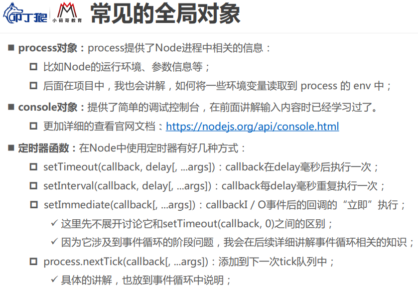
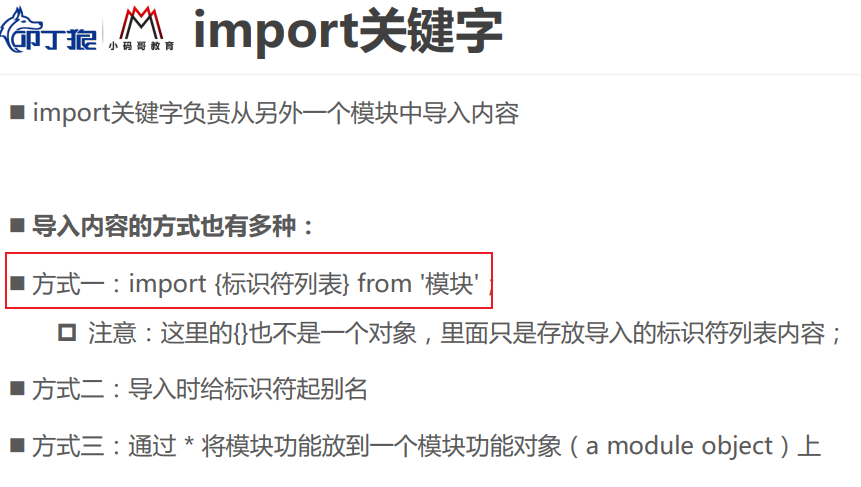
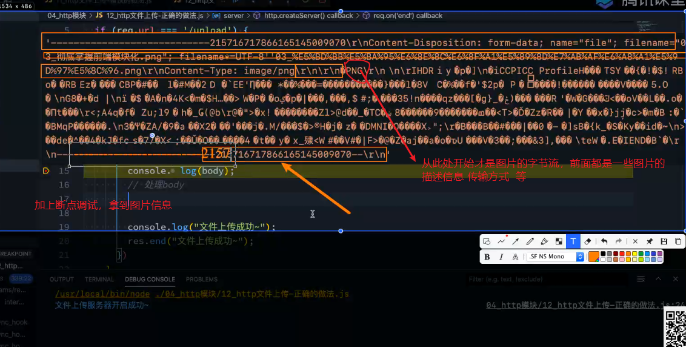
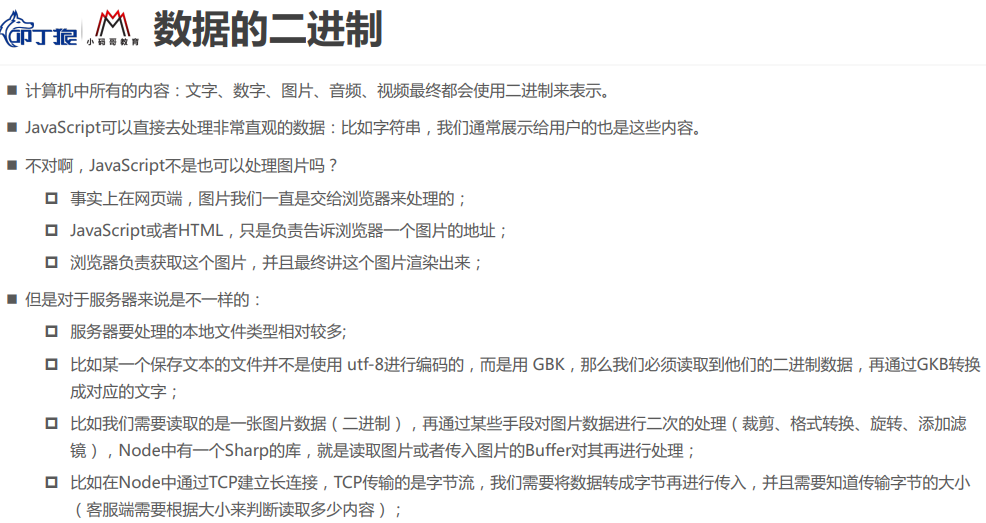
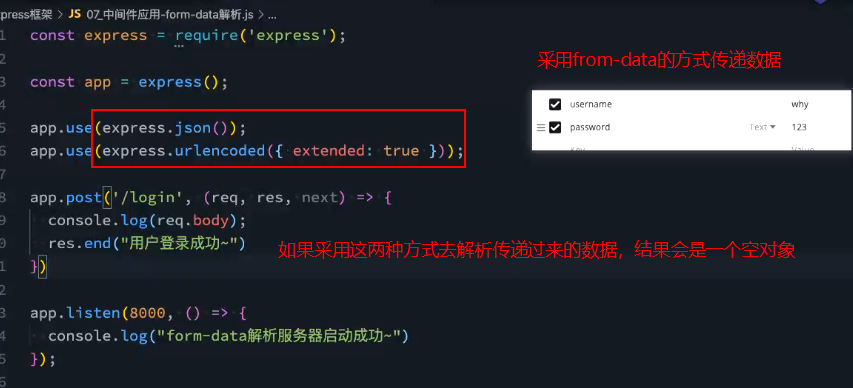
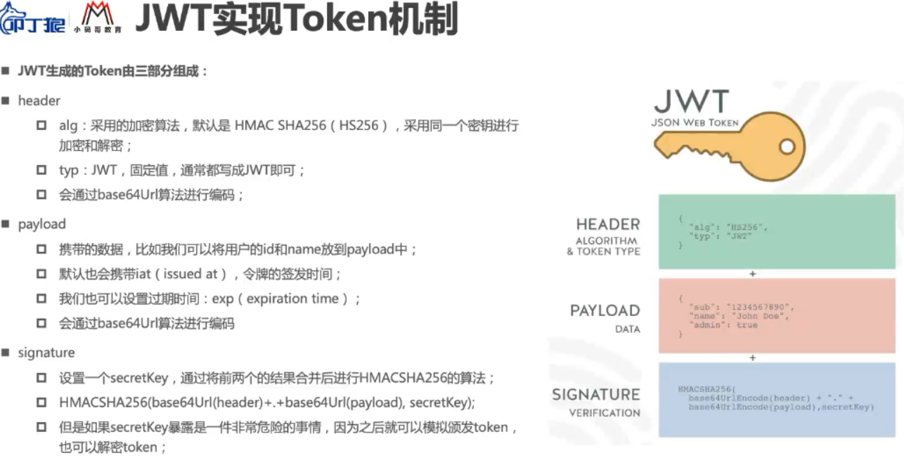

## 1.Node和REPL

**node并不是一门语言，它是一个工具或者环境**，**一个不是浏览器的浏览器**

#### 1.js的发展


#### 2.浏览器内核及工作的过程


#### 3.javascript引擎


#### 4.浏览器内核组成

​    **Browser = WebCore +JavaScriptCore**


#### 5.V8引擎


#### 6.node的本质


#### 7.node的版本管理工具

**nvm-Windows**

~~~javascript
nvm list  查看已经安装过的node版本
nvm list available 查看可用的版本
设置node 和npm 的淘宝镜像
nvm node_mirror https://npm.taobao.org/mirrors/node/ 
nvm npm_mirror https://npm.taobao.org/mirrors/npm/
nvm install latest  安装最新版本
nvm use 14.00  选择对应的版本
~~~


#### 8.node的REPL


#### 9.NODE做后台的优势和特点

 传统后台语言：JAVA/Python/PHP/C#(.NET)...
 =>单线程的： 一心一意
 =>基于V8引擎渲染：快
 =>异步无阻塞的I/O操作：I/O (INPUT/OUTPUT)  对文件的读写
 =>event-driven事件驱动：类似于发布订阅或者回调函数


 * JS运行在客户端浏览器中=>“前端”
 * 浏览器给JS提供可很多全局的属性和方法，例如：window.xxx（setInterval、setTimeout、eval、alert、JSON...）
 * JS运行在服务器端的NODE中=>“后台”
 * NODE也给JS提供很多的内置属性和方法，例如：http、fs、url、path...等对象中都提供很多API供JS操作
 * ===
 * 前端（浏览器运行JS）是限制I/O操作的
 * input type='file' 这种算是I/O操作，但是需要用户手动选择（而且还仅仅是一个读取不是写入）
 * NODE中运行JS是不需要限制I/O操作的

## 2.node的全局对象

#### 1.node程序传递参数


~~~js
console.log(process.argv)

PS D:\project\lianxi\node\process> node .\node参数传递.js name=qinaye age=23
[
  'D:\\Program Files\\nodejs\\node.exe',
  'D:\\project\\lianxi\\node\\process\\node参数传递.js',
  'name=qinaye',
  'age=23'
]
~~~


#### 2.常见的全局对象





#### 3.特殊的全局对象


## 3.javascript模块化

#### 1.什么是模块化


#### 2.CommonJS规范

 NODE本身是基于CommonJS模块规范设计的，所以模块是NODE的组成


案例：


#### 3.exports的本质


#### 4.module.exports的本质


 ```
   1.CommonJS规定，每一个JS都是一个单独的模块（模块是私有的：里面涉及的值和变量以及函数等都是私有的，和其它JS文件中的内容是不冲突的）
   2.CommonJS中可以允许模块中的方法互相的调用
     B模块中想要调取A模块中的方法
       =>A导出
       =>B导入
   [导出]
     CommonJS给每一个模块（每个JS）中都设置了内置的变量/属性/方法
       module：代表当前这个模块[object]
       module.exports：模块的这个“属性”是用来导出当前模块的属性和方法的 [object]
       exports：是内置的一个“变量”，也是用来导出当前模块属性方法的，虽然和module.exports不是一个东西，但是对应的值是同一个(module.exports=exports 值都是对象)
   [导入]
     require：CommonJS提供的内置变量，用来导入模块的（其实导入的就是module.exports暴露出来的东西）；导入的值也是[object]类型的；
 ```


    CommonJS特点：
     1. 所有代码都运行在模块作用域，不会污染全局作用域（每一个模块都是私有的，包括里面所有的东西也都是私有的，不会和其它模块产生干扰）
     
     2. 模块可以多次加载，但是只会在第一次加载时运行一次，然后运行结果就被缓存了，以后再加载，就直接读取缓存结果。要想让模块再次运行，必须清除缓存。（为了保证性能，减少模块代码重复执行的次数）
     
     3. 模块加载的顺序，按照其在代码中出现的顺序。CommonJS规范加载模块是同步的，也就是说，只有加载完成，才能执行后面的操作。

**提升案例**：

  A/B/C三个模块
    A中有一个sum方法：实现任意数求和
    B中有一个avg方法：实现任意数求平均（先求和再求平均：B中用到A）
    C中调取B中的avg，实现 12,23,34,45,56,67,78,89 求平均数


#### 5.require的规则和原理


#### 6.AMD规范


#### 7.CMD规范


#### 8.ES6里面的模块化





案例：


#### 9.node里面对es module 的支持


## 4.NPM模块管理


### 1.npm配置文件常见的属性


### 2.版本管理的问题


### 3.npm install 命令


### 4.npm 其他命令


### 5.其他的安装包管理工具


## 6.node中常见的内置模块

### 1.fs内置模块


#### 1.FS内置模块常用方法


##### 1.读取文件的状态信息 创建时间、 大小等


##### 2.文件描述符


##### 3.fs.mkdirSync  /  fs.mkdir 创建文件夹 


**总结：无阻塞io操作==异步   ， 事件驱动==回调函数**

##### 4.fs.readdir / fs.readdirSync 读取文件夹


**读取文件下所有文件**：

~~~JS
function reddirflie(dirname){
  fs.readdir(dirname,{withFileTypes: true},(err,files)=>{  //withFileTypes返回文件类型
    files.forEach(item=>{
      if (item.isDirectory()) {
        const fliepath=path.resolve(dirname,item.name)
        reddirflie(fliepath) //递归方式
      } else {
        console.log(item.name);
      }
    })
  })
}

reddirflie("./")
~~~


##### 6.fs.rmdir /fs.rmdirSync  删除文件夹

 但是当文件夹不为空的时候 删除不了 在Windows下会报错


7.fs.writeFile() 向文件中写入内容** ，并且会覆盖文件中已经存在的内容，如果文件不存在会先创建文件


##### 8.fs.appendFile() //向文件中追加内容


##### 9.fs.readFile() //读取文件中的内容


##### **10.fs.copyFile() //拷贝文件到新的位置**


##### **11.fs.unlink() //删除文件**


#### 2.基于promise封装文件操作库

将fs里面常见的文件操作的方法进行封装成自己的模块，可以直接在其他地方使用，按照参数的个数和是否有返回值进行整合，

使用的时候只需要传入文件的路径 等


~~~js
let fs = require('fs'),
    path = require('path');
//=>存储的是当前模块执行所在的绝对路径(!==__dirname)
let dirname = path.resolve();

//=>MKDIR && RMDIR && READ-DIR && READ-FILE && COPY-FILE
['mkdir', 'rmdir', 'readdir', 'readFile', 'copyFile', 'unlink'].forEach(item => {
    exports[item] = function (pathname, copypath = '') {
        pathname = path.resolve(dirname, pathname);
        copypath = path.resolve(dirname, copypath);
        return new Promise((resolve, reject) => {
            let arg = [(err, result) => {
                if (err) {
                    reject(err);
                    return;
                }
                resolve(result || '');
            }];
            item === 'readFile' ? arg.unshift('utf8') : null;
            item === 'copyFile' ? arg.unshift(copypath) : null;
            fs[item](pathname, ...arg);
        });
    };
});

//=>WRITE && APPEND
['writeFile', 'appendFile'].forEach(item => {
    exports[item] = function (pathname, content) {
        pathname = path.resolve(dirname, pathname);
        if (typeof content !== 'string') {
            //=>写入的内容我们规定必须是字符串才可以
            content = JSON.stringify(content);
        }
        return new Promise((resolve, reject) => {
            fs[item](pathname, content, 'utf8', (err, result) => {
                if (err) {
                    reject(err);
                    return;
                }
                resolve(result || '');
            });
        });
    };
});

//=>READ-DIR
// exports.readFile = function (pathname) {
//     pathname = path.resolve(dirname, pathname);
//     return new Promise((resolve, reject) => {
//         fs.readFile(pathname, 'utf8', (err, result) => {
//             if (err) {
//                 reject(err);
//                 return;
//             }
//             resolve(result);
//         });
//     });
// };
~~~

#### 3.利用封装好的文件操作库合并压缩多个文件到一个文件

**合并并且压缩CSS**

~~~js
let {readFile, readdir, writeFile} = require('./utils/fsPromise');

//1.先把所有的CSS文件读取出来
readdir('less').then(result => {
    return result.filter(item => /\.CSS$/i.test(item));
}).then(result => {
    let arg = [];
    result.forEach(item => {
        arg.push(readFile(`less/${item}`));//=>分别调取READ-FILE方法，读取捕捉到的CSS文件，向数组中依次增加读取各个文件的PROMISE实例
    });
    //arg=[promise1,promise2...]  Promise.all：等待数组中所有的PROMISE实例都执行成功才算成功
    return Promise.all(arg);
}).then(result => {
    //=>RESULT:一个数组，存放所有文件读取的内容
    result = result.join('');
    return result.replace(/( |\n|\r)/g, '');
}).then(result => {
    return writeFile('less/build.min.css', result);
}).then(() => {
    console.log('创建成功');
});
~~~

**合并并且压缩less**

~~~js
//less.config.js
//=>需要把CONFIG放到当前项目的根目录中
let path = require('path'),
    rootPath=_dirname
    //rootPath = path.resolve();
module.exports = {
    //=>需要编译的LESS文件
    entry: [
        `${rootPath}/less/index.less`,
        `${rootPath}/less/detail.less`
    ],
    output: [
        `${rootPath}/css/index.min.css`,
        `${rootPath}/css/detail.min.css`
    ]
};
//index.js
let path = require('path'),
    lessc = require('less'),
    rootPath = path.resolve();

let {readFile, writeFile} = require(`./utils/fsPromise`),
    {entry, output} = require(`./less.config`);

module.exports = {
        //=>分别读取ENTRY中对应的LESS文件中的代码
        entry.forEach((item, index) => {
            readFile(item).then(result => {
                //=>把读取的LESS代码进行编译:编译为CSS
                lessc.render(result, {compress: true}, (err, result) => {
                    if (err) {
                        console.log(err);
                        return;
                    }
                    writeFile(output[index], result.css);
                });
            });
        });
};
~~~

#### 4.基于promise封装一个读文件的操作

~~~js
let fs = require('fs'),
    path = require('path');
let readFile = function (pathName) {
    //=>一般都会把传递的PATH-NAME进行处理：以当前项目的根目录为依托，我们只需要传递相对于根目录的相对目录地址，程序自动生成一个绝对目录地址
    /*
     * __dirname：当前模块所在的绝对路径（和模块中的方法在哪执行是没有关系的）
     * path.resolve()：当前模块中方法在哪个模块中执行的，那么对应的绝对路径是执行模块的绝对路径
     */
    pathName = path.resolve(path.resolve(), pathName);
    return new Promise((resolve, reject) => {
        fs.readFile(pathName, 'UTF-8', (err, result) => {
            if (err) {
                reject(err);
                return;
            }
            resolve(result);
        });
    });
};
module.exports = {
    readFile
};
~~~

### 2.path内置模块


#### 1.path里面的基本方法


#### 2.path.join和path.resolve的区别


#### 3.path在webpack里面的应用


### 3.url内置模块

#### nodejs: url模块已过期，推荐使用URL类

~~~javascript
const port=8686;
http.createServer((req,res)=>{
    let query=new URL(req.url,"http://localhost:8686")
    console.log(query);
    console.log(query.searchParams.get('qianye'));
    console.log(req.url);
    res.end("ok")
}).listen(port,()=>{
    console.log('ok');
})


URL {
  href: 'http://localhost:8686/home?qianye=123',
  origin: 'http://localhost:8686',
  protocol: 'http:',
  username: '',
  password: '',
  host: 'localhost:8686',
  hostname: 'localhost',
  port: '8686',
  pathname: '/home',
  search: '?qianye=123',
  searchParams: URLSearchParams { 'qianye' => '123' },
  hash: ''
}

const port=8686;
http.createServer((req,res)=>{
    let query=new URL(req.url,"http://localhost:8686")
    // console.log(query);
    console.log(query.search);  //?qianye=123
    let params =new URLSearchParams(query.search)
    console.log(params.keys()); //qianye
    res.end("ok")
}).listen(port,()=>{
    console.log('ok');
})

const port=8686;
http.createServer((req,res)=>{
    let query=new URL(req.url,"http://localhost:8686")
    // console.log(query);
    console.log(query.search);//?qianye=123
    let params =new URLSearchParams(query.search)
    let key=params.keys()   ////qianye
    console.log(params.values(key)); //123
    res.end("ok")
}).listen(port,()=>{
    console.log('ok');
})


~~~

**url.parse(url[,flag])**：

把一个URL地址进行解析，把地址中的每一部分按照对象键值对的方式存储起来

~~~JS
let url=require('url')
console.log(url.parse('http://www.baidu.com?user=qianye'));
//***
Url {
  protocol: 'http:',
  slashes: true,
  auth: null,
  host: 'www.baidu.com',
  port: null,
  hostname: 'www.baidu.com',
  hash: null,
  search: '?user=qianye',
  query: 'user=qianye',
  pathname: '/',
  path: '/?user=qianye',
  href: 'http://www.baidu.com/?user=qianye'
}
~~~


~~~js
let url=require('url')
console.log(url.parse('http://www.baidu.com?user=qianye',true));
//=>第二个参数默认是FALSE，设置为TRUE可以把问号传参的部分也解析成为对象键值对的方式
~~~


### 4.http内置模块

#### 1.创建web服务


~~~js
//=>创建WEB服务
let port = 8686;
http.createServer(() => {
    //=>当服务创建成功，并且客户端向当前服务器发送了请求，才会执行回调函数，并且发送一次请求，回调函数就会被触发执行一次
    console.log(`hello world!`);
}).listen(port, () => {
    //=>当服务创建成功,并且端口号也已经监听成功后,触发的回调函数
    console.log(`server is success，listen on ${port}！`);
});

 ```
  注意：基于NODE创建后台程序，我们一般都创建一个server模块，在模块中实现创建WEB服务，
  和对于请求的处理（并且我们一般都会把server模块放到当前项目的根目录下）
 /*
 * 客户端如何向创建的服务器发送请求
 *   对应好协议、域名、端口等信息，在浏览器中或者AJAX等中发送请求即可
 *
 *   http://localhost:8686/...  服务在电脑上，localhost本机域名，也就是本机的客户端浏览器，访问本机的服务器端程序
 *
 *   http://IP:8686/...(http://192.168.0.23:8686/...)  IP做域名访问，如果是内网IP，
         相同局域网下的用户可以访问这个服务，如果是外网IP，所有能联网的基本上都
	     可以访问这个服务（局域网下访问，需要互相关掉防火墙）
 */
~~~

#### 2.创建服务器的方式


#### 3.请求对象request

~~~JS
let http=require('http')
let url = require('url')
//=>创建WEB服务
let port = 8686;
let handle = function handle(req, res) {
    //=>REQ:REQUEST 请求对象，包含了客户端请求的信息
    // req.url 存储的是请求资源的路径地址及问号传参  例如：/stu/index.html?name=xxx&age=12
    // req.method 客户端请求的方式  例如：GET
    // req.headers 客户端的请求头信息，它是一个对象
    // ...
    //=>把请求的URL地址中：路径名称 & 问号传参 分别解析出来
    // let {pathname, query} = url.parse(req.url, true);
    // console.log(pathname, query);

    //=>RES:RESPONSE 响应对象，包含了一些属性和方法，可以让服务器端返回给客户端内容
    // res.write 基于这个方法，服务器端可以向客户端返回内容
    // res.end 结束响应
    // res.writeHead 重写响应头信息 
    // ...
    res.writeHead(200, {
        'content-type': 'text/plain;charset=utf-8;' //设置响应信息的格式
    });
    res.end(JSON.stringify({name: '哈哈哈'}));//=>服务器端返回给客户端的内容一般都是 STRING或者BUFFER格式的数据
};
http.createServer(handle).listen(port, () => {
    console.log(`server is success，listen on ${port}！`);
});
~~~


#### 4.URL的解析


#### 5.method的处理


~~~javascript
get请求
const port=8686;
http.createServer((req,res)=>{
    let query=new URL(req.url,"http://localhost:8686")
    console.log(query);
    console.log(query.searchParams.get('qianye'));
    console.log(req.url);
    res.end("ok")
}).listen(port,()=>{
    console.log('ok');
})

//
URL {
  href: 'http://localhost:8686/home?qianye=123',
  origin: 'http://localhost:8686',
  protocol: 'http:',
  username: '',
  password: '',
  host: 'localhost:8686',
  hostname: 'localhost',
  port: '8686',
  pathname: '/home',
  search: '?qianye=123',
  searchParams: URLSearchParams { 'qianye' => '123' },
  hash: ''
}

const port=8686;
http.createServer((req,res)=>{
    let query=new URL(req.url,"http://localhost:8686")
    // console.log(query);
    console.log(query.search);  //?qianye=123
    let params =new URLSearchParams(query.search)
    console.log(params.keys()); //qianye
    res.end("ok")
}).listen(port,()=>{
    console.log('ok');
})

const port=8686;
http.createServer((req,res)=>{
    let query=new URL(req.url,"http://localhost:8686")
    // console.log(query);
    console.log(query.search);//?qianye=123
    let params =new URLSearchParams(query.search)
    let key=params.keys()   ////qianye
    console.log(params.values(key)); //123
    res.end("ok")
}).listen(port,()=>{
    console.log('ok');
})
~~~

~~~javascript
post请求
const http=require("http")
// console.log(http);
const port=8686;
http.createServer((req,res)=>{
    console.log(req);
   req.setEncoding('utf-8')
   req.on('data',(data)=>{
    const {name, password} = JSON.parse(data)
    console.log(name,password);   //qinaye 12345
   })
   req.on('end',()=>{
       console.log('over');
   })
    res.end("ok")
}).listen(port,()=>{
    console.log('ok');
})

~~~


#### 6.headers


#### 7.响应对象response


#### 8.http请求


#### 9.文件上传


提升：




### 5.events模块


## 7.buffer的使用.



### 1.buffer和二进制的关系


### 2.buffer的其他方法


### 3.buffer的创建过程及原理


## 8.事件循环

### 1.事件循环的本质


### 2.线程和进程的关系


### 3.javascript是单线程的


### 4.浏览器的事件循环


### 5.宏任务和微任务


面试题：


### 6.node的事件循环


面试题1：


面试题2：


## 9.Stream（流）


## 10.express框架


### 1.express安装


### 2.express的中间件


### 3.中间件的应用


普通中间件：


path中间件：


path和method匹配中间件：


连续注册多个中间件：


### 4.body解析


### 5.body-parse的使用


### 6.from-data的解析




### 7.multer处理文件上传


### 8.用Morgan保存express的日志信息


### 9.客户端发送请求的方式


### 10.服务端响应数据


### 11.express的路由（重点）


### 12.静态资源服务器


### 13.服务端的错误处理


### 14.express源码解析


## 11.koa框架


### 1.koa基本使用


### 2.koa注册中间件的方式


~~~JS
const Koa=require('koa')
const app=new Koa()
app.use((ctx,next)=>{
  if (ctx.request.path==='/login') {
    if (ctx.request.method==='GET') {
      ctx.response.body="yes"
    }
  } else {
   ctx.response.body="nonononono"
})
app.listen(3000,()=>{
  console.log('koa start succse');
})
~~~

### 3.koa中路由的使用


### 4.参数解析 params / query


### 5.参数解析：json/x-www-form-urlencoded


### 6.参数解析：form-data


### 7.Multer上传文件

~~~JavaScript
//main.js
const koa=require("koa")
const bodyParser=require('koa-bodyparser') //body参数解析
const multer=require('koa-multer') //form-data解析
const userRouter=require('./router/user') //路由
const uploadRouter=require('./router/upload')

const app=new koa()
//注册中间件
app.use(bodyParser())
app.use(uploadRouter.routes()) //文件上传 注意和multer.any()的冲突问题

app.use((ctx,next)=>{
    // console.log(ctx.request);
    let url=new URL(ctx.request.url,"http://"+`${ctx.request.host}`)
    // console.log(url);
    if(url.pathname==="/login"&&ctx.request.method==="GET"){
        console.log(ctx.request.url);
        console.log(ctx.request.path);
        console.log(ctx.request.query);
        console.log(ctx.request.params);
        ctx.response.body="ok"
    }
    else{
        ctx.response.body="no"
    }
    next()
})

app.use(multer().any()) //设置文件上传的格式
app.use(userRouter.allowedMethods())
app.use(userRouter.routes())
app.listen(8080,()=>{
    console.log("service start successful");
})

//upload.js
const Router=require('koa-router')
const multer=require('koa-multer')
const path=require('path')
const uploadRouter=new Router({prefix:'/upload'})
const storage=multer.diskStorage({
    destination:(req,file,cb)=>{
        cb(null,'./uploads/')
    },
    filename:(req,file,cb)=>{
        cb(null,Date.now()+path.extname(file.originalname))  //设置时间戳 path.extname 返回文件扩展名
    }
})
const upload=multer({
    // dest:'./uploads/'
    storage
})
uploadRouter.get('/',ctx=>{
    ctx.response.body="upload get method success ok"
})
uploadRouter.post('/',upload.single('file'),(ctx,next)=>{
    console.log(ctx.req);
    ctx.response.body="upload post method success ok"
})
module.exports=uploadRouter
~~~


### 8.koa里面数据的响应


### 9.静态服务器


### 10.错误处理


### 11.koa源码分析


### 12.koa和express的区别


### 13.koa洋葱模型


## 12.MySQL


### 1.安装

https://dev.mysql.com/downloads/mysql/


2.MySQL连接


### 2.SQL语句


### 3.数据库的操作（DDL）


~~~sql
-- //基本创建
 create database qianye;
 drop database qianye;

-- //约束创建 设置编码格式和排序规则
 CREATE DATABASE IF NOT EXISTS mini_goods;
 DROP DATABASE IF EXISTS mini_goods;

 CREATE DATABASE IF NOT EXISTS mini_goods DEFAULT CHARACTER SET utf8mb4 COLLATE utf8mb4_0900_ai_ci;

-- //修改字符集 和排序规则
ALTER DATABASE mini_goods CHARACTER SET=utf8 COLLATE=utf8_unicode_ci;
ALTER DATABASE mini_goods CHARACTER SET=utf8mb4 COLLATE=utf8mb4_0900_ai_ci;
~~~

### 4.数据表的操作（DML）


~~~sql
- //表操作 创建
-- USE mini_goods;
-- CREATE TABLE IF NOT EXISTS `goods_users` (
-- 	name VARCHAR(40)
-- );

-- CREATE TABLE IF NOT EXISTS `goods_list` (name VARCHAR(30),age INT,hieght DOUBLE);

-- //删除表
-- DROP TABLE IF EXISTS `goods_users`;

-- //修改表
~~~

### 5.SQL的数据类型

#### 1.数字类型


#### 2.日期类型


#### 3.字符串类型


### 6.表约束


### 7.创建一个完整的表

#### 1.创建


​	**根据一张表的结构去创建另外一张表**

~~~SQL
-- //复制一张表的结构创建一张新表
 CREATE TABLE `users` LIKE `goods_users`;
 
 CREATE TABLE `users1`  SELECT * FROM `goods_users`; //同时拷贝表的结构和内容
 
 INSERT INTO `users` SELECT * FROM `goods_users` WHERE id=6; 拷贝内容
-- INSERT INTO `users` SELECT * FROM `goods_users` WHERE id!=6;
-- INSERT INTO table2 ( name , price ) SELECT name , price  FROM table1  WHERE id=5
~~~

#### 2.修改


~~~sql

-- //表操作 创建
-- USE mini_goods;
-- CREATE TABLE IF NOT EXISTS `goods_users` (
-- 	name VARCHAR(40)
-- );

 CREATE TABLE IF NOT EXISTS `goods_users` (
 	id INT PRIMARY KEY AUTO_INCREMENT,
 	name VARCHAR(25) NOT NULL,
 	age INT DEFAULT 0,
 	phone VARCHAR(20) DEFAULT '' UNIQUE NOT NULL
 );

 CREATE TABLE IF NOT EXISTS `goods_list` (name VARCHAR(30),age INT,hieght DOUBLE);

-- //删除表
-- DROP TABLE IF EXISTS `goods_users`;
-- DROP TABLE IF EXISTS goods_list;
-- DROP TABLE IF EXISTS goods_users_copy,goods_users_copy_copy;

-- //复制一张表的结构创建一张新表
 CREATE TABLE `goods_users_copy` LIKE `goods_users`;
-- CREATE TABLE `goods_users_copy_copy` LIKE `goods_users_copy`;
 
-- //修改表名
 ALTER TABLE `goods_users` RENAME `users`;
-- ALTER TABLE `users` RENAME `goods_users`;

-- //向表中添加字段
 ALTER TABLE `goods_users` ADD `publishTime` DATETIME ;
-- ALTER TABLE `goods_users` ADD `updateTime` DATETIME;
-- ALTER TABLE `goods_users` ADD `sex` INT DEFAULT 0;
-- ALTER TABLE `goods_users` ADD `addr` VARCHAR(30); 

-- //删除一列数据
 ALTER TABLE `goods_users` DROP `sex`; 

-- //修改列数据类型
 ALTER TABLE `goods_users` MODIFY `addr` INT;
-- ALTER TABLE `goods_users` MODIFY `addr` VARCHAR(40);

-- //修改列名称
 ALTER TABLE `goods_users` CHANGE `addr` `nickname` VARCHAR(25);

-- //插入数据
INSERT INTO `goods_users` (`id`,`name`,`age`,`phone`,`publishTime`,`updateTime`,`nickname`)  VALUES(4,"qinaye",26,"18XXXXXXX","2021-10-24","2021-10-24","fgdcyy");

~~~

#### 3.插入数据（DML）


#### 4.删除和更新


~~~SQL
#修改字段类型 时间自动插入
-- ALTER TABLE `goods_users` MODIFY `publishTime` TIMESTAMP DEFAULT CURRENT_TIMESTAMP; //自动插入当前时间
-- ALTER TABLE `goods_users` MODIFY  `updateTime` TIMESTAMP DEFAULT CURRENT_TIMESTAMP ON UPDATE CURRENT_TIMESTAMP; //数据更新时自动插入当前时间
#删除数据
-- DELETE FROM `goods_users` WHERE id=4; 删除ID=4
-- DELETE FROM `goods_users`; 删除所有记录

-- INSERT INTO `goods_users` (name,age,phone) VALUES('qinaye',26,'123xxxxxxx');
-- INSERT INTO `goods_users` (name,age,phone) VALUES('qinaye0',26,'123xxxxxx1');
-- INSERT INTO `goods_users` (name,age,phone) VALUES('qinaye1',26,'123xxxxxx2');
-- INSERT INTO `goods_users` (name,age,phone) VALUES('qinaye2',26,'123xxxxxx3');
-- INSERT INTO `goods_users` (name,age,phone) VALUES('qinaye3',26,'123xxxxxx4');

#修改 更新数据
-- UPDATE `goods_users` SET `nickname`='FGDCYY';
-- UPDATE `goods_users` SET `nickname`='FGDCYY' WHERE NAME!='qianye';
~~~

### 8.数据的查询一  单表操作（DQL）


#### 1.基本查询


#### 2.where查询条件


#### 3.查询结果排序


~~~sql
-- //3.单表查询
 CREATE TABLE IF NOT EXISTS `products` (
 	id INT PRIMARY KEY  AUTO_INCREMENT,
 	brand VARCHAR(20),
 	title VARCHAR(100) NOT NULL,
 	price DOUBLE NOT NULL,
 	score DECIMAL(2,1),
 	voteCnt INT,
 	url VARCHAR(100),
 	pid INT
 );
-- CREATE TABLE `goods_products` SELECT * FROM `products`;


#查询所有
 SELECT * FROM `products`;
#查询选中字段
 SELECT brand,title,price ,url,pid FROM `products` where id>=100;
#取别名
 SELECT brand as 品牌,title as 配置 , price as 价格 FROM `products` WHERE price>=4000;

#查询结果排序
#按照价格升序
 SELECT brand,title,price,url FROM `products` where price>2000 && price<5000 ORDER BY price ASC; 
#按照价格升序
 SELECT brand,title,price FROM `products` WHERE price BETWEEN 2000 AND 6000  ORDER BY price DESC;
~~~

#### 4.分页查询


~~~sql
#分页查询 LIMIT 查询的数据条数  OFFSET 偏移量 从哪个位置（索引）开始查询
SELECT * FROM `products` LIMIT 40 OFFSET 0;
SELECT * FROM `products` LIMIT 40 OFFSET 40;
SELECT * FROM `products` LIMIT 40 OFFSET 80;
~~~


#### 5.聚合函数


~~~sql
#聚合函数  对查询到的结果进行处理  例如 平均 求和 最大 最小 统计个数 去除重复
SELECT COUNT(DISTINCT price) FROM `products` WHERE brand='vivo';

SELECT AVG(price) FROM `products` WHERE brand='vivo';
 
SELECT MAX(price) FROM `products` WHERE brand='vivo';

SELECT MIN(price) FROM `products` WHERE brand='vivo';

SELECT SUM(price) FROM `products` WHERE brand='vivo';

~~~

#### 6.分组查询


~~~sql
#分组查询 按需求进行分类 并删选
SELECT brand,COUNT(*), SUM(price),ROUND(AVG(price),4),MAX(price),MIN(price) FROM `products` GROUP BY brand;

SELECT brand,COUNT(*),SUM(price),ROUND(AVG(price),2) AS avgPrice,SUM(price),MIN(price),ROUND(AVG(score),2) AS avgScore FROM `products` GROUP BY brand HAVING avgScore>6 && avgPrice>1000;
~~~


### 9.数据的查询二  多表操作


#### 1.创建外键


~~~SQL
-- #创建外键
 ALTER TABLE `products` ADD brand_id INT;  //需要先添加一个字段 在设置为外键
 ALTER TABLE `products` ADD FOREIGN key (brand_id) REFERENCES brand(id);


 UPDATE `products` SET `brand_id`=1 WHERE `brand`='华为';
 UPDATE `products` SET `brand_id`=2 WHERE `brand`='小米';
 UPDATE `products` SET `brand_id`=3 WHERE `brand`='苹果';
 UPDATE `products` SET `brand_id`=4 WHERE `brand`='oppo';
~~~

#### 2.外键存在时更新和删除数据


~~~sql
 UPDATE `brand` SET id=100 WHERE id=1; 
-- Cannot delete or update a parent row: a foreign key constraint fails (`mini_goods`.`products`, CONSTRAINT `products_ibfk_1` FOREIGN KEY (`brand_id`) REFERENCES `brand` (`id`))
-- 
 SHOW CREATE TABLE `products`;  反编译 查看建表信息
 如果要使得修改数据时外键关联的部分一起更新 需要设置外键 更新和删除时的状态值
~~~

#### 3.什么是多表查询


~~~sql
#多表查询 的默认值
SELECT * FROM `products`,`brand`; 此时会得到108*8（笛卡尔乘积） 条记录
SELECT  * FROM `products`,`brand` WHERE `products`.brand_id=`brand`.id;
~~~


#### 4.多表之间的连接 SQL JOIN


#### 5.左连接


#### 6.右连接


#### 7.内连接


#### 8.全连接


~~~sql
5.  sql joins 操作 
#多表查询 的默认值
 SELECT * FROM `products`,`brand`; 此时会得到108*8（笛卡尔乘积） 条记录
 SELECT  * FROM `products`,`brand` WHERE `products`.brand_id=`brand`.id;

#左连接
 SELECT * FROM `products` LEFT JOIN `brand` ON `products`.brand_id=`brand`.id;
 SELECT * FROM `products` LEFT JOIN `brand` ON `products`.brand_id=`brand`.id WHERE brand.id IS NOT NULL;
 SELECT * FROM `products` LEFT JOIN `brand` ON `products`.brand_id=`brand`.id WHERE brand.id IS  NULL;

#右连接
SELECT * FROM `products` RIGHT JOIN `brand` ON `products`.brand_id=`brand`.id;
SELECT * FROM `products` RIGHT JOIN `brand` ON `products`.brand_id=`brand`.id WHERE products.id IS NULL;
SELECT * FROM `products` RIGHT JOIN `brand` ON `products`.brand_id=`brand`.id WHERE products.id IS NOT NULL;

#内连接 
 SELECT * FROM `products` INNER JOIN `brand` ON `products`.brand_id=`brand`.id;


#全连接 相当于左连接和右连接的结合
 (SELECT * FROM `products` LEFT JOIN `brand` ON `products`.brand_id=`brand`.id) UNION (SELECT * FROM `products` RIGHT JOIN `brand` ON `products`.brand_id=`brand`.id);

 (SELECT * FROM `products` LEFT JOIN `brand` ON `products`.brand_id=`brand`.id WHERE brand.id IS NULL) UNION (SELECT * FROM `products` RIGHT JOIN `brand` ON `products`.brand_id=`brand`.id WHERE products.id IS NULL);

~~~

### 10.数据的查询三  多表操作  多对多


#### 1.查询多对多数据


~~~sql
-- //6.多表操作 多对多的关系
#准备数据
-- CREATE TABLE IF NOT EXISTS `students` (
-- 	id INT PRIMARY KEY AUTO_INCREMENT,
-- 	name VARCHAR(20) NOT NULL,
-- 	age INT
-- );
-- 
-- CREATE TABLE IF NOT EXISTS `courses` (
-- 	id INT PRIMARY KEY AUTO_INCREMENT,
-- 	name VARCHAR(20) NOT NULL,
-- 	price DOUBLE NOT NULL
-- );


-- INSERT INTO `students` (name,age) VALUES('why',18);
-- INSERT INTO `students` (name,age) VALUES('tom',22);
-- INSERT INTO `students` (name,age) VALUES('lilei',25);
-- INSERT INTO `students` (name,age) VALUES('lucy',16);
-- INSERT INTO `students` (name,age) VALUES('lily',20);
-- 
-- INSERT INTO `courses` (name,price) VALUES('英语',100);
-- INSERT INTO `courses` (name,price) VALUES('语文',666);
-- INSERT INTO `courses` (name,price) VALUES('数学',888);
-- INSERT INTO `courses` (name,price) VALUES('历史',80);

#设计关系表 
-- CREATE TABLE IF NOT EXISTS `students_select_courses` (
-- 	id INT PRIMARY KEY AUTO_INCREMENT,
-- 	student_id INT NOT NULL,
-- 	course_id INT NOT NULL,
-- 	FOREIGN KEY (student_id) REFERENCES students(id) ON UPDATE CASCADE,
-- 	FOREIGN KEY (course_id) REFERENCES courses(id) ON  UPDATE CASCADE
-- );


# 准备学生选课数据
-- INSERT INTO `students_select_courses` (student_id,course_id) VALUES(1,1);
-- INSERT INTO `students_select_courses` (student_id,course_id) VALUES(1,3);
-- INSERT INTO `students_select_courses` (student_id,course_id) VALUES(3,2);
-- INSERT INTO `students_select_courses` (student_id,course_id) VALUES(3,3);
-- INSERT INTO `students_select_courses` (student_id,course_id) VALUES(3,4);

#查询所有学生选的所有课程(内连接)
 
-- SELECT students.id ,students.name,courses.id,courses.name,courses.price 
-- FROM `students` 
-- JOIN `students_select_courses` ON students.id=students_select_courses.student_id 
-- JOIN `courses` ON students_select_courses.course_id=courses.id;
-- 


#查询所有的学生的选课情况（左连接）
-- SELECT students.id ,students.name,courses.id,courses.name,courses.price 
-- FROM `students` 
-- LEFT JOIN `students_select_courses` ON students.id=students_select_courses.student_id 
-- LEFT JOIN `courses` ON students_select_courses.course_id=courses.id;
-- 

#查询某个学生选了哪些课程
-- SELECT students.id ,students.name,courses.id,courses.name,courses.price 
-- FROM `students` 
-- LEFT JOIN `students_select_courses` ON students.id=students_select_courses.student_id 
-- LEFT JOIN `courses` ON students_select_courses.course_id=courses.id WHERE students.id=5;
-- 
-- 
-- SELECT students.id ,students.name,courses.id,courses.name,courses.price 
-- FROM `students` 
-- JOIN `students_select_courses` ON students.id=students_select_courses.student_id 
-- JOIN `courses` ON students_select_courses.course_id=courses.id WHERE students.id=5;

#查询哪些学生没有选课
 SELECT students.id ,students.name,courses.id,courses.name,courses.price 
 FROM `students` 
 LEFT JOIN `students_select_courses` ON students.id=students_select_courses.student_id 
 LEFT JOIN `courses` ON students_select_courses.course_id=courses.id WHERE courses.id IS NULL;

#查询哪些课程没有被选
 INSERT INTO `courses` (name,price) VALUES('政治',66);
 SELECT students.id ,students.name,courses.id,courses.name,courses.price 
 FROM `students` 
 RIGHT JOIN `students_select_courses` ON students.id=students_select_courses.student_id 
 RIGHT JOIN `courses` ON students_select_courses.course_id=courses.id WHERE students.id IS NULL;

 DELETE FROM `courses` WHERE name='政治';
~~~

### 11.将数据转成对象


~~~sql
-- //7.将数据转成对象 JSON_OBJECT()
-- SELECT products.id AS id,products.title AS title,products.price AS price,products.score AS score,
-- JSON_OBJECT('id',brand.id,'name',brand.name,'rank',brand.worldRank,'website',brand.website) as brand
-- FROM `products`
-- LEFT JOIN `brand` ON products.brand_id=brand.id;
-- 
-- SELECT products.id AS id,products.title AS title,products.price AS price,products.score AS score,
-- JSON_OBJECT('id',brand.id,'name',brand.name,'rank',brand.worldRank,'website',brand.website) as brand
-- FROM `products`
-- LEFT JOIN `brand` ON products.brand_id=brand.id WHERE brand.id IS NOT NULL ORDER BY id DESC;


#多对多转换成数组 JSON_ARRAYAGG

	SELECT students.id,students.name,students.age,
	JSON_ARRAYAGG(JSON_OBJECT('id',courses.id,'name',courses.name)) as courses
FROM `students`
LEFT JOIN `students_select_courses` ON students.id=students_select_courses.student_id
LEFT JOIN `courses` ON students_select_courses.course_id=courses.id  GROUP BY id;

-- 	SELECT students.id,students.name,students.age,
-- 	JSON_ARRAYAGG(JSON_OBJECT('id',courses.id,'name',courses.name)) as courses
-- FROM `students`
-- LEFT JOIN `students_select_courses` ON students.id=students_select_courses.student_id
-- LEFT JOIN `courses` ON students_select_courses.course_id=courses.id WHERE courses.id IS NOT NULL GROUP BY id;
-- 
~~~


### 12.node中操作MySQL


#### 1.MySQL2基本使用


~~~js
const mysql=require('mysql2')
const connection=mysql.createConnection({
    host:'localhost',
    port:3306,
    database:'mini_goods',
    user:'root',
    password:'qianye520@'
})
connection.query('SELECT * FROM products;',(err,result,fields)=>{
    // console.log(err);
    // console.log(result);
    // console.log(fields);
    connection.destroy()
})
~~~

#### 2.预编译语句


~~~js
const statement='SELECT *FROM students WHERE id>?'
connection.execute(statement,[1],(err,result)=>{
    console.log(result);
})
~~~

#### 3.连接池


#### 4.ORM的使用


#### 5.Sequelize


~~~js
const {Sequelize,DataTypes,Model,Op}=require('sequelize')
const sequelize=new Sequelize('mini_goods','root','qianye520@',{
    host:'localhost',
    dialect:'mysql'
})

sequelize.authenticate().then(result=>{
    console.log('ok');
}).catch(err=>{
    console.log(err);
})

class students extends Model{}
students.init({
    id:{
        type:DataTypes.INTEGER,
        primaryKey:true,
        autoIncrement:true
    },
    name:{
        type:DataTypes.STRING,
        allowNull:false
    },
    age:{
        type:DataTypes.INTEGER
    }
},{
    tableName:'students',
    sequelize,
    createdAt:false,
    updatedAt:false
})

//读取数据是异步操作
// async function studentsAll(){  
//     const result=await students.findAll({
//        where:{
//         age:{
//             [Op.gte]:20
//         }
//        }
//     })
//     console.log(result);
// }

// studentsAll();

// students.findAll().then(result=>{
//     console.log(result);
// }).catch(err=>{
//     console.log(err);
// })

// students.findAll({
//     where:{
//         age:{
//             [Op.gte]:25
//         }
//     }
// }).then(result=>{
//     console.log(result);
// }).catch(err=>{
//     console.log(err);
// })

// students.create({
//     name:'fgdcyy',
//     age:26
// }).then(reslut=>{
//     console.log('ok');
// }).catch(err=>{
//     console.log(err);
// })

// students.destroy({
//     where:{
//         id:{
//             [Op.gte]:6
//         }
//     }
// }).then(()=>{
//     console.log("ok");
// }).catch(err=>{
//     console.log(err);
// })


students.update({name:'qianye'},{
    where:{
        name:'fgdcyy'
    }
}).then(()=>{
    console.log('ok');
}).catch(err=>{
    console.log(err);
})
~~~


**一对多关系映射**:


~~~js
const {Sequelize,Model,DataTypes,Op}=require('sequelize')

const sequelize=new Sequelize('mini_goods','root','qianye520@',{
    host:'localhost',
    dialect:'mysql'
})

sequelize.authenticate().then(()=>{
    console.log('ok');
}).catch(err=>{
    console.log(err);
})

class products extends Model{}
class brand extends Model{}
brand.init({
    id:{
        type:DataTypes.INTEGER,
        primaryKey:true,
        autoIncrement:true
    },
    name:{
        type:DataTypes.INTEGER,
        allowNotNull:false
    },
    website:DataTypes.STRING,
    worldRank:DataTypes.INTEGER
},{
    tableName:'brand',
    createdAt:false,
    updatedAt:false,
    sequelize
})


products.init({
    id:{
        type:DataTypes.INTEGER,
        primaryKey:true,
        autoIncrement:true
    },
    title:{
        type:DataTypes.STRING,
        allowNotNull:false
    },
    price:DataTypes.DOUBLE,
    score:DataTypes.DOUBLE,
    brandId:{
        field:'brand_id',
        type:DataTypes.INTEGER,
        references:{
            model:brand,
            key:'id'
        }
    }
},{
    tableName:'products',
    createdAt:false,
    updatedAt:false,
    sequelize
})


//建立多表之间的关系
products.belongsTo(brand,{
    foreignKey:'brandId'
})

products.findAll({
    include:{
        model:brand
    }
}).then(result=>{
    console.log(result);
}).catch(err=>{
    console.log(err);
})

~~~

**多对多关系映射**：


~~~js
const {Sequelize,Model,DataTypes,Op}=require('sequelize')
const sequelize=new Sequelize('mini_goods','root','qianye520@',{
    host:'localhost',
    dialect:'mysql'
})
sequelize.authenticate().then(()=>{
    console.log('ok');
}).catch(err=>{
    console.log(err);
})


class students extends Model{} //学生表
students.init({
    id:{
        type:DataTypes.INTEGER,
        primaryKey:true,
        autoIncrement:true
    },
    name:{
        type:DataTypes.STRING,
        allowNotNull:false
    },
    age:{
        type:DataTypes.INTEGER
    }
},{
    tableName:'students',
    sequelize,
    createdAt:false,
    updatedAt:false
})


class courses extends Model{} //课程表
courses.init({
    id:{
        type:DataTypes.INTEGER,
        primaryKey:true,
        autoIncrement:true
    },
    name:{
        type:DataTypes.STRING,
        allowNotNull:false
    },
    price:DataTypes.DOUBLE
},{
    tableName:'courses',
    createdAt:false,
    updatedAt:false,
    sequelize
})

//创建关系表
class studentsSelectCourses extends Model{}
studentsSelectCourses.init({
    id:{
        type:DataTypes.INTEGER,
        primaryKey:true,
        autoIncrement:true
    },
    studentId:{
        field:'student_id',
        type:DataTypes.INTEGER,
        references:{
            model:students,
            key:'id'
        }
    },
    courseId:{
        field:'course_id',
        type:DataTypes.INTEGER,
        references:{
            model:courses,
            key:'id'
        }
    }
},{
    tableName:'students_select_courses',
    createdAt:false,
    updatedAt:false,
    sequelize
})

//建立 students 和courses之间的关系
students.belongsToMany(courses,{
    through:studentsSelectCourses,
    foreignKey:'studentId',
    otherKey:'courseId'
})

courses.belongsToMany(students,{
    through:studentsSelectCourses,
    foreignKey:'courseId',
    otherKey:'studentId'
})

students.findAll({
    include:{
        model:courses
    }
}).then(result=>{
    console.log(result);
}).catch(err=>{
    console.log(err);
})
~~~


## node周啸天版

### 6.创建静态资源服务器

~~~JS
  服务器上有一堆项目代码，这堆项目代码中既可能有服务器端的程序代码，也有可能有客户端的程序代码，
  而客户端程序代码我们一般都放到static这个文件夹中

  ```
    static
      都是服务器端需要返回给客户端，由客户端浏览器渲染和解析的（前端项目：包括页面、CSS、JS、图片等）

    server.js
      都是需要在服务器端基于NODE执行的（后端项目：一般只有JS）
  ```
  我们创建的WEB服务需要处理两类请求：
     1.静态资源文件的请求处理：想要文件 要注意返回的文件对应的内容的格式
     2.API接口的请求处理：想要数据

     区别：第一类请求的地址中有后缀名，第二类没有后缀
~~~

**基础应用**：

~~~JS
let http=require('http')
let url = require('url')
let {readFile} =require('./utils/fsUtils')

let port=8090
let handel=function (req,res){
 //=>客户端请求资源文件(PATH-NAME)，服务器端都是到STATIC文件夹中进行读取，
 //也是根据客户端请求的路径名称读取的，服务器端基于FS读取文件中内容的时候，直接加上“./static”即可
 let {method,headers:reqheader}=req
 let {pathname,query}=url.parse(req.url,true) //pathname=/qianye.html
 readFile(`./static${pathname}`).then((result) => {
    //读取成功，返回对应的内容
    res.writeHead(200)
    res.end(result)
  }).catch((err) => {
    //读取失败，返回错误信息，大多数情况下是文件找不到,也就是客户端输入的地址栏有误
    res.writeHead(404,{'content-type':'text/plain;charset=utf-8'})
    res.end('not found file')
  });
}
~~~


**解决图片不能显示的问题**：原因是在读取文件的时候，对所有的内容格式设置了“utf-8”，而图片、视频、音频这类文件是不需要设置的


**浏览器兼容性处理**：

~~~js
let http=require('http')
let url = require('url')
let {readFile} =require('./utils/fsUtils')
let mime=require('mime') //获取文件对应的扩展名

let port=8090
let handel=function (req,res){
 //=>客户端请求资源文件(PATH-NAME)，服务器端都是到STATIC文件夹中进行读取，
 //也是根据客户端请求的路径名称读取的，服务器端基于FS读取文件中内容的时候，直接加上“./static”即可
 let {method,headers:reqheader}=req
 let {pathname,query}=url.parse(req.url,true) //pathname=/qianye.html
 let pathREG=/\.([a-z0-9]+)$/i

 //客户端请求静态资源文件时的处理，也就是请求的方式是带文件后缀名的
 if(pathREG.test(pathname)){
  readFile(`./static${pathname}`).then((result) => {
    //=>读取成功：根据请求资源文件的类型，设置响应内容的MIME 不同的文件对应的内容类型
    // console.log(result);
    let suffix=pathREG.exec(pathname)[1]  //获取文件的扩展名
    res.writeHead(200,{  //ie 下必须设置返回的内容格式
      'content-type': `${mime.getType(suffix)};charset=utf-8;`
    })
    res.end(result)
  }).catch((err) => {
    //读取失败，返回错误信息，大多数情况下是文件找不到,也就是客户端输入的地址栏有误
    res.writeHead(404,{'content-type':'text/plain;charset=utf-8'})
    res.end('not found file')
  });
     return
 }    
}
http.createServer(handel).listen(port,()=>{
  console.log(`server is successful,lisen on ${port}`);
})
~~~


### 7.创建动态资源服务（API请求）

静态资源处理主要是返回对应的文件资源，图片，音视频等。。。动态资源处理，就是API接口的处理，返回对应的数据，如数据库里面的用户信息。。。

#### 1.API接口的请求处理(get 获取指定用户信息)

**基本结构**：


#### 2.API接口的请求处理(POST请求处理)

**服务端**：

~~~js
let http = require('http'),
    url = require('url'),
    path = require('path'),
    fs = require('fs');
let {readFile, writeFile} = require('./utils/fsPromise'),
    mime = require('mime'),
    qs = require('qs');

//=>公共方法
let responseResult = function responseResult(res, returnVal) {
    res.writeHead(200, {
        'content-type': 'application/json;charset=utf-8;'
    });
    res.end(JSON.stringify(returnVal));
};

let readUSER = function readUSER() {
    return readFile(`./json/USER.JSON`).then(result => {
        return JSON.parse(result);
    });
};

let readVOTE = function readVOTE() {
    return readFile(`./json/VOTE.JSON`).then(result => {
        return JSON.parse(result);
    });
};

//=>创建WEB服务
let port = 8686;
let handle = function handle(req, res) {
    //=>客户端请求资源文件(PATH-NAME)，服务器端都是到STATIC文件夹中进行读取，
	//也是根据客户端请求的路径名称读取的，服务器端基于FS读取文件中内容的时候，直接加上“./static”即可
    let {method, headers: requestHeaders} = req,
        {pathname, query} = url.parse(req.url, true),
        pathREG = /\.([a-z0-9]+)$/i;

    //=>静态资源文件处理
    if (pathREG.test(pathname)) {
        readFile(`./static${pathname}`).then(result => {
            //=>读取成功：根据请求资源文件的类型，设置响应内容的MIME
            let suffix = pathREG.exec(pathname)[1];
            res.writeHead(200, {
                'content-type': `${mime.getType(suffix)};charset=utf-8;`
            });
            res.end(result);
        }).catch(error => {
            //=>读取失败:最可能由于文件不存在而读取失败(也就是客户端请求的地址是错误的 ,我们应该响应的内容是404)
            res.writeHead(404, {'content-type': 'text/plain;charset=utf-8;'});
            res.end('NOT FOUND!');
        });
        return;
    }

    //=>API接口请求处理 动态资源处理

    //=>GET-USER:根据传递的用户ID获取指定用户的信息
    if (pathname === '/getUser' && method === 'GET') {
        //=>问号传递的信息都在QUERY中存储着
        let {userId = 0} = query,
            returnVal = {code: 1, message: 'no!', data: null};//设置默认返回信息
        readUSER().then(result => {
            let data = result.find(item => parseFloat(item['id']) === parseFloat(userId));
            if (data) {
                returnVal = {code: 0, message: 'ok', data:data};
                responseResult(res, returnVal);
                return;
            }
            throw new Error('');//=>目的是没有数据的时候,让其执行CATCH中的操作,这样我们只需要让THEN方法
			                    //中有异常信息即可,就会执行catch里面的操作
        }).catch(error => responseResult(res, returnVal));

        /*readUSER().then(result => {
            let data = result.find(item => parseFloat(item['id']) === parseFloat(userId));
            data ? returnVal = {code: 0, message: 'ok', data} : null;
        }).finally(result => {  //promise里面提供的方法除了then catch 还有final 不管成功还是失败都会执行这个方法
            //=>暂时NODE版本不支持FINALLY
            responseResult(res, returnVal);
        });*/
        return;
    }

    //=>REGIDTER:注册用户
    if (pathname === '/register' && method === 'POST') {
        //=>接收客户端请求主体传递的内容
        let pass = ``;
        req.on('data', chunk => {
            //=>正在接收请求主体内容,可能会被触发执行很多次,chunk获取的都是本次接收的BUFFER格式的数据
            pass += chunk;
        });
        req.on('end', () => {
            //=>已经把请求主体内容接收完成了  PASS是一个URLENCODED格式字符串，我们需要把它解析为对象
            pass = qs.parse(pass);
            readUSER().then(result => {
                //=>FORMAT-PASS
                let maxId = result.length <= 0 ? 0 : parseFloat(result[result.length - 1]['id']);
                pass.password = pass.password.substr(4, 24).split('').reverse().join('');
                let newData = {
                    id: maxId + 1,
                    name: '',
                    picture: `img/${pass.sex != 0 ? `woman` : `man`}.png`,
                    phone: '',
                    sex: 0,
                    password: '',
                    bio: '',
                    time: new Date().getTime(),
                    isMatch: 0,
                    matchId: '000',
                    slogan: '',
                    voteNum: 0,
                    ...pass
                };

                //=>把NEW-DATA追加到RESULT末尾,把最新的结果重新写入到文件
                result.push(newData);
                return writeFile('./json/USER.JSON', result);
            }).then(result => {
                responseResult(res, {
                    code: 0,
                    message: 'ok'
                });
            }).catch(error => {
                responseResult(res, {
                    code: 1,
                    message: 'no'
                });
            });
        });
        return;
    }
    //=>请求的都不是以上API接口,直接404即可
    res.writeHead(404);
    res.end('');
};
http.createServer(handle).listen(port, () => {
    console.log(`server is success，listen on ${port}！`);
});
~~~

**客户端**：

~~~js
<script src="js/axios.min.js"></script>
<script src="js/md5.min.js"></script>
<script>
    axios.defaults.baseURL = 'http://localhost:8686';
    axios.interceptors.response.use(result => result.data);//=>增加响应拦截器,在所有AXIOS请求成功后,把获取的结果中DATA单独返回(DATA就是服务器返回的JSON数据)
    axios.defaults.transformRequest = data => {
        //=>基于这个请求拦截器可以把POST和PUT等传递给服务器的请求主体内容进行格式化处理，DATA就是配置的请求主体对象
        let str = ``;
        if (data && typeof data === 'object') {
            for (let key in data) {
                if (data.hasOwnProperty(key)) {
                    str += `${key}=${data[key]}&`;
                }
            }
            data = str.substring(0, str.length - 1);
        }
        return data;
    };

    axios.get('/getUser', {
        params: {
            //=>GET请求问号传参：设置到PARAMS中即可
            userId: 1
        }
    }).then(result => {
        console.log(result);
    });

    // axios.post('/register', {
    //     //=>请求主体中需要传递给服务器的内容
    // }, {
    //     //=>CONFIG配置信息:例如可以设置请求头等信息
    // })

    //=>AXIOS默认基于请求主体传递给服务器的是RAW格式的:'{"name":"xxx"...}'，真实项目中我们和服务器约定的传输格式应该是X-WWW-URL-ENCODEED:"name=xxx&..."
    axios.post('/register', {
        //=>请求主体中需要传递给服务器的内容
        name: '测试',
        password: hex_md5('000000'),//=>密码需要经过MD5加密(不可逆转的加密)
        phone: '11111111111',
        sex: 0,
        bio: 'xxxxxxxxx'
    }).then(result => {
        console.log(result);
    });
</script>
~~~

### 8.JS中的同步异步（宏任务和微任务）

#### 1. JS中的同步异步编程

~~~JS
```
浏览器是多线程的，JS是单线程的（浏览器只分配一个线程来执行JS）
进程大线程小：一个进程中包含多个线程，例如在浏览器中打开一个HTML页面就占用了一个进程，
      加载页面的时候，浏览器分配一个线程去计算DOM树，分配其它的线程去加载对应的资源文件...
      再分配一个线程去自上而下执行JS

同步：在一个线程上（主栈/主任务队列）同一个时间只能做一件事情，当前事情完成才能进行下一个
        事情（先把一个任务进栈执行，执行完成，在把下一个任务进栈，上一个任务出栈...）

异步：在主栈中执行一个任务，但是发现这个任务是一个异步的操作，我们会把它移除主栈，
        放到等待任务队列中（此时浏览器会分配其它线程监听异步任务是否到达指定的执行时间）,
	如果主栈执行完成，监听者会把到达时间的异步任务重新放到主栈中执行...
    [宏任务：macro task]
        - 定时器
        - 事件绑定
        - ajax
        - 回调函数
        - Node中fs可以进行异步的I/O操作

    [微任务：micro task]
        - Promise(async/await)  =>promise本身是同步的 管理异步的操作 Promise并不是完全的同步，
	  当在Excutor（回调函数）中执行resolve或者reject的时候，此时是异步操作，会先执行then/catch等，当主栈完成后，
	  才会再去调用resolve/reject把存放的方法执行
        - process.nextTick

    执行顺序优先级：SYNC => MICRO => MACRO

  所有JS中的异步编程仅仅是根据某些机制来管控任务的执行顺序，不存在同时执行两个任务这一说法
 ```
~~~


~~~~js
//=>AJAX任务开始：SEND
//=>AJAX任务结束：状态为4

/*
let xhr = new XMLHttpRequest();
xhr.open('GET', 'xxx.txt', false);
/!*放到等待区的时候，此时状态是1*!/
xhr.onreadystatechange = () => {
    console.log(xhr.readyState);//=>4
};
xhr.send();
/!*状态为4的时候主栈空闲*!/*/

// let xhr = new XMLHttpRequest();
// xhr.open('GET', 'xxx.txt', false);
// xhr.send();
// /*状态已经为4了*/
// xhr.onreadystatechange = () => {
	//=>状态改变才会触发,放到等待区的时候状态已经为4了，不会在改变了，所以不会执行这个方法（啥都不会输出）
//     console.log(xhr.readyState);
// };

 let xhr = new XMLHttpRequest();
 xhr.open('GET', 'xxx.txt');
 xhr.send();//=>异步操作：执行SEND后，有一个线程是去请求数据，主栈会空闲下来
 /*放等待区之前状态是1*/
 xhr.onreadystatechange = () => {
     console.log(xhr.readyState);//=> 2 3 4
 };
 /*主栈又空闲了*/
 //状态为2  把函数执行
 //状态为3  把函数执行
 //状态为4  把函数执行
~~~~

#### 2.Promise里面的同步异步

~~~js
//1.基础的promise 有异步操作
console.log(1);
new Promise((resolve, reject) => {
    //=>new Promise的时候会立即把Excutor函数（也就是传递的回调函数）执行，所以Promise本身可以理解为是同步的
    console.log(2);
    setTimeout(() => {
        resolve();//=>Promise内部机制：执行resolve会把之前基于then存放的方法执行
    }, 10);
}).then(() => {
  //=>执行完成Excutor，紧接着执行then，执行then方法，会把传递的回调函数放到指定的容器中，等待触发执行（Promise内部的机制）
    console.log(3);
});
console.log(4);   //1 2 4 3

//2.基础的promise 没有异步操作
console.log(1);
new Promise((resolve, reject) => {
    console.log(2);
    resolve();
}).then(() => {
    console.log(3);
});
console.log(4);  // 1 2 4 3 
//如果按照promise是完全同步的话，先执行完resolve后再执行.then 此时应该输出的是 1 2 4 而是实际上 .then里面的方法也被执行了，
//所以promise内部本身有异步管控   resolve（）是一个异步操作 会先执行then/catch等，当主栈完成后，才会再去调用resolve存放的方法
~~~

#### 3.Promise里面的(async/await)

~~~JS
//=>ES7中新增加对Promise操作的新语法：async/await（使用await必须保证当前方法是基于async修饰的）
function AA() {
    return new Promise((resolve, reject) => {
        setTimeout(() => {
            Math.random() < 0.5 ? reject(100) : resolve(200);
        }, 0);
    });
}
async function fn() {
    let res = await AA();
    //=>先把AA执行，等待AA中的PROMISE完成(不论成功和失败)，把最后的处理结果获取到赋值给RES，拿到后在执行后面的代码（有人说：AWAIT把是异步的操作同步化？）
}

//验证 AWAIT把是异步的操作同步化
function AA() {
    console.log(1);
    return new Promise((resolve, reject) => {
        setTimeout(() => {
            resolve(200);
        }, 0);
    });
}
async function fn() {
    console.log(2);
    let res = await AA();
    /*
     * 1.先把AA执行,返回一个PROMISE实例
     * 2.它会暂时跳出当前正在执行的函数(FN)：也就是AWAIT后面的代码暂时先不执行（把后面的代码从主栈中移除，放到等待区域中）
     * 3.主栈暂时空闲
     * 4.当主栈中的其它任务完成（主栈空闲），并且AA中的PROMISE也已经计算完成最后的结果，在把之前第二步移到等待区域的内容，
         重新拿回到主栈中执行
     */
    console.log(3);
}
fn();
console.log(4); //=> 2 1 4 3  =>AWAIT并不是同步 如果是同步应该输出 2 1 3 4
~~~

**提升**：

~~~JS
async function async1(){
    console.log('async1 start');
    await async2();
    console.log('async1 end');
}
async function async2(){
    console.log('async2');
}
console.log('script start');
setTimeout(function(){
     console.log('setTimeout');
 },0);
async1();
new Promise(function(resolve){
    console.log('promise1');
    resolve();
}).then(function(){
    console.log('promise2');
});
console.log('script end');
//=> 'script start'   'async1 start'  'async2'  'promise1'  'script end' ('promise2'或者'async1 end' 顺序根据不同的V8版本，是不一样的) 'setTimeout'
~~~

## 项目

### 1.基本配置

#### 1.功能说明及项目搭建


**快速启动**：


#### 2.配置环境变量 dotenv

1.

2.

3.

#### 3.接口管理


##### postman设置token 环境变量

~~~
var response = pm.response.json();
if(pm.response.code == 200 && response.code === 0) {
    var token = response.token;
    pm.environment.set("token", token);
    console.log(pm.environment.get("token"));
}
~~~

### 2.业务操作

#### 1.用户注册接口

~~~js
代码逻辑分离
//index.js
const Koa=require('koa')
const userRouter=require('../router/user.touter')
const app=new Koa()
app.use(userRouter.routes())
module.exports=app

//user.touter.js
const Router = require('koa-router')
const Ruter=require('koa-router')
const {creatUser}=require('../controller/user.controller')

const userRouter=new Router({prefix:'/user'})
//业务逻辑 可以单独抽离 userRoutet.get('/',业务逻辑代码)
// userRouter.get('/',ctx=>{
//     console.log('user method');
//     ctx.response.body="user method"
// })
userRouter.post('/',creatUser)
module.exports=userRouter

//user.controller.js
//业务逻辑 抽离到此处 userRoutet.get('/',业务逻辑代码)
class userController{
    async creatUser(ctx,next){
        console.log('creatUser');
        ctx.response.body='creatUser method'
    }
}

module.exports=new userController()
~~~

##### 创建用户表

~~~sql
//创建数据库
CREATE DATABASE IF NOT EXISTS `code_community` DEFAULT CHARACTER SET utf8mb4 COLLATE utf8mb4_0900_ai_ci;

 CREATE TABLE IF NOT EXISTS `users`(
 	id INT PRIMARY KEY AUTO_INCREMENT,
 	name VARCHAR(20) NOT NULL UNIQUE,
 	password VARCHAR(50) NOT NULL,
 	createAt TIMESTAMP DEFAULT CURRENT_TIMESTAMP,
 	updateAt TIMESTAMP DEFAULT CURRENT_TIMESTAMP ON UPDATE CURRENT_TIMESTAMP
 );
~~~

##### 逻辑 业务抽离


##### 密码加密 MD5

~~~js
//node内置模块 crypto
const crypto=require('crypto');
 const md5password=(passsword)=>{
    const md5=crypto.createHash('md5'); //设置加密方式
    const result=md5.update(passsword).digest('hex') //加密 并返回加密后的字符串 默认buff 可以设置 hex base64 base64url
    return result
}

module.exports={
    md5password
}

//调用方法
const handlPassword=async (ctx,next)=>{  //密码加密处理
    let {password}=ctx.request.body
    ctx.request.body.password=md5password(password)
    await next();
}

//路由匹配中间件
userRouter.post('/',verifyUser,handlPassword,creatUser)
~~~

#### 2.用户登录

##### 登录结构搭建

~~~js
//login.router.js
const Router=require('koa-router')
const {login}=require('../controller/login.controller')
const loginRouter=new Router()
loginRouter.post('/login',login);
module.exports=loginRouter


//login.controller.js
class loginController {
    async login(ctx,next){
        const {name}=ctx.request.body;

        ctx.body="登录成功。。"
    }
}
module.exports=new loginController()


//index.js
const Koa=require('koa')
const bodyRarser=require('koa-bodyparser')
const userRouter=require('../router/user.router')
const loginRouter=require('../router/login.router')
const errHandle=require('./err_handle')
const app=new Koa()
app.use(bodyRarser())
app.use(userRouter.routes())
app.use(loginRouter.routes())
app.on('error',errHandle)
module.exports=app
~~~

##### 登录验证

~~~js
//验证用户登录信息
const errType=require('../constans/err_type')
const {getUserByName}=require('../model/user.model')
const md5password=require('../utils/password_handle')

const verifyLogin=async (ctx,next)=>{
    //获取用户名和密码
    const {name,password}=ctx.request.body
    //判断用户名和密码不能为空
    if(!name || !password) {
        const err=new Error(errType.NAME_OR_PASSWORD_NOT_NULL)
        return ctx.app.emit('error',err,ctx)
    }

    //判断用户是否存在
    const result=await getUserByName(name);
    // console.log(result);
    if(!result){
        const err=new Error(errType.USER_NOT_PRESENCE)
        return ctx.app.emit('error',err,ctx)
    }
    //判断密码是否正确
    if(md5password(password)!==result[0].password){
        const err=new Error(errType.PASSWORD_INPUT_ERROR)
        return ctx.app.emit('error',err,ctx)
    }
    await next()
} 
module.exports=verifyLogin
~~~


##### 补充：动态注册路由

~~~js
//../router/index.js
//自动读取当前文件夹下的文件 动态注册路由
const fs=require('fs')
const useRouters=(app)=>{
    fs.readdirSync(__dirname).forEach(item=>{
        if(item=='index.js') return;
        const router=require(`./${item}`);
        app.use(router.routes());
        app.use(router.allowedMethods())
    })
}


module.exports=useRouters


//index.js
const Koa=require('koa')
const bodyRarser=require('koa-bodyparser')
const useRouters=require('../router/index')
const errHandle=require('./err_handle')

const app=new Koa()
app.use(bodyRarser())
useRouters(app)
app.on('error',errHandle)
module.exports=app
~~~


##### 登录凭证


~~~js
//常见的登录凭证有两种

1.cookie +session

2.token令牌
~~~

##### cookie


1.客户端设置cookie

~~~html
<!DOCTYPE html>
<html lang="en">
<head>
    <meta charset="UTF-8">
    <meta http-equiv="X-UA-Compatible" content="IE=edge">
    <meta name="viewport" content="width=device-width, initial-scale=1.0">
    <title>Document</title>
</head>
<body>
    <script>
        document.cookie='name=qianye;max-age=10;'
    </script>
</body>
</html>
~~~


2.服务器端设置cookie

~~~js
const Router=require('koa-router')
const cookieRouter=new Router()
cookieRouter.get('/cookie',(ctx,next)=>{
    ctx.body='hello cookie'
    ctx.cookies.set("name","1325",{
        maxAge:3*1000  //毫秒
    })
})
module.exports=cookieRouter
~~~


##### session 

**session是基于cookie的**

~~~js
const Router=require('koa-router')
const Session=require('koa-session')  //安装session插件

function sesRouter(app) {
    const sessionRouter=new Router()
    const session=Session({  //配置信息
        key:'sessionid',
        maxAge:5*1000,
        signed:false  //是否使用加密签名  默认是TRUE
    },app)
    app.use(session)
    sessionRouter.get('/session',(ctx,next)=>{
        let id=12,name='qianye';
        ctx.session.user={id,name} //设置session
        ctx.body='hello session'
        // next();
    })
    app.use(sessionRouter.routes())
    app.use(sessionRouter.allowedMethods())
}
module.exports=sesRouter
~~~


##### token


##### Jwt生成token机制





**通过**openssl生成公钥和私钥

~~~js
$ openssl
OpenSSL> genrsa -out private.key 1024
Generating RSA private key, 1024 bit long modulus (2 primes)
...........+++++
..............+++++
e is 65537 (0x010001)
OpenSSL> rsa -in private.key -pubout -out public.key
writing RSA key
OpenSSL>
~~~


~~~js
//用户登录 生成token签名 操作
const jwt=require('jsonwebtoken')
const {PRIVATE_KEY}=require('../app/config')//通过private——key加密 public-key解密 只有当前系统有颁发签名的权限

class loginController {
    async login(ctx,next){
        // console.log(ctx.user);
        const {id,name}=ctx.user
        const token=jwt.sign({id,name},PRIVATE_KEY,{  
            expiresIn:60*60*24, //设置过期时间
            algorithm:'RS256' //设置加密算法
        })
        
        ctx.body={id,name,token}
        // await next()
    }

    async loginSuccess(ctx,next){
        ctx.body=`登录成功,欢迎回来。。`
    }
}

module.exports=new loginController()


 //验证授权 token
const verifyAuth = async (ctx,next)=>{
    // console.log(ctx);
    //获取用户的token
    const authorization = ctx.headers.authorization
    const token=authorization.replace('Bearer ','') //去除authorization 前面自带的Bearer 字符串 一定要注意空格

    //验证token
    //使用try 是因为jwt验证不通过会报错 抛出异常
   try {  
    const result=jwt.verify(token, PUBLIC_KEY, {
        algorithms: ["RS256"]
    });
    //  console.log(result);
     await next()
   } catch (err) {
       console.log(err);
       const error=new Error(errType.SUER_AUTHORIZATION_FAIL)
       ctx.app.emit('error',error,ctx)
   }
}


loginRouter.get('/test',verifyAuth,loginSuccess);//验证签名
~~~

##### 补充：fs 的相对路径问题

~~~js
当通过fs读取文件是  相对路径本质上 不是相对于当目录 而是相对于项目启动的位置 这个位置可以通过process.cwd() 方法获取到

//自动读取当前文件夹下的文件 动态注册路由
const fs=require('fs')

const useRouters=(app)=>{
    fs.readdirSync(__dirname).forEach(item=>{
        // console.log(item);
        if(item=='index.js') return;
        const router=require(`./${item}`);
        app.use(router.routes());
        app.use(router.allowedMethods())
    })
}

module.exports=useRouters
~~~


#### 3.内容管理

##### 动态发布和获取

~~~sql
创建动态信息表
 CREATE TABLE IF NOT EXISTS `moment` (
 	id INT PRIMARY key AUTO_INCREMENT,
 	content VARCHAR(1000) NOT NULL,
 	user_id INT NOT NULL,
 	createAt TIMESTAMP DEFAULT CURRENT_TIMESTAMP,
 	updateAt TIMESTAMP DEFAULT  CURRENT_TIMESTAMP ON UPDATE CURRENT_TIMESTAMP,
 	FOREIGN KEY(user_id) REFERENCES users(id)  #外键约束 记录是哪一个用户 发表的动态
 );
~~~

~~~js
//路由
const Router=require('koa-router')
const {verifyAuth}=require('../middleware/login.middleware')
const {createMoment,getDtail}=require('../controller/moment.controller')
const momentRouter=new Router({prefix:'/moment'})

momentRouter.post('/',verifyAuth,createMoment)  //发表动态
momentRouter.get('/:momentId',getDtail)  //获取单条动态信息
module.exports=momentRouter

//用户动态发表 中间件
const {createMomentDate,getContentDtail}=require('../model/moment.modul')
class moment {
    async createMoment(ctx,next){ //发表动态
        //获取用户传递的数据
        const userId=ctx.user.id;
        const content=ctx.request.body.content;
        //将数据存储到数据库中
        const result=await createMomentDate(content,userId)
        ctx.body=result
    }
    async getDtail(ctx,next){  //获取单条动态信息
        const momentId=ctx.params.momentId
        // console.log(momentId);
        const result=await getContentDtail(momentId)
        ctx.body=result
    }
}
module.exports=new moment()


//信息存储和读取
const connection=require('../app/database')
class momentModel {
    async createMomentDate(content,userId) {   //存储发表动态信息到数据库
        const statement=`INSERT INTO moment (content,user_id) VALUES(?,?);`;
        const [result]=await connection.execute(statement,[content,userId])
        return result
    }
    async getContentDtail(id){    //读取单条动态信息
        const statement= `
            SELECT moment.id,moment.content,moment.createAt,moment.updateAt,
            JSON_OBJECT('id',users.id,'name',users.name) user
            FROM moment
            LEFT JOIN users ON moment.user_id=users.id
            WHERE moment.id=?;
        `;
        const [result]=await connection.execute(statement,[id]);
        return result[0]
    }
}
module.exports=new momentModel()
~~~


##### 查询当前用户的所有动态 并进行分页

~~~js

momentRouter.get('/',verifyAuth,getUserList)  //获取当前用户的所有动态


  async getUserList(ctx,next){
        const userId=ctx.user.id;
        const {offset,size}=ctx.query
        const result=await getUserContentList(userId,offset,size)
        ctx.body=result
    }

   async getUserContentList(id,offset,size){
        const statement=`
            SELECT moment.id,moment.content,moment.createAt,moment.updateAt,
            JSON_OBJECT('id',users.id,'name',users.name) user
            FROM moment
            LEFT JOIN users ON moment.user_id=users.id
            WHERE moment.user_id=?
            LIMIT ? OFFSET ?;
        `;
        const [result]=await connection.execute(statement,[id,size,offset]);
        return result
    }

~~~

##### 查询所有用户的所有动态 并进行分页

~~~js

momentRouter.get('/',getAllList)  //获取所有用户的所有动态 首页展示用

async getAllList(ctx,next){
        const {offset,size}=ctx.query
        const result=await getAllContentList(offset,size)
        ctx.body=result
    }

    async getAllContentList(offset,size){
        const statement=`
        SELECT moment.id,moment.content,moment.createAt,moment.updateAt,
        JSON_OBJECT('id',users.id,'name',users.name) user
        FROM moment
        LEFT JOIN users ON moment.user_id=users.id
        LIMIT ? OFFSET ?;
        `;
        const [result]=await connection.execute(statement,[size,offset]);
        return result
    }
~~~

##### 动态修改 权限问题

~~~js
momentRouter.patch('/:momentId',verifyAuth,verifyPermissions,update) 
//修改动态的内容  要进行登录检测 =>是否具备对内容修改的权限=>修改内容
1
const verifyPermissions=async(ctx,next)=>{ //权限验证 对对应的内容是否具有操作的权限
    //获取参数
    const momentId=ctx.params.momentId
    const userId=ctx.user.id

    //查询是否具备权限
  try {
    const isPermission=await permissionQuery.checkMoment(momentId,userId)
    if(!isPermission) throw new Error()
    await next()
  } catch (err) {
    const error=new Error(errType.NOT_PERMISSION)
    return ctx.app.emit('error',error,ctx)
  }
}


2
const connection = require('../app/database')
class permissionQuery { //id=要修改的内容时 并且user_id=userid  说明具有对当前内容的修改权限
    async checkMoment(momentId,userId){
        const statement=`SELECT * FROM moment WHERE id=? AND user_id=?;`
        const [result]=await connection.execute(statement,[momentId,userId])
        // console.log(result);
        if (!result.length) {
            return false
        } 
        return true
    }
}

module.exports=new permissionQuery()


3
 async update(ctx,next){
        const momentId=ctx.params.momentId
        const {content}=ctx.request.body

        const result =await updateContent(momentId,content)


        ctx.body=result
    }

4
  async updateContent(momentId,content){
        const statement=`UPDATE moment SET content=? WHERE id=?;`;
        const [result]=await connection.execute(statement,[content,momentId])
        return result
    }
}
~~~


##### 动态删除 权限问题

~~~js

momentRouter.delete('/:momentId',verifyAuth,verifyPermissions,remove) 
//删除动态的内容  要进行登录检测 =>是否具备对内容修改的权限=>删除内容

    async remove(ctx,next){
     const momentId=ctx.params.momentId
     const result=await deleteContent(momentId)
     ctx.body=result
    }


    async deleteContent(momentId){
        const statement=`DELETE FROM moment WHERE id=?;`;
        const [result]=await connection.execute(statement,[momentId])
        return result 
    }
~~~


#### 4.内容评论管理


##### 创建评论内容表

~~~sql
 CREATE TABLE IF NOT EXISTS `comment` (
 	id INT PRIMARY KEY AUTO_INCREMENT,   
     
 	content VARCHAR(500) NOT NULL,    评论的内容
 	moment_id INT NOT NULL,           记录是对哪条动态进行评论
 	user_id INT NOT NULL,             是谁发表的评论
 	comment_id INT NOT NULL,          记录是否是对评论的评论  comment_id=null 
                                       说明是对动态的评论 comment_id！=null 说明是对评论的评论
 	createAt TIMESTAMP DEFAULT CURRENT_TIMESTAMP,   
 	updateAt TIMESTAMP DEFAULT CURRENT_TIMESTAMP ON UPDATE CURRENT_TIMESTAMP,
 	FOREIGN KEY (moment_id) REFERENCES moment(id) ON DELETE CASCADE ON UPDATE CASCADE,
 	FOREIGN KEY (user_id) REFERENCES users(id) ON DELETE CASCADE ON UPDATE CASCADE,
 	FOREIGN KEY (comment_id) REFERENCES comment(id) ON DELETE CASCADE ON UPDATE CASCADE
 );
~~~

~~~js
const Router=require('koa-router')
const {publishComment}=require('../controller/comment.controller')
const {verifyAuth}=require('../middleware/login.middleware') //登录校验 

const commentRouter=new Router({prefix:'/comment'})
commentRouter.post('/',verifyAuth,publishComment)
module.exports=commentRouter


//publishComment
const {createComment}=require('../model/comment.modul')
class comment {
    async publishComment(ctx,next){
        //评论要知道 用户的ID（谁评论的） 评论的动态的ID（评论的哪条动态） content 评论内容
        const userId=ctx.user.id;
        const {momentId,content}=ctx.request.body;
        const result=await createComment(content,momentId,userId)

        ctx.body=result
    }
}
module.exports=new comment()


//createComment
const connection=require('../app/database')
class commentModul {
  async createComment (content,momentId,userId) {
      const statement=`INSERT INTO comment (content,moment_id,user_id) VALUES(?,?,?);`;
      const [result]=await connection.execute(statement,[content,momentId,userId])
      return result
  }
}
module.exports=new commentModul()
~~~

##### 回复评论

~~~js
commentRouter.post('/:commentId/reply',verifyAuth,replyComment)

   async replyComment(ctx,next){
        const userId=ctx.user.id;
        const {momentId,content}=ctx.request.body;
        const {commentId}=ctx.params; //记录是对哪一条评论的回复
        const result=await reply(content,momentId,userId,commentId)
        ctx.body=result
    }

  async reply(content,momentId,userId,commentId){
    const statement=`INSERT INTO comment (content,moment_id,user_id,comment_id) VALUES(?,?,?,?)`
    const [result]=await connection.execute(statement,[content,momentId,userId,commentId])
    return result
  }
~~~

##### 修改评论 权限问题

~~~js
commentRouter.patch('/:commentId',verifyAuth,verifyPermissions,updateComment)

const verifyPermissions=async(ctx,next)=>{ //权限验证 对对应的内容是否具有操作的权限
    //获取参数
    const [key]=Object.keys(ctx.params) //从对象里面拿到所有key 返回的一个数组
    const tableName=key.replace('Id','') //从传递过来的对象名称 判断要操作的数据表的名字
    const id=ctx.params[key]
    const userId=ctx.user.id;
    //查询是否具备权限
  try {
    const isPermission=await permissionQuery.checkDate(tableName,id,userId)
    if(!isPermission) throw new Error()
    await next()
  } catch (err) {
    console.log(err);
    const error=new Error(errType.NOT_PERMISSION)
    return ctx.app.emit('error',error,ctx)
  }
}
const connection = require('../app/database')


class permissionQuery {
      //对函数进行进一步封装 提高复用性 
      //tableName 要查询的表的名字 
      //id 要查询的内容 评论 标签 。。。的ID
      //userId 用户的ID 权限校验 实际上就是查看用户是不是这个内容的所有者
      async checkDate(tableName,id,userId){
        const statement=`SELECT * FROM ${tableName} WHERE id=? AND user_id=?;`
        const [result]=await connection.execute(statement,[id,userId]) //如果能查到对应的内容 代表当前内容的所有者就是该用户 返回TRUE
        if (!result.length) {  
            return false
        } 
        return true
    }
}

module.exports=new permissionQuery()


   async updateComment(ctx,next){
        const {commentId}=ctx.params;
        const {content}=ctx.request.body;
        // const result=;
        const result=await update(commentId,content)
        ctx.body=result
    }

  async update(commentId,content){
    const statement=`UPDATE  comment SET content=? WHERE id=?;`
    const [result]=await connection.execute(statement,[content,commentId])
    return result
  }
~~~

##### 删除评论 权限问题

~~~js
commentRouter.delete('/:commentId',verifyAuth,verifyPermissions,deleteComment)


 async deleteComment(ctx,next){
        const {commentId}=ctx.params;
        // const result=;
        const result=await remove(commentId)
        ctx.body=result
    }

 async remove(commentId){
    const statement=`DELETE FROM comment WHERE id=?;`
    const [result]=await connection.execute(statement,[commentId])
    return result
  }
~~~

#### 5.内容标签管理

##### 查看动态时一同返回查看评论的条数

~~~js

momentRouter.get('/',getAllList)  //获取所有用户的所有动态 及评论 首页展示用


 async getAllList(ctx,next){
        const {offset,size}=ctx.query
        const result=await getAllContentList(offset,size)
        ctx.body=result
    }

    async getAllContentList(offset,size){ //展示所有动态及对应的评论
        const statement=`
        SELECT moment.id,moment.content,moment.createAt,moment.updateAt,
        JSON_OBJECT('id',users.id,'name',users.name) user,
		(SELECT COUNT(*) FROM comment WHERE comment.moment_id=moment.id ) commentCount  //子查询 返回评论条数
        FROM moment
        LEFT JOIN users ON moment.user_id=users.id
        LIMIT ? OFFSET ?;
        `;
        const [result]=await connection.execute(statement,[size,offset]);
        return result
    }
~~~


##### 获取评论的列表


方案一：**获取动态接口与获取评论接口分开**（SQL简单）

1.

~~~js
//获取某一条动态的评论
commentRouter.get('/',getDtailMomentComment)

   async getDtailMomentComment(ctx,next){
        const {momentId}=ctx.query
        const result=await getDtailList(momentId)
        ctx.body=result
    }

  async getDtailList(momentId){
    const statement=`SELECT comment.id,comment.content,comment.comment_id commentId,
 JSON_OBJECT('id',users.id,'name',users.name) user,
 comment.createAt,comment.updateAt
FROM comment 
LEFT JOIN users ON users.id=comment.user_id
WHERE comment.moment_id=?;`;
    
    const [result]=await connection.execute(statement,[momentId])
   
    return result
  }
~~~


方案二：获取动态同时获取评论（SQL复杂）

2.

~~~js
 momentRouter.get('/:momentId',getDtail) //获取单条动态 及评论 

    async getDtail(ctx,next){
        const momentId=ctx.params.momentId
        // console.log(momentId);
        const result=await getContentDtail(momentId)
        ctx.body=result
    }


async getContentDtail(id){ //获取单条动态及评论信息
        const statement= `
        SELECT moment.id,moment.content,moment.createAt,moment.updateAt,
        JSON_OBJECT('id',users.id,'name',users.name) user,
        JSON_ARRAYAGG(JSON_OBJECT('id',comment.id,'content',comment.content,'user',comment.user_id,'createTim',comment.createAt,'updateTim',comment.updateAt)) comments
        FROM moment
        LEFT JOIN users ON moment.user_id=users.id
        LEFT JOIN comment ON comment.moment_id=moment.id
        WHERE moment.id=?;
        `;
        const [result]=await connection.execute(statement,[id]);
        return result
    }
~~~


**进一步提升**:**将评论里面的**user**显示为对象** {id :, name: }

**多对多查询**

~~~js
    async getContentDtail(id){ //获取单条动态及评论信息
        const statement= `
        SELECT moment.id,moment.content,moment.createAt,moment.updateAt,
        JSON_OBJECT('id',users.id,'name',users.name) user,
        JSON_ARRAYAGG(JSON_OBJECT('id',comment.id,'content',comment.content,'user',JSON_OBJECT('id',u.id,'name',u.name),'createTim',comment.createAt,'updateTim',comment.updateAt)) comments
        FROM moment
        LEFT JOIN users ON moment.user_id=users.id
        LEFT JOIN comment ON comment.moment_id=moment.id
        LEFT JOIN users u ON  comment.user_id=u.id
        WHERE moment.id=?;
        `;
        const [result]=await connection.execute(statement,[id]);
        return result
    }
~~~


