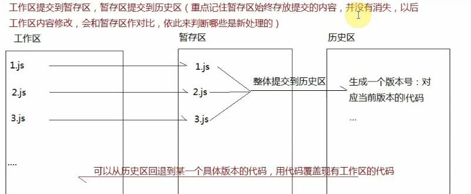

# gitHub

https://github.com/ 一个提供代码管理（托管）的公共平台，我们以及众多开发者，会把自己的生产的 组件/类库/插件/框架 等托管到这个平台中，供别人下载使用和研究在gitHub中，我们可以创建仓库来管理自己的项目文件，而gitHub支持开发者通过git操作，把本地的项目代码推送到指定的仓库中，它还提供静态web页面的发布等。

在国内有一个和gitHub类似的网站：coding，和gitHub类似，也是提供代码管理的平台。

## 1.git的基础知识

git是一个分布式代码版本管理控制系统记录当前产品代码的所有版本信息（历史修改信息）,而且方便快速回退到某一个具体的版本方便团队协作开发，能够检测代码冲突，能够合并代码等。

Git下载地址：<https://git-scm.com/downloads> 


`svn`：在git诞生前就已经存在的版本控制系统，不过它是“集中式”管理
`git`：是分布式版本管理体统

​	

## 2.git的工作管理和基础操作

**`在本地创建git仓库管理我们的代码`**

> 初次使用git，先在本地配置一些基础信息
> \$ git config -l
> \$ git config --global user.name  xxx
> \$ git config --global user.email  xxx
> 建议大家配置的用户名和邮箱和gitHub保持一致（这样以后在本地向gitHub推送内容的时候，能够展示出是谁推荐的）

1. `git init`

> 会在当前目录中创建一个空的仓库，文件目录中生成一个 “.git” 的隐藏文件，这个文件很重要，我们本地仓库的版本信息等都存储在这里

  2.`.gitignore`

> 在当前目录（git仓库根目录）创建一个 “.gitignore” 文件，这个文件中存储了当git提交的时候所忽略的文件
>
> 可以基于linux命令 `$ touch .gitignore` （mac终端、git bash、或者集成了linux的dos，可以使用linux命令）

```
//上传时忽略的文件
# dependencies
node_modules

# testing
/coverage

# production
/build

# misc
.DS_Store
.env.local
.env.development.local
.env.test.local
.env.production.local

# npm or yarn
npm-debug.log*
yarn-debug.log*
yarn-error.log*

# webStorm
.idea
```

## 3.git的工作流程

当我们在本地创建一个git仓库后，我们可以基于这个仓库管理我们的代码。

每一个git仓库都划分为三个区域

- 工作区：编辑代码的地方
- 暂存区：临时存储要生成版本代码的地方
- 历史区：存储的是生成的每一个版本代码


### **1.`工作区提交到暂存区`**

**git status**
查看代码或者文件的状态（当前处于哪个区域）: 

- 红色（当前处于工作区，还没有提交到暂存区）

  ​	

- 绿色（当前处于暂存区，还没有提交到历史区）如果没有文件，代表三个区域代码已经同步，历史版本也在历史区生成了

  ​	

**git add . /   git add -A**
把当前工作区中所有最新修改的文件，都提交到暂存区



### 2.**暂存区到历史区**

**git commit**

​      这样执行后，会弹出一个提交文本输入界面，需要我们编写本次提交到历史区，给当前版本编写的备注信息

​      先按   i     进入编辑插入模式输入备注信息   按ESC   输入“ :wq ”     保存并退出

**git commit -m**

​      自己需要编写的备注信息'`

**git log**
      查看当前历史区提交的记录（查看版本信息）

**git diff**
      工作区 VS 暂存区

**git diff master**
      工作区 VS 历史区（master分支）

**git diff --cached**
       暂存区 VS 历史区

### **3.创建中央仓库**

​	

​	

### **4.git和gitHub同步**

 1).让本地的git仓库和远程仓库建立关联

~~~JavaScript
git remote -v                               //查看所有的关联信息
git remote add xxx [远程仓库git地址]         //建立关联
git remote remove xxx                       //移除关联
 我们远程仓库关联在一起的名字默认是：origin，当然自己可以随意修改
~~~

​	

  2).把本地的信息推送到远程仓库上，或者从远程仓库上拉取最新的信息到本地仓库

~~~javascript
我们本地推送和拉取的信息，既有代码也有版本信息，所以说与其说是推送和拉取，不如说是和远程仓库保持信息的同步在推送之前，
我们都应该先拉取

git pull origin（这个名字就是和远程仓库关联的这个名字，以自己设置的为主） master  //从远程仓库的master分支拉取最新的信息

git push origin master //把自己本地信息推送到远程仓库的master分支下
~~~

​	

## 4.真实项目开发流程

1. LEADER会首先创建一个远程仓库（这个仓库可能是空的，也可能是包含了项目需要的基础的结构信息）
2. 作为开发者，我们需要在本地创建一个本地仓库，还需要让当前本地的仓库和远程仓库保持关联

~~~JavaScript
原始做法：
git init 
git remote add origin [GIT仓库地址]

简单做法：
git clone 远程仓库地址
~~~

 3.在本地开发产品，需要同步的时候，我们首先把工作区内容在本地仓库中放到历史区，生成版本信息（git add . / git commit -m''），在把   本地历史区的信息推送到远程仓库上（git pull / git push）

 4.在团队协作开发的时候，LEADER会在自己的gitHub账号下创建一个远程仓库，那么团队其他成员在向这个远程仓库推送信息的时候，使用自己的账号是没有推送权限的，我们需要把当前这个远程仓库，在github中创建工作群组，让更多人用自己的账号也有操作权限


​    成员在自己的邮箱中收到一封邀请邮件，需要确认同意

​	

