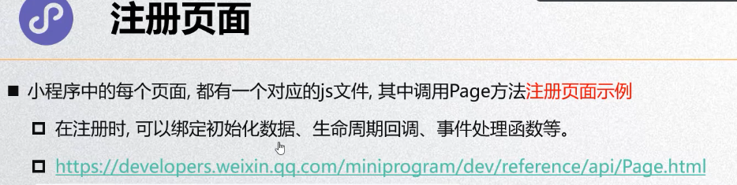
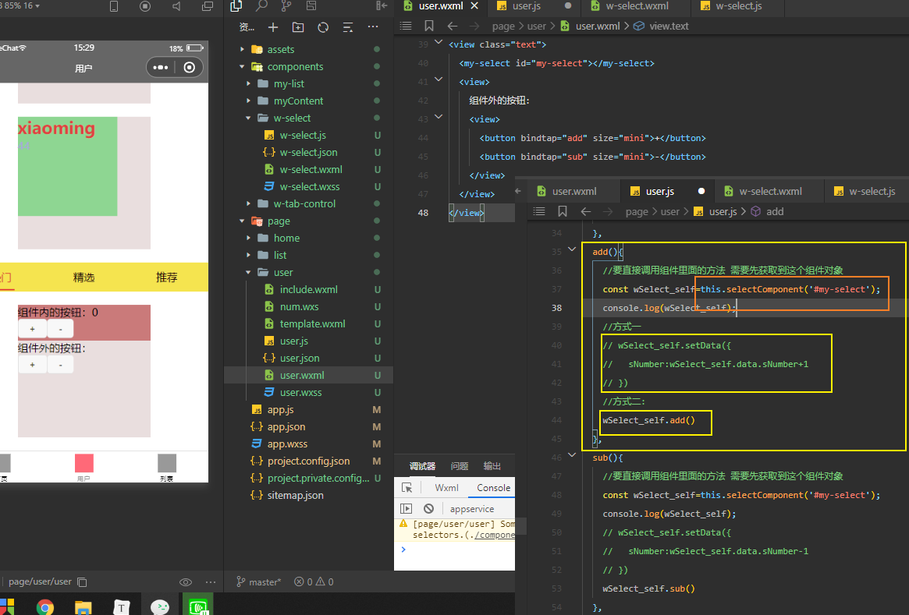
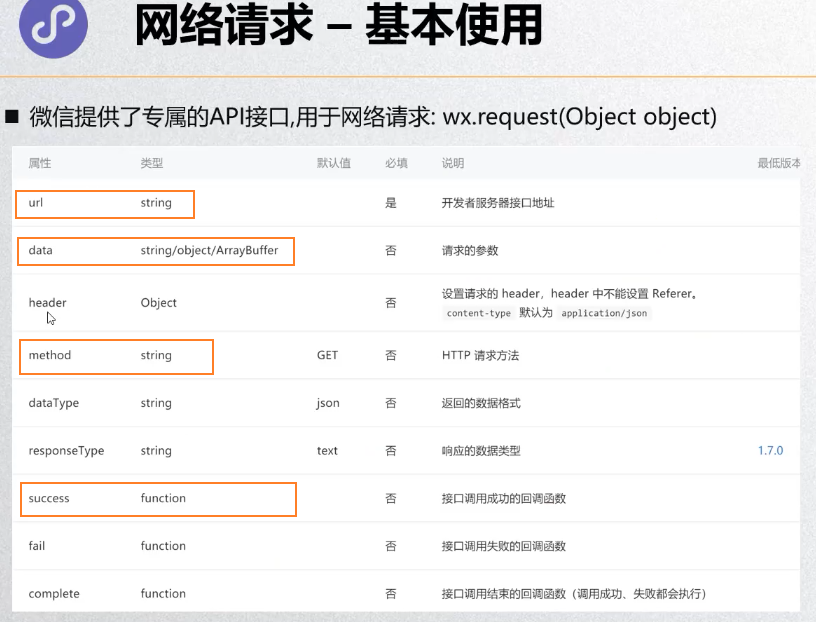
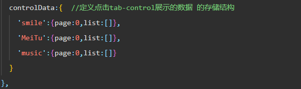
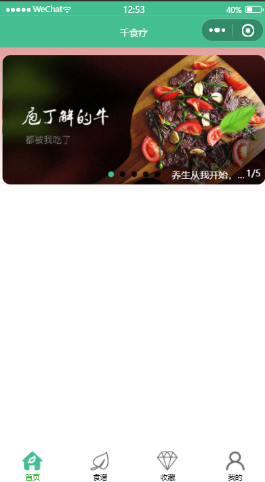

## 一.小程序

### 1.开发准备

~~~
ID:wx1460adf66bc1a241
~~~

### 2.创建应用

**项目管理**：

### 3.基础数据绑定

### 4.小程序的MVVM、配置和架构

#### 1.project和sitemap

#### 2.全局配置app

#### 3.局部配置page

#### 4.小程序双线程模型

#### 5.注册小程序示例

~~~javascript
//注册一个小程序示例  小程序生命周期
App({
  onLaunch: function () { //当小程序初始化完成时，会触发 onLaunch（全局只触发一次）
  },
   
  onShow: function (options) { //当小程序启动，或从后台进入前台显示，会触发 onShow
  },
    
  onHide: function () { //当小程序从前台进入后台，会触发 onHide
  },
   
  onError: function (msg) { //当小程序发生脚本错误，或者 api 调用失败时，会触发 onError 并带上错误信息
  }
})
~~~

#### 5.获取用户信息

~~~javascript
  wx.getUserInfo({  //接口已经废弃 获取到的是匿名数据
      desc: 'desc',
      success:function (res){
        console.log(res);
      },
      fail:function(err){
        console.log(err);
      }
    })
~~~

**新的**API：

#### 6.注册Page时做什么

#### 7.Page生命周期

### 5.内置组件

#### 1.Text组件

#### 2.Button组件

#### 3.View组件

#### 4.Image组件

#### 5.input组件

#### 6.scroll-view ：在小程序中如何实现滚动锚定？

#### 7.组件的共同属性

#### 8. icon组件：关于图标的4个实现方案

内置icon组件、图片、精灵图、矢量字体图标、SVG矢量图片（可以用工具转成base64的字符串作为图片源在小程序中使用）

#### 9.progress组件：如何自定义实现一个环形进度条

~~~HTML
<!--pages/progress/progress.wxml-->
<text>pages/progress/progress.wxml</text>
<progress show-info percent="{{present}}" border-radius="5" activeColor="red" active-mode="forwards" stroke-width="10px" bind:tap="click"></progress>

  data: {
    present:0
  },
  click(e){
    console.log(e);
    // let temp=this.data.present
   setInterval(() => {
    this.setData(
      {
        present:this.data.present>=100?0:this.data.present+2
      }
    )
   }, 300);
  },

/* pages/progress/progress.wxss */
.wx-progress-inner-bar {
  border-radius: 5px;
}
~~~

#### 10.rich-text组件：如何单击预览rich-text中的图片并保存

#### 11.movable-area ，movable-view可移动容器及可移动区域：如何实现单条消息左滑删除功能

~~~html
<movable-area class="movable_area">
  <movable-view class="movable_view" direction="horizontal">
  <view class="movable_view_left">
    123
  </view>
  <view class="movable_view_right">
    456
  </view>
  </movable-view>
</movable-area>

.movable_area {
  width: 750rpx;
  background-color: red;
  height:100rpx;
  line-height: 100rpx;
}
.movable_view {
  width: 950rpx;
}
.movable_view_left {
  float: left;
  width: 750rpx;
  background-color: rgb(104, 94, 94);
}
.movable_view_right {
  float: right;
  width: 200rpx;
  background-color: rgb(219, 209, 209);
}
~~~

#### miniprogram-slide-view 实现左滑删除

~~~
1.在项目目录生成package文件
2.npm install miniprogram-slide-view --save 安装miniprogram-slide-view
3.在小程序工具里面构建npm 
4.引入miniprogram-slide-view组件
~~~

#### 12.小程序weui引入使用 实现左滑删除

~~~
weui是对小程序原生组件的扩展 基于小程序自定义组件构建
1.通过 useExtendedLib 扩展库 的方式引入，这种方式引入的组件将不会计入代码包大小。
2.可以通过npm (opens new window)方式下载构建，npm包名为weui-miniprogram
~~~

~~~html
<mp-slideview buttons="{{slideButtons}}" bindbuttontap="slideButtonTap">
  <view class="weui-slidecell">左滑删除</view>
</mp-slideview>

  /**
   * 生命周期函数--监听页面加载
   */
  onLoad: function (options) {
    this.setData({
      slideButtons: [{
        text: '普通1',
        // src: '/images/icon_love.svg', // icon的路径 也可以使用图标
      },{
        text: '普通2',
        extClass: 'test',
        // src: '/images/icon_star.svg', // icon的路径
      },{
        type: 'warn',
        text: '警示3',
        extClass: 'test',
          // src: '/images/icon_del.svg', // icon的路径
      }],
  });
  },

  slideButtonTap(e) {
    console.log('slide button tap', e.detail) //返回点击的按钮信息 索引
},
~~~

#### 13.通过wxml-to-canvas 组件实现海报功能

~~~
wxml-to-canvas
小程序内通过静态模板和样式绘制 canvas ，导出图片，可用于生成分享图等场景
npm install wxml-to-canvas --save
~~~

~~~html
//模板文件 demo.js
const wxml = `
<view class="container" >
  <view class="item-box red">
  <text class="text">1234568</text>
  </view>
  <view class="item-box green" >
    <text class="text">yeah!</text>
  </view>
  <view class="item-box blue">
  </view>
</view>
`

const style = {
  container: {
    width: 300,
    height: 200,
    flexDirection: 'row',
    justifyContent: 'space-around',
    backgroundColor: '#ccc',
    alignItems: 'center',
  },
  itemBox: {
    width: 80,
    height: 60,
  },
  red: {
    backgroundColor: '#ff0000'
  },
  green: {
    backgroundColor: '#00ff00'
  },
  blue: {
    backgroundColor: '#0000ff',
    alignItems: 'center',
    justifyContent: 'center',
  },
  text: {
    width: 80,
    height: 60,
    textAlign: 'center',
    verticalAlign: 'middle',
  },
  img: {
    width: 40,
    height: 40,
    borderRadius: 20,
  }
}

module.exports = {
  wxml,
  style
}

<!-- 渲染wxml -->
<view class="page-section">
	<view class="page-section-title">渲染wxml</view>
	<!-- 组件 -->
  <wxml-to-canvas class="widget"></wxml-to-canvas>
  <view class="page-section-title">导出图片</view>
  <!-- 图片 -->
  <image src="{{src}}" style="width: {{width}}px; height: {{height}}px"></image>
</view>

<!-- btns -->
<view class="btn-area">
<button type="primary" bindtap="renderToCanvas">渲染到canvas</button>
<button bindtap="extraImage">导出图片</button>
<button bindtap="onTapSaveBtn">保存图片</button>
</view>

const { wxml, style } = require('./demo')
Page({
  data: {
    src: ''
  },
  onLoad() {
    this.widget = this.selectComponent('.widget')   //查找canvas组件
  },
  onTapSaveBtn(e){
    wx.saveImageToPhotosAlbum({
      filePath:this.data.src,
      complete(res) { 
        console.log(res)
      }
    })
  },
  renderToCanvas() {
    const p1 = this.widget.renderToCanvas({ wxml, style })
    p1.then((res) => {
      console.log(res);
      console.log('container', res.layoutBox)
      this.container = res
    })
  },
  extraImage() {
    const p2 = this.widget.canvasToTempFilePath()
    p2.then(res => {
      this.setData({
        src: res.tempFilePath,
        // 设置保存的图片大小 
        width: this.container.layoutBox.width,
        height: this.container.layoutBox.height
      })
    })
  }
})

~~~

### 6.样式（对css的增强）

#### 1.样式的三种写法

#### 2.选择器

#### 3.rpx

#### 4.样式导入

#### 5.WeUI

#### 6.wxml语法-条件判断

#### 7.wxml语法-列表渲染

#### 8.wxml语法-wxml导入（模板）

#### 9.wxs-认识wxs的作用

**WXS应用场景**：

~~~javascript
1.时间日期格式化
2.小数位数处理
~~~

### 7.事件

#### 1.常见的事件类型

#### 2.事件对象的解析

**target和currentTarget的区别：**

**touches和changedTouches的区别**：

#### 3.事件参数的传递

#### 4.事件捕获和冒泡

### 8.组件化

#### 1.自定义组件的过程

#### 2.自定义组件注意事项

#### 3.组件和页面样式细节

#### 4.组件通信

#### 5.自定义事件传递数据

#### 6.tab-control组件练习

~~~javascript
// components/w-tab-control/w-tab-control.wxml
<view class="tab-control">
  <view class="tab-control-item {{currentIndex ==index ? 'active' : ''}}" 
        wx:for="{{titles}}" 
        wx:key="index"
       bindtap="itemClick"
       data-index="{{index}}" //事件的参数传递
		><text>{{item}}</text>
 </view>
</view>

// components/w-tab-control/w-tab-control.js
Component({
  options:{
    styleIsolation:'isolated'
  },
  properties: {
    titles:{
      type:Array,
      value:[]
    }
  },
  data: {
    currentIndex:0 //记录被点击的元素的下标
  },
  methods: {
    itemClick (e){  //自定义事件
      // console.log(e);
      const index=e.currentTarget.dataset.index
      this.setData({
        currentIndex:index
      });
      this.triggerEvent('itemClick',{index})  //通知外部发生了点击
    }
  }
})

/* components/w-tab-control/w-tab-control.wxss */
.tab-control {
  display: flex;
  height: 88rpx;
  line-height: 88rpx;
  color: rgb(24, 5, 5);
  background-color: rgb(245, 228, 79);
}
.tab-control-item {
  flex: 1;
  text-align: center;
}
.active {
  color: rgb(216, 51, 51);
  font-size: 32rpx;
}
.active text{
  border-bottom: 4rpx solid rgb(223, 51, 51);
  padding: 16rpx 8rpx;
}
~~~

#### 7.直接调用组件里面的方法

~~~java
每一个组件里面都有一个selectComponent方法
    this.selectComponent('给组件添加的类或者id')
~~~

~~~javascript
<!--components/w-select/w-select.wxml-->
<view class="view">
  组件内的按钮：{{sNumber}}
  <view>
    <button bindtap="add" size="mini">+</button>
    <button bindtap="sub" size="mini">-</button>
  </view>
</view>

// components/w-select/w-select.js
Component({
  data: {
    sNumber:0
  },
  methods: {
    add(e){
      this.setData({
        sNumber:this.data.sNumber+1
      })
    },
    sub(e){
      this.setData({
        sNumber:this.data.sNumber-1
      })
    }
  }
})
~~~

#### 8.插槽slot的使用

#### 9.Component构造器、组件的生命周期

### 9.网络请求

#### 1.基本使用过程

#### 2.工具函数封装

~~~javascript
// 简洁写法
export default function request(options) {
  return new Promise((resolve,reject)=>{
    wx.request({
      url: options.url,
      method:options.method || "get",
      data:options.data || {},
      success:resolve,  //此处要传入一个回调函数 而 resolve跟reject 本身就是回调函数
      fail:reject
    })
  })
}

request({
    url:"https://api.apiopen.top/getSingleJoke",
    data:{
        sid:28654780
    }
}).then(res=>{
    console.log(res);
}).catch(err=>{
    console.log(err);
})
~~~

### 10.弹窗

~~~javascript
showToast(e) {
    wx.showToast({
      title: 'hello',
      icon:"success",
      image:"../../assets/img/cart_black.png", //image的优先级高于icon
      duration:2000,
      mask:true,  //加上蒙版 避免点击穿透 
      success:function () {
        console.log("ok");
      },
      fail:function () {
        console.log("no");
      },
      complete:function () {  //只要弹窗能够显示 就会触发这个函数
        console.log("action");
      }
    })
  }
~~~

### 11.分享功能

### 12.小程序登录

**第一次登陆**：

**第二次登陆**：

### 13.页面跳转

#### 1.navigator组件的使用

#### 2.跳转过程数据传递

传递数据到跳转页

传递数据到跳转之前的页面

#### 3.通过代码页面跳转

## 项目

### 项目一

#### 1.网络结构划分

#### 2.封装tab-control组件 

~~~javascript
功能实现：可以自定义传入标题 样式 
<!--components/q-tab-control/q-tab-control.wxml-->
<view  class="tab-control tab-out-style">
  <view class="tab-control-item" 
        wx:for="{{title}}" wx:key="index"
        bind:tap="titleClick"   
        data-index="{{index}}" >  //组件的数据传递 只有这样才能在事件对象e中获取到index
    <text class="item-out-style {{currentIndex==index?'active':''}}">{{item}}</text>
  </view>
</view>

// components/q-tab-control/q-tab-control.js
Component({
  options:{
    styleIsolation:"apply-shared"    //设置外部样式可以影响到组件的样式
  },
  externalClasses:['tab-out-style','item-out-style','active'], //定义传入的样式表
  properties: {
    title:{
      type:Array,
      value:[]
    }
  },
  data: {
    currentIndex:0 //记录当前点击对象
  },
  methods: {
    titleClick(e) {
      // console.log(e);
      const index=e.currentTarget.dataset.index
      this.setData({
        currentIndex:index 
      })
      this.triggerEvent('titleClick',{index},{})  //发送定义的事件出去
    }
  }
})
~~~

#### 3.定义control展示的数据存储结构

~~~JavaScript
_getSmileListData(type){
  // 根据存储的数据所存储的页码 请求下一页的数据
  let page=this.data.controlData[type].page+1
  getSmileList(type,page).then(res=>{
    // 1.拿到数据
    let list=res.data.data.list
    // 2.将数据存储到本地data里面 
    let oldList=this.data.controlData[type].list
          oldList.push(...list)  //es6展开运算符 将每一项展开 添加到数组后面
          // console.log(oldList);
    // 3.为了让界面数据更新 只能通过 setdata的方式
    let typeKey=`controlData.${type}.list` //将保存的数据再重新赋值给list 让界面数据更新
    let pageKey=`controlData.${type}.page` //保存页码 下一次请求增加页码 获取新数据
    this.setData({
      [typeKey]:oldList,
      [pageKey]:page  
    })
  }).catch(err=>{
    console.log(err);
  })
},
~~~

#### 4.item封装

#### 5.上拉加载

#### 6.回到顶部

~~~JavaScript
//on page scroll  页面滚动到一定位置 显示backtop
  onPageScroll(options){
    // console.log(options);
    const scrollTop=options.scrollTop
    const temp=scrollTop>=TOP_DISTANS  //TOP_DISTANS=1200 常量
    if(temp!=this.data.showBackTop){  //避免频繁调用setdata 造成页面刷新
      this.setData({
        showBackTop:temp
      })
    }
  },
  //  back top
  backTop(){
    wx.pageScrollTo({
      scrollTop: 0,
      duration:300
    })
  }
~~~

#### 7.tabcontrol 悬停 

~~~html
导航悬停解决方案 设置两个tab-control 一个用于占位
<!-- tab-control -->
  <q-tab-control id="tab-contorl" tab-out-style="tab-out-style"
                item-out-style="item-out-style"
                active="active"
                title="{{['笑话','美图','音乐']}}"
                bind:titleClick="tabTitClick"
                class="{{showTabContorlHover ? 'hover':''}}"></q-tab-control>
<q-tab-control tab-out-style="tab-out-style"
                item-out-style="item-out-style"
                active="active"
                title="{{['笑话','美图','音乐']}}"
               wx:if="{{showTabContorlHover}}"></q-tab-control>              
</view>
~~~

~~~JavaScript
imgLoad(){ //图片加载完成 获取tab-contorl 距离顶部的真实位置
    if(!this.data.isImgLoad){
      console.log("img load ok");
      // this.triggerEvent() 不会频繁执行
      this.data.isImgLoad=true;
      wx.createSelectorQuery().select('#tab-contorl').boundingClientRect(rect=>{
        // console.log(rect);
        this.data.tabContorlHoverTop=rect.top
      }).exec()  //微信提供的获取元素位置的方法
    }
  },
 //on page scroll  页面滚动到一定位置 显示backtop tab-control悬停
  onPageScroll(options){
    // console.log(options);
    const scrollTop=options.scrollTop
    const flag1=scrollTop>=TOP_DISTANS
    if(flag1!=this.data.showBackTop){  //避免频繁调用setdata 造成页面刷新
      this.setData({
        showBackTop:flag1
      })
    }
    const flag2=scrollTop>=this.data.tabContorlHoverTop
    if(flag2!=this.data.showTabContorlHover){
      this.setData({
        showTabContorlHover:flag2
      })
    }
  }
~~~

### 项目二

#### 1.banner

单行显示 省略号：

三角形绘制：

#### 2.网络封装

~~~JavaScript
//baseurl.js
const baseURL="http://iwenwiki.com:3002/api";
export {
  baseURL
};

// promise 封装
export default function (options) {
  return new Promise((resolve,reject)=>{
    wx.request({
      url:options.url,
      method:options.method || "get",
      data:options.data || {},
      success:resolve,
      fail:reject
    })
  })
}

//home.js
import {baseURL} from "./config.js"
import requset from "./network.js"

export function getBannerData(){
  return  requset({
    url:baseURL+"/banner"
    // url:'http://iwenwiki.com:3002/api/banner'
  })
}
~~~

