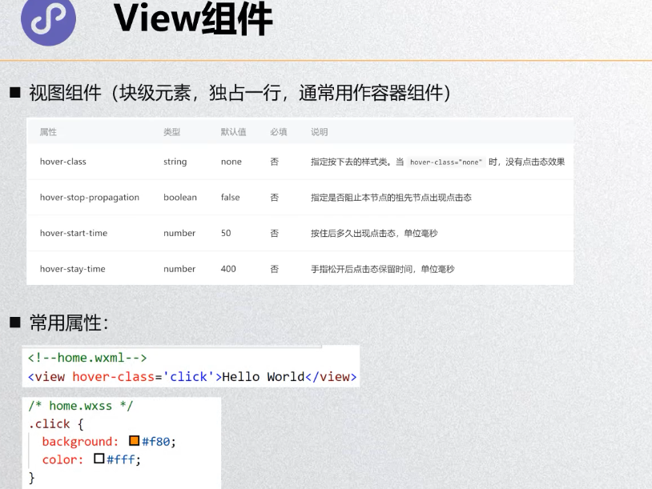
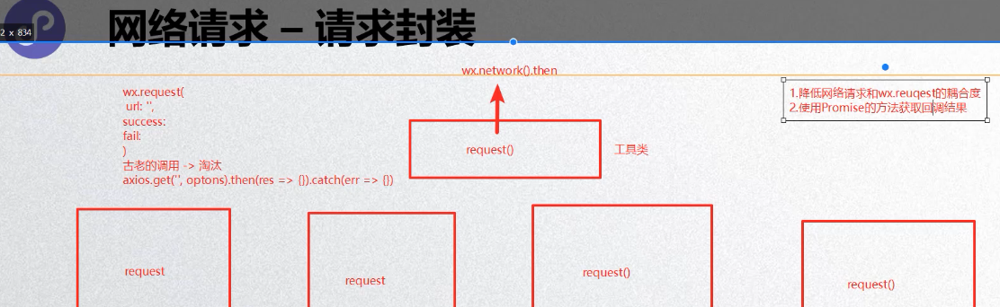

## 一.小程序

### 1.开发准备

~~~
ID:wx1460adf66bc1a241
~~~

### 2.创建应用

**项目管理**：

### 3.基础数据绑定

### 4.小程序的MVVM、配置和架构

#### 1.project和sitemap

#### 2.全局配置app

#### 3.局部配置page

#### 4.小程序双线程模型

#### 5.注册小程序示例

~~~javascript
//注册一个小程序示例  小程序生命周期
App({
  onLaunch: function () { //当小程序初始化完成时，会触发 onLaunch（全局只触发一次）
  },
   
  onShow: function (options) { //当小程序启动，或从后台进入前台显示，会触发 onShow
  },
    
  onHide: function () { //当小程序从前台进入后台，会触发 onHide
  },
   
  onError: function (msg) { //当小程序发生脚本错误，或者 api 调用失败时，会触发 onError 并带上错误信息
  }
})
~~~

#### 5.获取用户信息

~~~javascript
  wx.getUserInfo({  //接口已经废弃 获取到的是匿名数据
      desc: 'desc',
      success:function (res){
        console.log(res);
      },
      fail:function(err){
        console.log(err);
      }
    })
~~~

**新的**API：

#### 6.注册Page时做什么

#### 7.Page生命周期

### 5.内置组件

#### 1.Text组件

#### 2.Button组件

#### 3.View组件

#### 4.Image组件

#### 5.input组件

#### 6.scroll-view

#### 7.组件的共同属性

### 6.样式（对css的增强）

#### 1.样式的三种写法

#### 2.选择器

#### 3.rpx

#### 4.样式导入

#### 5.WeUI

#### 6.wxml语法-条件判断

#### 7.wxml语法-列表渲染

#### 8.wxml语法-wxml导入（模板）

#### 9.wxs-认识wxs的作用

**WXS应用场景**：

~~~javascript
1.时间日期格式化
2.小数位数处理
~~~

### 7.事件

#### 1.常见的事件类型

#### 2.事件对象的解析

**target和currentTarget的区别：**

**touches和changedTouches的区别**：

#### 3.事件参数的传递

#### 4.事件捕获和冒泡

### 8.组件化

#### 1.自定义组件的过程

#### 2.自定义组件注意事项

#### 3.组件和页面样式细节

#### 4.组件通信

#### 5.自定义事件传递数据

#### 6.tab-control组件练习

~~~javascript
// components/w-tab-control/w-tab-control.wxml
<view class="tab-control">
  <view class="tab-control-item {{currentIndex ==index ? 'active' : ''}}" 
        wx:for="{{titles}}" 
        wx:key="index"
       bindtap="itemClick"
       data-index="{{index}}" //事件的参数传递
		><text>{{item}}</text></view>
</view>

// components/w-tab-control/w-tab-control.js
Component({
  options:{
    styleIsolation:'isolated'
  },
  properties: {
    titles:{
      type:Array,
      value:[]
    }
  },
  data: {
    currentIndex:0 //记录被点击的元素的下标
  },
  methods: {
    itemClick (e){  //自定义事件
      // console.log(e);
      const index=e.currentTarget.dataset.index
      this.setData({
        currentIndex:index
      });
      this.triggerEvent('itemClick',{index})  //通知外部发生了点击
    }
  }
})

/* components/w-tab-control/w-tab-control.wxss */
.tab-control {
  display: flex;
  height: 88rpx;
  line-height: 88rpx;
  color: rgb(24, 5, 5);
  background-color: rgb(245, 228, 79);
}
.tab-control-item {
  flex: 1;
  text-align: center;
}
.active {
  color: rgb(216, 51, 51);
  font-size: 32rpx;
}
.active text{
  border-bottom: 4rpx solid rgb(223, 51, 51);
  padding: 16rpx 8rpx;
}
~~~

#### 7.直接调用组件里面的方法

~~~java
每一个组件里面都有一个selectComponent方法
    this.selectComponent('给组件添加的类或者id')
~~~

~~~javascript
<!--components/w-select/w-select.wxml-->
<view class="view">
  组件内的按钮：{{sNumber}}
  <view>
    <button bindtap="add" size="mini">+</button>
    <button bindtap="sub" size="mini">-</button>
  </view>
</view>

// components/w-select/w-select.js
Component({
  data: {
    sNumber:0
  },
  methods: {
    add(e){
      this.setData({
        sNumber:this.data.sNumber+1
      })
    },
    sub(e){
      this.setData({
        sNumber:this.data.sNumber-1
      })
    }
  }
})
~~~

#### 8.插槽slot的使用

#### 9.Component构造器、组件的生命周期

### 9.网络请求

#### 1.基本使用过程

#### 2.工具函数封装

~~~javascript
// 简洁写法
export default function request(options) {
  return new Promise((resolve,reject)=>{
    wx.request({
      url: options.url,
      method:options.method || "get",
      data:options.data || {},
      success:resolve,  //此处要传入一个回调函数 而 resolve跟reject 本身就是回调函数
      fail:reject
    })
  })
}

request({
    url:"https://api.apiopen.top/getSingleJoke",
    data:{
        sid:28654780
    }
}).then(res=>{
    console.log(res);
}).catch(err=>{
    console.log(err);
})
~~~

### 10.弹窗

~~~javascript
showToast(e) {
    wx.showToast({
      title: 'hello',
      icon:"success",
      image:"../../assets/img/cart_black.png", //image的优先级高于icon
      duration:2000,
      mask:true,  //加上蒙版 避免点击穿透 
      success:function () {
        console.log("ok");
      },
      fail:function () {
        console.log("no");
      },
      complete:function () {  //只要弹窗能够显示 就会触发这个函数
        console.log("action");
      }
    })
  }
~~~

### 11.分享功能

### 12.小程序登录

**第一次登陆**：

**第二次登陆**：

### 13.页面跳转

#### 1.navigator组件的使用

